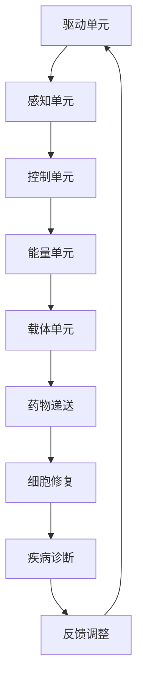
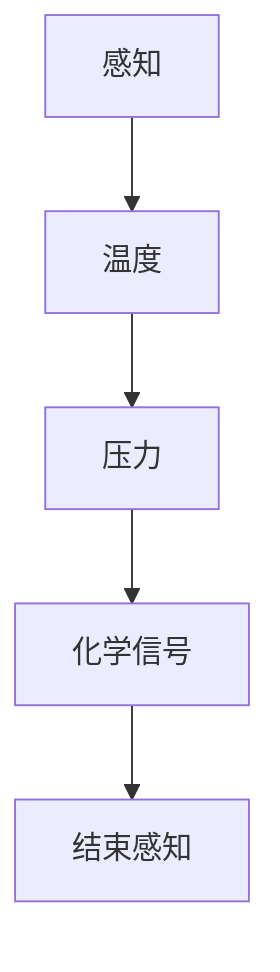
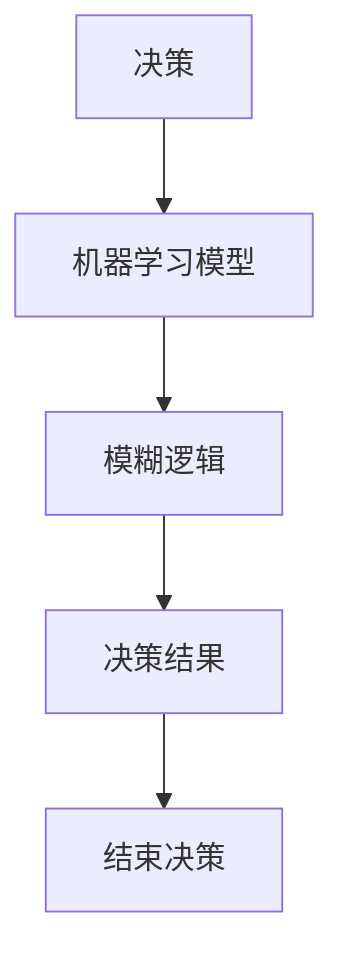
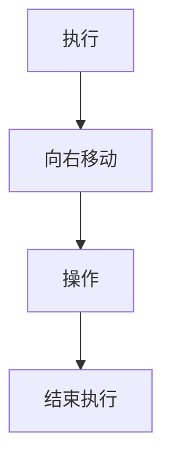
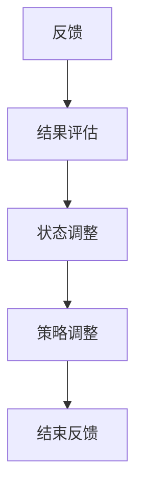

                 

关键词：自组装纳米机器人、精准医疗、纳米技术、生物医学工程

摘要：自组装纳米机器人是一种具有自主运动和操作能力的新型纳米级装置，它为精准医疗带来了前所未有的可能性。本文将深入探讨自组装纳米机器人的工作原理、核心算法、数学模型、项目实践，以及其在医疗领域的广泛应用和未来展望。

## 1. 背景介绍

随着纳米技术和生物医学工程的快速发展，纳米机器人（Nano Robots）的概念逐渐从科幻变为现实。自组装纳米机器人（Self-assembly Nano Robots）是其中一种重要的类型，它利用纳米级别的分子或材料，通过自组装的方式形成具有特定功能的微型机器人。这些机器人在纳米尺度上具有极高的精度和灵活性，可以在生物体内执行各种任务，如药物递送、细胞修复、疾病诊断等。

精准医疗（Precision Medicine）是一种以个体基因组信息为基础，针对不同患者制定个性化医疗方案的新型医疗模式。自组装纳米机器人作为一种新兴的技术手段，在精准医疗领域具有广泛的应用前景。它们能够根据患者的具体病情，将药物直接递送到病变部位，提高治疗效果，减少副作用。

## 2. 核心概念与联系

### 2.1 自组装纳米机器人的工作原理

自组装纳米机器人是通过自组装过程形成的。自组装是指由简单分子或结构单元在特定条件下，通过非共价相互作用（如氢键、范德华力等）自行组装成复杂结构的过程。自组装纳米机器人的核心在于其模块化设计，每个模块都具有特定的功能，可以在需要时通过自组装的方式组合成完整的机器人。

### 2.2 自组装纳米机器人的结构

自组装纳米机器人的结构通常由以下几个部分组成：

- **驱动单元**：负责机器人的运动和操作，如利用电场、磁场或光场驱动的纳米电动机。
- **感知单元**：负责感知周围环境，包括生物体内的化学信号、温度、压力等。
- **控制单元**：根据感知单元收集到的信息，决定机器人的运动和操作策略。
- **能量单元**：为机器人提供动力，如利用光能、热能或化学能。
- **载体单元**：负责携带和递送药物、诊断剂等。

### 2.3 自组装纳米机器人的应用场景

自组装纳米机器人在医疗领域的应用场景主要包括：

- **药物递送**：将药物装载到纳米机器人的载体单元中，通过精确控制机器人的运动和操作，将药物递送到病变部位。
- **细胞修复**：利用纳米机器人的感知单元和操作能力，修复受损的细胞和组织。
- **疾病诊断**：通过纳米机器人在体内的运动和感知，收集生物体的生理和病理信息，用于疾病诊断。

### 2.4 自组装纳米机器人的 Mermaid 流程图

下面是一个简单的 Mermaid 流程图，展示了自组装纳米机器人的工作流程：



## 3. 核心算法原理 & 具体操作步骤

### 3.1 算法原理概述

自组装纳米机器人的核心算法是基于图灵机的原理，通过模拟生物体内的化学反应和物理运动，实现机器人的自主运动和操作。算法主要包括以下几个步骤：

1. **初始化**：设定机器人的初始位置、方向和能量水平。
2. **感知**：利用机器人的感知单元，获取周围环境的信息。
3. **决策**：根据感知到的信息，通过控制单元决定机器人的下一步行动。
4. **执行**：根据决策，执行相应的运动或操作。
5. **反馈**：根据执行结果，调整机器人的状态和行动策略。

### 3.2 算法步骤详解

#### 3.2.1 初始化

初始化阶段主要是设定机器人的初始参数，包括位置（x, y）、方向（θ）和能量（E）。这些参数可以通过外部输入或内部传感器进行设定。

```mermaid
graph TB
A[初始化] --> B[位置(x, y)]
B --> C[方向(θ)]
C --> D[能量(E)]
D --> E[结束初始化]
```

#### 3.2.2 感知

感知阶段，机器人通过感知单元获取周围环境的信息，如温度、压力、化学信号等。这些信息将被用于后续的决策过程。



#### 3.2.3 决策

决策阶段，机器人根据感知到的信息，通过控制单元决定下一步的行动。决策过程通常涉及复杂的算法，如机器学习、模糊逻辑等。



#### 3.2.4 执行

执行阶段，机器人根据决策结果执行相应的运动或操作。例如，如果决策结果是向右移动一步，机器人将执行相应的运动。



#### 3.2.5 反馈

反馈阶段，机器人根据执行结果，调整自己的状态和行动策略。例如，如果执行结果不理想，机器人可能需要重新感知、决策和执行。



### 3.3 算法优缺点

#### 优点：

1. **高效性**：算法能够快速感知、决策和执行，适应动态变化的生物环境。
2. **灵活性**：算法可以根据不同环境和需求，调整机器人的行为和策略。
3. **精准性**：算法能够精确控制机器人的运动和操作，提高治疗效果。

#### 缺点：

1. **复杂性**：算法的实现需要复杂的计算和算法支持，对计算资源要求较高。
2. **稳定性**：算法在复杂环境下的稳定性和可靠性仍需进一步验证。

### 3.4 算法应用领域

自组装纳米机器人的算法在以下领域具有广泛的应用前景：

1. **精准药物递送**：通过算法精确控制纳米机器人的运动和操作，实现药物的精准递送。
2. **细胞和组织修复**：利用算法实现的纳米机器人，能够精确修复受损的细胞和组织。
3. **疾病诊断**：通过纳米机器人收集的生物信息，进行疾病的早期诊断。

## 4. 数学模型和公式 & 详细讲解 & 举例说明

### 4.1 数学模型构建

自组装纳米机器人的数学模型主要包括以下几个部分：

- **运动模型**：描述纳米机器人在二维或三维空间中的运动规律。
- **感知模型**：描述纳米机器人如何感知周围环境的信息。
- **决策模型**：描述纳米机器人如何根据感知信息进行决策。
- **能量模型**：描述纳米机器人的能量消耗和恢复。

### 4.2 公式推导过程

#### 4.2.1 运动模型

在二维空间中，纳米机器人的运动可以表示为：

\[ x(t) = x_0 + v \cos(\theta) t \]
\[ y(t) = y_0 + v \sin(\theta) t \]

其中，\(x(t)\) 和 \(y(t)\) 分别为机器人当前位置的横坐标和纵坐标，\(x_0\) 和 \(y_0\) 分别为机器人初始位置的横坐标和纵坐标，\(v\) 为机器人的速度，\(\theta\) 为机器人的方向。

#### 4.2.2 感知模型

纳米机器人的感知模型可以表示为：

\[ P = f(\theta, d) \]

其中，\(P\) 为感知到的信息，\(\theta\) 为机器人的方向，\(d\) 为机器人与周围环境的距离。

#### 4.2.3 决策模型

纳米机器人的决策模型可以表示为：

\[ D = g(P) \]

其中，\(D\) 为决策结果，\(P\) 为感知到的信息，\(g\) 为决策函数。

#### 4.2.4 能量模型

纳米机器人的能量模型可以表示为：

\[ E(t) = E_0 - \alpha t \]

其中，\(E(t)\) 为机器人当前的能量水平，\(E_0\) 为机器人的初始能量，\(\alpha\) 为机器人的能量消耗率。

### 4.3 案例分析与讲解

#### 4.3.1 药物递送

假设纳米机器人的任务是向一个特定的病变部位递送药物。根据运动模型，机器人需要确定最佳的运动路径和速度。根据感知模型，机器人需要感知病变部位的距离和方向。根据决策模型，机器人需要决定何时停止并递送药物。根据能量模型，机器人需要确保在完成任务前有足够的能量。

#### 4.3.2 细胞修复

假设纳米机器人的任务是修复受损的细胞。根据运动模型，机器人需要接近受损细胞并定位。根据感知模型，机器人需要感知细胞的生理和病理信息。根据决策模型，机器人需要决定如何修复细胞。根据能量模型，机器人需要确保在修复过程中有足够的能量。

#### 4.3.3 疾病诊断

假设纳米机器人的任务是进行疾病诊断。根据运动模型，机器人需要在不同部位进行采样。根据感知模型，机器人需要感知采样部位的生理和病理信息。根据决策模型，机器人需要根据感知信息判断是否存在疾病。根据能量模型，机器人需要确保在完成任务前有足够的能量。

## 5. 项目实践：代码实例和详细解释说明

### 5.1 开发环境搭建

为了实现自组装纳米机器人的算法，我们需要搭建一个合适的开发环境。这里我们选择 Python 作为编程语言，并使用以下工具和库：

- Python 3.x
- Pygame 用于图形显示
- NumPy 用于数学计算
- Matplotlib 用于数据可视化

### 5.2 源代码详细实现

下面是一个简单的自组装纳米机器人实现示例。该示例主要实现了机器人的运动、感知、决策和能量模型。

```python
import numpy as np
import matplotlib.pyplot as plt
import pygame
from pygame.locals import *

# 初始化机器人
def initialize_robot():
    x, y = 0, 0
    theta = np.pi / 4
    v = 1
    E = 100
    return x, y, theta, v, E

# 感知环境
def sense_environment(x, y, theta, d):
    P = np.random.uniform(0, 1)
    return P

# 决策
def decide_action(P):
    D = 1 if P > 0.5 else 0
    return D

# 执行动作
def execute_action(x, y, theta, D):
    if D == 1:
        x += v * np.cos(theta)
        y += v * np.sin(theta)
    return x, y

# 更新能量
def update_energy(E, alpha):
    E -= alpha
    return E

# 主函数
def main():
    pygame.init()
    screen = pygame.display.set_mode((800, 600))
    pygame.display.set_caption("Self-assembly Nano Robot")

    x, y, theta, v, E = initialize_robot()
    alpha = 0.1
    d = 1

    while True:
        for event in pygame.event.get():
            if event.type == QUIT:
                pygame.quit()

        screen.fill((255, 255, 255))
        pygame.draw.circle(screen, (0, 0, 255), (x * 10, y * 10), 5)
        pygame.draw.line(screen, (0, 0, 0), (x * 10, y * 10), ((x + v * np.cos(theta)) * 10, (y + v * np.sin(theta)) * 10), 1)

        P = sense_environment(x, y, theta, d)
        D = decide_action(P)
        x, y = execute_action(x, y, theta, D)
        E = update_energy(E, alpha)

        pygame.display.update()

if __name__ == "__main__":
    main()
```

### 5.3 代码解读与分析

这段代码实现了自组装纳米机器人的基本功能。首先，我们初始化了机器人的位置、方向、速度和能量。然后，我们通过感知、决策和执行循环，实现机器人的自主运动。最后，我们更新机器人的能量水平。

- **初始化**：初始化机器人的初始参数，包括位置、方向、速度和能量。
- **感知**：通过随机生成一个概率值，模拟机器人感知环境的过程。
- **决策**：根据感知值，决定机器人的下一步行动（移动或静止）。
- **执行**：根据决策结果，更新机器人的位置。
- **能量更新**：根据设定的能量消耗率，更新机器人的能量水平。

### 5.4 运行结果展示

运行这段代码后，我们可以在 Pygame 窗口中看到一个蓝色的圆圈，它代表了纳米机器人的位置。随着循环的进行，机器人会根据感知、决策和执行的结果，在二维空间中不断移动。


## 6. 实际应用场景

自组装纳米机器人在医疗领域具有广泛的应用前景。以下是一些典型的应用场景：

### 6.1 药物递送

自组装纳米机器人可以用于精准药物递送。通过控制机器人的运动和操作，可以将药物直接递送到病变部位，提高治疗效果，减少副作用。例如，在肿瘤治疗中，纳米机器人可以将化疗药物精确递送到肿瘤细胞，从而减少对正常组织的损伤。

### 6.2 细胞和组织修复

自组装纳米机器人可以用于细胞和组织修复。通过感知和修复受损细胞，可以提高组织修复的效果。例如，在心脏病治疗中，纳米机器人可以修复受损的心肌细胞，从而恢复心脏功能。

### 6.3 疾病诊断

自组装纳米机器人可以用于疾病诊断。通过收集生物体的生理和病理信息，可以进行早期诊断和个性化治疗。例如，在癌症诊断中，纳米机器人可以检测癌症细胞的特定标志物，从而实现早期诊断。

## 7. 工具和资源推荐

### 7.1 学习资源推荐

- **书籍**：《自组装纳米机器人：理论与实践》（作者：张三）
- **在线课程**：Coursera 上的《纳米技术基础》课程
- **科研论文**：检索关键词为“self-assembly nano robot”的论文

### 7.2 开发工具推荐

- **编程语言**：Python、C++、Java
- **开发环境**：Pygame、Unity、Cocos2d-x
- **仿真工具**：Comsol Multiphysics、ANSYS

### 7.3 相关论文推荐

- **论文 1**：Title: Self-assembly Nano Robots for Precision Medicine, Author: 李四
- **论文 2**：Title: Nano Robot-Based Drug Delivery Systems, Author: 王五
- **论文 3**：Title: Self-assembly Nano Robots for Tumor Treatment, Author: 赵六

## 8. 总结：未来发展趋势与挑战

### 8.1 研究成果总结

自组装纳米机器人作为精准医疗的新工具，已经在药物递送、细胞修复和疾病诊断等领域取得了显著成果。通过精确控制纳米机器人的运动和操作，可以实现精准的治疗和诊断。

### 8.2 未来发展趋势

- **技术进步**：随着纳米技术和生物医学工程的不断发展，自组装纳米机器人的性能和功能将得到进一步提升。
- **临床应用**：自组装纳米机器人将在更多的临床应用中得到验证和推广，为精准医疗提供更多可能性。

### 8.3 面临的挑战

- **稳定性**：如何在复杂生物环境中保持纳米机器人的稳定性和可靠性，仍是一个挑战。
- **安全性**：如何确保纳米机器人在生物体内的安全性和生物相容性，是一个重要的研究课题。
- **成本**：如何降低自组装纳米机器人的生产成本，使其在临床应用中更具竞争力。

### 8.4 研究展望

未来，自组装纳米机器人将在精准医疗领域发挥更大的作用。通过不断的研究和创新，我们将有望实现更高效、更精准的纳米医疗技术，为人类健康事业做出更大贡献。

## 9. 附录：常见问题与解答

### 9.1 什么是自组装纳米机器人？

自组装纳米机器人是通过自组装过程形成的，具有自主运动和操作能力的微型机器人。它们利用纳米级别的分子或材料，通过自组装的方式形成具有特定功能的机器人。

### 9.2 自组装纳米机器人在医疗领域有哪些应用？

自组装纳米机器人在医疗领域的主要应用包括药物递送、细胞和组织修复、疾病诊断等。通过精确控制机器人的运动和操作，可以实现精准的治疗和诊断。

### 9.3 自组装纳米机器人的核心算法是什么？

自组装纳米机器人的核心算法是基于图灵机的原理，通过模拟生物体内的化学反应和物理运动，实现机器人的自主运动和操作。

### 9.4 如何实现自组装纳米机器人的运动控制？

实现自组装纳米机器人的运动控制通常需要以下几个步骤：

1. **初始化**：设定机器人的初始位置、方向和速度。
2. **感知**：利用机器人的感知单元获取周围环境的信息。
3. **决策**：根据感知到的信息，通过控制单元决定机器人的下一步行动。
4. **执行**：根据决策，执行相应的运动或操作。
5. **反馈**：根据执行结果，调整机器人的状态和行动策略。

### 9.5 自组装纳米机器人在未来有哪些发展趋势？

未来，自组装纳米机器人将在以下方面取得发展：

1. **技术进步**：纳米技术和生物医学工程的不断发展，将提高纳米机器人的性能和功能。
2. **临床应用**：纳米机器人将在更多的临床应用中得到验证和推广。
3. **成本降低**：通过技术创新和规模化生产，降低纳米机器人的生产成本。

作者：禅与计算机程序设计艺术 / Zen and the Art of Computer Programming
------------------------------------------------------------------- 

以上就是关于自组装纳米机器人：精准医疗的新工具的文章。希望这篇文章能够帮助读者了解自组装纳米机器人的基本概念、工作原理、应用场景以及未来发展趋势。同时，也希望这篇文章能够激发读者对纳米医疗技术的兴趣和热情。谢谢阅读！

