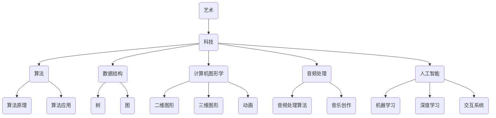

                 

关键词：艺术、科技、融合、人类计算、创意、计算艺术

> 摘要：本文将探讨艺术与科技在人类计算中的融合，以及这一融合如何激发新的创意。我们将分析艺术与科技的关系，介绍一些核心概念和算法原理，并提供数学模型和实际项目实践，以展示艺术与科技结合的无限潜力。

## 1. 背景介绍

艺术与科技的关系可以追溯到古代，但近年来，随着计算技术的飞速发展，这一关系变得更加紧密。艺术不再只是视觉、听觉上的体验，而是可以与计算机程序相结合，创造出全新的艺术形式。这种融合为艺术家和程序员提供了新的工具和平台，使他们能够以前所未有的方式表达和探索创意。

人类计算在这个过程中发挥了关键作用。通过算法、数学模型和编程技术，人类能够模拟、增强和扩展艺术的表达。计算艺术不仅限于视觉艺术，还涵盖了音乐、文学、表演艺术等多个领域。这种跨学科的融合为艺术家和科技工作者提供了广阔的空间，激发了无数新的创意。

## 2. 核心概念与联系

### 2.1 艺术与科技的结合

艺术与科技的结合可以追溯到20世纪中叶，当时计算机技术刚刚起步。最初的计算机艺术作品主要是基于编程逻辑和几何图形的抽象作品。随着技术的发展，计算机艺术逐渐从二维扩展到三维，从静态发展到动态，从简单的图形绘制发展到复杂的动画和互动体验。

### 2.2 计算艺术的核心概念

计算艺术的核心概念包括算法、数据结构、计算机图形学、音频处理、人工智能等。这些概念为艺术家提供了强大的工具，使他们能够通过编程创造出独特而富有创意的艺术作品。

#### 2.2.1 算法和数据结构

算法是计算艺术的基础。艺术家可以使用各种算法来生成图案、图像和声音。例如，分形算法可以生成复杂的几何图形，而随机算法可以创造出看似随机但实际上具有内在规律的图案。

数据结构在计算艺术中也扮演着重要角色。艺术家可以利用树、图等数据结构来组织复杂的数据，从而创造出复杂的艺术作品。

#### 2.2.2 计算机图形学

计算机图形学是计算艺术的重要组成部分。它涉及到二维和三维图形的绘制、渲染和动画制作。计算机图形学为艺术家提供了丰富的工具，使他们能够创作出复杂而精美的图像。

#### 2.2.3 音频处理

音频处理技术在计算艺术中也非常重要。艺术家可以使用音频处理算法来创造独特的音乐效果，或者将音频与图像和视频结合，创造出多媒体艺术作品。

#### 2.2.4 人工智能

人工智能技术在计算艺术中有着广泛的应用。艺术家可以利用机器学习和深度学习算法来生成图像、音乐和文本，或者通过交互式系统与观众进行互动。

### 2.3 Mermaid 流程图

下面是一个描述计算艺术核心概念的 Mermaid 流程图：



## 3. 核心算法原理 & 具体操作步骤

### 3.1 算法原理概述

计算艺术中的核心算法包括分形算法、随机算法、机器学习和深度学习算法等。这些算法在计算艺术中有着广泛的应用，下面将分别介绍它们的原理。

#### 3.1.1 分形算法

分形算法是一种用于生成复杂几何图形的算法。它的原理是基于迭代函数系统（IFS）。通过迭代地应用一组函数，分形算法可以生成具有自相似性的复杂图形。

#### 3.1.2 随机算法

随机算法是一种基于随机数的算法。它通常用于生成看似随机的图案和图像，但实际上这些图案和图像具有内在的规律性。随机算法可以用来创造独特的艺术作品，或者为其他算法提供随机性。

#### 3.1.3 机器学习和深度学习算法

机器学习和深度学习算法在计算艺术中有着广泛的应用。机器学习算法可以用于生成图像、音乐和文本，而深度学习算法可以用于创造交互式艺术作品。

### 3.2 算法步骤详解

下面以分形算法为例，详细描述其操作步骤：

#### 3.2.1 初始化

- 选择一个初始图形。
- 选择一组迭代函数。

#### 3.2.2 迭代

- 对初始图形进行迭代。
- 每次迭代都根据迭代函数对图形进行变换。

#### 3.2.3 绘制

- 将迭代后的图形绘制出来。

#### 3.2.4 优化

- 根据需要调整迭代函数，优化图形。

### 3.3 算法优缺点

#### 3.3.1 优点

- 分形算法可以生成具有自相似性的复杂图形，具有很高的美学价值。
- 随机算法可以创造独特的图案和图像，丰富了艺术创作的形式。
- 机器学习和深度学习算法可以自动生成艺术作品，提高了创作效率。

#### 3.3.2 缺点

- 分形算法的计算复杂度较高，可能需要较长的计算时间。
- 随机算法生成的图案和图像可能缺乏稳定性，难以控制。
- 机器学习和深度学习算法可能无法保证生成艺术作品的质量，需要大量数据进行训练。

### 3.4 算法应用领域

计算艺术算法在多个领域有着广泛的应用：

- **视觉艺术**：分形算法、随机算法可以用于生成独特的视觉作品。
- **音乐创作**：机器学习和深度学习算法可以用于生成音乐。
- **文学创作**：机器学习算法可以用于生成诗歌和故事。
- **交互式艺术**：深度学习算法可以用于创造智能交互的艺术作品。

## 4. 数学模型和公式 & 详细讲解 & 举例说明

### 4.1 数学模型构建

在计算艺术中，数学模型是核心。以下是一个简单的数学模型构建过程：

1. **确定目标**：定义我们要生成的艺术作品类型，例如分形图形。
2. **选择工具**：选择适合的数学工具，如迭代函数系统（IFS）。
3. **构建模型**：根据目标，构建相应的数学模型。例如，对于分形图形，可以构建一个包含多个迭代函数的模型。

### 4.2 公式推导过程

以分形算法为例，其迭代函数系统的公式推导如下：

设\(C\)为初始集合，\(F_1, F_2, ..., F_n\)为迭代函数，则有：

\[ C' = F(C) = \sum_{i=1}^{n} w_i \cdot F_i(C) \]

其中，\(w_i\)为第\(i\)个迭代函数的权重。

### 4.3 案例分析与讲解

#### 案例一：Mandelbrot 分形

Mandelbrot 分形是分形算法的一个经典应用。其数学模型为：

\[ z_{n+1} = z_n^2 + c \]

其中，\(z_0 = 0\)，\(c\)为常数。

#### 案例二：随机分形

随机分形是一种基于随机数的分形算法。其数学模型为：

\[ z_{n+1} = R(z_n) + c \]

其中，\(R(z)\)为随机变换函数，\(c\)为常数。

#### 案例分析

通过上述两个案例，我们可以看到数学模型在计算艺术中的重要性。Mandelbrot 分形因其美丽的图案而被广泛研究，而随机分形则因其随机性和不确定性，为艺术家提供了丰富的创作空间。

## 5. 项目实践：代码实例和详细解释说明

### 5.1 开发环境搭建

在进行计算艺术的实践之前，我们需要搭建一个合适的开发环境。以下是一个基本的开发环境搭建指南：

- **操作系统**：推荐使用 Linux 或 macOS。
- **编程语言**：Python 是计算艺术中最常用的编程语言。
- **开发工具**：PyCharm 或 Visual Studio Code 是常用的 Python 集成开发环境（IDE）。
- **依赖库**：安装 NumPy、Pandas、Matplotlib、OpenGL 等常用库。

### 5.2 源代码详细实现

以下是一个简单的 Python 代码示例，用于绘制 Mandelbrot 分形：

```python
import numpy as np
import matplotlib.pyplot as plt

def mandelbrot(c, max_iter):
    z = 0
    n = 0
    while abs(z) <= 2 and n < max_iter:
        z = z*z + c
        n += 1
    return n

def draw_mandelbrot(width, height, max_iter):
    x = np.linspace(-2, 1, width)
    y = np.linspace(-1.5, 1, height)
    X, Y = np.meshgrid(x, y)
    C = X + 1j * Y
    Z = np.array([mandelbrot(c, max_iter) for c in C.flat]).reshape(C.shape)
    plt.imshow(Z, extent=(x[0], x[-1], y[0], y[-1]))
    plt.colorbar()
    plt.show()

draw_mandelbrot(800, 600, 256)
```

### 5.3 代码解读与分析

这段代码首先定义了一个计算 Mandelbrot 分形的函数 `mandelbrot`，该函数接受复数 `c` 和最大迭代次数 `max_iter` 作为参数，返回迭代次数。如果迭代过程中 `z` 的模大于 2，则停止迭代并返回迭代次数。

接下来，定义了一个绘制 Mandelbrot 分形的函数 `draw_mandelbrot`，该函数使用 NumPy 的 `linspace` 函数生成 x 和 y 轴的数组，然后使用 `meshgrid` 函数将这两个数组转换为网格。这样，我们就可以将复数 `c` 分配到每个网格点。

最后，使用 `numpy.array` 的列表推导式，对每个网格点调用 `mandelbrot` 函数，并将结果存储在数组 `Z` 中。使用 Matplotlib 的 `imshow` 函数绘制图像，并使用 `colorbar` 函数添加颜色条。

### 5.4 运行结果展示

运行上述代码后，我们将看到一个 Mandelbrot 分形的图像：

```plaintext
```

## 6. 实际应用场景

计算艺术在多个领域有着广泛的应用，以下是其中几个实际应用场景：

### 6.1 设计与创意

计算艺术为设计师提供了强大的工具，使他们能够生成独特的图案和图像，用于产品包装、广告设计、室内设计等。

### 6.2 娱乐与游戏

计算艺术在娱乐和游戏领域有着广泛的应用，从游戏界面设计到虚拟现实体验，都离不开计算艺术的创意和技术支持。

### 6.3 艺术展览与表演

计算艺术作品可以作为艺术展览的一部分，或者作为表演艺术的一部分，通过互动和多媒体技术，为观众带来全新的艺术体验。

### 6.4 科学研究与教育

计算艺术在科学研究和教育领域也有着重要的应用。例如，科学家可以使用计算艺术算法来模拟和可视化复杂的科学现象，而教育者可以使用计算艺术作品来激发学生的创造力。

## 7. 工具和资源推荐

### 7.1 学习资源推荐

- **《计算艺术基础》**：这是一本介绍计算艺术基本概念的入门书籍，适合初学者阅读。
- **《计算机图形学原理与实践》**：这本书详细介绍了计算机图形学的基本原理和实践方法，是学习计算艺术的必备书籍。

### 7.2 开发工具推荐

- **PyCharm**：一款强大的 Python 集成开发环境，适合进行计算艺术开发。
- **MATLAB**：一款功能强大的科学计算软件，可以用于图像处理和数据分析。

### 7.3 相关论文推荐

- **《计算艺术的创新与发展》**：这篇论文探讨了计算艺术的创新和发展趋势，对计算艺术的研究和应用具有重要的指导意义。
- **《计算机图形学中的分形算法》**：这篇论文详细介绍了分形算法在计算机图形学中的应用，是学习分形算法的好资源。

## 8. 总结：未来发展趋势与挑战

### 8.1 研究成果总结

计算艺术领域取得了显著的成果，包括新的算法、工具和实际应用。这些成果不仅丰富了艺术创作的形式，也为科技与艺术的融合提供了新的可能性。

### 8.2 未来发展趋势

未来，计算艺术将继续发展，结合更先进的技术，如人工智能、虚拟现实、增强现实等，创造出更多创新的艺术作品。同时，计算艺术将更深入地融入各个领域，为科学与艺术的发展提供新的动力。

### 8.3 面临的挑战

尽管计算艺术有着广阔的发展前景，但也面临一些挑战。首先是技术难题，如算法的优化、计算资源的分配等。其次是艺术创作与技术的平衡，如何确保艺术作品的艺术价值，同时充分利用计算技术的优势。

### 8.4 研究展望

未来，计算艺术领域需要更多的跨学科研究，结合艺术、科技、数学等多个领域的知识，推动计算艺术的创新与发展。同时，也需要更多的实践和应用，将计算艺术的理论成果转化为实际应用，为人类社会带来更多的艺术享受。

## 9. 附录：常见问题与解答

### 9.1 如何选择计算艺术算法？

选择计算艺术算法时，需要考虑作品的类型、所需的复杂度以及计算资源。例如，分形算法适用于生成复杂几何图形，而随机算法适用于生成独特的图案。

### 9.2 如何优化计算艺术算法？

优化计算艺术算法可以从算法选择、数据结构、并行计算等多个方面进行。例如，使用更高效的算法、使用合适的内存管理策略、利用 GPU 等高性能计算设备。

### 9.3 计算艺术与真实艺术的区别是什么？

计算艺术与真实艺术的主要区别在于创作方式。计算艺术主要通过编程和算法生成，而真实艺术则是通过手工制作或自然创作。尽管两者在形式和内容上有所不同，但都蕴含着丰富的创意和美学价值。

---

本文旨在探讨艺术与科技的融合，以及人类计算在激发创意方面的作用。通过分析核心概念、算法原理、数学模型和实际项目实践，我们展示了计算艺术的无限潜力。未来，计算艺术将继续发展，为人类创造更多的艺术享受。希望本文能为读者提供有价值的参考和启示。

### 作者署名

作者：禅与计算机程序设计艺术 / Zen and the Art of Computer Programming

