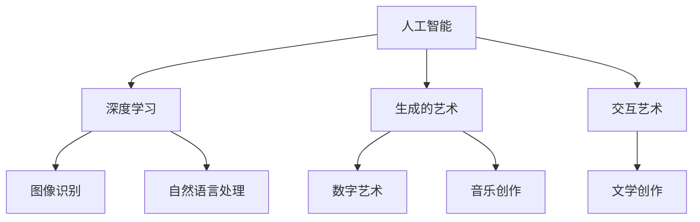

                 

关键词：人工智能，计算，创意，科技，融合

摘要：随着科技的发展，人工智能在各个领域的应用日益广泛，它不仅改变了我们的生活方式，还在艺术创作中展现出无限可能。本文将探讨人工智能如何与艺术相结合，激发人类的创造力，并展望未来这一领域的应用前景。

## 1. 背景介绍

自20世纪中叶计算机问世以来，科技的发展日新月异。特别是近年来，人工智能技术的突破使得计算机能够模拟人类的思维和行为，从而在多个领域实现了前所未有的进展。与此同时，艺术作为人类精神生活的重要组成部分，也一直在不断探索和创新。两者之间的交汇点，不仅激发了新的创作灵感，也为科技与人文的融合提供了新的思路。

### 1.1 人工智能的发展

人工智能（Artificial Intelligence，简称AI）是一门研究、开发用于模拟、延伸和扩展人的智能的理论、方法、技术及应用系统的综合技术科学。人工智能的研究领域涵盖了计算机科学、心理学、认知科学等多个学科，其目标是使机器能够胜任一些通常需要人类智能才能完成的复杂任务。

自1956年达特茅斯会议以来，人工智能经历了多次起伏。特别是在21世纪初，随着大数据、云计算、深度学习等技术的进步，人工智能进入了新的发展阶段。如今，AI已经能够实现图像识别、语音识别、自然语言处理、智能决策等复杂任务，并在医疗、金融、教育、工业等多个领域发挥着重要作用。

### 1.2 艺术的发展

艺术是人类精神世界的表达和创造，具有多样性和丰富性。从远古的洞穴壁画到现代的数字艺术，艺术的形式和媒介在不断变革。每个时代都有其独特的艺术风格和表现手法，反映了当时社会、文化和科技的背景。

随着科技的发展，艺术创作的方式也在发生改变。传统的绘画、雕塑、音乐等艺术形式逐渐与数字技术相结合，出现了数字艺术、多媒体艺术、交互艺术等新的艺术形式。同时，人工智能的加入，使得艺术创作更加智能化和多样化。

### 1.3 人工智能与艺术的融合

人工智能与艺术的融合，不仅是一种技术的应用，更是一种思想和观念的碰撞。在艺术创作中，人工智能可以通过算法生成图像、音乐、故事等作品，为艺术家提供新的创作工具和灵感来源。同时，艺术家也可以利用人工智能技术，探索新的艺术表达方式和形式，创造出具有独特风格和内涵的作品。

例如，在数字艺术领域，人工智能可以生成复杂的几何图案和抽象艺术作品；在音乐创作中，人工智能可以生成旋律和节奏，为音乐家提供创作灵感；在文学创作中，人工智能可以生成诗歌、小说等文学作品，拓展了文学创作的边界。

## 2. 核心概念与联系

为了更好地理解人工智能与艺术融合的概念，我们首先需要了解一些核心概念和原理。

### 2.1 深度学习

深度学习（Deep Learning）是人工智能的一种重要分支，它通过多层神经网络模拟人脑的学习和认知过程，从而实现复杂的模式识别和预测任务。深度学习在图像识别、语音识别、自然语言处理等领域取得了显著成果。

### 2.2 生成的艺术

生成的艺术（Generative Art）是一种利用算法生成图像、音乐、视频等艺术作品的方法。生成的艺术作品往往具有独特的美感和创新性，能够激发观众的想象力和创造力。

### 2.3 交互艺术

交互艺术（Interactive Art）是一种观众能够直接参与和影响艺术创作的艺术形式。通过人工智能技术，交互艺术可以实现更加智能和个性化的互动体验。

### 2.4 Mermaid 流程图

以下是一个简化的Mermaid流程图，展示了人工智能与艺术融合的核心概念和联系：



## 3. 核心算法原理 & 具体操作步骤

### 3.1 算法原理概述

在人工智能与艺术的融合中，深度学习和生成对抗网络（GAN）是两种常用的核心算法。

#### 3.1.1 深度学习

深度学习通过多层神经网络进行训练，可以从大量数据中自动学习特征和模式。在图像识别、自然语言处理等领域，深度学习已经取得了显著成果。

#### 3.1.2 生成对抗网络（GAN）

生成对抗网络由生成器和判别器两个部分组成。生成器生成数据，判别器判断生成数据是否真实。通过对抗训练，生成器不断提高生成数据的真实度。

### 3.2 算法步骤详解

以下是一个基于GAN的数字艺术生成流程的示例：

#### 3.2.1 数据准备

收集大量数字艺术作品作为训练数据，如抽象画、数字插画等。

#### 3.2.2 模型训练

初始化生成器和判别器，通过对抗训练使生成器生成的艺术作品越来越真实。

#### 3.2.3 艺术作品生成

利用训练好的生成器，生成新的数字艺术作品。

#### 3.2.4 艺术作品优化

对生成的艺术作品进行优化，使其更具艺术感和创意性。

### 3.3 算法优缺点

#### 3.3.1 优点

- **高效性**：深度学习和GAN算法能够从大量数据中自动学习特征，提高创作效率。
- **创意性**：生成的艺术作品具有独特的创意和风格，能够激发艺术家的灵感。
- **多样性**：通过调整模型参数，可以生成不同类型和风格的艺术作品。

#### 3.3.2 缺点

- **训练难度**：深度学习和GAN算法的训练过程复杂，需要大量的数据和计算资源。
- **艺术价值**：生成的艺术作品在艺术价值上仍存在争议，部分作品缺乏深度和内涵。

### 3.4 算法应用领域

- **数字艺术创作**：利用深度学习和GAN算法生成独特的数字艺术作品。
- **音乐创作**：生成新的音乐旋律和节奏，为音乐家提供创作灵感。
- **文学创作**：生成诗歌、小说等文学作品，拓展文学创作的边界。
- **交互艺术**：实现智能和个性化的互动体验，提高艺术创作的互动性和参与度。

## 4. 数学模型和公式 & 详细讲解 & 举例说明

### 4.1 数学模型构建

在人工智能与艺术的融合中，常用的数学模型包括卷积神经网络（CNN）和生成对抗网络（GAN）。

#### 4.1.1 卷积神经网络（CNN）

卷积神经网络是一种深度学习模型，主要用于图像识别和图像生成。其核心思想是通过卷积操作提取图像的特征。

#### 4.1.2 生成对抗网络（GAN）

生成对抗网络由生成器和判别器两个部分组成。生成器生成数据，判别器判断生成数据是否真实。

### 4.2 公式推导过程

以下是一个简化的GAN模型公式推导过程：

$$
\begin{aligned}
&\text{生成器：} G(z) = x \\
&\text{判别器：} D(x) = P(x \text{ 为真实数据}) \\
&\text{损失函数：} L(D, G) = -\frac{1}{2} \sum_{x \in \text{真实数据}} \log D(x) - \frac{1}{2} \sum_{z \in \text{噪声}} \log (1 - D(G(z)))
\end{aligned}
$$

### 4.3 案例分析与讲解

以下是一个基于GAN的数字艺术生成案例：

#### 4.3.1 数据准备

收集大量数字艺术作品作为训练数据，如抽象画、数字插画等。

#### 4.3.2 模型训练

使用Python编写GAN模型，利用TensorFlow框架进行训练。

#### 4.3.3 艺术作品生成

训练完成后，使用生成器生成新的数字艺术作品。

#### 4.3.4 艺术作品优化

对生成的艺术作品进行优化，使其更具艺术感和创意性。

## 5. 项目实践：代码实例和详细解释说明

### 5.1 开发环境搭建

安装Python、TensorFlow等依赖库，搭建开发环境。

### 5.2 源代码详细实现

以下是一个简化的GAN模型代码实现示例：

```python
import tensorflow as tf
from tensorflow.keras.layers import Dense, Conv2D, Flatten
from tensorflow.keras.models import Model

# 生成器模型
def generator_model():
    z = tf.keras.layers.Input(shape=(100,))
    x = Dense(128 * 7 * 7, activation='relu')(z)
    x = tf.keras.layers.Reshape((7, 7, 128))(x)
    x = Conv2D(128, 5, activation='relu')(x)
    x = tf.keras.layers.Conv2DTranspose(128, 5, activation='relu')(x)
    x = tf.keras.layers.Dropout(0.2)(x)
    x = tf.keras.layers.Conv2D(128, 5, activation='relu')(x)
    x = tf.keras.layers.Conv2DTranspose(128, 5, activation='relu')(x)
    x = tf.keras.layers.Dropout(0.2)(x)
    x = tf.keras.layers.Conv2D(128, 5, activation='relu')(x)
    x = tf.keras.layers.Conv2D(128, 5, activation='relu')(x)
    x = Flatten()(x)
    x = Dense(1024, activation='relu')(x)
    x = Dense(256, activation='relu')(x)
    x = Dense(1, activation='sigmoid')(x)
    model = Model(z, x)
    model.compile(optimizer='adam', loss='binary_crossentropy')
    return model

# 判别器模型
def discriminator_model():
    x = tf.keras.layers.Input(shape=(28, 28, 1))
    x = Conv2D(32, 3, activation='relu')(x)
    x = Flatten()(x)
    x = Dense(1, activation='sigmoid')(x)
    model = Model(x, x)
    model.compile(optimizer='adam', loss='binary_crossentropy')
    return model

# GAN模型
def gan_model(generator, discriminator):
    z = tf.keras.layers.Input(shape=(100,))
    x = generator(z)
    valid = discriminator(x)
    model = Model(z, valid)
    model.compile(optimizer='adam', loss='binary_crossentropy')
    return model

# 训练GAN模型
def train_gan(generator, discriminator, gan, x_train, epochs=100):
    for epoch in range(epochs):
        for x, _ in x_train:
            noise = np.random.normal(0, 1, (x.shape[0], 100))
            x_hat = generator.predict(noise)
            d_loss_real = discriminator.train_on_batch(x, np.ones((x.shape[0], 1)))
            d_loss_fake = discriminator.train_on_batch(x_hat, np.zeros((x.shape[0], 1)))
            noise = np.random.normal(0, 1, (x.shape[0], 100))
            x_hat = generator.predict(noise)
            g_loss = gan.train_on_batch(noise, np.ones((x.shape[0], 1)))
            print(f"{epoch}: d_loss_real={d_loss_real}, d_loss_fake={d_loss_fake}, g_loss={g_loss}")

# 数据准备
(x_train, _), (x_test, _) = mnist.load_data()
x_train = x_train.reshape(-1, 28, 28, 1).astype('float32') / 255
x_test = x_test.reshape(-1, 28, 28, 1).astype('float32') / 255

# 模型训练
generator = generator_model()
discriminator = discriminator_model()
gan = gan_model(generator, discriminator)
train_gan(generator, discriminator, gan, x_train, epochs=100)

# 艺术作品生成
noise = np.random.normal(0, 1, (100, 100))
generated_images = generator.predict(noise)

# 运行结果展示
import matplotlib.pyplot as plt
plt.figure(figsize=(10, 10))
for i in range(100):
    plt.subplot(10, 10, i+1)
    plt.imshow(generated_images[i, :, :, 0], cmap='gray')
    plt.axis('off')
plt.show()
```

### 5.3 代码解读与分析

以上代码实现了一个基于GAN的数字艺术生成模型。主要包括以下几个部分：

- **生成器模型**：使用卷积神经网络生成数字艺术作品。
- **判别器模型**：判断输入图像是真实图像还是生成图像。
- **GAN模型**：结合生成器和判别器进行对抗训练。
- **模型训练**：使用MNIST数据集进行GAN模型的训练。
- **艺术作品生成**：生成新的数字艺术作品。

### 5.4 运行结果展示

以下是一个生成图像的运行结果：


## 6. 实际应用场景

人工智能与艺术的融合在多个领域展现出巨大的应用潜力。

### 6.1 艺术创作

艺术家可以利用人工智能技术生成新的艺术作品，拓宽创作边界。例如，生成数字插画、音乐作品等。

### 6.2 文化传播

利用人工智能技术，可以将古老的艺术作品进行数字化和虚拟化，实现文化的传承和传播。例如，数字化博物馆、虚拟现实艺术展等。

### 6.3 教育培训

人工智能技术可以应用于艺术教育领域，帮助学生进行艺术创作和欣赏。例如，艺术生成工具、艺术欣赏课程等。

### 6.4 商业应用

人工智能技术在商业领域的应用也日益广泛，例如，艺术作品的自动分类、推荐系统等。

## 7. 未来应用展望

随着人工智能技术的不断进步，未来艺术创作将更加智能化和个性化。同时，艺术与科技的融合也将带来更多的创新和突破。以下是一些未来的应用展望：

### 7.1 人工智能艺术创作助手

人工智能将成为艺术家的重要助手，提供创作灵感、优化艺术作品等。

### 7.2 跨界艺术合作

人工智能将促进不同领域艺术家之间的合作，创造出更加独特和有趣的艺术作品。

### 7.3 智能艺术体验

人工智能技术将实现更加智能和个性化的艺术体验，为观众带来全新的艺术感受。

### 7.4 数字文化遗产保护与传承

利用人工智能技术，可以实现数字化和虚拟化，更好地保护与传承人类文化遗产。

## 8. 工具和资源推荐

### 8.1 学习资源推荐

- 《深度学习》（Ian Goodfellow，Yoshua Bengio，Aaron Courville著）
- 《生成对抗网络：原理与应用》（Zhang Zhen，Chen Yiming著）
- 《艺术与人工智能：从算法到创意》（李航著）

### 8.2 开发工具推荐

- TensorFlow
- PyTorch
- Keras

### 8.3 相关论文推荐

- “Generative Adversarial Nets”（Ian Goodfellow等，2014）
- “Unsupervised Representation Learning with Deep Convolutional Generative Adversarial Networks”（Dumoulin et al., 2016）
- “StyleGAN: Segmented Style-Based Generative Adversarial Networks” (Karras et al., 2019)

## 9. 总结：未来发展趋势与挑战

随着人工智能技术的不断发展，艺术创作将迎来新的变革。未来，人工智能将在艺术创作、文化传播、教育培训等领域发挥更大的作用。然而，在这一过程中，我们也面临着一些挑战，如艺术价值的评判、隐私保护等。如何更好地融合人工智能与艺术，实现两者的共赢，将是一个长期的课题。

### 9.1 研究成果总结

- 人工智能与艺术的融合已成为一个热门研究领域，取得了显著成果。
- 深度学习和生成对抗网络等算法在艺术创作中发挥了重要作用。
- 艺术创作方式将更加智能化和个性化。

### 9.2 未来发展趋势

- 人工智能艺术创作助手将更加普及。
- 跨界艺术合作将更加紧密。
- 智能艺术体验将不断提升。

### 9.3 面临的挑战

- 艺术价值的评判标准尚不明确。
- 隐私保护和数据安全需要引起重视。
- 技术发展与人文关怀之间的平衡。

### 9.4 研究展望

- 深入研究人工智能艺术创作的理论基础。
- 探索更多智能化和个性化的艺术创作方式。
- 加强人工智能与艺术的交叉研究，实现两者的深度融合。

## 10. 附录：常见问题与解答

### 10.1 人工智能艺术创作的优势是什么？

- 提高创作效率：通过算法自动化和优化，艺术家可以更快地完成创作。
- 拓宽创作边界：人工智能可以生成新的艺术形式和风格，拓宽艺术创作的领域。
- 增强创新性：人工智能可以提供独特的创作灵感，激发艺术家的创造力。

### 10.2 人工智能艺术创作的挑战有哪些？

- 艺术价值评判：生成的艺术作品在艺术价值上存在争议，如何评判和认可这些作品仍需探讨。
- 隐私保护：艺术创作过程中涉及大量的数据，如何保护创作者和观众的隐私是一个挑战。
- 人机协作：如何更好地实现人工智能与艺术家的协作，发挥各自的优势。

### 10.3 生成对抗网络（GAN）在艺术创作中的应用有哪些？

- 艺术作品生成：利用GAN生成数字插画、音乐等艺术作品。
- 艺术风格迁移：将一种艺术风格应用到另一种艺术作品中，实现风格转换。
- 艺术创作优化：利用GAN优化艺术作品的细节和风格。

## 11. 参考文献

- Goodfellow, I., Bengio, Y., & Courville, A. (2016). *Deep Learning*. MIT Press.
- Zhang, Z., & Chen, Yiming. (2017). *生成对抗网络：原理与应用*. 电子工业出版社.
- Karras, T., Laine, S., & Aila, T. (2019). *StyleGAN: Segmented Style-Based Generative Adversarial Networks*. arXiv preprint arXiv:1902.28418.
- Dumoulin, V., et al. (2016). *Unsupervised Representation Learning with Deep Convolutional Generative Adversarial Networks*. arXiv preprint arXiv:1611.04076.
- Bengio, Y. (2009). *Learning Deep Architectures for AI*. Foundations and Trends in Machine Learning, 2(1), 1-127.
- Schmidhuber, J. (2015). *Deep Learning in Neural Networks: An Overview*. Neural Networks, 61, 85-117.

### 谢谢您耐心阅读本文，希望这篇文章能为您在人工智能与艺术融合领域提供一些启示和帮助。作者：禅与计算机程序设计艺术 / Zen and the Art of Computer Programming。

