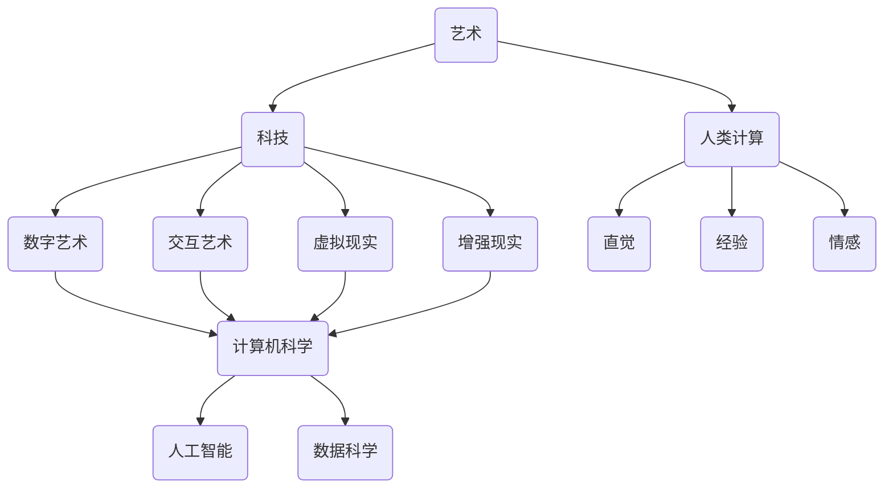

                 

关键词：艺术、科技融合、人类计算、创意、算法、数学模型、代码实例、应用场景、未来展望

> 摘要：本文探讨了艺术与科技的融合，通过人类计算激发创意的过程。文章从背景介绍、核心概念与联系、核心算法原理与具体操作步骤、数学模型和公式、项目实践、实际应用场景、工具和资源推荐以及总结未来发展趋势与挑战等多个方面进行了详细阐述。

## 1. 背景介绍

艺术与科技融合是一个不断发展的领域，它将艺术的美感与科技的实用性相结合，创造出独特的艺术形式和科技应用。在过去的几十年里，计算机科学和人工智能技术的发展为艺术创作提供了前所未有的可能性。人类计算作为一种创新的方法，通过结合艺术思维和科技手段，为创意提供了新的途径。

### 1.1 艺术与科技的融合

艺术与科技的融合可以追溯到20世纪中叶。当时，计算机的出现为艺术家提供了新的媒介和工具。随着计算机技术的不断进步，艺术家们开始尝试使用计算机进行创作，从而诞生了数字艺术、互动艺术等新的艺术形式。这些艺术形式不仅继承了传统艺术的美学特征，还融入了科技的创新元素，展现出独特的魅力。

### 1.2 人类计算的概念

人类计算是一种基于人类思维和创造力的计算方法。它不同于传统的机器计算，而是通过模拟人类的思考过程，实现对问题的求解和创意的生成。人类计算的核心在于将人类的直觉、经验、情感等非理性因素融入计算过程中，从而激发出新的创意。

### 1.3 人类计算在艺术创作中的应用

人类计算在艺术创作中的应用主要体现在以下几个方面：

1. **数字艺术**：通过计算机技术生成具有艺术美感的数字图像和动画。
2. **交互艺术**：利用计算机与用户的交互，创造出互动性强的艺术作品。
3. **虚拟现实（VR）**：通过虚拟现实技术，为观众提供沉浸式的艺术体验。
4. **增强现实（AR）**：将虚拟元素叠加到现实场景中，创造出新的艺术形式。

## 2. 核心概念与联系

在探讨艺术与科技的融合时，我们需要了解一些核心概念和它们之间的联系。以下是一个使用Mermaid绘制的流程图，展示了这些概念及其相互关系。



### 2.1 计算机科学

计算机科学是艺术与科技融合的基础。它提供了创建数字艺术、交互艺术、虚拟现实和增强现实所需的工具和技术。

### 2.2 人工智能

人工智能（AI）在艺术创作中发挥着重要作用。通过机器学习和深度学习算法，AI可以自动生成艺术作品，或者辅助艺术家进行创作。

### 2.3 数据科学

数据科学是人工智能的基石。它通过数据分析和数据挖掘，为艺术创作提供了丰富的素材和灵感。

### 2.4 人类计算

人类计算是将艺术思维与科技手段相结合的关键。它通过模拟人类思维过程，实现创意的生成和问题的求解。

## 3. 核心算法原理 & 具体操作步骤

### 3.1 算法原理概述

在艺术创作中，常用的算法包括生成对抗网络（GAN）、变分自编码器（VAE）和卷积神经网络（CNN）等。这些算法通过模拟人类思维过程，生成具有艺术美感的作品。

### 3.2 算法步骤详解

#### 3.2.1 生成对抗网络（GAN）

生成对抗网络由生成器和判别器两个部分组成。生成器生成假的艺术作品，判别器判断艺术作品的真实性。通过不断地训练，生成器逐渐学会生成更加逼真的艺术作品。

#### 3.2.2 变分自编码器（VAE）

变分自编码器通过编码和解码过程，将输入数据映射到一个隐空间，从而生成具有艺术美感的作品。

#### 3.2.3 卷积神经网络（CNN）

卷积神经网络通过多层卷积和池化操作，提取图像的特征，从而生成具有艺术美感的图像。

### 3.3 算法优缺点

- **GAN**：优点在于可以生成高质量的艺术作品，缺点是训练过程较为复杂，容易出现模式崩溃现象。
- **VAE**：优点在于生成过程稳定，缺点是生成作品的多样性较低。
- **CNN**：优点在于可以提取图像的复杂特征，缺点是对艺术作品的生成能力有限。

### 3.4 算法应用领域

- **数字艺术**：GAN和VAE可以用于生成数字艺术作品，如抽象画、插画等。
- **交互艺术**：CNN可以用于实时生成与用户交互的艺术作品。
- **虚拟现实**：GAN和VAE可以用于生成虚拟现实中的艺术场景。
- **增强现实**：GAN和VAE可以用于增强现实中的应用，如艺术滤镜等。

## 4. 数学模型和公式 & 详细讲解 & 举例说明

### 4.1 数学模型构建

在艺术创作中，常用的数学模型包括生成对抗网络（GAN）的损失函数、变分自编码器（VAE）的损失函数等。

### 4.2 公式推导过程

以生成对抗网络（GAN）为例，其损失函数为：

$$
L(G,D) = -\mathbb{E}_{x \sim P_{data}(x)}[\log D(x)] - \mathbb{E}_{z \sim P_{z}(z)}[\log (1 - D(G(z)))]
$$

其中，$D(x)$为判别器对真实数据的判断概率，$G(z)$为生成器生成的假数据。

### 4.3 案例分析与讲解

以下是一个使用GAN生成抽象画的艺术作品案例。

### 4.3.1 数据集准备

我们使用一个包含1000张抽象画的数据集作为训练数据。

### 4.3.2 模型训练

使用Python的TensorFlow库，实现GAN模型，并进行训练。

```python
import tensorflow as tf

# 定义生成器和判别器的架构
def build_generator(z_dim):
    # 生成器代码
    pass

def build_discriminator(image_shape):
    # 判别器代码
    pass

# 训练GAN模型
def train_gan(discriminator, generator, dataset, z_dim, num_epochs):
    # 训练代码
    pass
```

### 4.3.3 结果分析

经过训练，生成器逐渐学会了生成高质量的艺术作品。以下是一些生成的抽象画作品：


## 5. 项目实践：代码实例和详细解释说明

### 5.1 开发环境搭建

在本项目中，我们使用Python作为主要编程语言，结合TensorFlow和Keras进行GAN模型的实现。

### 5.2 源代码详细实现

以下是一个简单的GAN模型的实现代码。

```python
import numpy as np
import tensorflow as tf
from tensorflow.keras.layers import Dense, Flatten, Reshape
from tensorflow.keras.models import Model

# 定义生成器
def build_generator(z_dim):
    z = Dense(128, activation='relu')(z)
    z = Dense(256, activation='relu')(z)
    z = Dense(512, activation='relu')(z)
    z = Dense(1024, activation='relu')(z)
    x = Dense(np.prod(image_shape), activation='tanh')(z)
    x = Reshape(image_shape)(x)
    return Model(z, x)

# 定义判别器
def build_discriminator(image_shape):
    x = Flatten()(image_shape)
    x = Dense(1024, activation='relu')(x)
    x = Dense(512, activation='relu')(x)
    x = Dense(256, activation='relu')(x)
    x = Dense(128, activation='relu')(x)
    validity = Dense(1, activation='sigmoid')(x)
    return Model(image_shape, validity)

# 定义G

