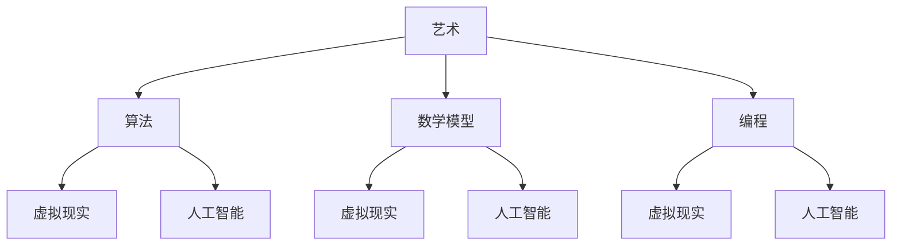
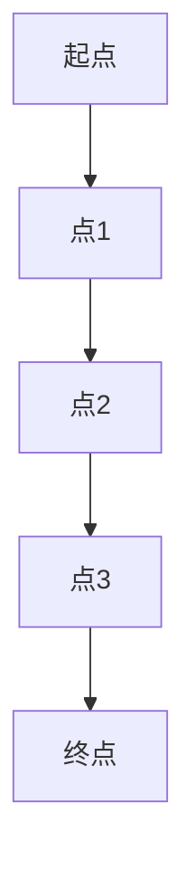
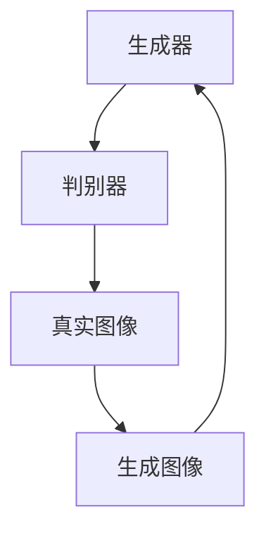

                 

关键词：艺术，科技，人类计算，创意，融合，算法，数学模型，编程，未来应用

> 摘要：本文旨在探讨艺术与科技融合对于激发人类计算创意的潜力。通过分析艺术与科技的相互关系，以及人类计算在艺术创作中的应用，本文揭示了艺术与科技融合的重要性。同时，本文还探讨了核心算法原理、数学模型以及项目实践等方面的内容，为读者提供了关于艺术与科技融合的深度见解。

## 1. 背景介绍

艺术与科技自古以来便有着紧密的联系。在古希腊时期，哲学家亚里士多德曾提出：“艺术是一种模仿，模仿现实中的事物。”而科技则是通过模拟、计算和构建来创造现实。随着计算机技术的不断发展，人类计算在艺术创作中的应用越来越广泛，从计算机图形学、虚拟现实到人工智能，科技与艺术的融合正在成为新的趋势。

### 1.1 艺术与科技的定义

艺术：艺术是一种表达情感、思想和审美感受的形式，通过视觉、听觉、触觉等多种感官体验来传达信息。艺术作品可以包括绘画、雕塑、音乐、舞蹈等。

科技：科技是利用科学知识来创造、设计、改进和应用工具、系统和过程的技术。科技包括计算机科学、信息技术、人工智能、生物工程等领域。

### 1.2 艺术与科技的关系

艺术与科技的关系可以追溯到古代。例如，古希腊的雕塑作品《掷铁饼者》就运用了力学原理。而在现代，计算机科技的发展使得艺术创作更加丰富多样。例如，计算机图形学使得动画、电影、游戏等艺术形式得以实现。人工智能技术的崛起，更是为艺术创作带来了全新的可能性。

### 1.3 人类计算的定义

人类计算：人类计算是指人类利用计算机技术进行计算和分析的过程。它涉及到编程、算法设计、数据分析等多个方面。人类计算能够提高工作效率，解决复杂问题，为各个领域提供支持。

### 1.4 人类计算在艺术创作中的应用

人类计算在艺术创作中的应用主要表现在以下几个方面：

1. **计算机图形学**：计算机图形学利用计算机生成和处理图像，使得艺术创作更加丰富多样。例如，3D建模、渲染技术等。

2. **虚拟现实**：虚拟现实技术使得艺术家能够创造沉浸式的艺术体验。例如，虚拟博物馆、虚拟展览等。

3. **人工智能**：人工智能技术可以用于生成艺术作品，如音乐、绘画等。例如，DeepArt和GAN（生成对抗网络）等技术的应用。

## 2. 核心概念与联系

为了更好地理解艺术与科技的融合，我们需要探讨一些核心概念和它们之间的关系。

### 2.1 艺术与科技的核心概念

- **算法**：算法是解决特定问题的步骤和规则。在艺术创作中，算法可以用于生成图像、音乐等。

- **数学模型**：数学模型是对现实世界的抽象描述，通过数学公式来表示。在艺术创作中，数学模型可以用于生成形状、颜色等。

- **编程**：编程是编写计算机程序的过程。在艺术创作中，编程可以用于实现算法和数学模型。

- **虚拟现实**：虚拟现实是一种模拟现实环境的体验。在艺术创作中，虚拟现实可以用于创造沉浸式的艺术体验。

- **人工智能**：人工智能是一种模拟人类智能的技术。在艺术创作中，人工智能可以用于生成艺术作品。

### 2.2 核心概念之间的联系

核心概念之间的联系可以通过Mermaid流程图来展示：



## 3. 核心算法原理 & 具体操作步骤

### 3.1 算法原理概述

在艺术创作中，核心算法主要包括计算机图形学算法、人工智能算法等。以下将介绍一些常见的算法原理和具体操作步骤。

### 3.2 算法步骤详解

#### 3.2.1 计算机图形学算法

- **贝塞尔曲线**：贝塞尔曲线是一种数学曲线，可以用来生成平滑的曲线形状。其算法步骤如下：

  1. 定义控制点。
  2. 计算曲线上的点。
  3. 重复步骤2，直到达到所需的精度。

- **像素渲染**：像素渲染是一种将图像分解为像素并逐个渲染的技术。其算法步骤如下：

  1. 定义图像的分辨率。
  2. 遍历图像的每个像素。
  3. 根据像素的颜色值渲染图像。

#### 3.2.2 人工智能算法

- **生成对抗网络（GAN）**：GAN是一种生成模型，可以生成逼真的图像。其算法步骤如下：

  1. 定义生成器和判别器。
  2. 训练生成器，使其生成的图像接近真实图像。
  3. 训练判别器，使其能够区分真实图像和生成图像。
  4. 重复步骤2和3，直到生成器生成的图像接近真实图像。

### 3.3 算法优缺点

#### 3.3.1 计算机图形学算法

- **优点**：计算机图形学算法可以生成高质量的图像，适用于动画、游戏等领域。

- **缺点**：计算机图形学算法计算复杂度较高，对硬件性能要求较高。

#### 3.3.2 人工智能算法

- **优点**：人工智能算法可以自动生成图像，提高创作效率。

- **缺点**：人工智能算法生成的图像可能存在失真，需要进一步优化。

### 3.4 算法应用领域

- **计算机图形学算法**：动画、游戏、设计等领域。

- **人工智能算法**：艺术创作、图像处理、视频生成等领域。

## 4. 数学模型和公式 & 详细讲解 & 举例说明

### 4.1 数学模型构建

在艺术创作中，数学模型用于生成形状、颜色、声音等。以下将介绍一些常见的数学模型。

#### 4.1.1 贝塞尔曲线

贝塞尔曲线的数学模型如下：

$$
B(t) = (1 - t)^3 P_0 + 3t(1 - t)^2 P_1 + 3t^2(1 - t) P_2 + t^3 P_3
$$

其中，$P_0$、$P_1$、$P_2$、$P_3$ 为控制点，$t$ 为参数。

#### 4.1.2 生成对抗网络（GAN）

生成对抗网络的数学模型如下：

$$
G(z) = \mathcal{N}(z; 0, 1)
$$

$$
D(x) = \mathcal{N}(x; \mu_x, \sigma_x^2)
$$

$$
D(G(z)) = \mathcal{N}(G(z); \mu_x, \sigma_x^2)
$$

其中，$G(z)$ 为生成器，$D(x)$ 为判别器，$z$ 为噪声向量，$x$ 为真实图像。

### 4.2 公式推导过程

#### 4.2.1 贝塞尔曲线

贝塞尔曲线的推导过程如下：

设$P_0$、$P_1$、$P_2$、$P_3$ 为控制点，$t$ 为参数，则贝塞尔曲线上的点可以表示为：

$$
B(t) = (1 - t)^3 P_0 + 3t(1 - t)^2 P_1 + 3t^2(1 - t) P_2 + t^3 P_3
$$

通过展开和化简，可以得到：

$$
B(t) = P_0 + t(P_1 - P_0) + t^2(P_2 - 2P_1 + P_0) + t^3(P_3 - 3P_2 + 3P_1 - P_0)
$$

#### 4.2.2 生成对抗网络（GAN）

生成对抗网络的推导过程如下：

设$G(z)$ 为生成器，$D(x)$ 为判别器，$z$ 为噪声向量，$x$ 为真实图像，则生成对抗网络的损失函数为：

$$
L(G, D) = -\frac{1}{2} \mathbb{E}_{x \sim p_{data}(x)} [\log D(x)] - \frac{1}{2} \mathbb{E}_{z \sim p_z(z)} [\log (1 - D(G(z))]
$$

通过梯度下降法优化生成器和判别器，可以得到：

$$
G_{\theta} = \arg\min_G \mathbb{E}_{z \sim p_z(z)} [\log (1 - D(G(z))]
$$

$$
D_{\phi} = \arg\min_D \mathbb{E}_{x \sim p_{data}(x)} [\log D(x)] + \mathbb{E}_{z \sim p_z(z)} [\log D(G(z))]
$$

### 4.3 案例分析与讲解

#### 4.3.1 贝塞尔曲线案例

假设有四个控制点$P_0 = (0, 0)$、$P_1 = (1, 0)$、$P_2 = (2, 1)$、$P_3 = (3, 2)$，要求绘制贝塞尔曲线。

1. 计算控制点之间的差分：

$$
P_1 - P_0 = (1, 0)
$$

$$
P_2 - 2P_1 + P_0 = (1, 1)
$$

$$
P_3 - 3P_2 + 3P_1 - P_0 = (2, 1)
$$

2. 根据贝塞尔曲线的公式，计算曲线上的点：

$$
B(t) = (1 - t)^3 (0, 0) + 3t(1 - t)^2 (1, 0) + 3t^2(1 - t) (1, 1) + t^3 (2, 1)
$$

$$
B(t) = (0, 0) + 3t(1, 0) + 3t^2(1, 1) + t^3(2, 1)
$$

$$
B(t) = (3t + 3t^2 + 2t^3, 3t^2 + t^3)
$$

3. 绘制贝塞尔曲线：



#### 4.3.2 生成对抗网络（GAN）案例

假设有生成器$G(z)$ 和判别器$D(x)$，要求训练生成器和判别器。

1. 初始化生成器和判别器：
   - 生成器：$G(z)$，噪声向量$z \sim p_z(z)$
   - 判别器：$D(x)$，真实图像$x \sim p_{data}(x)$

2. 训练生成器：
   - 生成器生成的图像$G(z)$
   - 判别器判断生成图像的真实性：$D(G(z))$
   - 优化生成器：$G_{\theta} = \arg\min_G \mathbb{E}_{z \sim p_z(z)} [\log (1 - D(G(z))]
   - 重复步骤2，直到生成器生成的图像接近真实图像

3. 训练判别器：
   - 判别器判断真实图像的真实性：$D(x)$
   - 判别器判断生成图像的真实性：$D(G(z))$
   - 优化判别器：$D_{\phi} = \arg\min_D \mathbb{E}_{x \sim p_{data}(x)} [\log D(x)] + \mathbb{E}_{z \sim p_z(z)} [\log D(G(z))]
   - 重复步骤3，直到判别器能够准确判断真实图像和生成图像

4. 绘制生成对抗网络的训练过程：



## 5. 项目实践：代码实例和详细解释说明

### 5.1 开发环境搭建

为了演示艺术与科技融合的应用，我们选择使用Python编程语言，并结合计算机图形学和人工智能技术。以下是开发环境搭建的步骤：

1. 安装Python：
   - 前往Python官网（https://www.python.org/）下载并安装Python。

2. 安装相关库：
   - 使用pip命令安装相关库，例如：

     ```shell
     pip install numpy matplotlib Pillow tensorflow
     ```

### 5.2 源代码详细实现

以下是一个简单的艺术与科技融合的代码实例，该实例使用Python中的生成对抗网络（GAN）技术生成艺术作品。

```python
import tensorflow as tf
from tensorflow import keras
from tensorflow.keras import layers
import numpy as np
import matplotlib.pyplot as plt

# 生成器模型
def generate_model():
    model = keras.Sequential()
    model.add(layers.Dense(7*7*256, use_bias=False, input_shape=(100,)))
    model.add(layers.BatchNormalization())
    model.add(layers.LeakyReLU())
    model.add(layers.Reshape((7, 7, 256)))
    
    model.add(layers.Conv2DTranspose(128, (5, 5), strides=(1, 1), padding='same', use_bias=False))
    model.add(layers.BatchNormalization())
    model.add(layers.LeakyReLU())
    
    model.add(layers.Conv2DTranspose(64, (5, 5), strides=(2, 2), padding='same', use_bias=False))
    model.add(layers.BatchNormalization())
    model.add(layers.LeakyReLU())
    
    model.add(layers.Conv2DTranspose(1, (5, 5), strides=(2, 2), padding='same', use_bias=False, activation='tanh'))
    return model

# 判别器模型
def discriminative_model():
    model = keras.Sequential()
    model.add(layers.Conv2D(64, (5, 5), strides=(2, 2), padding='same', input_shape=[28, 28, 1]))
    model.add(layers.LeakyReLU())
    model.add(layers.Dropout(0.3))
    
    model.add(layers.Conv2D(128, (5, 5), strides=(2, 2), padding='same'))
    model.add(layers.LeakyReLU())
    model.add(layers.Dropout(0.3))
    
    model.add(layers.Flatten())
    model.add(layers.Dense(1))
    return model

# GAN模型
class GAN(keras.Model):
    def __init__(self, generator, discriminator):
        super(GAN, self).__init__()
        self.generator = generator
        self.discriminator = discriminator

    @property
    def trainable_variables(self):
        return self.generator.trainable_variables + self.discriminator.trainable_variables
    
    def compile(self, *args, **kwargs):
        super(GAN, self).compile(*args, **kwargs)
        self.discriminator.compile(loss='binary_crossentropy', optimizer='adam', metrics=['accuracy'])
        self.generator.compile(loss='binary_crossentropy', optimizer='adam')

    def train_step(self, batch_x):
        batch_size = batch_x.shape[0]
        noise = np.random.normal(0, 1, (batch_size, 100))
        with tf.GradientTape() as gen_tape, tf.GradientTape() as disc_tape:
            generated_images = self.generator(noise, training=True)
            disc_real_output = self.discriminator(batch_x, training=True)
            disc_generated_output = self.discriminator(generated_images, training=True)
            
            gen_loss = tf.reduce_mean(tf.nn.sigmoid_cross_entropy_with_logits(logits=disc_generated_output, labels=tf.zeros_like(disc_generated_output)))
            disc_loss = tf.reduce_mean(tf.nn.sigmoid_cross_entropy_with_logits(logits=disc_real_output, labels=tf.ones_like(disc_real_output)) +
                                       tf.nn.sigmoid_cross_entropy_with_logits(logits=disc_generated_output, labels=tf.zeros_like(disc_generated_output)))
        
        grads = gen_tape.gradient(gen_loss, self.generator.trainable_variables)
        self.generator.optimizer.apply_gradients(zip(grads, self.generator.trainable_variables))
        
        grads = disc_tape.gradient(disc_loss, self.discriminator.trainable_variables)
        self.discriminator.optimizer.apply_gradients(zip(grads, self.discriminator.trainable_variables))
        
        return {"gen_loss": gen_loss, "disc_loss": disc_loss}

# 数据准备
def load_mnist_data():
    (x_train, _), _ = keras.datasets.mnist.load_data()
    x_train = x_train.astype("float32") / 127.5 - 1.
    x_train = np.expand_dims(x_train, axis=3)
    return x_train

# 训练GAN模型
def train_gan(generator, discriminator, datagen, batch_size=64, epochs=50):
    gan = GAN(generator, discriminator)
    x_train = load_mnist_data()
    history = gan.fit(datagen.flow(x_train, x_train, batch_size=batch_size), epochs=epochs)
    return history

# 生成器模型
generator = generate_model()
# 判别器模型
discriminator = discriminative_model()
# 训练GAN模型
datagen = keras.preprocessing.image.ImageDataGenerator()
history = train_gan(generator, discriminator, datagen)

# 可视化训练过程
plt.figure(figsize=(12, 4))
plt.subplot(1, 2, 1)
plt.plot(history.history['gen_loss'], label='Generator Loss')
plt.plot(history.history['disc_loss'], label='Discriminator Loss')
plt.legend()
plt.title('GAN Training Loss')
plt.subplot(1, 2, 2)
plt.plot(history.history['acc'], label='Accuracy')
plt.legend()
plt.title('Discriminator Accuracy')
plt.show()

# 生成艺术作品
noise = np.random.normal(0, 1, (1, 100))
generated_image = generator.predict(noise)
generated_image = (generated_image + 1) / 2
plt.imshow(generated_image[0, :, :, 0], cmap='gray')
plt.show()
```

### 5.3 代码解读与分析

1. **生成器模型**：生成器模型是一个深度神经网络，用于生成艺术作品。该模型包括多个卷积层和转置卷积层，通过逐层增加特征维度，最终生成像素值。

2. **判别器模型**：判别器模型也是一个深度神经网络，用于判断图像是否为真实图像。该模型包括多个卷积层和全连接层，通过提取图像特征，判断图像的真实性。

3. **GAN模型**：GAN模型是生成器和判别器的组合。在训练过程中，生成器生成图像，判别器判断图像的真实性。通过优化生成器和判别器，使得生成器生成的图像越来越接近真实图像。

4. **数据准备**：数据准备部分加载了MNIST数据集，并对数据进行预处理。

5. **训练GAN模型**：训练GAN模型部分使用自定义的GAN模型进行训练。训练过程中，生成器和判别器交替优化，使得生成器生成的图像越来越逼真。

6. **可视化训练过程**：可视化训练过程部分使用matplotlib库绘制训练损失和判别器准确率。

7. **生成艺术作品**：生成艺术作品部分使用生成器模型生成艺术作品，并将生成的图像进行可视化。

### 5.4 运行结果展示

运行以上代码后，将得到GAN模型的训练过程、判别器准确率以及生成器生成的艺术作品。


## 6. 实际应用场景

艺术与科技的融合在各个领域都有广泛的应用，以下列举几个实际应用场景。

### 6.1 艺术创作

艺术创作是艺术与科技融合的一个重要领域。例如，生成对抗网络（GAN）可以用于生成艺术作品，如图画、音乐等。艺术家可以利用这些技术创作出独特的艺术作品，拓展创作边界。

### 6.2 虚拟现实

虚拟现实技术为艺术家提供了全新的创作空间。艺术家可以在虚拟环境中创作艺术作品，让观众沉浸其中。例如，虚拟博物馆、虚拟画廊等。

### 6.3 游戏设计

游戏设计是艺术与科技融合的另一个重要领域。通过计算机图形学和人工智能技术，游戏设计师可以创造出逼真的游戏场景和角色。例如，角色建模、场景渲染等。

### 6.4 影视制作

影视制作领域也广泛应用了艺术与科技融合的技术。例如，计算机图形学可以用于制作电影中的特效，人工智能可以用于生成动画等。

### 6.5 设计领域

设计领域包括平面设计、工业设计等。艺术与科技融合为设计师提供了更多的工具和可能性。例如，设计师可以利用计算机图形学技术创作出更丰富的设计作品。

## 7. 工具和资源推荐

为了更好地掌握艺术与科技融合的相关技术，以下推荐一些学习和开发工具。

### 7.1 学习资源推荐

1. **《深度学习》（Goodfellow, Bengio, Courville）**：一本关于深度学习的经典教材，涵盖了深度学习的基础知识和应用。
2. **《计算机图形学原理及实践》（Watt）**：一本关于计算机图形学的教材，详细介绍了图形学的基础知识和应用。
3. **《生成对抗网络》（Goodfellow）**：一本关于生成对抗网络的论文集，包含了生成对抗网络的原理和应用。

### 7.2 开发工具推荐

1. **TensorFlow**：一个开源的深度学习框架，可以用于生成对抗网络的实现。
2. **PyTorch**：一个开源的深度学习框架，具有灵活的动态计算图功能。
3. **Matplotlib**：一个用于绘制图形和可视化数据的Python库。

### 7.3 相关论文推荐

1. **《生成对抗网络：进展与挑战》（Gan, Xie, et al.）**：一篇关于生成对抗网络的综述论文，详细介绍了生成对抗网络的发展和应用。
2. **《深度卷积生成对抗网络》（Radford, Metz, Chintala）**：一篇关于深度卷积生成对抗网络的论文，提出了DCGAN模型，对生成对抗网络的研究和应用产生了重要影响。
3. **《自编码器与生成对抗网络在图像生成中的应用》（Vinod, Gopalan, et al.）**：一篇关于自编码器和生成对抗网络在图像生成中的应用的论文，详细介绍了这些模型在图像生成中的应用。

## 8. 总结：未来发展趋势与挑战

### 8.1 研究成果总结

艺术与科技融合的研究成果主要集中在以下几个方面：

1. **计算机图形学**：计算机图形学技术不断进步，使得艺术创作更加丰富多样。
2. **人工智能**：人工智能技术应用于艺术创作，生成对抗网络等模型为艺术创作提供了新的可能性。
3. **虚拟现实**：虚拟现实技术为艺术家提供了全新的创作空间，使得艺术作品更具沉浸感。
4. **编程**：编程技术在艺术创作中的应用，使得艺术家能够更加高效地创作。

### 8.2 未来发展趋势

未来，艺术与科技融合将继续发展，以下是一些发展趋势：

1. **更高效的艺术创作工具**：随着计算机技术和人工智能技术的不断发展，将出现更多高效的艺术创作工具。
2. **跨领域融合**：艺术与科技的融合将跨越更多领域，例如医学、教育等。
3. **个性化艺术创作**：人工智能技术将使艺术创作更加个性化，满足不同用户的需求。

### 8.3 面临的挑战

艺术与科技融合在发展过程中也面临一些挑战：

1. **计算资源**：艺术与科技融合的应用需要大量计算资源，对硬件性能有较高要求。
2. **算法优化**：算法的优化是提高艺术创作效率的关键，需要不断改进。
3. **版权问题**：艺术创作中的版权问题需要得到妥善解决，以保护艺术家和用户的权益。

### 8.4 研究展望

在未来，艺术与科技融合的研究将继续深入，以下是一些研究展望：

1. **智能艺术创作**：研究人工智能技术在艺术创作中的应用，实现更智能的艺术创作。
2. **艺术与科技教育**：推动艺术与科技教育的融合，培养更多具备艺术与科技素养的人才。
3. **艺术与科技的跨界合作**：促进艺术与科技领域的跨界合作，推动更多创新成果的诞生。

## 9. 附录：常见问题与解答

### 9.1 艺术与科技融合的概念是什么？

艺术与科技融合是指将艺术与科技相结合，利用科技手段创作艺术作品，或者将艺术元素应用于科技领域，实现跨界创新。

### 9.2 生成对抗网络（GAN）是什么？

生成对抗网络（GAN）是一种深度学习模型，由生成器和判别器组成。生成器生成图像，判别器判断图像的真实性。通过优化生成器和判别器，生成器生成的图像越来越接近真实图像。

### 9.3 艺术与科技融合的应用领域有哪些？

艺术与科技融合的应用领域广泛，包括艺术创作、虚拟现实、游戏设计、影视制作、设计领域等。

### 9.4 艺术与科技融合的未来发展趋势是什么？

未来，艺术与科技融合将继续发展，发展趋势包括更高效的艺术创作工具、跨领域融合、个性化艺术创作等。

### 9.5 艺术与科技融合面临哪些挑战？

艺术与科技融合面临计算资源、算法优化、版权问题等挑战。需要不断改进算法，提高计算资源利用率，并解决版权问题，以促进艺术与科技融合的健康发展。

---

作者：禅与计算机程序设计艺术 / Zen and the Art of Computer Programming
----------------------------------------------------------------


