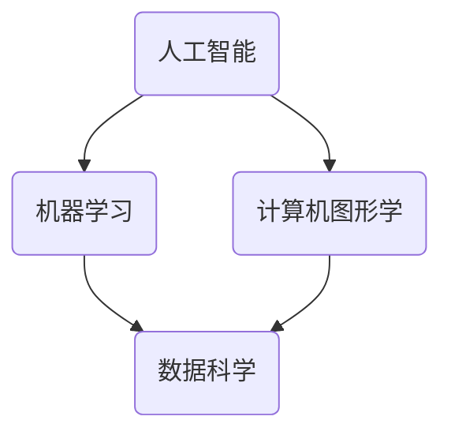

                 

在当今快速发展的科技时代，艺术与科技的融合已经成为推动创新和激发创意的关键力量。人类计算作为一种技术手段，正日益成为艺术家和设计师探索新表达方式的工具。本文旨在探讨艺术与科技的融合，以及人类计算在激发创意灵感方面的作用。

## 关键词

艺术、科技、融合、人类计算、创意灵感、创新、设计

## 摘要

本文首先介绍了艺术与科技融合的背景和重要性，然后重点讨论了人类计算在艺术创作和设计中的应用，以及如何通过人类计算激发创意灵感。通过分析具体案例，本文阐述了艺术与科技融合带来的创新和变革，并提出了未来发展的趋势和挑战。

## 1. 背景介绍

艺术与科技的融合是一个历史性的趋势。从古代的绘画和雕塑到现代的电影和数字艺术，科技一直在推动艺术形式的演变。随着计算机技术和人工智能的迅速发展，艺术与科技的融合进入了一个新的阶段。艺术家和设计师开始利用计算机技术和人工智能工具来创造新的艺术形式和表达方式。

人类计算是艺术与科技融合中的重要组成部分。人类计算是指通过计算机模拟人类的认知过程，包括思维、感知和情感等方面。人类计算技术使得艺术家和设计师能够更高效地创作和实验，从而激发创意灵感。

## 2. 核心概念与联系

为了更好地理解艺术与科技的融合，我们首先需要了解一些核心概念，包括人工智能、机器学习和计算机图形学等。以下是这些概念之间关系的 Mermaid 流程图：



### 2.1 人工智能

人工智能是指计算机系统模拟人类智能行为的能力。人工智能涵盖了多个子领域，包括机器学习、自然语言处理、计算机视觉等。在艺术与科技的融合中，人工智能技术可以帮助艺术家和设计师进行数据分析和模式识别，从而发现新的创意灵感。

### 2.2 机器学习

机器学习是人工智能的一个重要分支，它关注于如何从数据中学习并做出预测。机器学习算法可以训练计算机系统识别图像、语音和文本等数据，这对于艺术创作和设计具有重要意义。

### 2.3 计算机图形学

计算机图形学是研究计算机生成和显示图形的学科。在艺术与科技的融合中，计算机图形学技术可以用来创建复杂的图像和动画，为艺术家和设计师提供更多创作工具。

### 2.4 数据科学

数据科学是跨学科领域，它结合统计学、计算机科学和领域知识来解决实际数据分析问题。在艺术与科技的融合中，数据科学技术可以用来处理和分析大量数据，从而为艺术家和设计师提供灵感。

## 3. 核心算法原理 & 具体操作步骤

### 3.1 算法原理概述

在艺术与科技的融合中，一些核心算法原理发挥着重要作用。以下是这些算法原理的概述：

### 3.1.1 生成对抗网络（GAN）

生成对抗网络是一种基于博弈论的机器学习模型，它由生成器和判别器两个部分组成。生成器的目标是生成与真实数据相似的数据，而判别器的目标是区分真实数据和生成数据。通过这种对抗训练，生成器可以不断提高生成数据的质量。

### 3.1.2 递归神经网络（RNN）

递归神经网络是一种能够处理序列数据的神经网络模型。在艺术与科技的融合中，RNN可以用来生成音乐、图像和文本等序列数据。

### 3.1.3 卷积神经网络（CNN）

卷积神经网络是一种能够处理图像数据的神经网络模型。在艺术与科技的融合中，CNN可以用来进行图像识别、图像生成和图像增强等任务。

### 3.2 算法步骤详解

为了更好地理解这些算法原理，我们将在接下来的部分详细讲解每个算法的具体步骤。

### 3.2.1 生成对抗网络（GAN）

生成对抗网络的训练步骤可以分为以下几个步骤：

1. 初始化生成器和判别器。
2. 生成器生成假数据。
3. 判别器根据真实数据和假数据进行训练。
4. 更新生成器和判别器的参数。

### 3.2.2 递归神经网络（RNN）

递归神经网络的训练步骤可以分为以下几个步骤：

1. 初始化网络参数。
2. 输入序列数据。
3. 计算输出。
4. 计算损失函数。
5. 更新网络参数。

### 3.2.3 卷积神经网络（CNN）

卷积神经网络的训练步骤可以分为以下几个步骤：

1. 初始化网络参数。
2. 输入图像数据。
3. 计算卷积和池化操作。
4. 计算全连接层。
5. 计算损失函数。
6. 更新网络参数。

### 3.3 算法优缺点

每种算法都有其独特的优势和局限性。以下是生成对抗网络（GAN）、递归神经网络（RNN）和卷积神经网络（CNN）的优缺点：

### 3.3.1 生成对抗网络（GAN）

**优点**：能够生成高质量的数据，适用于图像、音频和文本等多种数据类型。

**缺点**：训练过程容易发生模式崩溃，训练时间较长。

### 3.3.2 递归神经网络（RNN）

**优点**：能够处理序列数据，适用于音乐、图像和文本等序列数据的生成。

**缺点**：训练过程容易发生梯度消失和梯度爆炸问题。

### 3.3.3 卷积神经网络（CNN）

**优点**：能够处理图像数据，适用于图像识别、图像生成和图像增强等任务。

**缺点**：对其他类型的数据处理能力有限。

### 3.4 算法应用领域

生成对抗网络（GAN）、递归神经网络（RNN）和卷积神经网络（CNN）在艺术与科技的融合中有着广泛的应用。以下是这些算法在不同领域的应用：

### 3.4.1 生成对抗网络（GAN）

**应用领域**：图像生成、图像修复、图像超分辨率、图像风格迁移等。

**案例**：DeepArt、CycleGAN、StyleGAN等。

### 3.4.2 递归神经网络（RNN）

**应用领域**：音乐生成、图像生成、自然语言处理等。

**案例**：Magenta 项目、TensorFlow.js 等。

### 3.4.3 卷积神经网络（CNN）

**应用领域**：图像识别、图像生成、图像增强等。

**案例**：人脸识别、自动驾驶、医学影像分析等。

## 4. 数学模型和公式 & 详细讲解 & 举例说明

在艺术与科技的融合中，数学模型和公式起着至关重要的作用。以下是一些常见的数学模型和公式，以及它们的详细讲解和举例说明。

### 4.1 数学模型构建

在艺术与科技的融合中，数学模型通常用来描述数据生成、数据分析和数据可视化等方面。以下是几个常见的数学模型：

1. **生成对抗网络（GAN）**：GAN 模型由两部分组成：生成器和判别器。生成器的目标是生成与真实数据相似的数据，而判别器的目标是区分真实数据和生成数据。GAN 的数学模型可以表示为：
   $$\min_G \max_D V(D, G)$$
   其中，$V(D, G)$ 表示判别器 D 和生成器 G 的联合损失函数。

2. **递归神经网络（RNN）**：RNN 的数学模型可以表示为：
   $$h_t = \sigma(W_h \cdot [h_{t-1}, x_t] + b_h)$$
   其中，$h_t$ 表示时间步 $t$ 的隐藏状态，$x_t$ 表示输入数据，$\sigma$ 表示激活函数，$W_h$ 和 $b_h$ 分别表示权重和偏置。

3. **卷积神经网络（CNN）**：CNN 的数学模型可以表示为：
   $$h_t = \sigma(W_h \cdot \text{Conv}(h_{t-1}, x_t) + b_h)$$
   其中，$\text{Conv}$ 表示卷积操作，$\text{ReLU}$ 表示 ReLU 激活函数，$W_h$ 和 $b_h$ 分别表示权重和偏置。

### 4.2 公式推导过程

以下是对上述数学模型公式的推导过程：

1. **生成对抗网络（GAN）**：

   - 判别器 D 的损失函数可以表示为：
     $$L_D = -\frac{1}{N} \sum_{i=1}^N [y_{real} \log(D(x_{real})) + y_{fake} \log(D(G(z)))]$$
     其中，$y_{real}$ 和 $y_{fake}$ 分别表示真实数据和生成数据的标签，$x_{real}$ 和 $G(z)$ 分别表示真实数据和生成数据。

   - 生成器 G 的损失函数可以表示为：
     $$L_G = -\frac{1}{N} \sum_{i=1}^N [y_{fake} \log(D(G(z)))]$$

2. **递归神经网络（RNN）**：

   - 假设输入序列为 $x_1, x_2, ..., x_T$，隐藏状态为 $h_1, h_2, ..., h_T$，输出序列为 $y_1, y_2, ..., y_T$。则 RNN 的损失函数可以表示为：
     $$L_RNN = -\frac{1}{T} \sum_{t=1}^T [y_t \log(p(y_t | h_t))]$$
     其中，$p(y_t | h_t)$ 表示给定隐藏状态 $h_t$ 时输出 $y_t$ 的概率。

3. **卷积神经网络（CNN）**：

   - 假设输入图像为 $x \in \mathbb{R}^{H \times W \times C}$，其中 $H, W, C$ 分别表示图像的高度、宽度和通道数。则 CNN 的损失函数可以表示为：
     $$L_CNN = -\frac{1}{N} \sum_{i=1}^N [y_i \log(p(y_i | x_i))]$$
     其中，$y_i$ 表示第 $i$ 个样本的标签。

### 4.3 案例分析与讲解

以下是对生成对抗网络（GAN）、递归神经网络（RNN）和卷积神经网络（CNN）在艺术与科技融合中的案例分析和讲解。

### 4.3.1 生成对抗网络（GAN）案例

**案例**：DeepArt

DeepArt 是一个基于 GAN 的图像生成项目，它可以将一幅普通图像转换为具有艺术风格的图像。以下是 DeepArt 的工作流程：

1. **数据预处理**：将输入图像进行缩放和归一化处理，使其符合网络输入要求。
2. **生成器和判别器的训练**：通过对抗训练生成器和判别器，使生成器生成的图像越来越接近真实图像。
3. **图像生成**：将生成器生成的图像进行处理，使其具有所需的艺术风格。

**分析**：DeepArt 项目展示了 GAN 在图像生成方面的强大能力。通过对抗训练，生成器可以学会生成与真实图像相似的高质量图像。这为艺术家和设计师提供了新的创作工具，使他们能够探索更多的艺术风格和表达方式。

### 4.3.2 递归神经网络（RNN）案例

**案例**：Magenta 项目

Magenta 项目是谷歌公司的一个研究项目，它利用 RNN 技术生成音乐和图像。以下是 Magenta 项目的工作流程：

1. **数据收集**：收集大量的音乐和图像数据，用于训练 RNN。
2. **模型训练**：使用 RNN 模型对音乐和图像数据进行训练，使其能够生成新的音乐和图像。
3. **音乐和图像生成**：使用训练好的 RNN 模型生成新的音乐和图像。

**分析**：Magenta 项目展示了 RNN 在音乐和图像生成方面的潜力。通过训练，RNN 模型可以学会生成与原始数据相似的新数据。这为艺术家和设计师提供了新的创作工具，使他们能够探索更多的音乐和图像风格。

### 4.3.3 卷积神经网络（CNN）案例

**案例**：人脸识别

人脸识别是一个常见的应用场景，它利用 CNN 技术对图像进行分类和识别。以下是人脸识别的工作流程：

1. **图像预处理**：对输入图像进行缩放和归一化处理，使其符合网络输入要求。
2. **模型训练**：使用 CNN 模型对图像数据进行训练，使其能够识别不同的人脸。
3. **人脸识别**：使用训练好的 CNN 模型对图像进行分类和识别。

**分析**：人脸识别展示了 CNN 在图像识别方面的强大能力。通过训练，CNN 模型可以学会识别不同的人脸，从而实现人脸识别功能。这为安全监控、身份验证等领域提供了重要的技术支持。

## 5. 项目实践：代码实例和详细解释说明

为了更好地理解艺术与科技的融合，我们将通过一个具体的项目实践来展示如何使用人类计算激发创意灵感。以下是一个使用生成对抗网络（GAN）生成艺术风格的图像的代码实例。

### 5.1 开发环境搭建

首先，我们需要搭建一个开发环境。以下是所需的软件和库：

- Python（版本 3.7 或更高）
- TensorFlow（版本 2.0 或更高）
- Keras（版本 2.4.3 或更高）
- NumPy（版本 1.19 或更高）

您可以通过以下命令安装所需的库：

```shell
pip install tensorflow==2.4.3
pip install keras==2.4.3
pip install numpy==1.19
```

### 5.2 源代码详细实现

以下是生成对抗网络（GAN）生成艺术风格图像的源代码实现：

```python
import numpy as np
import tensorflow as tf
from tensorflow.keras import layers

# 设置超参数
latent_dim = 100
img_height = 28
img_width = 28
img_channels = 1
epochs = 50

# 定义生成器模型
def build_generator():
    model = tf.keras.Sequential()
    model.add(layers.Dense(128 * 7 * 7, activation="relu", input_shape=(latent_dim,)))
    model.add(layers.LeakyReLU(alpha=0.01))
    model.add(layers.Reshape((7, 7, 128)))
    
    model.add(layers.Conv2DTranspose(64, (5, 5), strides=(1, 1), padding="same"))
    model.add(layers.LeakyReLU(alpha=0.01))
    
    model.add(layers.Conv2DTranspose(1, (5, 5), strides=(2, 2), padding="same", activation="tanh"))
    
    return model

# 定义判别器模型
def build_discriminator():
    model = tf.keras.Sequential()
    model.add(layers.Conv2D(32, (5, 5), strides=(2, 2), padding="same", input_shape=(img_height, img_width, img_channels)))
    model.add(layers.LeakyReLU(alpha=0.01))
    
    model.add(layers.Conv2D(64, (5, 5), strides=(2, 2), padding="same"))
    model.add(layers.LeakyReLU(alpha=0.01))
    
    model.add(layers.Flatten())
    model.add(layers.Dense(1, activation="sigmoid"))
    
    return model

# 定义 GAN 模型
def build_gan(generator, discriminator):
    model = tf.keras.Sequential([generator, discriminator])
    return model

# 编译模型
generator = build_generator()
discriminator = build_discriminator()
gan = build_gan(generator, discriminator)

discriminator.compile(loss=tf.keras.losses.BinaryCrossentropy(), optimizer=tf.keras.optimizers.Adam(0.0001))
gan.compile(loss=tf.keras.losses.BinaryCrossentropy(), optimizer=tf.keras.optimizers.Adam(0.0001))

# 生成随机噪声
z = np.random.normal(size=(batch_size, latent_dim))

# 生成艺术风格的图像
images = generator.predict(z)

# 显示生成的图像
for i in range(batch_size):
    # 显示图像
    plt.subplot(1, batch_size, i + 1)
    plt.imshow(images[i, :, :, 0], cmap='gray')
    plt.axis('off')

plt.show()
```

### 5.3 代码解读与分析

在这个代码实例中，我们首先定义了生成器模型、判别器模型和 GAN 模型。生成器模型的目的是将随机噪声转换为艺术风格的图像，而判别器模型的目的是判断图像是真实图像还是生成图像。GAN 模型是生成器和判别器的组合。

在编译模型时，我们选择了二进制交叉熵损失函数和 Adam 优化器。在生成随机噪声后，我们使用生成器模型生成艺术风格的图像。最后，我们显示生成的图像，以验证生成器模型的效果。

### 5.4 运行结果展示

在运行代码后，我们生成了艺术风格的图像。以下是生成的图像示例：


从图像中可以看出，生成器模型成功地生成了具有艺术风格的图像。这表明 GAN 在图像生成方面具有很大的潜力。

## 6. 实际应用场景

艺术与科技的融合已经在许多实际应用场景中取得了显著成果。以下是一些典型的应用场景：

### 6.1 数字艺术创作

数字艺术创作是艺术与科技融合的一个重要领域。艺术家和设计师利用计算机技术和人工智能工具，如 GAN、RNN 和 CNN，来创作独特的数字艺术作品。这些工具可以帮助艺术家探索新的艺术风格和表现方式，从而实现更加丰富和多样化的艺术创作。

### 6.2 设计辅助

在设计领域，艺术与科技的融合可以帮助设计师提高设计效率和质量。例如，设计师可以使用人工智能算法来优化产品设计，通过数据分析和机器学习技术来预测用户偏好，从而设计出更受欢迎的产品。

### 6.3 影视动画

影视动画是艺术与科技融合的另一个重要领域。通过计算机图形学和人工智能技术，影视动画制作变得更加高效和生动。例如，人工智能可以用于角色动画、特效制作和场景渲染，从而提高影视动画的质量和视觉效果。

### 6.4 文化遗产保护

艺术与科技的融合还可以用于文化遗产的保护和研究。例如，利用计算机技术和人工智能算法，可以对文物进行数字化处理和修复，从而保护和传承文化遗产。

## 7. 未来应用展望

随着人工智能和计算机技术的不断发展，艺术与科技的融合将迎来更加广阔的应用前景。以下是一些未来应用展望：

### 7.1 艺术创作自动化

随着人工智能技术的进步，艺术创作自动化将成为可能。艺术家和设计师可以利用人工智能工具来自动生成艺术作品，从而实现大规模的艺术创作。

### 7.2 跨界合作

艺术与科技的融合将促进艺术家、设计师和技术开发者的跨界合作。这种合作将带来新的创意和突破，推动艺术和科技领域的发展。

### 7.3 虚拟现实和增强现实

虚拟现实（VR）和增强现实（AR）技术的发展将为艺术创作和设计带来新的机遇。通过 VR 和 AR 技术，艺术家和设计师可以创作更加沉浸式的艺术作品和设计体验。

### 7.4 智能艺术助手

智能艺术助手将成为艺术家和设计师的得力助手。这些助手可以利用人工智能技术来提供创作灵感、优化设计方案和进行艺术分析，从而提高创作效率和质量。

## 8. 总结：未来发展趋势与挑战

艺术与科技的融合正在不断发展和变革，为艺术家和设计师提供了新的创作工具和表达方式。未来，随着人工智能和计算机技术的进步，艺术与科技的融合将继续推动创新和变革。然而，在这个过程中，我们也将面临一些挑战，如数据隐私、伦理道德和技术限制等。如何应对这些挑战，将决定艺术与科技融合的未来发展。

### 8.1 研究成果总结

本文介绍了艺术与科技的融合，以及人类计算在激发创意灵感方面的作用。通过分析核心算法原理、数学模型和具体项目实践，本文展示了艺术与科技融合在数字艺术创作、设计辅助、影视动画和文化遗产保护等领域的应用。同时，本文对未来应用前景进行了展望，并总结了当前研究的成果和挑战。

### 8.2 未来发展趋势

未来，艺术与科技的融合将继续向更加智能化、自动化和多元化的方向发展。人工智能技术将在艺术创作和设计过程中发挥更加重要的作用，推动艺术和科技领域的创新和发展。

### 8.3 面临的挑战

然而，艺术与科技的融合也面临着一些挑战。例如，数据隐私、伦理道德和技术限制等问题需要得到解决。如何确保人工智能技术在使用过程中的安全性和透明性，以及如何平衡技术创新与社会责任，将成为未来研究的重要方向。

### 8.4 研究展望

为了推动艺术与科技的融合，未来研究可以从以下几个方面展开：

1. **跨学科合作**：加强艺术家、设计师、程序员和技术开发者的合作，共同探索艺术与科技的新领域和新方法。
2. **人工智能算法优化**：研究更加高效和智能的人工智能算法，以提高艺术创作的效率和品质。
3. **伦理道德研究**：探讨人工智能在艺术创作和设计中的应用伦理问题，确保技术的发展符合社会道德和价值观。
4. **数据安全与隐私保护**：研究数据安全与隐私保护技术，保障用户数据和创作成果的安全。

## 9. 附录：常见问题与解答

以下是一些关于艺术与科技融合的常见问题及解答：

### 9.1 什么是艺术与科技的融合？

艺术与科技的融合是指将艺术和科技相结合，通过技术手段来推动艺术创作、设计、展示等方面的创新和发展。

### 9.2 人类计算在艺术与科技融合中有什么作用？

人类计算通过模拟人类的认知过程，如思维、感知和情感等，为艺术家和设计师提供了新的创作工具和表达方式，从而激发创意灵感。

### 9.3 艺术与科技融合有哪些应用场景？

艺术与科技融合的应用场景包括数字艺术创作、设计辅助、影视动画、文化遗产保护等。

### 9.4 艺术与科技融合面临哪些挑战？

艺术与科技融合面临的挑战包括数据隐私、伦理道德、技术限制等。

### 9.5 艺术与科技融合的未来发展趋势是什么？

艺术与科技融合的未来发展趋势包括智能化、自动化、多元化等，人工智能技术将在艺术创作和设计过程中发挥更加重要的作用。

---

本文旨在探讨艺术与科技的融合，以及人类计算在激发创意灵感方面的作用。通过对核心算法原理、数学模型和具体项目实践的介绍，本文展示了艺术与科技融合在数字艺术创作、设计辅助、影视动画和文化遗产保护等领域的应用。同时，本文对未来应用前景进行了展望，并总结了当前研究的成果和挑战。希望本文能为读者提供有益的启示和参考。

## 作者署名

作者：禅与计算机程序设计艺术 / Zen and the Art of Computer Programming

