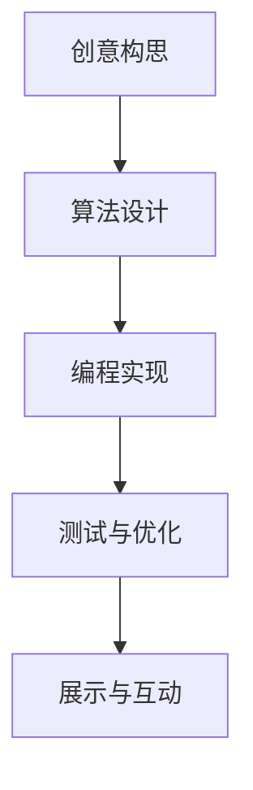

                 

关键词：计算艺术、创意激发、人工智能、编程哲学、数学模型、算法、应用领域、未来展望

> 摘要：本文探讨了计算艺术作为一种创新表达形式，如何通过人类计算激发创意火花。文章首先介绍了计算艺术的背景和核心概念，然后深入分析了其与人工智能的紧密联系。随后，文章讨论了核心算法原理、数学模型和公式，以及具体的项目实践案例。最后，文章展望了计算艺术在未来的应用前景，并提出了面临的研究挑战。

## 1. 背景介绍

计算艺术是一门结合了艺术与计算机科学的跨学科领域，旨在通过编程和计算技术创造出独特的艺术作品。随着计算机技术的不断进步，计算艺术逐渐成为现代艺术的重要组成部分。它不仅为艺术家提供了新的创作工具和表达方式，也为观众带来了全新的审美体验。

计算艺术的历史可以追溯到20世纪中叶。1950年代，计算机科学家约翰·冯·诺依曼（John von Neumann）提出了“计算机作为艺术家”的概念，开启了计算艺术的先河。随后的几十年中，计算机图形学、算法设计和人工智能等技术的发展，为计算艺术注入了源源不断的创意动力。

计算艺术的应用领域非常广泛，包括数字绘画、动态艺术、虚拟现实、增强现实、交互式艺术等。这些作品不仅具有视觉和听觉上的冲击力，更通过算法和编程实现了动态变化和互动性，使观众能够参与到艺术创作的过程中。

## 2. 核心概念与联系

### 2.1 核心概念原理

计算艺术的核心概念是“计算”。计算不仅仅是计算机执行的运算过程，更是一种思维方式，一种解决问题的策略。在计算艺术中，艺术家通过编程语言和算法来实现艺术创作，使艺术作品具有动态性和互动性。

### 2.2 架构和流程

计算艺术的架构通常包括以下几个关键步骤：

1. **创意构思**：艺术家首先构思出艺术作品的主题和概念。
2. **算法设计**：艺术家根据创意构思设计出实现艺术效果的算法。
3. **编程实现**：程序员根据算法设计编写代码，实现艺术作品的功能和交互。
4. **测试与优化**：艺术家和程序员共同测试代码，优化艺术作品的表现效果。
5. **展示与互动**：艺术作品通过计算机或其他设备进行展示，观众可以与之互动。

### 2.3 Mermaid 流程图



## 3. 核心算法原理 & 具体操作步骤

### 3.1 算法原理概述

在计算艺术中，核心算法通常涉及图像处理、计算机图形学、机器学习和人工智能等领域。以下是一些常用的算法原理：

1. **图像处理算法**：用于处理和变换图像，例如像素操作、滤波、边缘检测等。
2. **计算机图形学算法**：用于创建和渲染图形，例如线条绘制、面绘制、光照模型等。
3. **机器学习算法**：用于分析数据、识别模式和生成艺术作品，例如神经网络、生成对抗网络（GAN）等。
4. **人工智能算法**：用于实现交互性和智能性，例如决策树、随机森林、强化学习等。

### 3.2 算法步骤详解

#### 3.2.1 图像处理算法

1. **像素操作**：通过对图像的每个像素进行操作，实现色彩变换、图像增强等效果。
2. **滤波**：通过滤波器对图像进行平滑或锐化处理。
3. **边缘检测**：通过检测图像中的边缘信息，实现图像的分割和识别。

#### 3.2.2 计算机图形学算法

1. **线条绘制**：使用Bresenham算法或中点算法实现线条的绘制。
2. **面绘制**：使用扫描线算法或扫描转换算法实现面的绘制。
3. **光照模型**：使用Phong光照模型或Blinn-Phong光照模型实现光照效果。

#### 3.2.3 机器学习算法

1. **神经网络**：通过多层感知机（MLP）或卷积神经网络（CNN）实现图像的生成和分类。
2. **生成对抗网络（GAN）**：通过生成器和判别器的对抗训练实现高质量的图像生成。

#### 3.2.4 人工智能算法

1. **决策树**：通过特征选择和分裂实现分类和回归任务。
2. **随机森林**：通过集成多个决策树实现更准确和稳定的预测。
3. **强化学习**：通过奖励机制和策略优化实现智能体的决策和行动。

### 3.3 算法优缺点

1. **图像处理算法**：优点是简单易懂，易于实现；缺点是处理效果有限，无法生成复杂图像。
2. **计算机图形学算法**：优点是能够生成高质量的图形效果；缺点是实现复杂，计算量大。
3. **机器学习算法**：优点是能够自动学习和生成复杂图像；缺点是训练过程耗时，需要大量数据。
4. **人工智能算法**：优点是实现智能交互和决策；缺点是复杂度高，实现难度大。

### 3.4 算法应用领域

计算艺术的算法应用领域广泛，包括：

1. **数字绘画**：使用图像处理和计算机图形学算法创作数字画作。
2. **动态艺术**：使用机器学习和人工智能算法创作动态变化的数字艺术作品。
3. **虚拟现实与增强现实**：使用计算机图形学和人工智能算法实现沉浸式艺术体验。
4. **交互式艺术**：使用人工智能算法实现观众与艺术作品的互动。

## 4. 数学模型和公式 & 详细讲解 & 举例说明

### 4.1 数学模型构建

在计算艺术中，常用的数学模型包括：

1. **像素模型**：用于描述图像的像素结构和颜色值。
2. **几何模型**：用于描述图形的几何形状和位置关系。
3. **统计模型**：用于分析图像和图形中的数据分布和统计特征。

### 4.2 公式推导过程

以像素模型为例，像素模型的基本公式如下：

$$
P(x, y) = (R(x, y), G(x, y), B(x, y))
$$

其中，\(P(x, y)\) 表示像素点的颜色值，\(R(x, y)\)、\(G(x, y)\) 和 \(B(x, y)\) 分别表示像素点的红色、绿色和蓝色分量。

### 4.3 案例分析与讲解

#### 4.3.1 图像滤波

假设我们需要对一幅图像进行高斯滤波处理，高斯滤波的基本公式如下：

$$
G(x, y) = \sum_{i=-\infty}^{\infty} \sum_{j=-\infty}^{\infty} g(i, j) \cdot P(i, j)
$$

其中，\(g(i, j)\) 是高斯滤波器系数，\(P(i, j)\) 是图像的像素值。

通过这个公式，我们可以计算出每个像素点经过高斯滤波后的颜色值，从而实现图像的平滑处理。

#### 4.3.2 神经网络

以卷积神经网络（CNN）为例，CNN 的基本公式如下：

$$
f(x) = \sigma(\sum_{i=1}^{n} w_i \cdot \phi(x_i))
$$

其中，\(f(x)\) 是神经网络输出的特征值，\(\sigma\) 是激活函数，\(w_i\) 是权重值，\(\phi(x_i)\) 是卷积操作。

通过这个公式，我们可以计算图像中的特征值，从而实现图像的分类和识别。

## 5. 项目实践：代码实例和详细解释说明

### 5.1 开发环境搭建

为了实现计算艺术项目，我们需要搭建一个合适的技术栈。以下是一个基本的开发环境搭建步骤：

1. **硬件环境**：一台配置较高的计算机，至少16GB内存，32GB存储空间。
2. **操作系统**：Windows、macOS 或 Linux。
3. **编程语言**：Python、Java 或 C++。
4. **开发工具**：Visual Studio、Eclipse 或 Xcode。
5. **依赖库**：Pillow（Python）、OpenCV（C++）、TensorFlow（Python）。

### 5.2 源代码详细实现

以下是一个简单的 Python 代码示例，用于绘制一个正弦波：

```python
import numpy as np
from PIL import Image, ImageDraw

# 创建一个800x600的图像
width, height = 800, 600
img = Image.new('RGB', (width, height), 'white')
draw = ImageDraw.Draw(img)

# 计算正弦波的数据点
x = np.linspace(0, 2 * np.pi, width)
y = np.sin(x)

# 绘制正弦波
for i in range(len(x)):
    draw.point((i, height - int(y[i] * height)), fill='blue')

# 保存图像
img.save('sine_wave.png')
```

### 5.3 代码解读与分析

1. **创建图像**：使用 `Image.new()` 函数创建一个白色背景的图像。
2. **计算数据点**：使用 `numpy` 计算正弦波的数据点。
3. **绘制图像**：使用 `ImageDraw` 绘制正弦波的线条。
4. **保存图像**：将绘制好的图像保存为PNG格式。

这个简单的示例展示了计算艺术项目的基本实现过程。在实际项目中，我们通常需要使用更复杂的算法和模型来实现各种艺术效果。

### 5.4 运行结果展示

运行上述代码后，会生成一个名为 `sine_wave.png` 的图像文件。这个图像展示了正弦波在二维平面上的绘制效果。


## 6. 实际应用场景

计算艺术在多个领域有着广泛的应用：

1. **艺术展览**：计算艺术作品常常出现在艺术展览和博物馆中，吸引观众参与互动和体验。
2. **建筑设计**：计算艺术可以用于建筑设计中的可视化展示和虚拟现实体验。
3. **娱乐产业**：电影、游戏和动画制作中广泛应用计算艺术技术，创造逼真的视觉效果。
4. **科学可视化**：计算艺术用于科学数据的可视化展示，帮助科学家理解复杂的数据结构。
5. **教育领域**：计算艺术可以用于教学辅助，激发学生的创造力和学习兴趣。

### 6.4 未来应用展望

随着计算技术和人工智能的不断发展，计算艺术的应用前景将更加广阔：

1. **智能艺术创作**：利用人工智能算法实现自动化的艺术创作，提高创作效率和质量。
2. **个性化体验**：通过计算艺术为用户提供个性化的艺术体验，满足不同用户的审美需求。
3. **混合现实**：计算艺术与虚拟现实、增强现实技术的融合，创造更加沉浸式的艺术体验。
4. **艺术教育**：利用计算艺术技术进行艺术教育，培养学生的创造力和计算思维能力。

## 7. 工具和资源推荐

### 7.1 学习资源推荐

- 《计算机图形学原理及实践》（著：William van der Walt）
- 《深度学习》（著：Ian Goodfellow、Yoshua Bengio、Aaron Courville）
- 《机器学习》（著：Tom Mitchell）

### 7.2 开发工具推荐

- PyCharm（Python开发环境）
- Unity（游戏开发引擎）
- Unreal Engine（游戏开发引擎）

### 7.3 相关论文推荐

- “Generative Adversarial Nets”（NIPS 2014）
- “Inception-v3: Efficient Convolutional Neural Networks for Image Recognition”（ICML 2015）
- “Deep Residual Learning for Image Recognition”（CVPR 2016）

## 8. 总结：未来发展趋势与挑战

### 8.1 研究成果总结

计算艺术通过结合艺术与计算机科学，创造出独特的艺术形式。研究成果包括：

- 丰富的艺术表现手法，如数字绘画、动态艺术、交互式艺术等。
- 先进的算法和模型，如图像处理算法、计算机图形学算法、机器学习和人工智能算法等。

### 8.2 未来发展趋势

计算艺术未来的发展趋势包括：

- 智能化的艺术创作，利用人工智能算法实现自动化的艺术创作。
- 个性化体验，通过计算艺术为用户提供个性化的艺术体验。
- 混合现实技术，与虚拟现实、增强现实技术的融合，创造更加沉浸式的艺术体验。

### 8.3 面临的挑战

计算艺术面临以下挑战：

- 技术实现难度，复杂的算法和模型实现需要高水平的编程和计算能力。
- 数据质量，高质量的艺术作品需要大量的数据支持，数据的获取和处理是关键。
- 可持续发展，计算艺术的发展需要考虑环保和可持续性问题。

### 8.4 研究展望

未来研究应重点关注：

- 算法优化，提高计算艺术算法的效率和效果。
- 跨学科合作，结合不同领域的知识，推动计算艺术的创新与发展。
- 教育培训，培养更多的计算艺术专业人才，推动计算艺术在教育领域的应用。

## 9. 附录：常见问题与解答

### 9.1 计算艺术与普通艺术的区别

计算艺术与普通艺术的主要区别在于创作工具和表达方式。计算艺术使用计算机和编程技术作为创作工具，通过算法和计算实现艺术效果。而普通艺术则主要依赖于手工技巧和材料，如绘画、雕塑等。

### 9.2 计算艺术如何激发创意火花

计算艺术通过提供新的创作工具和表达方式，激发艺术家的创意思维。计算技术使得艺术创作更加高效和多样化，艺术家可以通过编程和算法实现独特的艺术效果，从而激发创意火花。

### 9.3 如何入门计算艺术

入门计算艺术可以从以下几个方面开始：

- 学习编程语言，如Python、Java或C++。
- 学习计算机图形学和图像处理基础知识。
- 了解机器学习和人工智能的基本概念。
- 实践项目，通过动手实践提高技能。

---

作者：禅与计算机程序设计艺术 / Zen and the Art of Computer Programming
------------------------------------------------------------------------

