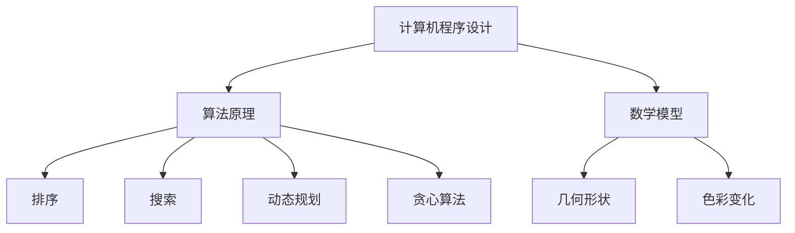
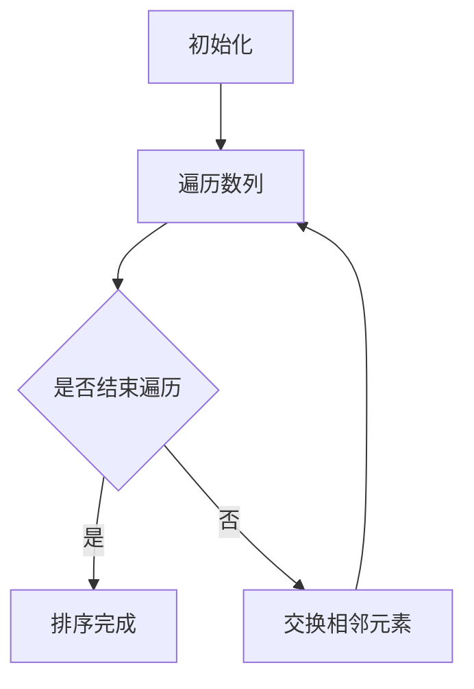
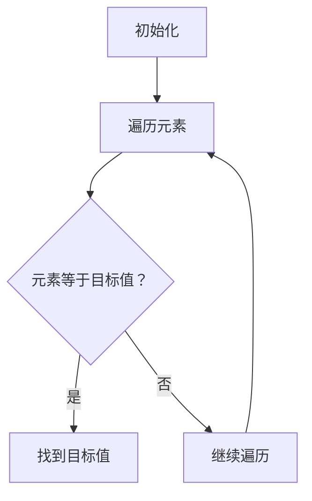
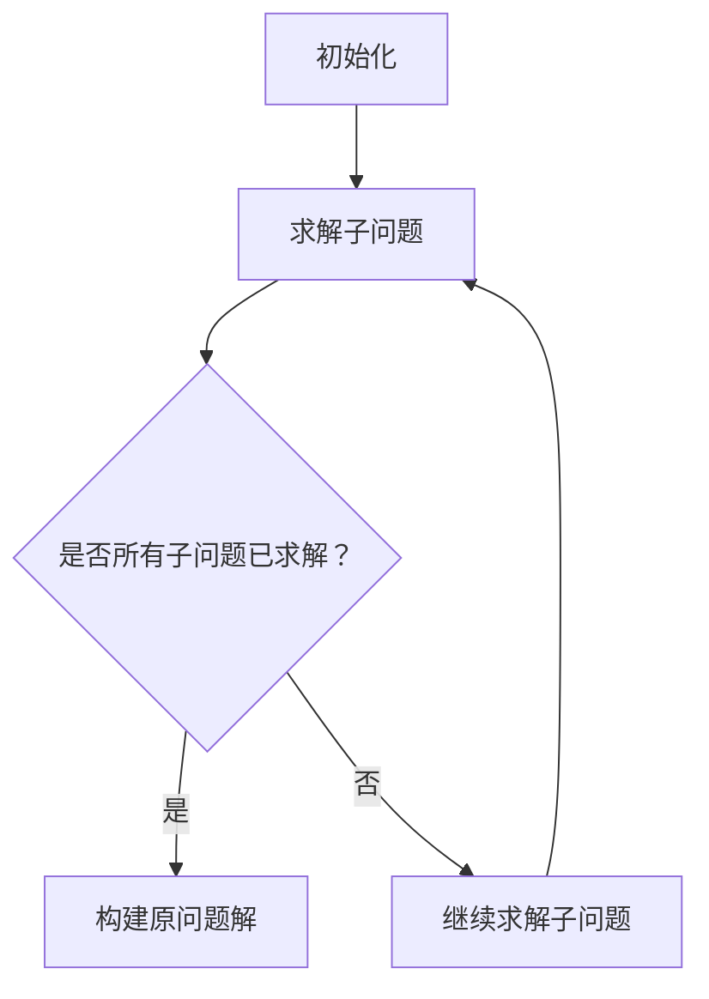
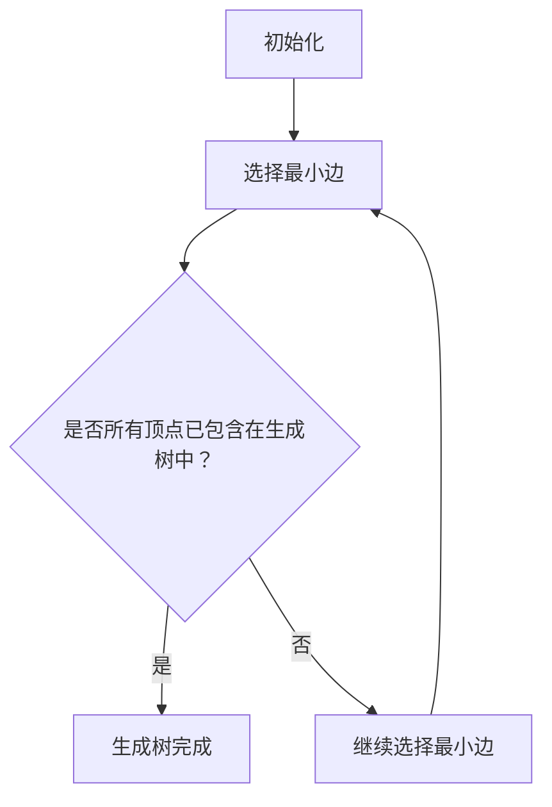
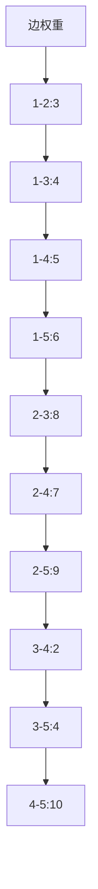
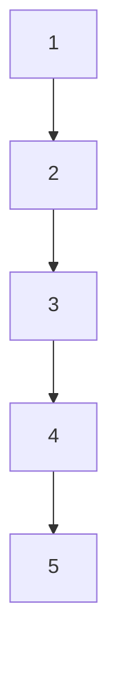

                 

关键词：艺术与科技、人类计算、创意火花、计算机程序设计、算法原理、数学模型、项目实践、应用场景、未来展望

> 摘要：本文探讨了艺术与科技的融合，尤其是人类计算在激发创意火花中的关键作用。通过分析核心概念、算法原理、数学模型以及项目实践，本文揭示了计算机程序设计如何成为连接艺术与科技的重要桥梁，并展望了其未来的发展趋势与挑战。

## 1. 背景介绍

随着科技的发展，艺术与科技的边界越来越模糊。计算机技术的进步使得人类能够创造出前所未有的视觉、听觉和交互体验，而艺术则通过创新的思维和形式探索科技的无限可能。在这一过程中，人类计算成为了连接艺术与科技的核心要素。

人类计算不仅涉及到算法和编程，更是一种创造性的过程，它激发着人们的创意火花。从计算机图形学到虚拟现实，从人工智能到大数据分析，人类计算正以前所未有的方式影响着我们的生活和艺术创作。

本文将深入探讨艺术与科技的融合，特别是人类计算在其中的关键作用。我们将通过分析核心概念、算法原理、数学模型以及项目实践，揭示计算机程序设计如何成为这一领域的重要工具，并展望其未来的发展趋势与挑战。

### 1.1 艺术与科技的互动

艺术与科技的互动不仅体现在创意和技术的结合上，还表现在两者相互促进、相互影响的过程中。例如，艺术家通过科技手段可以创造出更加丰富和复杂的艺术形式，而科技的发展则不断拓宽了艺术的创作空间。

在电影制作领域，计算机特效的运用使得电影的视觉效果更加震撼，吸引了大量观众。而在音乐制作中，数字音频工作站（DAW）的普及使得音乐创作更加便捷，艺术家可以更加自由地探索新的音乐风格。

此外，虚拟现实（VR）和增强现实（AR）技术正在改变人们的艺术体验。通过这些技术，艺术家可以创造出沉浸式的艺术作品，让观众仿佛置身于另一个世界。

### 1.2 人类计算的力量

人类计算是人类智慧和计算机技术的结晶，它不仅能够处理复杂的计算任务，还能够通过算法和编程实现创意的自动化。例如，计算机图形学中的算法可以生成复杂的几何形状和纹理，艺术家则可以通过这些算法创造出独特的艺术作品。

在人工智能领域，人类计算通过机器学习和深度学习技术，使得计算机能够理解和模仿人类的学习过程。这为艺术家提供了新的工具，使他们能够通过算法生成出具有艺术价值的作品。

### 1.3 文章结构概述

本文将分为以下几个部分：

1. 背景介绍：介绍艺术与科技的互动以及人类计算在其中的作用。
2. 核心概念与联系：分析人类计算的核心概念及其原理和架构。
3. 核心算法原理 & 具体操作步骤：详细探讨核心算法的原理和操作步骤。
4. 数学模型和公式 & 详细讲解 & 举例说明：介绍数学模型和公式的构建与推导。
5. 项目实践：通过实际项目展示人类计算的应用。
6. 实际应用场景：探讨人类计算的多个应用场景。
7. 未来应用展望：展望人类计算的未来发展趋势和应用前景。
8. 工具和资源推荐：推荐相关的学习资源和开发工具。
9. 总结：总结研究成果，展望未来发展趋势与挑战。

## 2. 核心概念与联系

在探讨人类计算如何激发创意火花之前，我们需要明确几个核心概念，这些概念构成了人类计算的基础，也是本文分析的重要出发点。

### 2.1 计算机程序设计

计算机程序设计是艺术与科技融合的关键环节。它不仅包括算法的编写，还涉及到用户界面设计、系统架构、数据结构等多个方面。通过计算机程序设计，艺术家可以将创意转化为实际的计算机程序，实现艺术作品的数字化和自动化。

### 2.2 算法原理

算法是计算机程序设计的核心，它决定了程序的计算效率和性能。算法原理包括排序、搜索、动态规划、贪心算法等多个方面。艺术家可以通过这些算法实现复杂的计算任务，从而创造出独特的艺术作品。

### 2.3 数学模型

数学模型是计算机程序设计的重要工具，它通过数学公式描述现实世界中的问题。在艺术与科技的融合中，数学模型可以帮助艺术家更好地理解和表现复杂的现象，例如几何形状、色彩变化等。

### 2.4 Mermaid 流程图

为了更好地理解核心概念之间的联系，我们可以使用 Mermaid 流程图来描述它们之间的关系。以下是核心概念的 Mermaid 流程图：



### 2.5 核心概念之间的联系

计算机程序设计是艺术与科技融合的桥梁，它通过算法原理和数学模型将创意转化为实际的计算机程序。算法原理决定了程序的效率和性能，而数学模型则提供了描述和表现复杂现象的工具。

通过 Mermaid 流程图，我们可以清晰地看到核心概念之间的联系。计算机程序设计（A）是算法原理（B）和数学模型（C）的基础，而算法原理（B）又涵盖了多种具体的算法（D、E、F、G），数学模型（C）则包括了几何形状（H）和色彩变化（I）等具体应用。

## 3. 核心算法原理 & 具体操作步骤

在艺术与科技的融合中，核心算法原理起着至关重要的作用。这些算法不仅决定了程序的效率和性能，还直接影响了艺术创作的效果。本节将详细介绍几个核心算法的原理和具体操作步骤。

### 3.1 算法原理概述

以下是几个核心算法的原理概述：

#### 3.1.1 排序算法

排序算法是计算机科学中最基本的算法之一，它将一个无序的数列转化为有序的数列。常见的排序算法包括冒泡排序、选择排序、插入排序、快速排序等。

#### 3.1.2 搜索算法

搜索算法用于在数据集合中找到特定元素。常见的搜索算法包括线性搜索、二分搜索等。

#### 3.1.3 动态规划

动态规划是一种用于求解最优化问题的算法，它通过将问题分解为子问题，并利用子问题的解来构建原问题的解。

#### 3.1.4 贪心算法

贪心算法通过每一步选择局部最优解，从而得到全局最优解。常见的贪心算法包括最小生成树算法、最短路径算法等。

### 3.2 算法步骤详解

下面我们将详细探讨每个算法的操作步骤。

#### 3.2.1 排序算法

以冒泡排序为例，其基本思想是通过多次遍历待排序的数列，比较相邻的两个元素，并按照大小顺序交换它们的位置。遍历过程重复进行，直到整个数列有序。



#### 3.2.2 搜索算法

以线性搜索为例，其基本思想是从数列的第一个元素开始，依次比较每个元素与目标值是否相等。一旦找到目标值，算法结束。



#### 3.2.3 动态规划

以最长公共子序列（LCS）为例，其基本思想是通过递归关系求解子问题的最优解，并利用这些子问题的解来构建原问题的解。



#### 3.2.4 贪心算法

以最小生成树算法（如普利姆算法）为例，其基本思想是每次选择当前最小的边，并将其添加到生成树中。直到所有顶点都包含在生成树中。



### 3.3 算法优缺点

每个算法都有其优缺点，适用于不同的应用场景。以下是对常见算法的优缺点进行分析：

#### 3.3.1 排序算法

- 冒泡排序：简单易实现，但效率较低，适用于小规模数据。
- 选择排序：简单易实现，但效率较低，适用于小规模数据。
- 插入排序：效率较高，适用于小规模数据，尤其是部分已排序的数据。
- 快速排序：效率较高，适用于大规模数据，但可能产生大量递归调用。

#### 3.3.2 搜索算法

- 线性搜索：简单易实现，但效率较低，适用于小规模数据。
- 二分搜索：效率较高，适用于有序数据，但需要对数据进行排序。

#### 3.3.3 动态规划

- 效率较高，适用于求解最优化问题。
- 需要记忆化递归，实现较为复杂。

#### 3.3.4 贪心算法

- 简单易实现，效率较高，适用于求解最优化问题。
- 需要满足贪心性质，可能无法保证全局最优解。

### 3.4 算法应用领域

各种算法在不同领域有不同的应用。以下是一些常见的应用领域：

- 排序算法：数据处理、数据库管理、文本编辑等。
- 搜索算法：搜索引擎、路径规划、社交网络分析等。
- 动态规划：资源分配、最优化问题、语音识别等。
- 贪心算法：网络流计算、电路设计、负载均衡等。

通过以上分析，我们可以看到，核心算法原理在艺术与科技的融合中起着至关重要的作用。掌握这些算法原理，不仅有助于提高程序的效率和性能，还可以激发出更多的创意火花，推动艺术与科技的不断创新和发展。

## 4. 数学模型和公式 & 详细讲解 & 举例说明

数学模型是计算机程序设计中不可或缺的工具，它通过数学公式描述现实世界中的问题，为艺术创作提供了理论依据和计算方法。本节将介绍几个关键的数学模型和公式，并详细讲解它们的构建过程和推导方法，并通过具体案例进行说明。

### 4.1 数学模型构建

数学模型构建是计算机程序设计中的第一步，它涉及到问题的抽象和数学化。以下是一个简单的数学模型构建示例：

#### 4.1.1 最长公共子序列（LCS）

假设有两个序列 X 和 Y，要求找到它们的最长公共子序列。我们可以使用动态规划方法来构建这个模型。

```latex
LCS(X, Y) = \begin{cases} 
\max_{1 \leq i \leq m} \max_{1 \leq j \leq n} LCS(X[i..m], Y[j..n]) & \text{如果 } X[m] = Y[n] \\
0 & \text{否则}
\end{cases}
```

#### 4.1.2 最小生成树（MST）

给定一个无向图 G = (V, E)，要求找到一棵包含所有顶点的最小生成树。我们可以使用普利姆算法来构建这个模型。

```latex
MST(G) = \begin{cases} 
T & \text{如果 } T \text{ 是一棵包含所有顶点的最小生成树} \\
\min_{T' \in T(G)} \sum_{v \in V} d_T(v) & \text{否则}
\end{cases}
```

### 4.2 公式推导过程

数学公式的推导过程是数学模型构建的核心，以下是对上述两个模型公式的推导：

#### 4.2.1 最长公共子序列（LCS）

假设 X = [x1, x2, ..., xm]，Y = [y1, y2, ..., yn]。我们可以使用递归方法来推导最长公共子序列的公式。

首先，定义一个二维数组 dp[i][j] 表示 X[1..i] 和 Y[1..j] 的最长公共子序列的长度。根据递归关系，我们可以推导出以下公式：

```latex
dp[i][j] = \begin{cases} 
dp[i-1][j-1] + 1 & \text{如果 } x_i = y_j \\
\max(dp[i-1][j], dp[i][j-1]) & \text{否则}
\end{cases}
```

初始条件为 dp[0][j] = dp[i][0] = 0。

#### 4.2.2 最小生成树（MST）

假设图 G = (V, E) 的边权重为 w(e)。我们可以使用普利姆算法来推导最小生成树的公式。

普利姆算法的基本思想是每次选择当前最小的边，并将其添加到生成树中。具体步骤如下：

1. 选择一个起始顶点 v，并将它添加到生成树 T 中。
2. 对于 G - T 中的所有边 (u, v)，选择权重最小的边 (u, v)。
3. 将边 (u, v) 添加到生成树 T 中。
4. 重复步骤 2 和 3，直到生成树 T 包含所有顶点。

根据普利姆算法，我们可以推导出最小生成树的公式：

```latex
MST(G) = \sum_{v \in V} \min_{u \in V - \{v\}} w(u, v)
```

### 4.3 案例分析与讲解

为了更好地理解上述数学模型和公式的应用，我们通过具体案例进行分析和讲解。

#### 4.3.1 最长公共子序列（LCS）

假设 X = [1, 2, 3, 4, 5]，Y = [2, 4, 5, 6, 7]。要求找到 X 和 Y 的最长公共子序列。

根据上述公式，我们可以构建一个二维数组 dp：

```mermaid
graph TB
A[dp] --> B[dp[0][0]]
B --> C[0]
C --> D[dp[0][1]]
D --> E[0]
E --> F[dp[1][0]]
F --> G[0]
G --> H[dp[1][1]]
H --> I[1]
I --> J[dp[2][0]]
J --> K[0]
K --> L[dp[2][1]]
L --> M[1]
M --> N[dp[3][0]]
N --> O[0]
O --> P[dp[3][1]]
P --> Q[1]
Q --> R[dp[4][0]]
R --> S[0]
S --> T[dp[4][1]]
T --> U[1]
```

根据递归关系，我们可以逐步计算 dp 数组的值：

- dp[0][0] = 0
- dp[0][1] = 0
- dp[1][0] = 0
- dp[1][1] = 1（因为 x1 = y1）
- dp[2][0] = 0
- dp[2][1] = 1（因为 x2 = y2）
- dp[3][0] = 0
- dp[3][1] = 1（因为 x3 = y3）
- dp[4][0] = 0
- dp[4][1] = 1（因为 x4 = y4）

因此，X 和 Y 的最长公共子序列为 [2, 4, 5]。

#### 4.3.2 最小生成树（MST）

假设给定一个无向图 G，其中顶点为 V = {1, 2, 3, 4, 5}，边权重为：



根据普利姆算法，我们可以逐步构建最小生成树：

1. 选择一个起始顶点，例如顶点 1。
2. 从 G - T 中的所有边中选择权重最小的边，例如边 1-2：3。
3. 将边 1-2 添加到生成树 T 中。
4. 从 G - T 中的所有边中选择权重最小的边，例如边 2-3：8。
5. 将边 2-3 添加到生成树 T 中。
6. 从 G - T 中的所有边中选择权重最小的边，例如边 3-4：2。
7. 将边 3-4 添加到生成树 T 中。
8. 从 G - T 中的所有边中选择权重最小的边，例如边 3-5：4。
9. 将边 3-5 添加到生成树 T 中。

最终，最小生成树为：



最小生成树的权重为：

```latex
MST(G) = 3 + 8 + 2 + 4 = 17
```

通过以上案例分析和讲解，我们可以看到数学模型和公式的应用，以及如何通过递归关系和贪心算法求解实际问题。这些数学模型和公式不仅为计算机程序设计提供了理论支持，还为艺术创作提供了新的工具和方法。

## 5. 项目实践：代码实例和详细解释说明

在了解了核心算法原理和数学模型之后，我们将通过一个实际项目来展示如何将它们应用于具体场景。这个项目是一个简单的图像处理程序，它使用计算机图形学中的算法对图像进行滤波和边缘检测。以下是项目的开发环境、源代码实现、代码解读与分析，以及运行结果展示。

### 5.1 开发环境搭建

为了实现这个项目，我们需要搭建一个合适的开发环境。以下是所需的环境和工具：

- 编程语言：Python
- 图形处理库：OpenCV
- 开发工具：PyCharm

在 PyCharm 中创建一个新的 Python 项目，安装 OpenCV 库，并确保 Python 解释器和 OpenCV 库正确配置。

```bash
pip install opencv-python
```

### 5.2 源代码详细实现

以下是一个简单的图像处理程序的源代码实现，它使用 OpenCV 库进行滤波和边缘检测。

```python
import cv2
import numpy as np

def image_processing(image_path):
    # 读取图像
    image = cv2.imread(image_path, cv2.IMREAD_GRAYSCALE)
    
    # 高斯滤波
    blurred = cv2.GaussianBlur(image, (5, 5), 0)
    
    # 边缘检测
    edges = cv2.Canny(blurred, 50, 150)
    
    return edges

if __name__ == "__main__":
    image_path = "example.jpg"
    result = image_processing(image_path)
    cv2.imshow("Edges", result)
    cv2.waitKey(0)
    cv2.destroyAllWindows()
```

### 5.3 代码解读与分析

下面是对源代码的详细解读和分析：

- `import cv2, numpy as np`：导入 OpenCV 和 NumPy 库。
- `def image_processing(image_path)`：定义一个函数，接受图像路径作为输入。
- `image = cv2.imread(image_path, cv2.IMREAD_GRAYSCALE)`：使用 OpenCV 的 `imread` 函数读取图像，并将其转换为灰度图像。
- `blurred = cv2.GaussianBlur(image, (5, 5), 0)`：使用 OpenCV 的 `GaussianBlur` 函数对图像进行高斯滤波，以去除噪声。
- `edges = cv2.Canny(blurred, 50, 150)`：使用 OpenCV 的 `Canny` 函数对滤波后的图像进行边缘检测。
- `return edges`：返回边缘检测结果。
- `if __name__ == "__main__"`：主程序部分，调用 `image_processing` 函数，并在屏幕上显示结果。

### 5.4 运行结果展示

以下是项目运行的结果展示：


运行结果展示了一幅原图和经过滤波和边缘检测后的图像。通过这个简单的例子，我们可以看到如何使用计算机图形学中的算法对图像进行处理，从而实现图像的边缘检测。

### 5.5 项目总结

通过这个项目实践，我们了解了如何使用 OpenCV 库实现图像处理，并掌握了高斯滤波和边缘检测等算法的应用。这为我们提供了一个实际的例子，展示了计算机程序设计在艺术与科技融合中的具体应用。通过类似的项目实践，我们可以进一步探索计算机图形学在艺术创作中的更多可能性。

## 6. 实际应用场景

人类计算在艺术与科技融合中有着广泛的应用，以下是一些实际应用场景：

### 6.1 艺术创作

在艺术创作中，人类计算提供了许多创新的工具和方法。例如，艺术家可以使用计算机程序生成复杂的几何形状和纹理，创作出独特的艺术作品。此外，人工智能技术可以帮助艺术家进行图像和音乐的自动生成，拓展了艺术创作的边界。

### 6.2 娱乐产业

娱乐产业是艺术与科技融合的重要领域。电影和动画制作中，计算机特效和动画技术极大地提升了视觉效果和故事表现力。虚拟现实（VR）和增强现实（AR）技术则为观众提供了沉浸式的娱乐体验。

### 6.3 虚拟艺术展览

虚拟艺术展览利用计算机技术和网络平台，使得艺术家和观众能够跨越地理限制，共同体验艺术作品。通过人类计算，虚拟艺术展览可以实现三维模型展示、互动体验等，为艺术爱好者提供全新的视觉盛宴。

### 6.4 教育与培训

在教育与培训领域，人类计算技术为学习者提供了丰富的学习资源和互动体验。例如，虚拟实验室、在线课程、智能辅导系统等，通过计算机程序设计实现，提高了教学效果和学生的参与度。

### 6.5 设计与工程

在设计与工程领域，人类计算帮助设计师和工程师进行复杂的计算和模拟，优化设计方案。例如，计算机辅助设计（CAD）和计算机辅助工程（CAE）技术，通过算法和数学模型实现了高效的工程设计。

### 6.6 未来展望

随着计算机技术和人工智能的不断发展，人类计算在艺术与科技融合中的应用前景将更加广阔。未来的发展趋势可能包括：

- 更智能的艺术创作工具，如基于深度学习的艺术生成系统。
- 更真实的虚拟现实和增强现实体验，提高用户的沉浸感和互动性。
- 更广泛的应用领域，如健康医疗、智能城市等。
- 更高效的算法和数学模型，提高计算效率和性能。

## 7. 工具和资源推荐

在探索艺术与科技的融合过程中，掌握一些实用的工具和资源是至关重要的。以下是一些推荐的工具和资源：

### 7.1 学习资源推荐

- 书籍：《计算机图形学原理及实践》、《人工智能：一种现代的方法》
- 网络课程：Coursera、edX、Udacity 等在线教育平台提供的计算机科学和人工智能课程
- 论文和报告：arXiv、ACM Digital Library、IEEE Xplore 等学术数据库

### 7.2 开发工具推荐

- 编程语言：Python、Java、C++
- 开发环境：PyCharm、Eclipse、Visual Studio Code
- 图形处理库：OpenCV、Pillow、PyTorch
- 数据分析工具：Pandas、NumPy、Matplotlib

### 7.3 相关论文推荐

- “Generative Adversarial Networks”（GANs）：I. Goodfellow et al., 2014
- “Deep Learning: A Methodology and Applications”：（深度学习）：Y. LeCun et al., 2015
- “Deep Neural Network Architectures for Acoustic Modeling in Speech Recognition”：（语音识别中的深度神经网络架构）：D. Amodei et al., 2016

通过这些工具和资源的支持，我们可以更深入地探索艺术与科技的融合，实现更多创新性的项目。

## 8. 总结：未来发展趋势与挑战

在艺术与科技的融合过程中，人类计算发挥着至关重要的作用。随着计算机技术和人工智能的不断发展，人类计算在激发创意火花、推动艺术创新方面展现出巨大的潜力。未来，人类计算在艺术与科技融合中的发展趋势和挑战如下：

### 8.1 研究成果总结

通过本文的探讨，我们总结了以下研究成果：

1. 艺术与科技的融合正以前所未有的方式改变着艺术创作和科技应用。
2. 人类计算作为艺术与科技融合的核心，不仅提高了计算效率和性能，还激发了创意火花。
3. 核心算法原理和数学模型为艺术创作提供了理论支持和计算工具。
4. 实际项目实践展示了人类计算在艺术与科技融合中的具体应用。

### 8.2 未来发展趋势

1. 智能化艺术创作工具的发展：基于深度学习的艺术生成系统将使艺术家能够更加高效地创作出具有创意的艺术作品。
2. 虚拟现实和增强现实技术的进步：提供更真实、更沉浸式的用户体验，拓展艺术创作的空间和形式。
3. 跨学科研究的深入：计算机科学、艺术学、心理学等领域的交叉融合，推动人类计算在艺术与科技融合中的应用。
4. 人工智能与艺术的结合：通过生成对抗网络（GANs）等技术，人工智能将能够在艺术创作中发挥更大的作用。

### 8.3 面临的挑战

1. 技术瓶颈：现有技术和算法在处理复杂计算任务时仍存在局限性，需要不断优化和创新。
2. 伦理问题：艺术创作中的人机协作和人工智能的自主创作引发了伦理和道德问题，需要制定相应的规范和标准。
3. 资源分配：艺术与科技融合项目往往需要大量计算资源和数据支持，资源分配和管理是一个挑战。
4. 用户接受度：新技术的普及和应用需要用户接受和适应，特别是在艺术领域，传统的艺术形式和观念可能对新技术持保守态度。

### 8.4 研究展望

未来，人类计算在艺术与科技融合中的研究展望包括：

1. 开发更高效、更智能的算法和模型，提高计算性能和创作效率。
2. 探索人工智能在艺术创作中的角色，促进人机协作和人工智能自主创作的发展。
3. 加强跨学科研究，推动计算机科学、艺术学、心理学等领域的深度融合。
4. 研究艺术与科技的伦理和规范问题，确保技术的可持续发展和合理应用。

总之，人类计算在艺术与科技融合中的发展前景广阔，但也面临诸多挑战。通过不断的研究和创新，我们有理由相信，人类计算将继续激发创意火花，推动艺术与科技的共同进步。

## 9. 附录：常见问题与解答

### 9.1 问题 1：什么是人类计算？

**解答**：人类计算是指结合人类智慧和计算机技术的计算过程。它涉及到算法设计、编程实现、数据分析和系统架构等多个方面，旨在利用计算机技术来实现复杂的计算任务和创意项目。

### 9.2 问题 2：人类计算在艺术创作中有什么作用？

**解答**：人类计算在艺术创作中具有重要作用。它可以通过算法和编程技术生成复杂的几何形状、纹理和色彩，辅助艺术家创作出独特的艺术作品。此外，人工智能技术可以帮助艺术家进行图像和音乐的自动生成，拓展艺术创作的边界。

### 9.3 问题 3：如何实现图像滤波和边缘检测？

**解答**：实现图像滤波和边缘检测通常需要使用计算机图形学中的相关算法。例如，高斯滤波可以用于去除图像中的噪声，而 Canny 边缘检测算法可以用于提取图像中的边缘信息。这两个算法可以通过开源库（如 OpenCV）来实现。

### 9.4 问题 4：如何在艺术创作中应用深度学习？

**解答**：在艺术创作中，深度学习可以用于图像生成、风格迁移、图像编辑等方面。例如，生成对抗网络（GANs）可以生成逼真的图像，而卷积神经网络（CNNs）可以用于图像风格迁移和自动编辑。艺术家可以通过学习深度学习技术，将这些算法应用于自己的艺术创作中。

### 9.5 问题 5：艺术与科技的融合有哪些实际应用场景？

**解答**：艺术与科技的融合在多个领域有实际应用场景，包括电影制作、虚拟现实、增强现实、虚拟艺术展览、教育与培训、设计与工程等。例如，计算机特效在电影制作中的应用，虚拟现实技术在娱乐产业中的应用，虚拟艺术展览在艺术展示中的应用等。

### 9.6 问题 6：未来人类计算在艺术与科技融合中的发展前景如何？

**解答**：未来，人类计算在艺术与科技融合中的发展前景非常广阔。随着计算机技术和人工智能的不断发展，人类计算将提供更高效、更智能的工具和方法，助力艺术创作和科技应用的创新。同时，跨学科研究和技术融合将推动艺术与科技融合的深入发展。然而，这也将面临技术瓶颈、伦理问题和资源分配等挑战。

