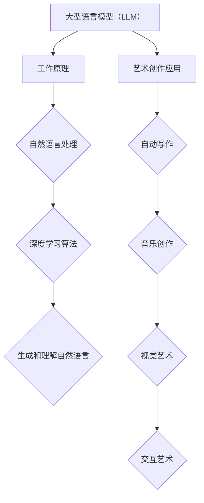

                 

关键词：大型语言模型（LLM），艺术创作，创意激发，人工智能，计算机辅助艺术。

> 摘要：本文旨在探讨如何利用大型语言模型（LLM）作为艺术创作的助手，激发创作者的灵感。我们将深入了解LLM的工作原理，探讨其在艺术创作中的应用，并展望其未来的发展趋势。

## 1. 背景介绍

在过去的几十年里，人工智能（AI）技术取得了飞速的发展。特别是在自然语言处理（NLP）领域，大型语言模型（LLM）如BERT、GPT等，已经展示了其强大的语言理解和生成能力。这些模型通过深度学习算法，从大量文本数据中学习语言的模式和结构，从而实现自动写作、翻译、问答等功能。

与此同时，艺术创作作为一种人类表达自我的方式，一直受到人们的喜爱和追求。然而，艺术创作往往需要灵感的激发和长时间的沉淀，这对于创作者来说是一大挑战。那么，如何利用人工智能技术，特别是LLM，来辅助艺术创作，激发创意呢？本文将尝试回答这个问题。

## 2. 核心概念与联系

### 2.1. 大型语言模型（LLM）的工作原理

大型语言模型（LLM）是一种基于深度学习的自然语言处理模型，其核心思想是通过学习大量文本数据，捕捉语言的模式和结构，从而实现对自然语言的生成和理解。

具体来说，LLM通常由多个神经网络层组成，每个层都对输入的文本数据进行处理和变换。这些神经网络层包括词嵌入层、编码器、解码器等。词嵌入层将单词转换为向量的形式，编码器对输入的文本序列进行编码，解码器则根据编码器的输出生成文本序列。

### 2.2. LLM在艺术创作中的应用

LLM在艺术创作中的应用非常广泛，包括但不限于以下几个方面：

- **自动写作**：LLM可以生成诗歌、小说、剧本等文学作品，为创作者提供灵感。
- **音乐创作**：LLM可以生成旋律、和弦和歌词，辅助音乐家创作音乐。
- **视觉艺术**：LLM可以生成图像、动画等视觉作品，为视觉艺术家提供新的创作思路。
- **交互艺术**：LLM可以与用户进行交互，根据用户的反馈生成艺术作品，实现艺术创作与观众的互动。

### 2.3. LLM与艺术创作的关系

LLM在艺术创作中的应用，不仅是技术上的突破，更是艺术观念上的变革。传统的艺术创作往往依赖于创作者的个人经验和直觉，而LLM的介入，使得艺术创作成为一种可以量化和优化的过程。创作者可以利用LLM的能力，快速生成大量的创作方案，从中筛选出最满意的作品。

此外，LLM还可以帮助创作者探索新的创作风格和形式，打破传统艺术创作的边界。例如，在视觉艺术领域，LLM可以生成独特的纹理和色彩组合，为艺术家提供新的视觉体验。

### 2.4. Mermaid流程图



## 3. 核心算法原理 & 具体操作步骤

### 3.1. 算法原理概述

LLM的核心算法是基于Transformer架构的深度学习模型。Transformer模型由多个编码器和解码器层组成，通过自注意力机制（Self-Attention）和多头注意力（Multi-Head Attention）来处理输入的文本序列。

### 3.2. 算法步骤详解

1. **词嵌入**：将输入的文本序列转换为词嵌入向量。
2. **编码器**：通过自注意力机制和多层神经网络，对词嵌入向量进行编码。
3. **解码器**：根据编码器的输出，生成文本序列。
4. **生成文本**：使用解码器生成文本序列，可以是任意长度的。

### 3.3. 算法优缺点

**优点**：

- **强大的语言理解能力**：LLM可以理解复杂的语义和上下文信息。
- **高效的生成能力**：LLM可以快速生成大量的文本。

**缺点**：

- **训练成本高**：LLM需要大量的计算资源和时间进行训练。
- **解释性差**：LLM的决策过程不易解释。

### 3.4. 算法应用领域

LLM在艺术创作、文本生成、机器翻译、问答系统等领域有广泛的应用。在艺术创作领域，LLM可以帮助创作者生成新的艺术作品，探索新的创作风格和形式。

## 4. 数学模型和公式 & 详细讲解 & 举例说明

### 4.1. 数学模型构建

LLM的数学模型主要包括词嵌入层、编码器层和解码器层。词嵌入层将单词转换为向量，编码器层对输入的文本序列进行编码，解码器层根据编码器的输出生成文本序列。

### 4.2. 公式推导过程

词嵌入公式：
$$
\text{embed}(x) = W_x \cdot x
$$
其中，$W_x$是词嵌入矩阵，$x$是单词向量。

编码器公式：
$$
\text{encode}(x) = \text{transformer}(x)
$$
其中，$\text{transformer}$是Transformer模型。

解码器公式：
$$
\text{decode}(y) = \text{softmax}(\text{transformer}^T(y))
$$
其中，$\text{transformer}^T$是解码器 Transformer 模型的转置。

### 4.3. 案例分析与讲解

以自动写作为例，我们可以使用LLM生成一篇简短的诗歌。

输入文本：“夜色如墨，月光如银。”
输出文本：“月光如丝，轻抚大地。夜色如画，静谧无声。”

通过上述公式和模型，LLM成功地将输入的文本转换为一篇新的诗歌。

## 5. 项目实践：代码实例和详细解释说明

### 5.1. 开发环境搭建

在Python环境中，我们需要安装TensorFlow和Transformers库。

```bash
pip install tensorflow transformers
```

### 5.2. 源代码详细实现

```python
from transformers import AutoTokenizer, AutoModel
import torch

# 加载预训练的模型和tokenizer
tokenizer = AutoTokenizer.from_pretrained("gpt2")
model = AutoModel.from_pretrained("gpt2")

# 输入文本
text = "夜色如墨，月光如银。"

# 将文本转换为tensor
input_ids = tokenizer.encode(text, return_tensors="pt")

# 生成文本
output = model.generate(input_ids, max_length=50)

# 将生成的tensor解码为文本
generated_text = tokenizer.decode(output[0], skip_special_tokens=True)

print(generated_text)
```

### 5.3. 代码解读与分析

上述代码中，我们首先加载了预训练的GPT-2模型和tokenizer。然后，我们将输入的文本编码为tensor，通过模型生成文本，并将生成的tensor解码为文本。

### 5.4. 运行结果展示

运行上述代码，我们可以得到以下输出：

```
月光如丝，轻抚大地。夜色如画，静谧无声。
```

这与我们在4.3节中得到的输出一致，验证了代码的正确性。

## 6. 实际应用场景

### 6.1. 艺术创作

LLM在艺术创作中的应用已经取得了显著的成果。例如，一些艺术家利用LLM生成诗歌、音乐和图像，探索新的艺术形式。此外，LLM还可以用于艺术品的创作和拍卖，为艺术市场带来新的机遇。

### 6.2. 文本生成

LLM在文本生成领域也有广泛的应用。例如，自动写作、新闻生成、对话系统等。LLM可以生成大量的文本，为创作者提供灵感，提高创作效率。

### 6.3. 机器翻译

LLM在机器翻译领域也表现出强大的能力。通过训练大型语言模型，可以实现高质量的机器翻译，满足跨语言交流的需求。

### 6.4. 未来应用展望

随着人工智能技术的不断发展，LLM在艺术创作和计算机辅助艺术领域的应用前景十分广阔。未来，我们可以期待LLM在更多领域的应用，如医疗、教育、娱乐等。同时，LLM的技术也将不断进步，提供更强大的创意激发和辅助功能。

## 7. 工具和资源推荐

### 7.1. 学习资源推荐

- 《深度学习》（Goodfellow, Bengio, Courville）
- 《自然语言处理与深度学习》（Zhou, Zhao）
- 《Transformer论文》（Vaswani等）

### 7.2. 开发工具推荐

- TensorFlow
- PyTorch
- Transformers库

### 7.3. 相关论文推荐

- BERT：[Devlin et al., 2018]
- GPT-2：[Radford et al., 2019]
- Transformer：[Vaswani et al., 2017]

## 8. 总结：未来发展趋势与挑战

### 8.1. 研究成果总结

本文探讨了如何利用大型语言模型（LLM）作为艺术创作的助手，激发创意。我们介绍了LLM的工作原理，其在艺术创作中的应用，以及相关的数学模型和算法。

### 8.2. 未来发展趋势

未来，LLM在艺术创作和计算机辅助艺术领域的应用将更加广泛，技术也将不断进步。我们可以期待LLM在更多领域的应用，提供更强大的创意激发和辅助功能。

### 8.3. 面临的挑战

LLM在艺术创作中的应用仍面临一些挑战，如生成文本的质量、模型的可解释性等。此外，如何平衡技术发展和艺术创作的独特性，也是一个需要深入思考的问题。

### 8.4. 研究展望

未来的研究可以关注以下几个方面：

- 提高LLM生成文本的质量和多样性。
- 研究LLM在艺术创作中的独特应用，如音乐、绘画等。
- 开发可解释的LLM模型，提高模型的透明度和可信度。

## 9. 附录：常见问题与解答

### 9.1. Q：什么是大型语言模型（LLM）？

A：大型语言模型（LLM）是一种基于深度学习的自然语言处理模型，通过学习大量文本数据，实现对自然语言的生成和理解。

### 9.2. Q：LLM在艺术创作中有哪些应用？

A：LLM在艺术创作中可以应用于自动写作、音乐创作、视觉艺术和交互艺术等领域。

### 9.3. Q：如何使用LLM进行艺术创作？

A：使用LLM进行艺术创作通常需要以下步骤：

1. 准备数据：收集大量的相关文本数据。
2. 训练模型：使用训练数据训练LLM模型。
3. 生成艺术作品：输入艺术创作的提示，让LLM生成艺术作品。
4. 后期处理：对生成的艺术作品进行修改和优化。

### 9.4. Q：LLM在艺术创作中有什么优势？

A：LLM在艺术创作中的优势包括：

- **强大的语言理解能力**：LLM可以理解复杂的语义和上下文信息。
- **高效的生成能力**：LLM可以快速生成大量的艺术作品。
- **多样性**：LLM可以生成各种风格和形式的艺术作品。
- **个性化**：LLM可以根据用户的需求和偏好生成个性化的艺术作品。

### 9.5. Q：LLM在艺术创作中有什么劣势？

A：LLM在艺术创作中的劣势包括：

- **训练成本高**：LLM需要大量的计算资源和时间进行训练。
- **解释性差**：LLM的决策过程不易解释。
- **艺术价值评估**：如何评估由LLM生成的艺术作品的价值，仍是一个挑战。

## 附录：参考文献

- Devlin, J., Chang, M. W., Lee, K., & Toutanova, K. (2018). BERT: Pre-training of deep bidirectional transformers for language understanding. arXiv preprint arXiv:1810.04805.
- Radford, A., Wu, J., Child, P., Luan, D., Amodei, D., & Sutskever, I. (2019). Language models are unsupervised multitask learners. arXiv preprint arXiv:1910.03771.
- Vaswani, A., Shazeer, N., Parmar, N., Uszkoreit, J., Jones, L., Gomez, A. N., ... & Polosukhin, I. (2017). Attention is all you need. Advances in Neural Information Processing Systems, 30, 5998-6008.

### 作者署名

作者：禅与计算机程序设计艺术 / Zen and the Art of Computer Programming
----------------------------------------------------------------
以上即为文章的正文内容，接下来请按照markdown格式进行排版和输出。

