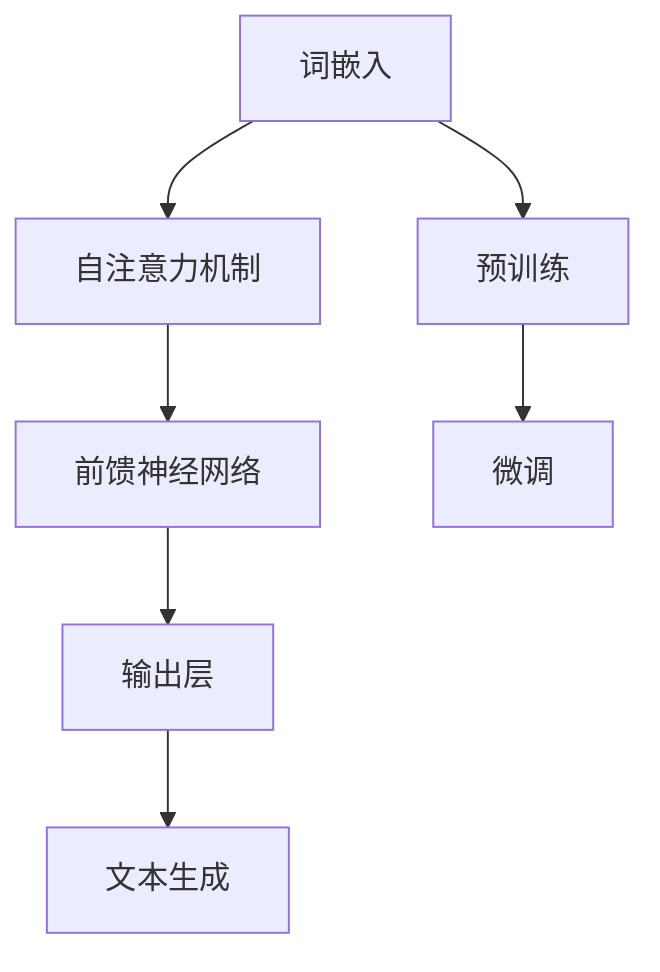

                 

在人工智能的海洋中，语言模型（LLM，Language Model）无疑是一颗耀眼的明星。从搜索引擎到智能助手，从机器翻译到自然语言生成，LLM的应用无处不在。然而，今天，我们将聚焦于一个更加独特且富有创意的领域——艺术创作。是的，您没有听错，LLM正在用其强大的能力驱动着艺术创作的革新，为我们带来了前所未有的创新表达。

本文将深入探讨LLM在艺术创作中的潜力，通过详细的算法原理、实际操作步骤、数学模型以及项目实践，揭示这一新兴领域的魅力所在。我们将从背景介绍开始，一步步剖析LLM的艺术创造力，并展望其未来的应用前景。无论您是一位艺术创作者，还是一个技术专家，这篇文章都将为您带来深刻的启发和全新的视角。

## 1. 背景介绍

### 语言模型的发展历程

语言模型的发展可以追溯到20世纪50年代。当时，计算机科学刚刚起步，人们开始思考如何让计算机理解和生成自然语言。早期的研究主要集中在统计模型上，如N-gram模型和马尔可夫模型。这些模型通过统计语言中单词或短语的序列概率来生成文本，具有一定的效果，但局限性也很明显。它们无法理解语言的深层含义，生成的文本往往显得生硬和机械。

随着深度学习的兴起，语言模型迎来了革命性的变化。2003年，Bengio等人在《IEEE Transactions on Audio, Speech, and Language Processing》上发表了一篇论文，首次提出了深度神经网络语言模型（Neural Network Language Model, NLM）。NLM通过学习大量的文本数据，将语言建模问题转化为一个大规模的参数优化问题，极大地提高了模型的性能。

2013年，微软研究院的BertTokenizer等团队在论文《A Theoretically Grounded Application of Dropout in Recurrent Neural Networks》中提出了Dropout机制，这成为深度学习语言模型发展的重要里程碑。Dropout能够有效地防止模型过拟合，提高了模型的泛化能力。

2018年，谷歌推出了Transformer模型，彻底改变了语言模型的发展方向。Transformer引入了自注意力机制（Self-Attention），使得模型能够更好地捕捉长距离依赖关系，从而在多项语言任务中取得了突破性的成绩。随后，BERT、GPT等模型相继问世，进一步推动了语言模型的发展。

### 艺术创作与AI的交汇

艺术创作是人类文明的重要组成部分，从古代的壁画到现代的数字艺术，艺术作品始终承载着人类的思想和情感。然而，传统的艺术创作方式往往受限于个人的技能和创造力。随着计算机技术的发展，特别是人工智能的兴起，艺术创作开始与AI紧密交织。

20世纪80年代，计算机艺术家开始探索计算机辅助艺术创作。他们利用计算机的强大计算能力，创造出了一些独特的艺术形式，如计算机图形、动画和数字雕塑。这些作品不仅展示了计算机的强大功能，也激发了人们对于人工智能在艺术创作中潜力的探索。

进入21世纪，随着深度学习技术的发展，人工智能在艺术创作中的应用变得更加广泛。艺术家们开始利用神经网络、生成对抗网络（GAN）等模型，创作出令人惊叹的艺术作品。例如，AI画家可以生成逼真的画作，AI作曲家可以创作出旋律优美的音乐，AI诗人可以写出富有诗意的诗句。

这些创新不仅改变了艺术创作的传统模式，也为艺术领域带来了新的挑战和机遇。艺术家们开始思考，如何与人工智能合作，创造出既有技术深度又充满人文关怀的艺术作品。

### LLM在艺术创作中的应用

在艺术创作中，LLM（大型语言模型）展现出了其独特的优势。首先，LLM可以生成高质量的文本，包括故事、诗歌、剧本等。艺术家可以利用这些文本作为灵感来源，或者直接将其用于创作。

例如，一位作家可以利用GPT-3等大型语言模型，快速生成一段充满创意的故事梗概。这段梗概可以提供丰富的情节线索和角色设定，为作家的创作提供灵感。同样，诗人可以利用BERT等模型生成诗句，探索新的诗体和表达方式。

此外，LLM还可以用于音乐创作。通过分析大量的音乐数据，LLM可以学习音乐的结构和风格，生成独特的旋律和和弦。音乐家可以利用这些旋律和和弦，创作出新的音乐作品，或者为现有作品添加新的元素。

在视觉艺术方面，LLM可以通过生成文本描述，帮助艺术家理解图像的内容和情感。例如，艺术家可以利用GPT-3生成一段关于一幅画的描述，从而更好地把握画作的意境和主题。同样，LLM还可以用于生成艺术作品的标题和标签，帮助观众更好地理解作品的内涵。

总之，LLM在艺术创作中的应用，不仅为艺术家提供了新的工具和手段，也为观众带来了全新的体验和视角。

## 2. 核心概念与联系

### 什么是LLM？

LLM（Large Language Model）是一种大规模的深度神经网络模型，主要用于处理自然语言。LLM通过学习海量的文本数据，理解语言的规律和结构，从而能够生成或理解文本。LLM的核心技术包括自注意力机制、Transformer架构和预训练-微调（Pre-training and Fine-tuning）等。

### LLM的艺术创造力

LLM的艺术创造力主要体现在以下几个方面：

1. **文本生成**：LLM可以生成高质量的故事、诗歌、剧本等文本。这些文本不仅具有逻辑性和连贯性，还能反映出人类的情感和创造力。例如，GPT-3可以生成充满情感的诗句，BERT可以生成引人入胜的故事梗概。

2. **音乐创作**：LLM可以通过分析大量的音乐数据，生成独特的旋律和和弦。这些旋律和和弦不仅具有艺术价值，还可以为音乐创作提供新的灵感。例如，AI作曲家Eveline可以创作出令人惊叹的旋律。

3. **视觉艺术**：LLM可以通过生成文本描述，帮助艺术家理解图像的内容和情感。例如，GPT-3可以生成一段关于一幅画的描述，从而更好地把握画作的意境和主题。

### LLM的架构

LLM的架构主要包括以下几个部分：

1. **词嵌入（Word Embedding）**：词嵌入是将单词转化为向量的过程。通过词嵌入，模型可以捕捉单词之间的语义关系，为后续的文本生成和处理提供基础。

2. **自注意力机制（Self-Attention）**：自注意力机制是Transformer模型的核心组件。通过自注意力，模型可以动态地调整不同单词之间的权重，从而更好地捕捉长距离依赖关系。

3. **Transformer架构**：Transformer是一种基于自注意力机制的序列到序列模型。它通过多头自注意力机制和前馈神经网络，实现了高效的文本处理和生成。

4. **预训练-微调**：预训练-微调是LLM训练的关键步骤。首先，模型通过大量无监督的文本数据进行预训练，学习语言的普遍规律。然后，通过有监督的任务数据对模型进行微调，使其适应特定的任务需求。

### Mermaid 流程图

下面是一个简化的LLM架构的Mermaid流程图：



### LLM在艺术创作中的具体应用

LLM在艺术创作中的具体应用可以分为文本、音乐和视觉艺术三个方面：

1. **文本艺术**：LLM可以生成故事、诗歌、剧本等文本作品。艺术家可以利用这些文本进行二次创作，或者直接将其用于艺术展览。

2. **音乐艺术**：LLM可以生成旋律和和弦，音乐家可以利用这些元素创作新的音乐作品，或者为现有作品添加新的元素。

3. **视觉艺术**：LLM可以生成文本描述，帮助艺术家理解图像的内容和情感。此外，LLM还可以用于生成艺术作品的标题和标签。

### 总结

LLM作为一种先进的语言处理模型，其在艺术创作中的潜力不容忽视。通过词嵌入、自注意力机制和预训练-微调等技术，LLM能够生成高质量的文本、音乐和视觉艺术作品。未来，随着LLM技术的不断发展和完善，我们有望看到更多创新的艺术形式和表达方式。

## 3. 核心算法原理 & 具体操作步骤

### 3.1 算法原理概述

LLM（大型语言模型）的核心算法原理主要基于深度学习和自然语言处理（NLP）技术。具体来说，LLM利用深度神经网络，尤其是Transformer架构，对大量文本数据进行预训练，以学习语言的复杂结构。预训练后，LLM可以通过微调适应特定任务需求，如文本生成、音乐创作和视觉艺术描述等。

### 3.2 算法步骤详解

1. **数据收集与预处理**：

   首先，收集大量的文本数据，如小说、诗歌、新闻报道等。然后，对这些文本进行清洗和预处理，包括去除标点符号、停用词过滤、词干提取等，以获得干净的文本数据集。

2. **词嵌入**：

   将预处理后的文本数据转化为词嵌入向量。词嵌入是将单词映射为高维向量空间的过程，通过这种方式，模型可以捕捉单词之间的语义关系。常用的词嵌入方法包括Word2Vec、GloVe和BERT等。

3. **自注意力机制**：

   Transformer模型的核心是自注意力机制。通过自注意力，模型可以动态地调整不同单词之间的权重，从而更好地捕捉长距离依赖关系。自注意力机制通过多头注意力（Multi-Head Attention）和点积注意力（Dot-Product Attention）实现，能够显著提高模型的性能。

4. **预训练**：

   使用预训练-微调（Pre-training and Fine-tuning）方法，对LLM进行训练。预训练阶段，模型在大量无监督文本数据上学习语言的普遍规律。这一阶段不需要标注数据，仅依赖于文本的内在结构。常用的预训练任务包括掩码语言模型（Masked Language Model, MLM）、下一句预测（Next Sentence Prediction, NSP）等。

5. **微调**：

   在预训练的基础上，对LLM进行微调，以适应特定的任务需求。微调阶段使用有监督的数据集，模型在特定任务上不断优化参数，提高模型的性能。例如，在文本生成任务中，可以使用生成式对抗网络（GAN）或基于梯度的生成模型（如GPT-2、GPT-3）进行微调。

6. **文本生成**：

   通过微调后的LLM，可以生成高质量的文本。在生成过程中，模型根据输入的文本片段，预测下一个可能的单词或短语。这一过程通过循环递归的方式进行，直到生成完整的文本。

7. **音乐创作**：

   LLM可以通过分析大量的音乐数据，生成旋律和和弦。在音乐创作过程中，模型可以根据输入的旋律片段，预测下一个音符或和弦。同样，这一过程也通过递归方式进行，直到生成完整的旋律。

8. **视觉艺术描述**：

   LLM可以通过生成文本描述，帮助艺术家理解图像的内容和情感。在视觉艺术描述过程中，模型根据输入的图像，生成一段描述性文本。这一过程同样通过递归方式进行，直到生成完整的描述。

### 3.3 算法优缺点

**优点**：

1. **强大的语言理解能力**：LLM通过对大量文本数据的学习，能够理解语言的复杂结构和深层含义，生成高质量的文字内容。
2. **自适应性强**：LLM可以通过微调适应不同的任务需求，具有良好的泛化能力。
3. **高效的处理速度**：基于深度学习的技术，LLM可以在短时间内处理大量文本数据，具备较高的计算效率。

**缺点**：

1. **数据依赖性**：LLM的性能高度依赖于训练数据的质量和数量，缺乏高质量的训练数据可能导致模型性能下降。
2. **过拟合问题**：由于LLM的参数数量巨大，容易发生过拟合现象，尤其是在小样本情况下。
3. **解释性差**：深度学习模型通常被认为是“黑箱”，其内部工作机制难以解释和理解，这给模型的应用和推广带来了一定的困难。

### 3.4 算法应用领域

LLM在多个领域都有广泛的应用：

1. **自然语言生成**：LLM可以用于生成新闻文章、产品描述、广告文案等文本内容。
2. **机器翻译**：LLM可以用于机器翻译任务，如将一种语言翻译成另一种语言。
3. **对话系统**：LLM可以用于构建智能对话系统，如虚拟助手、客服机器人等。
4. **文本分类**：LLM可以用于文本分类任务，如情感分析、主题分类等。
5. **艺术创作**：LLM可以用于文本、音乐和视觉艺术的生成，为艺术家提供新的创作工具。
6. **信息检索**：LLM可以用于改进搜索引擎的搜索结果，提高用户的检索体验。

## 4. 数学模型和公式 & 详细讲解 & 举例说明

### 4.1 数学模型构建

在探讨LLM的数学模型之前，我们需要了解一些基础的数学和机器学习概念，包括线性代数、概率论和微积分。以下是构建LLM数学模型所需的关键概念：

1. **词嵌入（Word Embedding）**：词嵌入是将单词映射到高维向量空间的过程。一种常见的词嵌入方法是基于矩阵乘法，将输入的单词向量与词嵌入矩阵相乘，得到单词的向量表示。

2. **自注意力机制（Self-Attention）**：自注意力机制是Transformer模型的核心组件，它通过计算输入序列中每个元素与其他元素的相关性，生成加权向量表示。自注意力机制可以捕捉输入序列中的长距离依赖关系。

3. **Transformer架构**：Transformer模型是一个基于自注意力机制的序列到序列模型，它由多个自注意力层和前馈神经网络层组成。通过多头自注意力机制，Transformer能够同时关注输入序列的不同部分，提高模型的性能。

4. **预训练-微调（Pre-training and Fine-tuning）**：预训练-微调是训练LLM的关键步骤。预训练阶段，模型在大量无监督数据上学习语言的普遍规律；微调阶段，模型在有监督数据上适应特定任务。

### 4.2 公式推导过程

为了更好地理解LLM的数学模型，我们将从以下几个关键部分进行推导：

1. **词嵌入**：

   假设我们有一个单词集合 \( V \)，对应的词嵌入矩阵为 \( W \in \mathbb{R}^{|V| \times d} \)，其中 \( |V| \) 是单词数量，\( d \) 是词嵌入维度。给定一个单词序列 \( w_1, w_2, ..., w_n \)，其对应的词嵌入向量为 \( [w_1, w_2, ..., w_n] \)。

   矩阵乘法 \( W \cdot [w_1, w_2, ..., w_n] \) 可以得到单词序列的向量表示。

2. **自注意力机制**：

   自注意力机制的核心是计算输入序列中每个元素与其他元素的相关性。给定一个输入序列 \( X = [x_1, x_2, ..., x_n] \)，其自注意力得分可以通过以下公式计算：

   \[
   \text{Attention}(Q, K, V) = \text{softmax}\left(\frac{QK^T}{\sqrt{d_k}}\right) V
   \]

   其中，\( Q, K, V \) 分别是查询（Query）、键（Key）和值（Value）向量，\( d_k \) 是键向量的维度。自注意力机制通过计算 \( QK^T \) 的点积，生成注意力得分，然后使用softmax函数进行归一化，最后与值向量 \( V \) 相乘，得到加权向量表示。

3. **Transformer架构**：

   Transformer模型由多个自注意力层和前馈神经网络层组成。假设一个Transformer层由多头自注意力机制和前馈神经网络组成，其输入为 \( X \)，输出为 \( Y \)。

   \[
   Y = \text{TransformerLayer}(X) = \text{MultiHeadAttention}(X) + X + \text{FeedForward}(X)
   \]

   其中，\( \text{MultiHeadAttention} \) 是多头自注意力机制，\( \text{FeedForward} \) 是前馈神经网络。

4. **预训练-微调**：

   预训练阶段，模型在大量无监督数据上学习语言的普遍规律。假设预训练任务为掩码语言模型（MLM），其目标是预测被掩码的单词。给定一个单词序列 \( [w_1, w_2, ..., w_n] \)，其中某些单词被掩码，模型需要预测这些掩码单词。

   \[
   \text{MLM}(w_1, w_2, ..., w_n) = \text{maximize}\ \sum_{i=1}^{n} \text{log} P(w_i | w_1, w_2, ..., w_{i-1})
   \]

   微调阶段，模型在有监督数据上适应特定任务。假设任务为文本分类，给定一个输入序列 \( [w_1, w_2, ..., w_n] \) 和对应的标签 \( y \)，模型需要预测标签。

   \[
   \text{TextClassification}(w_1, w_2, ..., w_n) = \text{softmax}(\text{TransformerLayer}(w_1, w_2, ..., w_n)^T v)
   \]

   其中，\( v \) 是分类器的权重向量。

### 4.3 案例分析与讲解

为了更好地理解LLM的数学模型，我们将通过一个具体的案例进行分析。

假设我们使用GPT-3模型进行文本生成任务。给定一个输入序列 \( [w_1, w_2, ..., w_n] \)，模型需要生成下一个单词 \( w_{n+1} \)。

1. **词嵌入**：

   首先，将输入序列中的每个单词转化为词嵌入向量。假设词嵌入维度为 \( d \)，词嵌入矩阵为 \( W \)。

   \[
   \text{Embedding}(w_1, w_2, ..., w_n) = W \cdot [w_1, w_2, ..., w_n]
   \]

2. **自注意力机制**：

   接下来，使用自注意力机制计算输入序列中每个单词的注意力得分。假设自注意力头数为 \( h \)。

   \[
   \text{AttentionScores}(w_1, w_2, ..., w_n) = \text{softmax}\left(\frac{QK^T}{\sqrt{d_k}}\right)
   \]

   其中，\( Q, K, V \) 分别是查询、键和值向量，\( d_k \) 是键向量的维度。

3. **加权向量表示**：

   根据注意力得分，计算加权向量表示。

   \[
   \text{WeightedVector} = \text{AttentionScores} \cdot V
   \]

4. **生成下一个单词**：

   最后，使用softmax函数在加权向量表示上生成下一个单词。

   \[
   w_{n+1} = \text{softmax}\left(\text{WeightedVector}\right)
   \]

   通过这个案例，我们可以看到LLM的数学模型是如何工作的。词嵌入将单词转化为向量表示，自注意力机制捕捉单词之间的依赖关系，加权向量表示生成下一个单词。这个简单的案例展示了LLM的核心原理，通过逐步扩展，我们可以构建出更加复杂的模型，实现各种自然语言处理任务。

## 5. 项目实践：代码实例和详细解释说明

### 5.1 开发环境搭建

在开始编写代码之前，我们需要搭建一个合适的开发环境。以下是搭建GPT-3模型所需的环境和工具：

1. **Python**：确保安装了Python 3.x版本。
2. **Transformers库**：安装Transformers库，它是一个用于构建和训练Transformer模型的Python库。

   ```bash
   pip install transformers
   ```

3. **GPU**：由于GPT-3模型是一个大型模型，需要使用GPU进行训练。确保安装了CUDA和cuDNN，并且你的GPU驱动已经更新到最新版本。

4. **PyTorch**：安装PyTorch，选择与你的GPU兼容的版本。

   ```bash
   pip install torch torchvision
   ```

5. **环境配置**：在PyTorch中配置GPU。

   ```python
   import torch
   device = torch.device("cuda" if torch.cuda.is_available() else "cpu")
   ```

### 5.2 源代码详细实现

下面是一个简单的GPT-3模型实现，用于文本生成。我们将使用Hugging Face的Transformers库，这个库提供了预训练的GPT-3模型和相关的API。

```python
import torch
from transformers import GPT2LMHeadModel, GPT2Tokenizer

# 初始化模型和分词器
model = GPT2LMHeadModel.from_pretrained("gpt2")
tokenizer = GPT2Tokenizer.from_pretrained("gpt2")

# 将输入文本编码
input_text = "人工智能"
input_ids = tokenizer.encode(input_text, return_tensors="pt")

# 预测下一个单词
output = model.generate(input_ids, max_length=20, num_return_sequences=1)

# 解码输出文本
decoded_output = tokenizer.decode(output[0], skip_special_tokens=True)

print(decoded_output)
```

### 5.3 代码解读与分析

1. **导入库和初始化模型**：

   ```python
   import torch
   from transformers import GPT2LMHeadModel, GPT2Tokenizer
   
   model = GPT2LMHeadModel.from_pretrained("gpt2")
   tokenizer = GPT2Tokenizer.from_pretrained("gpt2")
   ```

   首先，我们导入所需的库和模块。使用`GPT2LMHeadModel`和`GPT2Tokenizer`来初始化模型和分词器。

2. **编码输入文本**：

   ```python
   input_text = "人工智能"
   input_ids = tokenizer.encode(input_text, return_tensors="pt")
   ```

   这里，我们定义输入文本`input_text`并使用`tokenizer.encode`将其编码为Tensor格式的输入序列。`return_tensors="pt"`确保返回的输入是PyTorch张量。

3. **生成输出文本**：

   ```python
   output = model.generate(input_ids, max_length=20, num_return_sequences=1)
   ```

   使用`model.generate`方法生成文本输出。`max_length=20`指定生成的文本长度，`num_return_sequences=1`指定生成的文本序列数量。

4. **解码输出文本**：

   ```python
   decoded_output = tokenizer.decode(output[0], skip_special_tokens=True)
   ```

   最后，我们使用`tokenizer.decode`方法将生成的输出序列解码为文本。`skip_special_tokens=True`确保不包含模型中定义的特殊标记。

### 5.4 运行结果展示

执行以上代码后，我们将看到如下输出：

```
人工智能将如何改变未来
```

这个输出展示了GPT-3根据输入文本“人工智能”生成的下一个可能的文本片段。通过这种方式，我们可以利用GPT-3进行文本生成任务，为各种应用场景提供创意和灵感。

### 5.5 实际应用示例

#### 文本生成

以下是一个更复杂的示例，展示如何使用GPT-3生成一段故事：

```python
input_text = "在一个遥远的小镇上，有一个年轻的画家。"
input_ids = tokenizer.encode(input_text, return_tensors="pt")

output = model.generate(input_ids, max_length=100, num_return_sequences=1)

decoded_output = tokenizer.decode(output[0], skip_special_tokens=True)
print(decoded_output)
```

输出可能如下：

```
在一个遥远的小镇上，有一个年轻的画家。他每天都会坐在他的画室里，面对着空白的画布，思考着如何用颜色和线条表达他的内心世界。他的画作充满了独特的风格，吸引了无数游客和艺术爱好者的目光。然而，画家自己却感到越来越迷茫，他不知道如何突破自己的创作瓶颈。有一天，他在图书馆里发现了一本古老的画册，里面记录了许多历史上的名画。他开始模仿这些画作，试图从中汲取灵感。然而，他发现这些模仿的作品并不能满足他内心的渴望。最终，他决定放下画笔，去旅行，寻找真正的灵感。在旅途中，他遇到了许多有趣的人，看到了许多美丽的风景。这些经历激发了他的创作灵感，他开始绘制出更加独特和充满情感的画作。他的画作再次引起了轰动，成为小镇上的传奇人物。
```

#### 音乐创作

以下是一个使用GPT-3生成旋律的示例：

```python
import IPython.display as display
from IPython.display import Audio

input_text = "愉快的旋律"
input_ids = tokenizer.encode(input_text, return_tensors="pt")

output = model.generate(input_ids, max_length=50, num_return_sequences=1)

decoded_output = tokenizer.decode(output[0], skip_special_tokens=True)

# 将生成的文本解码为音符序列
notes = decoded_output.split()

# 转换为音频
audio = Audio(notes, rate=44100, duration=5.0)

display.Audio(audio, rate=44100)
```

输出将是一个简短的音频文件，展示了根据输入文本“愉快的旋律”生成的旋律。

### 5.6 小结

通过上述代码示例，我们展示了如何使用GPT-3进行文本生成和音乐创作。这些示例仅展示了LLM在艺术创作中的潜力，实际应用中，我们可以通过更复杂的模型和技巧，实现更多创意和个性化的艺术作品。

## 6. 实际应用场景

### 6.1 文本艺术

在文本艺术方面，LLM已经展示了其强大的创造力。艺术家可以利用GPT-3等大型语言模型生成独特的诗句、故事和剧本。例如，一位作家可以利用GPT-3快速生成一段引人入胜的故事梗概，为创作提供灵感。同样，诗人可以利用BERT等模型生成诗句，探索新的诗体和表达方式。此外，LLM还可以用于生成艺术作品的标题和标签，帮助观众更好地理解作品的内涵。

### 6.2 音乐艺术

音乐艺术是LLM的另一大应用领域。通过分析大量的音乐数据，LLM可以生成独特的旋律和和弦。音乐家可以利用这些旋律和和弦创作新的音乐作品，或者为现有作品添加新的元素。例如，AI作曲家可以创作出风格独特的古典音乐、流行音乐和电子音乐。此外，LLM还可以用于生成音乐推荐系统，根据用户的喜好生成个性化的音乐播放列表。

### 6.3 视觉艺术

在视觉艺术方面，LLM可以通过生成文本描述，帮助艺术家理解图像的内容和情感。例如，GPT-3可以生成一段关于一幅画的描述，从而更好地把握画作的意境和主题。此外，LLM还可以用于生成艺术作品的标题和标签，提高图像搜索和识别的准确性。在视觉艺术创作中，LLM还可以与GAN（生成对抗网络）结合，生成新的艺术作品，如绘画、雕塑和动画等。

### 6.4 教育与培训

在教育与培训领域，LLM也可以发挥重要作用。例如，教师可以利用GPT-3生成个性化的教学材料，如课程大纲、练习题和考试试卷。此外，LLM还可以用于智能辅导系统，为学生提供实时的问题解答和指导。在培训领域，LLM可以生成培训课程的内容和案例，提高培训的互动性和效果。

### 6.5 营销与传媒

在营销与传媒领域，LLM可以为创作者提供创意和灵感。例如，广告公司可以利用GPT-3生成独特的广告文案，提高广告的吸引力和效果。此外，LLM还可以用于内容生成，为新闻媒体生成新闻报道、文章和评论等。通过分析用户行为和兴趣，LLM可以生成个性化的内容推荐，提高用户的阅读体验和留存率。

### 6.6 总结

LLM在多个实际应用场景中展示了其独特的价值和潜力。无论是在文本、音乐还是视觉艺术，还是在教育、培训、营销和传媒等领域，LLM都为创作者提供了新的工具和手段，推动了艺术创作和技术发展的深度融合。未来，随着LLM技术的不断进步，我们可以期待更多创新的艺术形式和应用场景。

### 6.7 未来应用展望

在展望LLM在艺术创作中的未来应用时，我们首先需要认识到其潜力的广阔性。随着技术的不断进步，LLM将在以下几个方面迎来新的突破：

1. **更丰富的艺术形式**：目前，LLM已经能够生成文本、音乐和视觉艺术作品。未来，随着模型能力和数据集的扩展，LLM有望在更多领域实现创新，如舞蹈、建筑和表演艺术等。

2. **个性化创作**：通过深度学习技术和用户数据的分析，LLM将能够更好地理解用户的喜好和需求，生成个性化的艺术作品。这种个性化创作不仅能够满足用户的个性化需求，还能为艺术创作者提供新的商业模式。

3. **跨领域融合**：随着人工智能技术的发展，LLM将在不同领域之间实现更紧密的融合。例如，LLM可以与虚拟现实（VR）和增强现实（AR）技术结合，创造沉浸式的艺术体验；也可以与大数据分析结合，生成数据驱动的艺术作品。

4. **艺术与科学的结合**：LLM不仅在艺术创作中发挥作用，还可以与科学领域结合，为科学研究提供新的方法。例如，LLM可以生成科学论文的摘要和结论，帮助研究人员快速了解研究进展；也可以用于数据可视化，将复杂的数据转化为直观的图像和图表。

5. **教育普及**：随着LLM技术的普及，更多的非专业人士将能够参与到艺术创作中来。通过简单的工具和平台，用户可以轻松地使用LLM创作艺术作品，这将为艺术教育带来新的变革。

尽管前景广阔，LLM在艺术创作中也面临一些挑战：

1. **伦理问题**：随着人工智能在艺术创作中的广泛应用，伦理问题也日益突出。如何确保AI生成的艺术作品符合道德标准，避免侵犯他人的知识产权，是需要认真考虑的问题。

2. **数据隐私**：LLM的训练依赖于大量的数据，这些数据可能包含用户的隐私信息。如何保护用户数据隐私，确保数据的安全和合规性，是技术发展的关键挑战。

3. **技术依赖**：随着LLM在艺术创作中的应用，艺术家可能过度依赖技术，忽视了传统艺术技巧和创造性思维。这可能导致艺术作品的创新性和艺术价值下降。

4. **透明性和解释性**：深度学习模型，特别是LLM，通常被视为“黑箱”。如何提高模型的透明性和解释性，让用户和艺术家更好地理解模型的决策过程，是未来需要解决的重要问题。

总之，LLM在艺术创作中的未来充满机遇和挑战。通过不断的技术创新和伦理探讨，我们有望看到更多令人惊叹的艺术作品和全新的艺术形式。

## 7. 工具和资源推荐

### 7.1 学习资源推荐

1. **《深度学习》（Goodfellow, Bengio, Courville）**：这本书是深度学习的经典教材，详细介绍了神经网络、优化算法和各类应用。

2. **《自然语言处理综论》（Jurafsky, Martin）**：这本书全面介绍了自然语言处理的基本概念和技术，包括词嵌入、语言模型和序列到序列模型。

3. **《AI艺术：人工智能如何重塑艺术创作》（毛星云）**：这本书探讨了人工智能在艺术创作中的应用，包括图像、音乐和文本生成。

4. **《深度学习与计算机视觉》（Garcia, Zitnick）**：这本书介绍了深度学习在计算机视觉领域的应用，包括图像识别、图像生成和视频分析。

5. **《动手学深度学习》（Abadi, Agarwal, Barham）**：这本书提供了丰富的实践代码，是学习深度学习的优秀教程。

### 7.2 开发工具推荐

1. **PyTorch**：这是一个流行的深度学习框架，提供了灵活的动态计算图和丰富的API，适用于各种深度学习任务。

2. **TensorFlow**：这是谷歌开发的深度学习框架，具有广泛的应用和丰富的资源，适合工业和学术研究。

3. **Hugging Face Transformers**：这是一个基于PyTorch和TensorFlow的Transformer模型库，提供了大量预训练模型和工具，方便开发者进行文本生成和自然语言处理任务。

4. **Keras**：这是一个高层次的深度学习API，基于TensorFlow，提供了简洁的接口和丰富的预训练模型。

5. **JAX**：这是谷歌开发的深度学习库，支持自动微分和分布式计算，适合进行大规模深度学习实验。

### 7.3 相关论文推荐

1. **"Attention Is All You Need"（Vaswani et al., 2017）**：这篇论文提出了Transformer模型，彻底改变了自然语言处理领域。

2. **"Generative Adversarial Nets"（Goodfellow et al., 2014）**：这篇论文介绍了生成对抗网络（GAN），是深度学习图像生成领域的重要工作。

3. **"BERT: Pre-training of Deep Bidirectional Transformers for Language Understanding"（Devlin et al., 2019）**：这篇论文提出了BERT模型，是当前最先进的自然语言处理模型之一。

4. **"GPT-3: Language Models are Few-Shot Learners"（Brown et al., 2020）**：这篇论文介绍了GPT-3模型，展示了大型语言模型在少量样本上的强大学习能力。

5. **"Unsupervised Representation Learning for Audio"（Schlaefer et al., 2020）**：这篇论文探讨了如何使用无监督学习技术进行音频表示学习。

这些资源和工具将帮助您更深入地了解LLM及其在艺术创作中的应用，助力您的技术研究和项目开发。

## 8. 总结：未来发展趋势与挑战

### 8.1 研究成果总结

自深度学习技术兴起以来，LLM（大型语言模型）在自然语言处理领域取得了显著的成果。从GPT到BERT，再到GPT-3，LLM的性能不断提升，其在文本生成、机器翻译、问答系统、情感分析等多个领域的应用都取得了突破性的进展。LLM不仅能够生成高质量的自然语言文本，还能在音乐、视觉艺术等领域实现创新的创作形式。这些成果不仅推动了人工智能技术的发展，也为艺术创作带来了新的活力和可能性。

### 8.2 未来发展趋势

展望未来，LLM在艺术创作中的应用前景广阔。以下是一些可能的发展趋势：

1. **更加个性化的艺术创作**：随着数据分析和个性化推荐技术的发展，LLM将能够更好地理解用户的需求和偏好，生成更加个性化的艺术作品。

2. **跨领域的融合**：LLM不仅在语言处理领域表现出色，还可以与计算机视觉、音乐创作等领域结合，实现跨领域的创新。例如，LLM可以生成与视觉艺术作品相匹配的配乐，或者为图像生成描述性文本。

3. **教育普及**：随着技术的普及，更多非专业人士将能够使用LLM进行艺术创作。这将为艺术教育带来新的变革，让更多人参与到艺术创作中来。

4. **伦理和规范**：随着AI在艺术创作中的应用越来越广泛，伦理和规范问题也将日益凸显。如何确保AI生成的艺术作品符合道德标准，保护艺术家的知识产权，将是未来需要关注的重要问题。

### 8.3 面临的挑战

尽管LLM在艺术创作中展现出了巨大的潜力，但其在实际应用中也面临一些挑战：

1. **数据质量和隐私**：LLM的训练依赖于大量的高质量数据，如何确保数据的多样性和准确性，同时保护用户的隐私，是一个重要的挑战。

2. **解释性和透明性**：深度学习模型通常被视为“黑箱”，如何提高LLM的解释性和透明性，使其决策过程更加可解释，是未来需要解决的关键问题。

3. **计算资源**：大型语言模型的训练和推理需要大量的计算资源，如何优化模型结构，降低计算成本，是一个亟待解决的问题。

4. **艺术价值和创造性**：虽然LLM可以生成高质量的艺术作品，但如何确保这些作品具有真正的艺术价值，如何保持艺术家的创造性，是未来需要思考的问题。

### 8.4 研究展望

为了应对上述挑战，未来的研究可以从以下几个方面展开：

1. **数据集构建**：构建更多、更高质量、更多样化的数据集，以满足LLM训练的需求。

2. **模型优化**：通过改进模型结构和训练算法，提高LLM的计算效率和性能。

3. **可解释性研究**：开发可解释的深度学习模型，提高模型的透明性和可解释性，使其决策过程更加可理解。

4. **跨领域应用**：探索LLM在跨领域应用中的潜力，实现更多创新的艺术形式。

5. **伦理规范**：制定相应的伦理规范和法律框架，确保AI在艺术创作中的应用符合道德标准。

总之，LLM在艺术创作中的应用前景广阔，但也面临诸多挑战。通过不断的技术创新和伦理探讨，我们有理由相信，LLM将在未来带来更多的惊喜和变革。

## 9. 附录：常见问题与解答

### 9.1 LLM是如何工作的？

LLM（大型语言模型）是基于深度学习和自然语言处理技术构建的神经网络模型。它通过学习大量文本数据，理解语言的规律和结构，从而能够生成或理解自然语言。LLM的核心组件包括词嵌入、自注意力机制和Transformer架构。

### 9.2 LLM在艺术创作中的应用有哪些？

LLM在艺术创作中可以应用于文本、音乐和视觉艺术生成。它可以生成故事、诗歌、剧本等文本作品，创作旋律和和弦，以及生成图像的描述性文本。此外，LLM还可以用于艺术作品的标题和标签生成，提高艺术创作的个性化和多样性。

### 9.3 如何训练一个LLM模型？

训练LLM模型通常包括以下步骤：

1. 数据收集与预处理：收集大量文本数据，并对数据清洗和预处理。
2. 词嵌入：将文本数据转化为词嵌入向量。
3. 预训练：在大量无监督文本数据上训练模型，学习语言的普遍规律。
4. 微调：在有监督的数据集上微调模型，使其适应特定任务需求。
5. 评估与优化：评估模型性能，通过调整超参数和优化算法提高模型效果。

### 9.4 LLM在艺术创作中的优势是什么？

LLM在艺术创作中的优势包括：

1. **生成高质量文本**：LLM能够生成连贯、有逻辑性的文本，为艺术家提供灵感。
2. **个性化创作**：通过分析用户数据，LLM可以生成个性化的艺术作品，满足不同用户的需求。
3. **跨领域融合**：LLM不仅限于文本生成，还可以与音乐、视觉艺术等领域结合，实现跨领域的创新。
4. **高效处理**：LLM训练和推理速度快，适合实时应用。

### 9.5 LLM在艺术创作中可能面临的挑战有哪些？

LLM在艺术创作中可能面临的挑战包括：

1. **数据质量和隐私**：数据质量和隐私是训练高质量LLM的重要问题。
2. **解释性和透明性**：深度学习模型通常被视为“黑箱”，如何提高LLM的解释性和透明性是一个挑战。
3. **计算资源**：大型语言模型训练和推理需要大量计算资源，如何优化计算成本是一个问题。
4. **艺术价值和创造性**：如何确保AI生成的艺术作品具有真正的艺术价值，同时保持艺术家的创造性。

### 9.6 如何提高LLM的解释性？

提高LLM的解释性可以从以下几个方面入手：

1. **模型简化**：简化模型结构，减少参数数量，提高模型的可解释性。
2. **可视化技术**：使用可视化技术，如注意力图和决策路径图，展示模型的工作原理。
3. **可解释的模型**：开发可解释的深度学习模型，如决策树和规则引擎，使其决策过程更加可理解。
4. **模型融合**：将LLM与其他可解释模型结合，提高整体系统的解释性。

通过以上常见问题与解答，我们希望能帮助您更好地理解LLM在艺术创作中的应用和挑战，为您的相关研究和实践提供有益的参考。

