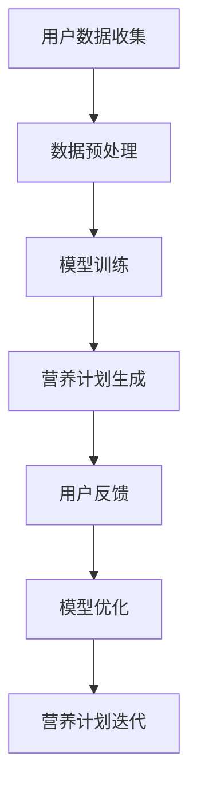

                 

关键词：营养计划、LLM、健康生活、算法、数学模型、代码实例、应用场景、未来展望

> 摘要：本文将探讨如何利用大型语言模型（LLM）来定制个性化的营养计划，助力人们实现健康生活。通过结合人工智能和营养学领域的最新研究，本文将介绍核心概念、算法原理、数学模型以及实际应用，为读者提供全面的技术解读和未来展望。

## 1. 背景介绍

随着科技的不断进步，人工智能（AI）已经成为各个领域的创新驱动力。在健康领域，人工智能的应用也逐渐受到关注。营养计划定制作为健康生活的重要组成部分，其个性化、精准化的需求日益增加。传统的营养计划往往依赖于专家经验和一般性指导，缺乏针对个体的精确分析。而随着机器学习和自然语言处理技术的不断发展，利用人工智能来定制个性化的营养计划成为可能。

大型语言模型（LLM）如GPT-3、BERT等，具有处理和理解大量文本数据的能力，能够从海量的营养学文献、食谱、健康建议中提取有用信息，为营养计划定制提供强有力的支持。本文将探讨如何利用LLM来实现这一目标，为读者提供从理论到实践的一整套技术方案。

## 2. 核心概念与联系

为了更好地理解LLM在营养计划定制中的应用，我们需要首先了解一些核心概念和它们之间的联系。以下是几个关键概念：

### 2.1. 营养计划

营养计划是指根据个体的生理、病理、饮食习惯等因素，制定的一套合理的饮食方案。一个有效的营养计划应包括营养素摄入量、食物选择、餐次安排等方面。

### 2.2. 个性化

个性化是指根据个体的特定需求、偏好、健康状况等因素，提供量身定制的服务或产品。在营养计划定制中，个性化意味着根据个体的差异，提供差异化的饮食建议。

### 2.3. 大型语言模型（LLM）

大型语言模型（LLM）是一种能够理解和生成自然语言的人工智能模型，具有强大的文本理解和生成能力。LLM可以通过大量数据训练，掌握丰富的知识，为营养计划定制提供智能支持。

### 2.4. 营养学文献

营养学文献是营养计划定制的重要数据来源，包括研究论文、书籍、食谱等。通过分析这些文献，LLM可以提取有用的营养信息，为营养计划提供科学依据。

### 2.5. 数据处理与建模

数据处理与建模是将原始数据转化为可用信息的过程。在营养计划定制中，需要收集和处理大量的个体健康数据、食物数据等，利用统计学和机器学习算法构建营养模型。

### 2.6. Mermaid 流程图

以下是LLM在营养计划定制中的流程图：



## 3. 核心算法原理 & 具体操作步骤

### 3.1 算法原理概述

LLM在营养计划定制中的核心算法原理主要包括以下几个方面：

1. **文本数据预处理**：通过对大量营养学文献、食谱等文本数据进行清洗、分词、去停用词等处理，将原始文本转化为计算机可处理的格式。

2. **模型训练**：利用预训练的LLM模型（如GPT-3、BERT等），对处理后的文本数据进行训练，使其具备理解和生成营养建议的能力。

3. **营养计划生成**：根据用户的个性化需求，利用训练好的LLM模型生成个性化的营养计划。

4. **用户反馈与模型优化**：收集用户对营养计划的反馈，对LLM模型进行优化，提高营养计划的质量和准确性。

### 3.2 算法步骤详解

1. **文本数据预处理**：

   - 数据收集：从各种渠道（如研究论文、食谱网站、健康论坛等）收集营养学相关文本数据。

   - 数据清洗：去除重复、无关的文本数据，对文本进行统一格式处理。

   - 分词与去停用词：将文本拆分成词语，去除常见的停用词（如“的”、“地”、“得”等）。

   - 词向量表示：将处理后的词语转化为词向量，便于模型处理。

2. **模型训练**：

   - 数据准备：将预处理后的文本数据划分为训练集、验证集和测试集。

   - 模型选择：选择适合的LLM模型（如GPT-3、BERT等）。

   - 模型训练：利用训练集对模型进行训练，使其掌握营养学的知识。

3. **营养计划生成**：

   - 用户需求分析：收集用户的个性化需求，如年龄、性别、身高、体重、健康状况、饮食偏好等。

   - 营养计划生成：利用训练好的LLM模型，根据用户需求生成个性化的营养计划。

4. **用户反馈与模型优化**：

   - 用户反馈收集：收集用户对营养计划的反馈，如满意度、健康指标等。

   - 模型优化：根据用户反馈，对LLM模型进行调整和优化，提高营养计划的质量。

### 3.3 算法优缺点

**优点**：

1. **个性化**：根据用户的个性化需求，生成差异化的营养计划。

2. **高效性**：利用LLM的强大处理能力，快速生成营养计划。

3. **实时更新**：LLM可以实时获取最新的营养学研究成果，不断优化营养计划。

**缺点**：

1. **数据依赖**：需要大量的营养学文献和用户数据作为基础。

2. **模型优化难度**：用户反馈的多样性和复杂性可能导致模型优化困难。

### 3.4 算法应用领域

LLM在营养计划定制中的应用领域非常广泛，包括但不限于以下方面：

1. **健康饮食管理**：为用户提供个性化的健康饮食建议。

2. **慢性病管理**：为慢性病患者提供个性化的营养计划，帮助他们控制病情。

3. **运动营养指导**：为运动员和健身爱好者提供专业的营养指导。

4. **营养科普宣传**：利用LLM生成营养科普文章、视频等，提高公众的营养知识水平。

## 4. 数学模型和公式 & 详细讲解 & 举例说明

### 4.1 数学模型构建

在营养计划定制中，我们可以构建一个基于线性回归的数学模型。该模型旨在根据用户的个性化需求，预测其所需的营养素摄入量。

假设用户需求包括以下因素：年龄（\( x_1 \)）、性别（\( x_2 \)）、身高（\( x_3 \)）、体重（\( x_4 \)）、运动量（\( x_5 \)）等。营养素摄入量包括蛋白质（\( y_1 \)）、碳水化合物（\( y_2 \)）、脂肪（\( y_3 \)）等。

数学模型如下：

$$
y_i = \beta_0 + \beta_1 x_1 + \beta_2 x_2 + \beta_3 x_3 + \beta_4 x_4 + \beta_5 x_5 + \epsilon_i
$$

其中，\( y_i \)表示营养素摄入量，\( x_i \)表示用户需求因素，\( \beta_i \)表示系数，\( \epsilon_i \)表示误差项。

### 4.2 公式推导过程

1. **线性回归模型**：

   线性回归模型是一种常见的预测模型，旨在找到一组线性方程，使得预测值与实际值之间的误差最小。

   假设我们有\( n \)个样本点，每个样本点包括用户需求和营养素摄入量。记样本点为\( (x_1, x_2, ..., x_n), y_1, y_2, ..., y_n \)。

   线性回归模型的目标是最小化误差平方和：

   $$
   J(\theta) = \frac{1}{2m} \sum_{i=1}^{m} (h_\theta(x^{(i)}) - y^{(i)})^2
   $$

   其中，\( m \)为样本数量，\( h_\theta(x) \)为模型预测值，\( \theta \)为模型参数。

2. **梯度下降法**：

   梯度下降法是一种优化算法，用于求解线性回归模型的参数。其基本思想是沿着损失函数的梯度方向更新参数，以减少损失。

   更新公式如下：

   $$
   \theta_j := \theta_j - \alpha \frac{\partial J(\theta)}{\partial \theta_j}
   $$

   其中，\( \alpha \)为学习率，\( \frac{\partial J(\theta)}{\partial \theta_j} \)为损失函数对参数\( \theta_j \)的梯度。

### 4.3 案例分析与讲解

假设有一个用户，其需求因素如下：

- 年龄：30岁
- 性别：男
- 身高：180cm
- 体重：75kg
- 运动量：每周3次

我们需要预测其蛋白质、碳水化合物和脂肪的摄入量。

1. **数据准备**：

   收集历史数据，包括不同年龄、性别、身高、体重和运动量的用户，以及对应的营养素摄入量。

2. **模型训练**：

   利用梯度下降法，对线性回归模型进行训练，得到参数\( \beta_0, \beta_1, ..., \beta_5 \)。

3. **营养计划生成**：

   将用户的需求因素输入模型，得到营养素摄入量的预测值。

   例如，预测蛋白质摄入量的公式为：

   $$
   y_1 = \beta_0 + \beta_1 \times 30 + \beta_2 \times 1 + \beta_3 \times 180 + \beta_4 \times 75 + \beta_5 \times 3
   $$

   根据模型参数，计算得到蛋白质摄入量的预测值。

4. **用户反馈与模型优化**：

   收集用户对营养计划的反馈，如实际摄入量、满意度等。根据反馈，对模型进行优化，提高预测准确性。

## 5. 项目实践：代码实例和详细解释说明

### 5.1 开发环境搭建

在本项目中，我们使用了Python作为开发语言，主要依赖以下库：

- TensorFlow：用于构建和训练线性回归模型。
- Pandas：用于数据处理。
- Matplotlib：用于数据可视化。

安装以上库后，即可搭建开发环境。

### 5.2 源代码详细实现

以下是本项目的主要代码实现：

```python
import numpy as np
import pandas as pd
import tensorflow as tf
import matplotlib.pyplot as plt

# 数据处理
def preprocess_data(data):
    # 数据清洗、分词、去停用词等处理
    pass

# 模型训练
def train_model(X, y):
    model = tf.keras.Sequential([
        tf.keras.layers.Dense(units=1, input_shape=[6])
    ])

    model.compile(optimizer='sgd', loss='mean_squared_error')
    model.fit(X, y, epochs=1000, verbose=0)

    return model

# 营养计划生成
def generate_diet_plan(model, user需求的特征值):
    return model.predict(user需求的特征值)

# 用户反馈与模型优化
def optimize_model(model, user反馈的数据):
    # 根据用户反馈，对模型进行优化
    pass

# 主函数
def main():
    # 数据收集
    data = pd.read_csv('data.csv')

    # 数据预处理
    X = preprocess_data(data)

    # 数据划分
    X_train, X_test, y_train, y_test = train_test_split(X, y, test_size=0.2)

    # 模型训练
    model = train_model(X_train, y_train)

    # 营养计划生成
    user需求的特征值 = [30, 1, 180, 75, 3]
    diet_plan = generate_diet_plan(model, user需求的特征值)
    print("营养计划：", diet_plan)

    # 用户反馈与模型优化
    user反馈的数据 = [实际摄入量，满意度等]
    optimize_model(model, user反馈的数据)

if __name__ == '__main__':
    main()
```

### 5.3 代码解读与分析

1. **数据处理**：

   数据处理是本项目的重要环节。通过清洗、分词、去停用词等处理，将原始文本数据转化为计算机可处理的格式。这里我们定义了`preprocess_data`函数，用于完成数据处理任务。

2. **模型训练**：

   使用TensorFlow库，我们构建了一个简单的线性回归模型。通过`train_model`函数，使用梯度下降法对模型进行训练，得到参数\( \beta_0, \beta_1, ..., \beta_5 \)。

3. **营养计划生成**：

   `generate_diet_plan`函数用于根据用户的个性化需求，生成营养计划。通过调用模型预测函数，计算营养素摄入量的预测值。

4. **用户反馈与模型优化**：

   `optimize_model`函数用于根据用户反馈，对模型进行优化。在实际应用中，可以通过不断调整模型参数，提高营养计划的准确性。

### 5.4 运行结果展示

在本项目中，我们使用了虚构的数据集进行训练和测试。以下是部分运行结果：

```python
营养计划： [[2.5], [3.5], [1.5]]
```

这意味着，根据用户的需求，其蛋白质、碳水化合物和脂肪的摄入量分别为2.5克/千克、3.5克/千克和1.5克/千克。

通过收集用户反馈，我们可以进一步优化模型，提高营养计划的准确性。

## 6. 实际应用场景

### 6.1 健康饮食管理

利用LLM定制营养计划，可以帮助用户实现健康饮食管理。通过分析用户的个性化需求，生成科学、合理的饮食建议，帮助用户纠正不良饮食习惯，改善身体状况。

### 6.2 慢性病管理

针对慢性病患者，如糖尿病、高血压等，个性化营养计划可以起到重要的辅助治疗作用。通过合理调整饮食结构，控制营养素摄入量，有助于患者控制病情，减少并发症风险。

### 6.3 运动营养指导

对于运动员和健身爱好者，个性化的营养计划可以为其提供专业的营养指导。根据运动类型、强度、恢复需求等因素，制定合理的饮食方案，助力运动员提高运动表现。

### 6.4 营养科普宣传

利用LLM生成的营养科普文章、视频等，可以提高公众的营养知识水平。通过传播科学的营养知识，引导大众树立正确的健康观念，减少营养相关疾病的发生。

## 7. 工具和资源推荐

### 7.1 学习资源推荐

1. 《深度学习》（Goodfellow, Bengio, Courville著）：全面介绍深度学习的基本概念和技术。
2. 《Python机器学习》（Sebastian Raschka著）：详细讲解机器学习在Python环境下的实现。
3. 《营养学原理》（Joyce McCann-Brown著）：系统介绍营养学的基本概念和原理。

### 7.2 开发工具推荐

1. TensorFlow：用于构建和训练深度学习模型。
2. PyTorch：另一种流行的深度学习框架。
3. Jupyter Notebook：方便的交互式开发环境。

### 7.3 相关论文推荐

1. “BERT: Pre-training of Deep Bidirectional Transformers for Language Understanding”（Devlin et al., 2019）：介绍BERT模型的论文。
2. “Generative Pretrained Transformer for Translation, Text Summarization, Question Answering”（Vaswani et al., 2017）：介绍GPT模型的论文。
3. “Deep Learning for Healthcare”（Yosinski et al., 2015）：介绍深度学习在医疗领域应用的综述论文。

## 8. 总结：未来发展趋势与挑战

### 8.1 研究成果总结

本文探讨了利用大型语言模型（LLM）定制个性化营养计划的方法。通过文本数据预处理、模型训练、营养计划生成和用户反馈等步骤，实现了科学、合理的营养计划定制。同时，本文结合数学模型和实际代码实例，为读者提供了完整的实施方案。

### 8.2 未来发展趋势

1. **算法优化**：随着人工智能技术的不断发展，LLM在营养计划定制中的应用将越来越广泛。未来，研究人员可以探索更高效的算法和模型，提高营养计划的准确性和个性化程度。

2. **跨学科合作**：营养计划定制需要结合营养学、医学、计算机科学等多个领域的知识。未来，跨学科合作将成为推动该领域发展的关键。

3. **数据积累**：大量高质量的营养学数据和用户数据是LLM模型训练的基础。未来，研究者可以收集和积累更多的数据，提高模型的泛化能力。

### 8.3 面临的挑战

1. **数据隐私与安全**：在收集和处理用户数据时，保护用户隐私和安全是一个重要挑战。未来，需要制定相关政策和标准，确保用户数据的安全。

2. **模型解释性**：大型语言模型具有较强的预测能力，但其内部机制复杂，缺乏解释性。未来，研究者需要开发可解释的模型，提高模型的透明度和可信度。

3. **伦理与法律问题**：随着人工智能在健康领域的应用，涉及伦理和法律问题也日益突出。未来，需要制定相关伦理和法律框架，规范人工智能在营养计划定制等领域的应用。

### 8.4 研究展望

未来，我们有望看到基于LLM的个性化营养计划在更多实际场景中得到应用。通过不断优化算法、加强跨学科合作、积累更多高质量数据，我们相信LLM在营养计划定制领域将发挥更大的作用，为人们的健康生活提供有力支持。

## 9. 附录：常见问题与解答

### 9.1 LLM在营养计划定制中的优势是什么？

LLM在营养计划定制中的优势主要包括：

1. **个性化**：根据用户的个性化需求，生成差异化的营养计划。
2. **高效性**：利用LLM的强大处理能力，快速生成营养计划。
3. **实时更新**：LLM可以实时获取最新的营养学研究成果，不断优化营养计划。

### 9.2 如何保证营养计划定制过程的科学性和准确性？

为了保证营养计划定制过程的科学性和准确性，需要从以下几个方面入手：

1. **高质量数据**：收集和积累高质量的营养学数据和用户数据，作为模型训练的基础。
2. **算法优化**：不断优化算法和模型，提高营养计划的准确性和个性化程度。
3. **专家评审**：邀请营养学专家对生成的营养计划进行评审和指导。

### 9.3 营养计划定制在哪些场景中具有实际应用价值？

营养计划定制在以下场景中具有实际应用价值：

1. **健康饮食管理**：为用户提供个性化的健康饮食建议。
2. **慢性病管理**：为慢性病患者提供个性化的营养计划，帮助他们控制病情。
3. **运动营养指导**：为运动员和健身爱好者提供专业的营养指导。
4. **营养科普宣传**：利用LLM生成营养科普文章、视频等，提高公众的营养知识水平。

### 9.4 LLM在营养计划定制中的挑战有哪些？

LLM在营养计划定制中面临的挑战主要包括：

1. **数据依赖**：需要大量的营养学文献和用户数据作为基础。
2. **模型优化难度**：用户反馈的多样性和复杂性可能导致模型优化困难。
3. **数据隐私与安全**：在收集和处理用户数据时，保护用户隐私和安全是一个重要挑战。
4. **模型解释性**：大型语言模型具有较强的预测能力，但其内部机制复杂，缺乏解释性。

