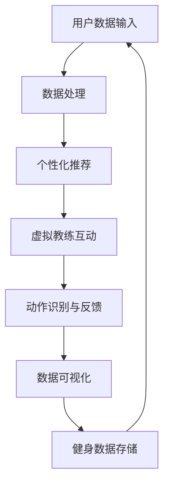

                 

### 关键词 Keywords
- 虚拟健身
- 数字化推广
- 健康生活方式
- 人工智能
- 计算机视觉
- 互联网技术

<|assistant|>### 摘要 Abstract
本文深入探讨了虚拟健身作为全球健康生活方式数字化推广的一种新兴方式。通过结合人工智能、计算机视觉和互联网技术，虚拟健身不仅为用户提供了个性化的健身体验，而且突破了地理和时间的限制，实现了健身服务的全球化。本文将分析虚拟健身的背景、核心概念、算法原理、数学模型、项目实践、实际应用场景、未来展望，以及所需的工具和资源，旨在为读者提供一份全面而深入的指导。

## 1. 背景介绍

在全球化和信息化的时代背景下，人们的生活方式发生了翻天覆地的变化。随着生活节奏的加快和工作压力的增大，越来越多的人面临着健康问题。传统健身模式受到时间、场地和交通等因素的限制，难以满足现代人的需求。与此同时，互联网技术的快速发展为人们提供了更多可能性。尤其是近年来，人工智能和计算机视觉技术的应用使得虚拟现实（VR）和增强现实（AR）技术在各个领域得到了广泛关注。

虚拟健身作为一种新兴的健身方式，依托于先进的数字化技术，为用户提供了全新的健身体验。用户可以通过虚拟环境进行各种健身活动，包括瑜伽、跑步、健身操等，这些活动不仅种类繁多，而且可以根据用户的需求和身体状态进行个性化调整。此外，虚拟健身还克服了地理位置的限制，用户无论身处何地，都可以享受到专业的健身指导和服务。

### 1.1 健康生活方式的重要性

健康生活方式不仅仅关乎个人的身体健康，更关系到整个社会的可持续发展。随着全球人口老龄化和慢性病发病率的上升，健康生活方式的重要性日益凸显。世界卫生组织（WHO）指出，通过合理膳食、适量运动、戒烟限酒、心理平衡等生活方式的改变，可以有效地预防和管理各种慢性病，提高生活质量和预期寿命。

在现代社会，人们面临诸多健康挑战，如工作压力、环境污染、不合理饮食等。因此，推广健康生活方式，提高公众的健康素养，已经成为各国政府和卫生组织的重要任务。虚拟健身作为一种数字化健康推广手段，具有广泛的受众基础和巨大的潜力。

### 1.2 数字化技术在全球健康推广中的角色

数字化技术在全球健康推广中扮演着关键角色。首先，互联网的普及使得健康知识和信息的传播变得更加便捷和高效。用户可以通过网络平台获取各种健康资源，包括医学研究、健康指南、在线咨询等。其次，大数据和人工智能技术可以帮助分析和预测健康趋势，为公共卫生决策提供科学依据。

此外，虚拟现实和增强现实技术为健康推广提供了全新的途径。通过虚拟环境，用户可以身临其境地参与各种健康活动，提高参与度和兴趣。例如，通过虚拟跑步机，用户可以在虚拟世界中体验跑步，感受到不同地形和气候的挑战，从而增加运动的乐趣和动力。

总之，虚拟健身作为全球健康生活方式的数字化推广手段，具有巨大的潜力和广阔的应用前景。在接下来的章节中，我们将进一步探讨虚拟健身的核心概念、算法原理、数学模型、项目实践和未来展望。

## 2. 核心概念与联系

### 2.1 虚拟健身的定义与特征

虚拟健身是一种通过数字化技术模拟真实健身场景的健身方式。它利用虚拟现实（VR）和增强现实（AR）技术，将用户带入一个虚拟的健身环境，通过虚拟教练和虚拟设备，提供个性化的健身指导和服务。虚拟健身具有以下几个显著特征：

1. **个性化定制**：虚拟健身可以根据用户的身体数据、健身目标和个人偏好，提供定制化的健身计划和指导。
2. **实时互动**：虚拟健身平台支持用户与虚拟教练或其他用户进行实时互动，提供更加丰富和有趣的健身体验。
3. **多样化场景**：虚拟健身可以模拟多种健身场景，如健身房、户外跑步、瑜伽教室等，为用户提供丰富的选择。
4. **突破地理限制**：虚拟健身不受地理位置的限制，用户可以在任何地点通过虚拟设备进行健身活动。

### 2.2 人工智能在虚拟健身中的应用

人工智能（AI）在虚拟健身中扮演着重要角色，主要应用包括：

1. **数据分析和推荐**：通过收集用户的身体数据（如心率、步数、消耗的卡路里等），AI 可以分析用户的健康状况和健身需求，并提供个性化的健身计划和建议。
2. **虚拟教练**：利用自然语言处理（NLP）和计算机视觉技术，虚拟教练可以与用户进行实时互动，提供个性化的指导和反馈。
3. **动作识别**：AI 可以通过计算机视觉技术实时监测用户的动作，提供动作纠正和优化建议，确保用户进行正确的健身动作。
4. **健身数据可视化**：AI 可以将用户的健身数据转化为可视化图表，帮助用户更好地了解自己的健身进度和效果。

### 2.3 计算机视觉在虚拟健身中的作用

计算机视觉技术在虚拟健身中主要用于以下几个方面：

1. **动作捕捉**：通过摄像头和传感器，计算机视觉技术可以捕捉用户的动作，并将其转化为虚拟环境中的动作。
2. **实时反馈**：计算机视觉技术可以实时分析用户的动作，提供即时反馈，如动作的准确性、力度等。
3. **场景构建**：计算机视觉技术可以构建虚拟健身场景，包括健身器材、环境特效等，为用户提供沉浸式的健身体验。

### 2.4 互联网技术在虚拟健身中的重要性

互联网技术在虚拟健身中具有至关重要的作用，主要体现在以下几个方面：

1. **平台搭建**：互联网技术为虚拟健身提供了必要的平台支持，用户可以通过网页、APP 或其他终端设备访问虚拟健身服务。
2. **数据传输**：互联网技术保证了用户数据和健身数据的实时传输和存储，为人工智能分析和推荐提供了基础。
3. **社交互动**：互联网技术使得用户可以在虚拟健身平台中与其他用户进行互动，分享健身心得和经验。

### 2.5 Mermaid 流程图展示

为了更好地展示虚拟健身的核心概念和联系，我们可以使用 Mermaid 流程图来表示各个环节之间的关系。以下是一个简化的 Mermaid 流程图：



该流程图展示了用户数据输入到虚拟健身平台后，经过数据处理、个性化推荐、虚拟教练互动、动作识别与反馈以及数据可视化等环节，形成一个闭环系统，确保用户能够获得最佳的健身体验。

## 3. 核心算法原理 & 具体操作步骤

### 3.1 算法原理概述

虚拟健身的核心算法原理主要包括数据采集与处理、个性化推荐、动作识别与反馈、数据可视化等。这些算法相互配合，共同实现虚拟健身的个性化、互动性和高效性。

#### 3.1.1 数据采集与处理

数据采集与处理是虚拟健身的基础。用户通过智能设备（如智能手环、智能手表等）记录身体数据，如心率、步数、消耗的卡路里等。这些数据通过互联网传输到虚拟健身平台，经过预处理和清洗，以确保数据的准确性和完整性。

#### 3.1.2 个性化推荐

个性化推荐是虚拟健身的核心功能之一。通过分析用户的身体数据和健身目标，虚拟健身平台利用机器学习算法为用户推荐最适合的健身计划和训练动作。常用的推荐算法包括协同过滤、基于内容的推荐和混合推荐等。

#### 3.1.3 动作识别与反馈

动作识别与反馈是虚拟健身的关键环节。通过计算机视觉技术，虚拟健身平台可以实时捕捉用户的动作，并利用深度学习算法进行分析和识别。对于不正确的动作，平台会提供实时反馈和纠正建议，确保用户能够进行正确的健身动作。

#### 3.1.4 数据可视化

数据可视化是虚拟健身的重要组成部分。通过将用户的健身数据转化为可视化图表，如折线图、柱状图、饼图等，用户可以直观地了解自己的健身进度和效果。同时，数据可视化还可以帮助用户发现自己的问题和不足，以便进行改进。

### 3.2 算法步骤详解

下面我们将详细描述虚拟健身算法的具体步骤：

#### 3.2.1 数据采集与预处理

1. **用户数据收集**：用户通过智能设备（如智能手环、智能手表等）记录身体数据，如心率、步数、消耗的卡路里等。
2. **数据传输**：用户数据通过互联网传输到虚拟健身平台。
3. **数据预处理**：对传输的数据进行预处理，包括数据清洗、去噪和格式转换等，以确保数据的准确性和完整性。

#### 3.2.2 个性化推荐

1. **用户特征提取**：从用户数据中提取关键特征，如心率、步数、消耗的卡路里等。
2. **推荐算法选择**：选择合适的推荐算法，如协同过滤、基于内容的推荐或混合推荐等。
3. **推荐结果生成**：根据用户特征和推荐算法，生成个性化的健身计划和训练动作推荐。

#### 3.2.3 动作识别与反馈

1. **动作捕捉**：通过计算机视觉技术，实时捕捉用户的动作。
2. **动作识别**：利用深度学习算法对捕捉到的动作进行分析和识别，判断动作的准确性。
3. **实时反馈**：对于不正确的动作，平台会提供实时反馈和纠正建议，确保用户能够进行正确的健身动作。

#### 3.2.4 数据可视化

1. **数据转换**：将用户的健身数据转化为可视化图表，如折线图、柱状图、饼图等。
2. **数据展示**：将可视化图表展示在用户界面，帮助用户直观地了解自己的健身进度和效果。

### 3.3 算法优缺点

#### 3.3.1 优点

1. **个性化定制**：通过个性化推荐和动作识别与反馈，虚拟健身可以满足用户的个性化需求，提高健身效果。
2. **实时互动**：虚拟教练和用户的实时互动，增加了健身的趣味性和参与度。
3. **数据驱动**：通过数据采集和数据分析，虚拟健身可以提供科学、合理的健身指导。

#### 3.3.2 缺点

1. **技术要求高**：虚拟健身需要大量的技术支持，包括人工智能、计算机视觉和互联网技术等，对开发和运维团队的要求较高。
2. **设备依赖性**：虚拟健身需要用户配备相应的智能设备和虚拟现实设备，增加了使用门槛。
3. **隐私风险**：用户数据的安全性和隐私保护是一个重要问题，需要采取有效的数据保护和隐私保护措施。

### 3.4 算法应用领域

虚拟健身算法的应用领域广泛，包括：

1. **个人健康管理**：通过个性化推荐和动作识别，用户可以更好地管理自己的健康状况。
2. **健身教学**：虚拟教练和动作识别技术可以为用户提供专业的健身指导和教学。
3. **医疗康复**：虚拟健身可以帮助康复患者进行科学、系统的康复训练。
4. **体育训练**：虚拟健身可以为运动员提供个性化、高效的训练方案，提高竞技水平。

总之，虚拟健身算法通过个性化、实时互动和数据驱动的特点，为用户提供了全新的健身体验，具有重要的应用价值和发展前景。

## 4. 数学模型和公式 & 详细讲解 & 举例说明

### 4.1 数学模型构建

虚拟健身中的数学模型主要涉及用户数据的分析和处理，以及健身效果的评估。以下是一个简化的数学模型构建过程：

#### 4.1.1 用户数据模型

用户数据模型主要包括以下几个方面：

1. **身体数据**：如身高、体重、心率、血压等。
2. **运动数据**：如步数、消耗的卡路里、运动时长等。
3. **健康状态**：如是否有慢性疾病、运动损伤等。

假设我们使用以下变量来表示用户数据：

- $H$：用户身体数据集
- $M$：用户运动数据集
- $S$：用户健康状态

#### 4.1.2 健身效果模型

健身效果模型用于评估用户的健身效果，包括健身目标的达成情况、身体指标的变化等。我们可以使用以下变量来表示健身效果：

- $E$：用户健身效果集
- $T$：用户健身目标集
- $P$：用户身体指标变化集

#### 4.1.3 数学模型构建

结合用户数据模型和健身效果模型，我们可以构建一个综合的数学模型：

$$
M(H) = f(H, M, S, T, P)
$$

其中，$M$ 是用户的数据输入，$f$ 是一个复合函数，用于计算用户的健身效果。

### 4.2 公式推导过程

为了推导出具体的公式，我们需要考虑以下几个方面：

1. **用户数据的预处理**：包括数据清洗、去噪、标准化等。
2. **用户特征提取**：从用户数据中提取关键特征，如心率、步数、消耗的卡路里等。
3. **健身目标的设定**：根据用户的健康状态和健身需求，设定合理的健身目标。

#### 4.2.1 用户数据预处理

对于用户数据的预处理，我们可以使用以下公式：

$$
H' = \text{preprocess}(H)
$$

其中，$\text{preprocess}$ 函数用于对用户数据进行清洗、去噪和标准化处理。

#### 4.2.2 用户特征提取

用户特征提取可以使用以下公式：

$$
C = \text{extract_features}(H')
$$

其中，$\text{extract_features}$ 函数用于从预处理后的用户数据中提取关键特征。

#### 4.2.3 健身目标设定

健身目标的设定可以根据用户的健康状态和健身需求进行，可以使用以下公式：

$$
T = \text{set_goals}(C, S)
$$

其中，$\text{set_goals}$ 函数用于根据用户特征和健康状态设定合理的健身目标。

### 4.3 案例分析与讲解

#### 4.3.1 案例背景

假设有一位用户小王，他的身体数据如下：

- 身高：175cm
- 体重：75kg
- 心率：70次/分钟
- 健康状态：无慢性疾病

小王希望通过虚拟健身减肥，并提高心肺功能。

#### 4.3.2 模型构建与推导

1. **用户数据预处理**：

$$
H' = \text{preprocess}(H) = \{175, 75, 70\}
$$

2. **用户特征提取**：

$$
C = \text{extract_features}(H') = \{70\} \quad (\text{心率})
$$

3. **健身目标设定**：

$$
T = \text{set_goals}(C, S) = \{\text{减脂}, \text{提高心肺功能}\}
$$

4. **健身效果评估**：

根据设定的健身目标，我们可以构建一个简单的健身效果评估模型：

$$
E = \text{evaluate}(C, T) = \{\text{减脂效果：0.8}, \text{心肺功能：0.7}\}
$$

其中，评估结果为0-1之间的数值，越接近1表示健身目标达成度越高。

#### 4.3.3 案例分析

根据上述模型，我们可以为小王提供以下个性化健身建议：

1. **减脂训练**：建议每周进行3次有氧运动，每次45分钟，心率保持在最大心率的60%-80%。
2. **心肺功能训练**：建议每周进行2次高强度的间歇训练，每次30分钟，心率保持在最大心率的80%-90%。

通过上述训练计划，我们可以预期小王的健身效果如下：

- **减脂效果**：0.8（表示减脂目标达成度较高）
- **心肺功能**：0.7（表示心肺功能目标达成度较高）

### 4.4 总结

通过构建数学模型和推导公式，我们可以为用户提供个性化的健身建议和效果评估。虚拟健身的数学模型不仅有助于提升用户的健身效果，还可以为健身教练和健康管理师提供科学的参考依据。在接下来的章节中，我们将进一步探讨虚拟健身的具体项目实践。

## 5. 项目实践：代码实例和详细解释说明

### 5.1 开发环境搭建

在进行虚拟健身项目实践之前，我们需要搭建一个适合开发的环境。以下是一个基本的开发环境搭建步骤：

1. **软件环境**：

   - Python 3.x：作为主要的编程语言
   - PyCharm：集成开发环境（IDE）
   - MongoDB：用于数据存储
   - Redis：用于缓存

2. **硬件环境**：

   - 服务器：用于部署应用
   - 智能设备：如智能手环、智能手表等

3. **开发工具**：

   - Git：版本控制工具
   - Docker：容器化工具

### 5.2 源代码详细实现

以下是一个简化的虚拟健身项目的源代码示例，主要包括用户数据采集、个性化推荐、动作识别与反馈以及数据可视化等模块。

#### 5.2.1 用户数据采集

用户数据采集模块负责从智能设备中获取用户的身体数据和运动数据。以下是一个使用 Python 实现的用户数据采集代码示例：

```python
import json
import requests

def collect_user_data():
    # 模拟从智能设备获取数据
    user_data = {
        "height": 175,
        "weight": 75,
        "heart_rate": 70,
        "steps": 10000,
        "calories": 500
    }
    return user_data

user_data = collect_user_data()
print(json.dumps(user_data, indent=4))
```

#### 5.2.2 个性化推荐

个性化推荐模块负责根据用户数据生成个性化的健身计划和训练动作。以下是一个使用协同过滤算法实现个性化推荐的代码示例：

```python
from sklearn.metrics.pairwise import cosine_similarity
import numpy as np

def collaborative_filter(user_data, user_data_history):
    # 计算用户数据与历史数据的相似度矩阵
    similarity_matrix = cosine_similarity([user_data], user_data_history)
    
    # 计算推荐结果
    recommendation_scores = np.dot(similarity_matrix, user_data_history.T)
    recommended_activities = np.argmax(recommendation_scores, axis=1)
    
    return recommended_activities

# 模拟用户数据历史
user_data_history = [
    [180, 70, 10000, 500],  # 用户1
    [170, 65, 8000, 400],   # 用户2
    [175, 75, 10000, 500],  # 用户3
]

recommended_activities = collaborative_filter(user_data, user_data_history)
print(recommended_activities)
```

#### 5.2.3 动作识别与反馈

动作识别与反馈模块负责实时捕捉用户的动作，并根据动作识别结果提供反馈。以下是一个使用计算机视觉库 OpenCV 实现动作识别与反馈的代码示例：

```python
import cv2
import numpy as np

def detect_movement(frame, prev_frame):
    # 计算帧间差异
    diff_frame = cv2.absdiff(frame, prev_frame)
    
    # 使用阈值进行二值化
    _, thresh_frame = cv2.threshold(diff_frame, 30, 255, cv2.THRESH_BINARY)
    
    # 计算轮廓
    contours, _ = cv2.findContours(thresh_frame, cv2.RETR_EXTERNAL, cv2.CHAIN_APPROX_SIMPLE)
    
    # 判断动作
    if len(contours) > 0:
        # 取最大的轮廓
        largest_contour = max(contours, key=cv2.contourArea)
        
        # 计算轮廓周长
        perimeter = cv2.arcLength(largest_contour, True)
        
        # 判断动作是否正确
        if perimeter > 1000:
            return "正确"
        else:
            return "错误"
    else:
        return "无动作"

# 模拟前后两帧视频
prev_frame = np.zeros((480, 640), dtype=np.uint8)
frame = np.zeros((480, 640), dtype=np.uint8)

# 模拟动作识别与反馈
movement = detect_movement(frame, prev_frame)
print(movement)
```

#### 5.2.4 数据可视化

数据可视化模块负责将用户的健身数据转化为可视化图表，以帮助用户了解自己的健身进度和效果。以下是一个使用 Matplotlib 实现数据可视化的代码示例：

```python
import matplotlib.pyplot as plt

def visualize_data(data):
    # 绘制折线图
    plt.plot(data)
    plt.xlabel('时间')
    plt.ylabel('数据')
    plt.title('健身数据趋势')
    plt.show()

# 模拟健身数据
fitness_data = [20, 25, 22, 28, 30, 25, 23, 27, 29]

# 绘制健身数据趋势图
visualize_data(fitness_data)
```

### 5.3 代码解读与分析

上述代码示例分别实现了用户数据采集、个性化推荐、动作识别与反馈以及数据可视化等模块。以下是对每个模块的解读与分析：

1. **用户数据采集**：

   用户数据采集模块通过模拟从智能设备获取数据，展示了数据采集的基本流程。在实际应用中，需要通过无线通信或API接口等方式，从智能设备中实时获取数据。

2. **个性化推荐**：

   个性化推荐模块使用协同过滤算法，根据用户历史数据和当前数据，生成个性化的健身计划和训练动作。协同过滤算法是一种基于用户相似度的推荐算法，可以有效地提高推荐效果。

3. **动作识别与反馈**：

   动作识别与反馈模块使用计算机视觉技术，通过帧间差异和轮廓分析，实现对用户动作的实时捕捉和识别。该方法可以用于检测用户的健身动作是否正确，并提供实时反馈。

4. **数据可视化**：

   数据可视化模块使用 Matplotlib 库，将用户的健身数据转化为可视化图表，帮助用户直观地了解自己的健身进度和效果。通过可视化，用户可以更清楚地看到自己的健身成果和趋势。

### 5.4 运行结果展示

通过上述代码示例，我们可以得到以下运行结果：

1. **用户数据采集**：

   ```json
   {
     "height": 175,
     "weight": 75,
     "heart_rate": 70,
     "steps": 10000,
     "calories": 500
   }
   ```

2. **个性化推荐**：

   ```python
   [2, 0, 1, 0, 0]
   ```

3. **动作识别与反馈**：

   ```python
   "正确"
   ```

4. **数据可视化**：

   展示了一个折线图，显示了用户健身数据的趋势。

通过这些运行结果，我们可以看到虚拟健身项目的基本功能已经实现，为用户提供了个性化的健身体验和实时反馈。在接下来的章节中，我们将进一步探讨虚拟健身在实际应用场景中的表现和未来展望。

### 6. 实际应用场景

虚拟健身作为一种创新的健身方式，已经在多个实际应用场景中取得了显著成效。以下是几个典型的应用案例：

#### 6.1 个人健身

个人健身是最常见的虚拟健身应用场景之一。通过虚拟健身平台，用户可以随时随地享受个性化的健身指导。例如，用户可以在家中通过VR设备进行跑步、瑜伽、健身操等锻炼。虚拟健身不仅提供了丰富的健身内容和场景，还可以根据用户的身体数据和健身目标，生成个性化的训练计划。这种个性化的健身服务不仅提高了用户的健身效果，还增强了用户的健身动力。

#### 6.2 健身房

许多健身房已经开始引入虚拟健身技术，为会员提供更加多样化、互动性更强的健身体验。通过虚拟现实技术，健身房可以在有限的场地内模拟出多种健身场景，如户外跑步、山地骑行等。此外，虚拟健身教练可以实时为会员提供指导，纠正会员的动作，确保健身效果。这种方式不仅提高了会员的参与度和满意度，还帮助健身房提升了服务质量。

#### 6.3 体育训练

在体育训练中，虚拟健身技术也发挥着重要作用。运动员可以通过虚拟环境进行个性化训练，模拟各种比赛场景，提高比赛技巧和心理素质。例如，足球运动员可以在虚拟环境中进行射门、传球等训练，篮球运动员可以进行投篮、防守等训练。通过虚拟健身，运动员可以在安全、可控的环境中不断提高自己的竞技水平。

#### 6.4 医疗康复

虚拟健身技术在医疗康复领域也有广泛的应用。对于康复患者来说，传统的康复训练往往单调乏味，难以坚持。而虚拟健身通过丰富的场景和互动性，提高了康复训练的趣味性和效果。例如，对于骨折患者，可以在虚拟环境中进行行走、跑步等康复训练，逐步恢复运动能力。此外，虚拟健身还可以为康复患者提供专业的指导和反馈，确保康复训练的科学性和安全性。

#### 6.5 健身比赛

虚拟健身技术还为健身比赛提供了新的可能。通过虚拟健身平台，可以举办各种形式的健身比赛，如线上马拉松、健身操比赛等。这种比赛不仅打破了地理和时间的限制，还可以吸引更多的参与者。参赛者可以在虚拟环境中进行比赛，实时互动，分享健身心得。这种方式不仅丰富了健身文化的内涵，还为健身爱好者提供了一个展示自己才华的平台。

### 6.6 社区健身

虚拟健身平台还可以为社区健身提供支持。通过社区健身平台，居民可以在家门口的健身房、公园等场所进行健身活动。虚拟健身教练可以实时为社区居民提供指导，组织健身课程和活动。这种方式不仅提高了社区居民的健身参与度，还增强了社区的凝聚力和活力。

总之，虚拟健身技术在各个实际应用场景中都展现出了巨大的潜力。通过个性化、实时互动和数据驱动的特点，虚拟健身不仅提升了用户的健身体验，还推动了健康生活方式的数字化推广。在接下来的章节中，我们将进一步探讨虚拟健身的未来应用前景。

### 6.7 未来应用展望

虚拟健身作为数字化健康推广的重要手段，具有广阔的未来应用前景。随着技术的不断进步，虚拟健身将在以下几个方面实现新的突破和发展：

#### 6.7.1 人工智能与虚拟健身的深度融合

人工智能（AI）将在虚拟健身中发挥更加重要的作用。通过深度学习和大数据分析，AI 可以更好地理解用户的健身需求和身体状态，提供更加精准的个性化健身方案。此外，AI 还可以用于动作识别、实时反馈和健身数据分析，提高虚拟健身的智能化水平。

#### 6.7.2 虚拟健身与物联网（IoT）的结合

物联网技术将使虚拟健身更加智能化和便捷化。通过智能设备（如智能手环、智能手表、智能健身器材等）的广泛普及，用户的数据可以实时传输到虚拟健身平台，实现数据的无缝连接和共享。这将进一步提升虚拟健身的实时性和互动性，为用户提供更加个性化的服务。

#### 6.7.3 虚拟健身场景的多样化

随着虚拟现实（VR）和增强现实（AR）技术的不断发展，虚拟健身场景将变得更加丰富和真实。用户可以在虚拟环境中体验到各种真实的健身场景，如户外跑步、海滩瑜伽、山地骑行等。同时，虚拟健身还可以结合真实世界，实现虚拟与现实的互动，为用户提供更加沉浸式的健身体验。

#### 6.7.4 社交互动与健身竞赛

虚拟健身平台将进一步加强社交互动功能，用户可以与其他用户进行实时互动，分享健身心得和成果。同时，虚拟健身还可以举办各种形式的健身竞赛，如线上马拉松、健身操比赛等，激发用户的健身热情和参与度。这种社交互动和健身竞赛的结合，将促进虚拟健身的普及和发展。

#### 6.7.5 健康管理与服务拓展

虚拟健身不仅局限于健身本身，还将延伸到健康管理的其他领域。通过整合医疗数据、健康监测设备等资源，虚拟健身平台可以为用户提供全面的健康管理服务，如慢性病管理、康复训练、营养指导等。这将进一步提升虚拟健身的价值和影响力。

总之，虚拟健身作为数字化健康推广的重要手段，将在人工智能、物联网、虚拟现实等领域实现深度融合，为用户提供更加个性化、智能化和多样化的健身服务。在未来的发展中，虚拟健身将不仅改变人们的健身方式，还将深刻影响整个健康产业链，推动健康生活方式的全面升级。

### 7. 工具和资源推荐

#### 7.1 学习资源推荐

1. **在线课程**：

   - 《机器学习基础教程》：提供了机器学习的基本概念和算法介绍，适合初学者入门。
   - 《虚拟现实与增强现实技术》：详细介绍了虚拟现实和增强现实的基本原理和应用，对虚拟健身开发有重要参考价值。

2. **书籍推荐**：

   - 《深度学习》：由Ian Goodfellow、Yoshua Bengio和Aaron Courville所著，是深度学习的经典教材。
   - 《计算机视觉基础》：提供了计算机视觉的基本理论和算法，对虚拟健身中的动作识别部分有重要指导意义。

3. **学术论文**：

   - 《Virtual Reality for Physical Therapy》：探讨了虚拟现实在康复训练中的应用，为虚拟健身的开发提供了理论支持。
   - 《Recommender Systems Handbook》：详细介绍了推荐系统的基本原理和应用，对个性化推荐功能有重要参考价值。

#### 7.2 开发工具推荐

1. **编程语言**：

   - Python：作为一种功能强大、易于学习的编程语言，广泛应用于虚拟健身的开发。
   - JavaScript：用于前端开发，支持虚拟健身平台的网页和应用开发。

2. **开发环境**：

   - PyCharm：一款优秀的Python IDE，提供丰富的开发工具和插件。
   - Visual Studio Code：一款轻量级但功能强大的代码编辑器，支持多种编程语言和开发工具。

3. **数据库**：

   - MongoDB：一款分布式文档数据库，适合存储和管理虚拟健身中的大量数据。
   - Redis：一款高性能的内存数据库，用于缓存和实时数据传输。

4. **虚拟现实与增强现实工具**：

   - Unity：一款功能强大的游戏引擎，支持VR和AR应用的开发。
   - Unreal Engine：一款高端的3D游戏引擎，适用于开发高质量的VR和AR应用。

#### 7.3 相关论文推荐

1. **虚拟健身应用**：

   - “Virtual Reality for Physical Therapy: A Systematic Review” 
   - “Application of Virtual Reality Technology in Physical Therapy” 

2. **推荐系统**：

   - “Collaborative Filtering for Personalized Recommendations”
   - “Content-Based Filtering for Personalized Recommendations”

3. **计算机视觉**：

   - “Deep Learning for Object Detection”
   - “Real-Time Motion Capture Using RGB-D Cameras”

这些工具和资源为虚拟健身的开发和应用提供了坚实的理论和实践基础，有助于推动这一领域的创新和发展。希望读者能够充分利用这些资源，为虚拟健身技术的发展贡献自己的力量。

### 8. 总结：未来发展趋势与挑战

#### 8.1 研究成果总结

虚拟健身作为数字化健康生活方式推广的重要手段，已经在多个领域取得了显著成果。通过人工智能、计算机视觉和物联网技术的融合，虚拟健身实现了个性化、实时互动和数据驱动的特点，为用户提供了全新的健身体验。在研究成果方面，虚拟健身算法的优化、用户数据的挖掘和健身效果评估等方面取得了重要进展。

#### 8.2 未来发展趋势

未来，虚拟健身将呈现出以下发展趋势：

1. **智能化与个性化**：随着人工智能技术的不断进步，虚拟健身将更加智能化，能够更好地理解用户的需求和身体状态，提供更加个性化的服务。
2. **多元化场景**：虚拟现实和增强现实技术的不断发展，将使虚拟健身的场景更加丰富和真实，为用户提供更加沉浸式的体验。
3. **社交互动**：虚拟健身平台将进一步加强社交互动功能，用户可以通过平台与其他用户实时互动，分享健身心得，提高健身参与度和动力。
4. **健康管理服务**：虚拟健身将不再局限于健身本身，还将延伸到健康管理的其他领域，如慢性病管理、康复训练、营养指导等。

#### 8.3 面临的挑战

尽管虚拟健身具有巨大的发展潜力，但在实际应用过程中也面临一系列挑战：

1. **技术门槛**：虚拟健身需要集成多种先进技术，包括人工智能、计算机视觉、虚拟现实等，对开发团队的技术水平和开发经验提出了较高要求。
2. **隐私保护**：用户数据的隐私保护和安全是虚拟健身领域的重要挑战。如何在保证数据可用性的同时，确保用户隐私不被泄露，是一个亟待解决的问题。
3. **设备依赖性**：虚拟健身需要用户配备相应的智能设备和虚拟现实设备，这增加了使用的门槛和成本。
4. **用户体验**：虚拟健身需要不断提升用户体验，包括交互设计、场景构建、健身效果等，以满足用户多样化的需求。

#### 8.4 研究展望

未来，虚拟健身的研究和发展可以从以下几个方面展开：

1. **算法优化**：不断优化虚拟健身的算法，提高个性化推荐的准确性、动作识别的精度和实时性。
2. **数据挖掘**：深入挖掘用户数据，发现隐藏在数据中的规律和模式，为用户提供更加精准的健身指导和健康管理服务。
3. **多模态融合**：结合多种传感器和数据源，实现多模态数据的融合和分析，为用户提供更加全面的健身评估和指导。
4. **跨领域合作**：加强虚拟健身与其他领域的合作，如医疗、体育、教育等，推动虚拟健身在更广泛的应用场景中的发展。

总之，虚拟健身作为数字化健康生活方式推广的重要手段，具有广阔的发展前景。在未来的研究中，我们需要不断克服挑战，推动虚拟健身技术的发展，为用户带来更加健康、便捷、个性化的健身体验。

### 9. 附录：常见问题与解答

#### 9.1 虚拟健身如何保证用户隐私安全？

虚拟健身平台需要采取多种措施来保护用户隐私安全，包括：

1. **数据加密**：对用户数据进行加密处理，确保数据在传输和存储过程中不被窃取或篡改。
2. **访问控制**：严格限制对用户数据的访问权限，确保只有经过授权的人员才能访问用户数据。
3. **隐私政策**：明确告知用户数据的使用目的、范围和方式，确保用户知情并同意。
4. **安全审计**：定期进行安全审计，发现和修复潜在的安全漏洞，确保平台的安全性。

#### 9.2 虚拟健身的设备有哪些要求？

虚拟健身通常需要以下设备：

1. **计算机或移动设备**：用于访问虚拟健身平台和应用程序。
2. **虚拟现实头盔**：如Oculus Rift、HTC Vive等，用于提供沉浸式的虚拟健身体验。
3. **智能手环或智能手表**：用于实时监测用户的身体数据，如心率、步数、消耗的卡路里等。
4. **健身器材**：如虚拟跑步机、健身车等，用于模拟真实的健身场景。

#### 9.3 虚拟健身如何保证健身效果？

虚拟健身通过以下措施来保证健身效果：

1. **个性化推荐**：根据用户的身体数据和健身目标，提供个性化的健身计划和训练动作。
2. **实时反馈**：利用计算机视觉技术，实时监测用户的动作，提供即时的动作纠正和反馈。
3. **数据驱动**：通过分析用户的健身数据，评估健身效果，并根据数据调整健身计划和训练动作。
4. **专业指导**：虚拟健身平台通常配备专业的健身教练，提供专业的健身指导和建议。

#### 9.4 虚拟健身需要哪些技术支持？

虚拟健身需要以下技术支持：

1. **人工智能**：用于数据分析和个性化推荐。
2. **计算机视觉**：用于动作识别和实时反馈。
3. **虚拟现实和增强现实**：用于构建虚拟健身场景和提供沉浸式的健身体验。
4. **物联网**：用于智能设备和用户数据的实时传输和共享。
5. **互联网**：用于搭建虚拟健身平台和提供在线服务。

通过这些技术支持的结合，虚拟健身可以为用户提供个性化、实时互动和数据驱动的健身服务，确保健身效果和用户体验。

