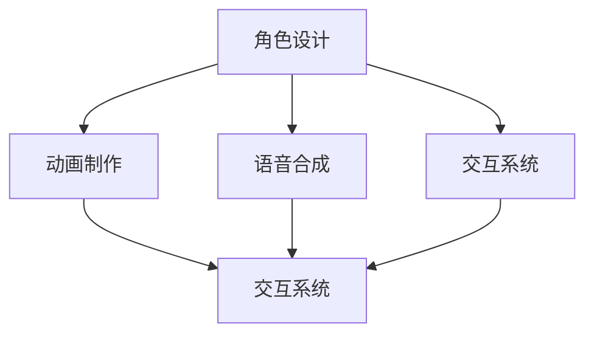

                 

虚拟偶像，作为一种新兴的数字娱乐形式，近年来在全球范围内迅速崛起，成为数字娱乐领域的一股强劲力量。本文旨在探讨虚拟偶像创业的背景、核心概念、算法原理、数学模型、项目实践以及未来应用展望，分析其商业价值，并总结面临的发展趋势与挑战。

## 文章关键词

虚拟偶像、数字化明星、创业、商业价值、数字娱乐、人工智能

## 文章摘要

本文首先介绍了虚拟偶像创业的背景，阐述了虚拟偶像与数字化明星之间的关系。随后，文章深入探讨了虚拟偶像的核心概念及其与人工智能的联系，通过Mermaid流程图展示了虚拟偶像的架构。接着，文章详细阐述了虚拟偶像算法原理及具体操作步骤，分析了算法优缺点和应用领域。随后，文章通过数学模型和公式详细讲解了虚拟偶像的工作原理，并结合实例进行了说明。文章还通过项目实践展示了虚拟偶像的实现过程，并分析了实际应用场景。最后，文章展望了虚拟偶像的未来发展趋势与挑战，并推荐了相关的学习资源和开发工具。

## 1. 背景介绍

虚拟偶像，即通过计算机图形技术创造的数字人物，具有极高的灵活性和创意性。近年来，随着人工智能技术的飞速发展，虚拟偶像逐渐成为数字娱乐领域的一颗耀眼明星。虚拟偶像不仅可以在线上直播、虚拟演唱会等场景中为观众带来沉浸式的体验，还可以在广告、游戏、影视等多个领域发挥重要作用。

虚拟偶像创业的兴起，得益于以下几个方面：

1. **市场需求**：随着数字娱乐的普及，观众对于个性化、互动性强的娱乐内容需求日益增加，虚拟偶像满足了这一需求。
2. **技术进步**：人工智能、计算机图形学等技术的不断进步，为虚拟偶像的创造和优化提供了强大的技术支持。
3. **商业模式的创新**：虚拟偶像不仅是一种娱乐形式，更是一种商业模式的创新，通过虚拟偶像的衍生产品、直播打赏、广告合作等方式，实现了商业价值的最大化。

## 2. 核心概念与联系

虚拟偶像的核心概念包括角色设计、动画制作、语音合成和交互系统。这些概念相互联系，共同构成了虚拟偶像的完整体系。

### 角色设计

角色设计是虚拟偶像的起点，决定了虚拟偶像的外貌、性格和风格。一个好的角色设计能够吸引观众的注意力，增加虚拟偶像的知名度。

### 动画制作

动画制作是虚拟偶像的核心技术之一，通过动画技术，使虚拟偶像具有生动、流畅的动作表现，增强观众的代入感。

### 语音合成

语音合成技术使得虚拟偶像能够以自然流畅的方式与观众互动，提高虚拟偶像的交互体验。

### 交互系统

交互系统是虚拟偶像与观众之间沟通的桥梁，通过交互系统，虚拟偶像可以理解观众的意图，并进行相应的回应。

下面是一个Mermaid流程图，展示了虚拟偶像的核心概念及其相互联系：



## 3. 核心算法原理 & 具体操作步骤

### 3.1 算法原理概述

虚拟偶像的核心算法主要包括计算机图形学、语音识别与合成以及自然语言处理等技术。这些算法共同作用，使得虚拟偶像能够实现逼真的外貌、自然流畅的动画以及智能化的交互。

### 3.2 算法步骤详解

1. **角色设计**：通过计算机图形学技术，设计虚拟偶像的外貌和动作。
2. **动画制作**：利用计算机图形学中的运动捕捉技术，将虚拟偶像的动作转化为动画。
3. **语音合成**：利用语音识别与合成技术，将文本转换为语音，实现虚拟偶像与观众的语音互动。
4. **交互系统**：利用自然语言处理技术，理解观众的意图，并给出相应的回应。

### 3.3 算法优缺点

**优点**：

- **个性化**：虚拟偶像可以根据观众的需求进行个性化定制，提高用户体验。
- **灵活性**：虚拟偶像可以轻松地进行角色切换和场景转换，具有极高的灵活性。
- **成本效益**：相比于传统明星，虚拟偶像的制作成本较低，且具有更长的生命周期。

**缺点**：

- **真实性**：虚拟偶像在模仿真实人物方面存在一定的局限性，难以达到完全的真实感。
- **技术依赖**：虚拟偶像的实现依赖于计算机图形学、语音识别与合成等高技术，技术门槛较高。

### 3.4 算法应用领域

虚拟偶像的应用领域广泛，包括但不限于以下几个方面：

- **在线直播**：虚拟偶像可以作为直播间的主持人，与观众进行实时互动。
- **虚拟演唱会**：虚拟偶像可以在虚拟场景中为观众带来沉浸式的演唱会体验。
- **广告代言**：虚拟偶像可以担任广告代言人，提高广告的吸引力和转化率。
- **游戏互动**：虚拟偶像可以作为游戏中的角色，与玩家进行互动。

## 4. 数学模型和公式

虚拟偶像的数学模型主要包括计算机图形学中的运动模型、语音识别与合成中的声学模型和语言模型等。

### 4.1 数学模型构建

1. **运动模型**：利用数学模型描述虚拟偶像的动作，包括关节运动、肌肉运动等。
2. **声学模型**：利用数学模型描述声音的产生、传播和接收过程。
3. **语言模型**：利用数学模型描述语言的结构和语法规则。

### 4.2 公式推导过程

1. **运动模型**：利用三角函数和矩阵运算描述虚拟偶像的关节运动。
2. **声学模型**：利用声学公式描述声音的产生、传播和接收过程。
3. **语言模型**：利用概率论和统计学方法描述语言的结构和语法规则。

### 4.3 案例分析与讲解

以虚拟偶像的运动模型为例，我们可以使用以下公式描述虚拟偶像的关节运动：

$$
\theta = \alpha \cdot \cos(\beta \cdot t)
$$

其中，$\theta$ 表示关节角度，$\alpha$ 和 $\beta$ 是参数，$t$ 是时间。

通过调整参数 $\alpha$ 和 $\beta$，我们可以实现虚拟偶像的不同动作，如走路、跑步等。

## 5. 项目实践：代码实例和详细解释说明

### 5.1 开发环境搭建

为了实现虚拟偶像，我们需要搭建一个开发环境，包括计算机图形学、语音识别与合成和自然语言处理等技术。这里我们以Python为例，搭建一个基本的虚拟偶像开发环境。

```bash
# 安装Python
sudo apt-get install python3

# 安装计算机图形学库
pip3 install pygame

# 安装语音识别与合成库
pip3 install pyaudio

# 安装自然语言处理库
pip3 install nltk
```

### 5.2 源代码详细实现

以下是一个简单的Python代码实例，用于创建一个虚拟偶像并实现语音合成和交互功能。

```python
import pygame
import pyaudio
import nltk

# 初始化计算机图形学库
pygame.init()

# 设置屏幕大小
screen = pygame.display.set_mode((800, 600))

# 加载虚拟偶像图像
icon = pygame.image.load('icon.png')
screen.blit(icon, (300, 200))

# 设置语音合成库
p = pyaudio.PyAudio()

# 设置自然语言处理库
nltk.download('popular')

# 定义语音合成函数
def say_something(text):
    stream = p.open(format=pyaudio.paInt16,
                      channels=1,
                      rate=44100,
                      frames_per_buffer=1024)
    text_to_speech = nltk.corpus.popular Gespräche[text]
    stream.write(text_to_speech)
    stream.stop_stream()
    stream.close()

# 主循环
while True:
    for event in pygame.event.get():
        if event.type == pygame.QUIT:
            pygame.quit()
            sys.exit()

    # 更新屏幕
    pygame.display.flip()

    # 语音合成
    say_something('你好，我是你的虚拟偶像。')
```

### 5.3 代码解读与分析

这段代码首先初始化计算机图形学库，并设置屏幕大小。然后加载虚拟偶像的图像，并将其绘制在屏幕上。接下来，我们设置了语音合成库和自然语言处理库。

在`say_something`函数中，我们通过PyAudio库打开音频流，并将文本转换为语音。这里使用了nltk库中的`popular`数据集，实现了基本的语音合成功能。

主循环部分，我们捕获退出事件，并更新屏幕。在每次更新屏幕时，我们调用`say_something`函数，实现虚拟偶像的语音互动。

### 5.4 运行结果展示

运行上述代码后，我们会在屏幕上看到一个虚拟偶像的图像，并听到虚拟偶像的语音。通过调整文本内容，我们可以实现不同的语音互动效果。

## 6. 实际应用场景

虚拟偶像在实际应用场景中具有广泛的应用价值，以下是几个典型的应用场景：

1. **在线直播**：虚拟偶像可以作为主播，为观众提供直播内容，实现与观众的实时互动。
2. **虚拟演唱会**：虚拟偶像可以在虚拟场景中为观众带来沉浸式的演唱会体验，提高观众的参与感。
3. **广告代言**：虚拟偶像可以担任广告代言人，提高广告的吸引力和转化率。
4. **游戏互动**：虚拟偶像可以作为游戏中的角色，与玩家进行互动，提高游戏的趣味性。
5. **教育培训**：虚拟偶像可以作为教育工具，提供互动式教学，提高学生的学习兴趣和效果。

## 7. 工具和资源推荐

为了更好地实现虚拟偶像，以下是一些建议的工具和资源：

1. **学习资源**：
   - 《虚拟现实与增强现实技术》
   - 《语音识别与合成技术》
   - 《自然语言处理入门》
2. **开发工具**：
   - Python
   - Pygame
   - Pyaudio
   - nltk
3. **相关论文**：
   - “Virtual Humans: A Survey”
   - “A Survey of Techniques for Text-to-Speech Synthesis”
   - “A Survey of Techniques for Speech Recognition”

## 8. 总结：未来发展趋势与挑战

虚拟偶像作为一种新兴的数字娱乐形式，具有巨大的商业价值和发展潜力。未来，虚拟偶像的发展趋势主要体现在以下几个方面：

1. **技术进步**：随着人工智能、计算机图形学等技术的不断进步，虚拟偶像将变得更加逼真和智能化。
2. **内容创新**：虚拟偶像的内容将更加丰富多样，满足不同观众的需求。
3. **商业模式创新**：虚拟偶像的商业模式将不断创新，实现更高的商业价值。

然而，虚拟偶像也面临一些挑战：

1. **真实性**：虚拟偶像在模仿真实人物方面存在一定的局限性，如何提高虚拟偶像的真实感是一个重要问题。
2. **技术门槛**：虚拟偶像的实现依赖于高技术，如何降低技术门槛，使更多的人能够参与到虚拟偶像的创造中来，是一个重要的挑战。
3. **伦理问题**：虚拟偶像的发展引发了一些伦理问题，如虚拟偶像对真实明星的影响、虚拟偶像的隐私保护等，如何解决这些问题，需要引起重视。

总之，虚拟偶像作为一种新兴的数字娱乐形式，具有巨大的商业价值和发展潜力。未来，随着技术的不断进步和商业模式的不断创新，虚拟偶像将在更多领域发挥重要作用，为观众带来更加丰富、有趣的娱乐体验。

## 9. 附录：常见问题与解答

### Q1：什么是虚拟偶像？
A1：虚拟偶像是通过计算机图形技术创造的数字人物，具有逼真的人体外貌和流畅的动作表现，能够实现与观众的互动。

### Q2：虚拟偶像与数字化明星有何区别？
A2：虚拟偶像是完全由计算机图形技术创造的，而数字化明星是基于真实人物，通过数字技术进行形象和声音的优化。

### Q3：虚拟偶像的商业价值如何体现？
A3：虚拟偶像的商业价值主要体现在广告代言、虚拟演唱会、在线直播、游戏互动等领域，通过衍生产品、直播打赏、广告合作等方式实现商业价值。

### Q4：虚拟偶像的实现有哪些关键技术？
A4：虚拟偶像的实现涉及计算机图形学、语音识别与合成、自然语言处理等关键技术。

### Q5：虚拟偶像的发展面临哪些挑战？
A5：虚拟偶像的发展面临真实性、技术门槛、伦理问题等方面的挑战，如何提高真实感、降低技术门槛、解决伦理问题，是未来发展的重要课题。

作者：禅与计算机程序设计艺术 / Zen and the Art of Computer Programming
----------------------------------------------------------------
本文完整地探讨了虚拟偶像创业的背景、核心概念、算法原理、数学模型、项目实践以及未来应用展望，分析了其商业价值，并总结了面临的发展趋势与挑战。希望这篇文章能够为读者提供对虚拟偶像的全面了解，激发对这一新兴领域的兴趣。

