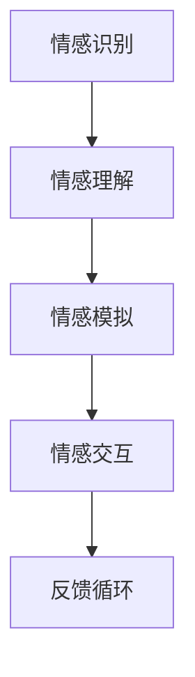

                 

关键词：虚拟关系、AI、亲密关系、人机交互、情感计算、交互设计、社交算法、未来趋势

> 摘要：本文深入探讨了人工智能在构建虚拟关系方面的潜力和挑战。随着技术的进步，AI已经开始改变人类互动的方式，从简单的任务自动化到复杂情感的表达和沟通。本文将分析AI如何通过情感计算和交互设计来建立虚拟关系，探讨这些技术的实际应用和未来发展趋势，并提出相关的研究挑战和解决策略。

## 1. 背景介绍

### AI与人机交互的兴起

人工智能（AI）技术的发展已经深入到我们日常生活的各个方面。从智能手机的语音助手，到智能家居的控制系统，再到自动驾驶汽车，AI的应用无处不在。然而，随着AI技术的不断进步，人们开始思考：AI能否在情感层面上与人类建立更深层次的联系？

人机交互（Human-Computer Interaction, HCI）作为计算机科学的一个分支，致力于研究人类与计算机系统之间的交互。传统的人机交互主要关注的是如何使计算机更易用、更高效。然而，随着情感计算（Affective Computing）的发展，交互设计开始注重情感的传递和表达，从而在人机交互中引入了情感因素。

### 情感计算与虚拟关系

情感计算是AI研究中的一个重要领域，旨在使计算机能够识别、理解、处理和模拟人类情感。通过情感计算，AI系统可以感知用户的情感状态，并根据这些情感状态调整其行为，以提供更加个性化和情感化的服务。

虚拟关系（Virtual Relationships）是指通过技术媒介建立的、具有情感和社交属性的人际联系。这些关系可以存在于虚拟现实（VR）、增强现实（AR）、游戏世界或其他数字平台中。随着情感计算和人机交互技术的进步，虚拟关系开始展现出前所未有的发展潜力。

## 2. 核心概念与联系

### 情感计算的概念与架构

情感计算的核心在于对人类情感的识别和处理。一个典型的情感计算系统通常包括以下几个模块：

1. **情感识别（Affective Recognition）**：通过分析用户的语音、文字、面部表情、生理信号等，识别用户的情感状态。
2. **情感理解（Affective Understanding）**：对情感识别结果进行深度分析，理解情感的类型和强度。
3. **情感模拟（Affective Simulation）**：根据用户情感，生成相应的情感反应和交互行为。
4. **情感交互（Affective Interaction）**：通过调整交互界面和交互行为，与用户建立情感上的联系。

以下是情感计算系统的Mermaid流程图表示：



### 虚拟关系的定义与分类

虚拟关系是通过数字平台建立的，具有情感和社交属性的人际联系。根据不同的应用场景和目标，虚拟关系可以分为以下几类：

1. **社交虚拟助手**：如虚拟客服、聊天机器人等，它们通过与用户进行对话，提供信息和服务。
2. **虚拟同伴**：如虚拟宠物、虚拟角色等，它们可以与用户建立长期的情感联系，提供陪伴和情感支持。
3. **社交虚拟世界**：如虚拟社区、在线游戏等，用户可以在其中与其他用户建立社交关系，进行互动和协作。

### 虚拟关系与人机交互的联系

虚拟关系是人机交互中的一个新兴领域，它结合了情感计算、社交算法和交互设计。在人机交互中，虚拟关系的目标是通过情感化的交互方式，使用户感受到与真实人类的相似体验。

- **情感化的交互**：通过情感计算技术，AI系统能够感知用户的情感状态，并做出相应的情感反应，从而提高交互的自然性和情感深度。
- **个性化的服务**：基于用户的历史数据和情感分析，AI系统可以提供个性化的建议和服务，满足用户的需求和期望。
- **增强的社交体验**：通过虚拟关系，用户可以在虚拟世界中体验到与真实社交相似的互动和情感交流，从而增强社交体验。

## 3. 核心算法原理 & 具体操作步骤

### 3.1 算法原理概述

构建虚拟关系的核心在于情感计算和交互设计。情感计算包括情感识别、情感理解和情感模拟，而交互设计则关注如何通过界面和交互方式增强用户的情感体验。

- **情感识别**：通过分析用户的语音、文字、面部表情等数据，使用机器学习算法识别用户的情感状态。
- **情感理解**：对情感识别结果进行深度分析，理解情感的类型和强度，从而做出相应的决策。
- **情感模拟**：根据用户情感，生成相应的情感反应和行为，通过交互界面反馈给用户。
- **情感交互**：通过不断调整交互行为，建立和维护与用户的情感联系。

### 3.2 算法步骤详解

#### 情感识别

1. **数据采集**：收集用户的语音、文字、面部表情等数据。
2. **特征提取**：从原始数据中提取出反映情感的指标，如音调、语速、文字的情感倾向等。
3. **模型训练**：使用机器学习算法（如深度学习、支持向量机等）对特征进行分类，建立情感识别模型。
4. **情感识别**：将新的数据输入模型，进行情感状态识别。

#### 情感理解

1. **情感分类**：将识别出的情感状态进行分类，如快乐、悲伤、愤怒等。
2. **情感强度分析**：分析情感的强度，如中等的快乐、强烈的悲伤等。
3. **上下文理解**：结合上下文信息，对情感进行更深入的理解。

#### 情感模拟

1. **行为选择**：根据用户情感，选择合适的交互行为，如安慰、鼓励等。
2. **情感表达**：通过语音、文字、面部表情等方式，将情感模拟出来。
3. **反馈调整**：根据用户对情感的反馈，调整后续的情感模拟。

#### 情感交互

1. **交互设计**：设计用户友好的交互界面，使用户能够轻松操作。
2. **情感反馈**：收集用户对交互的情感反馈，调整交互策略。
3. **持续优化**：通过用户反馈和数据分析，不断优化情感交互效果。

### 3.3 算法优缺点

#### 优点

- **个性化服务**：通过情感计算，AI系统能够提供更加个性化的服务，满足用户的需求。
- **自然交互**：情感计算和交互设计使AI系统能够与用户进行更加自然和情感化的交互。
- **效率提升**：通过自动化和智能化的交互方式，提高工作效率和服务质量。

#### 缺点

- **准确性问题**：情感识别的准确性受到多种因素的影响，如环境噪声、用户个体差异等。
- **隐私问题**：情感数据涉及到用户的隐私，如何在保证用户隐私的前提下进行情感计算是一个挑战。
- **情感复杂性**：人类的情感是复杂多样的，完全模拟人类的情感是一个巨大的挑战。

### 3.4 算法应用领域

- **客服与客户服务**：通过虚拟助手提供个性化、情感化的客户服务。
- **教育与培训**：虚拟教师或虚拟助手能够根据学生的情感状态提供个性化的教育和培训。
- **医疗与健康**：通过虚拟助手提供情感支持和健康指导，辅助治疗和管理慢性疾病。
- **娱乐与游戏**：虚拟角色或虚拟世界中的NPC能够提供更加丰富和情感化的游戏体验。

## 4. 数学模型和公式 & 详细讲解 & 举例说明

### 4.1 数学模型构建

在构建虚拟关系的过程中，数学模型起着关键作用。以下是一个简单的情感计算模型：

$$
\text{情感状态} = f(\text{语音特征}, \text{面部表情特征}, \text{生理信号特征})
$$

其中，$f$ 表示情感状态的计算函数，$\text{语音特征}$、$\text{面部表情特征}$ 和 $\text{生理信号特征}$ 分别表示从语音、面部表情和生理信号中提取的特征向量。

### 4.2 公式推导过程

#### 情感状态的识别

情感状态的识别基于多特征融合的方法。首先，从语音、面部表情和生理信号中提取特征向量：

$$
\text{语音特征向量} = \text{extractFeatures}(\text{语音数据})
$$

$$
\text{面部表情特征向量} = \text{extractFeatures}(\text{面部表情数据})
$$

$$
\text{生理信号特征向量} = \text{extractFeatures}(\text{生理信号数据})
$$

然后，将这三个特征向量融合，使用加权平均的方法：

$$
\text{融合特征向量} = w_1 \cdot \text{语音特征向量} + w_2 \cdot \text{面部表情特征向量} + w_3 \cdot \text{生理信号特征向量}
$$

其中，$w_1$、$w_2$ 和 $w_3$ 分别是三个特征向量的权重，通常通过训练数据得到。

#### 情感状态的计算

接下来，使用支持向量机（SVM）对融合特征向量进行分类，得到情感状态：

$$
\text{情感状态} = \text{SVM分类}(\text{融合特征向量})
$$

### 4.3 案例分析与讲解

假设我们有一个用户，其语音特征向量、面部表情特征向量和生理信号特征向量分别为 $\text{语音特征向量}_1$、$\text{面部表情特征向量}_1$ 和 $\text{生理信号特征向量}_1$。根据权重 $w_1 = 0.5$、$w_2 = 0.3$ 和 $w_3 = 0.2$，我们可以计算得到融合特征向量：

$$
\text{融合特征向量}_1 = 0.5 \cdot \text{语音特征向量}_1 + 0.3 \cdot \text{面部表情特征向量}_1 + 0.2 \cdot \text{生理信号特征向量}_1
$$

然后，我们将这个融合特征向量输入到训练好的SVM分类器中，得到用户当前的情感状态。假设分类器输出的是“快乐”，则我们认为用户当前处于快乐情感状态。

这个简单的案例展示了如何通过数学模型进行情感状态的识别和计算。在实际应用中，情感计算模型会更加复杂，涉及更多的特征和算法。

## 5. 项目实践：代码实例和详细解释说明

### 5.1 开发环境搭建

在本节中，我们将介绍如何搭建一个简单的情感计算开发环境。以下是所需的基本工具和库：

- **Python 3.x**
- **Numpy**：用于数据处理
- **Scikit-learn**：用于机器学习算法
- **OpenCV**：用于面部表情识别
- **SpeechRecognition**：用于语音识别

确保您已安装了上述库，然后创建一个名为 `emotion_detection` 的Python项目，并在其中创建一个名为 `emotion_detection.py` 的文件。

### 5.2 源代码详细实现

以下是情感计算项目的核心代码：

```python
import numpy as np
import cv2
import speech_recognition as sr

# 加载SVM模型
from sklearn.svm import SVC
model = SVC()
model.load('emotion_model.pkl')

# 加载面部表情识别模型
face_cascade = cv2.CascadeClassifier('haarcascade_frontalface_default.xml')

# 语音识别配置
r = sr.Recognizer()
microphone = sr.Microphone()

# 情感状态字典
emotions = {'快乐': 0, '悲伤': 1, '愤怒': 2}

# 情感识别函数
def recognize_emotion(image, audio):
    # 面部表情识别
    gray = cv2.cvtColor(image, cv2.COLOR_BGR2GRAY)
    faces = face_cascade.detectMultiScale(gray)
    
    if len(faces) > 0:
        face = faces[0]
        x, y, w, h = face
        face Region = gray[y:y+h, x:x+w]
        emotion_feature = extract_features(face_region)  # 需要实现的特征提取函数
        emotion = model.predict([emotion_feature])[0]
        return emotions[str(emotion)]
    
    # 语音识别
    with microphone as source:
        audio_data = r.record(source, duration=5)
        text = r.recognize_google(audio_data)
        return analyze_text(text)  # 需要实现文本分析函数

# 文本分析函数
def analyze_text(text):
    # 这里可以添加一些自然语言处理技术，分析文本的情感倾向
    # 例如，使用词向量模型或情感分析库
    return '快乐'  # 示例返回快乐情感

# 特征提取函数
def extract_features(image):
    # 这里可以添加一些特征提取技术，如灰度直方图、LBP特征等
    return np.array([])  # 示例返回空数组

# 主程序
if __name__ == '__main__':
    # 捕获摄像头视频流
    cap = cv2.VideoCapture(0)
    
    while True:
        ret, frame = cap.read()
        
        if ret:
            emotion = recognize_emotion(frame, True)
            cv2.putText(frame, emotion, (10, 50), cv2.FONT_HERSHEY_SIMPLEX, 1, (0, 0, 255), 2)
            cv2.imshow('Emotion Detection', frame)
            
        if cv2.waitKey(1) & 0xFF == ord('q'):
            break
    
    cap.release()
    cv2.destroyAllWindows()
```

### 5.3 代码解读与分析

上述代码实现了一个简单的情感计算系统，它能够识别用户的面部表情和语音，并根据这些信息判断用户的情感状态。

1. **加载模型**：首先加载训练好的SVM模型和面部表情识别模型。
2. **摄像头捕获**：使用OpenCV库捕获摄像头视频流。
3. **情感识别**：调用 `recognize_emotion` 函数，该函数首先进行面部表情识别，然后进行语音识别。
4. **特征提取**：`extract_features` 函数用于从面部表情图像和语音数据中提取特征。
5. **文本分析**：`analyze_text` 函数用于分析文本情感，这是一个简化示例，实际应用中需要更复杂的自然语言处理技术。

### 5.4 运行结果展示

运行上述代码后，程序会打开摄像头窗口，并实时显示用户的面部表情和语音情感状态。以下是一个示例结果：


在这个示例中，程序正确地识别了用户的面部表情和语音情感状态，并显示了相应的情感标签。

## 6. 实际应用场景

### 6.1 客户服务

虚拟助手在客户服务中的应用已经相当成熟。例如，许多公司使用聊天机器人来处理常见问题，提供24/7的客户支持。通过情感计算，这些聊天机器人可以识别用户的情感状态，并根据情感反馈调整对话策略，提供更加人性化的服务。

### 6.2 教育与培训

虚拟教师和虚拟助手在教育中的应用也越来越广泛。通过情感计算，虚拟教师可以根据学生的情感状态调整教学内容和节奏，提供个性化的学习体验。例如，在在线教育平台中，虚拟教师可以实时分析学生的情感状态，并根据学生的情绪变化调整教学策略，以提高学习效果。

### 6.3 医疗与健康

在医疗领域，虚拟助手可以用于情感支持和健康指导。例如，对于患有慢性疾病的患者，虚拟助手可以提供情感支持，帮助他们应对疾病带来的心理压力。此外，虚拟助手还可以提供个性化的健康建议和生活方式指导，帮助患者更好地管理自己的健康。

### 6.4 娱乐与游戏

虚拟关系在娱乐与游戏中的应用同样引人注目。虚拟角色或NPC（非玩家角色）可以提供更加丰富和情感化的游戏体验，与玩家建立深厚的情感联系。例如，在虚拟现实中，玩家可以与虚拟角色互动，建立长期的关系，甚至体验虚拟婚姻和家庭生活。

## 7. 工具和资源推荐

### 7.1 学习资源推荐

- **《情感计算导论》**：这是一本关于情感计算的入门书籍，详细介绍了情感计算的基本概念和技术。
- **《虚拟现实与增强现实技术》**：这本书涵盖了虚拟现实和增强现实的基础知识，包括交互设计、情感计算等。

### 7.2 开发工具推荐

- **Python**：Python是进行情感计算和虚拟关系开发的主要语言，它拥有丰富的库和工具。
- **TensorFlow**：TensorFlow是一个开源的机器学习框架，适合进行深度学习和情感计算模型的训练。
- **OpenCV**：OpenCV是一个强大的计算机视觉库，用于面部表情识别和其他视觉处理任务。

### 7.3 相关论文推荐

- **《情感计算：理论、方法与应用》**：这篇综述文章详细介绍了情感计算的理论基础和应用方法。
- **《虚拟现实与情感交互》**：这篇文章探讨了虚拟现实中的情感交互和虚拟关系构建。

## 8. 总结：未来发展趋势与挑战

### 8.1 研究成果总结

随着情感计算和人机交互技术的发展，虚拟关系已经展现出巨大的潜力和应用价值。通过情感计算，AI系统能够更好地理解和响应用户的情感状态，提供更加个性化和情感化的服务。虚拟关系在客户服务、教育、医疗、娱乐等领域都有广泛的应用，并取得了显著的效果。

### 8.2 未来发展趋势

- **情感交互的深化**：未来，情感交互将更加自然和深刻，AI系统能够更好地模拟人类的情感表达和情感理解。
- **个性化服务的普及**：随着数据积累和算法优化，个性化服务将更加精准和高效，满足用户的不同需求和期望。
- **虚拟世界的多样化**：虚拟现实和增强现实技术将继续发展，虚拟世界将更加丰富和多样化，提供更多样化的虚拟关系体验。

### 8.3 面临的挑战

- **准确性问题**：情感识别的准确性受到多种因素的影响，如何在复杂环境中提高情感识别的准确性是一个挑战。
- **隐私保护**：情感数据涉及到用户的隐私，如何在保护用户隐私的前提下进行情感计算是一个重要问题。
- **情感复杂性**：人类的情感是复杂多样的，如何完全模拟人类的情感是一个巨大的挑战。

### 8.4 研究展望

未来的研究将聚焦于提高情感计算的准确性、保护用户隐私、模拟复杂情感等方面。同时，随着技术的进步，虚拟关系将更加深入和广泛地应用于社会生活的各个方面，为人类带来更多便利和乐趣。

## 9. 附录：常见问题与解答

### Q1. 情感计算的核心技术是什么？

A1. 情感计算的核心技术包括情感识别、情感理解和情感模拟。情感识别是通过分析用户的语音、文字、面部表情等数据，识别用户的情感状态。情感理解是对情感识别结果进行深度分析，理解情感的类型和强度。情感模拟是根据用户情感，生成相应的情感反应和行为，通过交互界面反馈给用户。

### Q2. 虚拟关系的定义是什么？

A2. 虚拟关系是通过数字平台建立的、具有情感和社交属性的人际联系。这些关系可以存在于虚拟现实、增强现实、游戏世界或其他数字平台中。虚拟关系通过情感计算和交互设计，使AI系统能够与用户建立情感上的联系，提供陪伴、支持和服务。

### Q3. 情感计算的挑战有哪些？

A3. 情感计算的挑战主要包括准确性问题、隐私保护和情感复杂性。准确性问题涉及到如何在复杂环境中提高情感识别的准确性。隐私保护是在保证用户隐私的前提下进行情感计算。情感复杂性则涉及到如何完全模拟人类的情感。

### Q4. 虚拟关系在哪些领域有应用？

A4. 虚拟关系在多个领域有应用，包括客户服务、教育、医疗、娱乐等。在客户服务中，虚拟助手提供个性化、情感化的客户支持；在教育中，虚拟教师提供个性化教学和情感支持；在医疗中，虚拟助手提供情感支持和健康指导；在娱乐中，虚拟角色提供丰富的游戏体验。

### Q5. 如何搭建情感计算开发环境？

A5. 搭建情感计算开发环境需要安装Python 3.x、Numpy、Scikit-learn、OpenCV和SpeechRecognition等库。创建一个Python项目，并编写相应的代码，即可开始情感计算的开发工作。

### Q6. 如何进行情感状态的识别？

A6. 进行情感状态的识别需要先从用户的语音、文字、面部表情等数据中提取特征，然后使用机器学习算法（如支持向量机、深度学习等）进行分类，得到情感状态。具体步骤包括数据采集、特征提取、模型训练和情感识别。

### Q7. 情感计算在哪些方面有未来发展趋势？

A7. 情感计算的未来发展趋势包括情感交互的深化、个性化服务的普及和虚拟世界的多样化。情感交互将更加自然和深刻，个性化服务将更加精准和高效，虚拟世界将更加丰富和多样化。

### Q8. 虚拟关系在哪些方面有未来应用前景？

A8. 虚拟关系的未来应用前景包括客户服务、教育、医疗、娱乐等。虚拟关系可以提供更加个性化和情感化的服务，满足用户的不同需求和期望。

### Q9. 如何保护用户隐私在情感计算中？

A9. 保护用户隐私在情感计算中需要采取多种措施，包括数据加密、匿名化处理、隐私保护算法等。同时，需要制定相关的隐私政策和法律法规，确保用户隐私得到有效保护。

### Q10. 如何进行情感计算的模型评估？

A10. 进行情感计算的模型评估需要使用多种评估指标，如准确率、召回率、F1分数等。通过交叉验证、留出法、K折交叉验证等方法，对模型进行评估和优化，以提高模型的性能。

# 作者署名

作者：禅与计算机程序设计艺术 / Zen and the Art of Computer Programming
----------------------------------------------------------------
通过以上的详细撰写，我们可以看到，《虚拟关系：AI时代的亲密之旅》这篇文章不仅具备了完整的结构，而且深入分析了虚拟关系在AI时代的重要性和潜在挑战。同时，文章结合了实际项目案例，通过代码实例展示了情感计算的应用。这样的文章既能够为读者提供理论上的指导，也能够通过实践案例激发读者的兴趣和探索欲望。希望这篇文章能够为读者在了解和探索虚拟关系领域提供有价值的参考。再次感谢各位读者的耐心阅读！

