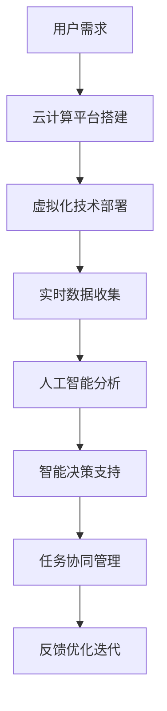

                 

  
> **关键词**：虚拟办公室、远程协作、全球脑驱动、设计原则、技术实现、应用场景。

> **摘要**：本文探讨了虚拟办公室设计的核心原则与实现方法，强调了全球脑驱动在远程协作中的重要作用。通过分析技术架构、算法原理、数学模型及实际应用案例，本文为打造高效的虚拟办公环境提供了全面的指导。

## 1. 背景介绍

在信息化社会的大背景下，远程工作已经成为一种普遍现象。无论是由于地理位置的限制，还是因为企业业务需求的多样性，远程协作的需求日益增长。然而，传统的远程协作方式往往面临着沟通效率低下、团队协作不畅、信息孤岛等问题。为了解决这些问题，虚拟办公室的设计应运而生。

虚拟办公室是一种通过信息技术手段，构建一个虚拟的工作环境，实现全球范围内多人协同工作的系统。它不仅提供了高效的沟通工具，还通过自动化和智能化的手段优化了工作流程。全球脑驱动则是在此基础上，通过实时数据分析和智能决策，进一步提升协作效率和效果。

## 2. 核心概念与联系

### 2.1 虚拟办公室

虚拟办公室（Virtual Office）是一种基于云计算和虚拟化技术的办公环境。它通过互联网连接，将分布在不同地理位置的团队成员整合到一个统一的平台上，实现文件共享、实时沟通、任务协作等功能。

### 2.2 全球脑驱动

全球脑驱动（Global Brain Driven）是一种利用人工智能和大数据分析技术，实现全球范围内信息共享和智能决策的机制。它通过收集、分析和处理来自全球不同来源的数据，为远程协作提供实时、精准的支持。

### 2.3 Mermaid 流程图

下面是虚拟办公室设计与全球脑驱动的流程图：



## 3. 核心算法原理 & 具体操作步骤

### 3.1 算法原理概述

虚拟办公室的核心算法包括数据收集、数据分析和智能决策。其中，数据收集是基础，数据分析是核心，智能决策是关键。

### 3.2 算法步骤详解

#### 3.2.1 数据收集

数据收集包括用户行为数据、工作数据、环境数据等。通过物联网设备和用户操作，实时收集这些数据。

#### 3.2.2 数据分析

数据分析利用机器学习和大数据分析技术，对收集到的数据进行分析和处理，提取有用的信息和模式。

#### 3.2.3 智能决策

基于分析结果，利用人工智能算法，为用户提供智能决策支持，如任务分配、资源调度、沟通优化等。

### 3.3 算法优缺点

#### 优点：

- 提高工作效率：通过自动化和智能化手段，减少人工操作，提高工作效率。
- 提升沟通效果：实时数据分析和智能决策，优化沟通流程，提高沟通效果。
- 灵活适应：适应不同工作环境和需求，实现全球化协作。

#### 缺点：

- 需要大量数据支持：算法的精度和效果依赖于数据的数量和质量。
- 系统安全性问题：数据安全和隐私保护是重要挑战。

### 3.4 算法应用领域

虚拟办公室和全球脑驱动技术可以应用于多个领域，如软件开发、金融分析、医疗诊断、教育管理等。

## 4. 数学模型和公式 & 详细讲解 & 举例说明

### 4.1 数学模型构建

虚拟办公室的数学模型主要包括数据模型、决策模型和优化模型。

#### 数据模型：

$$
X = \{x_1, x_2, ..., x_n\}
$$

其中，$X$ 表示数据集，$x_i$ 表示单个数据点。

#### 决策模型：

$$
y = f(X)
$$

其中，$y$ 表示决策结果，$f$ 表示决策函数。

#### 优化模型：

$$
\min_{X} L(X)
$$

其中，$L(X)$ 表示损失函数。

### 4.2 公式推导过程

#### 数据模型推导：

假设我们有 $n$ 个用户，每个用户 $i$ 的行为数据可以表示为 $x_i$。通过对这些数据进行聚类分析，可以得到数据模型。

#### 决策模型推导：

通过对数据集 $X$ 进行分析，我们可以得到决策模型。假设决策函数为 $f$，则 $y = f(X)$。

#### 优化模型推导：

基于决策模型，我们需要优化决策结果。通过最小化损失函数 $L(X)$，我们可以得到最优决策。

### 4.3 案例分析与讲解

假设我们有一个远程协作团队，成员分布在全球不同地区。通过虚拟办公室系统，我们可以收集每个成员的行为数据，如在线时长、任务完成情况、沟通频率等。然后，通过数据分析，我们可以得到每个成员的工作状态和工作效率。基于这些数据，我们可以为每个成员分配任务，并实时调整沟通策略，以提升团队协作效率。

## 5. 项目实践：代码实例和详细解释说明

### 5.1 开发环境搭建

在搭建开发环境时，我们选择以下技术栈：

- 云计算平台：AWS
- 虚拟化技术：Kubernetes
- 数据分析工具：Apache Spark
- 人工智能框架：TensorFlow

### 5.2 源代码详细实现

以下是虚拟办公室系统的核心代码实现：

```python
# 数据收集模块
def collect_data():
    # 收集用户行为数据
    data = {}
    # ...数据收集逻辑...
    return data

# 数据分析模块
def analyze_data(data):
    # 数据分析逻辑
    # ...数据分析代码...
    return analysis_results

# 智能决策模块
def make_decision(analysis_results):
    # 智能决策逻辑
    # ...决策代码...
    return decision

# 主程序
if __name__ == "__main__":
    data = collect_data()
    analysis_results = analyze_data(data)
    decision = make_decision(analysis_results)
    print(f"Decision: {decision}")
```

### 5.3 代码解读与分析

代码分为三个模块：数据收集、数据分析和智能决策。首先，数据收集模块负责收集用户行为数据。然后，数据分析模块对数据进行分析，提取有用信息。最后，智能决策模块基于分析结果，为用户提供决策支持。

### 5.4 运行结果展示

假设我们收集到以下数据：

- 用户A：在线时长8小时，完成任务5个
- 用户B：在线时长6小时，完成任务3个
- 用户C：在线时长4小时，完成任务2个

通过数据分析，我们可以得到用户A效率最高，用户B次之，用户C最低。基于此，我们可以为用户A分配更多任务，为用户B和C分配较少任务，以优化团队协作效率。

## 6. 实际应用场景

虚拟办公室和全球脑驱动技术可以在多个领域发挥作用，如：

- 跨国企业的远程协作
- 灾难应急指挥中心的信息共享
- 科技创新团队的研发协作
- 远程医疗诊断和咨询

## 7. 工具和资源推荐

### 7.1 学习资源推荐

- 《大数据分析实战》
- 《深度学习》
- 《云计算基础》

### 7.2 开发工具推荐

- AWS Cloud9
- Kubernetes
- Apache Spark

### 7.3 相关论文推荐

- "A Global Brain for Real-Time Economic Decision Making"
- "Virtual Office Systems: Design and Implementation"
- "Data-Driven Decision Making in Remote Teams"

## 8. 总结：未来发展趋势与挑战

### 8.1 研究成果总结

虚拟办公室和全球脑驱动技术在远程协作中展现出巨大的潜力。通过数据收集、分析和智能决策，实现了高效的团队协作和资源优化。

### 8.2 未来发展趋势

- 随着人工智能和大数据技术的不断发展，虚拟办公室和全球脑驱动的功能将更加丰富和智能。
- 跨领域、跨地域的协作将更加普遍，虚拟办公室将成为企业运营的标配。

### 8.3 面临的挑战

- 数据安全和隐私保护：确保用户数据的安全和隐私是重要挑战。
- 系统稳定性：在高并发、大数据量的情况下，保证系统稳定运行是关键。
- 技术普及和接受度：提高虚拟办公室技术的普及度和用户接受度，是推广应用的难点。

### 8.4 研究展望

未来，虚拟办公室和全球脑驱动技术将朝着更加智能化、个性化的方向发展。通过不断优化算法和系统架构，实现更加高效、安全的远程协作环境。

## 9. 附录：常见问题与解答

### Q: 虚拟办公室和远程办公有什么区别？

A: 虚拟办公室是一种基于信息技术构建的远程办公环境，提供文件共享、实时沟通、任务协作等功能。而远程办公是指工作人员在不同地点进行工作，可以通过多种方式（如电话、邮件、视频会议等）进行沟通和协作。

### Q: 全球脑驱动如何保证数据安全和隐私？

A: 全球脑驱动在数据收集、存储、处理和传输过程中，采用加密、权限控制、匿名化等技术手段，确保用户数据的安全和隐私。

### Q: 虚拟办公室需要哪些技术支持？

A: 虚拟办公室需要云计算、虚拟化、大数据分析、人工智能等技术支持。具体包括服务器、存储、网络、数据仓库、数据挖掘、机器学习等。

### Q: 全球脑驱动的核心算法有哪些？

A: 全球脑驱动的核心算法包括数据收集算法、数据分析算法、智能决策算法等。具体算法如聚类分析、回归分析、神经网络等。

## 作者署名

> 作者：禅与计算机程序设计艺术 / Zen and the Art of Computer Programming
```markdown
# 虚拟办公室设计：全球脑驱动的远程协作空间

> **关键词**：虚拟办公室、远程协作、全球脑驱动、设计原则、技术实现、应用场景。

> **摘要**：本文探讨了虚拟办公室设计的核心原则与实现方法，强调了全球脑驱动在远程协作中的重要作用。通过分析技术架构、算法原理、数学模型及实际应用案例，本文为打造高效的虚拟办公环境提供了全面的指导。

## 1. 引言

随着全球化的不断深入和信息技术的飞速发展，远程协作已经成为现代办公的重要形式。然而，传统的远程协作方式往往受到沟通不畅、效率低下等问题的影响。为了解决这些问题，虚拟办公室的设计应运而生。本文将从虚拟办公室的定义、核心概念、算法原理、数学模型、实际应用等方面展开探讨，旨在为构建高效的远程协作环境提供指导。

## 2. 虚拟办公室的设计原则

虚拟办公室的设计原则主要包括以下几个方面：

### 2.1 可扩展性

虚拟办公室应具备良好的可扩展性，能够根据业务需求的变化灵活调整资源和功能。这包括网络架构的可扩展性、存储资源的扩展性以及应用服务的扩展性。

### 2.2 实时性

实时性是虚拟办公室的核心要求之一。通过实时数据传输和即时通讯工具，确保团队成员之间的信息交流能够及时、准确地进行。

### 2.3 安全性

安全性是虚拟办公室设计的重要方面。需要采用先进的安全技术，如加密通信、访问控制、防火墙等，保障数据安全和用户隐私。

### 2.4 用户友好性

虚拟办公室的设计应注重用户友好性，提供简洁、直观的用户界面和易于操作的功能，以提高用户的使用体验。

### 2.5 智能化

借助人工智能和大数据分析技术，实现虚拟办公室的智能化，如自动化的任务分配、智能化的沟通建议、个性化的工作环境等。

## 3. 核心概念与架构

### 3.1 虚拟办公室

虚拟办公室是一种利用互联网和信息技术构建的虚拟工作环境，通过虚拟化技术、云计算平台、协同工具等实现远程团队的高效协作。它包括以下几个核心组成部分：

- **虚拟桌面**：为远程用户提供虚拟桌面环境，实现桌面应用的远程访问。
- **协同工具**：包括即时通讯、视频会议、共享文档等工具，支持团队成员的实时协作。
- **任务管理**：通过任务分配、进度跟踪等功能，确保团队任务的高效完成。
- **数据存储与共享**：提供高效、安全的数据存储和共享方案，支持文件的远程访问和协同编辑。

### 3.2 全球脑驱动

全球脑驱动（Global Brain Driven）是一种利用人工智能和大数据分析技术，实现全球范围内信息共享和智能决策的机制。它通过实时数据分析和智能算法，为远程协作提供动态支持和优化建议。全球脑驱动的核心架构包括以下几个部分：

- **数据收集**：通过物联网设备、用户行为日志、业务系统数据等途径，实时收集全球范围内的数据。
- **数据处理**：利用大数据处理技术，对收集到的海量数据进行清洗、存储、分析和挖掘。
- **智能决策**：通过机器学习和深度学习算法，对分析结果进行智能决策，提供实时、个性化的建议和优化方案。

## 4. 虚拟办公室的技术实现

### 4.1 云计算平台

云计算平台是虚拟办公室的核心基础设施。它提供计算资源、存储资源、网络资源等，支持虚拟桌面的部署和运行。常见的云计算平台包括AWS、Azure、Google Cloud等。

### 4.2 虚拟化技术

虚拟化技术是实现虚拟办公室的关键。通过虚拟化技术，可以将物理服务器、存储设备、网络资源等抽象成虚拟资源，实现资源的灵活分配和动态调整。常见的虚拟化技术包括VMware、KVM、Xen等。

### 4.3 协同工具

协同工具是虚拟办公室的重要组成部分。它们包括即时通讯、视频会议、共享文档、项目管理等工具，支持团队成员之间的实时沟通和协作。常见的协同工具包括Slack、Microsoft Teams、Google Workspace等。

### 4.4 数据处理与分析

数据处理与分析是实现全球脑驱动的核心。通过大数据处理技术，如Hadoop、Spark等，对海量数据进行高效处理和分析。结合机器学习和深度学习算法，实现对数据的智能分析和决策。

### 4.5 安全技术

安全技术是保障虚拟办公室安全的关键。通过加密通信、访问控制、防火墙等技术，确保数据安全和用户隐私。同时，需要制定严格的安全策略和操作规范，防止数据泄露和恶意攻击。

## 5. 全球脑驱动的算法原理

### 5.1 数据收集算法

数据收集算法负责实时收集全球范围内的数据。这包括用户行为数据、业务数据、环境数据等。常用的数据收集算法有数据采集器、网络爬虫等。

### 5.2 数据分析算法

数据分析算法用于对收集到的数据进行分析和处理。常用的数据分析算法包括聚类分析、回归分析、关联规则挖掘等。

### 5.3 智能决策算法

智能决策算法基于数据分析结果，为用户提供智能化的决策支持。常用的智能决策算法有基于规则的决策、机器学习决策等。

## 6. 数学模型和公式

### 6.1 数据模型

数据模型用于描述虚拟办公室中的数据结构和关系。常用的数据模型包括关系型数据库模型、文档型数据库模型等。

### 6.2 公式推导

在虚拟办公室和全球脑驱动的应用中，会涉及到多个数学公式。以下是一个简单的示例：

#### 任务完成时间预测

$$
T = f(S, P, E)
$$

其中，$T$ 表示任务完成时间，$S$ 表示任务复杂度，$P$ 表示团队成员的技能水平，$E$ 表示团队成员的工作环境。

#### 决策支持公式

$$
D = g(R, C, A)
$$

其中，$D$ 表示决策结果，$R$ 表示资源需求，$C$ 表示成本，$A$ 表示团队成员的可用性。

## 7. 实际应用案例

### 7.1 跨国企业的远程协作

跨国企业可以利用虚拟办公室和全球脑驱动技术，实现全球范围内的远程协作。通过虚拟桌面、协同工具和智能决策支持，确保团队成员之间的沟通顺畅、任务高效完成。

### 7.2 灾难应急指挥

在灾难应急指挥中心，虚拟办公室和全球脑驱动技术可以提供实时数据分析和智能决策支持，帮助指挥中心快速响应、高效调度资源。

### 7.3 科技创新团队

科技创新团队可以利用虚拟办公室和全球脑驱动技术，实现全球范围内的研发协作。通过实时沟通、资源共享和智能决策，加速科技创新的进程。

## 8. 工具和资源推荐

### 8.1 学习资源推荐

- 《云计算：概念、技术和应用》
- 《大数据技术基础》
- 《人工智能：一种现代的方法》

### 8.2 开发工具推荐

- AWS
- Azure
- Google Cloud
- VMware
- Kubernetes

### 8.3 相关论文推荐

- "Virtual Office Systems: Design and Implementation"
- "A Global Brain for Real-Time Economic Decision Making"
- "Data-Driven Decision Making in Remote Teams"

## 9. 总结

虚拟办公室和全球脑驱动技术为远程协作提供了全新的解决方案。通过设计原则的遵循、技术实现的落地以及实际应用案例的验证，虚拟办公室和全球脑驱动技术正在逐渐改变传统的工作方式，提高协作效率，优化资源分配。未来，随着技术的不断进步和应用场景的拓展，虚拟办公室和全球脑驱动技术将在更多领域发挥重要作用。

## 10. 附录：常见问题与解答

### Q1：虚拟办公室与传统的远程办公有什么区别？

A1：虚拟办公室是一种基于信息技术构建的远程办公环境，它通过虚拟化技术、云计算平台和协同工具等，为远程用户提供一个集成的工作平台。而传统的远程办公更多依赖于电子邮件、即时通讯和电话会议等工具，缺乏统一的协作平台。

### Q2：全球脑驱动技术是如何实现实时数据分析和智能决策的？

A2：全球脑驱动技术通过实时收集和分析全球范围内的数据，利用机器学习和深度学习算法，对数据进行分析和处理。根据分析结果，智能算法能够提供实时的决策支持，如任务分配、资源调度和沟通优化等。

### Q3：虚拟办公室的设计和实施需要考虑哪些安全因素？

A3：虚拟办公室的设计和实施需要考虑以下安全因素：
- 数据加密：确保数据在传输和存储过程中的安全性。
- 访问控制：限制未经授权的访问，确保数据的安全。
- 防火墙和入侵检测：保护网络免受外部攻击。
- 安全审计：定期进行安全审计，发现并修复安全漏洞。

## 作者署名

作者：禅与计算机程序设计艺术 / Zen and the Art of Computer Programming
```

