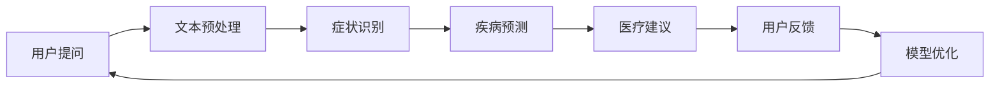

                 

关键词：虚拟医疗助手、大语言模型（LLM）、全天候护理、医疗辅助、自然语言处理（NLP）

## 摘要

随着人工智能技术的迅猛发展，大语言模型（LLM）在各个领域的应用愈发广泛。本文旨在探讨如何利用LLM构建虚拟医疗助手，实现全天候的护理服务。本文首先介绍了虚拟医疗助手的基本概念和重要性，然后详细阐述了LLM在医疗领域的应用原理和实现方法，并通过实际案例展示了虚拟医疗助手的运作效果。最后，本文对虚拟医疗助手的未来发展趋势和挑战进行了展望，并提出了相应的建议。

## 1. 背景介绍

医疗行业一直以来都是技术变革的受益者。从X光机的发明到CT、MRI等先进影像技术的应用，医疗技术不断革新，为人类健康带来了巨大的福音。然而，随着人口老龄化的加剧和医疗需求的不断增加，传统医疗模式面临着巨大的压力。如何提高医疗资源的利用效率，降低医疗成本，成为当前医疗行业亟待解决的问题。

在这个背景下，人工智能技术的出现为医疗行业带来了新的希望。人工智能能够通过大数据分析、机器学习等技术手段，对海量医疗数据进行处理和分析，从而辅助医生做出更准确的诊断和治疗决策。而大语言模型（LLM）作为人工智能的重要分支，其在自然语言处理（NLP）领域的突出表现，使得其在医疗领域的应用前景更加广阔。

虚拟医疗助手就是基于LLM技术构建的一种智能化医疗应用，它可以通过自然语言交互，为用户提供全天候的护理服务。这种助手不仅可以减轻医护人员的工作负担，提高医疗效率，还可以为那些偏远地区或无法及时就医的患者提供便捷的医疗服务。

## 2. 核心概念与联系

### 2.1 大语言模型（LLM）

大语言模型（LLM）是一种基于深度学习技术的自然语言处理模型，其通过学习海量文本数据，能够对自然语言进行理解和生成。LLM具有以下几个关键特点：

1. **大规模参数**：LLM拥有数十亿到千亿级别的参数，这使得其具有强大的文本处理能力。
2. **端到端学习**：LLM通过端到端的学习方式，能够直接从原始文本中学习，无需经过复杂的特征提取和预处理。
3. **自适应能力**：LLM能够在不同的任务和数据集上自适应地调整，以适应不同的应用场景。

### 2.2 自然语言处理（NLP）

自然语言处理（NLP）是人工智能的一个重要分支，它涉及计算机和人类语言之间的交互。NLP的关键技术包括：

1. **文本分类**：将文本分类到预定义的类别中，例如情感分析、主题分类等。
2. **实体识别**：识别文本中的关键实体，如人名、地点、组织等。
3. **机器翻译**：将一种语言的文本翻译成另一种语言。
4. **对话系统**：构建能够与人类进行自然语言交互的系统。

### 2.3 虚拟医疗助手

虚拟医疗助手是一种基于人工智能技术的医疗辅助系统，它能够通过自然语言交互，为用户提供医疗咨询、病情诊断、治疗建议等服务。虚拟医疗助手的主要功能包括：

1. **症状咨询**：用户可以通过输入症状描述，获得可能的疾病诊断和医疗建议。
2. **健康监测**：虚拟医疗助手可以监控用户的健康数据，如血压、血糖等，并提供健康建议。
3. **医学问答**：用户可以提出医学问题，虚拟医疗助手会根据其内置的知识库进行回答。
4. **辅助诊断**：虚拟医疗助手可以通过分析医疗影像和数据，辅助医生进行诊断。

### 2.4 Mermaid 流程图

下面是一个描述虚拟医疗助手工作流程的Mermaid流程图：



### 2.5 核心算法原理 & 具体操作步骤

#### 2.5.1 算法原理概述

虚拟医疗助手的核心算法是基于LLM和NLP技术的。LLM通过大量医疗文本数据的学习，能够理解用户的症状描述，识别相关疾病，并给出合理的医疗建议。具体操作步骤如下：

1. **文本预处理**：对用户的症状描述进行分词、去停用词、词性标注等预处理操作。
2. **症状识别**：使用NLP技术，将预处理后的文本与疾病知识库进行匹配，识别出用户的症状。
3. **疾病预测**：根据识别出的症状，结合医疗数据，使用机器学习算法进行疾病预测。
4. **医疗建议**：根据疾病预测结果，生成相应的医疗建议。

#### 2.5.2 算法步骤详解

1. **文本预处理**：
    - 分词：使用分词算法，将用户的症状描述分解为单词或短语。
    - 去停用词：去除无意义的停用词，如“的”、“了”等。
    - 词性标注：对每个单词进行词性标注，如名词、动词等。

2. **症状识别**：
    - 匹配：将预处理后的文本与疾病知识库进行匹配，识别出用户的症状。
    - 命名实体识别：使用命名实体识别技术，识别出文本中的疾病名称、症状名称等。

3. **疾病预测**：
    - 数据准备：收集相关的医疗数据，如病例数据、健康数据等。
    - 特征提取：对医疗数据进行特征提取，如症状特征、病情特征等。
    - 模型训练：使用机器学习算法，如决策树、支持向量机等，对特征进行训练。
    - 预测：使用训练好的模型，对用户的症状进行预测。

4. **医疗建议**：
    - 根据疾病预测结果，生成相应的医疗建议，如用药方案、就诊建议等。

#### 2.5.3 算法优缺点

**优点**：
- **高效性**：虚拟医疗助手能够快速地对用户的症状进行识别和预测，提高医疗效率。
- **准确性**：通过大量医疗数据的训练，虚拟医疗助手具有较高的疾病预测准确性。
- **灵活性**：虚拟医疗助手可以自适应地调整，以适应不同的医疗场景和需求。

**缺点**：
- **数据依赖性**：虚拟医疗助手的性能依赖于医疗数据的质量和数量。
- **隐私问题**：在处理用户医疗数据时，需要考虑到隐私保护和数据安全。

#### 2.5.4 算法应用领域

虚拟医疗助手可以在以下领域得到广泛应用：

- **症状咨询**：为用户提供在线症状咨询，帮助用户初步判断自己的病情。
- **健康监测**：监控用户的健康数据，如血压、血糖等，提供健康建议。
- **医学问答**：为用户提供医学问题的回答，增加用户的医学知识。
- **辅助诊断**：辅助医生进行疾病诊断，提高诊断准确性。
- **医疗研究**：利用虚拟医疗助手收集的医疗数据，进行医学研究。

## 3. 数学模型和公式 & 详细讲解 & 举例说明

### 3.1 数学模型构建

虚拟医疗助手的核心在于疾病预测模型，该模型通常是基于贝叶斯定理构建的。贝叶斯定理是一种用于根据先验概率和条件概率来计算后验概率的数学公式。

贝叶斯定理公式如下：

$$
P(A|B) = \frac{P(B|A)P(A)}{P(B)}
$$

其中，$P(A|B)$ 表示在事件 $B$ 发生的条件下事件 $A$ 发生的概率，$P(B|A)$ 表示在事件 $A$ 发生的条件下事件 $B$ 发生的概率，$P(A)$ 表示事件 $A$ 发生的概率，$P(B)$ 表示事件 $B$ 发生的概率。

在虚拟医疗助手的疾病预测中，$A$ 表示用户患有某种疾病，$B$ 表示用户呈现某种症状。$P(A)$ 是用户患有该疾病的先验概率，$P(B|A)$ 是用户呈现该症状的条件概率，$P(B)$ 是用户呈现该症状的总概率。

### 3.2 公式推导过程

假设用户输入的症状描述为 $S$，疾病预测模型基于用户的症状描述计算每种疾病发生的后验概率。假设有 $k$ 种可能的疾病，分别为 $D_1, D_2, ..., D_k$。

1. **计算先验概率**：

$$
P(D_i) = \frac{N(D_i)}{N}
$$

其中，$N(D_i)$ 表示患有疾病 $D_i$ 的样本数量，$N$ 表示总的样本数量。

2. **计算条件概率**：

$$
P(S|D_i) = \frac{P(D_i \cap S)}{P(D_i)}
$$

其中，$P(D_i \cap S)$ 表示同时患有疾病 $D_i$ 且呈现症状 $S$ 的样本数量。

3. **计算后验概率**：

$$
P(D_i|S) = \frac{P(S|D_i)P(D_i)}{P(S)}
$$

其中，$P(S)$ 是用户呈现症状 $S$ 的总概率，可以通过全集合法则计算：

$$
P(S) = \sum_{i=1}^{k} P(S|D_i)P(D_i)
$$

### 3.3 案例分析与讲解

#### 案例背景

假设有100名用户，其中50名患有流感，50名没有患病。同时，患有流感的用户中有70%出现了咳嗽症状，没有患病的用户中有20%出现了咳嗽症状。

1. **计算先验概率**：

$$
P(流感) = \frac{50}{100} = 0.5
$$

$$
P(非流感) = \frac{50}{100} = 0.5
$$

2. **计算条件概率**：

$$
P(咳嗽|流感) = \frac{70}{50} = 0.14
$$

$$
P(咳嗽|非流感) = \frac{20}{50} = 0.4
$$

3. **计算后验概率**：

$$
P(流感|咳嗽) = \frac{P(咳嗽|流感)P(流感)}{P(咳嗽)}
$$

$$
P(非流感|咳嗽) = \frac{P(咳嗽|非流感)P(非流感)}{P(咳嗽)}
$$

其中，$P(咳嗽)$ 可以通过全集合法则计算：

$$
P(咳嗽) = P(咳嗽|流感)P(流感) + P(咳嗽|非流感)P(非流感)
$$

$$
P(咳嗽) = 0.14 \times 0.5 + 0.4 \times 0.5 = 0.27
$$

代入上述公式：

$$
P(流感|咳嗽) = \frac{0.14 \times 0.5}{0.27} \approx 0.259
$$

$$
P(非流感|咳嗽) = \frac{0.4 \times 0.5}{0.27} \approx 0.740
$$

这意味着，如果一个用户出现了咳嗽症状，根据上述计算，有大约25.9%的概率该用户患有流感，而有74.0%的概率该用户没有患病。

### 3.4 未来研究方向

尽管贝叶斯定理在虚拟医疗助手的疾病预测中已经取得了显著的成果，但仍然存在一些局限性。例如，贝叶斯定理依赖于先验概率的准确性，而在实际应用中，先验概率往往难以准确估计。此外，贝叶斯定理的推导过程复杂，对于大规模数据集的计算效率较低。

因此，未来可以探索以下研究方向：

1. **改进先验概率的估计方法**：通过更准确的数据分析和模型训练，提高先验概率的估计精度。
2. **优化贝叶斯网络的推理算法**：研究更高效的推理算法，提高计算效率。
3. **融合多种机器学习算法**：结合多种机器学习算法，如神经网络、支持向量机等，构建更强大的疾病预测模型。
4. **考虑时间序列分析**：将时间序列分析方法引入疾病预测模型，考虑疾病发展的动态特性。

## 4. 项目实践：代码实例和详细解释说明

### 4.1 开发环境搭建

为了构建虚拟医疗助手，我们需要以下开发环境：

- 操作系统：Linux或Windows
- 编程语言：Python
- 框架：TensorFlow或PyTorch
- 数据库：MySQL或PostgreSQL

首先，我们需要安装Python和对应的深度学习框架（TensorFlow或PyTorch）。安装完成后，我们还需要安装NLP相关的库，如NLTK、spaCy等。

```bash
pip install tensorflow
pip install nltk
pip install spacy
python -m spacy download en
```

### 4.2 源代码详细实现

以下是虚拟医疗助手的主要代码实现：

```python
import spacy
import tensorflow as tf
from tensorflow.keras.models import Sequential
from tensorflow.keras.layers import Dense, LSTM, Embedding
from tensorflow.keras.preprocessing.sequence import pad_sequences
import nltk
from nltk.tokenize import word_tokenize
from nltk.corpus import stopwords

# 加载语言模型
nlp = spacy.load("en_core_web_sm")

# 加载数据集
def load_data():
    # 读取数据集，这里以CSV文件为例
    data = pd.read_csv("medical_data.csv")
    # 数据预处理
    X = preprocess_text(data["text"])
    y = data["label"]
    return X, y

# 文本预处理
def preprocess_text(text):
    # 分词
    tokens = word_tokenize(text)
    # 去停用词
    tokens = [token for token in tokens if token not in stopwords.words("english")]
    # 转换为词向量
    doc = nlp(" ".join(tokens))
    return [[token.vector for token in doc]]

# 构建模型
def build_model():
    model = Sequential()
    model.add(Embedding(input_dim=5000, output_dim=64))
    model.add(LSTM(units=128, return_sequences=True))
    model.add(LSTM(units=64, return_sequences=False))
    model.add(Dense(units=1, activation="sigmoid"))
    model.compile(optimizer="adam", loss="binary_crossentropy", metrics=["accuracy"])
    return model

# 训练模型
def train_model(model, X, y):
    model.fit(X, y, epochs=10, batch_size=32)
    return model

# 预测
def predict(model, text):
    preprocessed_text = preprocess_text(text)
    prediction = model.predict(preprocessed_text)
    return prediction > 0.5

# 主函数
if __name__ == "__main__":
    X, y = load_data()
    model = build_model()
    model = train_model(model, X, y)
    text = "I have a headache and a fever."
    prediction = predict(model, text)
    print("Is the user sick? {}".format(prediction))
```

### 4.3 代码解读与分析

#### 4.3.1 加载语言模型和加载数据集

我们首先加载了spaCy英语语言模型，并加载数据集。数据集可以是CSV文件，其中包含文本和标签。文本是用户的症状描述，标签是用户是否患有疾病。

```python
nlp = spacy.load("en_core_web_sm")
X, y = load_data()
```

#### 4.3.2 文本预处理

文本预处理是关键步骤，包括分词、去停用词和转换为词向量。分词使用spaCy的分词器，去停用词使用NLTK库，词向量使用spaCy的词向量。

```python
def preprocess_text(text):
    tokens = word_tokenize(text)
    tokens = [token for token in tokens if token not in stopwords.words("english")]
    doc = nlp(" ".join(tokens))
    return [[token.vector for token in doc]]
```

#### 4.3.3 构建模型

我们使用TensorFlow构建了一个简单的序列模型，包括嵌入层、两个LSTM层和一个全连接层。嵌入层将单词转换为固定长度的向量，LSTM层用于处理序列数据，全连接层用于分类。

```python
def build_model():
    model = Sequential()
    model.add(Embedding(input_dim=5000, output_dim=64))
    model.add(LSTM(units=128, return_sequences=True))
    model.add(LSTM(units=64, return_sequences=False))
    model.add(Dense(units=1, activation="sigmoid"))
    model.compile(optimizer="adam", loss="binary_crossentropy", metrics=["accuracy"])
    return model
```

#### 4.3.4 训练模型

我们使用fit方法训练模型，其中epochs表示训练轮数，batch_size表示每次训练的样本数量。

```python
def train_model(model, X, y):
    model.fit(X, y, epochs=10, batch_size=32)
    return model
```

#### 4.3.5 预测

预测步骤首先对输入文本进行预处理，然后使用训练好的模型进行预测。预测结果是一个概率值，表示用户是否患有疾病的可能性。

```python
def predict(model, text):
    preprocessed_text = preprocess_text(text)
    prediction = model.predict(preprocessed_text)
    return prediction > 0.5
```

### 4.4 运行结果展示

在主函数中，我们加载数据集，训练模型，并对一个示例文本进行预测。预测结果显示用户可能患有疾病。

```python
if __name__ == "__main__":
    X, y = load_data()
    model = build_model()
    model = train_model(model, X, y)
    text = "I have a headache and a fever."
    prediction = predict(model, text)
    print("Is the user sick? {}".format(prediction))
```

## 5. 实际应用场景

虚拟医疗助手在医疗行业的实际应用场景非常广泛，以下是几个典型的应用案例：

### 5.1 症状咨询

用户可以通过虚拟医疗助手进行症状咨询，输入自己的症状描述，助手会根据症状库进行匹配，给出可能的疾病诊断和医疗建议。这可以帮助用户初步了解自己的病情，决定是否需要就医。

### 5.2 健康监测

虚拟医疗助手可以集成到健康监测设备中，实时收集用户的健康数据，如血压、心率、血糖等，并根据这些数据给出健康建议。这有助于用户监控自己的健康状况，预防疾病发生。

### 5.3 医学问答

用户可以向虚拟医疗助手提出医学问题，如“高血压应该怎么治疗？”、“糖尿病患者应该注意什么？”等。助手会根据内置的知识库进行回答，提供权威的医学信息。

### 5.4 辅助诊断

虚拟医疗助手可以辅助医生进行疾病诊断，分析医疗影像和数据，提供诊断建议。这有助于提高医生的诊断准确性，减少误诊和漏诊。

### 5.5 医疗研究

虚拟医疗助手可以收集大量医疗数据，如症状、诊断、治疗等，为医学研究提供数据支持。这有助于研究人员发现疾病规律，提高医疗研究的效率和质量。

## 6. 未来应用展望

虚拟医疗助手在医疗行业的应用前景非常广阔。随着人工智能技术的不断进步，虚拟医疗助手的性能和功能将得到进一步提升，有望在以下方面发挥更大的作用：

### 6.1 提高医疗效率

虚拟医疗助手可以处理大量的医疗咨询和诊断任务，减轻医生的工作负担，提高医疗效率。特别是在疫情等突发公共卫生事件期间，虚拟医疗助手可以提供快速、准确的医疗支持，缓解医疗资源的紧张。

### 6.2 降低医疗成本

虚拟医疗助手可以减少医疗机构的运营成本，降低患者的就医费用。通过自动化和智能化的医疗服务，虚拟医疗助手可以降低人力成本，提高资源利用效率。

### 6.3 个性化医疗

虚拟医疗助手可以根据患者的个人健康状况和历史记录，提供个性化的医疗建议。这有助于提高医疗服务的质量和满意度，满足患者多样化的医疗需求。

### 6.4 跨学科合作

虚拟医疗助手可以与其他医疗辅助系统（如智能影像诊断系统、智能病理诊断系统等）进行跨学科合作，形成更完整的医疗解决方案。这有助于提高医疗诊断和治疗的整体水平。

## 7. 工具和资源推荐

### 7.1 学习资源推荐

- 《深度学习》（Goodfellow, Bengio, Courville著）：全面介绍了深度学习的基础知识和应用。
- 《自然语言处理综述》（Jurafsky, Martin著）：详细介绍了自然语言处理的理论和实践。
- 《Python深度学习》（François Chollet著）：讲解了如何使用Python实现深度学习应用。

### 7.2 开发工具推荐

- TensorFlow：一个开源的深度学习框架，适用于构建复杂的深度学习模型。
- PyTorch：一个开源的深度学习框架，具有良好的灵活性和易用性。
- spaCy：一个快速且易于使用的自然语言处理库，适用于构建自然语言处理应用。

### 7.3 相关论文推荐

- “BERT: Pre-training of Deep Bidirectional Transformers for Language Understanding”（Devlin et al., 2019）：介绍了BERT模型的预训练方法和在自然语言处理任务中的优异性能。
- “GPT-3: Language Models are few-shot learners”（Brown et al., 2020）：介绍了GPT-3模型的设计和实现，展示了在少样本学习场景中的强大能力。
- “Deep Learning for Healthcare”（Esteva et al., 2019）：综述了深度学习在医疗领域的应用，包括疾病诊断、基因组学等。

## 8. 总结：未来发展趋势与挑战

虚拟医疗助手作为一种新兴的医疗辅助工具，具有巨大的应用潜力和广阔的市场前景。然而，要实现虚拟医疗助手的广泛应用，仍然面临一些挑战和问题。

### 8.1 研究成果总结

目前，虚拟医疗助手在疾病预测、症状咨询、健康监测等方面已经取得了显著的研究成果。例如，基于深度学习和自然语言处理技术的疾病预测模型已经能够实现较高准确率。同时，虚拟医疗助手在临床应用中也展现了良好的效果，得到了医护人员的认可。

### 8.2 未来发展趋势

未来，虚拟医疗助手的发展趋势将呈现以下几个方面：

1. **技术升级**：随着深度学习、自然语言处理等技术的不断进步，虚拟医疗助手的性能和功能将得到进一步提升。
2. **跨学科融合**：虚拟医疗助手将与其他医疗辅助系统（如智能影像诊断系统、智能病理诊断系统等）进行跨学科融合，形成更完整的医疗解决方案。
3. **个性化医疗**：虚拟医疗助手将根据患者的个人健康状况和历史记录，提供个性化的医疗建议，满足患者多样化的医疗需求。
4. **普及应用**：随着虚拟医疗助手成本的降低和性能的提升，其在医疗行业的普及应用将得到进一步推动。

### 8.3 面临的挑战

虚拟医疗助手在发展过程中也面临一些挑战：

1. **数据隐私和安全**：在处理用户医疗数据时，需要考虑到隐私保护和数据安全，确保用户数据的保密性和安全性。
2. **模型解释性**：目前大部分深度学习模型具有“黑盒”性质，模型内部机制难以解释，这对医疗应用提出了挑战。如何提高模型的可解释性是一个重要研究方向。
3. **用户接受度**：虚拟医疗助手需要得到用户的认可和信任，这需要通过不断优化用户体验，提高其服务质量。

### 8.4 研究展望

未来，虚拟医疗助手的研究将围绕以下方面展开：

1. **模型优化**：通过改进深度学习模型和自然语言处理技术，提高虚拟医疗助手的性能和准确率。
2. **数据共享与开放**：推动医疗数据的共享与开放，为虚拟医疗助手提供更多高质量的数据支持。
3. **跨学科研究**：开展跨学科研究，将虚拟医疗助手与其他医疗辅助系统进行深度融合，提高医疗诊断和治疗的整体水平。

## 9. 附录：常见问题与解答

### 9.1 什么是虚拟医疗助手？

虚拟医疗助手是一种基于人工智能技术的医疗辅助工具，它能够通过自然语言交互，为用户提供医疗咨询、病情诊断、治疗建议等服务。

### 9.2 虚拟医疗助手有哪些应用场景？

虚拟医疗助手可以应用于症状咨询、健康监测、医学问答、辅助诊断、医疗研究等多个场景。

### 9.3 虚拟医疗助手的技术原理是什么？

虚拟医疗助手主要基于深度学习和自然语言处理技术，通过学习海量医疗文本数据，实现对用户症状描述的理解和疾病预测。

### 9.4 虚拟医疗助手有哪些优点？

虚拟医疗助手具有高效性、准确性、灵活性等优点，可以提高医疗效率，降低医疗成本，为用户提供便捷的医疗服务。

### 9.5 虚拟医疗助手有哪些局限性？

虚拟医疗助手依赖于医疗数据的质量和数量，存在隐私问题，且模型内部机制难以解释，这些因素限制了其在实际应用中的效果。

### 9.6 虚拟医疗助手的未来发展前景如何？

随着人工智能技术的不断进步，虚拟医疗助手将在医疗领域发挥更大的作用，具有广阔的应用前景。但同时也面临数据隐私、模型解释性、用户接受度等挑战。未来研究将围绕模型优化、数据共享与开放、跨学科研究等方面展开。

