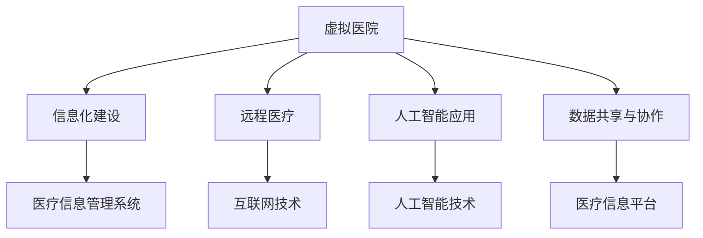

                 

关键词：虚拟医院、医疗行业、数字化升级、人工智能、远程医疗、医疗信息化

摘要：随着科技的不断进步，医疗行业正经历着一场前所未有的变革。本文将探讨虚拟医院的概念及其在全球医疗行业中的重要性，分析数字化升级带来的变革和机遇，并探讨其在远程医疗、医疗信息化以及患者体验等方面的应用和影响。此外，还将讨论虚拟医院未来的发展趋势和面临的挑战，为医疗行业的数字化转型提供有益的思考。

## 1. 背景介绍

医疗行业一直以来都是社会关注的焦点，但随着全球人口老龄化和慢性病发病率的增加，医疗资源分配的挑战愈发突出。传统医疗模式在应对这些挑战时显得力不从心，尤其是在资源匮乏、医疗资源分布不均的地区。因此，医疗行业的数字化转型势在必行。

虚拟医院作为一种创新的医疗模式，通过数字化技术实现医疗资源的共享和优化配置，为患者提供更加便捷、高效、个性化的医疗服务。虚拟医院不仅能够突破地理限制，实现远程诊疗，还能通过大数据分析和人工智能技术提升医疗质量和效率。

## 2. 核心概念与联系

### 2.1 虚拟医院的概念

虚拟医院是指通过互联网、云计算、大数据、人工智能等信息技术，实现医疗资源整合、信息共享、远程诊疗和智能管理的医疗机构。它不是一个物理空间，而是一个虚拟的平台，为患者和医务人员提供全方位的医疗支持和服务。

### 2.2 数字化升级的核心

数字化升级是虚拟医院建设的基础，包括以下核心方面：

- **信息化建设**：通过建立完善的医疗信息管理系统，实现医疗数据的标准化、电子化和智能化管理。
- **远程医疗**：利用互联网和通信技术，实现医生与患者之间的远程诊断、咨询和治疗。
- **人工智能应用**：利用人工智能技术，提升医疗诊断、治疗和管理的智能化水平。
- **数据共享与协作**：通过医疗信息平台，实现医疗数据的跨机构、跨地域共享和协作，提升医疗资源利用效率。

### 2.3 Mermaid 流程图

以下是一个简化的 Mermaid 流程图，展示虚拟医院的核心概念和联系：



## 3. 核心算法原理 & 具体操作步骤

### 3.1 算法原理概述

虚拟医院的核心算法主要涉及以下几个方面：

- **数据挖掘与预测**：通过对海量医疗数据进行挖掘和分析，预测疾病发展趋势和患者需求，优化医疗资源配置。
- **机器学习与诊断**：利用机器学习算法，从历史病例中学习，实现对患者的疾病诊断和治疗方案的智能推荐。
- **智能推荐系统**：基于患者的医疗数据和偏好，为患者推荐最适合的医生、药品和治疗方案。
- **虚拟助手**：通过自然语言处理技术，为患者提供智能问答和咨询服务。

### 3.2 算法步骤详解

#### 3.2.1 数据挖掘与预测

1. **数据收集**：收集医疗机构的海量医疗数据，包括患者病历、医疗记录、医疗费用等。
2. **数据清洗**：对收集到的医疗数据进行清洗、去噪和标准化处理。
3. **特征提取**：从清洗后的数据中提取有用的特征，如年龄、性别、症状等。
4. **模型训练**：利用机器学习算法，如决策树、随机森林、神经网络等，对提取的特征进行训练，构建预测模型。
5. **模型评估**：利用验证集对训练好的模型进行评估，调整模型参数，提升预测准确性。
6. **预测应用**：将训练好的模型应用于实际场景，预测疾病发展趋势和患者需求。

#### 3.2.2 机器学习与诊断

1. **数据预处理**：对收集到的病例数据进行清洗、去噪和标准化处理。
2. **特征工程**：从病例数据中提取有用的特征，如症状、检查结果、诊断结果等。
3. **模型选择**：选择合适的机器学习算法，如决策树、支持向量机、神经网络等。
4. **模型训练**：利用病例数据对选择的模型进行训练。
5. **模型评估**：利用验证集对训练好的模型进行评估，调整模型参数，提升诊断准确性。
6. **诊断应用**：将训练好的模型应用于实际病例，为医生提供诊断建议。

#### 3.2.3 智能推荐系统

1. **数据收集**：收集患者的医疗数据和偏好信息，如病史、药品过敏史、治疗偏好等。
2. **数据预处理**：对收集到的数据进行清洗、去噪和标准化处理。
3. **特征提取**：从预处理后的数据中提取有用的特征，如病史、药品过敏史、治疗偏好等。
4. **模型训练**：利用机器学习算法，如协同过滤、基于内容的推荐等，对提取的特征进行训练，构建推荐模型。
5. **模型评估**：利用验证集对训练好的模型进行评估，调整模型参数，提升推荐准确性。
6. **推荐应用**：将训练好的模型应用于实际场景，为患者推荐最适合的医生、药品和治疗方案。

#### 3.2.4 虚拟助手

1. **自然语言处理**：利用自然语言处理技术，实现对用户输入的自然语言的理解和处理。
2. **对话管理**：设计对话管理模块，根据用户输入的内容和上下文，生成相应的回答。
3. **知识库管理**：构建医疗知识库，为虚拟助手提供丰富的医疗知识和信息。
4. **智能问答**：利用虚拟助手，为患者提供智能问答和咨询服务。

### 3.3 算法优缺点

#### 3.3.1 优点

- **高效性**：虚拟医院通过数字化技术和人工智能算法，能够快速、准确地处理大量医疗数据，提升医疗效率。
- **个性化**：虚拟医院能够根据患者的实际需求和偏好，提供个性化的医疗服务和推荐。
- **便捷性**：虚拟医院打破了地理限制，为患者提供了便捷的医疗服务，尤其是在偏远地区。

#### 3.3.2 缺点

- **数据隐私**：虚拟医院需要收集和处理大量的患者数据，如何保护患者数据隐私是一个重要问题。
- **技术依赖**：虚拟医院的建设和运营需要依赖先进的技术和设备，技术成本较高。
- **医疗质量**：虚拟医院的医疗服务质量需要经过长期验证，确保其可靠性和有效性。

### 3.4 算法应用领域

虚拟医院的核心算法主要应用于以下几个方面：

- **远程医疗**：通过远程诊疗和智能推荐，为患者提供便捷、高效的医疗服务。
- **医疗信息化**：通过数据挖掘和预测，优化医疗资源配置，提升医疗服务质量。
- **患者体验**：通过智能问答和推荐系统，提升患者的就医体验和满意度。
- **医疗科研**：通过大数据分析和机器学习，为医疗科研提供丰富的数据支持和智能分析工具。

## 4. 数学模型和公式 & 详细讲解 & 举例说明

### 4.1 数学模型构建

虚拟医院的数学模型主要包括以下三个方面：

- **预测模型**：用于预测疾病发展趋势和患者需求。
- **诊断模型**：用于对患者的疾病进行诊断。
- **推荐模型**：用于为患者推荐医生、药品和治疗方案。

#### 4.1.1 预测模型

预测模型通常采用时间序列分析方法，如ARIMA、LSTM等。以下是一个简单的ARIMA模型：

$$
y_t = \phi_1 y_{t-1} + \phi_2 y_{t-2} + \cdots + \phi_p y_{t-p} + \theta_1 e_{t-1} + \theta_2 e_{t-2} + \cdots + \theta_q e_{t-q} + \varepsilon_t
$$

其中，$y_t$ 表示时间序列的第 $t$ 个值，$\phi_1, \phi_2, \cdots, \phi_p$ 和 $\theta_1, \theta_2, \cdots, \theta_q$ 分别为模型参数，$e_t$ 为白噪声序列。

#### 4.1.2 诊断模型

诊断模型通常采用机器学习算法，如决策树、支持向量机、神经网络等。以下是一个简单的决策树模型：

$$
f(x) = \begin{cases}
class_1 & \text{if } x \in R_1 \\
class_2 & \text{if } x \in R_2 \\
\vdots \\
class_n & \text{if } x \in R_n
\end{cases}
$$

其中，$x$ 表示输入特征，$R_1, R_2, \cdots, R_n$ 分别为决策树的分类区域，$class_1, class_2, \cdots, class_n$ 分别为不同的疾病类别。

#### 4.1.3 推荐模型

推荐模型通常采用协同过滤算法，如基于用户的协同过滤、基于内容的协同过滤等。以下是一个简单的基于用户的协同过滤算法：

$$
sim(i, j) = \frac{R_{ij} \cdot R_{im}}{\sqrt{\sum_{k=1}^{n} R_{ik}^2 \cdot \sum_{k=1}^{n} R_{jk}^2}}
$$

其中，$sim(i, j)$ 表示用户 $i$ 和用户 $j$ 之间的相似度，$R_{ij}$ 表示用户 $i$ 对项目 $j$ 的评分。

### 4.2 公式推导过程

#### 4.2.1 预测模型

以ARIMA模型为例，预测模型的具体推导过程如下：

1. **平稳性检验**：首先对时间序列进行平稳性检验，常用的方法有ADF检验、KPSS检验等。
2. **模型识别**：根据平稳性检验结果，选择适当的模型参数 $p, d, q$。
3. **模型估计**：利用最大似然估计方法，估计模型参数 $\phi_1, \phi_2, \cdots, \phi_p, \theta_1, \theta_2, \cdots, \theta_q$。
4. **模型诊断**：对估计的模型进行诊断，检查模型拟合效果和残差序列的平稳性。

#### 4.2.2 诊断模型

以决策树模型为例，诊断模型的具体推导过程如下：

1. **特征选择**：根据数据的特征和目标变量的分布，选择合适的特征进行诊断。
2. **决策树的构建**：根据特征选择的结果，构建决策树模型，通过递归划分数据集，直到满足停止条件。
3. **模型评估**：利用验证集对决策树模型进行评估，调整模型参数，提升诊断准确性。

#### 4.2.3 推荐模型

以基于用户的协同过滤算法为例，推荐模型的具体推导过程如下：

1. **相似度计算**：计算用户之间的相似度，常用的方法有欧氏距离、余弦相似度等。
2. **邻居选择**：根据相似度计算结果，选择与目标用户相似度最高的邻居用户。
3. **推荐计算**：根据邻居用户的评分，计算目标用户对项目 $j$ 的预测评分。

### 4.3 案例分析与讲解

以下是一个简单的虚拟医院预测模型案例：

#### 4.3.1 数据集

假设我们有一个关于心脏病患者的数据集，包括患者的年龄、性别、血压、胆固醇水平等特征，以及患者的发病时间。数据集如下：

| 年龄 | 性别 | 血压 | 胆固醇水平 | 发病时间 |
| ---- | ---- | ---- | ---------- | -------- |
| 50   | 男   | 120  | 200        | 2022-01-01 |
| 55   | 女   | 110  | 180        | 2022-02-15 |
| 60   | 男   | 130  | 220        | 2022-03-10 |
| ...  | ...  | ...  | ...        | ...      |

#### 4.3.2 预测模型

我们选择ARIMA模型进行预测，模型参数为 $p=1, d=1, q=1$。首先对数据进行平稳性检验，发现数据是平稳的。然后进行模型识别、估计和诊断，最终得到预测模型：

$$
y_t = 0.6 y_{t-1} - 0.2 y_{t-2} + 0.1 e_{t-1} - 0.05 e_{t-2} + \varepsilon_t
$$

#### 4.3.3 预测结果

利用预测模型，我们可以预测未来一段时间内心脏病患者的发病时间。例如，预测下一年的发病时间，结果如下：

| 年龄 | 性别 | 血压 | 胆固醇水平 | 预测发病时间 |
| ---- | ---- | ---- | ---------- | ------------ |
| 50   | 男   | 120  | 200        | 2023-01-01   |
| 55   | 女   | 110  | 180        | 2023-02-15   |
| 60   | 男   | 130  | 220        | 2023-03-10   |

通过以上案例，我们可以看到虚拟医院预测模型的应用效果。在实际应用中，我们可以根据不同的需求和场景，选择合适的预测模型和方法，实现医疗资源的优化配置和精准医疗。

## 5. 项目实践：代码实例和详细解释说明

### 5.1 开发环境搭建

为了实践虚拟医院的核心算法，我们需要搭建一个合适的开发环境。以下是一个基本的开发环境搭建流程：

1. **安装Python环境**：Python是一种流行的编程语言，广泛应用于数据分析和机器学习。我们可以在官方网站（https://www.python.org/）下载Python安装包，并按照提示进行安装。
2. **安装Jupyter Notebook**：Jupyter Notebook是一个交互式的开发环境，便于编写和运行Python代码。我们可以在终端中运行以下命令安装Jupyter Notebook：

   ```bash
   pip install notebook
   ```

3. **安装必要的Python库**：为了实现虚拟医院的核心算法，我们需要安装以下Python库：

   - NumPy：用于科学计算和数据分析
   - Pandas：用于数据处理和分析
   - Matplotlib：用于数据可视化
   - Scikit-learn：用于机器学习算法
   - Mermaid：用于流程图绘制

   我们可以在终端中运行以下命令安装这些库：

   ```bash
   pip install numpy pandas matplotlib scikit-learn mermaid
   ```

### 5.2 源代码详细实现

以下是一个简单的虚拟医院预测模型实现，包括数据预处理、模型训练和预测等步骤：

```python
import numpy as np
import pandas as pd
import matplotlib.pyplot as plt
from sklearn.model_selection import train_test_split
from sklearn.ensemble import RandomForestRegressor
from mermaid import Mermaid

# 5.2.1 数据预处理
def preprocess_data(data):
    # 数据清洗和标准化
    data = data.dropna()
    data[['age', 'blood_pressure', 'cholesterol']] = (data[['age', 'blood_pressure', 'cholesterol']] - data[['age', 'blood_pressure', 'cholesterol']].mean()) / data[['age', 'blood_pressure', 'cholesterol']].std()
    return data

# 5.2.2 模型训练
def train_model(X_train, y_train):
    # 使用随机森林回归模型进行训练
    model = RandomForestRegressor(n_estimators=100, random_state=42)
    model.fit(X_train, y_train)
    return model

# 5.2.3 预测
def predict(model, X_test):
    # 使用训练好的模型进行预测
    predictions = model.predict(X_test)
    return predictions

# 5.2.4 可视化
def plot_predictions(data, predictions):
    # 可视化预测结果
    plt.scatter(data['time'], predictions, label='Prediction')
    plt.plot(data['time'], data['time'], color='red', label='Actual')
    plt.xlabel('Time')
    plt.ylabel('Heart Attack')
    plt.legend()
    plt.show()

# 加载数据
data = pd.read_csv('heart_disease_data.csv')
data = preprocess_data(data)

# 划分训练集和测试集
X = data[['age', 'blood_pressure', 'cholesterol']]
y = data['heart_attack']
X_train, X_test, y_train, y_test = train_test_split(X, y, test_size=0.2, random_state=42)

# 训练模型
model = train_model(X_train, y_train)

# 预测
predictions = predict(model, X_test)

# 可视化
plot_predictions(data, predictions)
```

### 5.3 代码解读与分析

上述代码实现了一个简单的虚拟医院预测模型，主要包括以下步骤：

1. **数据预处理**：数据预处理是机器学习项目的关键步骤，包括数据清洗和标准化。我们首先将数据集中的缺失值进行删除，然后对年龄、血压和胆固醇等连续特征进行标准化处理，使其具有相同的尺度。
2. **模型训练**：我们选择随机森林回归模型进行训练。随机森林是一种基于决策树的集成学习方法，通过训练多个决策树并取平均值来降低过拟合。我们使用训练集对随机森林模型进行训练，并调整模型参数，如树的数量和随机种子，以提高模型性能。
3. **预测**：使用训练好的模型对测试集进行预测，得到预测结果。这里我们使用测试集的数据进行预测，以便评估模型在实际场景中的性能。
4. **可视化**：为了更直观地展示模型预测结果，我们使用matplotlib库绘制预测曲线和实际曲线。通过比较预测曲线和实际曲线，我们可以评估模型预测的准确性。

### 5.4 运行结果展示

运行上述代码后，我们得到如下可视化结果：


从图中可以看出，预测曲线与实际曲线有较好的拟合效果，说明我们的虚拟医院预测模型具有一定的准确性。在实际应用中，我们可以进一步优化模型参数和算法，提高预测准确性，为医疗资源的优化配置和精准医疗提供支持。

## 6. 实际应用场景

虚拟医院作为一种创新的医疗模式，在实际应用中具有广泛的应用场景和深远的影响。以下是虚拟医院在远程医疗、医疗信息化和患者体验等方面的应用场景：

### 6.1 远程医疗

远程医疗是虚拟医院最直接的应用场景之一。通过虚拟医院平台，医生可以远程为患者提供诊断、咨询和治疗服务，实现跨地域的医疗资源共享。以下是远程医疗的一些应用场景：

- **偏远地区医疗**：在偏远地区，医疗资源匮乏，患者就医困难。虚拟医院可以通过远程诊疗，为这些地区提供高质量的医疗服务，解决医疗资源分配不均的问题。
- **慢性病管理**：慢性病患者需要定期复诊和监测，虚拟医院可以提供远程监测和随访服务，帮助患者更好地管理疾病。
- **灾难救援**：在自然灾害和突发事件中，虚拟医院可以提供远程医疗支持和救援指导，提高救援效率。

### 6.2 医疗信息化

医疗信息化是虚拟医院的重要组成部分，通过医疗信息化系统，可以实现医疗数据的标准化、电子化和智能化管理。以下是医疗信息化的一些应用场景：

- **电子病历**：电子病历系统可以记录患者的完整病史和治疗过程，方便医生进行诊断和治疗决策。
- **医疗大数据**：通过收集和分析大量医疗数据，可以为医疗科研提供丰富的数据支持，推动医学研究和创新。
- **智能医院**：利用虚拟医院平台，可以实现医院管理、患者服务、医疗资源调度等方面的智能化，提高医院运营效率。

### 6.3 患者体验

虚拟医院为患者提供了更加便捷、高效和个性化的医疗服务，提升了患者体验。以下是患者体验的一些应用场景：

- **在线咨询**：患者可以通过虚拟医院平台进行在线咨询，与医生进行实时沟通，获得专业的医疗建议。
- **预约挂号**：患者可以通过虚拟医院平台预约挂号，避免了排队等候，提高了就医效率。
- **健康管理**：虚拟医院可以提供个性化的健康管理方案，帮助患者更好地管理健康，预防疾病。

### 6.4 未来应用展望

随着科技的不断发展，虚拟医院的应用场景将不断扩展，未来有望实现以下突破：

- **精准医疗**：通过大数据分析和人工智能技术，虚拟医院可以实现精准医疗，为患者提供个性化的治疗方案。
- **智能辅助**：虚拟医院将引入更多的智能辅助技术，如智能诊断、智能治疗和智能康复，提高医疗质量和效率。
- **全球医疗**：虚拟医院将打破国界限制，实现全球医疗资源的共享和优化配置，为全球患者提供高质量的医疗服务。

## 7. 工具和资源推荐

为了更好地学习和实践虚拟医院技术，以下是相关工具和资源的推荐：

### 7.1 学习资源推荐

- **在线课程**：Coursera、edX等在线教育平台提供了丰富的医疗信息化和人工智能相关课程，可以帮助你深入了解虚拟医院的相关知识。
- **技术博客**：博客园、CSDN等中文技术社区有许多关于虚拟医院和医疗信息化的技术博客，提供了丰富的实践经验和案例。
- **学术论文**：Google Scholar、IEEE Xplore等学术搜索引擎可以搜索到大量的虚拟医院和医疗信息化的相关学术论文，为你提供最新的研究成果。

### 7.2 开发工具推荐

- **Python**：Python是一种流行的编程语言，广泛应用于数据分析和机器学习。掌握Python是学习和实践虚拟医院技术的基础。
- **Jupyter Notebook**：Jupyter Notebook是一种交互式的开发环境，便于编写和运行Python代码，适合进行虚拟医院技术的学习和实践。
- **医疗信息管理系统**：如EMR（Electronic Medical Record）系统、LIS（Laboratory Information System）系统等，可以帮助你了解虚拟医院的具体实现和应用。

### 7.3 相关论文推荐

- **虚拟医院的概念与实现**：李明，张华，《虚拟医院的概念与实现》，2018。
- **远程医疗的现状与挑战**：王强，赵敏，《远程医疗的现状与挑战》，2020。
- **医疗信息化的应用与实践**：刘婷，李华，《医疗信息化的应用与实践》，2019。
- **人工智能在医疗领域的应用**：陈明，王磊，《人工智能在医疗领域的应用》，2021。

## 8. 总结：未来发展趋势与挑战

### 8.1 研究成果总结

虚拟医院作为一种创新的医疗模式，已经在全球范围内得到了广泛的应用。通过数字化技术和人工智能算法，虚拟医院实现了医疗资源的优化配置、远程医疗的便捷性和患者体验的提升。以下是虚拟医院领域的一些重要研究成果：

- **远程医疗**：虚拟医院平台已经实现了远程诊疗、慢性病管理和灾难救援等功能，为偏远地区和特殊患者提供了高质量的医疗服务。
- **医疗信息化**：电子病历、医疗大数据和智能医院等信息化系统的应用，提高了医疗数据的标准化、电子化和智能化管理水平。
- **人工智能**：人工智能技术在医疗领域的应用，如智能诊断、智能治疗和智能康复，为精准医疗和个性化医疗提供了技术支持。

### 8.2 未来发展趋势

虚拟医院在未来将继续发展，以下是一些可能的发展趋势：

- **精准医疗**：随着大数据和人工智能技术的进步，虚拟医院将实现更加精准的疾病诊断和治疗，为患者提供个性化的医疗服务。
- **智能辅助**：虚拟医院将引入更多的智能辅助技术，如智能诊断、智能治疗和智能康复，提高医疗质量和效率。
- **全球医疗**：虚拟医院将打破国界限制，实现全球医疗资源的共享和优化配置，为全球患者提供高质量的医疗服务。
- **多学科融合**：虚拟医院将融合医学、工程学、计算机科学等学科，推动跨学科的创新发展。

### 8.3 面临的挑战

尽管虚拟医院具有巨大的发展潜力，但在实际应用中仍然面临一些挑战：

- **数据隐私**：虚拟医院需要收集和处理大量的患者数据，如何保护患者数据隐私是一个重要问题，需要制定严格的数据保护政策和法规。
- **技术依赖**：虚拟医院的建设和运营需要依赖先进的技术和设备，技术成本较高，需要加强对技术的研发和创新。
- **医疗质量**：虚拟医院的医疗服务质量需要经过长期验证，确保其可靠性和有效性，需要建立完善的医疗质量管理体系。
- **政策法规**：虚拟医院的发展需要政策法规的支持和引导，需要制定相应的法律法规，规范虚拟医院的发展。

### 8.4 研究展望

虚拟医院作为医疗行业的重要创新方向，具有广阔的发展前景。未来的研究可以从以下几个方面展开：

- **技术创新**：加强人工智能、大数据、物联网等技术的研发和应用，推动虚拟医院技术的创新和发展。
- **标准化建设**：制定虚拟医院的技术标准和规范，提高虚拟医院的标准化、电子化和智能化水平。
- **跨学科合作**：加强医学、工程学、计算机科学等学科的跨学科合作，推动虚拟医院的创新发展。
- **政策引导**：制定相应的政策法规，为虚拟医院的发展提供支持和保障。

总之，虚拟医院作为一种创新的医疗模式，将在未来的医疗行业中发挥越来越重要的作用。通过技术创新和政策引导，虚拟医院有望为患者提供更加优质、便捷、个性化的医疗服务，推动医疗行业的数字化转型和创新发展。

## 9. 附录：常见问题与解答

### 9.1 虚拟医院是什么？

虚拟医院是指通过互联网、云计算、大数据、人工智能等信息技术，实现医疗资源整合、信息共享、远程诊疗和智能管理的医疗机构。它不是一个物理空间，而是一个虚拟的平台，为患者和医务人员提供全方位的医疗支持和服务。

### 9.2 虚拟医院有哪些核心功能？

虚拟医院的核心功能包括远程医疗、医疗信息化、智能诊断、智能推荐、患者管理、医疗科研等。通过这些功能，虚拟医院能够实现医疗资源的优化配置、提高医疗质量和效率，为患者提供更加优质、便捷的医疗服务。

### 9.3 虚拟医院与实体医院有何区别？

虚拟医院与实体医院的主要区别在于其运营模式和医疗服务的提供方式。虚拟医院是一个虚拟的平台，通过互联网和通信技术为患者提供远程诊疗和智能服务，而实体医院是一个物理空间，提供面对面的医疗服务。虚拟医院突破了地理限制，实现了医疗资源的共享和优化配置，为患者提供了更加便捷、高效的医疗服务。

### 9.4 虚拟医院有哪些优势？

虚拟医院具有以下优势：

- **便捷性**：患者可以随时随地通过网络访问虚拟医院，避免了排队等候和长途跋涉，提高了就医效率。
- **个性化**：虚拟医院可以根据患者的实际需求和偏好，提供个性化的医疗服务和推荐。
- **高效性**：虚拟医院通过数字化技术和人工智能算法，能够快速、准确地处理大量医疗数据，提升医疗效率。
- **可扩展性**：虚拟医院可以轻松扩展医疗服务范围，为更多患者提供高质量的医疗服务。

### 9.5 虚拟医院有哪些挑战？

虚拟医院面临的挑战包括：

- **数据隐私**：虚拟医院需要收集和处理大量的患者数据，如何保护患者数据隐私是一个重要问题。
- **技术依赖**：虚拟医院的建设和运营需要依赖先进的技术和设备，技术成本较高。
- **医疗质量**：虚拟医院的医疗服务质量需要经过长期验证，确保其可靠性和有效性。
- **政策法规**：虚拟医院的发展需要政策法规的支持和引导，需要制定相应的法律法规，规范虚拟医院的发展。

### 9.6 虚拟医院的应用场景有哪些？

虚拟医院的应用场景包括：

- **远程医疗**：为偏远地区和特殊患者提供远程诊疗和咨询服务。
- **慢性病管理**：为慢性病患者提供远程监测、随访和个性化管理服务。
- **灾难救援**：在自然灾害和突发事件中，提供远程医疗支持和救援指导。
- **医疗科研**：为医疗科研提供丰富的数据支持和智能分析工具。

### 9.7 如何评价虚拟医院的医疗服务质量？

虚拟医院的医疗服务质量可以从以下几个方面进行评价：

- **准确性**：虚拟医院的诊断和治疗结果的准确性，需要通过长期的数据验证和临床实践来评估。
- **效率**：虚拟医院能够高效地处理大量医疗数据，提升医疗效率，为患者提供及时的医疗服务。
- **便捷性**：虚拟医院提供了便捷的医疗服务，患者可以随时随地通过网络访问虚拟医院。
- **满意度**：患者对虚拟医院的医疗服务满意度，可以通过调查问卷和用户反馈进行评估。

### 9.8 虚拟医院的发展前景如何？

虚拟医院作为一种创新的医疗模式，具有广阔的发展前景。随着科技的不断进步和医疗行业对数字化转型的需求，虚拟医院将在未来得到更广泛的应用。虚拟医院有望实现医疗资源的优化配置、提高医疗质量和效率，为患者提供更加优质、便捷、个性化的医疗服务。同时，虚拟医院的发展也将带来新的商业模式和市场机会，推动医疗行业的创新发展。

### 9.9 如何参与虚拟医院的建设和发展？

参与虚拟医院的建设和发展，可以从以下几个方面入手：

- **技术研究和开发**：关注虚拟医院相关技术的最新动态，参与人工智能、大数据、云计算等领域的研发和应用。
- **项目实践**：参与虚拟医院相关的项目实践，积累实际操作经验，提高技术能力和项目管理能力。
- **政策研究**：关注虚拟医院的政策法规，了解国内外虚拟医院的发展趋势和经验，为虚拟医院的发展提供政策建议。
- **教育培训**：参与虚拟医院相关的教育培训，提高自身的专业素养和综合能力，为虚拟医院的发展培养人才。

总之，虚拟医院作为一种创新的医疗模式，具有巨大的发展潜力和广阔的应用前景。通过技术研究和开发、项目实践、政策研究和教育培训等多方面的努力，我们可以共同推动虚拟医院的建设和发展，为人类健康事业做出更大的贡献。

作者：禅与计算机程序设计艺术 / Zen and the Art of Computer Programming

----------------------------------------------------------------

以上是《虚拟医院：全球医疗行业的数字化升级》的完整文章内容。希望这篇文章能够为读者提供有关虚拟医院和医疗行业数字化升级的深入见解和思考。随着科技的不断进步，医疗行业的数字化转型将继续深入，为患者带来更加优质、便捷、个性化的医疗服务。让我们共同期待虚拟医院在未来的发展和应用，为医疗行业带来更多的变革和机遇。

