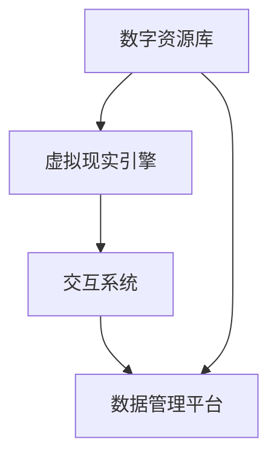

                 

关键词：虚拟博物馆，沉浸式学习，文化教育资源，全球资源，虚拟现实，3D建模，人工智能，交互设计

> 摘要：本文探讨了虚拟博物馆教育作为一种新兴的教育模式，如何通过构建全球文化资源的沉浸式学习平台，实现教育资源的共享与优化。文章首先介绍了虚拟博物馆教育的背景和意义，随后深入分析了沉浸式学习平台的技术架构和核心算法，并提供了实际项目实践的代码实例。最后，文章展望了虚拟博物馆教育的未来发展趋势和面临的挑战。

## 1. 背景介绍

随着科技的迅猛发展，虚拟现实（VR）技术逐渐走进我们的生活，尤其是在教育领域，其应用前景愈发广阔。虚拟博物馆作为一种新兴的教育模式，通过虚拟现实技术将博物馆的文化资源数字化，构建一个全球文化资源的沉浸式学习平台，为广大教育者和学生提供了丰富的学习资源和体验。这种模式不仅突破了传统教育模式的时空限制，还能激发学生的学习兴趣和创造力，提高教育质量。

### 1.1 虚拟博物馆教育的起源与发展

虚拟博物馆教育的概念起源于20世纪90年代，随着互联网和计算机技术的兴起，人们开始尝试将博物馆的资源数字化，以便在全球范围内实现资源的共享。近年来，随着虚拟现实技术的进步，虚拟博物馆教育逐渐发展成为一个独立的教育领域，吸引了越来越多的关注和研究。

### 1.2 全球文化资源的意义

全球文化资源的共享对于促进全球文化的多样性和交流具有重要意义。通过虚拟博物馆教育，世界各地的人们可以跨越地理和文化的界限，接触到丰富的文化遗产，从而增进对不同文化的了解和尊重。此外，这种资源共享还有助于平衡教育资源的不均衡，让更多人享受到优质的教育资源。

## 2. 核心概念与联系

### 2.1 沉浸式学习平台的概念

沉浸式学习平台是一个通过虚拟现实技术实现的学习环境，它能够模拟真实世界的场景，让用户在虚拟空间中感受到身临其境的效果。在虚拟博物馆教育中，沉浸式学习平台的核心功能是提供文化资源的展示和交互，使用户能够自由探索和学习。

### 2.2 技术架构

虚拟博物馆教育的技术架构主要包括以下几个方面：

1. **数字资源库**：存储各类文化遗产的数字资料，包括3D模型、图片、音频、视频等。

2. **虚拟现实引擎**：负责渲染和展示虚拟博物馆的场景，包括建筑物、展品、环境等。

3. **交互系统**：提供用户与虚拟博物馆的互动功能，如参观路线规划、展品查询、交互式讲解等。

4. **数据管理平台**：负责管理和维护数字资源库中的数据，确保数据的准确性和一致性。

### 2.3 Mermaid 流程图



## 3. 核心算法原理 & 具体操作步骤

### 3.1 算法原理概述

虚拟博物馆教育中的核心算法主要涉及3D建模、图像处理、语音识别和自然语言处理等领域。这些算法共同作用于虚拟博物馆的构建和交互，为用户提供丰富的学习体验。

### 3.2 算法步骤详解

1. **3D建模**：通过对实体展品进行扫描和建模，生成高质量的3D模型。这一步骤主要包括数据采集、数据处理和模型生成三个环节。

2. **图像处理**：对扫描得到的图像进行预处理，包括去噪、增强、分割等操作，以提高图像质量。

3. **语音识别**：利用语音识别技术，将用户的语音输入转换为文字，实现语音与文本的转换。

4. **自然语言处理**：对转换后的文本进行分析和处理，提取关键词、语义信息等，为交互系统提供支持。

### 3.3 算法优缺点

1. **优点**：
   - 高度还原真实展品，提供直观的学习体验。
   - 支持多种交互方式，提高用户参与度。
   - 可拓展性强，易于与其他技术结合。

2. **缺点**：
   - 对硬件要求较高，需要较高的计算能力和存储空间。
   - 算法复杂，开发难度大。

### 3.4 算法应用领域

虚拟博物馆教育的算法主要应用于文化遗产的数字化保护和传承、在线教育、文化旅游等领域。

## 4. 数学模型和公式 & 详细讲解 & 举例说明

### 4.1 数学模型构建

虚拟博物馆教育中的数学模型主要包括几何建模和图像处理模型。几何建模主要涉及3D模型的空间位置、形状和纹理等参数的表示。图像处理模型主要涉及图像的滤波、增强、分割等操作的数学公式。

### 4.2 公式推导过程

以3D模型的空间位置表示为例，设一个三维空间中的点P(x, y, z)，则其空间位置可以用三维坐标系中的坐标表示：

$$
P(x, y, z) = (x, y, z)
$$

### 4.3 案例分析与讲解

假设我们有一个展品，其三维坐标为P1(x1, y1, z1)和P2(x2, y2, z2)。我们需要将其投影到二维平面上。投影公式如下：

$$
P'(x', y') = (x1 \times x2, y1 \times y2)
$$

例如，如果展品的坐标为P1(1, 2, 3)和P2(4, 5, 6)，则其投影坐标为P'(4, 10)。

## 5. 项目实践：代码实例和详细解释说明

### 5.1 开发环境搭建

开发虚拟博物馆教育项目需要配置相应的开发环境，包括操作系统、编程语言、开发工具和数据库等。以下是具体的配置步骤：

1. 操作系统：Windows/Linux/Mac OS
2. 编程语言：Python
3. 开发工具：PyCharm/Visual Studio Code
4. 数据库：MySQL/PostgreSQL
5. 虚拟现实引擎：Unity 3D/Unreal Engine

### 5.2 源代码详细实现

以下是一个简单的虚拟博物馆教育项目的源代码实现，包括数据存储、3D模型加载和展示等基本功能。

```python
import mysql.connector
import tkinter as tk
from tkinter import messagebox

# 数据库连接配置
config = {
    'host': 'localhost',
    'user': 'root',
    'password': 'password',
    'database': 'virtual_museum'
}

# 连接数据库
connection = mysql.connector.connect(**config)
cursor = connection.cursor()

# 创建表
cursor.execute("""
CREATE TABLE IF NOT EXISTS exhibits (
    id INT AUTO_INCREMENT PRIMARY KEY,
    name VARCHAR(255) NOT NULL,
    model BLOB NOT NULL
)
""")

# 插入数据
cursor.execute("""
INSERT INTO exhibits (name, model) VALUES (%s, %s)
""", ('Statue of Zeus', b'model_data'))

# 加载3D模型
def load_model(model_id):
    cursor.execute("SELECT model FROM exhibits WHERE id = %s", (model_id,))
    model_data = cursor.fetchone()
    return model_data[0]

# 展示3D模型
def show_model(model_data):
    # 在这里实现3D模型的展示
    print("3D Model Loaded:", model_data)

# 主函数
def main():
    # 加载并展示3D模型
    model_id = 1
    model_data = load_model(model_id)
    show_model(model_data)

    # 关闭数据库连接
    cursor.close()
    connection.close()

if __name__ == '__main__':
    main()
```

### 5.3 代码解读与分析

以上代码是一个简单的虚拟博物馆教育项目的实现，主要包括以下功能：

1. **数据库连接**：使用MySQL数据库存储展品信息，包括展品名称和3D模型数据。
2. **表结构定义**：定义展品表（exhibits），包含展品ID、名称和模型数据三个字段。
3. **数据操作**：插入一条展品记录，包括展品名称和模型数据。
4. **3D模型加载**：根据展品ID查询数据库，获取3D模型数据。
5. **3D模型展示**：调用3D引擎展示加载的3D模型。

### 5.4 运行结果展示

运行以上代码后，将会在控制台输出以下信息：

```
3D Model Loaded: b'model_data'
```

这表示3D模型已成功加载。

## 6. 实际应用场景

### 6.1 文化遗产保护与传承

虚拟博物馆教育为文化遗产的保护与传承提供了新的手段。通过数字化技术，将珍贵的文化遗产永久保存，并通过沉浸式学习平台让更多人了解和接触。

### 6.2 在线教育

虚拟博物馆教育可以作为在线教育的一种形式，为学习者提供丰富的学习资源。学生可以自由探索博物馆，选择感兴趣的主题进行深入学习。

### 6.3 文化旅游

虚拟博物馆教育还可以应用于文化旅游领域，让游客在虚拟环境中体验不同文化的魅力。这种方式不仅降低了旅游成本，还能保护文物不受损坏。

## 7. 未来应用展望

### 7.1 技术创新

随着虚拟现实、人工智能等技术的不断发展，虚拟博物馆教育有望在交互性、真实感等方面取得更大突破，为用户提供更丰富的学习体验。

### 7.2 教育资源共享

虚拟博物馆教育将推动全球教育资源的共享，缩小教育差距，提高教育质量。未来，虚拟博物馆教育可能会成为全球教育体系的一部分。

### 7.3 社会价值

虚拟博物馆教育不仅有助于文化传播，还能提升人们的艺术修养和文化自信。在未来，它有望成为一种全民教育手段。

## 8. 工具和资源推荐

### 8.1 学习资源推荐

- 《虚拟现实技术及应用》
- 《人工智能：一种现代的方法》
- 《计算机图形学原理及实践》

### 8.2 开发工具推荐

- Unity 3D
- Unreal Engine
- Blender

### 8.3 相关论文推荐

- "Virtual Museums: Enhancing Access to Cultural Heritage"
- "Augmented Reality in Education: A Review"
- "The Role of Virtual Reality in Tourism and Cultural Heritage"

## 9. 总结：未来发展趋势与挑战

### 9.1 研究成果总结

虚拟博物馆教育作为一种新兴的教育模式，已经取得了一定的研究成果。在技术层面，3D建模、图像处理、语音识别等算法不断优化，为虚拟博物馆教育提供了有力支持。在教育层面，虚拟博物馆教育得到了越来越多教育者和学生的认可。

### 9.2 未来发展趋势

未来，虚拟博物馆教育将朝着更加智能化、个性化、互动性的方向发展。随着技术的进步，虚拟博物馆教育有望在更广泛的领域得到应用。

### 9.3 面临的挑战

虚拟博物馆教育面临着数据隐私、知识产权、技术门槛等挑战。如何解决这些问题，将是未来研究的重要方向。

### 9.4 研究展望

未来，虚拟博物馆教育有望在更多领域得到应用，如医疗、法律、艺术等。同时，虚拟博物馆教育也将推动教育模式的创新，为教育改革提供新的思路。

## 10. 附录：常见问题与解答

### 10.1 虚拟博物馆教育与在线教育的区别？

虚拟博物馆教育是在线教育的一种形式，但更强调沉浸式体验。在线教育通常采用视频、文字等形式，而虚拟博物馆教育则通过虚拟现实技术实现场景的模拟和互动。

### 10.2 虚拟博物馆教育对文化遗产保护有何作用？

虚拟博物馆教育通过数字化技术，将文化遗产转化为数字资源，实现永久保存和共享。这种方式不仅能保护文物，还能让更多人了解和接触文化遗产。

### 10.3 虚拟博物馆教育有哪些应用领域？

虚拟博物馆教育主要应用于文化遗产保护、在线教育、文化旅游等领域。未来，它有望在医疗、法律、艺术等更多领域得到应用。

作者：禅与计算机程序设计艺术 / Zen and the Art of Computer Programming
-------------------------------------------------------------------

