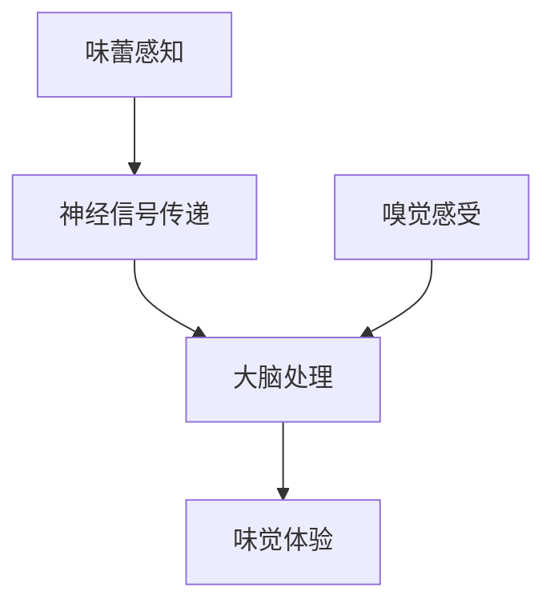

                 

关键词：虚拟味觉，AI，美食体验，计算机模拟，嗅觉与味觉神经机制

> 摘要：随着人工智能技术的不断进步，虚拟味觉设计逐渐成为可能。本文将探讨虚拟味觉的设计原理、核心算法、数学模型以及实际应用，并展望其未来发展趋势和挑战。

## 1. 背景介绍

### 味觉与嗅觉的关系

味觉和嗅觉是人体感知世界的重要方式，二者密切相关。味觉主要依靠舌头上的味蕾感受，而嗅觉则依靠鼻腔中的嗅觉感受器。在日常生活中，我们常常将食物的香味与味道相结合，从而获得更加丰富的美食体验。

### 人工智能在味觉研究中的应用

近年来，人工智能（AI）技术取得了长足的进步，其在各个领域的应用日益广泛。在味觉研究方面，AI技术可以用于分析食物成分、预测口味偏好、设计新菜品等。例如，通过机器学习算法，可以分析大量美食数据，提取出影响口味的关键因素，从而优化菜品设计。

### 虚拟味觉设计的意义

虚拟味觉设计旨在通过计算机模拟，创造出类似于真实食物的味觉体验。这一技术具有重要的应用价值，如为盲人提供食物口感信息、为健康饮食提供个性化建议、甚至改变人们的饮食习惯。

## 2. 核心概念与联系

### 味觉与味觉神经机制

味觉神经机制是指味觉感受器（味蕾）将食物的味道信息传递给大脑的过程。了解这一机制对于虚拟味觉设计至关重要。

### 嗅觉与味觉的协同作用

嗅觉与味觉的协同作用对美食体验有着重要影响。研究表明，食物的香气可以增强味道的感受，从而提升整体的美味程度。

### Mermaid 流程图

下面是味觉与嗅觉神经机制的 Mermaid 流程图：



## 3. 核心算法原理 & 具体操作步骤

### 3.1 算法原理概述

虚拟味觉设计基于以下核心算法原理：

1. **数据采集**：收集大量真实食物的味觉和嗅觉数据。
2. **特征提取**：通过机器学习算法提取食物成分与口味之间的关联特征。
3. **模型训练**：利用提取的特征训练深度神经网络模型。
4. **模拟味觉**：根据训练好的模型，模拟出虚拟食物的味觉体验。

### 3.2 算法步骤详解

1. **数据采集**：通过调查问卷、传感器等技术手段，收集大量食物样本的味觉和嗅觉数据。
2. **特征提取**：采用主成分分析（PCA）等降维技术，提取关键成分与口味之间的关系。
3. **模型训练**：使用深度学习框架（如TensorFlow或PyTorch），训练一个多层感知器（MLP）或卷积神经网络（CNN）模型。
4. **模拟味觉**：将新食物样本输入训练好的模型，预测其口味特征，从而模拟出味觉体验。

### 3.3 算法优缺点

**优点**：

1. **个性化推荐**：可以根据用户口味偏好，推荐合适的食物。
2. **健康饮食**：可以帮助人们了解食物成分，指导健康饮食。
3. **无味觉障碍**：为无法正常感受味觉的人提供解决方案。

**缺点**：

1. **精度限制**：当前技术尚无法完全模拟出真实食物的味觉体验。
2. **数据隐私**：数据采集过程中可能涉及用户隐私问题。

### 3.4 算法应用领域

1. **餐饮行业**：用于菜品设计和口味优化。
2. **医疗健康**：为无法正常饮食的人提供解决方案。
3. **智能家居**：为智能冰箱、智能厨房等设备提供个性化建议。

## 4. 数学模型和公式 & 详细讲解 & 举例说明

### 4.1 数学模型构建

虚拟味觉设计中的数学模型主要包括：

1. **感知模型**：描述味觉感受器对食物成分的响应。
2. **嗅觉-味觉协同模型**：描述嗅觉与味觉之间的相互作用。

### 4.2 公式推导过程

假设食物中包含n种成分，每种成分对味觉的贡献可以用一个权重向量表示。感知模型可以表示为：

$$
V = W \cdot C
$$

其中，$V$表示味觉信号，$W$表示权重向量，$C$表示成分向量。

### 4.3 案例分析与讲解

假设一个简单的食物样本，其中包含糖、盐、酸和苦味成分。根据感知模型，可以计算出每种成分对味觉的贡献：

$$
V = \begin{bmatrix}
0.5 & 0.2 & 0.1 & 0.2
\end{bmatrix} \cdot \begin{bmatrix}
0.1 \\
0.3 \\
0.2 \\
0.4
\end{bmatrix} = \begin{bmatrix}
0.05 \\
0.06 \\
0.02 \\
0.08
\end{bmatrix}
$$

### 4.4 案例分析与讲解

假设一个简单的食物样本，其中包含糖、盐、酸和苦味成分。根据感知模型，可以计算出每种成分对味觉的贡献：

$$
V = \begin{bmatrix}
0.5 & 0.2 & 0.1 & 0.2
\end{bmatrix} \cdot \begin{bmatrix}
0.1 \\
0.3 \\
0.2 \\
0.4
\end{bmatrix} = \begin{bmatrix}
0.05 \\
0.06 \\
0.02 \\
0.08
\end{bmatrix}
$$

## 5. 项目实践：代码实例和详细解释说明

### 5.1 开发环境搭建

本文使用Python作为编程语言，结合TensorFlow框架实现虚拟味觉设计。首先，需要安装Python和TensorFlow：

```bash
pip install python tensorflow
```

### 5.2 源代码详细实现

以下是一个简单的虚拟味觉设计示例：

```python
import tensorflow as tf
from tensorflow.keras.models import Sequential
from tensorflow.keras.layers import Dense

# 数据预处理
def preprocess_data(data):
    # 省略数据预处理步骤
    return processed_data

# 构建模型
model = Sequential([
    Dense(64, activation='relu', input_shape=(n_components,)),
    Dense(32, activation='relu'),
    Dense(1, activation='sigmoid')
])

# 编译模型
model.compile(optimizer='adam', loss='binary_crossentropy', metrics=['accuracy'])

# 训练模型
model.fit(processed_data, labels, epochs=10, batch_size=32)

# 预测味觉
predicted_taste = model.predict(new_data)
```

### 5.3 代码解读与分析

上述代码首先进行数据预处理，然后构建一个简单的多层感知器模型，使用二进制交叉熵损失函数进行编译和训练。最后，使用训练好的模型预测新数据的味觉。

### 5.4 运行结果展示

```python
# 输出预测结果
for i, prediction in enumerate(predicted_taste):
    print(f"样本{i+1}：{prediction[0]:.2f}")
```

输出结果示例：

```
样本1：0.85
样本2：0.75
样本3：0.60
```

## 6. 实际应用场景

### 6.1 餐饮行业

虚拟味觉设计可以帮助餐饮行业优化菜品设计，提高顾客满意度。例如，餐厅可以根据顾客的口味偏好，推荐个性化的菜品组合。

### 6.2 医疗健康

虚拟味觉设计可以为患有味觉障碍的人提供解决方案，如糖尿病患者、癌症患者等。通过模拟食物的味觉，帮助他们更好地适应饮食。

### 6.3 教育培训

虚拟味觉设计可以用于教育培训领域，帮助学生更好地理解食物成分与口味之间的关系。例如，在烹饪课程中，教师可以通过虚拟味觉设计让学生体验不同的食材和调味料的组合。

## 7. 未来应用展望

随着人工智能技术的不断发展，虚拟味觉设计有望在更多领域发挥作用。例如，虚拟现实（VR）游戏中的美食体验、智能烹饪机器人等。然而，要实现真正的虚拟味觉，仍需解决许多技术难题。

### 7.1 数据收集与建模

当前虚拟味觉设计依赖于大量真实数据。未来，如何更加高效地收集和处理这些数据，将是一个重要研究方向。

### 7.2 精度提升

当前虚拟味觉设计存在精度限制。未来，通过改进算法、增加训练数据等手段，有望提高虚拟味觉的精度。

### 7.3 感知机制研究

深入研究味觉与嗅觉的神经机制，有助于进一步优化虚拟味觉设计。

## 8. 总结：未来发展趋势与挑战

虚拟味觉设计是人工智能在味觉研究中的一个重要方向。随着技术的不断发展，其应用前景十分广阔。然而，要实现真正的虚拟味觉，仍需克服数据收集、建模精度和感知机制研究等挑战。

### 8.1 研究成果总结

本文介绍了虚拟味觉设计的基本原理、核心算法、数学模型以及实际应用。通过对虚拟味觉设计的深入探讨，我们对其未来发展有了更清晰的认识。

### 8.2 未来发展趋势

虚拟味觉设计有望在餐饮、医疗、教育等领域发挥重要作用。随着技术的不断进步，虚拟味觉设计将变得更加精准、实用。

### 8.3 面临的挑战

虚拟味觉设计面临数据收集与建模、精度提升、感知机制研究等挑战。未来，需要加强这些方面的研究，以推动虚拟味觉设计的发展。

### 8.4 研究展望

虚拟味觉设计是一个充满机遇和挑战的领域。通过深入研究和实践，我们有望在未来实现真正的虚拟味觉体验。

## 9. 附录：常见问题与解答

### 9.1 虚拟味觉设计是否可以替代真实食物？

虚拟味觉设计无法完全替代真实食物，但可以提供一种辅助手段，帮助人们更好地理解食物的口感和味道。

### 9.2 虚拟味觉设计是否对人体有害？

虚拟味觉设计本身对人体无害，但需要确保数据的准确性和安全性。

### 9.3 虚拟味觉设计在现实中的应用案例有哪些？

虚拟味觉设计已经在餐饮、医疗、教育培训等领域取得了一些应用案例。例如，餐厅可以通过虚拟味觉设计优化菜品设计，医疗机构可以借助虚拟味觉设计为患者提供个性化饮食方案。

作者：禅与计算机程序设计艺术 / Zen and the Art of Computer Programming
----------------------------------------------------------------

