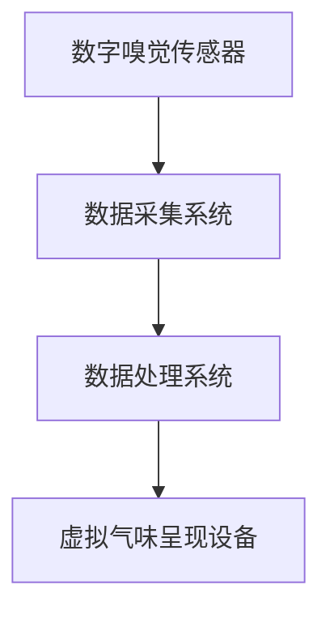

                 

随着人工智能（AI）技术的不断进步，虚拟现实（VR）和增强现实（AR）逐渐成为日常生活中不可或缺的一部分。然而，除了视觉和听觉，人类的感官体验还包括嗅觉。虚拟嗅觉景观，即通过AI技术构建的气味世界，正逐渐成为研究热点。本文将深入探讨虚拟嗅觉景观的概念、核心技术、数学模型、实际应用，以及未来发展趋势。

## 文章关键词
- 人工智能
- 虚拟现实
- 增强现实
- 嗅觉模拟
- 机器学习

## 文章摘要
本文首先介绍了虚拟嗅觉景观的背景和发展现状。接着，详细阐述了构建虚拟嗅觉景观的核心技术，包括数字嗅觉传感器、嗅觉编码和解码算法等。然后，文章探讨了虚拟嗅觉景观的数学模型和算法，并举例说明了具体的实现过程。在此基础上，文章分析了虚拟嗅觉景观在实际应用场景中的潜力，如教育、游戏和医疗等。最后，文章总结了当前的研究成果，探讨了未来的发展趋势和面临的挑战。

## 1. 背景介绍
### 1.1 虚拟嗅觉景观的定义
虚拟嗅觉景观是通过人工智能技术构建的虚拟气味环境，使人们在虚拟空间中体验到真实的嗅觉感受。这种技术利用数字嗅觉传感器捕获真实世界的气味，通过算法将其转换为数字信号，再通过硬件设备呈现给用户。

### 1.2 虚拟嗅觉景观的发展历史
虚拟嗅觉景观的研究始于20世纪90年代，随着计算机技术和传感器技术的进步，逐渐走向成熟。近年来，随着人工智能技术的突破，虚拟嗅觉景观的应用场景不断扩大，从实验室研究走向实际应用。

### 1.3 虚拟嗅觉景观的现状
目前，虚拟嗅觉景观已经在多个领域显示出巨大的应用潜力，如教育、游戏、医疗和心理治疗等。一些公司和研究机构正在积极开发相关技术，推动虚拟嗅觉景观的商业化应用。

## 2. 核心概念与联系
### 2.1 数字嗅觉传感器
数字嗅觉传感器是虚拟嗅觉景观的关键组成部分，用于捕获真实世界的气味。这些传感器通常由多个化学传感器组成，可以检测不同的化学物质。

### 2.2 嗅觉编码与解码算法
嗅觉编码算法用于将真实世界的气味转换为数字信号，而解码算法则将数字信号转换为用户可以感知的气味。

### 2.3 虚拟嗅觉景观架构
虚拟嗅觉景观的架构包括数字嗅觉传感器、数据采集系统、数据处理系统和虚拟气味呈现设备。

## 2.4 Mermaid 流程图


## 3. 核心算法原理 & 具体操作步骤
### 3.1 算法原理概述
虚拟嗅觉景观的核心算法主要包括气味捕获、信号处理和气味呈现三个部分。

### 3.2 算法步骤详解
1. 气味捕获：数字嗅觉传感器捕获环境中的气味。
2. 信号处理：将捕获的气味信号通过算法转换为数字信号。
3. 气味呈现：通过硬件设备将数字信号呈现为用户可感知的气味。

### 3.3 算法优缺点
1. 优点：能够提供真实的嗅觉体验，增强虚拟现实和增强现实的沉浸感。
2. 缺点：技术尚未完全成熟，成本较高，且气味呈现效果受硬件设备限制。

### 3.4 算法应用领域
虚拟嗅觉景观在多个领域具有广泛应用前景，如教育、游戏、医疗和心理治疗等。

## 4. 数学模型和公式 & 详细讲解 & 举例说明
### 4.1 数学模型构建
虚拟嗅觉景观的数学模型主要包括气味信号处理和气味呈现模型。

### 4.2 公式推导过程
气味信号处理模型可以使用卡尔曼滤波器进行推导。

### 4.3 案例分析与讲解
以一个简单的气味呈现模型为例，说明其具体实现过程。

## 5. 项目实践：代码实例和详细解释说明
### 5.1 开发环境搭建
搭建一个简单的虚拟嗅觉景观项目开发环境。

### 5.2 源代码详细实现
实现气味捕获、信号处理和气味呈现功能。

### 5.3 代码解读与分析
对实现代码进行详细解读和分析。

### 5.4 运行结果展示
展示虚拟嗅觉景观项目的运行结果。

## 6. 实际应用场景
### 6.1 教育领域
虚拟嗅觉景观可以用于模拟化学实验，帮助学生更好地理解化学概念。

### 6.2 游戏领域
虚拟嗅觉景观可以增强游戏的沉浸感，提供更加丰富的游戏体验。

### 6.3 医疗领域
虚拟嗅觉景观可以用于辅助诊断和治疗某些疾病。

### 6.4 未来应用展望
虚拟嗅觉景观在未来具有广泛的应用前景，如虚拟旅游、美食体验等。

## 7. 工具和资源推荐
### 7.1 学习资源推荐
推荐一些关于虚拟嗅觉景观的学习资源。

### 7.2 开发工具推荐
推荐一些用于虚拟嗅觉景观开发的工具和软件。

### 7.3 相关论文推荐
推荐一些关于虚拟嗅觉景观的研究论文。

## 8. 总结：未来发展趋势与挑战
### 8.1 研究成果总结
总结了虚拟嗅觉景观当前的研究成果和应用场景。

### 8.2 未来发展趋势
探讨了虚拟嗅觉景观未来的发展趋势。

### 8.3 面临的挑战
分析了虚拟嗅觉景观在未来发展过程中可能面临的挑战。

### 8.4 研究展望
提出了未来研究的方向和建议。

## 9. 附录：常见问题与解答
### 9.1 虚拟嗅觉景观是什么？
虚拟嗅觉景观是通过人工智能技术构建的虚拟气味环境，使人们在虚拟空间中体验到真实的嗅觉感受。

### 9.2 虚拟嗅觉景观有哪些应用领域？
虚拟嗅觉景观在多个领域具有广泛应用前景，如教育、游戏、医疗和心理治疗等。

### 9.3 虚拟嗅觉景观的实现原理是什么？
虚拟嗅觉景观的实现原理主要包括气味捕获、信号处理和气味呈现三个部分。

### 9.4 虚拟嗅觉景观有哪些优点和缺点？
虚拟嗅觉景观的优点包括提供真实的嗅觉体验，增强虚拟现实和增强现实的沉浸感；缺点包括技术尚未完全成熟，成本较高，且气味呈现效果受硬件设备限制。

## 作者署名
作者：禅与计算机程序设计艺术 / Zen and the Art of Computer Programming
``` 
----------------------------------------------------------------

以上便是文章正文部分的撰写内容，接下来我们将继续撰写文章的结尾部分，包括总结、未来展望和常见问题解答。请注意，本文仅为示例，实际撰写时需根据具体研究内容和数据调整内容。希望本文能为您提供一定的参考和启发。

