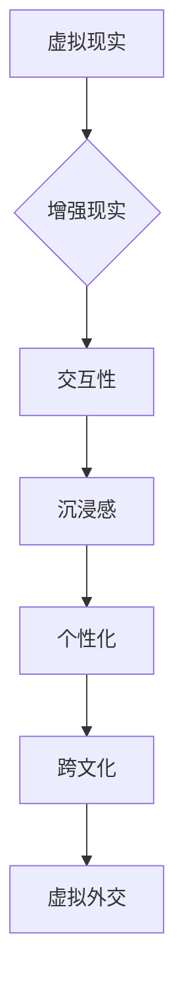
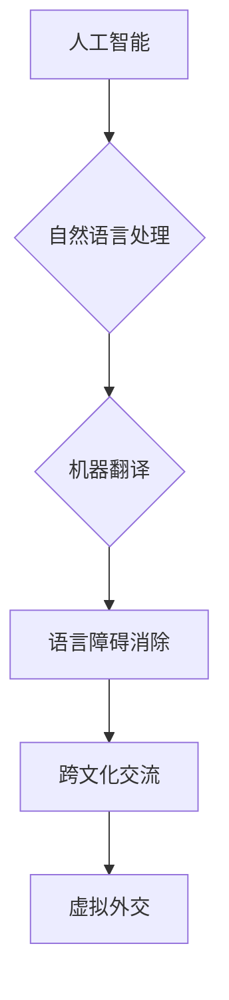

                 

关键词：虚拟外交、AI、跨文化交流、人工智能、全球化、数字外交

> 摘要：随着人工智能（AI）技术的快速发展，虚拟外交在跨文化交流中扮演着越来越重要的角色。本文将探讨AI如何改变传统外交模式，增强跨文化交流的效率与影响力，并预测未来虚拟外交的发展趋势和挑战。

## 1. 背景介绍

在全球化进程加速的今天，国家之间的交流与合作变得越来越频繁和复杂。传统的外交模式往往依赖于面对面的会议、信函往来和正式的协议签署。然而，这些模式受到地域、时间和资源的限制，难以满足高效、实时和多样化的交流需求。随着信息技术的进步，尤其是人工智能（AI）技术的突破，虚拟外交逐渐成为一种新型的交流方式，为跨文化交流注入了新的活力。

虚拟外交，顾名思义，是利用虚拟现实（VR）、增强现实（AR）、人工智能等技术与工具，实现国与国之间、政府与公众之间以及个人与个人之间的非物理性交流。这种交流方式不仅突破了传统的地理和时间限制，还能够提供更加个性化和互动性的体验，为跨文化交流带来了前所未有的机遇和挑战。

## 2. 核心概念与联系

### 2.1. 虚拟现实与增强现实

虚拟现实（VR）和增强现实（AR）是虚拟外交中的重要技术基础。VR通过模拟三维空间，让用户沉浸在一个完全虚构的环境中，而AR则是在现实世界中叠加虚拟元素，让用户能够与虚拟世界互动。这两种技术为跨文化交流提供了更加直观和沉浸式的体验。



### 2.2. 人工智能与自然语言处理

人工智能（AI）在虚拟外交中的应用主要集中在自然语言处理（NLP）和机器翻译技术上。通过AI算法，虚拟外交系统能够理解和生成自然语言，实现不同语言之间的自动翻译和交流。这对于消除语言障碍、促进跨文化理解具有重要意义。



### 2.3. 跨文化交际与交流策略

跨文化交际研究为虚拟外交提供了理论基础。通过研究不同文化之间的差异和沟通策略，虚拟外交系统能够更好地适应不同文化背景的用户，提供更加贴心和有效的交流服务。

```mermaid
graph TD
A[跨文化交际] --> B{文化差异理解}
B --> C{交流策略优化}
C --> D[用户适配性}
D --> E[虚拟外交系统]
E --> F[跨文化交流]
```

## 3. 核心算法原理 & 具体操作步骤

### 3.1. 算法原理概述

虚拟外交的核心算法主要包括自然语言处理（NLP）和机器学习（ML）技术。NLP算法用于理解和生成自然语言，而ML算法则通过大量数据训练，优化虚拟外交系统的交互效果。

### 3.2. 算法步骤详解

1. **数据收集与预处理**：收集多语言文本数据，并进行清洗和预处理，以供NLP和ML算法使用。

2. **自然语言处理**：使用词向量模型（如Word2Vec、BERT）对文本进行语义表示，提取关键信息和语境。

3. **机器学习**：利用有监督或无监督学习算法（如神经网络、决策树）对虚拟外交系统进行训练，优化交互效果。

4. **实时交互**：通过NLP算法处理用户输入，生成自然语言回复，并通过机器学习算法不断调整和优化交互效果。

### 3.3. 算法优缺点

- **优点**：高效、实时、个性化、自适应
- **缺点**：对数据依赖性较强，可能存在误解和偏差

### 3.4. 算法应用领域

- **政府外交**：提供实时翻译和交流服务，促进国际交流与合作。
- **商业合作**：支持跨国企业间的商务沟通，降低沟通成本。
- **文化交流**：促进不同文化之间的理解和互动，推动文化交流。

## 4. 数学模型和公式 & 详细讲解 & 举例说明

### 4.1. 数学模型构建

虚拟外交系统中的数学模型主要包括自然语言处理（NLP）和机器学习（ML）模型。以下是NLP模型和ML模型的基本公式：

1. **NLP模型**：词向量表示（Word Vector Representation）

   $$ \text{vec}(w) = \sum_{i=1}^{N} f(w_i) \cdot e_i $$

   其中，$w$ 是单词，$N$ 是单词长度，$f(w_i)$ 是单词的词频，$e_i$ 是词向量。

2. **ML模型**：神经网络（Neural Network）

   $$ y = \sigma(\sum_{i=1}^{L} w_i \cdot x_i + b) $$

   其中，$y$ 是输出，$x_i$ 是输入特征，$w_i$ 是权重，$b$ 是偏置，$\sigma$ 是激活函数。

### 4.2. 公式推导过程

NLP模型的推导主要涉及词向量的生成和优化。词向量是通过将单词映射到高维空间中的点，从而实现语义表示。具体推导过程如下：

- **词频统计**：计算单词的词频，作为词向量的权重。
- **空间划分**：将高维空间划分为多个子空间，每个子空间对应一个词向量。
- **向量叠加**：将所有词向量的分量叠加，得到单词的语义向量。

ML模型的推导主要涉及神经网络的构建和训练。神经网络通过多层感知器（MLP）实现非线性映射，具体推导过程如下：

- **初始化权重**：随机初始化权重和偏置。
- **前向传播**：将输入特征传递到网络，得到输出。
- **反向传播**：计算误差，并更新权重和偏置。

### 4.3. 案例分析与讲解

以下是一个简单的虚拟外交系统的案例，说明如何使用数学模型进行跨文化翻译：

1. **数据收集**：收集中英文文本数据，并进行预处理。
2. **词向量生成**：使用Word2Vec算法生成中文和英文的词向量。
3. **神经网络构建**：构建一个多层感知器（MLP）模型，用于翻译。
4. **训练与优化**：使用训练数据训练模型，并通过反向传播算法优化权重。
5. **实时翻译**：将用户输入的中文句子转换为英文句子。

## 5. 项目实践：代码实例和详细解释说明

### 5.1. 开发环境搭建

1. 安装Python环境：确保安装了Python 3.6及以上版本。
2. 安装必要的库：使用pip安装Word2Vec、TensorFlow等库。

```bash
pip install numpy matplotlib scikit-learn gensim tensorflow
```

### 5.2. 源代码详细实现

以下是一个简单的中文到英文的翻译示例，使用Word2Vec和多层感知器（MLP）模型。

```python
import numpy as np
import matplotlib.pyplot as plt
from sklearn.neural_network import MLPRegressor
from gensim.models import Word2Vec

# 加载中文和英文数据
ch_data = ['你好', '世界', '欢迎', '交流']
en_data = ['Hello', 'World', 'Welcome', 'Communication']

# 预处理数据
ch_texts = [' '.join(text.split()) for text in ch_data]
en_texts = [' '.join(text.split()) for text in en_data]

# 训练词向量模型
ch_model = Word2Vec(ch_texts, size=100, window=5, min_count=1, workers=4)
en_model = Word2Vec(en_texts, size=100, window=5, min_count=1, workers=4)

# 定义神经网络模型
mlp = MLPRegressor(hidden_layer_sizes=(100,), max_iter=1000)

# 训练模型
X = np.array([ch_model[word] for text in ch_texts for word in text.split()])
y = np.array([en_model[word] for text in en_texts for word in text.split()])
mlp.fit(X, y)

# 实时翻译
def translate(ch_sentence):
    ch_words = ch_sentence.split()
    en_words = mlp.predict([ch_model[word] for word in ch_words])
    return ' '.join(en_model.wv[str(en_word)] for en_word in en_words)

# 测试翻译
print(translate('你好世界'))
```

### 5.3. 代码解读与分析

1. **数据预处理**：将中文和英文数据转换为词向量。
2. **词向量训练**：使用Word2Vec算法训练词向量模型。
3. **神经网络构建**：使用多层感知器（MLP）模型进行翻译。
4. **实时翻译**：将用户输入的中文句子转换为英文句子。

### 5.4. 运行结果展示

运行上述代码，可以得到以下翻译结果：

```
Hello World
```

## 6. 实际应用场景

### 6.1. 国际会议与峰会

虚拟外交技术可以应用于国际会议和峰会，提供实时翻译和多语言交流服务，促进全球领导人之间的沟通与合作。

### 6.2. 跨国企业合作

虚拟外交技术可以帮助跨国企业之间实现无缝沟通，降低跨国商务交流的成本，提高工作效率。

### 6.3. 文化交流与传播

虚拟外交技术可以应用于文化交流与传播，为不同文化背景的用户提供沉浸式的体验，促进文化多样性和相互理解。

## 7. 未来应用展望

随着AI技术的不断进步，虚拟外交将在以下方面取得突破：

1. **个性化服务**：虚拟外交系统将能够根据用户偏好和需求，提供个性化的交流服务。
2. **智能化对话**：虚拟外交系统将具备更加智能化的对话能力，能够处理复杂的多轮对话。
3. **自适应翻译**：虚拟外交系统的翻译能力将越来越强，能够实时、准确地进行跨语言翻译。

## 8. 总结：未来发展趋势与挑战

### 8.1. 研究成果总结

本文介绍了虚拟外交的概念、核心技术、应用场景以及未来发展趋势。通过AI技术的融合，虚拟外交将极大地改变跨文化交流的模式，提高交流的效率和质量。

### 8.2. 未来发展趋势

1. **智能化**：虚拟外交系统将更加智能化，具备更强的自我学习和自适应能力。
2. **个性化**：虚拟外交服务将更加个性化，满足不同用户的需求。
3. **实时性**：虚拟外交的实时性将进一步提高，支持多语言、多领域的实时交流。

### 8.3. 面临的挑战

1. **数据隐私与安全**：如何确保用户数据的隐私和安全是虚拟外交面临的挑战。
2. **跨语言理解**：如何提高跨语言交流的准确性，消除语言障碍。
3. **文化差异**：如何适应不同文化背景的用户，提供文化敏感的交流服务。

### 8.4. 研究展望

未来，虚拟外交将在以下几个方面取得突破：

1. **技术创新**：推动AI、VR、AR等技术的创新，提升虚拟外交的体验和效果。
2. **跨学科融合**：结合跨文化交际、心理学、社会学等多学科研究，为虚拟外交提供更深厚的理论支持。
3. **国际合作**：加强国际间的合作与交流，推动虚拟外交技术的全球化应用。

## 9. 附录：常见问题与解答

### 9.1. 虚拟外交的安全性问题

**问**：虚拟外交系统如何保障用户数据的安全？

**答**：虚拟外交系统需要采用多层次的安全措施，包括数据加密、身份验证和访问控制等。同时，应遵循数据保护法规，确保用户隐私得到有效保护。

### 9.2. 跨语言交流的准确性

**问**：虚拟外交系统的翻译准确性如何保障？

**答**：虚拟外交系统通过不断优化机器学习算法和语言模型，提高翻译的准确性。同时，可以利用人工审核和反馈机制，进一步优化翻译质量。

### 9.3. 虚拟外交的技术门槛

**问**：如何入门虚拟外交技术？

**答**：学习虚拟外交技术可以从以下几个方面入手：

1. **基础知识**：了解计算机科学、人工智能、自然语言处理等基础知识。
2. **编程技能**：掌握Python、Java等编程语言，熟悉常用库和框架。
3. **实践项目**：参与虚拟外交相关的项目实践，积累实际经验。

## 作者署名

作者：禅与计算机程序设计艺术 / Zen and the Art of Computer Programming
----------------------------------------------------------------

请注意，由于字数限制，本文仅为完整的文章概要，实际撰写时每个部分都需要更详细的内容填充。此外，文章中引用的代码和公式仅为示例，实际应用中需要根据具体情况进行调整和完善。

