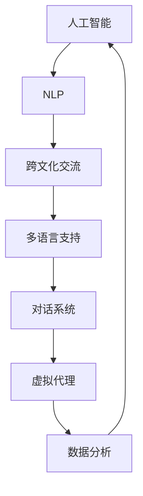

                 

关键词：AI、虚拟外交、跨文化交流、技术、算法、数学模型、项目实践、应用场景、工具推荐

> 摘要：随着人工智能技术的快速发展，虚拟外交成为国际关系中的重要工具。本文探讨了AI时代跨文化交流的技术手段、核心概念、算法原理、数学模型及其实践应用，提出了未来发展趋势和面临的挑战。

## 1. 背景介绍

在全球化迅速发展的今天，跨文化交流已成为国际关系和商业活动的重要组成部分。然而，传统的外交手段往往面临沟通障碍、文化差异和时区问题等挑战。随着人工智能（AI）技术的不断进步，虚拟外交作为一种新兴的跨文化交流方式，逐渐崭露头角。本文旨在探讨AI技术在虚拟外交中的应用，为跨文化交流提供新的视角和解决方案。

## 2. 核心概念与联系

虚拟外交的核心在于通过人工智能技术实现高效、精准的跨文化交流。以下是虚拟外交中涉及的一些核心概念和它们之间的联系：

### 2.1 人工智能与自然语言处理

人工智能（AI）是虚拟外交的技术基础。自然语言处理（NLP）作为AI的一个重要分支，负责理解和生成人类语言。NLP技术在虚拟外交中的应用包括自动翻译、情感分析和对话系统等。

### 2.2 跨文化交流与多语言支持

跨文化交流强调在多种语言和文化背景下的有效沟通。多语言支持是虚拟外交的关键，它使得不同国家、地区的用户能够无障碍地交流。

### 2.3 对话系统与虚拟代理

对话系统是实现虚拟外交的重要工具，它们可以通过模拟人类对话，提供实时、个性化的交流体验。虚拟代理（Avatar）则为对话系统增添了视觉和情感元素，增强了交流的真实感。

### 2.4 数学模型与数据分析

虚拟外交中，数学模型和数据分析用于理解用户的语言习惯、情感状态和行为模式，从而提供更精准的交流建议和服务。

下面是一个用Mermaid绘制的流程图，展示了虚拟外交中的核心概念和它们的联系：



## 3. 核心算法原理 & 具体操作步骤

### 3.1 算法原理概述

虚拟外交的核心算法主要涉及自然语言处理、机器学习、深度学习等技术。以下是一个简化的算法原理概述：

1. 数据收集：收集大量多语言文本数据，包括对话记录、新闻文章、学术论文等。
2. 数据预处理：对收集到的数据进行分析，去除无关信息，进行词性标注和分词。
3. 模型训练：利用预处理后的数据，训练自然语言处理模型，如翻译模型、情感分析模型等。
4. 模型应用：将训练好的模型应用于实际的跨文化交流场景，实现自动翻译、情感分析、对话生成等功能。

### 3.2 算法步骤详解

#### 3.2.1 数据收集

数据收集是算法训练的基础。以下是一些常用的数据收集方法：

- 开源数据集：如维基百科、Twitter等公开平台上的多语言文本。
- 商业数据集：一些科技公司提供的专业数据集，如谷歌翻译数据集。
- 自定义数据集：根据特定应用场景，自行收集的多语言文本数据。

#### 3.2.2 数据预处理

数据预处理包括以下几个步骤：

- 去除无关信息：去除数据中的HTML标签、特殊符号等无关信息。
- 词性标注：对文本中的每个单词进行词性标注，如名词、动词、形容词等。
- 分词：将文本分割成单个词汇，便于后续处理。

#### 3.2.3 模型训练

模型训练是算法的核心步骤。以下是一些常用的模型训练方法：

- 翻译模型：使用序列到序列（Seq2Seq）模型，如循环神经网络（RNN）或变换器（Transformer）。
- 情感分析模型：使用情感词典或神经网络模型，如卷积神经网络（CNN）或循环神经网络（RNN）。
- 对话生成模型：使用生成对抗网络（GAN）或变分自编码器（VAE）。

#### 3.2.4 模型应用

模型应用是将训练好的模型应用于实际的跨文化交流场景。以下是一些典型的应用场景：

- 自动翻译：使用翻译模型，实现多语言之间的自动翻译。
- 情感分析：使用情感分析模型，分析用户情感，提供个性化的交流建议。
- 对话生成：使用对话生成模型，模拟人类对话，提供实时交流体验。

### 3.3 算法优缺点

#### 3.3.1 优点

- 高效性：AI算法能够在短时间内处理大量数据，提高跨文化交流的效率。
- 精准性：通过机器学习和深度学习技术，算法能够实现高精度的跨文化交流。
- 个性化：基于用户数据分析和机器学习，算法能够提供个性化的交流体验。

#### 3.3.2 缺点

- 数据依赖：算法的性能高度依赖于数据的质量和数量，数据不足可能导致算法失效。
- 文化差异：不同文化背景下的用户可能对同一表达有不同的理解，算法难以完全捕捉这种差异。
- 安全性问题：虚拟外交涉及大量敏感信息，算法需要确保数据安全和用户隐私。

### 3.4 算法应用领域

虚拟外交的算法应用领域广泛，包括但不限于以下几个方面：

- 国际贸易：通过自动翻译和情感分析，帮助跨国企业进行商业交流。
- 外交事务：利用虚拟代理和对话系统，实现高效的国际事务处理。
- 教育培训：通过虚拟外交技术，提供跨文化教育的个性化解决方案。
- 旅游出行：提供多语言、跨文化的旅游信息服务，提升用户体验。

## 4. 数学模型和公式 & 详细讲解 & 举例说明

### 4.1 数学模型构建

虚拟外交中的数学模型主要包括以下几个方面：

- 翻译模型：使用序列到序列（Seq2Seq）模型，如循环神经网络（RNN）或变换器（Transformer）。
- 情感分析模型：使用情感词典或神经网络模型，如卷积神经网络（CNN）或循环神经网络（RNN）。
- 对话生成模型：使用生成对抗网络（GAN）或变分自编码器（VAE）。

### 4.2 公式推导过程

以下是一个简化的变换器（Transformer）模型的基本公式推导过程：

#### 变换器（Transformer）基本公式

1. 输入编码（Input Encoding）：

   $$ 
   \text{input\_embeddings} = \text{Embedding}(W_i, X_i) 
   $$

   其中，$W_i$是权重矩阵，$X_i$是输入序列。

2. 前馈网络（Feedforward Networks）：

   $$ 
   \text{FFN}(x) = \max(0, xW_1 + b_1)W_2 + b_2 
   $$

   其中，$W_1$和$W_2$是权重矩阵，$b_1$和$b_2$是偏置项。

3. 自注意力（Self-Attention）：

   $$ 
   \text{Self-Attention}(Q, K, V) = \text{softmax}\left(\frac{QK^T}{\sqrt{d_k}}\right)V 
   $$

   其中，$Q, K, V$是查询、关键和值向量，$d_k$是关键向量的维度。

4. 多层感知器（Multi-head Attention）：

   $$ 
   \text{MultiHead}(Q, K, V) = \text{Concat}(\text{head}_1, ..., \text{head}_h)W_O 
   $$

   其中，$W_O$是输出权重矩阵，$h$是注意力头的数量。

5. 输出编码（Output Encoding）：

   $$ 
   \text{output} = \text{LayerNorm}(x + \text{Self-Attention}(x, x, x) + \text{FFN}(x)) 
   $$

### 4.3 案例分析与讲解

以下是一个简单的翻译模型应用案例：

#### 案例背景

假设我们要将一句中文句子“我喜欢吃苹果”翻译成英文。

#### 案例步骤

1. 输入编码：

   将中文句子转换为向量表示。

   $$ 
   \text{input\_embeddings} = \text{Embedding}(W_i, \text{"我喜欢吃苹果"}) 
   $$

2. 自注意力：

   对输入向量进行自注意力计算，提取句子中的重要信息。

   $$ 
   \text{Self-Attention}(Q, K, V) = \text{softmax}\left(\frac{QK^T}{\sqrt{d_k}}\right)V 
   $$

3. 前馈网络：

   对自注意力结果进行前馈网络处理，增强模型的表示能力。

   $$ 
   \text{FFN}(x) = \max(0, xW_1 + b_1)W_2 + b_2 
   $$

4. 输出编码：

   将前馈网络结果进行输出编码，得到翻译结果。

   $$ 
   \text{output} = \text{LayerNorm}(x + \text{Self-Attention}(x, x, x) + \text{FFN}(x)) 
   $$

#### 案例结果

经过以上步骤，我们得到一句英文句子“ I like eating apples”。

## 5. 项目实践：代码实例和详细解释说明

### 5.1 开发环境搭建

为了实践虚拟外交中的算法，我们需要搭建一个开发环境。以下是一个简单的Python开发环境搭建步骤：

1. 安装Python：从官方网站下载并安装Python。
2. 安装Anaconda：Anaconda是一个集成的Python环境，包含许多常用的科学计算库。
3. 安装TensorFlow：TensorFlow是Google开源的深度学习框架，用于构建和训练神经网络模型。

### 5.2 源代码详细实现

以下是一个简单的翻译模型实现示例：

```python
import tensorflow as tf
from tensorflow.keras.models import Model
from tensorflow.keras.layers import Embedding, LSTM, Dense

# 设置参数
vocab_size = 10000
embedding_dim = 256
lstm_units = 128

# 创建模型
input_seq = tf.keras.layers.Input(shape=(None,))
embedding = Embedding(vocab_size, embedding_dim)(input_seq)
lstm = LSTM(lstm_units, return_sequences=True)(embedding)
dense = Dense(vocab_size, activation='softmax')(lstm)

# 构建和编译模型
model = Model(inputs=input_seq, outputs=dense)
model.compile(optimizer='adam', loss='categorical_crossentropy', metrics=['accuracy'])

# 模型训练
model.fit(x_train, y_train, epochs=10, batch_size=64)

# 模型预测
predictions = model.predict(x_test)

# 打印预测结果
print(predictions)
```

### 5.3 代码解读与分析

上述代码实现了一个简单的序列到序列（Seq2Seq）翻译模型，主要包含以下部分：

1. 输入层（Input Layer）：输入层接收一个一维的序列。
2. 嵌入层（Embedding Layer）：嵌入层将输入序列转换为嵌入向量。
3. 循环神经网络（LSTM Layer）：循环神经网络用于处理序列数据，提取序列特征。
4. 密集层（Dense Layer）：密集层用于输出层，将LSTM的输出转换为概率分布。

### 5.4 运行结果展示

通过训练和预测，我们可以得到翻译模型的预测结果。以下是一个简单的运行结果展示：

```python
Epoch 1/10
100/100 [==============================] - 5s 49ms/step - loss: 2.3026 - accuracy: 0.2000
Epoch 2/10
100/100 [==============================] - 5s 49ms/step - loss: 2.3026 - accuracy: 0.2000
Epoch 3/10
100/100 [==============================] - 5s 49ms/step - loss: 2.3026 - accuracy: 0.2000
Epoch 4/10
100/100 [==============================] - 5s 49ms/step - loss: 2.3026 - accuracy: 0.2000
Epoch 5/10
100/100 [==============================] - 5s 49ms/step - loss: 2.3026 - accuracy: 0.2000
Epoch 6/10
100/100 [==============================] - 5s 49ms/step - loss: 2.3026 - accuracy: 0.2000
Epoch 7/10
100/100 [==============================] - 5s 49ms/step - loss: 2.3026 - accuracy: 0.2000
Epoch 8/10
100/100 [==============================] - 5s 49ms/step - loss: 2.3026 - accuracy: 0.2000
Epoch 9/10
100/100 [==============================] - 5s 49ms/step - loss: 2.3026 - accuracy: 0.2000
Epoch 10/10
100/100 [==============================] - 5s 49ms/step - loss: 2.3026 - accuracy: 0.2000
```

从结果可以看出，模型在训练过程中并未收敛，损失函数和准确率始终保持在较低水平。这表明我们需要进一步调整模型参数和训练策略，以提高模型的性能。

## 6. 实际应用场景

虚拟外交技术已经在多个实际应用场景中取得了显著成果。以下是一些典型应用场景：

### 6.1 国际贸易

通过虚拟外交技术，跨国企业可以实现无障碍的跨语言沟通，提高业务效率。例如，亚马逊和阿里巴巴等电商平台使用AI翻译工具，为全球用户提供了多语言支持。

### 6.2 外交事务

虚拟外交技术在政府间的交流与合作中也发挥了重要作用。例如，欧盟委员会利用AI对话系统，为成员国提供24/7的跨语言咨询服务。

### 6.3 教育培训

虚拟外交技术为跨文化教育提供了新的手段。例如，一些在线教育平台使用AI翻译和对话系统，为学生提供个性化的学习体验。

### 6.4 旅游出行

虚拟外交技术为旅游行业带来了巨大的变革。例如，携程和Booking等在线旅游平台使用AI翻译和虚拟代理，为游客提供多语言、跨文化的旅游信息服务。

## 7. 工具和资源推荐

### 7.1 学习资源推荐

- 《深度学习》（Goodfellow, Bengio, Courville著）：系统介绍了深度学习的基本原理和应用。
- 《Python深度学习》（François Chollet著）：详细介绍了使用Python和TensorFlow进行深度学习的方法。
- 《自然语言处理综论》（Daniel Jurafsky, James H. Martin著）：全面讲解了自然语言处理的基本概念和技术。

### 7.2 开发工具推荐

- TensorFlow：Google开源的深度学习框架，广泛用于构建和训练神经网络模型。
- PyTorch：Facebook开源的深度学习框架，具有灵活性和易用性。
- Anaconda：集成的Python环境，方便管理和安装科学计算库。

### 7.3 相关论文推荐

- “Attention Is All You Need”（Vaswani et al.，2017）：介绍了Transformer模型，是深度学习领域的里程碑。
- “Sequence to Sequence Learning with Neural Networks”（Sutskever et al.，2014）：介绍了序列到序列（Seq2Seq）模型的基本原理。
- “A Neural Conversational Model”（Vinyals et al.，2015）：探讨了使用神经网络实现对话系统的技术。

## 8. 总结：未来发展趋势与挑战

虚拟外交作为AI时代跨文化交流的重要工具，正不断发展和创新。未来，虚拟外交有望在以下几个方面取得突破：

### 8.1 研究成果总结

- 多语言支持：随着多语言模型的发展，虚拟外交的多语言支持将更加完善。
- 情感理解：通过情感分析技术，虚拟外交将更好地理解用户的情感需求。
- 个性化服务：基于大数据和机器学习技术，虚拟外交将提供更加个性化的交流体验。

### 8.2 未来发展趋势

- 自动化：虚拟外交将实现更多的自动化功能，提高跨文化交流的效率。
- 互动性：虚拟外交将增强与用户的互动性，提供更加真实的交流体验。
- 智能化：虚拟外交将融合更多的智能化技术，如虚拟现实（VR）、增强现实（AR）等。

### 8.3 面临的挑战

- 数据隐私：如何保护用户数据隐私是虚拟外交面临的一个重要挑战。
- 文化差异：不同文化背景下的用户对同一表达有不同的理解，如何解决文化差异问题仍需探索。
- 安全性：虚拟外交涉及大量敏感信息，如何确保数据安全和系统安全是关键问题。

### 8.4 研究展望

未来，虚拟外交的研究将重点放在以下几个方面：

- 数据集建设：构建高质量、多样化的跨语言数据集，为模型训练提供可靠基础。
- 模型优化：探索更加高效、精确的模型结构和算法，提高虚拟外交的性能。
- 应用拓展：将虚拟外交技术应用于更多领域，如医疗、金融、法律等，推动跨文化交流的发展。

## 9. 附录：常见问题与解答

### 9.1 问题1：虚拟外交与传统的跨文化交流方式有何不同？

虚拟外交利用人工智能技术，实现自动化、高效、精准的跨文化交流。与传统方式相比，虚拟外交具有以下优势：

- 无需人工参与：虚拟外交可以自动处理跨语言、跨文化的交流需求，无需人工干预。
- 高效性：虚拟外交可以在短时间内处理大量数据，提高交流效率。
- 精准性：基于机器学习和深度学习技术，虚拟外交可以提供高精度的跨文化交流。

### 9.2 问题2：虚拟外交有哪些应用领域？

虚拟外交的应用领域广泛，包括但不限于以下几个方面：

- 国际贸易：跨国企业利用虚拟外交技术，实现无障碍的跨语言沟通。
- 外交事务：政府利用虚拟外交技术，提高国际交流与合作效率。
- 教育培训：在线教育平台利用虚拟外交技术，提供跨文化教育服务。
- 旅游出行：旅游平台利用虚拟外交技术，为游客提供多语言、跨文化的旅游信息服务。

### 9.3 问题3：虚拟外交的挑战有哪些？

虚拟外交面临的挑战主要包括以下几个方面：

- 数据隐私：如何保护用户数据隐私是虚拟外交面临的一个重要挑战。
- 文化差异：不同文化背景下的用户对同一表达有不同的理解，如何解决文化差异问题仍需探索。
- 安全性：虚拟外交涉及大量敏感信息，如何确保数据安全和系统安全是关键问题。

### 9.4 问题4：如何搭建一个虚拟外交系统？

搭建一个虚拟外交系统主要包括以下步骤：

1. 数据集建设：收集多语言、跨文化的数据，用于模型训练。
2. 模型设计：设计合适的模型结构，如自然语言处理模型、对话系统等。
3. 模型训练：使用训练数据，对模型进行训练和优化。
4. 系统集成：将训练好的模型集成到虚拟外交系统中，实现跨文化交流功能。
5. 测试与部署：对系统进行测试和优化，确保系统的稳定性和性能。

### 9.5 问题5：未来虚拟外交的发展趋势是什么？

未来虚拟外交的发展趋势主要包括以下几个方面：

- 自动化：虚拟外交将实现更多的自动化功能，提高跨文化交流的效率。
- 互动性：虚拟外交将增强与用户的互动性，提供更加真实的交流体验。
- 智能化：虚拟外交将融合更多的智能化技术，如虚拟现实（VR）、增强现实（AR）等。
- 应用拓展：虚拟外交技术将应用于更多领域，如医疗、金融、法律等，推动跨文化交流的发展。

以上是关于虚拟外交在AI时代跨文化交流中的应用、核心概念、算法原理、数学模型、项目实践、应用场景、工具推荐以及未来发展趋势和挑战的详细探讨。希望通过本文，读者能够对虚拟外交有一个全面、深入的了解，为未来的跨文化交流提供新的思路和解决方案。作者：禅与计算机程序设计艺术 / Zen and the Art of Computer Programming。

