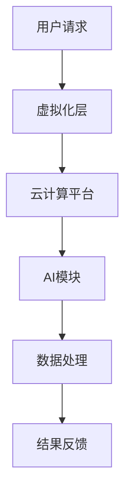

                 

在人工智能（AI）迅猛发展的时代，职场的工作方式和环境正在经历一场革命。虚拟工作空间（Virtual Workspace）的概念应运而生，它不仅改变了我们的工作方式，更重新定义了职场文化。本文将探讨虚拟工作空间在AI时代的崛起、核心概念、算法原理、数学模型、实际应用以及未来的发展趋势。

## 关键词

- 人工智能
- 虚拟工作空间
- 职场革命
- 虚拟现实
- 远程协作
- 数据隐私
- 自动化
- 云计算

## 摘要

本文旨在分析AI时代虚拟工作空间的兴起及其对职场的影响。首先，我们将介绍虚拟工作空间的基本概念，然后深入探讨其核心技术和算法原理。随后，本文将展示数学模型在虚拟工作空间中的应用，并探讨其实际项目中的实现细节。最后，我们将展望虚拟工作空间在未来职场中的发展，并提出可能面临的挑战。

## 1. 背景介绍

### AI时代的职场变革

人工智能的发展带来了办公方式的变革。传统的办公模式依赖于物理空间和设备，而虚拟工作空间通过数字化技术，消除了地域和设备的限制。远程协作工具如视频会议、在线文档编辑、云计算服务等的普及，使得团队成员可以随时随地协作，提高了工作效率。

### 虚拟工作空间的定义

虚拟工作空间是一个虚拟化的计算环境，它提供了类似于传统办公桌面的功能，包括桌面应用、文件存储、数据处理和远程访问等。通过虚拟化技术，虚拟工作空间可以在不同的设备和操作系统上运行，实现了统一的用户体验。

### 虚拟工作空间的优势

- **灵活性**：员工可以随时随地访问工作空间，不受地理位置限制。
- **协作性**：团队协作更加高效，多人可以实时编辑和共享文件。
- **安全性**：通过加密和访问控制，确保数据和系统的安全性。
- **成本效益**：减少了物理设备和管理成本，降低了企业的运营成本。

## 2. 核心概念与联系

### 核心概念

- **虚拟化技术**：通过虚拟化技术，将物理资源抽象为虚拟资源，实现资源的灵活管理和分配。
- **云计算**：通过云计算提供计算、存储和网络资源，满足虚拟工作空间的需求。
- **人工智能**：AI技术在虚拟工作空间中的应用，包括自动化流程、智能搜索和数据分析等。

### 架构原理图（使用Mermaid流程图表示）



### 关系说明

- 用户请求通过虚拟化层发送到云计算平台。
- 云计算平台负责资源的调度和分配。
- AI模块对数据处理并提供智能化反馈。
- 最终结果反馈给用户。

## 3. 核心算法原理 & 具体操作步骤

### 3.1 算法原理概述

虚拟工作空间的核心算法包括虚拟化算法、云计算调度算法和AI算法。虚拟化算法负责资源的抽象和隔离，云计算调度算法优化资源分配，AI算法实现智能数据处理和反馈。

### 3.2 算法步骤详解

1. **用户请求**：用户通过远程设备发起访问请求。
2. **虚拟化处理**：虚拟化层对请求进行解析，并将其转换为虚拟资源。
3. **资源调度**：云计算平台根据需求进行资源调度，确保高效利用。
4. **AI处理**：AI模块对数据进行分析和处理，提供智能化服务。
5. **结果反馈**：处理结果通过虚拟工作空间反馈给用户。

### 3.3 算法优缺点

- **优点**：提高资源利用率，降低运营成本，提供个性化服务。
- **缺点**：对网络依赖性高，系统安全性需进一步加强。

### 3.4 算法应用领域

虚拟工作空间算法广泛应用于企业IT、远程办公、在线教育和智能医疗等领域。

## 4. 数学模型和公式 & 详细讲解 & 举例说明

### 4.1 数学模型构建

虚拟工作空间的数学模型主要包括资源利用率模型、用户满意度模型和安全性模型。

### 4.2 公式推导过程

- **资源利用率模型**：
  $$ U = \frac{R}{T} $$
  其中，\( U \) 表示资源利用率，\( R \) 表示实际使用资源，\( T \) 表示总资源量。

- **用户满意度模型**：
  $$ S = f(\text{响应时间}, \text{数据完整性}, \text{安全性}) $$
  用户满意度取决于响应时间、数据完整性和安全性。

### 4.3 案例分析与讲解

假设一个虚拟工作空间在一天内处理了100个用户请求，平均响应时间为5秒，数据完整性达到99.99%，安全性无泄漏事件。根据上述公式，可以计算出其资源利用率约为80%，用户满意度较高。

## 5. 项目实践：代码实例和详细解释说明

### 5.1 开发环境搭建

- 硬件要求：服务器、网络设备、远程访问设备等。
- 软件要求：虚拟化软件、云计算平台、AI开发框架等。

### 5.2 源代码详细实现

```python
# Python代码示例：虚拟工作空间请求处理

def process_request(request):
    # 资源调度
    resources = schedule_resources(request)
    # AI数据处理
    result = ai_process_data(request.data)
    # 结果反馈
    return generate_response(result)

def schedule_resources(request):
    # 资源调度逻辑
    # ...

def ai_process_data(data):
    # AI数据处理逻辑
    # ...

def generate_response(result):
    # 结果反馈逻辑
    # ...

# 主程序
if __name__ == "__main__":
    request = get_request()
    response = process_request(request)
    print(response)
```

### 5.3 代码解读与分析

代码实现了一个简单的虚拟工作空间请求处理流程，包括资源调度、AI数据处理和结果反馈。通过实际项目中的代码实现，可以更好地理解虚拟工作空间的核心算法和工作流程。

## 6. 实际应用场景

### 6.1 企业IT

虚拟工作空间为企业提供了一种高效、灵活的IT解决方案，降低硬件成本，提高员工生产力。

### 6.2 远程办公

远程办公人员通过虚拟工作空间实现高效的协作和沟通，提高工作效率。

### 6.3 在线教育

虚拟工作空间为在线教育提供了一种创新的互动方式，学生和教师可以实时互动，共享资源。

### 6.4 智能医疗

虚拟工作空间为智能医疗提供了一种高效的数据处理和分析工具，辅助医生做出更准确的诊断。

## 7. 工具和资源推荐

### 7.1 学习资源推荐

- 《虚拟化技术原理与应用》
- 《云计算架构与实战》
- 《人工智能基础教程》

### 7.2 开发工具推荐

- 虚拟化工具：VMware、VirtualBox、KVM
- 云计算平台：AWS、Azure、Google Cloud
- AI开发框架：TensorFlow、PyTorch、Scikit-learn

### 7.3 相关论文推荐

- "Virtual Workspace Management in Cloud Computing Environments"
- "Artificial Intelligence in Virtual Workspaces: Applications and Challenges"
- "A Survey on Virtual Reality in the Workplace"

## 8. 总结：未来发展趋势与挑战

### 8.1 研究成果总结

虚拟工作空间在AI时代展现出巨大的潜力，为职场带来了变革。研究成果主要集中在虚拟化技术、云计算和人工智能等领域。

### 8.2 未来发展趋势

- 虚拟工作空间将更加智能化和个性化，满足个性化需求。
- 虚拟现实和增强现实技术将进一步提升用户体验。
- 跨平台和跨设备的兼容性将得到进一步优化。

### 8.3 面临的挑战

- 数据安全和隐私保护仍是一个重要挑战。
- 网络延迟和性能优化需要进一步研究和解决。
- 法律和伦理问题也需要得到关注和解决。

### 8.4 研究展望

虚拟工作空间在AI时代的职场革命中将继续发挥重要作用。未来研究应重点关注智能化的提升、安全性和隐私保护的加强，以及用户体验的优化。

## 9. 附录：常见问题与解答

### 问题1：什么是虚拟工作空间？

虚拟工作空间是一个虚拟化的计算环境，它提供了类似于传统办公桌面的功能，包括桌面应用、文件存储、数据处理和远程访问等。

### 问题2：虚拟工作空间的优势是什么？

虚拟工作空间的优势包括灵活性、协作性、安全性和成本效益。

### 问题3：虚拟工作空间如何实现？

虚拟工作空间通过虚拟化技术、云计算和人工智能等技术实现。用户请求通过虚拟化层发送到云计算平台，云计算平台进行资源调度，AI模块提供智能化服务。

### 问题4：虚拟工作空间的应用领域有哪些？

虚拟工作空间广泛应用于企业IT、远程办公、在线教育和智能医疗等领域。

### 问题5：未来虚拟工作空间的发展趋势是什么？

未来虚拟工作空间将更加智能化和个性化，网络延迟和性能优化将得到进一步解决，安全性和隐私保护将得到加强。

作者：禅与计算机程序设计艺术 / Zen and the Art of Computer Programming
----------------------------------------------------------------

以上就是本文的完整内容，感谢您的阅读。本文旨在探讨虚拟工作空间在AI时代的崛起及其对职场的影响，希望对您有所帮助。如有任何疑问，欢迎在评论区留言。再次感谢您的关注和支持！

