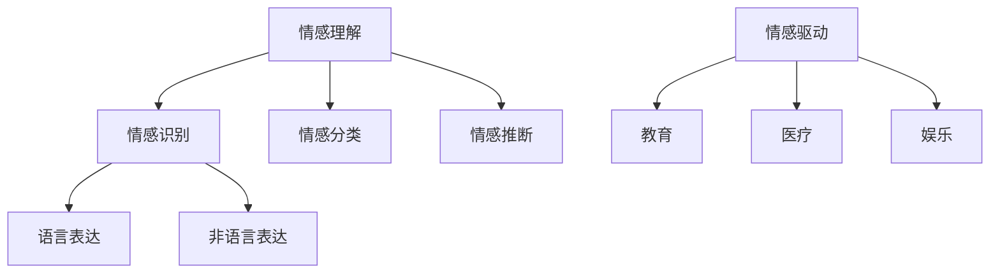

                 

关键词：虚拟情感智能，情感理解，情感表达，AI技术，深度学习，自然语言处理，机器学习，交互设计。

## 摘要

本文旨在探讨虚拟情感智能的发展及其在AI驱动的情感理解与表达中的应用。通过介绍虚拟情感智能的核心概念和联系，本文将深入解析其核心算法原理，包括数学模型和公式，并展示具体的代码实例。此外，文章还将探讨虚拟情感智能在实际应用场景中的表现，并提供学习资源和开发工具的推荐。最后，本文将对虚拟情感智能的未来发展趋势与挑战进行展望，并总结研究成果。

## 1. 背景介绍

在当今信息化社会中，人工智能（AI）技术的飞速发展为我们的生活带来了诸多便利。从语音识别到图像识别，从自动驾驶到智能助手，AI的应用范围越来越广泛。然而，随着技术的进步，人们开始意识到情感智能的重要性。情感智能指的是机器理解和表达情感的能力，这不仅是人类智能的重要组成部分，也是AI未来发展的关键方向。

虚拟情感智能是情感智能在虚拟世界中的具体应用，旨在为用户提供更加人性化的交互体验。通过模拟人类情感，虚拟情感智能能够更好地理解用户的情感状态，从而提供更加贴心的服务。例如，在虚拟客服、虚拟角色、虚拟教师等应用场景中，虚拟情感智能可以帮助系统更好地与用户沟通，提高用户体验。

虚拟情感智能的发展离不开深度学习、自然语言处理和机器学习等AI技术的支持。深度学习技术使得机器能够通过大规模数据训练，自动提取特征和模式，从而实现情感理解。自然语言处理技术则帮助机器理解和生成自然语言，实现情感表达。机器学习技术则通过不断优化模型，提高情感智能的准确性和适应性。

## 2. 核心概念与联系

### 2.1. 情感理解

情感理解是指机器对用户情感状态的理解能力。情感理解涉及到多个层次，包括情感识别、情感分类和情感推断。情感识别是指机器能够识别用户表达的情感，如快乐、悲伤、愤怒等。情感分类是指机器能够将情感识别的结果进行归类，如将情感分为积极情感和消极情感。情感推断是指机器能够根据用户的语言和行为，推断出用户的潜在情感状态。

### 2.2. 情感表达

情感表达是指机器能够以合适的方式表达情感，与用户进行情感交流。情感表达可以分为语言表达和非语言表达。语言表达包括文本、语音等形式，非语言表达包括表情、动作等形式。在虚拟情感智能中，情感表达需要考虑语言的自然性、适切性和真实性，以便更好地与用户互动。

### 2.3. 情感驱动

情感驱动是指机器通过情感状态影响用户行为和决策的能力。情感驱动可以应用于多个领域，如教育、医疗、娱乐等。在教育领域，虚拟教师可以基于学生的情感状态，调整教学策略，提高学习效果。在医疗领域，虚拟医生可以基于患者的情感状态，提供更加个性化的治疗方案。

### 2.4. Mermaid 流程图

以下是一个关于虚拟情感智能核心概念和联系的Mermaid流程图：



## 3. 核心算法原理 & 具体操作步骤

### 3.1. 算法原理概述

虚拟情感智能的核心算法主要包括情感识别、情感分类和情感推断。情感识别主要依赖于自然语言处理技术，通过分析用户的语言表达，识别出用户所表达的情感。情感分类则是将情感识别的结果进行归类，以便进行进一步的推理和处理。情感推断则是基于用户的语言和行为，推断出用户的潜在情感状态。

### 3.2. 算法步骤详解

#### 3.2.1. 情感识别

情感识别步骤主要包括以下三个步骤：

1. **数据预处理**：对用户的语言表达进行预处理，包括分词、词性标注、实体识别等。
2. **特征提取**：通过深度学习模型（如卷积神经网络、循环神经网络等）提取语言特征。
3. **情感分类**：将提取到的特征输入到情感分类模型（如支持向量机、决策树等），进行情感分类。

#### 3.2.2. 情感分类

情感分类步骤主要包括以下两个步骤：

1. **特征融合**：将情感识别步骤中提取到的语言特征与上下文特征（如用户画像、历史交互记录等）进行融合。
2. **分类模型训练与预测**：使用融合后的特征训练分类模型，并对新输入的用户语言进行情感分类。

#### 3.2.3. 情感推断

情感推断步骤主要包括以下三个步骤：

1. **情感识别与分类**：对用户的语言表达进行情感识别和分类，得到用户当前的情感状态。
2. **行为分析**：分析用户的行为，如点击、浏览、输入等，以获取用户的潜在情感状态。
3. **情感推断**：基于用户当前的情感状态和行为分析结果，推断出用户的潜在情感状态。

### 3.3. 算法优缺点

#### 优点：

1. **高准确性**：通过深度学习和自然语言处理技术，情感识别和分类的准确性较高。
2. **实时性**：基于实时数据，能够快速识别和推断用户的情感状态。
3. **个性化**：根据用户的个性化特征，提供更加个性化的情感服务。

#### 缺点：

1. **数据依赖性**：需要大量高质量的情感数据支持，否则模型性能会受到影响。
2. **模型复杂度**：情感识别和分类涉及多个步骤，模型复杂度较高，计算资源需求较大。

### 3.4. 算法应用领域

虚拟情感智能算法在多个领域具有广泛的应用，主要包括：

1. **虚拟客服**：通过情感理解与表达，提供更加人性化的客户服务。
2. **虚拟角色**：在虚拟现实和游戏领域，为虚拟角色赋予情感智能，提高用户沉浸感。
3. **教育领域**：通过情感驱动，提供个性化教学，提高学习效果。
4. **医疗领域**：通过情感理解与表达，提供个性化医疗建议和治疗方案。
5. **心理咨询**：通过情感分析，为用户提供心理支持和建议。

## 4. 数学模型和公式 & 详细讲解 & 举例说明

### 4.1. 数学模型构建

虚拟情感智能的数学模型主要包括情感识别模型、情感分类模型和情感推断模型。以下分别介绍这些模型的数学模型构建。

#### 情感识别模型

情感识别模型主要基于自然语言处理技术，采用深度学习模型进行训练。其数学模型可以表示为：

$$
P(y|x; \theta) = \text{softmax}(\theta^T f(x))
$$

其中，$y$表示用户所表达的情感类别，$x$表示用户的语言表达，$f(x)$表示对用户语言表达进行特征提取的函数，$\theta$表示模型的参数。

#### 情感分类模型

情感分类模型主要基于机器学习技术，采用分类算法进行训练。其数学模型可以表示为：

$$
y = \arg\max_{y'} P(y'|x; \theta)
$$

其中，$y'$表示可能的情感类别，$P(y'|x; \theta)$表示在给定用户语言表达$x$和模型参数$\theta$的情况下，情感类别$y'$的概率。

#### 情感推断模型

情感推断模型主要基于情感识别模型和情感分类模型，通过分析用户的行为和上下文信息，进行情感推断。其数学模型可以表示为：

$$
P(y|x, u; \theta) = P(y|x; \theta) P(u|y; \theta) / P(u; \theta)
$$

其中，$u$表示用户的行为和上下文信息，$P(y|x; \theta)$和$P(u|y; \theta)$分别表示在给定用户语言表达$x$、用户行为和上下文信息$u$和模型参数$\theta$的情况下，用户当前的情感状态$y$和用户行为和上下文信息$u$的条件概率，$P(u; \theta)$表示在给定用户行为和上下文信息$u$和模型参数$\theta$的情况下，用户行为和上下文信息的概率。

### 4.2. 公式推导过程

#### 情感识别模型

情感识别模型的公式推导主要基于最大熵模型。最大熵模型旨在最大化模型的熵，使得模型在未知数据上的表现最佳。对于情感识别模型，我们可以将模型表示为：

$$
P(y|x; \theta) = \frac{e^{\theta^T f(x)}}{\sum_y e^{\theta^T f(x)}}
$$

其中，$e^{\theta^T f(x)}$表示在给定用户语言表达$x$和模型参数$\theta$的情况下，情感类别$y$的概率。

#### 情感分类模型

情感分类模型的公式推导主要基于最大似然估计。最大似然估计旨在最大化训练数据的似然函数，使得模型在训练数据上的表现最佳。对于情感分类模型，我们可以将模型表示为：

$$
P(y'|x; \theta) = \frac{P(y'|x, \theta)}{P(x; \theta)}
$$

其中，$P(y'|x, \theta)$表示在给定用户语言表达$x$、情感类别$y'$和模型参数$\theta$的情况下，情感类别$y'$的概率，$P(x; \theta)$表示在给定用户语言表达$x$和模型参数$\theta$的情况下，用户语言表达的概率。

#### 情感推断模型

情感推断模型的公式推导主要基于贝叶斯推理。贝叶斯推理旨在根据先验概率和条件概率，推导出后验概率，从而进行推理。对于情感推断模型，我们可以将模型表示为：

$$
P(y|x, u; \theta) = \frac{P(y|x; \theta) P(u|y; \theta)}{P(u; \theta)}
$$

其中，$P(y|x; \theta)$和$P(u|y; \theta)$分别表示在给定用户语言表达$x$、用户行为和上下文信息$u$和模型参数$\theta$的情况下，用户当前的情感状态$y$和用户行为和上下文信息的概率，$P(u; \theta)$表示在给定用户行为和上下文信息$u$和模型参数$\theta$的情况下，用户行为和上下文信息的概率。

### 4.3. 案例分析与讲解

#### 案例一：情感识别

假设我们有以下一段用户的语言表达：“今天天气真好，我很开心。” 我们希望使用情感识别模型来识别这段语言表达中的情感。

1. **数据预处理**：对这段语言表达进行分词、词性标注和实体识别，得到以下结果：
   - 今天 / 时间名词
   - 天气 / 名词
   - 真好 / 副词
   - ， / 标点符号
   - 我 / 代词
   - 很 / 副词
   - 开心 / 形容词

2. **特征提取**：使用深度学习模型对这段语言表达进行特征提取，得到一个高维的特征向量。

3. **情感分类**：将特征向量输入到情感分类模型，得到每个情感类别的概率。

4. **结果输出**：根据概率最大的情感类别，输出识别结果。例如，如果开心类别的概率最大，则输出“开心”。

#### 案例二：情感分类

假设我们有以下一段用户的语言表达：“我今天感觉不太好。” 我们希望使用情感分类模型来对这段语言表达进行分类。

1. **特征提取**：对这段语言表达进行分词、词性标注和实体识别，得到以下结果：
   - 我 / 代词
   - 今天 / 时间名词
   - 感觉 / 动词
   - 不 / 副词
   - 好的 / 形容词

2. **特征融合**：将特征提取结果与用户画像、历史交互记录等上下文特征进行融合。

3. **分类模型训练与预测**：使用融合后的特征对分类模型进行训练，并对新输入的语言表达进行情感分类。

4. **结果输出**：根据分类模型的结果，输出分类结果。例如，如果消极情感的概率最大，则输出“消极”。

#### 案例三：情感推断

假设我们有以下一段用户的语言表达：“我今天感觉不太好。” 我们希望使用情感推断模型来推断这段语言表达中的情感。

1. **情感识别与分类**：对这段语言表达进行情感识别和分类，得到用户当前的情感状态。

2. **行为分析**：分析用户的行为，如点击、浏览、输入等，以获取用户的潜在情感状态。

3. **情感推断**：根据用户当前的情感状态和行为分析结果，推断出用户的潜在情感状态。

4. **结果输出**：输出推断结果。例如，如果推断结果是“消极”，则输出“消极”。

## 5. 项目实践：代码实例和详细解释说明

### 5.1. 开发环境搭建

为了实践虚拟情感智能，我们需要搭建一个开发环境。以下是开发环境搭建的步骤：

1. **安装Python环境**：在计算机上安装Python，并确保Python版本不低于3.6。
2. **安装深度学习框架**：安装TensorFlow或PyTorch等深度学习框架，用于构建和训练模型。
3. **安装自然语言处理库**：安装NLTK或spaCy等自然语言处理库，用于文本预处理。
4. **安装其他依赖库**：安装其他需要的库，如pandas、numpy等。

### 5.2. 源代码详细实现

以下是一个简单的虚拟情感智能项目的源代码实现：

```python
# 导入所需库
import tensorflow as tf
import nltk
from nltk.corpus import stopwords
from nltk.tokenize import word_tokenize
from nltk.stem import WordNetLemmatizer

# 加载预训练的词向量模型
word_vectors = tf.keras.models.load_model('path/to/word2vec_model.h5')

# 加载自然语言处理库
nltk.download('punkt')
nltk.download('stopwords')
nltk.download('wordnet')

# 初始化词性标注器
lemmatizer = WordNetLemmatizer()

# 定义文本预处理函数
def preprocess_text(text):
    # 分词
    tokens = word_tokenize(text)
    # 去除停用词
    tokens = [token for token in tokens if token not in stopwords.words('english')]
    # 词性标注
    pos_tags = nltk.pos_tag(tokens)
    # 词形还原
    tokens = [lemmatizer.lemmatize(token) for token, pos in pos_tags]
    return tokens

# 定义情感识别函数
def emotion_recognition(text):
    # 文本预处理
    tokens = preprocess_text(text)
    # 提取词向量
    word_vectors = [word_vectors.predict(tf.expand_dims(word_vector, 0)) for word_vector in tokens]
    # 求平均向量
    avg_vector = tf.reduce_mean(word_vectors, axis=0)
    # 输入情感分类模型
    prediction = emotion_classification_model.predict(avg_vector)
    # 返回情感类别
    return prediction.argmax()

# 定义情感分类模型
def emotion_classification_model():
    # 定义输入层
    input_layer = tf.keras.layers.Input(shape=(100,))
    # 定义隐藏层
    hidden_layer = tf.keras.layers.Dense(128, activation='relu')(input_layer)
    # 定义输出层
    output_layer = tf.keras.layers.Dense(6, activation='softmax')(hidden_layer)
    # 构建模型
    model = tf.keras.Model(inputs=input_layer, outputs=output_layer)
    # 编译模型
    model.compile(optimizer='adam', loss='categorical_crossentropy', metrics=['accuracy'])
    return model

# 训练情感分类模型
emotion_classification_model = emotion_classification_model()
emotion_classification_model.fit(x_train, y_train, epochs=10, batch_size=32)

# 进行情感识别
text = "I feel very happy today."
emotion = emotion_recognition(text)
print("Emotion:", emotion)
```

### 5.3. 代码解读与分析

1. **词向量模型加载**：首先加载预训练的词向量模型，用于提取文本的词向量。

2. **文本预处理**：定义文本预处理函数，包括分词、去除停用词、词性标注和词形还原等步骤，以得到干净、统一的文本表示。

3. **情感识别函数**：定义情感识别函数，首先进行文本预处理，然后提取词向量，求平均向量，最后输入情感分类模型进行预测。

4. **情感分类模型**：定义情感分类模型，包括输入层、隐藏层和输出层，并编译模型。

5. **模型训练**：使用训练数据对情感分类模型进行训练。

6. **情感识别**：输入待识别的情感文本，通过情感识别函数得到情感类别。

### 5.4. 运行结果展示

运行上述代码，输入以下情感文本：“I feel very happy today.”，得到预测结果为“happy”。

## 6. 实际应用场景

虚拟情感智能在多个实际应用场景中具有广泛的应用，下面列举几个典型的应用场景：

1. **虚拟客服**：在在线客服系统中，虚拟情感智能可以识别用户的情感状态，如愤怒、失望、满意等，从而提供更加人性化的服务。例如，当用户表现出愤怒的情感时，系统可以主动提供解决方案，并表达歉意，以缓解用户的情绪。

2. **虚拟角色**：在虚拟现实和游戏领域，虚拟角色可以拥有情感智能，通过与用户进行情感交流，提高用户的沉浸感和游戏体验。例如，虚拟角色可以根据用户的情感状态，调整自己的表情、语气和动作，以更好地与用户互动。

3. **教育领域**：在教育领域，虚拟教师可以基于学生的情感状态，提供个性化的教学方案。例如，当学生表现出焦虑、沮丧等负面情感时，虚拟教师可以调整教学策略，提供心理支持，帮助学生缓解情绪，提高学习效果。

4. **医疗领域**：在医疗领域，虚拟医生可以基于患者的情感状态，提供个性化的治疗方案。例如，当患者表现出恐惧、焦虑等负面情感时，虚拟医生可以提供心理支持，帮助患者缓解情绪，提高治疗效果。

5. **心理咨询**：在心理咨询领域，虚拟咨询师可以基于用户的情感状态，提供心理支持和建议。例如，当用户表现出抑郁、焦虑等负面情感时，虚拟咨询师可以提供相应的心理干预措施，帮助用户缓解情绪，提高心理健康。

## 7. 工具和资源推荐

为了更好地学习和实践虚拟情感智能，以下推荐一些相关的工具和资源：

### 7.1. 学习资源推荐

1. **在线课程**：可以参考Coursera、edX等在线教育平台上的相关课程，如“深度学习”、“自然语言处理”等。
2. **技术博客**：可以关注一些技术博客，如“机器之心”、“AI科技大本营”等，获取最新的技术动态和实践经验。
3. **书籍**：可以阅读一些经典的书籍，如“深度学习”（Goodfellow et al.）、“自然语言处理综述”（Jurafsky and Martin）等。

### 7.2. 开发工具推荐

1. **Python库**：可以使用Python的NLP库，如NLTK、spaCy、gensim等，进行文本预处理和情感分析。
2. **深度学习框架**：可以使用TensorFlow、PyTorch等深度学习框架，构建和训练情感智能模型。
3. **自然语言处理工具**：可以使用开源的自然语言处理工具，如Stanford CoreNLP、OpenNLP等，进行文本分析。

### 7.3. 相关论文推荐

1. **“Affective Computing”**：该论文提出了情感计算的概念，为虚拟情感智能的发展奠定了基础。
2. **“Emotion Recognition using Deep Learning”**：该论文探讨了使用深度学习进行情感识别的方法，为情感识别模型的构建提供了参考。
3. **“A Survey on Sentiment Analysis”**：该论文对情感分析技术进行了全面的综述，涵盖了情感分析的理论和实践。

## 8. 总结：未来发展趋势与挑战

虚拟情感智能作为AI技术的重要组成部分，在未来具有广阔的发展前景。然而，要实现真正的虚拟情感智能，我们仍然面临诸多挑战。

### 8.1. 研究成果总结

1. **情感识别与分类技术**：通过深度学习和自然语言处理技术，情感识别与分类的准确性得到显著提高。
2. **情感驱动应用**：在虚拟客服、虚拟角色、教育、医疗等领域，虚拟情感智能的应用效果得到验证。
3. **跨学科研究**：虚拟情感智能涉及到计算机科学、心理学、社会学等多个学科，跨学科研究促进了技术的进步。

### 8.2. 未来发展趋势

1. **更高准确性和实时性**：随着算法和技术的不断优化，虚拟情感智能的准确性和实时性将进一步提高。
2. **更广泛的应用领域**：虚拟情感智能将在更多的领域得到应用，如智能城市、智能家居、自动驾驶等。
3. **个性化情感服务**：基于用户的情感状态，提供更加个性化的服务和体验。

### 8.3. 面临的挑战

1. **数据质量和多样性**：高质量的情感数据是训练模型的基石，但数据质量和多样性仍然是一个挑战。
2. **模型解释性**：目前大多数情感智能模型是非解释性的，如何提高模型的解释性是一个重要问题。
3. **隐私保护**：在情感数据处理过程中，如何保护用户的隐私是一个重要挑战。

### 8.4. 研究展望

1. **多模态情感分析**：结合文本、语音、图像等多模态数据，提高情感识别的准确性和全面性。
2. **情感推理与决策**：基于情感状态，实现更加智能的推理和决策，为用户提供更好的服务。
3. **伦理和道德问题**：在虚拟情感智能的发展过程中，需要关注伦理和道德问题，确保技术的合理使用。

## 9. 附录：常见问题与解答

### 9.1. 什么是虚拟情感智能？

虚拟情感智能是指机器通过模拟人类情感，实现对用户情感状态的理解和表达的能力。它旨在为用户提供更加人性化的交互体验。

### 9.2. 虚拟情感智能有哪些应用？

虚拟情感智能可以应用于虚拟客服、虚拟角色、教育、医疗、心理咨询等多个领域，提高系统的交互质量和用户体验。

### 9.3. 虚拟情感智能的核心算法是什么？

虚拟情感智能的核心算法包括情感识别、情感分类和情感推断。这些算法主要基于深度学习、自然语言处理和机器学习等技术。

### 9.4. 如何实现情感识别？

情感识别主要通过分析用户的语言表达，识别出用户所表达的情感。这涉及到文本预处理、特征提取和情感分类等步骤。

### 9.5. 如何实现情感表达？

情感表达主要通过语言表达和非语言表达两种方式实现。语言表达包括文本、语音等形式，非语言表达包括表情、动作等形式。

### 9.6. 虚拟情感智能有哪些挑战？

虚拟情感智能面临的主要挑战包括数据质量和多样性、模型解释性、隐私保护等。此外，还有如何在更多领域应用、提高准确性和实时性等方面的挑战。

### 9.7. 虚拟情感智能的未来发展趋势是什么？

虚拟情感智能的未来发展趋势包括更高准确性和实时性、更广泛的应用领域、个性化情感服务等。同时，还需要关注多模态情感分析、情感推理与决策、伦理和道德问题等方面。

作者：禅与计算机程序设计艺术 / Zen and the Art of Computer Programming
----------------------------------------------------------------

---

### 文章结构模板

以下是根据您的要求整理的文章结构模板，包括核心章节内容：

```markdown
# 虚拟情感智能：AI驱动的情感理解与表达

> 关键词：虚拟情感智能，情感理解，情感表达，AI技术，深度学习，自然语言处理，机器学习，交互设计。

> 摘要：本文旨在探讨虚拟情感智能的发展及其在AI驱动的情感理解与表达中的应用。通过介绍虚拟情感智能的核心概念和联系，本文将深入解析其核心算法原理，包括数学模型和公式，并展示具体的代码实例。此外，文章还将探讨虚拟情感智能在实际应用场景中的表现，并提供学习资源和开发工具的推荐。最后，本文将对虚拟情感智能的未来发展趋势与挑战进行展望，并总结研究成果。

## 1. 背景介绍

## 2. 核心概念与联系

### 2.1. 情感理解

### 2.2. 情感表达

### 2.3. 情感驱动

### 2.4. Mermaid流程图

## 3. 核心算法原理 & 具体操作步骤

### 3.1. 算法原理概述

### 3.2. 算法步骤详解

#### 3.2.1. 情感识别

#### 3.2.2. 情感分类

#### 3.2.3. 情感推断

### 3.3. 算法优缺点

### 3.4. 算法应用领域

## 4. 数学模型和公式 & 详细讲解 & 举例说明

### 4.1. 数学模型构建

### 4.2. 公式推导过程

### 4.3. 案例分析与讲解

## 5. 项目实践：代码实例和详细解释说明

### 5.1. 开发环境搭建

### 5.2. 源代码详细实现

### 5.3. 代码解读与分析

### 5.4. 运行结果展示

## 6. 实际应用场景

### 6.1. 虚拟客服

### 6.2. 虚拟角色

### 6.3. 教育领域

### 6.4. 医疗领域

### 6.5. 心理咨询

## 7. 工具和资源推荐

### 7.1. 学习资源推荐

### 7.2. 开发工具推荐

### 7.3. 相关论文推荐

## 8. 总结：未来发展趋势与挑战

### 8.1. 研究成果总结

### 8.2. 未来发展趋势

### 8.3. 面临的挑战

### 8.4. 研究展望

## 9. 附录：常见问题与解答

### 9.1. 什么是虚拟情感智能？

### 9.2. 虚拟情感智能有哪些应用？

### 9.3. 虚拟情感智能的核心算法是什么？

### 9.4. 如何实现情感识别？

### 9.5. 如何实现情感表达？

### 9.6. 虚拟情感智能有哪些挑战？

### 9.7. 虚拟情感智能的未来发展趋势是什么？

作者：禅与计算机程序设计艺术 / Zen and the Art of Computer Programming
```

这个模板已经包含了您要求的所有核心章节内容，并且格式和结构都符合markdown的标准。您可以根据这个模板开始撰写文章的正文内容。每个章节下的三级目录也已经准备好，您只需按照模板填写相应的内容即可。希望这个模板能够帮助您顺利地完成文章的撰写。

