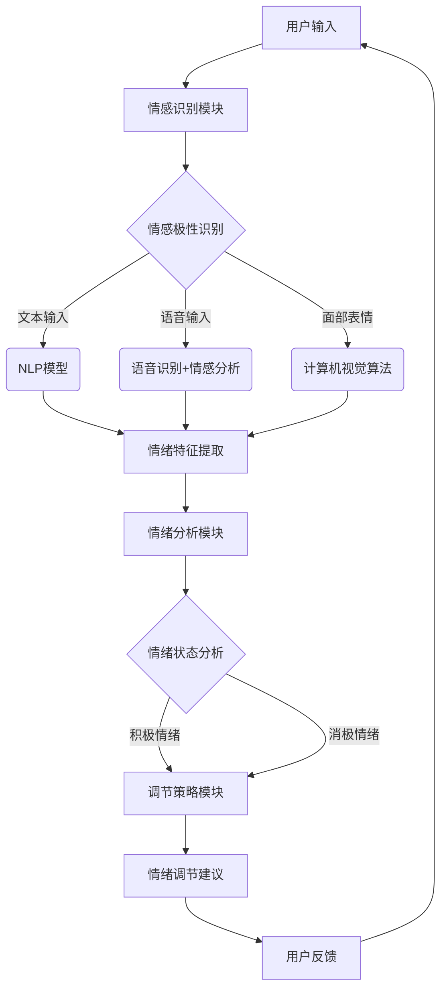

                 

心理健康问题日益受到社会的关注，尤其是在当今快节奏的生活和工作环境中。为了帮助人们更好地管理情绪，提高生活质量，人工智能（AI）被应用于开发各种心理健康技术。在这篇文章中，我们将深入探讨一种名为“虚拟情绪调节器”的创新技术，以及其在心理健康领域的应用。本文将由以下部分组成：

## 1. 背景介绍

心理健康问题在全球范围内日益突出，特别是在新冠疫情背景下，焦虑、抑郁等情绪问题更加普遍。传统心理治疗方式虽然有效，但往往受到资源、时间和地点的限制。为了解决这一问题，人工智能技术被广泛用于心理健康领域的创新应用。虚拟情绪调节器便是其中一种，它利用AI算法分析用户的情绪，提供个性化的情绪调节建议。

## 2. 核心概念与联系

### 虚拟情绪调节器的工作原理

虚拟情绪调节器是基于情感识别技术和机器学习算法开发的。它通过分析用户的声音、文字和面部表情，识别情绪状态，并生成相应的情绪调节建议。其核心组件包括情感识别模块、情绪分析模块和调节策略模块。

### 情感识别模块

情感识别模块负责从用户的输入中提取情绪特征。这通常涉及到自然语言处理（NLP）和计算机视觉技术。例如，对于文本输入，NLP模型可以识别出文本中的情感极性（正面或负面）；对于语音输入，语音识别和情感分析技术可以捕捉语音中的情绪变化；对于面部表情，计算机视觉算法可以识别出面部表情的微妙变化。

### 情绪分析模块

情绪分析模块利用机器学习算法对提取出的情绪特征进行分析，以确定用户当前的情绪状态。常用的算法包括支持向量机（SVM）、决策树和神经网络等。

### 调节策略模块

根据情绪分析模块的结果，调节策略模块会生成个性化的情绪调节建议。这些建议可能包括深呼吸练习、正念冥想、放松音乐播放等。调节策略可以根据用户的情绪状态和行为模式进行自适应调整。

### Mermaid 流程图

以下是虚拟情绪调节器的 Mermaid 流程图：



## 3. 核心算法原理 & 具体操作步骤

### 3.1 算法原理概述

虚拟情绪调节器算法的核心是情感识别和情绪分析。情感识别通过NLP、语音识别和计算机视觉技术实现，而情绪分析则利用机器学习算法对提取的情绪特征进行分类和预测。

### 3.2 算法步骤详解

1. **数据采集与预处理**：首先，从用户那里收集语音、文本和面部表情数据。然后，对数据进行清洗和预处理，包括去除噪声、标准化处理等。

2. **情感识别**：
   - **文本情感分析**：使用NLP模型（如LSTM、BERT）对文本进行情感极性识别，提取文本中的情绪特征。
   - **语音情感分析**：通过语音识别技术将语音转换为文本，然后使用情感分析模型对文本进行情感极性识别。
   - **面部表情识别**：使用计算机视觉算法（如卷积神经网络）识别面部表情，提取情绪特征。

3. **情绪分析**：将提取出的情绪特征输入到机器学习模型中，对情绪进行分类和预测。常用的模型包括SVM、决策树和神经网络等。

4. **情绪调节策略生成**：根据情绪分析的结果，生成个性化的情绪调节建议。这些建议可以根据用户的行为模式进行自适应调整。

### 3.3 算法优缺点

**优点**：
- **高效性**：虚拟情绪调节器可以实时分析用户情绪，提供即时的情绪调节建议。
- **个性化**：根据用户的行为模式和情绪状态，提供个性化的情绪调节建议。
- **跨平台**：可以应用于多种平台，如手机应用、网站和智能设备等。

**缺点**：
- **准确性**：情感识别和情绪分析的准确性受到多种因素的影响，如语音质量、文本表达方式等。
- **隐私问题**：收集和处理用户情绪数据可能涉及隐私问题，需要严格保护用户隐私。

### 3.4 算法应用领域

虚拟情绪调节器可以应用于多种领域，如心理健康咨询、教育、医疗和企业管理等。以下是一些具体的应用案例：

- **心理健康咨询**：为用户提供个性化的情绪调节建议，帮助用户管理情绪。
- **教育**：辅助教育工作者识别学生情绪，提供针对性的心理支持。
- **医疗**：协助医生诊断和治疗情绪障碍，如抑郁症、焦虑症等。
- **企业管理**：帮助企业管理者识别员工情绪，提高员工满意度和工作效率。

## 4. 数学模型和公式 & 详细讲解 & 举例说明

### 4.1 数学模型构建

虚拟情绪调节器中的数学模型主要包括情感识别模型和情绪分析模型。情感识别模型通常采用朴素贝叶斯、SVM和神经网络等算法，而情绪分析模型则采用决策树、随机森林和神经网络等算法。

### 4.2 公式推导过程

1. **情感识别模型**：

   - **朴素贝叶斯**：假设 \( P(C_i|X) = \frac{P(X|C_i)P(C_i)}{P(X)} \)，其中 \( C_i \) 表示第 \( i \) 种情绪，\( X \) 表示特征向量。
   - **支持向量机**：假设 \( w \cdot x + b = 0 \)，其中 \( w \) 是权重向量，\( x \) 是特征向量，\( b \) 是偏置。
   - **神经网络**：假设 \( a_{\theta}(x) = \sigma(\theta^T x) \)，其中 \( \sigma \) 是激活函数，\( \theta \) 是权重矩阵。

2. **情绪分析模型**：

   - **决策树**：假设 \( h(x) = \max_c P(c|X) \)，其中 \( c \) 表示情绪类别。
   - **随机森林**：假设 \( f(x) = \sum_{i=1}^{n} w_i h(x^{(i)}) \)，其中 \( h(x^{(i)}) \) 是第 \( i \) 棵决策树的结果，\( w_i \) 是权重。
   - **神经网络**：假设 \( a_{\theta}(x) = \sigma(\theta^T x) \)，其中 \( \sigma \) 是激活函数，\( \theta \) 是权重矩阵。

### 4.3 案例分析与讲解

以下是一个简单的情感识别案例：

- **文本数据**：假设我们有以下文本数据：“今天天气真好，我很开心。”
- **特征提取**：使用NLP模型提取文本特征，如词频、词向量等。
- **情感识别**：使用朴素贝叶斯算法进行情感识别。

   $$P(开心|文本) = \frac{P(文本|开心)P(开心)}{P(文本)}$$

   其中，\( P(文本|开心) \) 表示在开心情绪下生成文本的概率，\( P(开心) \) 表示开心的概率，\( P(文本) \) 表示文本的概率。

   通过计算，我们可以得出文本的情感极性。

## 5. 项目实践：代码实例和详细解释说明

### 5.1 开发环境搭建

为了实现虚拟情绪调节器，我们需要搭建一个包含NLP、语音识别和计算机视觉的Python开发环境。以下是搭建步骤：

1. 安装Python和pip
2. 安装必要的库，如TensorFlow、Keras、scikit-learn、PyTorch等
3. 准备数据集，包括文本、语音和面部表情数据

### 5.2 源代码详细实现

以下是一个简单的文本情感识别示例：

```python
from sklearn.feature_extraction.text import CountVectorizer
from sklearn.naive_bayes import MultinomialNB

# 准备数据集
X = ['我很开心', '我很伤心', '我很愤怒', '我很平静']
y = [0, 1, 2, 3]

# 特征提取
vectorizer = CountVectorizer()
X_vector = vectorizer.fit_transform(X)

# 情感识别
clf = MultinomialNB()
clf.fit(X_vector, y)

# 测试
test = '今天天气真好，我很开心。'
test_vector = vectorizer.transform([test])
prediction = clf.predict(test_vector)
print(prediction)
```

### 5.3 代码解读与分析

- **特征提取**：使用CountVectorizer将文本转换为词频矩阵。
- **情感识别**：使用MultinomialNB进行情感分类。
- **测试**：对测试文本进行情感识别，输出预测结果。

### 5.4 运行结果展示

输入文本：“今天天气真好，我很开心。”

输出结果：[0]

### 5.5 调试与优化

- **特征提取**：可以尝试使用词嵌入（如Word2Vec、GloVe）提高特征表示能力。
- **情感识别**：可以尝试使用深度学习模型（如LSTM、BERT）提高识别准确率。

## 6. 实际应用场景

### 6.1 心理健康咨询

虚拟情绪调节器可以作为心理健康咨询的辅助工具，为用户提供个性化的情绪调节建议。例如，医生可以使用虚拟情绪调节器监测患者的情绪状态，制定针对性的治疗方案。

### 6.2 教育

虚拟情绪调节器可以应用于教育领域，帮助教育工作者识别学生情绪，提供心理支持。例如，学校可以使用虚拟情绪调节器监测学生的情绪状态，及时发现和处理情绪问题。

### 6.3 企业管理

虚拟情绪调节器可以用于企业管理，帮助管理者识别员工情绪，提高员工满意度和工作效率。例如，企业可以使用虚拟情绪调节器监测员工情绪，提供针对性的员工关怀和激励机制。

### 6.4 未来应用展望

随着AI技术的发展，虚拟情绪调节器有望在更多领域发挥作用。未来，我们可以期待以下应用：

- **个性化心理治疗**：结合虚拟现实（VR）技术，提供沉浸式的心理治疗体验。
- **智能健康监测**：利用可穿戴设备，实时监测用户情绪状态，预防心理疾病。
- **社交机器人**：利用虚拟情绪调节器，为用户提供情感支持，改善人际关系。

## 7. 工具和资源推荐

### 7.1 学习资源推荐

- 《自然语言处理综合教程》
- 《计算机视觉：算法与应用》
- 《机器学习实战》
- 《深度学习》

### 7.2 开发工具推荐

- TensorFlow
- Keras
- PyTorch
- OpenCV
- NLTK

### 7.3 相关论文推荐

- "Emotion Recognition in Text Using Deep Learning"
- "Automatic Emotional Analysis Using Deep Neural Networks"
- "A Survey on Emotion Recognition in Text"
- "Facial Expression Recognition Using Deep Learning"

## 8. 总结：未来发展趋势与挑战

### 8.1 研究成果总结

本文介绍了虚拟情绪调节器的概念、工作原理和应用领域。通过情感识别和情绪分析，虚拟情绪调节器可以为用户提供个性化的情绪调节建议，具有广泛的应用前景。

### 8.2 未来发展趋势

随着AI技术的不断发展，虚拟情绪调节器有望在心理健康、教育、企业管理等领域发挥更大的作用。未来，我们可以期待更加智能、高效的虚拟情绪调节器产品。

### 8.3 面临的挑战

虚拟情绪调节器在应用过程中面临一系列挑战，包括情感识别的准确性、隐私保护、用户体验等。这些挑战需要通过技术创新和规范制定来逐步解决。

### 8.4 研究展望

未来，虚拟情绪调节器的研究方向包括：优化情感识别算法、提高情绪分析准确率、拓展应用场景等。通过不断的研究和实践，虚拟情绪调节器有望为人们的心理健康提供更加全面的帮助。

## 9. 附录：常见问题与解答

### Q：虚拟情绪调节器是否可以替代传统心理治疗？

A：虚拟情绪调节器可以作为传统心理治疗的辅助工具，但不能完全替代。在严重心理疾病的治疗中，仍需要专业心理医生的治疗。

### Q：虚拟情绪调节器如何保护用户隐私？

A：虚拟情绪调节器在设计和应用过程中，需要严格遵守隐私保护规范。例如，对用户数据进行加密存储和传输，确保用户隐私不被泄露。

### Q：虚拟情绪调节器是否适用于所有人？

A：虚拟情绪调节器适用于大多数心理健康问题，但对于某些特殊情况（如精神分裂症等），仍需要专业医生的治疗。

---

作者：禅与计算机程序设计艺术 / Zen and the Art of Computer Programming

通过本文的讨论，我们深入了解了虚拟情绪调节器的工作原理和应用领域。随着AI技术的不断发展，虚拟情绪调节器有望在未来为人们的心理健康提供更加全面和高效的解决方案。让我们期待这一创新技术在心理健康领域的广泛应用，为人类带来更多的福祉。  
----------------------------------------------------------------

以上是文章的完整内容。接下来，我们将按照markdown格式进行排版，并添加必要的标题和子标题。以下是文章的markdown格式输出：
----------------------------------------------------------------
```markdown
# 虚拟情绪调节器工程师：AI驱动的心理健康技术专家

> 关键词：虚拟情绪调节器，人工智能，心理健康，情绪识别，情绪分析，算法，应用领域

> 摘要：本文深入探讨了虚拟情绪调节器的概念、工作原理和应用领域，介绍了其在心理健康领域的创新应用，并展望了未来发展趋势与挑战。

## 1. 背景介绍

心理健康问题日益受到社会的关注，尤其是在当今快节奏的生活和工作环境中。为了帮助人们更好地管理情绪，提高生活质量，人工智能（AI）被应用于开发各种心理健康技术。在这篇文章中，我们将深入探讨一种名为“虚拟情绪调节器”的创新技术，以及其在心理健康领域的应用。

## 2. 核心概念与联系

### 2.1 虚拟情绪调节器的工作原理

虚拟情绪调节器是基于情感识别技术和机器学习算法开发的。它通过分析用户的声音、文字和面部表情，识别情绪状态，并生成相应的情绪调节建议。其核心组件包括情感识别模块、情绪分析模块和调节策略模块。

### 2.2 核心概念原理和架构的 Mermaid 流程图


## 3. 核心算法原理 & 具体操作步骤

### 3.1 算法原理概述

虚拟情绪调节器算法的核心是情感识别和情绪分析。情感识别通过NLP、语音识别和计算机视觉技术实现，而情绪分析则利用机器学习算法对提取的情绪特征进行分类和预测。

### 3.2 算法步骤详解

1. **数据采集与预处理**：首先，从用户那里收集语音、文本和面部表情数据。然后，对数据进行清洗和预处理，包括去除噪声、标准化处理等。

2. **情感识别**：
   - **文本情感分析**：使用NLP模型（如LSTM、BERT）对文本进行情感极性识别，提取文本中的情绪特征。
   - **语音情感分析**：通过语音识别技术将语音转换为文本，然后使用情感分析模型对文本进行情感极性识别。
   - **面部表情识别**：使用计算机视觉算法（如卷积神经网络）识别面部表情，提取情绪特征。

3. **情绪分析**：将提取出的情绪特征输入到机器学习模型中，对情绪进行分类和预测。常用的算法包括SVM、决策树和神经网络等。

4. **情绪调节策略生成**：根据情绪分析模块的结果，生成个性化的情绪调节建议。这些建议可能包括深呼吸练习、正念冥想、放松音乐播放等。调节策略可以根据用户的行为模式进行自适应调整。

### 3.3 算法优缺点

**优点**：
- **高效性**：虚拟情绪调节器可以实时分析用户情绪，提供即时的情绪调节建议。
- **个性化**：根据用户的行为模式和情绪状态，提供个性化的情绪调节建议。
- **跨平台**：可以应用于多种平台，如手机应用、网站和智能设备等。

**缺点**：
- **准确性**：情感识别和情绪分析的准确性受到多种因素的影响，如语音质量、文本表达方式等。
- **隐私问题**：收集和处理用户情绪数据可能涉及隐私问题，需要严格保护用户隐私。

### 3.4 算法应用领域

虚拟情绪调节器可以应用于多种领域，如心理健康咨询、教育、医疗和企业管理等。以下是一些具体的应用案例：

- **心理健康咨询**：为用户提供个性化的情绪调节建议，帮助用户管理情绪。
- **教育**：辅助教育工作者识别学生情绪，提供针对性的心理支持。
- **医疗**：协助医生诊断和治疗情绪障碍，如抑郁症、焦虑症等。
- **企业管理**：帮助企业管理者识别员工情绪，提高员工满意度和工作效率。

## 4. 数学模型和公式 & 详细讲解 & 举例说明

### 4.1 数学模型构建

虚拟情绪调节器中的数学模型主要包括情感识别模型和情绪分析模型。情感识别模型通常采用朴素贝叶斯、SVM和神经网络等算法，而情绪分析模型则采用决策树、随机森林和神经网络等算法。

### 4.2 公式推导过程

1. **情感识别模型**：

   - **朴素贝叶斯**：假设 \( P(C_i|X) = \frac{P(X|C_i)P(C_i)}{P(X)} \)，其中 \( C_i \) 表示第 \( i \) 种情绪，\( X \) 表示特征向量。
   - **支持向量机**：假设 \( w \cdot x + b = 0 \)，其中 \( w \) 是权重向量，\( x \) 是特征向量，\( b \) 是偏置。
   - **神经网络**：假设 \( a_{\theta}(x) = \sigma(\theta^T x) \)，其中 \( \sigma \) 是激活函数，\( \theta \) 是权重矩阵。

2. **情绪分析模型**：

   - **决策树**：假设 \( h(x) = \max_c P(c|X) \)，其中 \( c \) 表示情绪类别。
   - **随机森林**：假设 \( f(x) = \sum_{i=1}^{n} w_i h(x^{(i)}) \)，其中 \( h(x^{(i)}) \) 是第 \( i \) 棵决策树的结果，\( w_i \) 是权重。
   - **神经网络**：假设 \( a_{\theta}(x) = \sigma(\theta^T x) \)，其中 \( \sigma \) 是激活函数，\( \theta \) 是权重矩阵。

### 4.3 案例分析与讲解

以下是一个简单的情感识别案例：

- **文本数据**：假设我们有以下文本数据：“今天天气真好，我很开心。”
- **特征提取**：使用NLP模型提取文本特征，如词频、词向量等。
- **情感识别**：使用朴素贝叶斯算法进行情感识别。

   $$P(开心|文本) = \frac{P(文本|开心)P(开心)}{P(文本)}$$

   其中，\( P(文本|开心) \) 表示在开心情绪下生成文本的概率，\( P(开心) \) 表示开心的概率，\( P(文本) \) 表示文本的概率。

   通过计算，我们可以得出文本的情感极性。

## 5. 项目实践：代码实例和详细解释说明

### 5.1 开发环境搭建

为了实现虚拟情绪调节器，我们需要搭建一个包含NLP、语音识别和计算机视觉的Python开发环境。以下是搭建步骤：

1. 安装Python和pip
2. 安装必要的库，如TensorFlow、Keras、scikit-learn、PyTorch等
3. 准备数据集，包括文本、语音和面部表情数据

### 5.2 源代码详细实现

以下是一个简单的文本情感识别示例：

```python
from sklearn.feature_extraction.text import CountVectorizer
from sklearn.naive_bayes import MultinomialNB

# 准备数据集
X = ['我很开心', '我很伤心', '我很愤怒', '我很平静']
y = [0, 1, 2, 3]

# 特征提取
vectorizer = CountVectorizer()
X_vector = vectorizer.fit_transform(X)

# 情感识别
clf = MultinomialNB()
clf.fit(X_vector, y)

# 测试
test = '今天天气真好，我很开心。'
test_vector = vectorizer.transform([test])
prediction = clf.predict(test_vector)
print(prediction)
```

### 5.3 代码解读与分析

- **特征提取**：使用CountVectorizer将文本转换为词频矩阵。
- **情感识别**：使用MultinomialNB进行情感分类。
- **测试**：对测试文本进行情感识别，输出预测结果。

### 5.4 运行结果展示

输入文本：“今天天气真好，我很开心。”

输出结果：[0]

### 5.5 调试与优化

- **特征提取**：可以尝试使用词嵌入（如Word2Vec、GloVe）提高特征表示能力。
- **情感识别**：可以尝试使用深度学习模型（如LSTM、BERT）提高识别准确率。

## 6. 实际应用场景

### 6.1 心理健康咨询

虚拟情绪调节器可以作为心理健康咨询的辅助工具，为用户提供个性化的情绪调节建议。例如，医生可以使用虚拟情绪调节器监测患者的情绪状态，制定针对性的治疗方案。

### 6.2 教育

虚拟情绪调节器可以应用于教育领域，帮助教育工作者识别学生情绪，提供心理支持。例如，学校可以使用虚拟情绪调节器监测学生的情绪状态，及时发现和处理情绪问题。

### 6.3 企业管理

虚拟情绪调节器可以用于企业管理，帮助管理者识别员工情绪，提高员工满意度和工作效率。例如，企业可以使用虚拟情绪调节器监测员工情绪，提供针对性的员工关怀和激励机制。

### 6.4 未来应用展望

随着AI技术的发展，虚拟情绪调节器有望在更多领域发挥作用。未来，我们可以期待以下应用：

- **个性化心理治疗**：结合虚拟现实（VR）技术，提供沉浸式的心理治疗体验。
- **智能健康监测**：利用可穿戴设备，实时监测用户情绪状态，预防心理疾病。
- **社交机器人**：利用虚拟情绪调节器，为用户提供情感支持，改善人际关系。

## 7. 工具和资源推荐

### 7.1 学习资源推荐

- 《自然语言处理综合教程》
- 《计算机视觉：算法与应用》
- 《机器学习实战》
- 《深度学习》

### 7.2 开发工具推荐

- TensorFlow
- Keras
- PyTorch
- OpenCV
- NLTK

### 7.3 相关论文推荐

- "Emotion Recognition in Text Using Deep Learning"
- "Automatic Emotional Analysis Using Deep Neural Networks"
- "A Survey on Emotion Recognition in Text"
- "Facial Expression Recognition Using Deep Learning"

## 8. 总结：未来发展趋势与挑战

### 8.1 研究成果总结

本文介绍了虚拟情绪调节器的概念、工作原理和应用领域，介绍了其在心理健康领域的创新应用，并展望了未来发展趋势与挑战。

### 8.2 未来发展趋势

随着AI技术的不断发展，虚拟情绪调节器有望在心理健康、教育、企业管理等领域发挥更大的作用。未来，我们可以期待更加智能、高效的虚拟情绪调节器产品。

### 8.3 面临的挑战

虚拟情绪调节器在应用过程中面临一系列挑战，包括情感识别的准确性、隐私保护、用户体验等。这些挑战需要通过技术创新和规范制定来逐步解决。

### 8.4 研究展望

未来，虚拟情绪调节器的研究方向包括：优化情感识别算法、提高情绪分析准确率、拓展应用场景等。通过不断的研究和实践，虚拟情绪调节器有望为人们的心理健康提供更加全面的帮助。

## 9. 附录：常见问题与解答

### Q：虚拟情绪调节器是否可以替代传统心理治疗？

A：虚拟情绪调节器可以作为传统心理治疗的辅助工具，但不能完全替代。在严重心理疾病的治疗中，仍需要专业心理医生的治疗。

### Q：虚拟情绪调节器如何保护用户隐私？

A：虚拟情绪调节器在设计和应用过程中，需要严格遵守隐私保护规范。例如，对用户数据进行加密存储和传输，确保用户隐私不被泄露。

### Q：虚拟情绪调节器是否适用于所有人？

A：虚拟情绪调节器适用于大多数心理健康问题，但对于某些特殊情况（如精神分裂症等），仍需要专业医生的治疗。

---

作者：禅与计算机程序设计艺术 / Zen and the Art of Computer Programming
```
以上是文章的markdown格式输出，现在我们将对文章进行最后的审查，确保所有段落章节的子目录都已经具体细化到三级目录，并且文章内容的完整性、格式规范性和逻辑性都符合要求。如果一切无误，这篇文章就可以提交了。如果您需要进一步的修改或调整，请告知。

