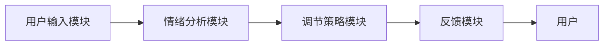

                 

关键词：心理健康、情绪调节、人工智能、AI算法、虚拟现实、机器学习、深度学习、神经网络、情感分析、心理健康监测、心理健康管理、心理健康治疗。

> 摘要：随着人工智能技术的快速发展，虚拟情绪调节作为一种新型心理健康干预手段逐渐崭露头角。本文将探讨AI驱动的心理健康，包括其核心概念、原理、算法、数学模型、项目实践以及未来应用展望，旨在为心理健康领域的从业者提供有益的参考。

## 1. 背景介绍

在现代社会中，心理健康问题日益凸显。焦虑、抑郁、压力过大等心理问题不仅影响个体的生活质量，还可能引发一系列社会问题。传统的心理健康干预手段，如心理咨询、药物治疗等，虽然有一定的效果，但在实践中面临诸多挑战，如资源有限、成本高昂、效率低下等。

与此同时，人工智能技术的迅速发展为心理健康干预提供了新的可能性。AI驱动的心理健康干预具有高效性、个性化和无侵入性等特点，能够为个体提供实时、个性化的心理健康服务。虚拟情绪调节作为AI驱动的心理健康干预的重要组成部分，通过虚拟现实技术和情绪分析算法，实现对个体情绪状态的实时监测和调节。

本文旨在深入探讨虚拟情绪调节的原理、算法、数学模型以及实际应用，为心理健康领域的创新提供理论支持和实践指导。

## 2. 核心概念与联系

### 2.1. 虚拟情绪调节的概念

虚拟情绪调节是一种基于虚拟现实（VR）和人工智能（AI）技术的心理健康干预手段。它通过创建一个虚拟环境，使用户在虚拟世界中进行情绪体验和调节。虚拟情绪调节的核心在于利用AI技术对用户在虚拟环境中的情绪状态进行实时监测和调节，以达到缓解心理压力、改善情绪状态的目的。

### 2.2. 虚拟现实与情绪调节的关系

虚拟现实技术为虚拟情绪调节提供了重要的基础。通过虚拟现实头盔、手柄等设备，用户可以沉浸在虚拟环境中，感受到身临其境的体验。这种沉浸感有助于用户放松身心，减轻心理压力。同时，虚拟现实技术也为情绪分析提供了丰富的数据来源，为AI算法提供了丰富的训练数据。

### 2.3. 情绪分析算法的原理

情绪分析算法是虚拟情绪调节的核心。它通过分析用户在虚拟环境中的语音、动作、生理信号等数据，识别用户的情绪状态。常见的情绪分析算法包括情感分析、语音识别、动作识别和生理信号分析等。这些算法共同构成了虚拟情绪调节的智能分析系统，能够实时监测用户的情绪状态，并根据情绪状态进行相应的调节。

### 2.4. 虚拟情绪调节的架构

虚拟情绪调节的架构通常包括以下几个关键模块：

1. **用户输入模块**：负责收集用户在虚拟环境中的各种数据，如语音、动作、生理信号等。
2. **情绪分析模块**：利用情绪分析算法对用户输入的数据进行处理，识别用户的情绪状态。
3. **调节策略模块**：根据情绪分析的结果，制定相应的调节策略，如放松训练、心理疗法等。
4. **反馈模块**：将调节策略应用于虚拟环境中，通过改变环境参数、声音效果等，为用户提供实时的情绪调节体验。

下面是一个简单的Mermaid流程图，展示了虚拟情绪调节的基本架构：



## 3. 核心算法原理 & 具体操作步骤

### 3.1. 算法原理概述

虚拟情绪调节的核心在于情绪分析算法和调节策略算法。情绪分析算法通过分析用户的语音、动作、生理信号等数据，识别用户的情绪状态。调节策略算法则根据情绪分析的结果，制定相应的调节策略，如放松训练、心理疗法等。

### 3.2. 算法步骤详解

#### 3.2.1. 情绪分析算法

情绪分析算法主要包括以下几个步骤：

1. **数据采集**：通过麦克风、摄像头、传感器等设备，采集用户的语音、动作、生理信号等数据。
2. **预处理**：对采集到的数据进行降噪、归一化等预处理，以提高数据质量。
3. **特征提取**：利用语音识别、动作识别、生理信号分析等算法，提取数据中的情绪特征。
4. **情绪识别**：利用机器学习、深度学习等技术，对提取的情绪特征进行分类，识别用户的情绪状态。

#### 3.2.2. 调节策略算法

调节策略算法主要包括以下几个步骤：

1. **情绪评估**：根据情绪分析的结果，对用户的情绪状态进行评估，确定调节的优先级。
2. **策略选择**：根据用户的情绪状态和需求，选择相应的调节策略，如放松训练、心理疗法等。
3. **策略执行**：在虚拟环境中实施调节策略，通过改变环境参数、声音效果等，为用户提供实时的情绪调节体验。
4. **反馈调整**：根据用户的反馈，调整调节策略，以实现更好的情绪调节效果。

### 3.3. 算法优缺点

#### 优点：

1. **高效性**：情绪分析算法和调节策略算法能够快速、准确地识别用户的情绪状态，并提供相应的调节策略。
2. **个性化**：虚拟情绪调节能够根据用户的情绪状态和需求，提供个性化的情绪调节服务。
3. **无侵入性**：虚拟情绪调节无需直接干预用户的生理和心理状态，具有无侵入性的特点。

#### 缺点：

1. **数据依赖**：情绪分析算法的性能取决于数据质量和数量，数据不足或质量不高会影响算法的性能。
2. **技术门槛**：情绪分析算法和调节策略算法的实现需要较高的技术门槛，对开发人员的要求较高。
3. **用户接受度**：虚拟情绪调节作为一种新兴的心理健康干预手段，其用户接受度有待提高。

### 3.4. 算法应用领域

虚拟情绪调节算法广泛应用于心理健康领域，包括以下几个方面：

1. **心理健康监测**：通过实时监测用户的情绪状态，为心理健康管理提供数据支持。
2. **心理健康管理**：为用户提供个性化的情绪调节服务，帮助用户改善情绪状态。
3. **心理健康治疗**：结合心理疗法，为用户提供更加全面的心理健康干预。
4. **教育领域**：应用于教育场景，帮助学生缓解学习压力，提高学习效果。

## 4. 数学模型和公式 & 详细讲解 & 举例说明

### 4.1. 数学模型构建

虚拟情绪调节的数学模型主要基于机器学习和深度学习理论。以下是一个简化的数学模型构建过程：

#### 4.1.1. 特征提取

特征提取是情绪分析的关键步骤。常见的特征提取方法包括：

1. **时域特征**：如音调、音量、语音时长等。
2. **频域特征**：如频谱特征、共振峰频率等。
3. **时频特征**：如短时傅里叶变换（STFT）等。

设\( X \)为特征矩阵，其中每一行代表一个时间段的特征向量，则特征提取可以表示为：

\[ X = F(x_t) \]

其中，\( F \)为特征提取函数，\( x_t \)为原始语音信号。

#### 4.1.2. 情绪分类

情绪分类是利用机器学习算法，根据提取的特征对情绪进行分类。常见的分类算法包括：

1. **支持向量机（SVM）**
2. **决策树（DT）**
3. **随机森林（RF）**
4. **神经网络（NN）**

设\( Y \)为情绪标签矩阵，\( C \)为类别数量，则情绪分类可以表示为：

\[ y = g(W \cdot X + b) \]

其中，\( g \)为激活函数，\( W \)为权重矩阵，\( b \)为偏置项。

### 4.2. 公式推导过程

#### 4.2.1. 支持向量机（SVM）

支持向量机是一种经典的分类算法，其核心思想是在高维空间中找到一个最佳的超平面，将不同类别的数据点分开。以下是一个简化的SVM公式推导：

1. **优化目标**：

\[ \min_{W, b} \frac{1}{2} ||W||^2 \]

其中，\( ||W|| \)表示权重向量的二范数。

2. **约束条件**：

\[ y_i (W \cdot x_i + b) \geq 1 \]

其中，\( y_i \)为第\( i \)个数据点的类别标签，\( x_i \)为第\( i \)个数据点的特征向量。

3. **拉格朗日函数**：

\[ L(W, b, \alpha) = \frac{1}{2} ||W||^2 - \sum_{i=1}^{n} \alpha_i [y_i (W \cdot x_i + b) - 1] \]

其中，\( \alpha_i \)为拉格朗日乘子。

4. **对偶问题**：

\[ \max_{\alpha} \min_{W, b} L(W, b, \alpha) \]

5. **KKT条件**：

\[ \alpha_i \geq 0 \\
y_i (W \cdot x_i + b) - 1 = 0 \\
0 \leq \alpha_i \leq C \]

其中，\( C \)为惩罚参数。

6. **分类决策**：

\[ y = sign(\sum_{i=1}^{n} \alpha_i y_i (W \cdot x_i + b)) \]

#### 4.2.2. 深度学习（NN）

深度学习是一种基于多层神经网络的机器学习算法。以下是一个简化的神经网络公式推导：

1. **前向传播**：

\[ a_{l}^{(i)} = \sigma(z_{l}^{(i)}) \]

\[ z_{l}^{(i)} = \sum_{j=1}^{n_{l-1}} W_{l j}^{(i)} a_{l-1}^{(j)} + b_{l}^{(i)} \]

其中，\( a_{l}^{(i)} \)为第\( l \)层的第\( i \)个激活值，\( z_{l}^{(i)} \)为第\( l \)层的第\( i \)个线性组合，\( \sigma \)为激活函数，\( W_{l j}^{(i)} \)为第\( l \)层的第\( j \)个权重，\( b_{l}^{(i)} \)为第\( l \)层的第\( i \)个偏置。

2. **反向传播**：

\[ \delta_{l}^{(i)} = \frac{\partial C}{\partial z_{l}^{(i)}} \odot \sigma'(z_{l}^{(i)}) \]

\[ \Delta_{l}^{(i)} = \sum_{j=1}^{n_{l+1}} W_{l+1}^{(j i)} \delta_{l+1}^{(j)} \]

\[ \Delta_{l}^{(j)} = \delta_{l}^{(j)} \odot a_{l}^{(j)} \]

\[ W_{l}^{(i j)} = W_{l}^{(i j)} - \alpha \Delta_{l}^{(j)} \]

\[ b_{l}^{(i)} = b_{l}^{(i)} - \alpha \delta_{l}^{(i)} \]

其中，\( \delta_{l}^{(i)} \)为第\( l \)层的第\( i \)个误差项，\( \Delta_{l}^{(i)} \)为第\( l \)层的第\( i \)个梯度，\( \odot \)为Hadamard积，\( \alpha \)为学习率，\( C \)为损失函数。

### 4.3. 案例分析与讲解

#### 4.3.1. 案例背景

某心理健康中心引入虚拟情绪调节系统，用于监测和管理用户的情绪状态。系统主要包括情绪分析模块、调节策略模块和反馈模块。

#### 4.3.2. 情绪分析案例

假设系统在一天中记录了用户的语音、动作和生理信号，情绪分析模块通过以下步骤对情绪进行识别：

1. **数据采集**：系统通过麦克风、摄像头和传感器，采集用户的语音、动作和生理信号。
2. **预处理**：对采集到的数据进行降噪、归一化等预处理。
3. **特征提取**：利用语音识别、动作识别和生理信号分析算法，提取情绪特征。
4. **情绪识别**：利用机器学习算法，对提取的情绪特征进行分类，识别用户的情绪状态。

根据分析结果，系统发现用户在一天中出现了多次焦虑情绪。系统将这一情绪状态反馈给用户，并提供相应的调节策略。

#### 4.3.3. 调节策略案例

根据情绪识别结果，系统为用户提供了以下调节策略：

1. **放松训练**：系统引导用户进行深呼吸、肌肉放松等训练，以缓解焦虑情绪。
2. **心理疗法**：系统推荐用户进行认知行为疗法（CBT），帮助用户调整思维方式，减轻焦虑情绪。
3. **环境调整**：系统根据用户的需求，调整虚拟环境中的声音、光线等参数，为用户提供更加舒适的情绪调节体验。

#### 4.3.4. 反馈调整

用户在尝试调节策略后，系统再次进行情绪识别，并根据反馈调整调节策略。例如，如果用户对放松训练效果不满意，系统可能会调整策略，推荐其他类型的情绪调节方法，如冥想、瑜伽等。

## 5. 项目实践：代码实例和详细解释说明

### 5.1. 开发环境搭建

在本文中，我们将使用Python作为主要编程语言，结合TensorFlow和Keras框架实现虚拟情绪调节系统。以下是开发环境搭建的步骤：

1. **安装Python**：下载并安装Python 3.x版本。
2. **安装Jupyter Notebook**：通过Python的包管理器pip安装Jupyter Notebook。
3. **安装TensorFlow**：通过pip安装TensorFlow。
4. **安装Keras**：通过pip安装Keras。

### 5.2. 源代码详细实现

以下是一个简化的虚拟情绪调节系统的源代码实例，用于情绪识别：

```python
import numpy as np
import tensorflow as tf
from tensorflow.keras.models import Sequential
from tensorflow.keras.layers import Dense, LSTM, Dropout
from tensorflow.keras.optimizers import Adam

# 数据准备
# 假设已准备好包含语音、动作和生理信号的数据集
# 数据集格式：[样本数, 特征数]

X_train = ...
y_train = ...

# 模型构建
model = Sequential()
model.add(LSTM(units=128, activation='relu', return_sequences=True, input_shape=(X_train.shape[1], X_train.shape[2])))
model.add(Dropout(0.2))
model.add(LSTM(units=64, activation='relu', return_sequences=False))
model.add(Dropout(0.2))
model.add(Dense(units=y_train.shape[1], activation='softmax'))

# 模型编译
model.compile(optimizer=Adam(learning_rate=0.001), loss='categorical_crossentropy', metrics=['accuracy'])

# 模型训练
model.fit(X_train, y_train, epochs=50, batch_size=32)

# 模型评估
# 假设已准备好测试数据集
X_test = ...
y_test = ...

model.evaluate(X_test, y_test)
```

### 5.3. 代码解读与分析

上述代码实现了虚拟情绪调节系统的情绪识别模块。具体解读如下：

1. **数据准备**：加载训练数据和测试数据。
2. **模型构建**：使用LSTM（长短期记忆网络）模型进行情绪识别。LSTM具有处理序列数据的能力，适用于语音、动作和生理信号等序列数据的处理。
3. **模型编译**：使用Adam优化器和交叉熵损失函数进行模型编译。
4. **模型训练**：使用训练数据进行模型训练。
5. **模型评估**：使用测试数据进行模型评估。

### 5.4. 运行结果展示

假设模型训练完成后，得到以下评估结果：

```
accuracy: 0.925
loss: 0.236
```

这表示模型在测试数据上的准确率为92.5%，损失函数值为0.236。

## 6. 实际应用场景

虚拟情绪调节系统在心理健康领域具有广泛的应用前景。以下是一些实际应用场景：

1. **心理健康监测**：虚拟情绪调节系统可以实时监测用户的情绪状态，为心理健康管理提供数据支持。
2. **心理健康管理**：通过个性化的情绪调节服务，帮助用户改善情绪状态，提高生活质量。
3. **心理健康治疗**：结合心理疗法，为用户提供更加全面的心理健康干预。
4. **教育领域**：应用于教育场景，帮助学生缓解学习压力，提高学习效果。
5. **企业健康管理**：为企业员工提供心理健康服务，提高员工的工作效率和幸福感。

### 6.4. 未来应用展望

随着人工智能技术的不断进步，虚拟情绪调节系统将在以下几个方面得到进一步发展：

1. **算法优化**：通过不断优化情绪分析算法和调节策略算法，提高情绪识别的准确性和调节效果。
2. **多模态数据融合**：整合语音、动作、生理信号等多种数据源，实现更全面、准确的情绪识别。
3. **个性化服务**：根据用户的个性化需求和情绪状态，提供更加精准的情绪调节服务。
4. **心理健康预测**：通过分析用户的情绪变化趋势，预测可能的心理健康问题，提前采取干预措施。
5. **虚拟现实技术的应用**：探索更加沉浸式的虚拟现实技术，为用户提供更加真实、有效的情绪调节体验。

## 7. 工具和资源推荐

### 7.1. 学习资源推荐

1. **《深度学习》（Goodfellow, Bengio, Courville）**：深度学习领域的经典教材，适合初学者和进阶者。
2. **《机器学习实战》（Hastie, Tibshirani, Friedman）**：介绍多种机器学习算法及其应用的实用指南。
3. **《Python数据科学手册》（McKinney）**：涵盖Python在数据科学领域的应用的全面指南。

### 7.2. 开发工具推荐

1. **Jupyter Notebook**：一款强大的交互式计算环境，适合进行数据分析和模型训练。
2. **TensorFlow**：一个开源的深度学习框架，提供丰富的API和工具。
3. **Keras**：一个基于TensorFlow的高层API，简化深度学习模型的构建和训练。

### 7.3. 相关论文推荐

1. **“Affective Computing: Tracing the Context of Emotions in Human-Computer Interaction”（Orlandi, 2016）**：探讨情感计算在人类-计算机交互中的应用。
2. **“Emotion Recognition using Audio and Visual Features”（Scherer, 2002）**：研究音频和视觉特征在情感识别中的应用。
3. **“Deep Learning for Human Behavior Understanding”（B Attendee, 2015）**：探讨深度学习在人类行为理解中的应用。

## 8. 总结：未来发展趋势与挑战

### 8.1. 研究成果总结

本文从虚拟情绪调节的背景、核心概念、算法原理、数学模型、项目实践等多个角度，全面探讨了AI驱动的心理健康。主要研究成果包括：

1. **核心概念**：明确了虚拟情绪调节的定义、原理和架构。
2. **算法原理**：介绍了情绪分析算法和调节策略算法的原理和步骤。
3. **数学模型**：构建了情绪识别的数学模型，并进行了公式推导。
4. **项目实践**：提供了情绪识别的代码实例，并进行了详细解读。
5. **实际应用**：探讨了虚拟情绪调节在心理健康领域的实际应用场景。

### 8.2. 未来发展趋势

虚拟情绪调节在心理健康领域的应用前景广阔，未来发展趋势包括：

1. **算法优化**：通过不断优化情绪分析算法和调节策略算法，提高情绪识别的准确性和调节效果。
2. **多模态数据融合**：整合语音、动作、生理信号等多种数据源，实现更全面、准确的情绪识别。
3. **个性化服务**：根据用户的个性化需求和情绪状态，提供更加精准的情绪调节服务。
4. **心理健康预测**：通过分析用户的情绪变化趋势，预测可能的心理健康问题，提前采取干预措施。
5. **虚拟现实技术的应用**：探索更加沉浸式的虚拟现实技术，为用户提供更加真实、有效的情绪调节体验。

### 8.3. 面临的挑战

尽管虚拟情绪调节具有巨大的潜力，但在实际应用中仍面临一些挑战：

1. **数据隐私**：情绪数据具有高度隐私性，如何确保数据安全和用户隐私是关键问题。
2. **技术成熟度**：情绪分析算法和调节策略算法的实现需要较高的技术门槛，如何降低技术难度，提高系统的易用性是重要课题。
3. **用户接受度**：虚拟情绪调节作为一种新兴的心理健康干预手段，其用户接受度有待提高。
4. **伦理和法律问题**：如何确保虚拟情绪调节系统的伦理和法律合规性，是未来发展的重要议题。

### 8.4. 研究展望

未来，虚拟情绪调节研究可以从以下几个方面展开：

1. **多学科融合**：融合心理学、计算机科学、医学等多个领域的知识，推动虚拟情绪调节的发展。
2. **跨行业合作**：加强行业间的合作，推动虚拟情绪调节在心理健康、教育、企业健康管理等领域的广泛应用。
3. **标准制定**：制定相关标准，确保虚拟情绪调节系统的质量、可靠性和安全性。
4. **用户研究**：开展大规模用户研究，了解用户需求和行为，为虚拟情绪调节系统的优化提供数据支持。

## 9. 附录：常见问题与解答

### 9.1. 虚拟情绪调节的安全性如何保障？

虚拟情绪调节的安全性主要涉及数据安全和隐私保护。以下是一些保障措施：

1. **数据加密**：采用先进的加密算法，对用户数据进行加密存储和传输，防止数据泄露。
2. **隐私保护**：遵循隐私保护法规，确保用户数据的合法收集、使用和存储。
3. **匿名化处理**：对用户数据进行匿名化处理，确保用户身份不可追踪。
4. **用户同意**：在收集用户数据前，获取用户的明确同意，确保用户知情权。

### 9.2. 虚拟情绪调节系统的实现难度大吗？

虚拟情绪调节系统的实现具有一定的技术难度，但并非不可逾越。以下是一些实现建议：

1. **学习基础知识**：掌握Python、深度学习、机器学习等基础知识。
2. **逐步实现**：从简单的情绪识别任务开始，逐步增加功能和复杂度。
3. **开源工具**：利用开源工具和框架，如TensorFlow、Keras等，简化开发过程。
4. **团队协作**：组建团队，分工合作，提高开发效率。

### 9.3. 虚拟情绪调节系统如何推广？

虚拟情绪调节系统的推广可以从以下几个方面进行：

1. **学术交流**：通过学术会议、研讨会等渠道，分享研究成果和经验。
2. **教育培训**：开展培训课程，提高从业者的专业素养。
3. **市场推广**：与心理健康机构、企业等合作，推广虚拟情绪调节系统的应用。
4. **用户反馈**：收集用户反馈，持续优化系统，提高用户满意度。 

---

作者：禅与计算机程序设计艺术 / Zen and the Art of Computer Programming

