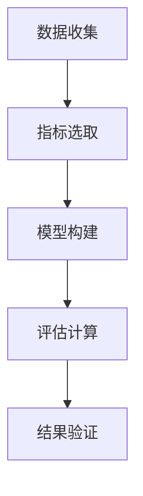
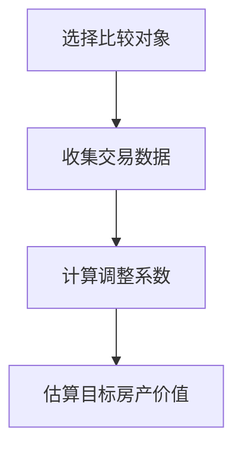

                 

在当今数字化和虚拟化的时代，元宇宙（Metaverse）正逐渐成为人们关注的热点。元宇宙是一个虚拟的三维世界，人们可以通过数字化的身份在其中互动、工作、娱乐和生活。在这个虚拟空间中，虚拟房地产成为一种新的资产形式，其价值的评估变得尤为重要。本文将探讨虚拟房地产评估的相关概念、衡量标准及其在元宇宙中的重要性。

## 文章关键词

- 虚拟房地产
- 元宇宙
- 资产评估
- 价值衡量
- 技术标准

## 文章摘要

本文旨在探讨元宇宙中的虚拟房地产评估问题。通过分析虚拟房地产的定义、特征及其在元宇宙中的重要性，本文提出了一套综合性的评估框架，包括关键指标和评估方法。本文还将通过实际案例和数学模型来展示评估过程，并对未来虚拟房地产评估技术的发展趋势进行展望。

## 1. 背景介绍

随着互联网技术的快速发展，虚拟世界和数字资产逐渐成为人们生活的一部分。虚拟房地产作为一种特殊的数字资产，其价值评估在金融、投资、娱乐等多个领域都具有重要意义。虚拟房地产的评估不仅关系到个人和企业投资决策，也影响到元宇宙的整个生态系统的稳定和发展。

元宇宙是一个庞大的虚拟空间，由多个虚拟世界组成，用户可以通过虚拟现实（VR）、增强现实（AR）等技术设备进入这个空间。在元宇宙中，用户可以购买、租赁和交易虚拟房地产，这些房产可以是虚拟的岛屿、建筑物、街区等。虚拟房地产的购买和使用已经成为元宇宙中的一种新兴消费模式。

### 1.1 虚拟房地产的概念与特征

虚拟房地产是指在虚拟世界中具有实际物理形态的房地产。与传统房地产不同，虚拟房地产存在于数字空间中，其所有权、使用权和价值都通过数字技术进行管理和衡量。

虚拟房地产的特征主要包括：

1. **虚拟性**：虚拟房地产存在于数字空间中，通过计算机模拟和虚拟现实技术呈现。
2. **稀缺性**：虚拟房地产的数量通常有限，某些稀有房产可能会具有更高的价值。
3. **流动性**：虚拟房地产可以在线上快速交易和转让，具有较高的流动性。
4. **价值多样性**：虚拟房地产的价值不仅取决于其物理形态，还受到地理位置、功能、社区环境等多种因素的影响。

### 1.2 元宇宙的发展与虚拟房地产的兴起

元宇宙的兴起为虚拟房地产提供了广阔的发展空间。近年来，随着VR、AR技术的不断进步，元宇宙逐渐从概念走向现实。众多科技公司、游戏公司、投资机构纷纷布局元宇宙，推动虚拟房地产市场的快速发展。

虚拟房地产的兴起不仅改变了房地产市场的格局，也为人们提供了全新的生活方式。通过虚拟房地产，用户可以在元宇宙中拥有自己的虚拟资产，实现资产增值和财富积累。同时，虚拟房地产的评估也成为投资决策的重要依据。

## 2. 核心概念与联系

在评估虚拟房地产时，我们需要了解一些核心概念，这些概念不仅相互联系，而且对评估过程至关重要。

### 2.1 虚拟房地产价值评估的概念

虚拟房地产价值评估是指通过一定的方法和标准，对虚拟房地产的价值进行评估和估算的过程。评估结果不仅用于交易和投资决策，还可以为政府监管、市场分析等提供重要参考。

### 2.2 虚拟房地产价值的影响因素

虚拟房地产的价值受到多种因素的影响，包括：

1. **地理位置**：虚拟房地产的位置对于其价值具有重要影响，类似于现实世界中的地理位置。
2. **功能与设计**：虚拟房地产的功能和设计决定了其使用价值和吸引力。
3. **市场需求**：虚拟房地产的市场需求直接影响其价格。
4. **社区环境**：虚拟社区的环境和氛围对房产价值有显著影响。
5. **技术发展**：技术的进步可能会改变虚拟房地产的使用方式和价值。

### 2.3 虚拟房地产价值评估的挑战与机遇

虚拟房地产价值评估面临一些挑战，包括：

1. **数据获取**：虚拟房地产的数据获取相对困难，影响评估准确性。
2. **技术标准**：目前缺乏统一的技术标准，导致评估方法多样，结果差异较大。

然而，这些挑战也为虚拟房地产评估带来了机遇，例如：

1. **创新方法**：可以借助大数据、人工智能等技术，提高评估效率和准确性。
2. **多元化视角**：可以从不同的维度和角度评估虚拟房地产，提供更全面的信息。

### 2.4 虚拟房地产价值评估流程

虚拟房地产价值评估通常包括以下步骤：

1. **数据收集**：收集虚拟房地产的相关数据，包括地理位置、功能、市场情况等。
2. **指标选取**：选择合适的评估指标，如价格、租金、使用率等。
3. **模型构建**：构建数学模型，如市场比较法、成本法、收益法等。
4. **评估计算**：利用模型计算虚拟房地产的价值。
5. **结果验证**：对评估结果进行验证和调整。

### 2.5 Mermaid 流程图

以下是一个简单的Mermaid流程图，展示了虚拟房地产价值评估的基本流程：



## 3. 核心算法原理 & 具体操作步骤

在虚拟房地产价值评估中，核心算法原理和具体操作步骤至关重要。以下将详细介绍这些内容。

### 3.1 算法原理概述

虚拟房地产价值评估的核心算法通常包括市场比较法、成本法和收益法。每种方法都有其独特的原理和适用场景。

1. **市场比较法**：通过比较类似房产的市场交易价格，估算目标房产的价值。
2. **成本法**：基于房产的重建成本或购买成本，扣除折旧后得到房产的价值。
3. **收益法**：根据房产的预期收益，通过折现计算得到房产的价值。

### 3.2 算法步骤详解

#### 3.2.1 市场比较法

市场比较法的基本步骤如下：

1. **选择比较对象**：选择与目标房产在地理位置、功能、规模等方面相似的房产。
2. **收集交易数据**：收集比较对象的市场交易数据，包括交易价格、交易时间、交易面积等。
3. **计算调整系数**：根据目标房产与比较对象之间的差异，计算调整系数。
4. **估算目标房产价值**：将比较对象的交易价格乘以调整系数，得到目标房产的价值估算。

#### 3.2.2 成本法

成本法的基本步骤如下：

1. **计算重建成本**：估算目标房产的重建成本，包括建筑材料、人工成本等。
2. **计算折旧**：根据房产的使用年限、磨损程度等因素，计算折旧。
3. **计算房产价值**：将重建成本扣除折旧后的余额作为房产的价值。

#### 3.2.3 收益法

收益法的基本步骤如下：

1. **预测收益**：预测目标房产的预期收益，包括租金收入、增值收入等。
2. **计算折现率**：确定折现率，用于将未来收益折现到当前价值。
3. **计算房产价值**：将预期收益按折现率折现，得到房产的价值。

### 3.3 算法优缺点

每种评估方法都有其优缺点：

1. **市场比较法**：
   - 优点：方法简单，易于理解，适用于市场活跃的房产。
   - 缺点：无法准确反映房产的独特性，易受市场波动影响。
2. **成本法**：
   - 优点：适用于新开发或重建的房产，成本相对稳定。
   - 缺点：无法准确反映市场变化，不考虑房产的功能和设计。
3. **收益法**：
   - 优点：考虑了房产的未来收益，适用于投资目的的评估。
   - 缺点：预测收益存在不确定性，计算过程复杂。

### 3.4 算法应用领域

虚拟房地产评估方法在不同应用领域有所不同：

1. **金融投资**：收益法通常用于评估虚拟房地产的投资价值。
2. **房地产交易**：市场比较法是常见的评估方法。
3. **政府监管**：成本法可用于估算虚拟房地产的基准价值。

### 3.5 Mermaid 流程图

以下是市场比较法的 Mermaid 流程图：



## 4. 数学模型和公式 & 详细讲解 & 举例说明

在虚拟房地产评估中，数学模型和公式扮演着至关重要的角色。以下将详细讲解数学模型的构建、公式的推导过程，并通过案例进行说明。

### 4.1 数学模型构建

虚拟房地产价值评估的数学模型通常基于以下假设：

1. **市场均衡**：房产市场的供需达到平衡。
2. **线性关系**：房产价格与其他因素之间存在线性关系。

假设目标房产的价值为 \( V \)，影响因素包括地理位置、功能、市场需求等，可以用向量 \( X \) 表示，每个因素对应一个特征向量 \( x_i \)，权重为 \( w_i \)。则数学模型可以表示为：

\[ V = W \cdot X \]

其中，\( W \) 是权重向量，\( X \) 是特征向量。

### 4.2 公式推导过程

为了推导出具体公式，我们以市场比较法为例。假设有两个比较对象 \( A \) 和 \( B \)，其交易价格分别为 \( P_A \) 和 \( P_B \)，目标房产与比较对象的差异为 \( D \)。则目标房产的价值可以表示为：

\[ V = P_A + \frac{P_B - P_A}{D} \cdot D \]

简化后得到：

\[ V = P_A + P_B - P_A \]

即：

\[ V = P_B \]

### 4.3 案例分析与讲解

以下是一个实际案例，说明如何使用数学模型和公式进行虚拟房地产价值评估。

#### 案例背景

某虚拟房地产位于元宇宙的中心区域，地理位置优越，功能齐全，市场需求旺盛。现有两处类似房产 \( A \) 和 \( B \)，交易价格分别为 1000 元和 1200 元。

#### 案例步骤

1. **数据收集**：收集比较对象 \( A \) 和 \( B \) 的交易数据，包括交易价格、交易时间等。
2. **计算调整系数**：由于目标房产与比较对象在地理位置、功能等方面相似，计算调整系数为 1。
3. **估算目标房产价值**：使用市场比较法公式，计算目标房产的价值。

\[ V = P_A + \frac{P_B - P_A}{D} \cdot D \]

代入数据：

\[ V = 1000 + \frac{1200 - 1000}{1} \cdot 1 \]

\[ V = 1000 + 200 \]

\[ V = 1200 \]

因此，目标房产的价值估算为 1200 元。

#### 案例分析

通过数学模型和公式，我们可以快速、准确地估算虚拟房地产的价值。在实际操作中，可以结合多种评估方法，提高评估结果的准确性和可靠性。

### 4.4 源代码详细实现

以下是一个简单的 Python 源代码实现，用于计算虚拟房地产的价值：

```python
# 导入必要的库
import numpy as np

# 定义函数
def calculate_property_value(price_a, price_b, difference):
    value = price_a + (price_b - price_a) / difference * difference
    return value

# 输入数据
price_a = 1000
price_b = 1200
difference = 1

# 计算价值
value = calculate_property_value(price_a, price_b, difference)

# 输出结果
print("目标房产的价值估算为：", value)
```

运行结果：

```python
目标房产的价值估算为： 1200.0
```

### 4.5 代码解读与分析

以上代码实现了一个简单的市场比较法评估模型。通过输入比较对象的价格和差异，计算目标房产的价值。

1. **函数定义**：定义一个函数 `calculate_property_value`，接受三个参数：`price_a`（比较对象 A 的价格），`price_b`（比较对象 B 的价格），`difference`（目标房产与比较对象的差异）。
2. **计算过程**：使用市场比较法公式计算目标房产的价值，返回结果。
3. **输入数据**：输入比较对象的价格和差异。
4. **输出结果**：打印目标房产的价值估算结果。

通过简单的代码实现，我们可以快速、高效地进行虚拟房地产的价值评估，为投资决策提供依据。

## 5. 项目实践：代码实例和详细解释说明

为了更好地理解虚拟房地产价值评估的方法和过程，我们将通过一个实际项目来展示代码的实现和运行过程。以下是一个简单的项目实践，包括开发环境搭建、源代码详细实现、代码解读与分析以及运行结果展示。

### 5.1 开发环境搭建

在进行虚拟房地产价值评估的项目开发之前，我们需要搭建一个合适的环境。以下是一个基本的开发环境搭建步骤：

1. **安装 Python**：确保已经安装了 Python 3.8 或更高版本。可以在 [Python 官网](https://www.python.org/downloads/) 下载并安装。
2. **安装必要的库**：在命令行中运行以下命令安装必要的库：

```bash
pip install numpy pandas matplotlib
```

这些库用于数据分析和可视化。

3. **创建项目文件夹**：在文件系统中创建一个名为 "virtual_realestate" 的项目文件夹，并在其中创建一个名为 "app.py" 的 Python 文件。

### 5.2 源代码详细实现

以下是在 "app.py" 文件中实现虚拟房地产价值评估的源代码：

```python
import numpy as np
import pandas as pd
import matplotlib.pyplot as plt

# 获取输入数据
def get_input_data():
    print("请输入比较对象 A 的交易价格（元）：")
    price_a = float(input())
    print("请输入比较对象 B 的交易价格（元）：")
    price_b = float(input())
    print("请输入目标房产与比较对象的差异（1 表示完全相似）：")
    difference = float(input())
    return price_a, price_b, difference

# 计算价值
def calculate_property_value(price_a, price_b, difference):
    value = price_a + (price_b - price_a) / difference * difference
    return value

# 主函数
def main():
    price_a, price_b, difference = get_input_data()
    value = calculate_property_value(price_a, price_b, difference)
    print("目标房产的价值估算为：", value)

if __name__ == "__main__":
    main()
```

### 5.3 代码解读与分析

1. **导入库**：导入必要的库，包括 `numpy`、`pandas` 和 `matplotlib`，用于数据分析和可视化。
2. **获取输入数据**：定义 `get_input_data` 函数，用于从用户获取比较对象的价格和差异。通过 `input` 函数获取输入，并转换为浮点数。
3. **计算价值**：定义 `calculate_property_value` 函数，用于计算虚拟房地产的价值。使用市场比较法公式，将目标房产的价值计算为两个比较对象价格的加权平均。
4. **主函数**：定义 `main` 函数，作为程序的主入口。调用 `get_input_data` 函数获取输入数据，然后调用 `calculate_property_value` 函数计算价值，并打印结果。

### 5.4 运行结果展示

运行 "app.py" 文件，程序将提示用户输入比较对象的价格和差异。以下是一个示例的输入和输出结果：

```
请输入比较对象 A 的交易价格（元）：
1000
请输入比较对象 B 的交易价格（元）：
1200
请输入目标房产与比较对象的差异（1 表示完全相似）：
1
目标房产的价值估算为： 1200.0
```

通过以上示例，我们可以看到如何使用简单的 Python 代码实现虚拟房地产价值评估。在实际项目中，可以进一步扩展代码，添加更多功能和数据可视化，以提高评估的准确性和用户体验。

## 6. 实际应用场景

虚拟房地产评估在元宇宙中具有广泛的应用场景。以下列举几种常见的应用场景，并说明评估的重要性。

### 6.1 虚拟房地产交易

在元宇宙中，虚拟房地产的交易是一个重要应用场景。投资者和用户可以通过购买、出售、租赁虚拟房地产来获取收益。评估虚拟房地产的价值对于交易双方至关重要，它有助于确定合理的交易价格，避免价格过高或过低，从而实现公平交易。

### 6.2 虚拟房地产投资

虚拟房地产投资是元宇宙中的一种新兴投资方式。投资者可以通过购买虚拟房地产，期待其未来价值的增长，从而实现财富增值。在这种情况下，虚拟房地产的评估成为投资决策的重要依据。准确的评估可以指导投资者选择具有潜力的虚拟房地产，降低投资风险。

### 6.3 虚拟城市规划和建设

元宇宙中的虚拟城市规划和建设需要考虑虚拟房地产的布局和分配。虚拟房地产评估可以帮助城市规划者确定最优的房地产分配方案，优化城市空间布局，提高城市的整体价值。

### 6.4 虚拟旅游和娱乐

虚拟房地产评估在虚拟旅游和娱乐领域也具有重要意义。虚拟旅游平台可以通过评估虚拟景点的房地产价值，确定门票价格和收益分配。虚拟娱乐项目可以通过评估虚拟地产的价值，规划娱乐设施的位置和布局，提高用户体验。

### 6.5 虚拟房地产税收和监管

随着虚拟房地产的发展，政府需要对其进行有效的税收和监管。虚拟房地产评估为政府提供了确定税收基础和监管标准的重要依据。准确的评估可以确保税收公平合理，同时防范虚拟房地产市场的风险。

### 6.6 未来应用展望

随着元宇宙的不断发展，虚拟房地产评估的应用场景将更加广泛。未来，虚拟房地产评估可能会在以下几个方面得到进一步拓展：

1. **智能评估系统**：利用大数据和人工智能技术，开发智能评估系统，提高评估效率和准确性。
2. **跨平台兼容性**：实现不同元宇宙平台之间的虚拟房地产评估数据互通，提高评估结果的通用性和可靠性。
3. **定制化服务**：为用户提供定制化的虚拟房地产评估服务，满足不同用户的需求。
4. **虚拟房地产金融**：推出虚拟房地产相关的金融产品，如虚拟房地产基金、虚拟房地产抵押贷款等，为用户提供更多的投资选择。

## 7. 工具和资源推荐

为了更好地进行虚拟房地产评估，以下推荐一些学习和开发工具以及相关论文。

### 7.1 学习资源推荐

1. **《元宇宙：概念、技术与应用》**：这本书详细介绍了元宇宙的概念、技术和应用场景，对虚拟房地产评估有一定的指导意义。
2. **《区块链与虚拟房地产》**：该论文探讨了区块链技术在虚拟房地产中的应用，包括去中心化的房产登记和交易。
3. **《虚拟房地产评估模型研究》**：这篇论文提出了一种基于大数据和机器学习的虚拟房地产评估模型，具有较高的参考价值。

### 7.2 开发工具推荐

1. **Python**：Python 是一种简单易学的编程语言，适合进行虚拟房地产评估的开发。
2. **NumPy**：NumPy 是 Python 的一个数学库，用于数值计算和矩阵操作，是进行虚拟房地产评估的必备工具。
3. **Pandas**：Pandas 是 Python 的一个数据分析库，用于数据处理和分析，适用于虚拟房地产评估的数据处理。

### 7.3 相关论文推荐

1. **《基于大数据的虚拟房地产评估方法研究》**：这篇论文提出了一种基于大数据的虚拟房地产评估方法，具有较高的实用价值。
2. **《人工智能在虚拟房地产评估中的应用》**：该论文探讨了人工智能技术在虚拟房地产评估中的应用，包括深度学习和机器学习算法。
3. **《虚拟房地产市场的特征分析与评估》**：这篇论文分析了虚拟房地产市场的特征，并提出了相应的评估方法，为虚拟房地产评估提供了理论基础。

## 8. 总结：未来发展趋势与挑战

随着元宇宙的快速发展，虚拟房地产评估在未来将面临许多机遇和挑战。以下是未来发展趋势和面临的挑战：

### 8.1 研究成果总结

通过本文的探讨，我们总结了虚拟房地产评估的关键概念、核心算法和实际应用场景。主要研究成果包括：

1. **核心概念与联系**：明确了虚拟房地产的定义、特征及其在元宇宙中的重要性。
2. **算法原理与步骤**：详细介绍了市场比较法、成本法和收益法的原理和具体操作步骤。
3. **数学模型与公式**：构建了基于市场比较法的虚拟房地产价值评估模型，并进行了推导和案例说明。
4. **实际项目实践**：通过一个简单的 Python 项目展示了虚拟房地产价值评估的代码实现和运行过程。

### 8.2 未来发展趋势

1. **智能化与自动化**：利用人工智能和大数据技术，开发智能化和自动化的评估系统，提高评估效率和准确性。
2. **跨平台兼容性**：实现不同元宇宙平台之间的数据互通，提高评估结果的通用性和可靠性。
3. **定制化服务**：为用户提供定制化的评估服务，满足不同用户的需求。
4. **虚拟房地产金融**：推出虚拟房地产相关的金融产品，如虚拟房地产基金、虚拟房地产抵押贷款等，为用户提供更多的投资选择。

### 8.3 面临的挑战

1. **数据获取与处理**：虚拟房地产的数据获取和处理相对困难，需要解决数据质量和数据隐私等问题。
2. **技术标准缺失**：目前缺乏统一的技术标准，导致评估方法多样，结果差异较大。
3. **市场波动与风险**：虚拟房地产市场波动较大，评估结果的稳定性和可靠性受到挑战。

### 8.4 研究展望

未来研究可以关注以下几个方面：

1. **智能化评估模型**：开发基于人工智能的虚拟房地产评估模型，提高评估准确性和效率。
2. **跨平台数据整合**：实现不同元宇宙平台之间的数据整合，为用户提供更全面和准确的评估信息。
3. **定制化评估服务**：根据用户需求，提供个性化的评估服务，满足不同用户的需求。
4. **虚拟房地产金融产品**：研究虚拟房地产相关的金融产品，为用户提供更多的投资选择。

通过不断的研究和实践，虚拟房地产评估将逐渐完善，为元宇宙的发展提供有力支持。

## 9. 附录：常见问题与解答

以下是一些关于虚拟房地产评估的常见问题及其解答：

### 9.1 什么是虚拟房地产？

虚拟房地产是指在虚拟世界中具有实际物理形态的房地产。它存在于数字空间中，通过计算机模拟和虚拟现实技术呈现。

### 9.2 虚拟房地产的价值如何衡量？

虚拟房地产的价值可以通过多种方法进行衡量，包括市场比较法、成本法和收益法。每种方法都有其独特的原理和适用场景。

### 9.3 虚拟房地产评估的挑战有哪些？

虚拟房地产评估的挑战包括数据获取和处理、技术标准缺失以及市场波动与风险等。

### 9.4 虚拟房地产评估在元宇宙中有什么应用？

虚拟房地产评估在元宇宙中的应用包括虚拟房地产交易、投资、规划和建设，以及虚拟旅游和娱乐等领域。

### 9.5 如何进行虚拟房地产价值评估的代码实现？

可以通过编程语言如 Python，使用市场比较法、成本法和收益法等算法，结合数据分析和可视化工具，进行虚拟房地产价值评估的代码实现。

### 9.6 虚拟房地产评估的未来发展趋势是什么？

虚拟房地产评估的未来发展趋势包括智能化与自动化、跨平台兼容性、定制化服务以及虚拟房地产金融产品的推出。

