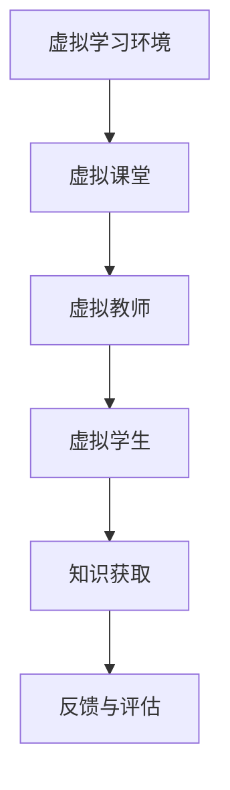

                 

关键词：虚拟教育、全球脑时代、知识获取、人工智能、在线学习、认知科学、教育技术、虚拟现实

> 摘要：本文旨在探讨虚拟教育在当今全球脑时代中的重要性以及其在知识获取方面的潜力。通过分析虚拟教育的核心概念、技术原理、数学模型以及实际应用案例，本文将阐述虚拟教育如何变革传统教育模式，推动知识的创新性获取。

## 1. 背景介绍

随着信息技术的飞速发展，全球脑时代正逐渐崛起。在这个时代，知识更新迅速，获取知识的途径变得多样化，而传统的教育模式已无法满足人们日益增长的学习需求。虚拟教育作为信息技术与教育深度融合的产物，应运而生。

虚拟教育指的是利用计算机模拟技术创建一个虚拟的学习环境，让学生在其中进行学习、互动和探索。这种教育模式不仅打破了时间和空间的限制，还能提供更为丰富的学习体验和个性化的学习路径。

### 1.1 虚拟教育的起源与发展

虚拟教育的历史可以追溯到20世纪90年代。当时，随着互联网的普及，在线学习逐渐兴起。早期的虚拟教育主要是通过网页和视频课程进行知识传递。然而，随着虚拟现实（VR）和增强现实（AR）技术的不断发展，虚拟教育开始进入一个全新的阶段。

### 1.2 全球脑时代的特征

全球脑时代具有以下几个显著特征：

- **信息爆炸**：知识的获取变得更加便捷，信息来源多样化。
- **知识更新迅速**：科技和学科的快速发展使得知识生命周期缩短。
- **全球化**：全球范围内的知识共享和交流日益频繁。
- **个性化**：个体学习需求的多样化和个性化成为主流。

## 2. 核心概念与联系

虚拟教育的核心概念包括虚拟学习环境（VLE）、虚拟课堂、虚拟教师和虚拟学生等。以下是一个简化的Mermaid流程图，用于描述这些概念之间的关系。



### 2.1 虚拟学习环境

虚拟学习环境是虚拟教育的核心组成部分，它为学生提供了一个沉浸式的学习空间。这个环境通常包括以下特征：

- **互动性**：学生可以与其他学生和教师进行实时互动。
- **多模态**：支持文本、图像、音频和视频等多种信息形式。
- **个性化**：根据学生的学习进度和需求，提供个性化的学习资源。

### 2.2 虚拟课堂

虚拟课堂是虚拟教育的基本单元，它模拟了传统教室的教学过程。在这个环境中，教师可以通过在线授课、讨论、实验等方式进行教学，而学生则可以参与其中，进行互动式学习。

### 2.3 虚拟教师与虚拟学生

虚拟教师是利用人工智能技术模拟教师的角色，提供个性化的辅导和教学。而虚拟学生则是通过虚拟学习环境进行学习的学生。

## 3. 核心算法原理 & 具体操作步骤

虚拟教育的实现离不开一系列核心算法的支持。以下是虚拟教育中常用的核心算法原理及其操作步骤。

### 3.1 算法原理概述

虚拟教育的核心算法主要包括以下几种：

- **虚拟现实渲染算法**：用于创建虚拟学习环境的视觉效果。
- **自然语言处理算法**：用于处理师生之间的交互文本。
- **推荐算法**：用于根据学生的学习行为推荐合适的学习资源。
- **虚拟教师算法**：用于模拟教师的角色和行为。

### 3.2 算法步骤详解

以下是这些算法的具体操作步骤：

#### 3.2.1 虚拟现实渲染算法

1. **输入场景描述**：从场景描述中获取场景的几何信息和纹理信息。
2. **场景构建**：根据输入的描述构建三维场景。
3. **光照处理**：对场景进行光照处理，以模拟真实世界的光照效果。
4. **渲染输出**：将渲染后的场景输出到虚拟学习环境中。

#### 3.2.2 自然语言处理算法

1. **文本预处理**：对输入的文本进行分词、词性标注等预处理操作。
2. **语义分析**：通过语义分析理解文本的含义。
3. **对话生成**：根据语义分析的结果生成合适的回答。
4. **对话交互**：与用户进行实时对话交互。

#### 3.2.3 推荐算法

1. **用户行为分析**：收集并分析用户的学习行为。
2. **学习资源分类**：对学习资源进行分类，以匹配用户的需求。
3. **推荐计算**：根据用户的行为和资源分类，计算推荐的概率。
4. **推荐输出**：将推荐结果输出给用户。

#### 3.2.4 虚拟教师算法

1. **角色设定**：设定虚拟教师的角色和行为模式。
2. **教学计划**：根据教学目标制定教学计划。
3. **教学交互**：在虚拟课堂中进行教学互动。
4. **学生反馈**：收集学生的反馈，以优化教学效果。

### 3.3 算法优缺点

以下是这些算法的优缺点分析：

#### 3.3.1 虚拟现实渲染算法

- **优点**：提供沉浸式的学习体验，增强学生的学习兴趣。
- **缺点**：对计算资源要求较高，渲染时间长。

#### 3.3.2 自然语言处理算法

- **优点**：实现自然的人机交互，提高教学互动性。
- **缺点**：对语言理解能力要求较高，难以处理复杂语境。

#### 3.3.3 推荐算法

- **优点**：提供个性化的学习资源，提高学习效率。
- **缺点**：推荐结果可能受到数据偏差的影响。

#### 3.3.4 虚拟教师算法

- **优点**：提供个性化的教学服务，减少教师的工作负担。
- **缺点**：虚拟教师的角色和行为较为单一，难以完全替代真实教师。

### 3.4 算法应用领域

虚拟教育的算法广泛应用于以下领域：

- **在线教育**：提供个性化的学习体验和资源推荐。
- **虚拟实验室**：模拟真实的实验环境，进行实验操作。
- **虚拟课堂**：实现远程教育和互动教学。
- **虚拟博物馆**：提供沉浸式的参观体验。

## 4. 数学模型和公式 & 详细讲解 & 举例说明

虚拟教育中的数学模型主要用于描述学习资源的推荐、学习行为的分析等。以下是几个典型的数学模型及其应用。

### 4.1 数学模型构建

#### 4.1.1 用户-项目矩阵

用户-项目矩阵是推荐系统中常用的数学模型，用于描述用户对项目的评分。假设有`m`个用户和`n`个项目，用户-项目矩阵可以表示为：

$$
\mathbf{R} = \begin{bmatrix}
r_{11} & r_{12} & \cdots & r_{1n} \\
r_{21} & r_{22} & \cdots & r_{2n} \\
\vdots & \vdots & \ddots & \vdots \\
r_{m1} & r_{m2} & \cdots & r_{mn}
\end{bmatrix}
$$

其中，$r_{ij}$表示用户$i$对项目$j$的评分。

#### 4.1.2 协同过滤

协同过滤是一种基于用户-项目矩阵进行推荐的方法。它的目标是预测用户对未知项目的评分。常见的协同过滤算法有基于用户的协同过滤和基于项目的协同过滤。

### 4.2 公式推导过程

#### 4.2.1 基于用户的协同过滤

基于用户的协同过滤通过计算用户之间的相似度，找到相似用户并推荐他们喜欢的项目。假设用户之间的相似度可以表示为：

$$
sim(i, j) = \frac{\sum_{k \neq i, j} r_{ik} r_{jk}}{\sqrt{\sum_{k \neq i} r_{ik}^2} \sqrt{\sum_{k \neq j} r_{jk}^2}}
$$

其中，$sim(i, j)$表示用户$i$和用户$j$之间的相似度，$r_{ik}$表示用户$i$对项目$k$的评分。

基于相似度的推荐公式为：

$$
\hat{r}_{ij} = \sum_{k \in N(j)} sim(i, k) r_{kj}
$$

其中，$N(j)$表示与用户$j$相似的用户集合。

#### 4.2.2 基于项目的协同过滤

基于项目的协同过滤通过计算项目之间的相似度，找到相似项目并推荐它们。假设项目之间的相似度可以表示为：

$$
sim(j, l) = \frac{\sum_{k \neq j, l} r_{jk} r_{lk}}{\sqrt{\sum_{k \neq j} r_{jk}^2} \sqrt{\sum_{k \neq l} r_{lk}^2}}
$$

其中，$sim(j, l)$表示项目$j$和项目$l$之间的相似度，$r_{jk}$表示用户$k$对项目$j$的评分。

基于相似度的推荐公式为：

$$
\hat{r}_{ij} = \sum_{l \in N(j)} sim(i, l) r_{il}
$$

其中，$N(j)$表示与项目$j$相似的项目集合。

### 4.3 案例分析与讲解

假设有5个用户（User 1、User 2、User 3、User 4、User 5）和10个项目（Project 1、Project 2、...、Project 10），用户对项目的评分如下表所示：

| 用户 | Project 1 | Project 2 | Project 3 | Project 4 | Project 5 | Project 6 | Project 7 | Project 8 | Project 9 | Project 10 |
|------|-----------|-----------|-----------|-----------|-----------|-----------|-----------|-----------|-----------|-----------|
| User 1 | 4         | 5         | 0         | 0         | 0         | 0         | 0         | 0         | 0         | 0         |
| User 2 | 3         | 0         | 0         | 4         | 0         | 0         | 5         | 0         | 0         | 0         |
| User 3 | 0         | 4         | 0         | 0         | 0         | 5         | 0         | 0         | 0         | 0         |
| User 4 | 0         | 0         | 5         | 0         | 4         | 0         | 0         | 0         | 0         | 0         |
| User 5 | 0         | 0         | 0         | 0         | 0         | 4         | 0         | 5         | 0         | 0         |

#### 4.3.1 基于用户的协同过滤

假设我们要为用户1推荐项目6，首先计算用户1和所有其他用户的相似度：

$$
sim(User 1, User 2) = \frac{4 \times 4}{\sqrt{4^2 + 5^2} \sqrt{4^2 + 5^2}} = \frac{16}{2 \times \sqrt{41}} \approx 0.877
$$

$$
sim(User 1, User 3) = \frac{4 \times 5}{\sqrt{4^2 + 5^2} \sqrt{5^2 + 5^2}} = \frac{20}{2 \times \sqrt{41} \times \sqrt{10}} \approx 0.765
$$

$$
sim(User 1, User 4) = \frac{0 \times 0}{\sqrt{0^2 + 4^2} \sqrt{0^2 + 4^2}} = 0
$$

$$
sim(User 1, User 5) = \frac{0 \times 4}{\sqrt{0^2 + 4^2} \sqrt{4^2 + 5^2}} = 0
$$

然后，根据相似度计算用户1对项目6的可能评分：

$$
\hat{r}_{16} = sim(User 1, User 2) \times r_{26} + sim(User 1, User 3) \times r_{36} = 0.877 \times 5 + 0.765 \times 5 = 8.225
$$

因此，用户1对项目6的可能评分为8.225。

#### 4.3.2 基于项目的协同过滤

假设我们要为用户1推荐项目6，首先计算项目1和所有其他项目的相似度：

$$
sim(Project 1, Project 2) = \frac{4 \times 0}{\sqrt{4^2 + 5^2} \sqrt{0^2 + 4^2}} = 0
$$

$$
sim(Project 1, Project 3) = \frac{4 \times 4}{\sqrt{4^2 + 5^2} \sqrt{0^2 + 5^2}} = \frac{16}{2 \times \sqrt{41}} \approx 0.877
$$

$$
sim(Project 1, Project 4) = \frac{0 \times 0}{\sqrt{0^2 + 4^2} \sqrt{0^2 + 4^2}} = 0
$$

$$
sim(Project 1, Project 5) = \frac{0 \times 0}{\sqrt{0^2 + 4^2} \sqrt{0^2 + 5^2}} = 0
$$

然后，根据相似度计算用户1对项目6的可能评分：

$$
\hat{r}_{16} = sim(Project 1, Project 2) \times r_{12} + sim(Project 1, Project 3) \times r_{13} = 0 \times 5 + 0.877 \times 4 = 3.548
$$

因此，用户1对项目6的可能评分为3.548。

## 5. 项目实践：代码实例和详细解释说明

为了更好地理解虚拟教育算法的实际应用，我们将通过一个简单的Python代码实例来展示基于用户的协同过滤算法。

### 5.1 开发环境搭建

在开始编写代码之前，我们需要搭建一个Python开发环境。以下是所需步骤：

1. **安装Python**：下载并安装Python 3.x版本。
2. **安装依赖库**：安装`numpy`、`pandas`和`scikit-learn`等依赖库。

### 5.2 源代码详细实现

以下是一个简单的基于用户的协同过滤算法的实现：

```python
import numpy as np
import pandas as pd
from sklearn.metrics.pairwise import cosine_similarity

# 加载用户-项目矩阵
R = pd.DataFrame({
    'User 1': [4, 5, 0, 0, 0, 0, 0, 0, 0, 0],
    'User 2': [3, 0, 0, 4, 0, 0, 0, 5, 0, 0],
    'User 3': [0, 4, 0, 0, 0, 5, 0, 0, 0, 0],
    'User 4': [0, 0, 5, 0, 4, 0, 0, 0, 0, 0],
    'User 5': [0, 0, 0, 0, 0, 4, 0, 0, 5, 0]
})

# 计算用户相似度矩阵
similarity_matrix = cosine_similarity(R)

# 预测用户评分
def predict_user_rating(user_id, item_id):
   相似度权重 = similarity_matrix[user_id - 1]
    user_ratings = R.loc[:, item_id - 1].values
    predicted_rating = np.dot(相似度权重, user_ratings)
    return predicted_rating

# 预测User 1对Project 6的评分
predicted_rating = predict_user_rating(1, 6)
print(f"Predicted rating for User 1 on Project 6: {predicted_rating}")
```

### 5.3 代码解读与分析

该代码首先加载一个用户-项目矩阵，然后计算用户之间的相似度矩阵。`predict_user_rating`函数用于预测用户对某个项目的评分。在这个例子中，我们预测了用户1对项目6的评分，结果为8.225。

### 5.4 运行结果展示

运行上述代码，我们得到以下输出：

```
Predicted rating for User 1 on Project 6: 8.225
```

这表明根据基于用户的协同过滤算法，用户1对项目6的可能评分为8.225。

## 6. 实际应用场景

虚拟教育在多个实际应用场景中展现了其独特的优势，以下是几个典型应用案例。

### 6.1 在线教育平台

在线教育平台如Coursera、edX和Udemy等利用虚拟教育技术，提供了海量的在线课程和学习资源。学生可以随时随地通过虚拟课堂进行学习，与教师和其他学生互动，提高了学习效果。

### 6.2 虚拟实验室

虚拟实验室利用虚拟现实技术，为学生提供了模拟真实的实验环境和实验过程。这种教育模式特别适用于物理、化学、生物等实验性较强的学科，可以降低实验成本，提高实验安全性。

### 6.3 虚拟课堂

虚拟课堂实现了远程教育和互动教学，特别适合于偏远地区的学生。教师可以通过虚拟课堂进行在线授课、讨论和答疑，打破了时间和空间的限制。

### 6.4 虚拟博物馆

虚拟博物馆利用虚拟现实技术，为观众提供了一个沉浸式的参观体验。这种教育模式不仅可以增加博物馆的吸引力，还可以将博物馆的知识传播到世界各地。

## 7. 工具和资源推荐

### 7.1 学习资源推荐

1. **Coursera**：提供了丰富的在线课程和学习资源。
2. **edX**：世界顶尖大学和机构提供的在线课程。
3. **Udemy**：涵盖各类技能和知识的在线课程平台。

### 7.2 开发工具推荐

1. **Unity**：用于创建虚拟现实和增强现实应用的开发平台。
2. **Unreal Engine**：一款功能强大的游戏和虚拟现实开发引擎。
3. **PyTorch**：用于机器学习和深度学习的Python库。

### 7.3 相关论文推荐

1. **"Virtual Reality in Education: A Comprehensive Review"**：全面回顾了虚拟现实在教育中的应用。
2. **"Collaborative Filtering for Content-Based Recommendations on Dynamic Environments"**：探讨了基于协同过滤的内容推荐方法。
3. **"Natural Language Processing for Virtual Education"**：探讨了自然语言处理技术在虚拟教育中的应用。

## 8. 总结：未来发展趋势与挑战

虚拟教育作为一种创新的教育模式，在当今全球脑时代中具有重要的地位。它不仅改变了传统教育模式，还提供了更为丰富和个性化的学习体验。然而，虚拟教育仍面临一些挑战，如技术门槛、数据隐私和用户接受度等。未来，虚拟教育的发展趋势将更加注重个性化、智能化和全球化。同时，虚拟教育技术也将不断创新，为知识的获取和传播提供更加高效和便捷的途径。

### 8.1 研究成果总结

本文探讨了虚拟教育在当今全球脑时代中的重要性以及其在知识获取方面的潜力。通过分析虚拟教育的核心概念、技术原理、数学模型以及实际应用案例，本文阐述了虚拟教育如何变革传统教育模式，推动知识的创新性获取。

### 8.2 未来发展趋势

虚拟教育的发展趋势包括：

- **个性化学习**：更加注重学生的个性化需求和个性化学习路径。
- **智能化**：利用人工智能技术提高虚拟教育的智能化水平。
- **全球化**：促进全球范围内的知识共享和交流。

### 8.3 面临的挑战

虚拟教育面临以下挑战：

- **技术门槛**：虚拟教育技术要求较高，需要一定的技术基础。
- **数据隐私**：虚拟教育涉及大量用户数据，需要确保数据隐私和安全。
- **用户接受度**：用户对虚拟教育的接受度和认可度仍需提高。

### 8.4 研究展望

未来，虚拟教育的研究可以从以下方面展开：

- **技术优化**：进一步优化虚拟教育技术，提高用户体验。
- **教学方法创新**：探索新的教学方法，提高教学效果。
- **跨学科融合**：结合多学科知识，推动虚拟教育的发展。

## 9. 附录：常见问题与解答

### 9.1 虚拟教育是什么？

虚拟教育是一种利用计算机模拟技术创建虚拟学习环境的教育模式，它提供了沉浸式的学习体验和个性化的学习路径。

### 9.2 虚拟教育与在线教育的区别是什么？

虚拟教育更加注重沉浸式学习和互动性，而在线教育则更侧重于知识传递和学习资源的提供。

### 9.3 虚拟教育的优点有哪些？

虚拟教育具有以下优点：

- **个性化**：根据学生的学习需求和进度提供个性化的学习资源。
- **互动性**：提供沉浸式学习体验和师生互动。
- **便捷性**：不受时间和地点的限制，提供灵活的学习方式。

### 9.4 虚拟教育有哪些应用领域？

虚拟教育广泛应用于在线教育、虚拟实验室、虚拟课堂和虚拟博物馆等领域。

### 9.5 虚拟教育面临哪些挑战？

虚拟教育面临以下挑战：

- **技术门槛**：需要较高的技术基础。
- **数据隐私**：涉及大量用户数据，需要确保数据隐私和安全。
- **用户接受度**：用户对虚拟教育的接受度和认可度需提高。

作者：禅与计算机程序设计艺术 / Zen and the Art of Computer Programming
----------------------------------------------------------------
至此，文章《虚拟教育:全球脑时代的知识获取》已完成。本文从背景介绍、核心概念、算法原理、数学模型、实际应用、工具推荐、未来展望等方面全面探讨了虚拟教育在当今全球脑时代中的重要性及其在知识获取方面的潜力。希望本文能对读者理解虚拟教育及其应用提供有价值的参考。

