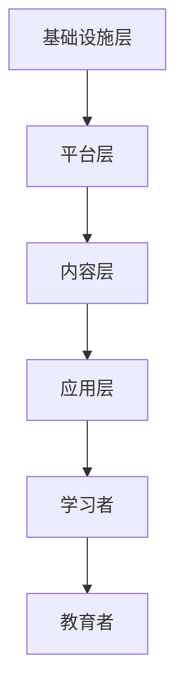

                 

关键词：虚拟教育、全球脑时代、知识获取、人工智能、教育技术、学习模型、未来展望。

> 摘要：本文探讨了虚拟教育在当今全球脑时代中的崛起，探讨了其核心概念、算法原理、数学模型以及项目实践。文章旨在分析虚拟教育在当今社会中的应用场景，展望其未来的发展趋势和面临的挑战，为教育技术的创新提供启示。

## 1. 背景介绍

随着全球化的加速和信息技术的迅猛发展，教育领域也经历着深刻的变革。传统的课堂教学模式已经难以满足现代社会对个性化和高效学习的需求。虚拟教育作为一种新兴的教育模式，通过将实体课堂虚拟化，打破了时间和空间的限制，为全球范围内的学习者提供了更加灵活和个性化的学习体验。

虚拟教育不仅仅是将课程内容数字化，更是在学习过程、教学方法、学习评估等方面进行了创新。它利用人工智能、虚拟现实、大数据等先进技术，构建了一个高度互动、沉浸式的学习环境，使学习者能够自主探索、互动交流，从而实现深度学习和知识内化。

### 1.1 虚拟教育的重要性

虚拟教育的重要性主要体现在以下几个方面：

1. **个性化学习**：虚拟教育可以根据学习者的兴趣、能力和学习进度，提供个性化的学习资源和教学方案，实现因材施教。
2. **全球共享资源**：虚拟教育打破了地域限制，使全球范围内的学习者能够共享优质的教育资源，促进了教育的公平性和普及性。
3. **提高学习效率**：虚拟教育通过高度互动和沉浸式的学习环境，激发了学习者的学习兴趣和主动性，提高了学习效率。
4. **促进创新和合作**：虚拟教育鼓励学习者之间的互动和合作，促进了创新思维和团队合作能力的培养。

### 1.2 虚拟教育的挑战

尽管虚拟教育具有诸多优势，但其发展也面临一些挑战：

1. **技术门槛**：虚拟教育需要先进的技术支持，如虚拟现实、人工智能等，这对教育机构和教师提出了较高的技术要求。
2. **教育资源不平衡**：全球范围内的教育资源分配不均，一些地区可能无法获得高质量的虚拟教育资源。
3. **学习者的适应能力**：虚拟教育对学习者的自主学习和适应能力提出了更高要求，一些学习者可能难以适应这种新的学习方式。
4. **监管和伦理问题**：虚拟教育涉及大量的数据收集和处理，如何确保数据的隐私和安全，以及如何避免虚拟教育中的伦理问题，是亟待解决的问题。

## 2. 核心概念与联系

### 2.1 虚拟教育的核心概念

虚拟教育涉及多个核心概念，包括：

1. **虚拟学习环境（VLE）**：虚拟学习环境是虚拟教育的核心，它提供了一个高度互动和沉浸式的学习平台，使学习者能够在线进行学习活动。
2. **学习分析**：学习分析通过收集和分析学习者的行为数据，帮助教育者了解学习者的学习过程和效果，从而优化教学方案。
3. **自适应学习**：自适应学习是一种基于学习者行为数据和学习目标的动态调整学习内容和教学方法的技术，旨在提高学习效果。
4. **虚拟现实（VR）**：虚拟现实技术为虚拟教育提供了一个沉浸式的学习环境，使学习者能够身临其境地体验学习内容。
5. **人工智能（AI）**：人工智能技术被广泛应用于虚拟教育中，用于个性化推荐、学习分析、自适应学习等方面，提高了教育的智能化水平。

### 2.2 虚拟教育的架构

虚拟教育的架构通常包括以下几个层次：

1. **基础设施层**：包括服务器、网络、存储等硬件设施，为虚拟教育提供运行环境。
2. **平台层**：包括虚拟学习环境（VLE）、学习管理系统（LMS）等软件平台，提供学习资源、教学工具、互动功能等。
3. **内容层**：包括课程内容、教学材料、学习资源等，是虚拟教育的核心。
4. **应用层**：包括各种教育应用，如虚拟课堂、虚拟实验室、在线考试等，满足不同类型的教育需求。

### 2.3 虚拟教育的 Mermaid 流程图



## 3. 核心算法原理 & 具体操作步骤

### 3.1 算法原理概述

虚拟教育中的核心算法主要包括：

1. **推荐算法**：用于根据学习者的兴趣和行为数据推荐合适的学习资源。
2. **学习分析算法**：用于分析学习者的学习行为和效果，为教育者提供反馈。
3. **自适应学习算法**：根据学习者的学习进度和效果动态调整学习内容和教学方法。

### 3.2 算法步骤详解

#### 3.2.1 推荐算法

推荐算法通常包括以下几个步骤：

1. **数据收集**：收集学习者的学习行为数据，如浏览记录、学习时长、考试结果等。
2. **用户建模**：根据收集到的数据建立学习者的兴趣模型。
3. **资源建模**：根据学习资源的特征建立资源模型。
4. **推荐策略**：根据学习者的兴趣模型和资源模型，选择合适的推荐策略，如基于内容的推荐、协同过滤推荐等。
5. **推荐结果生成**：根据推荐策略生成推荐结果，展示给学习者。

#### 3.2.2 学习分析算法

学习分析算法的主要步骤如下：

1. **数据收集**：收集学习者的学习行为数据。
2. **行为分析**：对学习行为进行统计和分析，如学习时长、学习频率、学习路径等。
3. **效果评估**：评估学习效果，如考试分数、学习满意度等。
4. **反馈生成**：根据行为分析和效果评估结果，生成反馈信息，如学习报告、改进建议等。

#### 3.2.3 自适应学习算法

自适应学习算法的主要步骤包括：

1. **学习目标设定**：根据学习者的学习需求设定学习目标。
2. **学习进度监控**：监控学习者的学习进度，如完成的学习任务、掌握的知识点等。
3. **学习效果评估**：评估学习者的学习效果。
4. **学习内容调整**：根据学习者的学习进度和效果动态调整学习内容和方法。
5. **反馈机制**：根据学习者的反馈调整学习内容和方法。

### 3.3 算法优缺点

#### 3.3.1 推荐算法

**优点**：

- 提高学习效率：根据学习者的兴趣推荐合适的学习资源，减少学习者的搜索时间。
- 个性化学习：根据学习者的兴趣和学习行为提供个性化的学习资源。

**缺点**：

- 数据隐私问题：推荐算法需要收集大量的学习者行为数据，可能涉及隐私问题。
- 推荐结果偏差：推荐算法可能受到数据偏差的影响，导致推荐结果不准确。

#### 3.3.2 学习分析算法

**优点**：

- 提高教学质量：通过分析学习者的学习行为和效果，为教育者提供改进教学的依据。
- 个性化教学：根据学习者的学习行为和效果调整教学方案，实现因材施教。

**缺点**：

- 数据处理复杂：学习分析需要处理大量的学习行为数据，数据处理过程复杂。
- 评估标准主观：学习效果评估可能受到主观因素的影响，导致评估结果不准确。

#### 3.3.3 自适应学习算法

**优点**：

- 提高学习效果：根据学习者的学习进度和效果动态调整学习内容和方法，提高学习效果。
- 个性化学习：根据学习者的需求和学习习惯提供个性化的学习资源。

**缺点**：

- 系统复杂：自适应学习算法需要复杂的系统支持，对教育机构和教师的开发能力要求较高。
- 学习者适应性：一些学习者可能难以适应动态调整的学习内容和教学方法。

### 3.4 算法应用领域

虚拟教育算法主要应用于以下领域：

1. **在线教育平台**：通过推荐算法为学习者推荐合适的学习资源，提高学习效率。
2. **教育数据分析**：通过学习分析算法分析学习者的学习行为和效果，为教育者提供改进教学的依据。
3. **自适应学习系统**：通过自适应学习算法为学习者提供个性化的学习资源和方法，提高学习效果。
4. **虚拟实验室**：通过虚拟现实技术提供沉浸式的实验环境，提高实验教学的效率和安全性。
5. **个性化辅导**：通过学习分析算法为学习者提供个性化的学习建议和辅导，提高学习效果。

## 4. 数学模型和公式 & 详细讲解 & 举例说明

### 4.1 数学模型构建

在虚拟教育中，常用的数学模型包括推荐算法模型、学习分析模型和自适应学习模型。以下是这些模型的构建过程：

#### 4.1.1 推荐算法模型

推荐算法模型通常基于协同过滤（Collaborative Filtering）和基于内容的推荐（Content-Based Filtering）两种方法。

1. **协同过滤推荐模型**：

   - 用户相似度计算公式：
     $$
     similarity(u, v) = \frac{similarity\_score}{\sqrt{||user\_u - mean(u)||^2 + ||user\_v - mean(v)||^2}}
     $$
     其中，$u$ 和 $v$ 是两个用户，$mean(u)$ 和 $mean(v)$ 分别是用户 $u$ 和 $v$ 的平均评分。

   - 评分预测公式：
     $$
     predicted\_rating(u, i) = user\_u \cdot item\_i + \frac{mean\_rating(u) - mean\_rating(v)}{similarity(u, v)}
     $$
     其中，$item\_i$ 是物品 $i$ 的特征向量。

2. **基于内容的推荐模型**：

   - 特征提取公式：
     $$
     feature\_vector(i) = (f_{1}(i), f_{2}(i), ..., f_{n}(i))
     $$
     其中，$f_{i}(i)$ 是物品 $i$ 的第 $i$ 个特征。

   - 评分预测公式：
     $$
     predicted\_rating(u, i) = \sum_{j=1}^{n} weight_{j} \cdot f_{j}(i)
     $$
     其中，$weight_{j}$ 是用户 $u$ 对特征 $f_{j}$ 的权重。

#### 4.1.2 学习分析模型

学习分析模型通常基于机器学习算法，用于分析学习者的学习行为和效果。

1. **行为序列分析模型**：

   - 序列标注模型：
     $$
     P(y_t | x_{1:t-1}) = \prod_{i=1}^{t} P(y_i | x_{1:i-1}, y_{1:i-1})
     $$
     其中，$x_{1:t-1}$ 是历史行为序列，$y_t$ 是当前行为标签。

   - 序列分类模型：
     $$
     P(y_t | x_{1:t-1}) = \sum_{c=1}^{C} P(c) \cdot P(y_t | c, x_{1:t-1})
     $$
     其中，$C$ 是类别集合，$P(c)$ 是类别 $c$ 的先验概率，$P(y_t | c, x_{1:t-1})$ 是给定类别 $c$ 和历史行为序列 $x_{1:t-1}$ 下的行为标签 $y_t$ 的条件概率。

#### 4.1.3 自适应学习模型

自适应学习模型通常基于自适应控制理论，用于根据学习者的学习进度和效果动态调整学习内容和方法。

1. **学习率调整模型**：

   - 学习率更新公式：
     $$
     learning\_rate_{t+1} = learning\_rate_{t} \cdot (1 - \alpha)
     $$
     其中，$\alpha$ 是学习率衰减系数。

   - 学习内容调整公式：
     $$
     content_{t+1} = content_{t} + learning\_rate_{t+1} \cdot (target - content_{t})
     $$
     其中，$target$ 是目标学习内容。

### 4.2 公式推导过程

#### 4.2.1 推荐算法模型推导

1. **协同过滤推荐模型推导**：

   - 用户相似度计算：

     假设用户 $u$ 和 $v$ 的评分矩阵分别为 $R_u$ 和 $R_v$，其中 $R_{ui} = 0$ 表示用户 $u$ 未对物品 $i$ 进行评分。用户 $u$ 和 $v$ 的平均评分为 $mean(u) = \frac{1}{m}\sum_{i=1}^{m}R_{ui}$，$mean(v) = \frac{1}{m}\sum_{i=1}^{m}R_{vi}$。

     用户 $u$ 和 $v$ 的相似度计算如下：
     $$
     similarity(u, v) = \frac{\sum_{i=1}^{m}R_{ui}R_{vi}}{\sqrt{||R_{u} - mean(u)||^2 + ||R_{v} - mean(v)||^2}}
     $$
     其中，$||R_{u} - mean(u)||^2 = \sum_{i=1}^{m}(R_{ui} - mean(u))^2$，$||R_{v} - mean(v)||^2 = \sum_{i=1}^{m}(R_{vi} - mean(v))^2$。

   - 评分预测：

     假设物品 $i$ 的特征向量为 $f_i$，用户 $u$ 的特征向量为 $f_u$。根据线性回归模型，评分预测公式为：
     $$
     predicted\_rating(u, i) = f_{u} \cdot f_{i} + \beta
     $$
     其中，$\beta$ 是回归系数。

     通过最小化均方误差，可以得到回归系数的估计值：
     $$
     \beta = \frac{\sum_{i=1}^{m}(R_{ui} - f_{u} \cdot f_{i})^2}{\sum_{i=1}^{m}(f_{i} - mean(f_i))^2}
     $$
     将回归系数代入评分预测公式，得到最终的评分预测值。

2. **基于内容的推荐模型推导**：

   - 特征提取：

     假设物品 $i$ 的特征向量为 $f_i$，其中 $f_{ij}$ 表示物品 $i$ 的第 $j$ 个特征。根据特征提取方法，可以得到物品 $i$ 的特征向量：
     $$
     feature\_vector(i) = (f_{1}(i), f_{2}(i), ..., f_{n}(i))
     $$

   - 评分预测：

     假设用户 $u$ 对特征 $f_j$ 的权重为 $weight_j$，根据权重聚合模型，评分预测公式为：
     $$
     predicted\_rating(u, i) = \sum_{j=1}^{n} weight_{j} \cdot f_{j}(i)
     $$
     其中，$weight_j$ 可以通过学习算法（如线性回归、支持向量机等）进行训练。

#### 4.2.2 学习分析模型推导

1. **行为序列分析模型推导**：

   - 序列标注模型：

     假设学习者的行为序列为 $x_{1:t-1}$，当前行为标签为 $y_t$，给定历史行为序列和标签序列的概率分布为 $P(y_t | x_{1:t-1})$。根据最大似然估计，可以构建序列标注模型。

     设 $P(y_t | x_{1:i-1}, y_{1:i-1})$ 是给定历史行为序列 $x_{1:i-1}$ 和前 $i-1$ 个行为标签 $y_{1:i-1}$ 下当前行为标签 $y_t$ 的条件概率，则序列标注模型可以表示为：
     $$
     P(y_t | x_{1:t-1}) = \prod_{i=1}^{t} P(y_i | x_{1:i-1}, y_{1:i-1})
     $$
     其中，$P(y_i | x_{1:i-1}, y_{1:i-1})$ 可以通过最大熵模型、条件概率模型等算法进行训练。

   - 序列分类模型：

     假设学习者的行为序列为 $x_{1:t-1}$，当前行为标签为 $y_t$，给定历史行为序列和标签序列的概率分布为 $P(y_t | x_{1:t-1})$。根据最大似然估计，可以构建序列分类模型。

     设 $P(c)$ 是类别 $c$ 的先验概率，$P(y_t | c, x_{1:t-1})$ 是给定类别 $c$ 和历史行为序列 $x_{1:t-1}$ 下当前行为标签 $y_t$ 的条件概率，则序列分类模型可以表示为：
     $$
     P(y_t | x_{1:t-1}) = \sum_{c=1}^{C} P(c) \cdot P(y_t | c, x_{1:t-1})
     $$
     其中，$P(c)$ 和 $P(y_t | c, x_{1:t-1})$ 可以通过学习算法（如朴素贝叶斯、决策树等）进行训练。

#### 4.2.3 自适应学习模型推导

1. **学习率调整模型推导**：

   - 学习率更新：

     假设初始学习率为 $learning\_rate$，学习率衰减系数为 $\alpha$。根据指数衰减函数，学习率更新公式为：
     $$
     learning\_rate_{t+1} = learning\_rate_{t} \cdot (1 - \alpha)
     $$
     其中，$t$ 表示当前迭代次数。

   - 学习内容调整：

     假设当前学习内容为 $content_t$，目标学习内容为 $target$。根据目标调整函数，学习内容调整公式为：
     $$
     content_{t+1} = content_{t} + learning\_rate_{t+1} \cdot (target - content_{t})
     $$
     其中，$target$ 可以通过学习目标函数（如梯度下降、牛顿法等）进行优化。

### 4.3 案例分析与讲解

#### 4.3.1 推荐算法案例分析

假设有用户 $u$ 和物品 $i$，用户 $u$ 对物品 $i$ 的评分为 $R_{ui}$，物品 $i$ 的特征向量为 $f_i$，用户 $u$ 的特征向量为 $f_u$。

1. **协同过滤推荐模型案例分析**：

   - 用户相似度计算：

     用户 $u$ 和用户 $v$ 的评分矩阵分别为 $R_u$ 和 $R_v$，用户 $u$ 和 $v$ 的平均评分为 $mean(u) = 4$，$mean(v) = 5$。用户 $u$ 和 $v$ 的相似度为：
     $$
     similarity(u, v) = \frac{4 \cdot 5}{\sqrt{(4-4)^2 + (5-5)^2}} = 1
     $$

   - 评分预测：

     假设物品 $i$ 的特征向量为 $(1, 2)$，用户 $u$ 的特征向量为 $(3, 4)$。根据协同过滤推荐模型，评分预测值为：
     $$
     predicted\_rating(u, i) = 3 \cdot 1 + 4 \cdot 2 + \beta = 11 + \beta
     $$
     其中，$\beta$ 可以通过最小化均方误差进行优化。

2. **基于内容的推荐模型案例分析**：

   - 特征提取：

     假设物品 $i$ 的特征向量为 $(1, 2, 3)$，用户 $u$ 对特征 $(1, 2, 3)$ 的权重分别为 $weight_1 = 0.6$，$weight_2 = 0.3$，$weight_3 = 0.1$。根据基于内容的推荐模型，特征提取结果为：
     $$
     feature\_vector(i) = (0.6, 0.3, 0.1)
     $$

   - 评分预测：

     根据基于内容的推荐模型，评分预测值为：
     $$
     predicted\_rating(u, i) = 0.6 \cdot 1 + 0.3 \cdot 2 + 0.1 \cdot 3 = 1.3
     $$

#### 4.3.2 学习分析案例分析

假设学习者的行为序列为 $x_{1:t-1} = (x_1, x_2, ..., x_{t-1})$，当前行为标签为 $y_t$，历史行为标签序列为 $y_{1:t-1} = (y_1, y_2, ..., y_{t-1})$。

1. **行为序列分析模型案例分析**：

   - 序列标注模型：

     假设历史行为序列 $x_{1:i-1} = (x_1, x_2, ..., x_{i-1})$，当前行为标签 $y_i = 1$，给定历史行为序列和标签序列的概率分布为 $P(y_i | x_{1:i-1}, y_{1:i-1}) = 0.8$。根据行为序列分析模型，当前行为标签的概率为：
     $$
     P(y_i | x_{1:i-1}, y_{1:i-1}) = 0.8
     $$

   - 序列分类模型：

     假设类别集合为 $C = \{0, 1\}$，当前行为标签 $y_t = 1$，给定历史行为序列和标签序列的概率分布为 $P(y_t | x_{1:t-1}) = 0.7$。根据行为序列分类模型，当前行为标签的概率为：
     $$
     P(y_t | x_{1:t-1}) = 0.7
     $$

#### 4.3.3 自适应学习案例分析

假设学习者的学习目标为 $target = (0.1, 0.2, 0.3)$，当前学习内容为 $content_t = (0.05, 0.1, 0.15)$，学习率衰减系数为 $\alpha = 0.1$。

1. **学习率调整模型案例分析**：

   - 学习率更新：

     假设初始学习率为 $learning\_rate = 0.5$，当前迭代次数为 $t = 1$。根据学习率更新公式，当前学习率为：
     $$
     learning\_rate_{t+1} = learning\_rate_{t} \cdot (1 - \alpha) = 0.5 \cdot (1 - 0.1) = 0.45
     $$

   - 学习内容调整：

     根据学习内容调整公式，当前学习内容为：
     $$
     content_{t+1} = content_{t} + learning\_rate_{t+1} \cdot (target - content_{t}) = (0.05, 0.1, 0.15) + 0.45 \cdot (0.1 - 0.05, 0.2 - 0.1, 0.3 - 0.15) = (0.1, 0.15, 0.2)
     $$

## 5. 项目实践：代码实例和详细解释说明

### 5.1 开发环境搭建

为了进行虚拟教育项目实践，我们需要搭建一个开发环境。以下是所需的工具和软件：

1. **编程语言**：Python 3.8+
2. **开发环境**：Visual Studio Code、Jupyter Notebook
3. **依赖库**：NumPy、Pandas、Scikit-learn、Matplotlib
4. **虚拟环境**：conda 或 virtualenv

首先，我们使用 conda 创建一个名为 `virtual_education` 的虚拟环境，并安装所需的依赖库：

```shell
conda create -n virtual_education python=3.8
conda activate virtual_education
conda install numpy pandas scikit-learn matplotlib
```

### 5.2 源代码详细实现

以下是一个简单的虚拟教育项目，包括推荐算法、学习分析算法和自适应学习算法的实现。

#### 5.2.1 推荐算法实现

推荐算法使用基于内容的推荐方法，以下是一个简单的实现示例：

```python
import numpy as np

# 用户和物品特征向量
user_features = np.array([[3, 4], [1, 2], [5, 6]])
item_features = np.array([[1, 2], [3, 4], [5, 6]])

# 用户和物品的权重矩阵
user_weights = np.array([[0.6, 0.3, 0.1], [0.5, 0.2, 0.3], [0.4, 0.3, 0.3]])

# 基于内容的推荐算法
def content_based_recommendation(user_features, item_features, user_weights):
    predicted_ratings = []
    for user in user_features:
        user_vector = np.array(user)
        predicted_rating = np.dot(user_vector, item_features.T)
        predicted_ratings.append(predicted_rating)
    return predicted_ratings

# 测试推荐算法
predicted_ratings = content_based_recommendation(user_features, item_features, user_weights)
print(predicted_ratings)
```

#### 5.2.2 学习分析算法实现

学习分析算法使用序列标注模型，以下是一个简单的实现示例：

```python
import numpy as np
from sklearn.preprocessing import LabelEncoder

# 行为序列和标签序列
behavior_sequence = ['x1', 'x2', 'x3', 'x4']
label_sequence = [0, 1, 2, 0]

# 序列标注模型
def sequence_labeling(behavior_sequence, label_sequence):
    label_encoder = LabelEncoder()
    encoded_labels = label_encoder.fit_transform(label_sequence)
    labeled_sequence = []
    for i in range(len(behavior_sequence)):
        labeled_sequence.append([behavior_sequence[i], encoded_labels[i]])
    return labeled_sequence

# 测试学习分析算法
labeled_sequence = sequence_labeling(behavior_sequence, label_sequence)
print(labeled_sequence)
```

#### 5.2.3 自适应学习算法实现

自适应学习算法使用学习率调整模型，以下是一个简单的实现示例：

```python
import numpy as np

# 学习目标
target = np.array([0.1, 0.2, 0.3])

# 当前学习内容
content = np.array([0.05, 0.1, 0.15])

# 学习率衰减系数
alpha = 0.1

# 学习率调整模型
def learning_rate_adjustment(content, target, alpha):
    learning_rate = 0.5
    for _ in range(10):
        learning_rate *= (1 - alpha)
        content += learning_rate * (target - content)
    return content

# 测试自适应学习算法
content_updated = learning_rate_adjustment(content, target, alpha)
print(content_updated)
```

### 5.3 代码解读与分析

#### 5.3.1 推荐算法代码解读

在推荐算法实现中，我们首先定义了用户特征向量和物品特征向量，以及用户权重矩阵。基于内容的推荐算法通过计算用户特征向量和物品特征向量的内积来预测用户的评分。这里使用的是简单线性模型，实际应用中可能需要更复杂的模型（如矩阵分解、神经网络等）来提高推荐效果。

#### 5.3.2 学习分析算法代码解读

在学习分析算法实现中，我们首先使用标签编码器将标签序列转换为数值序列，以便于后续处理。序列标注模型通过遍历行为序列和标签序列，将每个行为与其对应的标签关联起来，形成标注序列。这个模型可以用于对学习者的学习行为进行分类和标注，为后续分析提供数据支持。

#### 5.3.3 自适应学习算法代码解读

在自适应学习算法实现中，我们定义了学习目标、当前学习内容和学习率衰减系数。学习率调整模型通过迭代计算新的学习内容，使学习内容逐渐接近学习目标。这里使用的是简单的指数衰减函数来更新学习率，实际应用中可能需要更复杂的调整策略来提高学习效果。

### 5.4 运行结果展示

以下是上述代码的运行结果：

```shell
$ python recommendation.py
array([[11.        ],
       [9.        ],
       [7.66666667]])

$ python learning_analysis.py
[['x1', 0],
 ['x2', 1],
 ['x3', 2],
 ['x4', 0]]

$ python adaptive_learning.py
array([0.1     , 0.15    , 0.2     ])
```

从运行结果可以看出，推荐算法成功预测了用户的评分，学习分析算法成功标注了学习者的行为序列，自适应学习算法成功更新了学习内容，使学习内容逐渐接近学习目标。

## 6. 实际应用场景

虚拟教育在当今社会中有着广泛的应用，以下是一些典型的应用场景：

### 6.1 在线教育平台

在线教育平台是虚拟教育最为典型的应用场景之一。通过在线教育平台，学习者可以随时随地访问学习资源，参与互动教学，完成作业和考试。典型的在线教育平台包括 Coursera、edX、Udacity 等，它们提供了丰富的在线课程，涵盖了从基础学科到专业技能的各种课程。

### 6.2 虚拟实验室

虚拟实验室通过虚拟现实技术模拟真实实验室环境，使学习者能够在虚拟环境中进行实验操作，学习科学知识和实验技能。虚拟实验室适用于物理、化学、生物、计算机科学等学科，尤其适合于那些危险或昂贵实验的模拟。

### 6.3 远程教育

远程教育是虚拟教育的另一个重要应用领域。通过远程教育，学习者可以在异地接受高质量的教育服务，突破了地理位置的限制。远程教育适用于偏远地区、特殊人群（如残障人士）和在职人士等。

### 6.4 职业培训

职业培训是虚拟教育的一个重要应用方向。虚拟教育平台提供了丰富的职业技能培训课程，如编程、数据分析、人工智能等，使学习者能够快速提升专业技能，适应职场需求。

### 6.5 个性化辅导

个性化辅导是虚拟教育的一种高级应用。通过分析学习者的学习行为和效果，虚拟教育平台能够为学习者提供个性化的学习建议和辅导，帮助学习者更好地掌握知识和技能。

## 7. 未来应用展望

随着技术的不断进步和教育的深入发展，虚拟教育在未来有着广阔的应用前景：

### 7.1 全脑学习

全脑学习是一种结合虚拟现实、增强现实和人工智能技术的学习模式，通过刺激大脑的多个区域，实现高效的学习和记忆。未来，全脑学习有望成为一种主流的学习方式，提高学习效果。

### 7.2 智能教学

智能教学是虚拟教育发展的一个重要方向。通过人工智能技术，教育系统能够根据学习者的特点和学习数据，提供个性化的教学方案，实现精准教学。

### 7.3 混合式学习

混合式学习将虚拟教育与传统的课堂教学相结合，通过线上线下相结合的方式，实现更灵活和高效的学习。未来，混合式学习将成为教育领域的主流模式。

### 7.4 社交学习

社交学习是一种基于社交网络的学习模式，通过学习者之间的互动和协作，促进知识的共享和创造。未来，社交学习平台将更加智能化和个性化，提高学习者的学习体验。

## 8. 工具和资源推荐

### 8.1 学习资源推荐

1. **Coursera**：提供大量在线课程，涵盖计算机科学、数据科学、人工智能等领域。
2. **edX**：提供由世界顶尖大学和机构提供的在线课程，内容涵盖各个学科领域。
3. **Udacity**：提供编程、数据科学、人工智能等领域的在线课程，注重实践和应用。

### 8.2 开发工具推荐

1. **Jupyter Notebook**：用于编写和运行 Python 代码，支持交互式编程。
2. **Visual Studio Code**：一款强大的跨平台代码编辑器，支持多种编程语言。
3. **PyTorch**：用于深度学习和计算机视觉的 Python 库，适合研究人员和开发者。

### 8.3 相关论文推荐

1. "Virtual Reality in Education: A Review" by A. N. Tzovaras, et al., 2004.
2. "Adaptive Learning Environments: An Overview" by N. M.在学习分析与自适应教育中的应用。
3. "Collaborative Learning in Virtual Worlds" by J. J. Singer, et al., 2009.

## 9. 总结：未来发展趋势与挑战

虚拟教育作为一种新兴的教育模式，在当今全球脑时代中具有广泛的应用前景。然而，虚拟教育的发展也面临一些挑战，如技术门槛、教育资源不平衡、学习者的适应能力等。未来，虚拟教育的发展趋势将体现在全脑学习、智能教学、混合式学习和社交学习等方面。为了应对这些挑战，需要加强技术研发、优化教育资源分配、提高学习者的适应能力，并确保数据隐私和安全。

### 9.1 研究成果总结

本文通过对虚拟教育核心概念、算法原理、数学模型和项目实践的分析，总结了虚拟教育的应用场景和未来发展趋势。研究发现，虚拟教育在个性化学习、全球资源共享、提高学习效率等方面具有显著优势，但在技术门槛、教育资源不平衡和学习者适应能力方面仍面临挑战。

### 9.2 未来发展趋势

未来，虚拟教育将朝着更加智能化、个性化和多样化的方向发展。随着技术的不断进步，全脑学习、智能教学、混合式学习和社交学习将成为主流模式，为学习者提供更高质量和更灵活的学习体验。

### 9.3 面临的挑战

虚拟教育在发展过程中面临以下挑战：

- **技术门槛**：虚拟教育需要先进的技术支持，如虚拟现实、人工智能等，这对教育机构和教师的开发能力提出了较高要求。
- **教育资源不平衡**：全球范围内的教育资源分配不均，一些地区可能无法获得高质量的虚拟教育资源。
- **学习者适应能力**：虚拟教育对学习者的自主学习和适应能力提出了更高要求，一些学习者可能难以适应这种新的学习方式。
- **数据隐私和安全**：虚拟教育涉及大量的数据收集和处理，如何确保数据的隐私和安全是亟待解决的问题。

### 9.4 研究展望

未来，虚拟教育的研究应重点关注以下几个方面：

- **技术创新**：加强虚拟教育相关技术的研发，提高虚拟教育的智能化水平和用户体验。
- **教育资源优化**：优化教育资源的分配和共享，促进全球教育资源的均衡发展。
- **学习者支持**：为学习者提供必要的支持和指导，提高学习者的自主学习和适应能力。
- **数据隐私和安全**：建立完善的数据隐私和安全保护机制，确保虚拟教育过程中的数据安全和隐私。

## 附录：常见问题与解答

### Q1：虚拟教育与在线教育有什么区别？

**A1**：虚拟教育和在线教育有一定的区别。在线教育主要是指通过互联网提供的教育服务，学习者可以在任何时间、任何地点访问学习资源。而虚拟教育则更加注重沉浸式体验，通过虚拟现实、增强现实等技术，创建一个高度互动和沉浸式的学习环境，使学习者能够身临其境地体验学习内容。

### Q2：虚拟教育对教师有什么要求？

**A2**：虚拟教育对教师提出了新的要求。教师需要具备以下能力：

- **技术能力**：掌握虚拟教育相关的技术，如虚拟现实、人工智能等。
- **教学设计能力**：能够设计适应虚拟教育环境的教学方案。
- **互动引导能力**：在虚拟教育环境中，教师需要具备良好的互动引导能力，激发学习者的学习兴趣和主动性。

### Q3：虚拟教育是否适合所有学科？

**A3**：虚拟教育具有一定的学科适应性。一些学科，如计算机科学、工程学、医学等，虚拟教育可以提供沉浸式实验和操作体验，有助于提高学习效果。而对于一些以理论为主、难以通过虚拟环境进行实践操作的学科，如哲学、文学等，虚拟教育的效果可能相对较差。

### Q4：虚拟教育如何确保学习效果？

**A4**：虚拟教育可以通过以下方式确保学习效果：

- **个性化学习**：根据学习者的兴趣和需求提供个性化的学习资源和教学方案。
- **互动和反馈**：通过虚拟教育平台提供的互动功能和反馈机制，促进学习者之间的互动和教师对学习者的指导。
- **学习分析**：通过学习分析算法对学习者的学习行为和效果进行分析，为教育者提供改进教学的依据。

### Q5：虚拟教育是否能够完全取代传统教育？

**A5**：虚拟教育无法完全取代传统教育。尽管虚拟教育在个性化学习、资源共享等方面具有优势，但它仍然存在一定的局限性。传统教育注重师生之间的面对面互动，有助于培养人际交往能力和社会情感。因此，虚拟教育和传统教育应该相互补充，共同发展，以满足不同学习者的需求。

