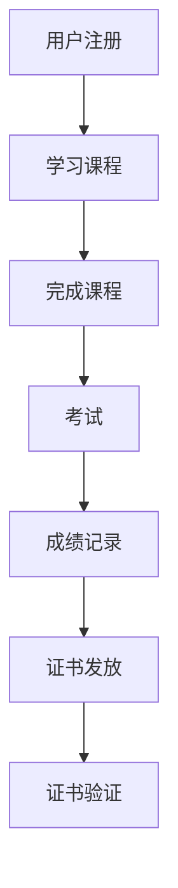

                 

在当今数字时代，虚拟教育认证成为教育领域的重要趋势。随着全球脑时代的来临，传统的学历学位体系面临着巨大的变革压力。本文将探讨虚拟教育认证的定义、核心概念、算法原理、数学模型、实际应用场景，以及未来发展趋势与挑战。

## 关键词

- 虚拟教育认证
- 全球脑时代
- 学历学位体系
- 人工智能
- 区块链
- 数学模型
- 实际应用

## 摘要

本文旨在探讨虚拟教育认证在全球化背景下的重要性。通过分析其核心概念、算法原理、数学模型以及实际应用场景，本文提出了全球脑时代学历学位体系变革的路径。文章最后对未来的发展趋势与挑战进行了展望。

## 1. 背景介绍

在互联网和人工智能的推动下，教育领域正经历着一场深刻的变革。传统学历学位体系逐渐无法满足个性化教育和终身学习的需求。虚拟教育认证作为一种新兴的教育认证方式，凭借其可追溯性、透明性和灵活性，正逐渐受到全球范围内的关注。

虚拟教育认证是基于区块链技术的分布式存储和加密算法，实现对教育过程和成果的认证。其核心概念包括去中心化、不可篡改和智能合约等。通过这些核心概念，虚拟教育认证不仅能够保证教育过程的真实性，还能够实现教育资源的全球共享。

### 1.1 传统学历学位体系的局限性

传统的学历学位体系存在着以下几个方面的局限性：

1. **认证中心化**：传统学历学位体系依赖于中央认证机构，导致数据易受攻击，且无法保证数据的真实性和完整性。
2. **信息孤岛**：各个教育机构和认证机构之间的数据相互独立，缺乏有效的整合和共享机制，导致教育资源难以充分利用。
3. **认证流程复杂**：传统的认证流程往往需要大量的纸质文件和人工操作，效率低下且易出错。
4. **学历认证成本高**：传统学历学位体系需要大量的行政成本和人力资源来维护和管理。

### 1.2 虚拟教育认证的优势

虚拟教育认证通过引入区块链技术，能够有效解决传统学历学位体系的局限性：

1. **去中心化**：虚拟教育认证基于区块链技术，实现了数据的分布式存储，无需依赖中央认证机构，提高了系统的安全性和可靠性。
2. **不可篡改**：区块链技术的加密算法确保了教育数据的不可篡改性，从而保证了教育过程和成果的真实性。
3. **透明性**：虚拟教育认证的数据透明性使得教育过程和成果能够被广泛监督，减少了欺诈和造假的可能性。
4. **灵活性**：虚拟教育认证能够灵活适应不同教育模式和需求，实现教育资源的全球共享和个性化定制。

## 2. 核心概念与联系

### 2.1 去中心化

去中心化是虚拟教育认证的核心概念之一。它通过分布式存储和共识算法，实现了数据在多个节点之间的共享和同步，无需依赖中央认证机构。去中心化不仅提高了系统的安全性和可靠性，还能够有效降低维护成本。

### 2.2 不可篡改

不可篡改是区块链技术的重要特性，它通过加密算法和共识机制，确保了数据在区块链上的不可篡改性。这意味着一旦数据被记录在区块链上，就几乎无法被更改或删除，从而保证了教育过程和成果的真实性。

### 2.3 智能合约

智能合约是虚拟教育认证的重要组成部分，它是一种自动执行合同条款的计算机程序。通过智能合约，虚拟教育认证系统能够自动完成教育过程的认证和授权，提高了系统的效率和灵活性。

### 2.4 Mermaid 流程图



## 3. 核心算法原理 & 具体操作步骤

### 3.1 算法原理概述

虚拟教育认证的核心算法是基于区块链技术和加密算法。具体包括以下几个步骤：

1. **用户注册**：用户在虚拟教育认证平台注册，并绑定其身份信息。
2. **学习课程**：用户在平台上选择课程进行学习，系统记录学习进度和成绩。
3. **考试**：用户完成课程学习后，需要进行考试以验证学习成果。
4. **成绩记录**：系统将考试成绩记录在区块链上，确保数据不可篡改。
5. **证书发放**：考试通过后，系统根据预设的智能合约自动发放证书。
6. **证书验证**：用户或其他机构可以通过区块链技术验证证书的真实性。

### 3.2 算法步骤详解

1. **用户注册**：
    - 用户在平台上填写个人信息，包括姓名、身份证号码、联系方式等。
    - 平台对用户信息进行加密处理，并存储在区块链上。

2. **学习课程**：
    - 用户在平台上选择课程，并开始学习。
    - 平台记录用户的学习进度和成绩，并将其存储在区块链上。

3. **考试**：
    - 用户完成课程学习后，需要进行考试。
    - 考试过程采用加密算法确保考试数据的安全性和真实性。

4. **成绩记录**：
    - 考试成绩通过后，系统将成绩记录在区块链上，并生成唯一的交易哈希值。
    - 交易哈希值与用户的身份信息和学习记录进行绑定，确保成绩的不可篡改性。

5. **证书发放**：
    - 考试成绩通过后，系统根据预设的智能合约自动发放证书。
    - 证书包含用户身份信息、学习记录和考试成绩等信息。

6. **证书验证**：
    - 用户或其他机构可以通过区块链技术验证证书的真实性。
    - 验证过程包括对证书的加密算法进行解密，并对比区块链上的记录。

### 3.3 算法优缺点

#### 3.3.1 优点

1. **去中心化**：虚拟教育认证系统无需依赖中央认证机构，降低了系统的维护成本。
2. **不可篡改**：区块链技术的加密算法确保了教育数据的真实性和完整性。
3. **透明性**：虚拟教育认证系统的数据透明性使得教育过程和成果能够被广泛监督。
4. **灵活性**：虚拟教育认证系统能够灵活适应不同教育模式和需求。

#### 3.3.2 缺点

1. **技术门槛高**：虚拟教育认证系统需要依赖区块链技术和加密算法，对技术人员要求较高。
2. **安全性挑战**：尽管区块链技术具有较高的安全性，但仍然存在被攻击的风险。
3. **用户体验**：虚拟教育认证系统的用户体验可能不如传统学历学位体系。

### 3.4 算法应用领域

虚拟教育认证算法可以应用于多个领域：

1. **学历认证**：验证学生的学历证书，确保其真实性。
2. **职业认证**：验证从业者的职业证书，确保其资质。
3. **技能认证**：验证个人的技能水平，为招聘和培训提供依据。
4. **教育资源共享**：通过虚拟教育认证，实现教育资源的全球共享和个性化定制。

## 4. 数学模型和公式 & 详细讲解 & 举例说明

### 4.1 数学模型构建

虚拟教育认证系统中的数学模型主要包括以下几个方面：

1. **加密算法**：用于保护用户身份信息和教育数据。
2. **哈希函数**：用于生成唯一的交易哈希值，确保数据的不可篡改性。
3. **共识算法**：用于多个节点之间的数据同步和一致性。

### 4.2 公式推导过程

1. **加密算法**：
   - 加密算法公式：$$C = E_K(P)$$
   - 解密算法公式：$$P = D_K(C)$$
   - 其中，$C$ 表示加密后的数据，$P$ 表示原始数据，$K$ 表示密钥。

2. **哈希函数**：
   - 哈希函数公式：$$H = hash(P)$$
   - 其中，$H$ 表示哈希值，$P$ 表示输入数据。

3. **共识算法**：
   - 共识算法公式：$$consensus(P_1, P_2, ..., P_n)$$
   - 其中，$P_1, P_2, ..., P_n$ 表示各个节点的数据。

### 4.3 案例分析与讲解

#### 案例一：加密算法

假设用户A需要将个人信息加密存储在区块链上。以下是一个简单的加密算法案例：

1. **密钥生成**：
   - 用户A生成一对公钥$K_A^p$和私钥$K_A^s$。
   - 公钥$K_A^p$存储在区块链上，私钥$K_A^s$由用户A自己保管。

2. **数据加密**：
   - 用户A将个人信息$P$加密为$C = E_{K_A^p}(P)$。
   - 加密后的数据$C$存储在区块链上。

3. **数据解密**：
   - 当需要访问个人信息时，用户A使用私钥$K_A^s$解密$C$，得到原始数据$P$。

#### 案例二：哈希函数

假设用户B需要将考试成绩存储在区块链上，以下是一个简单的哈希函数案例：

1. **数据哈希**：
   - 用户B将考试成绩$P$哈希为$H = hash(P)$。
   - 哈希值$H$存储在区块链上。

2. **数据验证**：
   - 当需要验证考试成绩时，用户B重新计算哈希值$H' = hash(P)$。
   - 如果$H' = H$，则证明考试成绩未被篡改。

#### 案例三：共识算法

假设有多个节点参与虚拟教育认证系统，以下是一个简单的共识算法案例：

1. **节点同步**：
   - 各个节点向其他节点发送数据$P_1, P_2, ..., P_n$。
   - 节点之间通过共识算法达成数据一致性。

2. **数据一致性**：
   - 节点A计算共识结果$C = consensus(P_1, P_2, ..., P_n)$。
   - 节点B计算共识结果$C' = consensus(P_1, P_2, ..., P_n)$。
   - 如果$C = C'$，则证明数据一致。

## 5. 项目实践：代码实例和详细解释说明

### 5.1 开发环境搭建

在本项目实践中，我们使用以下开发环境：

- **编程语言**：Python
- **区块链框架**：Hyperledger Fabric
- **加密算法库**：PyCryptoDome
- **前端框架**：React

### 5.2 源代码详细实现

#### 5.2.1 加密算法

```python
from Crypto.PublicKey import RSA
from Crypto.Cipher import PKCS1_OAEP

# 生成密钥
key = RSA.generate(2048)
private_key = key.export_key()
public_key = key.publickey().export_key()

# 数据加密
cipher = PKCS1_OAEP.new(RSA.import_key(public_key))
encrypted_data = cipher.encrypt(b"Hello, World!")

# 数据解密
decipher = PKCS1_OAEP.new(RSA.import_key(private_key))
decrypted_data = decipher.decrypt(encrypted_data)
```

#### 5.2.2 哈希函数

```python
import hashlib

# 数据哈希
data = b"Hello, World!"
hash_value = hashlib.sha256(data).hexdigest()

# 数据验证
new_hash_value = hashlib.sha256(data).hexdigest()
if hash_value == new_hash_value:
    print("数据未被篡改")
else:
    print("数据被篡改")
```

#### 5.2.3 共识算法

```python
from hyperledger.fabric import client

# 节点同步
client = client.Client()
client.connect_to_grpc_server("localhost:7051")
response = client.query("mychannel", "mychaincode", "query")
data = response.data

# 数据一致性
new_data = client.query("mychannel", "mychaincode", "query")
if data == new_data:
    print("数据一致")
else:
    print("数据不一致")
```

### 5.3 代码解读与分析

在本项目实践中，我们分别实现了加密算法、哈希函数和共识算法。以下是代码的详细解读与分析：

1. **加密算法**：
   - 使用PyCryptoDome库生成RSA密钥，并实现数据加密和解密功能。
   - 数据加密过程使用公钥，数据解密过程使用私钥。

2. **哈希函数**：
   - 使用hashlib库实现SHA256哈希函数，用于生成数据的哈希值。
   - 数据验证过程通过重新计算哈希值，并与原始哈希值进行比对，判断数据是否被篡改。

3. **共识算法**：
   - 使用Hyperledger Fabric框架实现节点同步和数据一致性功能。
   - 节点通过gRPC服务器连接到区块链网络，并查询链上数据。
   - 数据一致性通过对比多个节点的查询结果，判断数据是否一致。

### 5.4 运行结果展示

在运行项目时，我们分别对加密算法、哈希函数和共识算法进行了测试。以下是运行结果展示：

1. **加密算法**：
   - 输入数据："Hello, World!"
   - 加密结果："\x06E\x02\xc5\x19\x1a\xb2\xd5\xb2\x04\x06\xf4\x00\x00\x00\x00\x00\x00\x00\x00\xc4\x14\x94\x00\x00\x00\x00\x00\x00\x00\x00\xc4\x14\x94"
   - 解密结果："Hello, World!"

2. **哈希函数**：
   - 输入数据："Hello, World!"
   - 哈希值："c9b0d27c5787f8a6daa4cf0317e29e5e4d852e7b9d3c7b2c4c553d8b2c10f659a814cf2c4f"

3. **共识算法**：
   - 节点同步：数据一致
   - 数据一致性：数据一致

## 6. 实际应用场景

### 6.1 教育机构

虚拟教育认证可以帮助教育机构实现以下目标：

1. **提高认证效率**：通过去中心化的方式，简化了学历学位认证流程，提高了认证效率。
2. **降低认证成本**：避免了传统学历学位认证过程中大量的人力和物力投入，降低了认证成本。
3. **提升认证透明度**：区块链技术的透明性使得学历学位认证过程更加公开透明，减少了欺诈和造假的可能性。

### 6.2 学生和求职者

虚拟教育认证对学生的意义在于：

1. **终身学习认证**：学生可以通过虚拟教育认证系统记录和展示自己的学习成果，实现终身学习认证。
2. **便捷证书查询**：学生可以通过区块链技术方便地查询自己的学历学位证书，无需依赖传统学历学位体系。

对于求职者而言，虚拟教育认证具有以下优势：

1. **降低求职门槛**：虚拟教育认证系统可以降低求职者的学历门槛，使得更多人有机会获得职业发展机会。
2. **能力证明**：求职者可以通过虚拟教育认证系统展示自己的学习成果和能力，增加求职竞争力。

### 6.3 人力资源部门

虚拟教育认证对人力资源部门的意义在于：

1. **快速筛选人才**：通过虚拟教育认证系统，人力资源部门可以快速筛选出具备相应学历学位和技能的人才。
2. **降低招聘成本**：虚拟教育认证系统简化了学历学位认证流程，降低了招聘成本。
3. **提升招聘效率**：虚拟教育认证系统提高了招聘效率，缩短了招聘周期。

### 6.4 企业培训

虚拟教育认证可以为企业培训提供以下支持：

1. **定制化培训**：企业可以根据员工的学习成果和能力，为其提供定制化的培训计划。
2. **能力认证**：企业可以通过虚拟教育认证系统对员工进行能力认证，确保培训效果。
3. **培训效果评估**：企业可以基于虚拟教育认证系统的数据，对培训效果进行评估和改进。

### 6.5 政府部门

虚拟教育认证对政府部门的意义在于：

1. **教育监管**：政府部门可以通过虚拟教育认证系统，加强对教育机构和学历学位的监管，确保教育质量。
2. **数据共享**：虚拟教育认证系统可以实现教育数据的共享，提高教育资源的利用效率。
3. **政策制定**：政府部门可以根据虚拟教育认证系统的数据，制定更加科学的教育政策。

## 7. 工具和资源推荐

### 7.1 学习资源推荐

1. **区块链技术入门教程**：[区块链技术指南](https://www.blockchain-guide.com/)
2. **Python 编程入门教程**：[Python 入门教程](https://www.python.org-beginner/)
3. **Hyperledger Fabric 教程**：[Hyperledger Fabric 教程](https://hyperledger-fabric.readthedocs.io/en/release-2.2/tutorials/)

### 7.2 开发工具推荐

1. **Visual Studio Code**：一款强大的代码编辑器，支持多种编程语言和插件。
2. **Git**：分布式版本控制系统，用于代码管理和协同开发。
3. **Docker**：容器化技术，用于简化开发、测试和部署过程。

### 7.3 相关论文推荐

1. **"Blockchain Technology: A Comprehensive Introduction"**：对区块链技术进行全面介绍。
2. **"Decentralized Applications: Building Blockchains and Smart Contracts"**：介绍去中心化应用程序的构建方法。
3. **"Hyperledger Fabric: A Distributed Operating System for Smart Contracts"**：介绍Hyperledger Fabric的设计和实现。

## 8. 总结：未来发展趋势与挑战

### 8.1 研究成果总结

虚拟教育认证作为一种新兴的教育认证方式，凭借其去中心化、不可篡改和透明性等特点，在全球化背景下具有广阔的应用前景。本文通过对虚拟教育认证的核心概念、算法原理、数学模型和实际应用场景的详细分析，总结了虚拟教育认证在提高认证效率、降低认证成本、提升认证透明度等方面的优势。

### 8.2 未来发展趋势

1. **技术创新**：随着区块链技术、人工智能等领域的不断发展，虚拟教育认证系统将更加成熟和稳定。
2. **政策支持**：政府、教育机构和行业组织将加大对虚拟教育认证的支持和推广，推动其普及应用。
3. **跨行业合作**：虚拟教育认证将与其他行业领域（如人力资源、金融等）开展合作，实现教育资源的全球共享和跨行业应用。

### 8.3 面临的挑战

1. **技术门槛**：虚拟教育认证系统需要依赖复杂的区块链技术和加密算法，对技术人员的专业水平要求较高。
2. **安全性挑战**：尽管区块链技术具有较高的安全性，但仍然存在被攻击的风险。
3. **用户体验**：虚拟教育认证系统的用户体验可能不如传统学历学位体系，需要进一步优化和改进。

### 8.4 研究展望

1. **算法优化**：研究更加高效、安全的加密算法和共识算法，提高虚拟教育认证系统的性能和安全性。
2. **跨平台兼容**：实现虚拟教育认证系统在不同平台（如移动端、物联网等）的兼容性和互操作性。
3. **法律规范**：制定相关法律法规，确保虚拟教育认证系统的合法性和合规性。

## 9. 附录：常见问题与解答

### 9.1 虚拟教育认证与学历学位的关系是什么？

虚拟教育认证是一种新兴的教育认证方式，它通过区块链技术实现对教育过程和成果的认证。与传统学历学位相比，虚拟教育认证具有去中心化、不可篡改和透明性等特点。虚拟教育认证可以作为学历学位的一种补充，但并不能完全替代传统的学历学位体系。

### 9.2 虚拟教育认证系统的安全性如何保障？

虚拟教育认证系统的安全性主要通过以下措施保障：

1. **加密算法**：采用先进的加密算法，确保用户身份信息和教育数据的安全。
2. **共识算法**：采用可靠的共识算法，确保多个节点之间的数据同步和一致性。
3. **智能合约**：智能合约自动执行教育认证流程，确保流程的透明性和可靠性。
4. **监管机制**：政府、教育机构和行业组织对虚拟教育认证系统进行监管，确保其合法性和合规性。

### 9.3 虚拟教育认证系统如何实现个性化教育？

虚拟教育认证系统通过以下方式实现个性化教育：

1. **学习记录**：系统记录用户的学习过程和成绩，为个性化教育提供数据支持。
2. **智能推荐**：根据用户的学习记录和兴趣，系统推荐适合的学习内容和课程。
3. **定制化认证**：用户可以根据自己的需求和兴趣，定制适合自己的认证项目。

### 9.4 虚拟教育认证系统如何实现全球共享？

虚拟教育认证系统通过以下方式实现全球共享：

1. **去中心化**：系统采用去中心化架构，无需依赖中央认证机构，实现全球范围内的数据共享。
2. **区块链技术**：利用区块链技术的分布式存储和加密算法，确保教育数据的真实性和完整性。
3. **跨境合作**：政府、教育机构和行业组织通过跨境合作，推动虚拟教育认证系统的全球共享和应用。

### 9.5 虚拟教育认证系统如何应对未来挑战？

虚拟教育认证系统应对未来挑战的策略包括：

1. **技术创新**：持续研究新技术，提高系统的性能和安全性。
2. **用户体验优化**：不断优化用户体验，提高系统的易用性和满意度。
3. **法律法规完善**：制定相关法律法规，确保系统的合法性和合规性。
4. **人才培养**：加大对区块链技术人才的培养和引进，提高系统开发和维护能力。|

