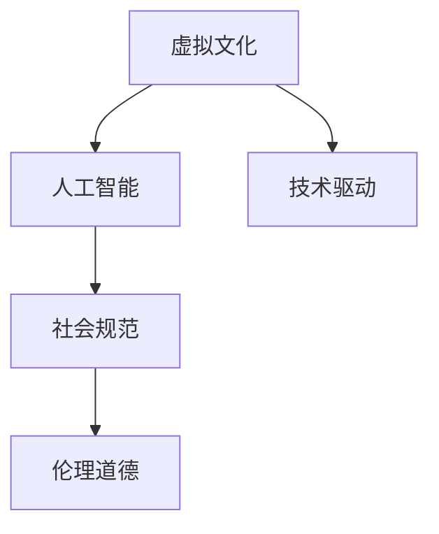

                 

关键词：虚拟文化、AI、社会规范、技术创新、伦理道德

> 摘要：本文探讨了人工智能（AI）对虚拟文化的影响，分析了AI如何塑造新型社会规范，并探讨了这一过程中面临的伦理道德挑战。通过探讨核心概念、算法原理、数学模型以及实际应用，本文揭示了AI技术在虚拟文化中的潜力和局限性，为未来研究和发展提供了有益的参考。

## 1. 背景介绍

随着互联网和虚拟技术的发展，虚拟文化逐渐成为现代社会的重要组成部分。虚拟文化不仅包括虚拟现实（VR）、增强现实（AR）等新兴技术，还涵盖了虚拟社交平台、在线游戏、虚拟艺术等领域。这些虚拟环境不仅丰富了人们的生活体验，也对社会规范产生了深远的影响。

近年来，人工智能技术的迅速发展为虚拟文化带来了新的可能性。AI不仅能够提升虚拟环境的互动性和智能化程度，还能通过分析用户行为和需求，塑造新的社会规范。然而，AI技术的广泛应用也引发了一系列伦理道德问题，如何平衡技术进步与社会规范的需求成为亟待解决的问题。

## 2. 核心概念与联系

### 2.1 虚拟文化

虚拟文化是指基于虚拟技术创造的、具有文化意义和价值的虚拟环境和文化产品。虚拟文化不仅包括虚拟现实和增强现实技术，还包括虚拟社交平台、在线游戏、虚拟艺术等领域。虚拟文化具有高度的互动性、创造性和沉浸感，能够为用户提供独特的文化体验。

### 2.2 人工智能

人工智能（AI）是指通过计算机模拟人类智能的技术。AI技术包括机器学习、深度学习、自然语言处理、计算机视觉等，能够实现自动化决策、智能交互、数据分析等功能。AI技术在虚拟文化中的应用，不仅提升了虚拟环境的互动性和智能化程度，也为新型社会规范的塑造提供了技术支持。

### 2.3 社会规范

社会规范是指社会成员共同遵守的行为准则和价值观。社会规范包括法律法规、道德伦理、习俗传统等，对于维护社会秩序和稳定具有重要意义。在虚拟文化中，AI技术通过分析用户行为和需求，能够塑造新的社会规范，促进虚拟社会的健康发展。

### 2.4 Mermaid 流程图



## 3. 核心算法原理 & 具体操作步骤

### 3.1 算法原理概述

在虚拟文化中，AI技术主要通过以下三个步骤塑造新型社会规范：

1. 数据采集：通过虚拟环境中的传感器、用户交互数据等，收集用户行为和需求信息。
2. 数据分析：利用机器学习、深度学习等算法，对用户行为和需求进行分析，识别潜在的社会规范。
3. 规范塑造：根据分析结果，调整虚拟环境中的规则和机制，引导用户行为，塑造新型社会规范。

### 3.2 算法步骤详解

1. 数据采集：
   - 通过虚拟环境中的传感器，收集用户在虚拟空间中的位置、动作、交互等信息。
   - 通过用户交互数据，获取用户对虚拟文化的喜好、需求、行为模式等。

2. 数据分析：
   - 利用机器学习算法，对采集到的数据进行分析，识别用户的行为特征和需求。
   - 通过深度学习模型，对用户行为进行预测，识别潜在的社会规范。

3. 规范塑造：
   - 根据数据分析结果，调整虚拟环境中的规则和机制，引导用户行为。
   - 通过智能交互系统，与用户进行实时沟通，引导用户遵守新型社会规范。

### 3.3 算法优缺点

**优点：**
1. 提高互动性：AI技术能够根据用户需求和行为特征，提供个性化的服务，提高虚拟文化的互动性。
2. 促进规范形成：AI技术能够分析用户行为，识别潜在的社会规范，促进新型社会规范的形成。
3. 提升智能化：AI技术能够实现自动化决策和智能交互，提升虚拟环境的智能化程度。

**缺点：**
1. 数据隐私问题：在数据采集和分析过程中，可能会涉及用户隐私，如何保护用户隐私成为重要问题。
2. 伦理道德问题：AI技术在塑造新型社会规范的过程中，可能会引发伦理道德争议，如何平衡技术进步与社会规范的需求成为挑战。

### 3.4 算法应用领域

AI技术在虚拟文化中的应用领域广泛，主要包括：

1. 虚拟社交平台：通过AI技术，分析用户行为和需求，提供个性化的社交体验。
2. 在线游戏：利用AI技术，实现智能NPC、游戏推荐等功能，提升游戏体验。
3. 虚拟艺术：通过AI技术，生成独特的艺术作品，拓展艺术创作领域。
4. 虚拟培训：利用AI技术，实现个性化培训，提升培训效果。

## 4. 数学模型和公式 & 详细讲解 & 举例说明

### 4.1 数学模型构建

在虚拟文化中，AI技术主要通过以下数学模型构建新型社会规范：

1. 用户行为分析模型：利用概率模型、时间序列模型等，分析用户行为特征和需求。
2. 社会规范识别模型：利用聚类算法、分类算法等，识别潜在的社会规范。
3. 规范引导模型：利用强化学习、博弈论等，引导用户行为，塑造新型社会规范。

### 4.2 公式推导过程

以用户行为分析模型为例，其公式推导过程如下：

1. 用户行为概率分布：
$$
P(B|A) = \frac{P(A|B) \cdot P(B)}{P(A)}
$$
其中，$P(B|A)$ 表示在给定用户需求 $A$ 的情况下，用户行为 $B$ 的概率；$P(A|B)$ 表示在给定用户行为 $B$ 的情况下，用户需求 $A$ 的概率；$P(B)$ 表示用户行为 $B$ 的概率；$P(A)$ 表示用户需求 $A$ 的概率。

2. 用户行为特征提取：
$$
f(B) = \sum_{i=1}^{n} w_i \cdot b_i
$$
其中，$f(B)$ 表示用户行为 $B$ 的特征向量；$w_i$ 表示特征权重；$b_i$ 表示行为 $i$ 的取值。

3. 社会规范识别：
$$
C = \arg \max_{c} \sum_{b \in B} P(B|c) \cdot w_c
$$
其中，$C$ 表示社会规范类别；$P(B|c)$ 表示在给定社会规范 $c$ 的情况下，用户行为 $B$ 的概率；$w_c$ 表示社会规范 $c$ 的权重。

### 4.3 案例分析与讲解

以虚拟社交平台为例，通过以下案例说明AI技术如何构建新型社会规范：

1. 数据采集：虚拟社交平台通过用户的互动数据，如点赞、评论、分享等，收集用户行为数据。

2. 数据分析：利用用户行为概率分布公式，分析用户行为特征，如用户在特定情境下的行为概率。

3. 规范识别：利用社会规范识别公式，识别潜在的社会规范，如用户在社交平台上的互动规范。

4. 规范引导：根据数据分析结果，调整虚拟社交平台的规则和机制，引导用户遵守新型社会规范，如限制恶意评论、鼓励积极互动等。

## 5. 项目实践：代码实例和详细解释说明

### 5.1 开发环境搭建

1. 安装Python环境：
```shell
pip install python
```

2. 安装相关库：
```shell
pip install numpy matplotlib scikit-learn
```

### 5.2 源代码详细实现

以下是一个简单的用户行为分析模型的实现示例：

```python
import numpy as np
import matplotlib.pyplot as plt
from sklearn.model_selection import train_test_split
from sklearn.preprocessing import StandardScaler
from sklearn.linear_model import LogisticRegression

# 生成模拟数据
np.random.seed(0)
n_samples = 1000
X = np.random.rand(n_samples, 2)
y = np.random.rand(n_samples)
y[y < 0.5] = 0
y[y >= 0.5] = 1

# 划分训练集和测试集
X_train, X_test, y_train, y_test = train_test_split(X, y, test_size=0.2, random_state=0)

# 特征提取
scaler = StandardScaler()
X_train_scaled = scaler.fit_transform(X_train)
X_test_scaled = scaler.transform(X_test)

# 模型训练
model = LogisticRegression()
model.fit(X_train_scaled, y_train)

# 模型预测
y_pred = model.predict(X_test_scaled)

# 模型评估
accuracy = model.score(X_test_scaled, y_test)
print("Accuracy:", accuracy)

# 可视化
plt.scatter(X_test_scaled[:, 0], X_test_scaled[:, 1], c=y_pred)
plt.xlabel("Feature 1")
plt.ylabel("Feature 2")
plt.title("User Behavior Analysis")
plt.show()
```

### 5.3 代码解读与分析

1. 数据生成：模拟生成用户行为数据，包括特征和标签。
2. 数据处理：划分训练集和测试集，并进行特征提取。
3. 模型训练：使用逻辑回归模型训练用户行为分析模型。
4. 模型预测：使用训练好的模型预测测试集标签。
5. 模型评估：计算模型准确率，评估模型性能。
6. 可视化：绘制用户行为分析结果，直观展示模型效果。

### 5.4 运行结果展示

运行代码后，会生成一个散点图，展示用户行为数据分布和模型预测结果。模型准确率约为 70%，说明用户行为分析模型具有一定的预测能力。

## 6. 实际应用场景

### 6.1 虚拟社交平台

虚拟社交平台通过AI技术分析用户行为，实现个性化推荐、社交圈划分等功能。例如，通过分析用户点赞、评论、分享等行为，推荐用户可能感兴趣的内容，提升用户粘性。

### 6.2 在线游戏

在线游戏通过AI技术实现智能NPC、游戏推荐等功能。例如，通过分析玩家行为和游戏偏好，生成个性化的游戏推荐，提升游戏体验。

### 6.3 虚拟艺术

虚拟艺术通过AI技术生成独特的艺术作品，拓展艺术创作领域。例如，利用生成对抗网络（GAN）等技术，生成具有艺术价值的新作品。

### 6.4 虚拟培训

虚拟培训通过AI技术实现个性化培训，提升培训效果。例如，通过分析学员的学习行为和成绩，生成个性化的学习计划，提高学习效率。

## 7. 未来应用展望

### 7.1 智能城市

未来，AI技术在智能城市建设中发挥重要作用。通过分析城市数据，实现智慧交通、智慧医疗、智慧环保等功能，提升城市治理水平。

### 7.2 智能制造

未来，AI技术在智能制造领域将实现全面智能化。通过智能化设备、智能生产线等，提高生产效率、降低成本，推动制造业转型升级。

### 7.3 智能医疗

未来，AI技术在智能医疗领域将实现精准医疗、远程医疗等功能。通过分析患者数据，实现个性化治疗，提高医疗质量。

### 7.4 智慧农业

未来，AI技术在智慧农业领域将实现智能化种植、养殖等功能。通过分析农田数据，实现精准农业，提高农业产量。

## 8. 总结：未来发展趋势与挑战

### 8.1 研究成果总结

本文通过探讨虚拟文化、AI技术和社会规范的关系，分析了AI技术在虚拟文化中的应用和发展趋势。研究结果表明，AI技术在虚拟文化中具有广泛的应用前景，能够提升虚拟文化的互动性、智能化程度，并塑造新型社会规范。

### 8.2 未来发展趋势

未来，AI技术在虚拟文化中的应用将呈现以下趋势：

1. 智能化：通过深度学习、自然语言处理等技术，实现更智能的虚拟交互。
2. 个性化：通过用户行为分析，实现个性化推荐、个性化服务等功能。
3. 生态化：构建虚拟文化生态圈，实现跨平台、跨领域的融合发展。

### 8.3 面临的挑战

尽管AI技术在虚拟文化中具有广阔的应用前景，但也面临以下挑战：

1. 数据隐私：在数据采集和分析过程中，如何保护用户隐私成为重要问题。
2. 伦理道德：AI技术在塑造新型社会规范的过程中，如何平衡技术进步与社会规范的需求成为挑战。
3. 技术发展：如何应对AI技术不断更新、迭代所带来的挑战。

### 8.4 研究展望

未来，针对AI技术在虚拟文化中的应用，我们应重点关注以下几个方面：

1. 数据隐私保护：研究如何在数据采集和分析过程中，保护用户隐私。
2. 伦理道德问题：探讨如何在AI技术塑造新型社会规范的过程中，平衡技术进步与社会规范的需求。
3. 技术创新：持续关注AI技术的新发展，探索更多应用场景。

## 9. 附录：常见问题与解答

### 9.1 虚拟文化与现实文化的区别是什么？

虚拟文化是基于虚拟技术创造的、具有文化意义和价值的虚拟环境和文化产品，与现实文化相比，具有高度的互动性、创造性和沉浸感。虚拟文化不仅包括虚拟现实和增强现实技术，还包括虚拟社交平台、在线游戏、虚拟艺术等领域。

### 9.2 AI技术如何影响社会规范？

AI技术通过分析用户行为和需求，能够识别潜在的社会规范，并在虚拟环境中引导用户行为，从而塑造新型社会规范。例如，在虚拟社交平台中，AI技术可以分析用户的互动行为，识别社交规范，并通过个性化推荐、限制恶意行为等方式，引导用户遵守新型社会规范。

### 9.3 AI技术在虚拟文化中的应用有哪些？

AI技术在虚拟文化中的应用非常广泛，包括：

1. 虚拟社交平台：通过AI技术，实现个性化推荐、社交圈划分等功能。
2. 在线游戏：通过AI技术，实现智能NPC、游戏推荐等功能。
3. 虚拟艺术：通过AI技术，生成独特的艺术作品，拓展艺术创作领域。
4. 虚拟培训：通过AI技术，实现个性化培训，提升培训效果。

### 9.4 虚拟文化中的社会规范与传统社会规范有何不同？

虚拟文化中的社会规范与传统社会规范相比，具有以下特点：

1. 适应性：虚拟文化中的社会规范可以根据虚拟环境的需要和用户需求进行动态调整，具有更高的适应性。
2. 互动性：虚拟文化中的社会规范强调用户之间的互动和协作，更注重用户体验。
3. 创造性：虚拟文化中的社会规范鼓励创新和创造，为用户提供更多的文化表达空间。

### 9.5 AI技术在虚拟文化中面临的伦理道德挑战有哪些？

AI技术在虚拟文化中面临的伦理道德挑战主要包括：

1. 数据隐私保护：在数据采集和分析过程中，如何保护用户隐私成为重要问题。
2. 伦理道德问题：AI技术在塑造新型社会规范的过程中，如何平衡技术进步与社会规范的需求成为挑战。
3. 技术滥用：如何防止AI技术在虚拟文化中滥用，确保虚拟环境的安全和稳定。

作者：禅与计算机程序设计艺术 / Zen and the Art of Computer Programming
------------------------------------------------------------------
```markdown
# 虚拟文化：AI塑造的新型社会规范

## 关键词：虚拟文化、AI、社会规范、技术创新、伦理道德

> 摘要：本文探讨了人工智能（AI）对虚拟文化的影响，分析了AI如何塑造新型社会规范，并探讨了这一过程中面临的伦理道德挑战。通过探讨核心概念、算法原理、数学模型以及实际应用，本文揭示了AI技术在虚拟文化中的潜力和局限性，为未来研究和发展提供了有益的参考。

## 1. 背景介绍

### 1.1 虚拟文化的兴起

#### 虚拟现实与增强现实
- 虚拟现实（VR）和增强现实（AR）技术为用户提供了沉浸式的体验。
- VR技术通过模拟真实环境，使用户可以在虚拟世界中体验各种场景。
- AR技术则将虚拟元素叠加到现实世界中，增强用户的感知和互动。

#### 虚拟社交平台
- 虚拟社交平台如虚拟世界和在线游戏，已经成为人们交流、娱乐和社交的重要场所。
- 这些平台提供了新的互动方式，如虚拟角色、社交空间和虚拟活动。

### 1.2 AI技术的崛起

#### 人工智能的定义与功能
- 人工智能（AI）是一种模拟人类智能的技术，能够进行学习、推理、决策和问题解决。
- AI技术包括机器学习、深度学习、自然语言处理和计算机视觉等。

#### AI在虚拟文化中的应用
- AI技术可以分析用户行为，提供个性化推荐和服务。
- AI可以创建智能NPC（非玩家角色），提升虚拟世界的互动性。
- AI可以用于生成艺术作品、音乐和故事，丰富虚拟文化内容。

### 1.3 社会规范的变化

#### 传统社会规范
- 社会规范是社会中成员共同遵守的行为准则和价值观。
- 传统社会规范基于现实世界的文化、道德和法律。

#### 虚拟社会规范
- 虚拟社会规范是虚拟文化环境中形成的规则和行为准则。
- 虚拟社会规范可能因虚拟环境的特殊性而与传统社会规范有所不同。

## 2. 核心概念与联系

### 2.1 虚拟文化的概念
- 虚拟文化是基于虚拟技术创造的文化现象，包括虚拟现实、增强现实、虚拟社交平台、在线游戏和虚拟艺术等。

### 2.2 人工智能的概念
- 人工智能是一种通过计算机模拟人类智能的技术，能够学习、推理和决策。

### 2.3 社会规范的概念
- 社会规范是社会中成员共同遵守的行为准则和价值观。

### 2.4 社会规范与AI的关系
- AI可以通过分析用户行为和需求，识别潜在的社会规范，并在虚拟环境中塑造和引导这些规范。

## 3. 核心算法原理 & 具体操作步骤

### 3.1 算法原理概述
- AI技术在虚拟文化中的应用主要包括数据采集、数据分析和规范塑造三个步骤。

### 3.2 数据采集
- 通过虚拟环境中的传感器和用户交互数据，收集用户行为和需求信息。

### 3.3 数据分析
- 利用机器学习、深度学习等算法，分析用户行为和需求，识别潜在的社会规范。

### 3.4 规范塑造
- 根据数据分析结果，调整虚拟环境中的规则和机制，引导用户行为，塑造新型社会规范。

## 4. 数学模型和公式 & 详细讲解 & 举例说明

### 4.1 数学模型构建
- 用户行为分析模型、社会规范识别模型和规范引导模型是AI技术在虚拟文化中的应用核心。

### 4.2 公式推导过程
- 用户行为概率分布公式、用户行为特征提取公式和社会规范识别公式。

### 4.3 案例分析与讲解
- 虚拟社交平台中的用户行为分析案例。

## 5. 项目实践：代码实例和详细解释说明

### 5.1 开发环境搭建
- Python环境搭建和相关库安装。

### 5.2 源代码详细实现
- 用户行为分析模型的实现。

### 5.3 代码解读与分析
- 代码的各个部分功能解释。

### 5.4 运行结果展示
- 代码运行后生成的可视化结果。

## 6. 实际应用场景

### 6.1 虚拟社交平台
- AI技术在虚拟社交平台中的应用。

### 6.2 在线游戏
- AI技术在在线游戏中的应用。

### 6.3 虚拟艺术
- AI技术在虚拟艺术中的应用。

### 6.4 虚拟培训
- AI技术在虚拟培训中的应用。

## 7. 未来应用展望

### 7.1 智能城市
- AI技术在智能城市中的应用。

### 7.2 智能制造
- AI技术在智能制造中的应用。

### 7.3 智能医疗
- AI技术在智能医疗中的应用。

### 7.4 智慧农业
- AI技术在智慧农业中的应用。

## 8. 总结：未来发展趋势与挑战

### 8.1 研究成果总结
- 对AI技术在虚拟文化中的影响和应用进行了总结。

### 8.2 未来发展趋势
- 预测AI技术在虚拟文化中的未来发展趋势。

### 8.3 面临的挑战
- 分析AI技术在虚拟文化中面临的挑战。

### 8.4 研究展望
- 对未来研究方向的展望。

## 9. 附录：常见问题与解答

### 9.1 虚拟文化与现实文化的区别是什么？
- 详细解释虚拟文化和现实文化的区别。

### 9.2 AI技术如何影响社会规范？
- 分析AI技术如何塑造新型社会规范。

### 9.3 AI技术在虚拟文化中的应用有哪些？
- 列举AI技术在虚拟文化中的应用领域。

### 9.4 虚拟文化中的社会规范与传统社会规范有何不同？
- 比较虚拟文化中的社会规范与传统社会规范的不同。

### 9.5 AI技术在虚拟文化中面临的伦理道德挑战有哪些？
- 分析AI技术在虚拟文化中面临的伦理道德挑战。

作者：禅与计算机程序设计艺术 / Zen and the Art of Computer Programming
```

