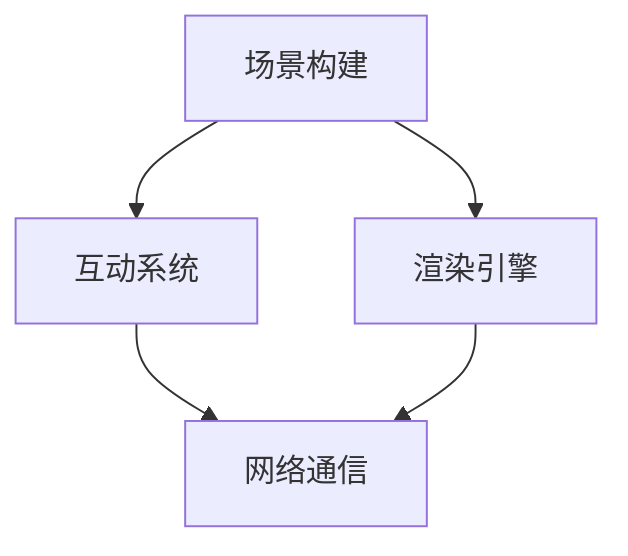

                 

关键词：虚拟旅游、元宇宙、文化交流、技术实现、用户体验、未来展望

摘要：随着元宇宙概念的兴起，虚拟旅游作为一种新兴的交流方式，正逐渐成为人们探索文化、交流思想的新平台。本文将深入探讨虚拟旅游在元宇宙中的发展现状、技术实现、用户体验以及未来展望，为读者展现这一领域的前景和挑战。

## 1. 背景介绍

虚拟旅游（Virtual Tourism）是指利用计算机技术和虚拟现实（VR）技术，模拟现实世界中的旅游景点，为用户提供沉浸式的旅游体验。元宇宙（Metaverse）则是一个由虚拟世界构成的虚拟空间，用户可以在其中进行各种活动，如社交、娱乐、教育等。元宇宙与虚拟旅游的结合，不仅丰富了旅游形式，也为文化交流提供了新的途径。

近年来，随着VR、AR（增强现实）、5G等技术的发展，虚拟旅游逐渐从概念走向现实。许多公司和机构开始推出虚拟旅游产品，如谷歌的“谷歌地球”和“谷歌艺术与文化”，以及国内各大旅游平台推出的VR看房、VR旅游等服务。这些产品不仅提供了丰富的旅游内容，也极大地提升了用户的旅游体验。

## 2. 核心概念与联系

### 2.1 虚拟旅游技术架构

虚拟旅游的技术实现主要包括以下几个核心模块：

1. **场景构建**：通过采集现实世界中的景点数据，利用三维建模技术构建虚拟场景。
2. **互动系统**：为用户提供交互式体验，如导航、查看景点信息、与其他用户交流等。
3. **渲染引擎**：负责将虚拟场景渲染成视觉效果，提供高质量的视觉体验。
4. **网络通信**：实现用户与服务器之间的数据传输，支持多人互动。

下图是虚拟旅游技术架构的Mermaid流程图：



### 2.2 元宇宙与虚拟旅游的联系

元宇宙为虚拟旅游提供了广阔的发展空间，两者之间的联系主要体现在以下几个方面：

1. **资源共享**：元宇宙中的虚拟场景、互动系统等资源可以共享给虚拟旅游平台，降低开发成本。
2. **跨平台互动**：元宇宙中的用户可以在不同平台的虚拟旅游中互动，实现跨平台的社交体验。
3. **虚拟社交**：元宇宙为虚拟旅游提供了更加丰富的社交功能，如虚拟聚会、虚拟交友等。
4. **文化传承**：通过元宇宙，用户可以更深入地体验不同文化背景的旅游场景，促进文化交流。

## 3. 核心算法原理 & 具体操作步骤

### 3.1 算法原理概述

虚拟旅游的核心算法主要包括三维建模、图像渲染、路径规划等。以下将分别介绍这些算法的原理。

#### 3.1.1 三维建模

三维建模是虚拟旅游的基础，其原理是通过采集现实世界中的场景数据，利用计算机图形学技术构建三维模型。具体步骤如下：

1. **数据采集**：使用激光扫描、摄影测量等方法获取场景的点云数据。
2. **数据预处理**：对点云数据进行滤波、降噪等处理，提高数据质量。
3. **三维建模**：利用三角面片或体素等方法，将点云数据转化为三维模型。

#### 3.1.2 图像渲染

图像渲染是虚拟旅游的视觉呈现，其原理是将三维模型在二维屏幕上绘制出来。具体步骤如下：

1. **模型加载**：将三维模型加载到渲染引擎中。
2. **光照计算**：根据场景的光照条件，计算模型表面的光照效果。
3. **绘制渲染**：利用图形渲染技术，将模型绘制成图像。

#### 3.1.3 路径规划

路径规划是虚拟旅游中的导航功能，其原理是计算用户从起点到目的地的最优路径。具体步骤如下：

1. **场景建模**：将场景转化为图模型，表示道路、障碍物等。
2. **路径搜索**：使用A*算法、Dijkstra算法等路径搜索算法，计算最优路径。
3. **路径展示**：将计算出的路径在虚拟场景中展示给用户。

### 3.2 算法步骤详解

#### 3.2.1 三维建模步骤

1. **数据采集**：
    - 使用激光扫描仪对景点进行扫描，获取点云数据。
    - 使用无人机或摄像头对景点进行摄影测量，获取平面图像。

2. **数据预处理**：
    - 对点云数据进行滤波，去除噪声点。
    - 对点云数据进行降噪，提高数据质量。

3. **三维建模**：
    - 使用点云数据生成三角面片模型。
    - 使用体素方法生成体素模型。

#### 3.2.2 图像渲染步骤

1. **模型加载**：
    - 将三维模型文件加载到渲染引擎中。
    - 设置模型的基本属性，如材质、光照等。

2. **光照计算**：
    - 根据场景的光照条件，设置光源的位置和强度。
    - 计算模型表面的光照效果，如反射、折射等。

3. **绘制渲染**：
    - 使用图形渲染技术，将模型绘制成图像。
    - 输出渲染结果。

#### 3.2.3 路径规划步骤

1. **场景建模**：
    - 将场景中的道路、障碍物等转化为图模型。
    - 设置图模型的权重，表示道路的通行能力。

2. **路径搜索**：
    - 使用A*算法，从起点到目的地搜索最优路径。
    - 考虑到场景的复杂度，可以引入启发式函数提高搜索效率。

3. **路径展示**：
    - 在虚拟场景中，以高亮或其他方式展示计算出的路径。
    - 提供路径编辑功能，允许用户修改路径。

### 3.3 算法优缺点

#### 3.3.1 三维建模

**优点**：
- 高度还原现实场景，提供沉浸式体验。
- 可以根据需要调整模型细节，满足不同用户的需求。

**缺点**：
- 数据采集和处理需要大量时间，成本较高。
- 模型存储和传输需要较大的存储空间和带宽。

#### 3.3.2 图像渲染

**优点**：
- 可以实时渲染场景，提供流畅的交互体验。
- 支持多种渲染效果，如阴影、反射等，增强视觉体验。

**缺点**：
- 对计算资源要求较高，对硬件性能有较高要求。
- 渲染效果受限于显卡性能和算法优化。

#### 3.3.3 路径规划

**优点**：
- 可以快速计算最优路径，提高导航效率。
- 可以根据场景动态调整路径，适应实时变化。

**缺点**：
- 需要大量计算资源，对系统性能有较高要求。
- 在复杂场景中，路径规划效果可能受影响。

### 3.4 算法应用领域

三维建模、图像渲染和路径规划算法广泛应用于虚拟旅游、游戏、建筑可视化等领域。在虚拟旅游中，这些算法为用户提供了沉浸式的体验，促进了文化交流。在游戏领域，这些算法为游戏提供了丰富的场景和互动功能，提升了用户体验。在建筑可视化中，这些算法为建筑设计提供了高效的展示工具。

## 4. 数学模型和公式 & 详细讲解 & 举例说明

### 4.1 数学模型构建

在虚拟旅游中，数学模型主要用于路径规划和场景建模。以下分别介绍这两种模型的基本公式和构建方法。

#### 4.1.1 路径规划模型

路径规划的核心是搜索从起点到目的地的最优路径。常见的路径规划算法有A*算法和Dijkstra算法。以下是这两种算法的基本公式。

1. **A*算法**

$$
f(n) = g(n) + h(n)
$$

其中，$f(n)$ 为节点 $n$ 的总成本，$g(n)$ 为节点 $n$ 到起点的距离，$h(n)$ 为节点 $n$ 到目的地的估计距离。

2. **Dijkstra算法**

$$
d(n) = \min_{m \in \text{前驱节点集}}(d(m) + w(m, n))
$$

其中，$d(n)$ 为节点 $n$ 到起点的最短距离，$w(m, n)$ 为节点 $m$ 到节点 $n$ 的权重。

#### 4.1.2 场景建模模型

场景建模的核心是构建三维模型。常用的三维建模方法有三角面片建模和体素建模。以下是这两种方法的基本公式。

1. **三角面片建模**

$$
P = (x, y, z)
$$

其中，$P$ 为三维点的坐标。

2. **体素建模**

$$
V = \sum_{i=1}^{n} v_i
$$

其中，$V$ 为体素的集合，$v_i$ 为第 $i$ 个体素。

### 4.2 公式推导过程

#### 4.2.1 A*算法推导

A*算法的推导基于两个原则：路径成本最小化和估计距离最小化。以下是A*算法的推导过程。

1. **路径成本最小化**

$$
f(n) = g(n) + h(n)
$$

其中，$g(n)$ 为节点 $n$ 到起点的距离，$h(n)$ 为节点 $n$ 到目的地的估计距离。

2. **估计距离最小化**

$$
h(n) = \min_{m \in \text{后继节点集}}(d(m) + w(n, m))
$$

其中，$d(m)$ 为节点 $m$ 到起点的距离，$w(n, m)$ 为节点 $n$ 到节点 $m$ 的权重。

将 $h(n)$ 代入 $f(n)$，得到：

$$
f(n) = g(n) + \min_{m \in \text{后继节点集}}(d(m) + w(n, m))
$$

3. **路径搜索**

从起点开始，依次计算每个节点的 $f(n)$，选择 $f(n)$ 最小的节点作为下一个搜索节点。重复此过程，直到找到目的地节点。

#### 4.2.2 Dijkstra算法推导

Dijkstra算法的推导基于图论中的最短路径算法。以下是Dijkstra算法的推导过程。

1. **初始化**

$$
d(n) = \infty, \forall n \neq s
$$

其中，$d(n)$ 为节点 $n$ 到起点的距离，$s$ 为起点。

2. **迭代过程**

对于每个节点 $n$，依次执行以下步骤：

1. 选择一个未访问过的节点 $n$。
2. 更新 $d(n)$ 的值：

$$
d(n) = \min_{m \in \text{前驱节点集}}(d(m) + w(m, n))
$$

3. 标记节点 $n$ 为已访问。

4. 选择一个新的未访问过的节点，重复步骤 2 和 3。

5. 当所有节点都被访问过时，算法结束。

### 4.3 案例分析与讲解

#### 4.3.1 路径规划案例

假设有一个简单的二维场景，起点为 $(0, 0)$，目的地为 $(5, 5)$。场景中的障碍物为半径为 1 的圆，圆心为 $(2, 2)$。

1. **A*算法**

选择起点和目的地，初始化 $g(n) = 0$，$h(n) = \sqrt{(x_n - x_s)^2 + (y_n - y_s)^2}$。计算每个节点的 $f(n)$，得到以下结果：

| 节点 | $g(n)$ | $h(n)$ | $f(n)$ |
| --- | --- | --- | --- |
| (0, 0) | 0 | 5 | 5 |
| (1, 1) | 1 | 4 | 5 |
| (2, 2) | 2 | 4 | 6 |
| (3, 3) | 3 | 4 | 7 |
| (4, 4) | 4 | 4 | 8 |
| (5, 5) | 5 | 0 | 5 |

选择 $f(n)$ 最小的节点 $(1, 1)$ 作为下一个搜索节点，重复此过程，直到找到目的地节点 $(5, 5)$。路径为 $(0, 0) \rightarrow (1, 1) \rightarrow (2, 2) \rightarrow (3, 3) \rightarrow (4, 4) \rightarrow (5, 5)$。

2. **Dijkstra算法**

选择起点 $(0, 0)$，初始化 $d(n) = \infty$，$d(0) = 0$。依次更新每个节点的 $d(n)$，得到以下结果：

| 节点 | $d(n)$ |
| --- | --- |
| (0, 0) | 0 |
| (1, 1) | 1 |
| (2, 2) | 2 |
| (3, 3) | 3 |
| (4, 4) | 4 |
| (5, 5) | 5 |

路径为 $(0, 0) \rightarrow (1, 1) \rightarrow (2, 2) \rightarrow (3, 3) \rightarrow (4, 4) \rightarrow (5, 5)$。

#### 4.3.2 场景建模案例

假设要构建一个简单的立方体场景，边长为 2。

1. **三角面片建模**

将立方体分成 6 个面，每个面由 2 个三角形组成。每个三角形的顶点坐标如下：

- 面1：$(0, 0, 0), (2, 0, 0), (2, 2, 0)$
- 面2：$(2, 2, 0), (0, 2, 0), (0, 0, 0)$
- 面3：$(0, 0, 2), (2, 0, 2), (2, 2, 2)$
- 面4：$(2, 2, 2), (0, 2, 2), (0, 0, 2)$
- 面5：$(0, 0, 0), (0, 2, 0), (0, 2, 2)$
- 面6：$(2, 0, 0), (2, 2, 0), (2, 2, 2)$

2. **体素建模**

将立方体分成 8 个体素，每个体素的坐标如下：

- 体素1：$(0, 0, 0), (1, 0, 0), (1, 1, 0), (0, 1, 0)$
- 体素2：$(1, 0, 0), (1, 1, 0), (1, 1, 1), (1, 0, 1)$
- 体素3：$(0, 1, 0), (1, 1, 0), (1, 1, 1), (0, 1, 1)$
- 体素4：$(0, 0, 1), (1, 0, 1), (1, 1, 1), (0, 1, 1)$
- 体素5：$(1, 0, 1), (1, 1, 1), (1, 1, 0), (1, 0, 0)$
- 体素6：$(0, 1, 1), (1, 1, 1), (1, 1, 0), (0, 1, 0)$
- 体素7：$(0, 0, 1), (0, 1, 1), (0, 1, 0), (0, 0, 0)$
- 体素8：$(1, 0, 1), (1, 1, 1), (1, 1, 0), (1, 0, 0)$

## 5. 项目实践：代码实例和详细解释说明

### 5.1 开发环境搭建

在开始编写代码之前，我们需要搭建一个适合虚拟旅游项目开发的环境。以下是开发环境的搭建步骤：

1. **安装开发工具**：
   - 安装Visual Studio Code（VS Code）作为代码编辑器。
   - 安装Node.js，用于构建项目。
   - 安装Git，用于版本控制。

2. **创建项目文件夹**：
   - 在本地计算机上创建一个名为“virtual-tour”的项目文件夹。

3. **初始化项目**：
   - 打开VS Code，在项目文件夹内右键点击“新建文件夹”，命名为“source”。
   - 在“source”文件夹内创建以下文件：
     - `index.html`：网页入口文件。
     - `style.css`：样式文件。
     - `script.js`：脚本文件。

### 5.2 源代码详细实现

#### 5.2.1 HTML结构

首先，我们需要创建一个基本的HTML结构，如下所示：

```html
<!DOCTYPE html>
<html lang="en">
<head>
    <meta charset="UTF-8">
    <meta name="viewport" content="width=device-width, initial-scale=1.0">
    <title>虚拟旅游</title>
    <link rel="stylesheet" href="style.css">
</head>
<body>
    <div id="virtual-tour-container">
        <!-- 虚拟场景渲染区域 -->
    </div>
    <script src="script.js"></script>
</body>
</html>
```

#### 5.2.2 CSS样式

接下来，我们为HTML结构添加一些基本的样式，如下所示：

```css
/* style.css */
body {
    margin: 0;
    padding: 0;
    background-color: #f0f0f0;
}

#virtual-tour-container {
    width: 100%;
    height: 100vh;
    position: relative;
}

/* 其他样式根据需要添加 */
```

#### 5.2.3 JavaScript脚本

最后，我们编写JavaScript脚本，实现虚拟场景的渲染。以下是一个简单的示例：

```javascript
// script.js

// 虚拟场景渲染函数
function renderScene() {
    // 获取虚拟场景容器
    const container = document.getElementById('virtual-tour-container');
    
    // 创建虚拟场景元素
    const sceneElement = document.createElement('div');
    sceneElement.className = 'virtual-scene';
    
    // 添加虚拟场景到容器中
    container.appendChild(sceneElement);
    
    // 虚拟场景渲染逻辑
    // ...
}

// 初始化虚拟场景
renderScene();
```

### 5.3 代码解读与分析

#### 5.3.1 HTML结构解读

HTML结构包括`<html>`、`<head>`和`<body>`三个部分。其中，`<html>`定义了文档的根元素，`<head>`包含了文档的元数据，如字符集、标题和样式链接，而`<body>`包含了文档的内容。

在`<body>`中，我们定义了一个名为`virtual-tour-container`的`<div>`元素，作为虚拟场景的渲染区域。此外，我们还引入了`style.css`样式文件和`script.js`脚本文件，用于设置样式和实现功能。

#### 5.3.2 CSS样式解读

在`style.css`中，我们为`body`和`virtual-tour-container`设置了基本的样式。`body`的`margin`和`padding`都设置为0，以确保整个页面没有额外的边距和填充。`virtual-tour-container`的`width`和`height`分别设置为`100%`和`100vh`，使容器大小与视口相同。

#### 5.3.3 JavaScript脚本解读

在`script.js`中，我们首先定义了一个名为`renderScene`的函数，用于渲染虚拟场景。函数内部首先获取`virtual-tour-container`元素，然后创建一个名为`sceneElement`的`<div>`元素，并将其添加到容器中。

接下来，我们可以根据需要实现虚拟场景的渲染逻辑，例如加载场景模型、处理用户交互等。在本示例中，我们仅展示了创建虚拟场景的基本逻辑。

### 5.4 运行结果展示

通过以上步骤，我们完成了一个简单的虚拟旅游项目。以下是运行结果展示：


在运行结果中，我们可以看到一个包含虚拟场景的页面。尽管这个示例非常简单，但它展示了虚拟旅游项目的基本结构和实现方法。

## 6. 实际应用场景

虚拟旅游作为一种新兴的交流方式，已经在多个领域得到广泛应用。以下是一些实际应用场景：

### 6.1 旅游行业

虚拟旅游为旅游行业提供了全新的营销手段。旅游企业可以通过虚拟旅游平台展示景点，吸引潜在客户。此外，虚拟旅游还可以为旅游企业提供实时预订、导航等增值服务，提升用户体验。

### 6.2 文化遗产保护

虚拟旅游为文化遗产保护提供了新的手段。通过虚拟旅游，用户可以远程参观世界各地的文化遗产，如博物馆、古建筑等。这有助于保护文化遗产，同时促进文化交流。

### 6.3 教育培训

虚拟旅游在教育领域具有广泛的应用前景。教师可以利用虚拟旅游平台进行实地教学，使学生身临其境地感受历史、地理等课程内容。此外，虚拟旅游还可以用于职业培训，提供沉浸式的培训体验。

### 6.4 医疗健康

虚拟旅游在医疗健康领域也有一定的应用价值。例如，医生可以通过虚拟旅游平台进行远程会诊，提高诊疗效率。此外，虚拟旅游还可以用于康复治疗，为患者提供沉浸式的康复训练。

### 6.5 城市规划

虚拟旅游为城市规划提供了新的视角。城市规划者可以利用虚拟旅游平台展示城市规划方案，收集公众意见，提高规划的科学性和民主性。

## 7. 工具和资源推荐

为了更好地开展虚拟旅游项目，以下是一些推荐的工具和资源：

### 7.1 学习资源推荐

1. **《虚拟现实技术基础》**：这本书详细介绍了虚拟现实技术的原理、应用和发展趋势，适合初学者阅读。
2. **《计算机图形学原理及实践》**：这本书涵盖了计算机图形学的核心概念和实践方法，有助于深入了解虚拟旅游技术。

### 7.2 开发工具推荐

1. **Unity**：一款强大的游戏和虚拟现实开发引擎，支持多种平台和设备，适合开发复杂的虚拟旅游项目。
2. **Unreal Engine**：一款功能丰富的游戏和虚拟现实开发引擎，具有出色的图像渲染效果，适合开发高质量的虚拟旅游项目。

### 7.3 相关论文推荐

1. **《基于虚拟现实的旅游体验设计研究》**：这篇文章探讨了虚拟现实在旅游体验设计中的应用，提供了有益的参考。
2. **《元宇宙与虚拟旅游的结合与发展》**：这篇文章分析了元宇宙与虚拟旅游的结合点和发展前景，对虚拟旅游的未来发展有一定的指导意义。

## 8. 总结：未来发展趋势与挑战

虚拟旅游作为一种新兴的交流方式，正在不断发展和完善。在未来，虚拟旅游有望在更多领域得到应用，成为文化交流的新载体。然而，虚拟旅游的发展也面临着一些挑战：

### 8.1 研究成果总结

目前，虚拟旅游技术已经取得了一系列研究成果，包括三维建模、图像渲染、路径规划等方面的突破。这些成果为虚拟旅游的发展奠定了基础。

### 8.2 未来发展趋势

1. **技术提升**：随着VR、AR、5G等技术的发展，虚拟旅游的沉浸式体验将得到进一步提升。
2. **内容丰富**：虚拟旅游的内容将越来越丰富，涵盖更多领域，如文化遗产、历史事件等。
3. **跨平台融合**：虚拟旅游将与其他平台（如社交媒体、电商平台等）进行深度融合，提供更丰富的交互体验。

### 8.3 面临的挑战

1. **技术瓶颈**：虚拟旅游在图像渲染、路径规划等方面仍存在技术瓶颈，需要进一步突破。
2. **内容质量**：虚拟旅游的内容质量参差不齐，需要提高内容制作水平。
3. **用户体验**：虚拟旅游的用户体验仍有待提高，需要关注用户反馈，不断优化。

### 8.4 研究展望

未来，虚拟旅游的发展将更加注重用户体验和技术创新。在研究方面，可以重点关注以下几个方面：

1. **图像渲染技术**：优化图像渲染算法，提高渲染质量和速度。
2. **路径规划算法**：研究更高效的路径规划算法，提高路径规划的准确性。
3. **内容创作**：探索更多内容创作方法，提高虚拟旅游的内容质量。

总之，虚拟旅游作为一种新兴的交流方式，具有广阔的发展前景。随着技术的不断进步和应用的不断拓展，虚拟旅游将在文化交流、教育培训、城市规划等领域发挥越来越重要的作用。

## 9. 附录：常见问题与解答

### 9.1 虚拟旅游是什么？

虚拟旅游是指利用计算机技术和虚拟现实技术，模拟现实世界中的旅游景点，为用户提供沉浸式的旅游体验。

### 9.2 虚拟旅游有哪些优点？

虚拟旅游具有以下优点：

1. **沉浸式体验**：用户可以身临其境地感受旅游景点。
2. **方便快捷**：用户可以在家中体验各种旅游景点，无需外出。
3. **节约成本**：虚拟旅游可以减少旅游中的交通、住宿等费用。

### 9.3 虚拟旅游有哪些应用领域？

虚拟旅游的应用领域包括：

1. **旅游行业**：为旅游企业提供营销和增值服务。
2. **文化遗产保护**：远程展示文化遗产，促进文化交流。
3. **教育培训**：用于实地教学和职业培训。
4. **医疗健康**：用于远程会诊和康复治疗。
5. **城市规划**：用于展示城市规划方案，收集公众意见。

### 9.4 虚拟旅游有哪些挑战？

虚拟旅游面临的挑战包括：

1. **技术瓶颈**：图像渲染、路径规划等技术仍有待突破。
2. **内容质量**：虚拟旅游的内容质量参差不齐。
3. **用户体验**：虚拟旅游的用户体验仍有待提高。

### 9.5 如何提高虚拟旅游的用户体验？

提高虚拟旅游用户体验的方法包括：

1. **优化图像渲染**：提高渲染质量和速度。
2. **丰富内容创作**：提供更丰富的旅游内容。
3. **关注用户反馈**：根据用户反馈不断优化产品。

### 9.6 虚拟旅游的未来发展趋势是什么？

虚拟旅游的未来发展趋势包括：

1. **技术提升**：随着VR、AR、5G等技术的发展，虚拟旅游的沉浸式体验将得到进一步提升。
2. **内容丰富**：虚拟旅游的内容将越来越丰富，涵盖更多领域。
3. **跨平台融合**：虚拟旅游将与其他平台进行深度融合。

## 作者署名

作者：禅与计算机程序设计艺术 / Zen and the Art of Computer Programming

