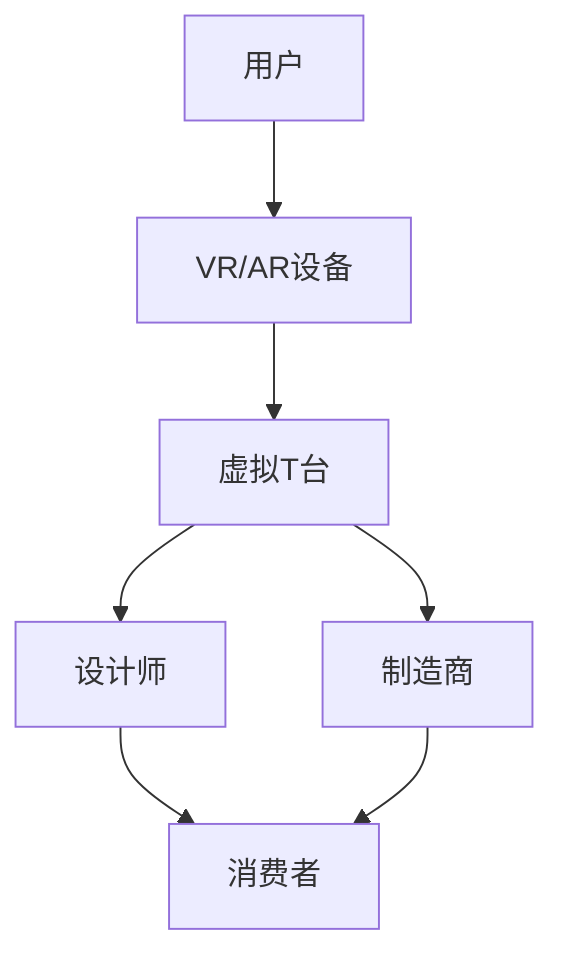

                 

关键词：虚拟现实、时尚产业、数字化、创新展示、技术变革、沉浸体验、虚拟时装秀、增强现实

> 摘要：本文深入探讨了虚拟时装周这一创新性活动，如何通过数字化技术变革全球时尚产业。从核心概念到实际应用，再到未来展望，本文旨在展示虚拟时装周在时尚产业中的重要性及其带来的深远影响。

## 1. 背景介绍

随着科技的迅猛发展，虚拟现实（VR）和增强现实（AR）技术逐渐渗透到各个领域，包括时尚产业。虚拟时装周作为一种全新的时装展示形式，不仅带来了视觉上的冲击，更在商业模式和用户体验上进行了创新。虚拟时装周借助先进的数字化技术，将时尚秀场从现实搬到了虚拟世界，使时尚品牌和消费者之间的互动变得更加直观和互动。

### 1.1 时尚产业的数字化进程

时尚产业一直是创新和变革的前沿阵地。在过去几十年中，数字化技术已经深刻影响了时尚产业的各个方面，包括设计、制造、销售和营销。然而，传统的时装展示方式仍然依赖于实体秀场，这种方式不仅成本高昂，而且受限于时间和空间。虚拟时装周的出现，为时尚产业带来了一场数字化革命。

### 1.2 虚拟现实技术的崛起

虚拟现实技术以其沉浸式的体验，为用户带来了前所未有的视觉冲击和互动性。通过VR头盔和移动设备，用户可以身临其境地浏览时装秀，与模特互动，甚至参与到时尚设计过程中。这种全新的体验方式，不仅提升了用户的参与感，也为时尚品牌创造了更多的营销机会。

## 2. 核心概念与联系

### 2.1 虚拟现实与增强现实

虚拟现实（VR）和增强现实（AR）是两种不同的技术，但它们在时尚产业中的应用具有很高的互补性。

**虚拟现实（VR）：** VR技术通过模拟出一个完全虚拟的环境，使用户可以沉浸其中。在虚拟时装周中，VR技术可以创建一个虚拟的T台，让用户仿佛置身于现实中的秀场。用户可以通过VR头盔或移动设备，自由地探索这个虚拟环境，与模特互动，甚至参与设计。

**增强现实（AR）：** AR技术则是在现实世界的基础上叠加虚拟元素。在虚拟时装周中，AR技术可以将虚拟时装展示在用户的现实环境中。例如，用户可以通过AR应用程序，将虚拟时装模型投影到自己的身体上，体验不同的穿搭效果。

### 2.2 数字化技术与时尚产业的融合

数字化技术不仅改变了时尚产业的展示方式，也改变了时尚设计的流程和商业模式。通过数字化技术，设计师可以更快地生成和修改设计，制造商可以更准确地生产，而消费者可以更直观地体验和购买。

### 2.3 Mermaid流程图

下面是一个简单的Mermaid流程图，展示了虚拟时装周的核心概念和联系：



## 3. 核心算法原理 & 具体操作步骤

### 3.1 算法原理概述

虚拟时装周的实现离不开一系列核心算法的支撑。这些算法主要包括：

- **3D建模与渲染：** 通过3D建模软件创建时装和秀场模型，然后利用渲染技术将其可视化。
- **交互算法：** 实现用户与虚拟环境的交互，如用户导航、选择服装等。
- **实时更新算法：** 实现虚拟时装秀的实时更新，如模特动作、灯光效果等。

### 3.2 算法步骤详解

#### 3.2.1 3D建模与渲染

1. **3D建模：** 使用专业软件如Maya或Blender创建时装和秀场模型。
2. **纹理贴图：** 为模型添加纹理贴图，使其更加逼真。
3. **光照设置：** 设置虚拟环境的光照效果，增强视觉效果。

#### 3.2.2 交互算法

1. **用户输入：** 通过VR头盔或移动设备捕捉用户的输入。
2. **动作识别：** 分析用户输入，将其转化为虚拟环境中的动作。
3. **响应处理：** 根据用户动作，更新虚拟环境。

#### 3.2.3 实时更新算法

1. **动作捕捉：** 使用动作捕捉设备记录模特的动作。
2. **实时渲染：** 根据动作捕捉数据，实时渲染模特的动作。
3. **灯光效果：** 根据秀场环境和用户位置，实时调整灯光效果。

### 3.3 算法优缺点

#### 优点：

- **沉浸式体验：** 用户可以身临其境地体验时装秀，增强参与感。
- **实时更新：** 可以实时更新模特动作和灯光效果，提升视觉体验。
- **跨平台兼容：** 可以通过VR头盔和移动设备访问，兼容多种平台。

#### 缺点：

- **技术门槛高：** 需要较高的技术支持和设备投入。
- **网络要求高：** 实时传输需要高速网络支持。

### 3.4 算法应用领域

虚拟时装周的算法不仅适用于时尚产业，还可以广泛应用于其他领域，如：

- **虚拟旅游：** 用户可以虚拟参观名胜古迹。
- **虚拟教育：** 学生可以虚拟参观博物馆、实验室等。
- **虚拟娱乐：** 用户可以虚拟参与游戏、演唱会等。

## 4. 数学模型和公式 & 详细讲解 & 举例说明

### 4.1 数学模型构建

虚拟时装周的实现涉及多个数学模型，主要包括：

- **3D建模：** 使用三维空间坐标系和几何形状构建模型。
- **渲染：** 使用光照模型和透视模型实现渲染。
- **交互：** 使用向量运算和矩阵变换实现用户交互。

### 4.2 公式推导过程

以下是3D建模和渲染中的一些基本公式：

#### 3D建模：

- **坐标系转换：**  
  $$\begin{cases}
  x' = x \cos \theta - y \sin \theta \\
  y' = x \sin \theta + y \cos \theta
  \end{cases}$$

- **旋转矩阵：**  
  $$R(\theta) = \begin{pmatrix}
  \cos \theta & -\sin \theta \\
  \sin \theta & \cos \theta
  \end{pmatrix}$$

#### 渲染：

- **光照模型：**  
  $$I = k_d \cdot \max(0, \frac{n \cdot l}{d}) + k_s \cdot \max(0, \frac{r \cdot v}{d})^p$$

其中，$I$ 为光照强度，$k_d$ 和 $k_s$ 分别为漫反射和镜面反射系数，$n$ 为法线向量，$l$ 为光源方向，$r$ 为反射向量，$v$ 为观察者方向，$d$ 为光源到物体表面的距离，$p$ 为高光指数。

### 4.3 案例分析与讲解

以下是一个简单的案例，展示如何使用数学模型实现3D建模和渲染。

#### 案例描述：

创建一个简单的立方体，并对其施加一个旋转操作，然后渲染出来。

#### 步骤：

1. **创建立方体：** 定义立方体的八个顶点坐标。
2. **旋转操作：** 使用旋转矩阵对立方体进行旋转。
3. **渲染：** 使用光照模型和透视模型渲染立方体。

#### 代码示例：

```python
import numpy as np
import matplotlib.pyplot as plt

# 定义立方体顶点
vertices = np.array([
    [-1, -1, -1],
    [1, -1, -1],
    [1, 1, -1],
    [-1, 1, -1],
    [-1, -1, 1],
    [1, -1, 1],
    [1, 1, 1],
    [-1, 1, 1]
])

# 旋转矩阵
R = np.array([
    [1, 0, 0],
    [0, np.cos(np.pi/4), -np.sin(np.pi/4)],
    [0, np.sin(np.pi/4), np.cos(np.pi/4)]
])

# 旋转操作
rotated_vertices = R @ vertices

# 渲染立方体
fig = plt.figure()
ax = fig.add_subplot(111, projection='3d')
ax.scatter(rotated_vertices[:, 0], rotated_vertices[:, 1], rotated_vertices[:, 2])
plt.show()
```

## 5. 项目实践：代码实例和详细解释说明

### 5.1 开发环境搭建

要实现虚拟时装周，首先需要搭建一个合适的开发环境。以下是搭建过程的简要说明：

1. **硬件要求：** VR头盔（如Oculus Rift或HTC Vive）、高性能计算机、动作捕捉设备。
2. **软件要求：** 3D建模软件（如Maya或Blender）、VR/AR开发平台（如Unity或Unreal Engine）。
3. **开发工具：** Python、C++或JavaScript等编程语言。

### 5.2 源代码详细实现

以下是一个简单的虚拟时装周项目，使用Unity引擎实现。

#### 5.2.1 项目结构

```
VirtualFashionWeek/
|-- Assets/
|   |-- Models/
|   |-- Scripts/
|   |-- Textures/
|-- Scenes/
|   |-- Main.unity
|-- ProjectSettings/
```

#### 5.2.2 源代码实现

**Main.unity：** 主场景文件，用于创建和配置虚拟T台。

```csharp
using UnityEngine;

public class Main : MonoBehaviour
{
    public GameObject virtualTent;
    public Material tentMaterial;

    void Start()
    {
        // 创建虚拟T台
        GameObject tent = Instantiate(virtualTent);

        // 配置T台材质
        tentMaterial.mainTexture = Resources.Load<Texture2D>("tent_texture");
        tent.GetComponent<MeshRenderer>().material = tentMaterial;
    }
}
```

**TentController.cs：** 控制虚拟T台的旋转和缩放。

```csharp
using UnityEngine;

public class TentController : MonoBehaviour
{
    public float rotationSpeed = 50.0f;
    public float scaleSpeed = 0.1f;

    void Update()
    {
        // 旋转T台
        transform.Rotate(new Vector3(0, rotationSpeed * Time.deltaTime, 0));

        // 缩放T台
        transform.localScale += new Vector3(scaleSpeed * Time.deltaTime, scaleSpeed * Time.deltaTime, scaleSpeed * Time.deltaTime);
    }
}
```

**FashionModel.cs：** 控制时装模型的展示。

```csharp
using UnityEngine;

public class FashionModel : MonoBehaviour
{
    public GameObject modelPrefab;
    public Material modelMaterial;

    void Start()
    {
        // 创建时装模型
        GameObject model = Instantiate(modelPrefab);

        // 配置模型材质
        modelMaterial.mainTexture = Resources.Load<Texture2D>("model_texture");
        model.GetComponent<MeshRenderer>().material = modelMaterial;
    }
}
```

### 5.3 代码解读与分析

**Main.unity：** 主场景文件用于创建虚拟T台和配置材质。通过Instantiate方法创建虚拟T台对象，并使用自定义材质替换默认材质。

**TentController.cs：** 通过Update方法实现T台的旋转和缩放。旋转使用Rotate方法，缩放使用Transform组件的localScale属性。

**FashionModel.cs：** 创建时装模型对象，并使用自定义材质替换默认材质。这样，用户可以在虚拟环境中展示不同的时装模型。

### 5.4 运行结果展示

运行Unity项目，用户可以在虚拟环境中看到旋转和缩放的虚拟T台，以及展示时装模型的虚拟空间。通过VR头盔，用户可以沉浸式地体验虚拟时装周。

## 6. 实际应用场景

### 6.1 时尚品牌的宣传与推广

虚拟时装周为时尚品牌提供了一个全新的宣传平台。通过虚拟现实技术，品牌可以以较低的成本进行全球范围内的推广活动。例如，巴黎时装周的一些品牌已经开始使用虚拟时装周来吸引全球各地的粉丝和媒体。

### 6.2 设计师的工作流程

虚拟时装周改变了时尚设计师的工作方式。设计师可以在虚拟环境中快速生成和修改设计，提高设计效率。此外，虚拟时装周也为设计师提供了一个与消费者互动的平台，设计师可以直接获取消费者的反馈，进一步优化设计。

### 6.3 消费者的购物体验

虚拟时装周为消费者提供了一个全新的购物体验。消费者可以通过虚拟现实技术，在家中尝试不同的时装搭配，了解最新的流行趋势。这种方式不仅方便了消费者，也为时尚品牌带来了更多的销售机会。

## 7. 未来应用展望

### 7.1 虚拟现实与增强现实技术的进一步融合

未来，虚拟现实和增强现实技术将进一步融合，为用户带来更加真实的沉浸式体验。例如，虚拟现实技术可以与增强现实技术结合，实现更加灵活的交互方式，如手势识别和语音控制。

### 7.2 跨界合作的创新

虚拟时装周的未来将充满跨界合作的机会。例如，虚拟时装周可以与虚拟旅游、虚拟教育等领域结合，为用户带来全新的体验。此外，虚拟时装周还可以与社交媒体平台合作，实现线上线下互动，进一步提升用户体验。

### 7.3 人工智能的辅助设计

人工智能技术在虚拟时装周中的应用将进一步提升设计效率。例如，通过人工智能算法，设计师可以自动生成时尚设计，为用户提供更多的选择。此外，人工智能还可以分析消费者的购物行为，为品牌提供精准的营销策略。

## 8. 工具和资源推荐

### 8.1 学习资源推荐

- **《虚拟现实技术原理与应用》**：全面介绍虚拟现实技术的原理和应用。
- **《增强现实技术导论》**：系统讲解增强现实技术的基础知识和应用。
- **《Unity官方文档》**：Unity引擎是虚拟现实和增强现实开发的重要工具，官方文档提供了详细的开发指南。

### 8.2 开发工具推荐

- **Unity引擎**：一款功能强大的游戏引擎，支持虚拟现实和增强现实开发。
- **Unreal Engine**：一款高度优化的游戏引擎，提供强大的视觉效果和物理引擎。
- **Blender**：一款开源的3D建模和渲染软件，适合初学者和专业人士。

### 8.3 相关论文推荐

- **“Virtual Fashion Show: A New Paradigm for the Fashion Industry”**：探讨了虚拟时装秀对时尚产业的影响。
- **“The Impact of Virtual Reality on Consumer Behavior in the Fashion Industry”**：分析了虚拟现实技术对消费者购物行为的影响。
- **“Enhancing User Experience in Virtual Reality Fashion Show Platforms”**：研究了如何提升虚拟时装秀的用户体验。

## 9. 总结：未来发展趋势与挑战

### 9.1 研究成果总结

虚拟时装周作为数字化技术变革的产物，已经在时尚产业中取得了显著成果。通过虚拟现实和增强现实技术，时尚品牌可以更高效地进行宣传和推广，设计师可以更灵活地进行设计和创作，消费者可以更直观地体验和购买。

### 9.2 未来发展趋势

未来，虚拟时装周将继续向更加沉浸式和互动性的方向发展。随着技术的不断进步，虚拟时装周将涵盖更广泛的领域，如虚拟旅游、虚拟教育等。此外，人工智能的辅助设计也将进一步提升设计效率和用户体验。

### 9.3 面临的挑战

虚拟时装周在发展过程中也面临着一些挑战。首先，技术门槛较高，需要专业的技术团队和设备投入。其次，用户体验的提升仍需进一步优化，如何提高虚拟环境的真实感和互动性是亟待解决的问题。

### 9.4 研究展望

未来，虚拟时装周的研究将重点关注以下几个方面：

- **技术优化**：通过算法优化和硬件升级，提高虚拟时装秀的视觉效果和互动性。
- **跨界合作**：与其他领域结合，实现更广泛的商业应用。
- **用户研究**：深入分析消费者行为，优化用户体验。

## 10. 附录：常见问题与解答

### 10.1 虚拟时装周需要哪些硬件设备？

虚拟时装周需要以下硬件设备：

- **VR头盔**：如Oculus Rift、HTC Vive等。
- **动作捕捉设备**：用于捕捉模特的动作。
- **高性能计算机**：用于处理虚拟环境中的大量数据。

### 10.2 虚拟时装周的实现需要哪些技术？

虚拟时装周的实现需要以下技术：

- **3D建模与渲染**：用于创建虚拟环境。
- **虚拟现实技术**：实现沉浸式体验。
- **增强现实技术**：将虚拟元素叠加在现实环境中。
- **交互算法**：实现用户与虚拟环境的互动。

### 10.3 虚拟时装周如何提升用户体验？

提升虚拟时装周用户体验可以从以下几个方面入手：

- **优化视觉效果**：使用高质量的纹理贴图和光照效果。
- **提高互动性**：增加用户与虚拟环境的互动方式，如手势识别和语音控制。
- **个性化推荐**：根据用户行为和偏好，提供个性化的时尚推荐。

作者：禅与计算机程序设计艺术 / Zen and the Art of Computer Programming
----------------------------------------------------------------

### 关键词 Keyword

虚拟时装周，虚拟现实，增强现实，数字化，时尚产业，技术创新，用户体验，沉浸式体验，交互设计。

### 摘要 Abstract

本文探讨了虚拟时装周这一创新性活动，如何通过虚拟现实和增强现实技术，变革全球时尚产业。从核心概念、算法原理、实际应用，到未来展望，本文全面展示了虚拟时装周的重要性和影响。文章旨在为读者提供对这一领域深入的理解，并展望其未来的发展趋势与挑战。

