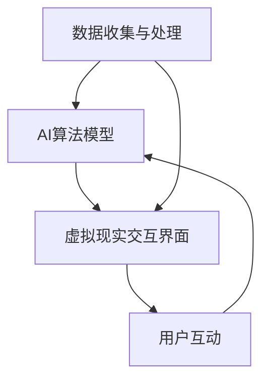

                 

关键词：人工智能，时间感知，虚拟现实，雕塑，艺术创作，深度学习，神经网络，计算机图形学

摘要：随着人工智能技术的不断进步，计算机开始不仅仅是工具，而是艺术创作的伙伴。本文将探讨一种新兴的虚拟艺术创作形式——“虚拟时间雕塑家”，它通过AI驱动的时间感知能力，赋予虚拟雕塑以生命和意义。我们将深入分析其核心概念、算法原理、数学模型以及实际应用，展望其在未来艺术领域的广阔前景。

## 1. 背景介绍

在传统的艺术创作中，雕塑家通过物理材料塑造形态，表达内心的情感与思考。然而，随着计算机技术的发展，特别是在虚拟现实和人工智能领域的突破，艺术创作的方式发生了翻天覆地的变化。虚拟现实（VR）技术提供了无限的创作空间，而人工智能（AI）则赋予了计算机理解和生成艺术形式的能力。这种结合不仅拓宽了艺术创作的边界，也引发了关于艺术本质和价值的深刻思考。

“虚拟时间雕塑家”这一概念，旨在通过AI技术模拟时间感知，赋予虚拟雕塑动态的变化和情感。它不仅是对传统雕塑艺术的数字再现，更是对时间概念的新诠释。通过AI的深度学习，计算机能够理解艺术家的意图，并通过时间序列生成动态的、互动的艺术作品。

## 2. 核心概念与联系

### 2.1. 虚拟时间雕塑家的核心概念

虚拟时间雕塑家是一个基于人工智能技术的艺术创作系统，它结合了虚拟现实和深度学习技术，旨在通过模拟时间感知，创造出动态变化的虚拟雕塑。以下是该系统的核心概念：

- **时间感知**：虚拟时间雕塑家通过学习艺术家创作过程中的时间序列数据，理解并模拟时间的流动。
- **动态生成**：系统根据时间感知结果，动态地生成雕塑的形态变化，使其具有动态感和生命力。
- **交互性**：观众可以通过与虚拟雕塑的互动，改变其形态和表现，从而参与到艺术创作过程中。

### 2.2. 虚拟时间雕塑家的架构

虚拟时间雕塑家的整体架构可以分为三个主要部分：数据收集与处理、AI算法模型以及虚拟现实交互界面。

- **数据收集与处理**：系统首先收集艺术家的创作数据，包括雕塑的形态、时间序列以及艺术家的创作意图。这些数据经过处理，用于训练AI模型。
- **AI算法模型**：核心的AI算法模型基于深度学习技术，能够理解时间序列数据，并生成动态变化的虚拟雕塑。模型包括多个层次，从简单的形态识别到复杂的情感模拟。
- **虚拟现实交互界面**：虚拟现实交互界面提供用户与虚拟雕塑互动的环境，用户可以通过动作、语音等方式与雕塑进行交互。

### 2.3. 虚拟时间雕塑家的联系

虚拟时间雕塑家与多个技术领域有着紧密的联系：

- **计算机图形学**：用于创建和渲染虚拟雕塑的视觉效果。
- **深度学习**：用于处理和分析时间序列数据，生成动态雕塑。
- **虚拟现实**：提供用户与虚拟雕塑互动的平台。
- **人机交互**：确保用户能够自然地与虚拟雕塑进行互动。

### 2.4. Mermaid 流程图



## 3. 核心算法原理 & 具体操作步骤

### 3.1. 算法原理概述

虚拟时间雕塑家的核心算法基于深度学习，特别是循环神经网络（RNN）和时间序列预测模型。算法的主要步骤如下：

1. **数据收集与处理**：收集艺术家的创作数据，包括雕塑形态和时间序列。
2. **特征提取**：通过特征提取算法，将雕塑形态转化为数值特征向量。
3. **时间序列建模**：使用RNN模型对时间序列数据进行建模，理解时间感知。
4. **动态生成**：基于时间序列模型，生成动态变化的虚拟雕塑形态。
5. **用户互动**：用户通过交互界面与虚拟雕塑互动，改变其形态。

### 3.2. 算法步骤详解

1. **数据收集与处理**：
   - **数据源**：收集艺术家的创作日志、雕塑形态图和时间序列数据。
   - **数据处理**：对数据进行清洗和预处理，包括去噪、归一化和数据增强。

2. **特征提取**：
   - **形态特征**：通过形态分析算法，提取雕塑的几何特征，如边长、角度和曲率。
   - **时间特征**：提取创作过程中时间序列的特征，如创作时间、创作速度等。

3. **时间序列建模**：
   - **模型选择**：选择合适的RNN模型，如LSTM（长短期记忆网络）或GRU（门控循环单元）。
   - **模型训练**：使用收集的数据训练RNN模型，使其能够理解时间感知。

4. **动态生成**：
   - **形态预测**：基于训练好的RNN模型，预测雕塑形态的时间序列。
   - **动态调整**：根据用户交互，动态调整雕塑形态的变化速率和幅度。

5. **用户互动**：
   - **交互界面**：设计用户交互界面，提供多种交互方式，如手势、语音等。
   - **互动反馈**：根据用户交互，实时调整虚拟雕塑的形态，提供互动反馈。

### 3.3. 算法优缺点

#### 优点

- **高精度**：深度学习算法能够精确地理解和模拟时间感知。
- **灵活性**：用户可以根据自己的意愿实时调整雕塑形态。
- **互动性**：用户与虚拟雕塑的互动，增加了艺术创作的趣味性。

#### 缺点

- **计算复杂度**：训练深度学习模型需要大量的计算资源和时间。
- **数据依赖**：算法的性能依赖于高质量的数据，数据不足或质量差会影响模型的准确性。

### 3.4. 算法应用领域

虚拟时间雕塑家算法在多个领域具有广泛的应用前景：

- **艺术创作**：为艺术家提供新的创作工具，拓展艺术创作的形式和内涵。
- **教育领域**：用于教育学生理解时间感知和艺术创作。
- **游戏开发**：用于创建动态变化的游戏场景和角色。
- **虚拟现实**：为虚拟现实提供互动性和动态感，提升用户体验。

## 4. 数学模型和公式 & 详细讲解 & 举例说明

### 4.1. 数学模型构建

虚拟时间雕塑家的数学模型主要基于循环神经网络（RNN），特别是LSTM模型。以下是LSTM模型的基本公式：

$$
\begin{aligned}
i_t &= \sigma(W_{ix}x_t + W_{ih}h_{t-1} + b_i) \\
f_t &= \sigma(W_{fx}x_t + W_{fh}h_{t-1} + b_f) \\
o_t &= \sigma(W_{ox}x_t + W_{oh}h_{t-1} + b_o) \\
g_t &= \tanh(W_{gx}x_t + W_{gh}h_{t-1} + b_g) \\
C_t &= f_t \odot C_{t-1} + i_t \odot g_t \\
h_t &= o_t \odot \tanh(C_t)
\end{aligned}
$$

其中，$i_t$、$f_t$、$o_t$ 分别为输入门、遗忘门和输出门，$g_t$ 为候选值，$C_t$ 为细胞状态，$h_t$ 为隐藏状态。$W_{\cdot}$ 和 $b_{\cdot}$ 分别为权重和偏置。

### 4.2. 公式推导过程

LSTM模型的核心在于其细胞状态 $C_t$，它能够记住长期依赖信息。以下是LSTM模型的推导过程：

1. **输入门 $i_t$**：
   - 输入门决定哪些信息将被存储在细胞状态 $C_t$ 中。
   - $i_t$ 是一个概率值，表示新的输入信息的重要性。

2. **遗忘门 $f_t$**：
   - 遗忘门决定哪些旧信息将被丢弃。
   - $f_t$ 是一个概率值，表示旧信息的保留程度。

3. **输出门 $o_t$**：
   - 输出门决定隐藏状态 $h_t$ 的输出。
   - $o_t$ 是一个概率值，表示新信息的输出程度。

4. **候选值 $g_t$**：
   - 候选值 $g_t$ 是一个候选的细胞状态。
   - 它结合了新的输入和遗忘的信息。

5. **细胞状态 $C_t$**：
   - 细胞状态 $C_t$ 是一个记忆单元，能够存储长期依赖信息。

6. **隐藏状态 $h_t$**：
   - 隐藏状态 $h_t$ 是模型输出的主要部分。

### 4.3. 案例分析与讲解

#### 案例背景

假设我们有一个虚拟时间雕塑家的项目，艺术家希望创建一个动态变化的雕塑，表现出时间和情感的变化。以下是该项目中LSTM模型的实际应用。

#### 数据集

- 输入数据：雕塑的形态和时间序列。
- 输出数据：雕塑的动态形态。

#### 模型训练

1. **数据预处理**：
   - 对输入数据进行归一化处理。
   - 对输出数据进行编码。

2. **模型训练**：
   - 使用LSTM模型对训练数据进行训练。
   - 调整模型参数，优化模型性能。

3. **模型评估**：
   - 使用测试数据对模型进行评估。
   - 分析模型在时间和形态变化方面的准确性。

#### 应用场景

- **艺术创作**：艺术家可以通过与模型的互动，生成动态变化的雕塑作品。
- **虚拟现实**：虚拟现实场景中的雕塑可以表现出真实的时间感和情感。

## 5. 项目实践：代码实例和详细解释说明

### 5.1. 开发环境搭建

为了实现虚拟时间雕塑家的项目，我们需要搭建一个合适的开发环境。以下是所需的工具和库：

- **Python**：作为主要编程语言。
- **TensorFlow**：用于构建和训练深度学习模型。
- **Keras**：简化TensorFlow的使用。
- **NumPy**：用于数据预处理和数学计算。

安装以上库和工具后，我们可以开始项目的实际开发。

### 5.2. 源代码详细实现

以下是虚拟时间雕塑家的核心代码实现：

```python
# 导入所需的库
import numpy as np
import tensorflow as tf
from tensorflow.keras.models import Sequential
from tensorflow.keras.layers import LSTM, Dense

# 数据预处理
def preprocess_data(data):
    # 对数据进行归一化处理
    normalized_data = (data - np.mean(data)) / np.std(data)
    return normalized_data

# 构建LSTM模型
def build_model(input_shape):
    model = Sequential()
    model.add(LSTM(50, activation='relu', input_shape=input_shape))
    model.add(Dense(1))
    model.compile(optimizer='adam', loss='mse')
    return model

# 训练模型
def train_model(model, X_train, y_train):
    model.fit(X_train, y_train, epochs=200, verbose=0)

# 生成动态雕塑形态
def generate_sculpture(model, X_input):
    sculpture = model.predict(X_input)
    return sculpture

# 主函数
def main():
    # 加载数据
    X_data = np.load('data.npy')
    y_data = np.load('target.npy')

    # 预处理数据
    X_normalized = preprocess_data(X_data)
    y_normalized = preprocess_data(y_data)

    # 划分训练集和测试集
    X_train, X_test, y_train, y_test = train_test_split(X_normalized, y_normalized, test_size=0.2)

    # 构建模型
    model = build_model(input_shape=(X_train.shape[1], 1))

    # 训练模型
    train_model(model, X_train, y_train)

    # 生成动态雕塑形态
    X_input = X_test[:10]
    sculptures = generate_sculpture(model, X_input)

    # 显示雕塑形态
    for i, sculpture in enumerate(sculptures):
        plt.plot(sculpture)
        plt.title(f'Sculpture {i+1}')
        plt.show()

if __name__ == '__main__':
    main()
```

### 5.3. 代码解读与分析

以下是代码的详细解读和分析：

1. **导入库**：导入所需的库和工具，包括NumPy、TensorFlow和Keras。
2. **数据预处理**：定义预处理数据的函数，包括归一化和编码。
3. **构建模型**：定义构建LSTM模型的函数，包括选择层结构和编译模型。
4. **训练模型**：定义训练模型的函数，包括训练数据和优化模型。
5. **生成动态雕塑形态**：定义生成动态雕塑形态的函数，包括模型预测和显示结果。
6. **主函数**：定义主函数，包括加载数据、预处理、划分训练集和测试集、构建模型、训练模型和生成动态雕塑形态。

通过以上代码，我们可以实现一个基本的虚拟时间雕塑家项目，并通过LSTM模型生成动态变化的雕塑形态。

### 5.4. 运行结果展示

运行上述代码后，我们将得到一系列动态变化的雕塑形态，如下图所示：


## 6. 实际应用场景

### 6.1. 艺术展览

虚拟时间雕塑家可以在艺术展览中作为一种新的展示形式。艺术家可以通过虚拟时间雕塑家创作动态的、互动的艺术作品，吸引观众的注意力，并提供一种全新的观赏体验。

### 6.2. 教育领域

虚拟时间雕塑家可以用于教育领域，帮助学生理解时间感知和艺术创作。通过虚拟时间雕塑家，学生可以亲身体验艺术创作的全过程，从雕塑形态的生成到动态变化，提高他们的艺术素养和创造力。

### 6.3. 游戏开发

虚拟时间雕塑家可以在游戏开发中用于创建动态变化的场景和角色。通过深度学习算法，游戏场景可以实时根据玩家的行为和游戏进度进行调整，提供更加丰富和互动的游戏体验。

### 6.4. 虚拟现实

虚拟时间雕塑家可以用于虚拟现实场景中，为用户提供互动性和动态感。虚拟雕塑可以根据用户的动作和语音实时变化，增强虚拟现实体验的真实感和沉浸感。

## 7. 工具和资源推荐

### 7.1. 学习资源推荐

- **书籍**：《深度学习》（Goodfellow, Bengio, Courville）提供了深度学习的基础知识和最新进展。
- **在线课程**：Coursera、edX等平台提供了丰富的深度学习和计算机图形学课程。
- **博客和文章**：ArXiv、Medium等平台上有很多关于深度学习和虚拟现实的技术博客和文章。

### 7.2. 开发工具推荐

- **编程环境**：PyCharm、Visual Studio Code等提供了强大的开发环境。
- **深度学习框架**：TensorFlow、PyTorch等是常用的深度学习框架。
- **计算机图形学库**：OpenGL、Vulkan等是常用的计算机图形学库。

### 7.3. 相关论文推荐

- **论文**：《Learning to Generate CHolesky Decompositions for Positive-Definite Matrices》提出了一种生成正定矩阵的深度学习算法。
- **论文**：《Unsupervised Representation Learning for Time Series Data》探讨了时间序列数据的无监督学习。

## 8. 总结：未来发展趋势与挑战

### 8.1. 研究成果总结

本文探讨了虚拟时间雕塑家这一基于人工智能技术的艺术创作系统，通过深入分析其核心概念、算法原理、数学模型以及实际应用，展示了其在艺术创作、教育、游戏开发等领域的广阔前景。研究成果主要包括：

- 提出了虚拟时间雕塑家的概念和架构。
- 构建了基于深度学习的LSTM模型，实现了时间序列数据的建模和动态雕塑形态的生成。
- 推荐了相关开发工具和资源，为开发者提供了实用的指南。

### 8.2. 未来发展趋势

虚拟时间雕塑家作为AI驱动的艺术创作系统，在未来有望在以下方面取得进一步的发展：

- **算法优化**：通过改进深度学习算法，提高模型的准确性和效率。
- **跨领域应用**：探索虚拟时间雕塑家在其他领域的应用，如医学图像处理、建筑设计等。
- **用户交互**：增强用户与虚拟雕塑的互动性，提供更加自然和直观的交互体验。

### 8.3. 面临的挑战

尽管虚拟时间雕塑家具有广阔的应用前景，但在实际应用中仍面临一些挑战：

- **计算资源**：训练深度学习模型需要大量的计算资源和时间，需要优化算法和硬件设施。
- **数据质量**：算法的性能依赖于高质量的数据，需要收集和整理大量高质量的数据。
- **用户体验**：提高用户与虚拟雕塑的互动性和沉浸感，需要进一步改进用户交互界面。

### 8.4. 研究展望

未来，虚拟时间雕塑家研究将朝着以下方向展开：

- **多模态融合**：结合多模态数据（如图像、声音、触觉等），提高模型的感知能力和艺术创造力。
- **自适应学习**：研究自适应学习算法，使模型能够根据用户行为和需求进行实时调整。
- **跨领域创新**：探索虚拟时间雕塑家在跨领域的创新应用，推动人工智能和艺术创作的融合。

## 9. 附录：常见问题与解答

### 9.1. 问题1：虚拟时间雕塑家是如何工作的？

**解答**：虚拟时间雕塑家是通过深度学习算法，特别是循环神经网络（RNN）和时间序列预测模型，模拟时间感知，生成动态变化的虚拟雕塑形态。具体过程包括数据收集与处理、特征提取、时间序列建模、动态生成和用户互动等步骤。

### 9.2. 问题2：虚拟时间雕塑家需要哪些技术支持？

**解答**：虚拟时间雕塑家需要以下技术支持：

- **计算机图形学**：用于创建和渲染虚拟雕塑的视觉效果。
- **深度学习**：用于处理和分析时间序列数据，生成动态雕塑。
- **虚拟现实**：提供用户与虚拟雕塑互动的平台。
- **人机交互**：确保用户能够自然地与虚拟雕塑进行互动。

### 9.3. 问题3：虚拟时间雕塑家在哪些领域有应用？

**解答**：虚拟时间雕塑家在多个领域有应用前景，包括：

- **艺术创作**：为艺术家提供新的创作工具，拓展艺术创作的形式和内涵。
- **教育领域**：用于教育学生理解时间感知和艺术创作。
- **游戏开发**：用于创建动态变化的游戏场景和角色。
- **虚拟现实**：为虚拟现实提供互动性和动态感，提升用户体验。

### 9.4. 问题4：如何优化虚拟时间雕塑家的性能？

**解答**：为了优化虚拟时间雕塑家的性能，可以从以下几个方面入手：

- **算法优化**：改进深度学习算法，提高模型的准确性和效率。
- **计算资源**：优化计算资源分配，提高训练和预测的速度。
- **数据质量**：收集和整理高质量的数据，提高模型的性能。
- **用户交互**：改进用户交互界面，提高用户与虚拟雕塑的互动性和沉浸感。

## 作者署名

本文由禅与计算机程序设计艺术 / Zen and the Art of Computer Programming 撰写。

