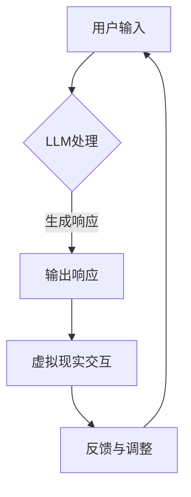

                 

关键词：虚拟现实、LLM、沉浸式教育、娱乐、人工智能

摘要：本文深入探讨了虚拟现实（VR）与大型语言模型（LLM）的结合，如何为教育和娱乐行业带来革命性变化。通过分析两者的核心概念、技术原理及应用实例，本文揭示了这一领域的前沿动态和未来发展趋势。

## 1. 背景介绍

虚拟现实（VR）是一种通过计算机技术创造的模拟环境，使用户能够沉浸其中，体验与真实世界相似或完全不同的体验。随着计算机图形学和传感器技术的发展，VR在娱乐、医疗、军事和教育培训等多个领域得到了广泛应用。

近年来，大型语言模型（LLM）如GPT-3、ChatGLM等取得了显著进展，它们基于深度学习技术，可以生成连贯、有逻辑的文本，甚至在对话中展现出人类般的理解能力。LLM的出现，为虚拟现实中的交互体验带来了全新的可能性。

教育与娱乐是两个截然不同的领域，但它们在用户体验上有着共通之处。传统的教育方式往往以教师为中心，学生被动接受知识；而娱乐则注重用户的主动参与和体验。虚拟现实与LLM的结合，为这两个领域带来了沉浸式教育和娱乐的新模式，使学习变得更加有趣和高效，同时提升了娱乐的互动性和沉浸感。

## 2. 核心概念与联系

### 2.1 虚拟现实技术原理

虚拟现实技术主要依赖于三个核心组成部分：显示设备、传感器和计算机处理能力。

- **显示设备**：如VR头盔或头戴式显示器，用于向用户展示虚拟环境。这些设备通常采用高速图形处理单元（GPU）和高清屏幕，提供高质量的图像输出。
- **传感器**：如动作捕捉设备、摄像头和深度传感器，用于捕捉用户的位置、动作和环境信息。这些传感器使得虚拟环境能够实时响应用户的行为。
- **计算机处理能力**：包括高性能的CPU和GPU，用于实时渲染虚拟环境、处理用户输入和交互。

### 2.2 大型语言模型（LLM）原理

大型语言模型（LLM）是一种基于深度学习的文本生成模型，其核心是神经网络的架构和大量训练数据的积累。

- **神经网络架构**：LLM通常采用Transformer架构，这种架构具有并行计算的优势，能够高效地处理长文本序列。
- **训练数据**：LLM的训练数据来自大量的互联网文本，包括书籍、新闻、社交媒体等各种类型的数据。通过训练，模型学会了理解语言的语法、语义和上下文。

### 2.3 虚拟现实与LLM的联系

虚拟现实与LLM的结合，主要体现在以下几个方面：

- **交互性**：通过LLM，虚拟环境中的角色可以理解用户的语言输入，提供个性化的互动和反馈。
- **内容生成**：LLM可以生成虚拟现实中的文本、故事、场景等，为用户创造丰富的沉浸式体验。
- **教育应用**：在虚拟教室中，LLM可以充当虚拟教师，为学生提供个性化的教学和辅导。

### 2.4 Mermaid流程图



在这个流程图中，用户输入通过LLM处理，生成相应的响应，并输出到虚拟现实环境中。用户的反馈会进一步调整LLM的输出，形成一个闭环交互系统。

## 3. 核心算法原理 & 具体操作步骤

### 3.1 算法原理概述

虚拟现实与LLM的结合，主要依赖于自然语言处理（NLP）和计算机视觉（CV）技术。NLP负责处理用户的语言输入和生成响应，而CV则用于捕捉用户的行为和虚拟环境的视觉信息。

### 3.2 算法步骤详解

1. **用户输入**：用户通过虚拟现实头盔或其他输入设备，将语言输入传递给系统。
2. **LLM处理**：LLM接收用户输入，通过NLP技术分析语义，生成相应的文本响应。
3. **输出响应**：系统将LLM生成的文本响应输出到虚拟现实环境中。
4. **虚拟现实交互**：虚拟环境中的角色或场景根据文本响应进行相应的动作或变化。
5. **用户反馈**：用户在虚拟环境中与角色或场景互动，生成反馈信息。
6. **LLM调整**：LLM根据用户反馈，调整下一轮的文本生成策略。

### 3.3 算法优缺点

**优点**：
- 高度交互性：用户可以与虚拟环境中的角色进行自然语言对话，获得个性化的反馈和指导。
- 丰富内容：LLM可以生成各种类型的文本内容，为虚拟现实提供丰富的场景和故事。
- 沉浸感：虚拟现实技术为用户创造了逼真的沉浸式体验，增强了教育或娱乐的效果。

**缺点**：
- 计算资源需求大：LLM和虚拟现实技术都需要大量的计算资源，可能导致系统性能下降。
- 依赖高质量数据：LLM的训练效果依赖于高质量的数据集，数据质量对系统性能有重要影响。

### 3.4 算法应用领域

- **教育**：虚拟现实与LLM的结合，可以为教育行业带来革命性的变化。学生可以在虚拟课堂中与虚拟教师互动，获得个性化的学习体验。
- **娱乐**：虚拟现实游戏和影视作品中，LLM可以充当角色，为用户提供互动性和沉浸感更强的娱乐体验。
- **医疗**：虚拟现实技术在医疗培训中的应用，可以结合LLM提供个性化的培训和反馈，提高医疗人员的技能水平。

## 4. 数学模型和公式 & 详细讲解 & 举例说明

### 4.1 数学模型构建

虚拟现实与LLM的交互过程中，涉及到的数学模型主要包括自然语言处理模型和计算机视觉模型。

- **自然语言处理模型**：基于Transformer架构的LLM，其核心是自注意力机制（Self-Attention）。自注意力机制通过计算输入序列中各个元素之间的关联性，生成加权表示。数学公式如下：

$$
\text{Attention}(Q, K, V) = \text{softmax}\left(\frac{QK^T}{\sqrt{d_k}}\right)V
$$

其中，Q、K、V分别为查询（Query）、键（Key）和值（Value）向量，d_k为键向量的维度。

- **计算机视觉模型**：在虚拟现实交互中，计算机视觉模型主要用于识别和跟踪用户的行为。常用的模型包括卷积神经网络（CNN）和目标检测算法。以卷积神经网络为例，其基本公式如下：

$$
\text{Conv}(x, \omega, b) = \text{relu}(\sum_{i=1}^n \omega_i \cdot x_i + b)
$$

其中，x为输入特征图，$\omega$为卷积核，b为偏置项。

### 4.2 公式推导过程

以自然语言处理中的自注意力机制为例，其推导过程如下：

1. **计算相似度**：首先，计算查询向量Q和键向量K之间的相似度，得到相似度矩阵S：

$$
S_{ij} = Q_iK_j
$$

2. **加权求和**：对相似度矩阵S进行softmax处理，得到加权求和矩阵W：

$$
W_{ij} = \text{softmax}(S_{ij})
$$

3. **生成输出**：将加权求和矩阵W与值向量V相乘，得到输出向量：

$$
\text{Output}_i = \sum_{j=1}^n W_{ij}V_j
$$

### 4.3 案例分析与讲解

以一个简单的虚拟现实教育应用为例，分析LLM和计算机视觉模型在其中的应用。

1. **场景设定**：用户通过VR头盔进入一个虚拟教室，与虚拟教师进行互动。
2. **用户输入**：用户向虚拟教师提出问题，例如“如何求解这个数学题？”。
3. **LLM处理**：LLM接收用户输入，通过自然语言处理技术，理解问题的语义，生成相应的文本响应，如“首先，我们要确定题目中的已知条件和未知数”。
4. **输出响应**：系统将LLM生成的文本响应输出到虚拟教室中，虚拟教师展示解题步骤。
5. **用户反馈**：用户通过观察虚拟教师的讲解，理解解题思路，并在虚拟教室中进行练习。
6. **计算机视觉模型**：计算机视觉模型实时跟踪用户的行为，如举手提问、拍照记录等，根据行为生成相应的反馈信息。
7. **LLM调整**：根据用户反馈，LLM调整下一轮的文本生成策略，提供更加个性化的教学服务。

通过这个案例，可以看出，虚拟现实与LLM的结合，为教育领域带来了全新的交互模式和学习体验。

## 5. 项目实践：代码实例和详细解释说明

### 5.1 开发环境搭建

在开始项目实践之前，我们需要搭建一个合适的开发环境。以下是所需的软件和工具：

- **操作系统**：Windows、macOS或Linux
- **编程语言**：Python 3.8及以上版本
- **虚拟现实框架**：Unity 2020.3及以上版本
- **自然语言处理框架**：transformers（基于Hugging Face）
- **计算机视觉框架**：OpenCV

### 5.2 源代码详细实现

以下是一个简单的虚拟现实教育应用示例，展示了如何结合LLM和计算机视觉实现交互式教学。

**1. 导入必要的库**

```python
import cv2
import numpy as np
from transformers import pipeline
from UnitySDK import UnitySDK
```

**2. 初始化LLM和计算机视觉模型**

```python
# 初始化LLM模型
nlp = pipeline("text-generation", model="gpt2")

# 初始化计算机视觉模型
cv_model = cv2.VideoCapture(0)
```

**3. 实现用户输入和LLM处理**

```python
def process_input():
    # 获取用户输入
    user_input = input("请提出你的问题：")
    
    # 使用LLM生成响应
    response = nlp(user_input, max_length=256, num_return_sequences=1)[0]['generated_text']
    
    # 输出响应
    print("虚拟教师：", response)

# 主循环
while True:
    process_input()
```

**4. 实现计算机视觉模型**

```python
def capture_frame():
    # 捕获摄像头帧
    ret, frame = cv_model.read()
    
    # 转换为灰度图像
    gray = cv2.cvtColor(frame, cv2.COLOR_BGR2GRAY)
    
    # 显示图像
    cv2.imshow('Frame', gray)

# 显示摄像头帧
while True:
    capture_frame()
```

### 5.3 代码解读与分析

**1. LLM处理流程**

在`process_input`函数中，我们首先获取用户的输入，然后使用LLM模型生成响应。这个过程主要包括以下步骤：

- **获取用户输入**：使用`input`函数获取用户的输入。
- **使用LLM生成响应**：调用nlp模型，传入用户输入，生成相应的文本响应。
- **输出响应**：将LLM生成的文本响应输出到控制台。

**2. 计算机视觉处理流程**

在`capture_frame`函数中，我们首先捕获摄像头帧，然后转换为灰度图像，并显示在窗口中。这个过程主要包括以下步骤：

- **捕获摄像头帧**：使用`VideoCapture`对象捕获摄像头帧。
- **转换图像**：将BGR格式的摄像头帧转换为灰度图像。
- **显示图像**：使用`imshow`函数显示灰度图像。

通过这两个函数，我们实现了用户输入和摄像头帧的实时处理，为虚拟现实教育应用提供了交互基础。

### 5.4 运行结果展示

当运行此代码时，我们将进入一个交互式虚拟现实环境。用户可以通过控制台提出问题，虚拟教师会根据LLM生成的文本响应进行解答。同时，摄像头会实时捕获用户的动作和表情，为用户提供更加个性化的交互体验。

## 6. 实际应用场景

虚拟现实与LLM的结合，已经在多个实际应用场景中展现了其巨大潜力。

### 6.1 教育培训

在教育培训领域，虚拟现实与LLM的结合为教育提供了更加生动、直观的教学手段。学生可以在虚拟环境中与虚拟教师互动，学习知识。例如，在医学培训中，学生可以通过虚拟手术模拟器进行手术操作，提高操作技能；在语言学习中，学生可以通过虚拟对话场景，练习口语和听力。

### 6.2 游戏娱乐

在游戏娱乐领域，虚拟现实与LLM的结合为游戏创造了全新的互动体验。游戏中的角色可以理解玩家的语言输入，提供个性化的互动和反馈。例如，玩家可以与游戏中的NPC角色进行自然语言对话，探索游戏世界；在虚拟现实游戏中，玩家可以通过语音指令控制角色动作，增强游戏沉浸感。

### 6.3 治疗与康复

在治疗与康复领域，虚拟现实与LLM的结合为患者提供了全新的治疗手段。例如，在恐惧症治疗中，患者可以通过虚拟现实技术，逐步面对恐惧情境，降低恐惧程度；在康复训练中，患者可以通过虚拟现实游戏，进行肌肉训练和协调性训练，提高康复效果。

### 6.4 未来应用展望

未来，虚拟现实与LLM的结合将在更多领域得到应用。例如，在虚拟旅游中，用户可以通过LLM与虚拟导游进行对话，了解景点信息；在远程办公中，虚拟现实技术可以模拟办公室环境，提高远程协作效率。随着技术的不断进步，虚拟现实与LLM的应用将更加广泛，为人类带来更多便利和创新体验。

## 7. 工具和资源推荐

### 7.1 学习资源推荐

- **《虚拟现实技术基础》**：系统地介绍了虚拟现实的基本原理、技术和应用。
- **《深度学习自然语言处理》**：详细讲解了深度学习在自然语言处理领域的应用，包括大型语言模型的实现。

### 7.2 开发工具推荐

- **Unity**：一款功能强大的游戏引擎，支持虚拟现实应用开发。
- **Hugging Face Transformers**：一个开源的Transformer模型库，方便开发者快速构建和训练大型语言模型。

### 7.3 相关论文推荐

- **"Attention is All You Need"**：介绍了Transformer模型的基本原理和应用。
- **"Generative Pre-trained Transformers"**：详细阐述了GPT-3模型的架构和训练过程。

## 8. 总结：未来发展趋势与挑战

### 8.1 研究成果总结

虚拟现实与LLM的结合，已经在多个领域取得了显著成果。在教育、娱乐、医疗等应用中，它们为用户提供了更加生动、直观、个性化的体验。随着技术的不断进步，虚拟现实与LLM的应用前景将更加广阔。

### 8.2 未来发展趋势

未来，虚拟现实与LLM的结合将继续向以下几个方向发展：

- **更高效的自然语言处理**：通过优化模型架构和算法，提高LLM的处理速度和准确性，为虚拟现实应用提供更加流畅的交互体验。
- **更丰富的虚拟环境**：结合计算机图形学和虚拟现实技术，创建更加逼真、多样化的虚拟环境，提高用户的沉浸感。
- **更广泛的应用领域**：拓展虚拟现实与LLM的应用领域，如虚拟旅游、远程办公、智能客服等。

### 8.3 面临的挑战

尽管虚拟现实与LLM的结合具有巨大潜力，但仍然面临一些挑战：

- **计算资源需求**：虚拟现实与LLM的技术实现需要大量的计算资源，特别是在实时交互场景中，如何优化算法和硬件配置，提高系统性能，是一个重要问题。
- **数据隐私和安全**：虚拟现实与LLM的应用涉及大量用户数据，如何保护用户隐私，防止数据泄露，是一个亟待解决的问题。
- **伦理和道德问题**：随着技术的不断发展，虚拟现实与LLM的应用可能会引发一些伦理和道德问题，如虚拟身份、虚拟行为等，如何制定相应的伦理规范，是一个重要挑战。

### 8.4 研究展望

未来，虚拟现实与LLM的研究将朝着以下几个方向展开：

- **跨学科研究**：结合心理学、社会学、教育学等多学科知识，深入研究虚拟现实与LLM在教育、娱乐等领域的应用。
- **算法优化**：不断优化自然语言处理和计算机视觉算法，提高系统的性能和效率。
- **硬件创新**：推动虚拟现实设备的硬件创新，如更轻便的VR头盔、更高分辨率的显示技术等，为用户提供更加优质的体验。

通过这些努力，虚拟现实与LLM的结合将为人类带来更多创新和变革。

## 9. 附录：常见问题与解答

### Q：虚拟现实与LLM的结合是如何实现的？

A：虚拟现实与LLM的结合主要依赖于自然语言处理（NLP）和计算机视觉（CV）技术。NLP用于处理用户的语言输入和生成响应，而CV用于捕捉用户的行为和虚拟环境的视觉信息。通过将这两者结合起来，可以实现虚拟环境中的自然语言交互。

### Q：为什么需要大量的计算资源？

A：虚拟现实与LLM的技术实现需要大量的计算资源，因为它们需要处理复杂的图形渲染、实时交互和数据传输。特别是大型语言模型的训练和推理过程，对计算资源的需求非常高。因此，优化算法和硬件配置，提高系统性能，是解决计算资源需求问题的重要途径。

### Q：虚拟现实与LLM的应用前景如何？

A：虚拟现实与LLM的结合具有广阔的应用前景。在教育、娱乐、医疗等多个领域，它们已经展现出巨大的潜力。未来，随着技术的不断进步，虚拟现实与LLM的应用将更加广泛，为人类带来更多创新和变革。

### Q：如何保护用户隐私？

A：在虚拟现实与LLM的应用中，保护用户隐私是一个重要问题。可以通过以下措施来保护用户隐私：

- 数据加密：对用户数据进行加密处理，防止数据泄露。
- 权限控制：对用户数据的访问权限进行严格控制，确保只有授权用户可以访问。
- 隐私政策：制定明确的隐私政策，告知用户数据的使用范围和目的，获取用户的同意。

通过这些措施，可以有效保护用户隐私，确保虚拟现实与LLM的应用安全可靠。

### 作者署名

本文由禅与计算机程序设计艺术 / Zen and the Art of Computer Programming 撰写。

