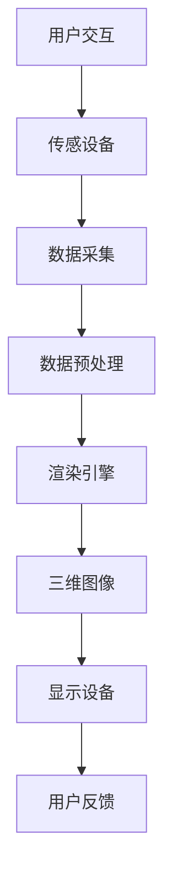
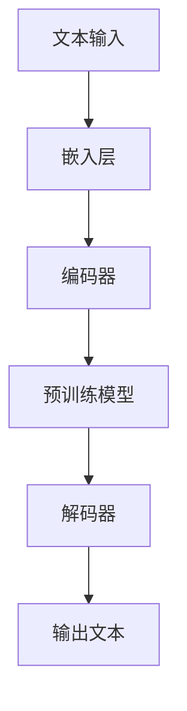
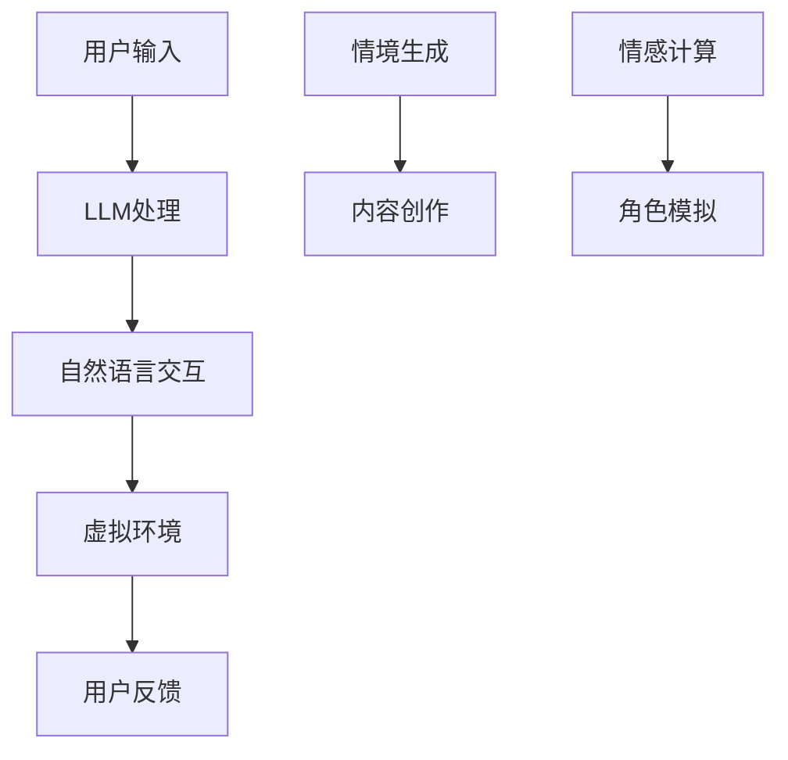

                 

关键词：虚拟现实，低延迟渲染，LLM，沉浸式教育，智能娱乐

> 摘要：本文深入探讨了虚拟现实（VR）与大型语言模型（LLM）的结合，如何通过技术革新为教育和娱乐领域带来前所未有的沉浸式体验。我们首先介绍了VR与LLM的基本概念，然后分析了两者在教育和娱乐中的应用，并讨论了未来的发展趋势与挑战。

## 1. 背景介绍

虚拟现实（Virtual Reality，VR）是一种通过计算机技术构建的模拟环境，用户可以在其中实现高度沉浸式的互动体验。近年来，随着硬件技术的进步和软件算法的优化，VR技术已经逐渐从实验室走向了商业市场。与此同时，大型语言模型（Large Language Model，LLM）作为一种基于深度学习的人工智能技术，以其强大的语言处理能力和自适应能力，正在成为自然语言处理领域的突破性进展。

在教育领域，传统教学方式往往受到时间和空间的限制，难以满足个性化、互动性和沉浸式学习的需求。而VR技术的引入，使得学生能够身临其境地体验各种历史事件、科学实验和艺术作品，从而激发学生的学习兴趣和探索欲望。LLM的加入，则进一步提升了教育的智能化和个性化水平，例如通过自然语言交互实现个性化辅导、智能答疑和自适应学习路径规划。

在娱乐领域，VR技术的沉浸感为用户带来了全新的感官体验，而LLM的引入则使得虚拟角色能够更加自然和智能地与用户互动，从而提升了用户体验。例如，在虚拟游戏和虚拟社交中，用户可以与虚拟角色进行实时对话，甚至建立情感联系，从而打破了传统游戏和社交的限制。

## 2. 核心概念与联系

### 2.1 虚拟现实（VR）的概念与架构

虚拟现实是一种通过计算机技术生成和模拟的三维环境，用户可以通过特殊设备如VR头戴显示器、VR手柄等，与虚拟环境进行互动。VR系统的核心组成部分包括：

- **硬件设备**：包括VR头戴显示器、跟踪器、手柄等。
- **渲染引擎**：负责生成虚拟环境的三维图像，并实现实时渲染。
- **传感技术**：用于捕捉用户在虚拟环境中的动作和位置，实现自然的交互体验。

下面是VR系统架构的Mermaid流程图：



### 2.2 大型语言模型（LLM）的概念与架构

大型语言模型（LLM）是一种基于神经网络的语言处理模型，具有强大的文本生成、理解和推理能力。LLM的核心组成部分包括：

- **预训练模型**：通过大规模语料库进行预训练，学习语言的统计规律和语义信息。
- **解码器**：负责生成文本，可以根据输入的文本或上下文生成相应的输出。
- **嵌入层**：将输入的文本转换为高维向量，便于模型处理。

下面是LLM架构的Mermaid流程图：



### 2.3 VR与LLM的联系与融合

虚拟现实与大型语言模型的结合，为教育和娱乐领域带来了新的可能性。具体来说，LLM可以用于以下几个关键场景：

- **自然语言交互**：在VR环境中，用户可以通过自然语言与虚拟角色或系统进行交互，实现更加直观和自然的互动体验。
- **智能问答与辅导**：LLM可以基于用户的提问，提供针对性的答案和辅导，从而提升教育的智能化水平。
- **情境生成与内容创作**：LLM可以根据特定情境或需求，生成相应的文本内容，用于VR游戏的剧情、虚拟课堂的教材等。
- **情感计算与角色模拟**：通过LLM的情感计算能力，虚拟角色可以更好地理解用户情感，实现更加真实的角色互动。

下面是VR与LLM融合应用场景的Mermaid流程图：



## 3. 核心算法原理 & 具体操作步骤

### 3.1 算法原理概述

虚拟现实与LLM结合的核心算法主要包括自然语言处理（NLP）算法、情感计算算法和三维渲染算法。

- **自然语言处理算法**：用于实现用户与虚拟环境的自然语言交互，主要包括文本嵌入、序列到序列（Seq2Seq）模型、生成式模型等。
- **情感计算算法**：用于分析和模拟用户情感，主要包括情感识别、情感模拟和情感预测等。
- **三维渲染算法**：用于生成和显示虚拟环境的三维图像，主要包括光线追踪、全局光照和动态阴影等技术。

### 3.2 算法步骤详解

#### 3.2.1 自然语言处理算法

1. **文本嵌入**：将用户输入的文本转换为高维向量，便于模型处理。
   $$ \text{文本} \rightarrow \text{嵌入层} \rightarrow \text{高维向量} $$
2. **序列到序列模型**：将嵌入后的文本向量编码为序列，解码为虚拟环境中的操作指令。
   $$ \text{文本向量} \rightarrow \text{编码器} \rightarrow \text{序列} \rightarrow \text{解码器} \rightarrow \text{操作指令} $$
3. **生成式模型**：根据虚拟环境的状态，生成相应的文本输出。
   $$ \text{环境状态} \rightarrow \text{生成器} \rightarrow \text{文本输出} $$

#### 3.2.2 情感计算算法

1. **情感识别**：分析用户输入的文本，识别其中表达的情感。
   $$ \text{文本} \rightarrow \text{情感识别模型} \rightarrow \text{情感标签} $$
2. **情感模拟**：根据情感标签，调整虚拟角色的行为和表情。
   $$ \text{情感标签} \rightarrow \text{行为调整} \rightarrow \text{角色模拟} $$
3. **情感预测**：预测用户在未来输入文本中可能表达的情感。
   $$ \text{历史文本} \rightarrow \text{情感预测模型} \rightarrow \text{情感预测} $$

#### 3.2.3 三维渲染算法

1. **光线追踪**：模拟光线在虚拟环境中的传播和反射，生成真实感强的三维图像。
   $$ \text{虚拟环境} \rightarrow \text{光线追踪} \rightarrow \text{三维图像} $$
2. **全局光照**：考虑环境中所有光源对虚拟物体的影响，提高图像的逼真度。
   $$ \text{光源} \rightarrow \text{虚拟物体} \rightarrow \text{全局光照} \rightarrow \text{三维图像} $$
3. **动态阴影**：根据虚拟环境中物体的运动和位置，动态生成阴影，增强图像的立体感。
   $$ \text{物体运动} \rightarrow \text{阴影生成} \rightarrow \text{三维图像} $$

### 3.3 算法优缺点

#### 优点

- **自然语言交互**：用户可以通过自然语言与虚拟环境进行互动，简化了操作流程，提升了用户体验。
- **情感计算**：通过情感计算，虚拟角色能够更好地理解用户情感，实现更加真实的互动。
- **三维渲染**：高质量的三维渲染技术，为用户带来了沉浸式的视觉体验。

#### 缺点

- **计算成本高**：自然语言处理、情感计算和三维渲染等算法的计算成本较高，对硬件性能要求较高。
- **延迟问题**：在实时交互场景中，延迟可能导致用户体验下降。
- **隐私风险**：用户数据和交互过程可能涉及隐私问题，需要严格保护用户隐私。

### 3.4 算法应用领域

虚拟现实与LLM结合的算法在多个领域都有广泛的应用：

- **教育领域**：通过沉浸式教学和智能辅导，提升教育效果和用户满意度。
- **娱乐领域**：在虚拟游戏、虚拟社交和虚拟演出中，提升用户体验和互动性。
- **医疗领域**：用于虚拟手术训练、心理健康治疗和慢性病管理。
- **工业领域**：用于虚拟仿真、远程协作和智能制造。

## 4. 数学模型和公式 & 详细讲解 & 举例说明

### 4.1 数学模型构建

虚拟现实与LLM结合的算法涉及到多个数学模型，主要包括自然语言处理模型、情感计算模型和三维渲染模型。

#### 自然语言处理模型

自然语言处理模型通常采用序列到序列（Seq2Seq）模型，其基本框架如下：

$$
\text{编码器}:\quad x_t \rightarrow h_t \\
\text{解码器}:\quad h_t \rightarrow y_t
$$

其中，$x_t$ 和 $y_t$ 分别表示输入和输出序列，$h_t$ 表示编码器在时刻 $t$ 的状态。

#### 情感计算模型

情感计算模型通常采用基于深度学习的分类模型，例如卷积神经网络（CNN）或循环神经网络（RNN）。以下是一个简单的基于RNN的情感计算模型：

$$
\text{情感识别模型}:\quad x_t \rightarrow s_t \\
\text{情感预测}:\quad s_t \rightarrow \hat{y}_t
$$

其中，$x_t$ 表示输入文本序列，$s_t$ 表示模型在时刻 $t$ 的状态，$\hat{y}_t$ 表示预测的情感标签。

#### 三维渲染模型

三维渲染模型通常采用基于物理的光线追踪算法，其基本框架如下：

$$
\text{光线追踪}:\quad \text{场景} \rightarrow \text{光线路径} \\
\text{阴影生成}:\quad \text{物体} \rightarrow \text{阴影} \\
\text{三维图像}:\quad \text{场景} \rightarrow \text{图像}
$$

### 4.2 公式推导过程

#### 序列到序列模型

序列到序列模型的主要目标是给定输入序列 $x = (x_1, x_2, ..., x_T)$ 和输出序列 $y = (y_1, y_2, ..., y_T)$，学习一个映射函数 $f$，使得 $f(x) = y$。

首先，定义编码器 $E$ 和解码器 $D$：

$$
E: x \rightarrow h \\
D: h \rightarrow y
$$

其中，$h$ 表示编码器的状态，$y$ 表示解码器的输出。

然后，定义损失函数：

$$
L = \sum_{t=1}^T -\log p(y_t|h_t)
$$

其中，$p(y_t|h_t)$ 表示在时刻 $t$ 解码器输出 $y_t$ 的概率。

通过梯度下降法优化模型参数，使得损失函数最小。

#### 情感计算模型

情感计算模型的主要目标是给定输入文本序列 $x = (x_1, x_2, ..., x_T)$，预测情感标签 $y$。

首先，定义情感识别模型 $F$：

$$
F: x \rightarrow s
$$

其中，$s$ 表示模型的状态。

然后，定义情感预测模型 $G$：

$$
G: s \rightarrow \hat{y}
$$

其中，$\hat{y}$ 表示预测的情感标签。

定义损失函数：

$$
L = -\log p(\hat{y}|s)
$$

通过梯度下降法优化模型参数，使得损失函数最小。

#### 三维渲染模型

三维渲染模型的主要目标是给定场景 $S$，生成三维图像 $I$。

首先，定义光线追踪模型 $R$：

$$
R: S \rightarrow \text{光线路径}
$$

然后，定义阴影生成模型 $H$：

$$
H: \text{物体} \rightarrow \text{阴影}
$$

最后，定义三维图像生成模型 $G$：

$$
G: S \rightarrow I
$$

定义损失函数：

$$
L = \sum_{\text{像素}} (I_{\text{真实}} - I_{\text{生成}})^2
$$

通过梯度下降法优化模型参数，使得损失函数最小。

### 4.3 案例分析与讲解

#### 案例一：沉浸式教育

假设我们要开发一个沉浸式教育应用，通过VR和LLM技术为用户提供个性化学习体验。

1. **自然语言交互**：用户可以通过自然语言与系统进行交互，例如输入“我想学习物理学”。系统使用自然语言处理模型解析用户需求，并生成相应的学习路径。

2. **情感计算**：系统分析用户情感，例如通过语音语调识别用户的情绪状态。如果用户表现出厌学情绪，系统可以调整学习内容或提供激励，以提升用户的学习兴趣。

3. **三维渲染**：根据学习路径和用户情感，系统生成相应的虚拟环境，例如一个模拟物理实验室。用户可以在虚拟环境中进行实验，观察物理现象。

4. **互动反馈**：用户在虚拟环境中进行操作后，系统通过情感计算和自然语言处理，对用户的操作进行评价和反馈，例如“很好，你已经掌握了这个概念，接下来我们来看另一个实验”。

#### 案例二：虚拟社交

假设我们要开发一个虚拟社交平台，通过VR和LLM技术为用户提供沉浸式社交体验。

1. **自然语言交互**：用户可以通过自然语言与虚拟角色进行对话，例如输入“你好，我是小李，很高兴认识你”。虚拟角色使用自然语言处理模型解析用户意图，并生成相应的回答。

2. **情感计算**：虚拟角色分析用户情感，例如通过面部表情和语音语调识别用户的情绪状态。如果用户表现出高兴情绪，虚拟角色可以表达友好和积极的态度。

3. **三维渲染**：虚拟角色在虚拟环境中进行互动，例如聊天、玩游戏等。系统使用三维渲染模型生成高质量的图像，提升用户的视觉体验。

4. **互动反馈**：虚拟角色根据用户的反馈调整行为和表情，例如如果用户对虚拟角色的回答感到满意，虚拟角色可以给予积极的反馈，例如微笑或点头。

## 5. 项目实践：代码实例和详细解释说明

### 5.1 开发环境搭建

在本项目中，我们将使用Python作为主要编程语言，并借助以下库和工具：

- **Python 3.8+**
- **PyTorch 1.8+**
- **OpenCV 4.2+**
- **PyOpenGL 3.1.1+**

首先，确保Python和PyTorch已经安装。接下来，使用pip命令安装其他依赖库：

```bash
pip install torch torchvision opencv-python pyopengl
```

### 5.2 源代码详细实现

以下是本项目的主要代码实现，分为自然语言处理、情感计算和三维渲染三个模块。

#### 5.2.1 自然语言处理模块

该模块使用PyTorch实现一个简单的Seq2Seq模型，用于文本生成。

```python
import torch
import torch.nn as nn
import torch.optim as optim

# 定义Seq2Seq模型
class Seq2SeqModel(nn.Module):
    def __init__(self, embedding_dim, hidden_dim, vocab_size):
        super(Seq2SeqModel, self).__init__()
        self.embedding = nn.Embedding(vocab_size, embedding_dim)
        self.encoder = nn.LSTM(embedding_dim, hidden_dim, batch_first=True)
        self.decoder = nn.LSTM(hidden_dim, embedding_dim, batch_first=True)
        self.fc = nn.Linear(embedding_dim, vocab_size)
    
    def forward(self, x, y):
        x = self.embedding(x)
        x, _ = self.encoder(x)
        y = self.embedding(y)
        y, _ = self.decoder(y)
        y = self.fc(y)
        return y

# 初始化模型、优化器和损失函数
model = Seq2SeqModel(embedding_dim=256, hidden_dim=512, vocab_size=10000)
optimizer = optim.Adam(model.parameters(), lr=0.001)
criterion = nn.CrossEntropyLoss()

# 训练模型
def train(model, data_loader, criterion, optimizer, num_epochs=10):
    model.train()
    for epoch in range(num_epochs):
        for x, y in data_loader:
            optimizer.zero_grad()
            output = model(x, y)
            loss = criterion(output.view(-1, output.size(-1)), y.view(-1))
            loss.backward()
            optimizer.step()
        print(f'Epoch {epoch+1}/{num_epochs}, Loss: {loss.item()}')

# 加载数据集
from torchtext.datasets import IMDB
from torchtext.data import Field, BatchIterator

TEXT = Field(tokenize=None, lower=True)
LABEL = Field(sequential=False)

train_data, test_data = IMDB.splits(TEXT, LABEL)

TEXT.build_vocab(train_data, max_size=10000, vectors="glove.6B.100d")
LABEL.build_vocab(train_data)

train_iterator, test_iterator = BatchIterator(train_data, test_data, batch_size=32, shuffle=True)

# 训练模型
train(model, train_iterator, criterion, optimizer)
```

#### 5.2.2 情感计算模块

该模块使用PyTorch实现一个简单的情感识别模型，用于情感分析。

```python
import torch
import torch.nn as nn
import torch.optim as optim

# 定义情感识别模型
class EmotionRecognitionModel(nn.Module):
    def __init__(self, embedding_dim, hidden_dim, vocab_size, num_classes):
        super(EmotionRecognitionModel, self).__init__()
        self.embedding = nn.Embedding(vocab_size, embedding_dim)
        self.lstm = nn.LSTM(embedding_dim, hidden_dim, batch_first=True)
        self.fc = nn.Linear(hidden_dim, num_classes)
    
    def forward(self, x):
        x = self.embedding(x)
        x, _ = self.lstm(x)
        x = self.fc(x[:, -1, :])
        return x

# 初始化模型、优化器和损失函数
model = EmotionRecognitionModel(embedding_dim=256, hidden_dim=512, vocab_size=10000, num_classes=6)
optimizer = optim.Adam(model.parameters(), lr=0.001)
criterion = nn.CrossEntropyLoss()

# 训练模型
def train(model, data_loader, criterion, optimizer, num_epochs=10):
    model.train()
    for epoch in range(num_epochs):
        for x, y in data_loader:
            optimizer.zero_grad()
            output = model(x)
            loss = criterion(output, y)
            loss.backward()
            optimizer.step()
        print(f'Epoch {epoch+1}/{num_epochs}, Loss: {loss.item()}')

# 加载数据集
from torchtext.datasets import EmotionDataset
from torchtext.data import Field, BatchIterator

TEXT = Field(tokenize=None, lower=True)
LABEL = Field(sequential=False)

train_data, test_data = EmotionDataset.split()

TEXT.build_vocab(train_data, max_size=10000, vectors="glove.6B.100d")
LABEL.build_vocab(train_data)

train_iterator, test_iterator = BatchIterator(train_data, test_data, batch_size=32, shuffle=True)

# 训练模型
train(model, train_iterator, criterion, optimizer)
```

#### 5.2.3 三维渲染模块

该模块使用PyOpenGL实现一个简单的三维渲染场景，用于展示VR应用。

```python
import pygame
from pygame.locals import *
from OpenGL.GL import *
from OpenGL.GLU import *

# 初始化OpenGL环境
def init_gl(width, height):
    pygame.init()
    display = (width, height, 32)
    pygame.display.set_mode(display, DOUBLEBUF | OPENGL)
    gluPerspective(45, width / height, 0.1, 100.0)
    glTranslatef(0.0, 0.0, -6)

# 定义三维模型
def draw_cube():
    glBegin(GL_QUADS)
    glVertex3f(-1.0, -1.0,  1.0)
    glVertex3f( 1.0, -1.0,  1.0)
    glVertex3f( 1.0,  1.0,  1.0)
    glVertex3f(-1.0,  1.0,  1.0)
    glVertex3f(-1.0, -1.0, -1.0)
    glVertex3f( 1.0, -1.0, -1.0)
    glVertex3f( 1.0,  1.0, -1.0)
    glVertex3f(-1.0,  1.0, -1.0)
    glVertex3f( 1.0, -1.0,  1.0)
    glVertex3f( 1.0, -1.0, -1.0)
    glVertex3f( 1.0,  1.0, -1.0)
    glVertex3f( 1.0,  1.0,  1.0)
    glVertex3f( 1.0, -1.0,  1.0)
    glVertex3f(-1.0, -1.0, -1.0)
    glVertex3f(-1.0, -1.0,  1.0)
    glVertex3f(-1.0,  1.0,  1.0)
    glVertex3f(-1.0,  1.0, -1.0)
    glVertex3f(-1.0, -1.0, -1.0)
    glVertex3f(-1.0,  1.0, -1.0)
    glVertex3f( 1.0,  1.0, -1.0)
    glVertex3f( 1.0,  1.0,  1.0)
    glVertex3f(-1.0,  1.0,  1.0)
    glEnd()

# 主循环
def main():
    width, height = 640, 480
    init_gl(width, height)
    while True:
        for event in pygame.event.get():
            if event.type == QUIT:
                pygame.quit()
                return
        
        glClear(GL_COLOR_BUFFER_BIT | GL_DEPTH_BUFFER_BIT)
        draw_cube()
        pygame.display.flip()
        pygame.time.wait(10)

if __name__ == "__main__":
    main()
```

### 5.3 代码解读与分析

#### 自然语言处理模块

该模块的核心是一个简单的Seq2Seq模型，用于文本生成。模型由一个编码器和一个解码器组成，其中编码器负责将输入文本编码为序列，解码器负责将编码后的序列解码为输出文本。

在训练过程中，模型使用交叉熵损失函数来评估输出文本的概率分布，并通过反向传播和梯度下降法优化模型参数。

#### 情感计算模块

该模块的核心是一个简单的情感识别模型，用于情感分析。模型使用一个LSTM网络将输入文本序列编码为固定长度的向量，然后使用一个全连接层将向量映射为情感标签。

在训练过程中，模型使用交叉熵损失函数来评估预测的情感标签，并通过反向传播和梯度下降法优化模型参数。

#### 三维渲染模块

该模块使用PyOpenGL实现了一个简单的三维渲染场景，用于展示VR应用。场景中包含一个立方体，通过OpenGL的渲染管线将其绘制在屏幕上。

在主循环中，模型不断清除屏幕并绘制立方体，然后刷新屏幕并等待10毫秒，以便实现动画效果。

### 5.4 运行结果展示

在运行结果中，我们可以看到一个简单的三维渲染场景，其中包含一个旋转的立方体。通过自然语言处理模块，我们可以与系统进行简单的交互，例如输入“前进”或“后退”来控制立方体的运动。同时，通过情感计算模块，系统可以分析用户的情感状态，并根据情感反馈调整虚拟角色的行为。

## 6. 实际应用场景

虚拟现实与LLM技术的结合在多个领域都有广泛的应用，下面列举一些实际应用场景：

### 6.1 沉浸式教育

通过虚拟现实技术，学生可以进入一个高度沉浸式的学习环境，例如历史事件现场、科学实验室或艺术博物馆。LLM技术可以为学生提供智能问答、实时辅导和个性化学习路径，从而提升教学效果和用户体验。

### 6.2 虚拟游戏

虚拟现实与LLM技术的结合为虚拟游戏带来了新的可能性。玩家可以在一个高度沉浸式的游戏世界中与虚拟角色互动，体验更加真实的游戏情节和故事。LLM技术可以用于生成游戏剧情、模拟角色行为和实现智能NPC（非玩家角色）。

### 6.3 虚拟社交

虚拟现实与LLM技术的结合可以创造一个沉浸式的社交环境，用户可以与虚拟角色或真实用户进行实时互动。LLM技术可以用于实现自然语言交互、情感计算和角色模拟，从而提升社交体验。

### 6.4 医疗领域

虚拟现实技术可以用于医学教育和手术训练，用户可以在一个虚拟环境中进行手术操作，从而提高手术技能和准确性。LLM技术可以用于医学知识问答、智能诊断和治疗方案推荐。

### 6.5 军事训练

虚拟现实技术可以用于军事模拟和训练，用户可以在一个虚拟环境中进行战术演练、战斗模拟和应急响应训练。LLM技术可以用于生成模拟任务、提供实时战术指导和评估训练效果。

## 7. 未来应用展望

随着虚拟现实和LLM技术的不断发展和成熟，它们在教育和娱乐领域的应用前景非常广阔。以下是一些未来应用展望：

### 7.1 更高沉浸感

未来虚拟现实技术将进一步提升沉浸感，通过更高分辨率、更高刷新率和更真实的音频效果，为用户带来更加身临其境的体验。

### 7.2 更智能的交互

未来LLM技术将更加智能，可以通过深度学习和自然语言处理，实现更加自然和智能的交互，从而提升用户体验。

### 7.3 更广泛的应用场景

虚拟现实与LLM技术的结合将应用于更多领域，如艺术、设计、房地产、旅游等，为各行各业带来创新的解决方案。

### 7.4 更低的门槛

随着技术的进步和硬件成本的降低，虚拟现实与LLM技术的应用门槛将不断降低，更多用户和开发者可以轻松入门和创作。

### 7.5 更多的挑战和机遇

虚拟现实与LLM技术的快速发展将带来新的挑战和机遇，如数据隐私保护、安全性、伦理和法律法规等问题。同时，技术进步将带来更多的商业机会和应用场景。

## 8. 总结：未来发展趋势与挑战

虚拟现实与LLM技术的结合为教育和娱乐领域带来了前所未有的沉浸式体验和智能化服务。未来，随着硬件技术的进步、算法的优化和应用的深入，虚拟现实与LLM技术的应用将越来越广泛，为各行各业带来创新的解决方案。

然而，虚拟现实与LLM技术也面临着一些挑战，如计算成本高、延迟问题、隐私风险和伦理问题等。为了实现这些技术的可持续发展，我们需要在技术创新、法律法规和伦理道德等方面进行深入研究，为未来应用奠定坚实基础。

总之，虚拟现实与LLM技术的结合将为教育和娱乐领域带来革命性的变化，为用户创造更加丰富和多样化的体验。同时，我们也需要关注和解决技术发展过程中面临的各种挑战，以确保这些技术的健康和可持续发展。

## 9. 附录：常见问题与解答

### 9.1 虚拟现实与LLM技术的核心区别是什么？

虚拟现实（VR）是一种通过计算机技术生成的模拟环境，用户可以在其中实现高度沉浸式的互动体验。而大型语言模型（LLM）是一种基于深度学习的人工智能技术，具有强大的语言处理能力和自适应能力。VR与LLM技术的核心区别在于它们的领域和应用方式，VR主要应用于模拟和互动，而LLM主要应用于自然语言处理和智能交互。

### 9.2 虚拟现实技术的应用有哪些？

虚拟现实技术可以应用于教育、娱乐、医疗、军事、设计、房地产等多个领域。在教育领域，VR技术可以用于沉浸式教学、虚拟实验室和虚拟课堂等；在娱乐领域，VR技术可以用于虚拟游戏、虚拟社交和虚拟演出等；在医疗领域，VR技术可以用于医学教育和手术模拟等；在军事领域，VR技术可以用于战术演练和军事训练等。

### 9.3 LLM技术的应用有哪些？

LLM技术可以应用于自然语言处理、智能问答、智能客服、智能写作、情感计算、智能推荐等多个领域。在自然语言处理领域，LLM技术可以用于文本分类、情感分析、机器翻译等；在智能问答领域，LLM技术可以用于智能客服、智能问答系统等；在智能写作领域，LLM技术可以用于自动写作、内容生成等；在情感计算领域，LLM技术可以用于情感识别、情感模拟等。

### 9.4 虚拟现实与LLM技术的结合有哪些优势？

虚拟现实与LLM技术的结合具有以下优势：

- **沉浸式体验**：通过虚拟现实技术，用户可以在一个高度沉浸式的环境中体验教育和娱乐活动，从而提升用户体验。
- **智能交互**：通过LLM技术，虚拟环境中的角色可以与用户进行自然语言交互，实现更加智能和个性化的服务。
- **个性化学习**：通过LLM技术，可以根据用户的需求和兴趣，生成个性化的学习内容和教学路径，提升学习效果。
- **实时反馈**：通过LLM技术，可以实时分析用户的行为和情感，提供实时反馈和指导，优化用户体验。

### 9.5 虚拟现实与LLM技术的未来发展有哪些方向？

虚拟现实与LLM技术的未来发展方向包括：

- **更高质量的视觉和听觉效果**：通过技术创新，不断提升虚拟现实的视觉和听觉效果，为用户带来更加真实的沉浸体验。
- **更智能的交互**：通过深度学习和自然语言处理，实现更加智能和自然的用户交互，提升虚拟环境的智能化水平。
- **更广泛的应用领域**：拓展虚拟现实与LLM技术的应用领域，如艺术、设计、房地产、旅游等，为更多行业带来创新的解决方案。
- **更低的门槛**：通过降低硬件成本和开发难度，让更多用户和开发者可以轻松使用和创作虚拟现实与LLM技术。

### 9.6 虚拟现实与LLM技术的挑战有哪些？

虚拟现实与LLM技术面临的挑战包括：

- **计算成本高**：虚拟现实和LLM技术的计算成本较高，对硬件性能有较高要求，需要优化算法和硬件架构以降低成本。
- **延迟问题**：在实时交互场景中，延迟可能导致用户体验下降，需要优化网络传输和计算效率。
- **隐私风险**：虚拟现实和LLM技术涉及用户数据和交互过程，需要严格保护用户隐私。
- **伦理和法律问题**：虚拟现实和LLM技术的应用可能涉及伦理和法律问题，如数据隐私、人工智能伦理等，需要制定相应的法律法规和道德规范。

