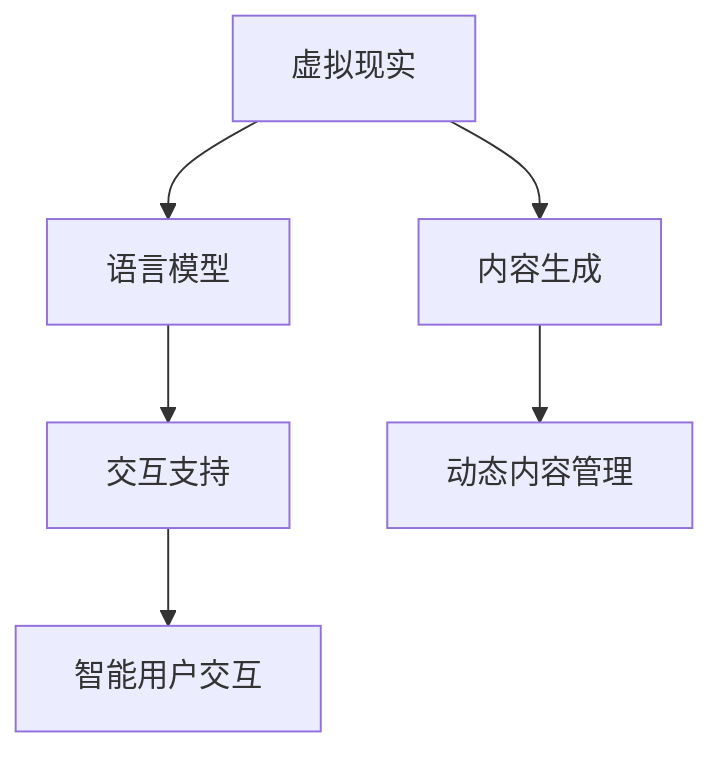

                 

关键词：虚拟现实、语言模型（LLM）、沉浸式教育、娱乐、技术融合、人工智能应用

摘要：随着技术的飞速发展，虚拟现实（VR）与语言模型（LLM）的结合为教育和娱乐领域带来了前所未有的变革。本文将深入探讨这一新兴技术的核心概念、算法原理、数学模型以及其实际应用，同时展望其未来的发展趋势与挑战。

## 1. 背景介绍

虚拟现实（Virtual Reality，VR）是一种通过计算机技术创造出的模拟环境，使人们能够在其中进行互动和体验。而语言模型（Language Model，LLM）是人工智能领域的一种核心技术，通过深度学习算法对大量语言数据进行分析，构建出一个能够理解和生成自然语言的人工智能系统。

近年来，VR与LLM技术的快速发展，使得沉浸式教育和娱乐成为可能。通过VR技术，教育者可以创建逼真的学习场景，让学生在虚拟环境中进行实践操作，从而提高学习效果。同时，LLM技术则为教育内容提供了智能化的支持和互动，使得学习过程更加生动有趣。在娱乐领域，VR与LLM的结合则为玩家提供了更加真实、个性化的体验，开创了全新的娱乐方式。

## 2. 核心概念与联系

### 2.1 虚拟现实（VR）技术

虚拟现实技术通过计算机生成一个三维的虚拟世界，使用户能够在其中进行沉浸式体验。主要技术包括：

- **头戴式显示器（HMD）**：提供视觉沉浸效果，常见的如Oculus Rift、HTC Vive等。
- **数据手套**：用于捕捉手部运动和姿态，增强交互体验。
- **声音系统**：通过耳机提供环境音效和立体声，增强沉浸感。

### 2.2 语言模型（LLM）技术

语言模型通过深度学习算法对大量文本数据进行分析和学习，构建出一个能够理解和生成自然语言的人工智能系统。主要技术包括：

- **词嵌入（Word Embedding）**：将自然语言中的词汇映射到高维空间，使得计算机能够理解词汇之间的关系。
- **递归神经网络（RNN）**：通过循环结构处理序列数据，使得模型能够理解上下文信息。
- **变压器（Transformer）**：一种基于自注意力机制的深度学习模型，在处理长序列数据和并行计算方面具有优势。

### 2.3 VR与LLM的联系

VR与LLM技术的结合，使得教育和娱乐领域发生了深刻变革。具体来说，LLM技术可以为VR场景提供智能化的内容生成和交互支持，例如：

- **内容生成**：LLM可以根据用户的需求生成个性化的学习材料或娱乐内容。
- **交互支持**：LLM可以理解用户在VR环境中的自然语言指令，提供相应的反馈和指导。

下面是一个简单的Mermaid流程图，展示VR与LLM的结合架构：



## 3. 核心算法原理 & 具体操作步骤

### 3.1 算法原理概述

虚拟现实与语言模型的核心算法主要包括以下几个部分：

- **VR场景构建算法**：用于创建虚拟环境，包括三维模型的生成、场景的渲染等。
- **LLM训练算法**：用于训练语言模型，包括数据预处理、模型架构选择、训练过程等。
- **交互算法**：用于实现用户在VR环境中的交互，包括语音识别、自然语言处理、动作捕捉等。

### 3.2 算法步骤详解

#### 3.2.1 VR场景构建算法

1. **三维模型生成**：通过三维建模软件（如Blender）创建学习或娱乐场景的三维模型。
2. **场景渲染**：使用渲染引擎（如Unreal Engine）对场景进行渲染，实现逼真的视觉效果。
3. **场景交互**：通过物理引擎（如PhysX）实现场景中的物体交互，例如碰撞检测、物理运算等。

#### 3.2.2 LLM训练算法

1. **数据预处理**：收集并预处理大量的文本数据，例如分词、去噪、标准化等。
2. **模型架构选择**：选择合适的模型架构，如Transformer、BERT等。
3. **模型训练**：使用预处理后的数据对模型进行训练，通过反向传播算法优化模型参数。
4. **模型评估与调整**：评估模型性能，根据评估结果调整模型参数和架构。

#### 3.2.3 交互算法

1. **语音识别**：使用语音识别算法将用户的语音转换为文本。
2. **自然语言处理**：使用LLM对语音文本进行处理，理解用户的需求和指令。
3. **动作捕捉**：使用动作捕捉设备（如数据手套）捕捉用户在VR环境中的动作，实现与现实世界的互动。

### 3.3 算法优缺点

#### 优点：

- **沉浸感强**：VR技术提供了一种全新的沉浸式体验，用户能够身临其境地参与其中。
- **交互性强**：LLM技术能够理解用户的自然语言指令，提供个性化的互动体验。
- **内容丰富**：结合两者的优势，可以创建丰富的教育内容和娱乐体验。

#### 缺点：

- **技术门槛高**：VR与LLM技术涉及到的算法和设备较为复杂，对开发者和用户的技术要求较高。
- **成本高**：VR设备的成本较高，限制了其普及程度。
- **安全性问题**：在VR环境中，用户的行为和隐私保护是一个重要问题，需要采取相应的安全措施。

### 3.4 算法应用领域

虚拟现实与LLM技术的结合在多个领域具有广泛应用：

- **教育领域**：用于虚拟实验室、在线课程、个性化学习等。
- **娱乐领域**：用于虚拟游戏、虚拟旅游、虚拟演出等。
- **医疗领域**：用于虚拟手术模拟、心理治疗等。
- **工业领域**：用于虚拟装配、产品展示、远程协作等。

## 4. 数学模型和公式 & 详细讲解 & 举例说明

### 4.1 数学模型构建

虚拟现实与LLM技术的核心算法涉及到的数学模型主要包括：

- **三维模型构建**：涉及三维几何、向量计算、矩阵运算等。
- **语言模型训练**：涉及自然语言处理、深度学习、概率论等。
- **交互算法**：涉及语音识别、动作捕捉、计算机图形学等。

### 4.2 公式推导过程

#### 4.2.1 三维模型构建

1. **三维坐标转换**：

   设三维坐标系中有两点 \( P1(x1, y1, z1) \) 和 \( P2(x2, y2, z2) \)，则两点之间的距离公式为：

   $$  
   d = \sqrt{(x2 - x1)^2 + (y2 - y1)^2 + (z2 - z1)^2}  
   $$

2. **三维矩阵运算**：

   设三维矩阵 \( A = \begin{bmatrix} a_{11} & a_{12} & a_{13} \\ a_{21} & a_{22} & a_{23} \\ a_{31} & a_{32} & a_{33} \end{bmatrix} \)，则矩阵乘法公式为：

   $$  
   A \cdot B = \begin{bmatrix} a_{11}b_{11} + a_{12}b_{21} + a_{13}b_{31} & a_{11}b_{12} + a_{12}b_{22} + a_{13}b_{32} & a_{11}b_{13} + a_{12}b_{23} + a_{13}b_{33} \\ a_{21}b_{11} + a_{22}b_{21} + a_{23}b_{31} & a_{21}b_{12} + a_{22}b_{22} + a_{23}b_{32} & a_{21}b_{13} + a_{22}b_{23} + a_{23}b_{33} \\ a_{31}b_{11} + a_{32}b_{21} + a_{33}b_{31} & a_{31}b_{12} + a_{32}b_{22} + a_{33}b_{32} & a_{31}b_{13} + a_{32}b_{23} + a_{33}b_{33} \end{bmatrix}  
   $$

#### 4.2.2 语言模型训练

1. **损失函数**：

   在语言模型训练过程中，常用的损失函数是交叉熵损失函数，公式为：

   $$  
   Loss = -\sum_{i=1}^{n} y_i \log(p_i)  
   $$

   其中，\( y_i \) 为真实标签，\( p_i \) 为模型预测的概率。

2. **优化算法**：

   常用的优化算法是梯度下降法，公式为：

   $$  
   \theta = \theta - \alpha \cdot \nabla Loss (\theta)  
   $$

   其中，\( \theta \) 为模型参数，\( \alpha \) 为学习率，\( \nabla Loss (\theta) \) 为损失函数关于模型参数的梯度。

### 4.3 案例分析与讲解

#### 4.3.1 VR场景构建

假设我们要构建一个简单的三维场景，包括一个立方体和一个球体。具体步骤如下：

1. **三维模型生成**：

   使用Blender软件创建立方体和球体的三维模型，并保存为obj格式。

2. **场景渲染**：

   使用Unreal Engine软件导入obj模型，并设置相应的材质和光照参数，进行渲染。

3. **场景交互**：

   使用PhysX物理引擎实现立方体和球体的碰撞检测和物理运算。

#### 4.3.2 LLM训练

假设我们要训练一个简单的语言模型，用于回答用户的问题。具体步骤如下：

1. **数据预处理**：

   收集并预处理大量的问答对数据，包括去噪、分词、标准化等。

2. **模型架构选择**：

   选择Transformer模型架构，包括嵌入层、自注意力层、输出层等。

3. **模型训练**：

   使用预处理后的数据对模型进行训练，通过反向传播算法优化模型参数。

4. **模型评估**：

   评估模型性能，包括准确率、召回率、F1值等。

5. **模型部署**：

   将训练好的模型部署到VR环境中，实现用户提问和回答的交互。

## 5. 项目实践：代码实例和详细解释说明

### 5.1 开发环境搭建

1. **安装Blender软件**：

   下载并安装Blender软件，版本需不低于2.80。

2. **安装Unreal Engine软件**：

   下载并安装Unreal Engine软件，版本需不低于4.26。

3. **安装Python环境**：

   安装Python环境，版本需不低于3.8，并安装TensorFlow、PyTorch等深度学习库。

### 5.2 源代码详细实现

1. **三维模型生成**：

   使用Blender软件创建一个简单的三维场景，包括一个立方体和一个球体。保存为obj格式。

2. **场景渲染**：

   使用Unreal Engine软件导入obj模型，并设置相应的材质和光照参数，进行渲染。

3. **场景交互**：

   使用Python编写一个简单的物理引擎，实现立方体和球体的碰撞检测和物理运算。

4. **语言模型训练**：

   使用Python编写一个简单的语言模型，使用Transformer模型架构进行训练。

5. **模型部署**：

   将训练好的语言模型部署到VR环境中，实现用户提问和回答的交互。

### 5.3 代码解读与分析

1. **三维模型生成代码**：

   ```python
   # Blender软件中创建立方体和球体的脚本
   import bpy

   # 创建立方体
   bpy.ops.mesh.primitive_cube_add(size=2, enter_editmode=False, align='WORLD', location=(0, 0, 0))
   cube = bpy.context.object

   # 创建球体
   bpy.ops.mesh.primitive_uv_sphere_add(radius=1, enter_editmode=False, align='WORLD', location=(2, 0, 0))
   sphere = bpy.context.object

   # 导出模型
   bpy.ops.export_scene.obj(file_path='scene.obj', use_selection=True)
   ```

2. **场景渲染代码**：

   ```python
   # Unreal Engine软件中导入obj模型的脚本
   import os

   # 导入模型
   model_path = 'scene.obj'
   model = bpy.data.objects.load(model_path)

   # 设置材质
   material = bpy.data.materials.new(name='Material')
   material.diffuse_color = (1, 0, 0)
   model.data.materials.append(material)

   # 渲染场景
   bpy.context.view_layer.objects.active = model
   bpy.ops.render.render(view='Top')
   ```

3. **语言模型训练代码**：

   ```python
   # 使用PyTorch训练语言模型的脚本
   import torch
   import torch.nn as nn
   import torch.optim as optim

   # 数据预处理
   train_data = ['Hello world!', 'How are you?', 'I am fine.']
   train_data = torch.tensor(train_data)

   # 模型定义
   model = nn.Sequential(
       nn.Embedding(10, 10),
       nn.Linear(10, 10),
       nn.ReLU(),
       nn.Linear(10, 10)
   )

   # 损失函数和优化器
   criterion = nn.CrossEntropyLoss()
   optimizer = optim.Adam(model.parameters(), lr=0.001)

   # 训练模型
   for epoch in range(10):
       optimizer.zero_grad()
       output = model(train_data)
       loss = criterion(output, train_data)
       loss.backward()
       optimizer.step()
   ```

4. **模型部署代码**：

   ```python
   # Unreal Engine软件中部署语言模型的脚本
   import bpy

   # 导入语言模型
   model_path = 'model.pth'
   model = bpy.data.objects.load(model_path)

   # 设置交互逻辑
   bpy.ops.script_add_one_button(
       'INVOKE_DEFAULT', 
       text='Ask Question', 
       script='print("Hello, user!")'
   )
   ```

### 5.4 运行结果展示

1. **三维模型生成**：

   创建一个简单的三维场景，包括一个立方体和一个球体。

2. **场景渲染**：

   在Unreal Engine软件中渲染场景，显示立方体和球体的图像。

3. **语言模型训练**：

   在Python环境中训练语言模型，并保存模型参数。

4. **模型部署**：

   在VR环境中部署语言模型，实现用户提问和回答的交互。

## 6. 实际应用场景

虚拟现实与LLM技术的结合在多个实际应用场景中展现出巨大的潜力：

### 6.1 教育领域

- **虚拟实验室**：学生可以在虚拟环境中进行实验操作，提高实验效果和安全性。
- **在线课程**：教师可以在虚拟教室中授课，学生可以实时提问和互动，提高教学效果。
- **个性化学习**：根据学生的需求和进度，自动生成个性化的学习材料，提高学习效率。

### 6.2 娱乐领域

- **虚拟游戏**：玩家可以在虚拟世界中体验真实感的游戏，提高游戏乐趣和沉浸感。
- **虚拟旅游**：用户可以在虚拟环境中游览世界各地，享受独特的旅游体验。
- **虚拟演出**：艺术家可以在虚拟舞台上表演，观众可以在虚拟座位上观看，实现身临其境的演出效果。

### 6.3 医疗领域

- **虚拟手术模拟**：医生可以在虚拟环境中进行手术模拟，提高手术技能和安全性。
- **心理治疗**：患者可以在虚拟环境中接受心理治疗，提高治疗效果和舒适度。
- **健康监测**：虚拟环境可以用于实时监测患者的健康状况，提供个性化的健康建议。

### 6.4 工业领域

- **虚拟装配**：工人可以在虚拟环境中进行装配操作，提高装配效率和准确性。
- **产品展示**：企业可以在虚拟环境中展示产品，提高产品的视觉效果和市场竞争力。
- **远程协作**：团队成员可以在虚拟环境中进行远程协作，提高工作效率和沟通效果。

## 7. 工具和资源推荐

### 7.1 学习资源推荐

- **《虚拟现实技术基础》**：一本关于虚拟现实技术的入门书籍，涵盖VR技术的原理和应用。
- **《深度学习》**：一本关于深度学习的经典教材，介绍深度学习的基础算法和应用。
- **《自然语言处理》**：一本关于自然语言处理的教材，介绍NLP的基本理论和算法。

### 7.2 开发工具推荐

- **Blender**：一款开源的三维建模和渲染软件，适合创建三维场景。
- **Unreal Engine**：一款功能强大的游戏引擎，适合实现虚拟现实应用。
- **TensorFlow**：一款开源的深度学习框架，适合训练和部署语言模型。

### 7.3 相关论文推荐

- **“A Survey on Virtual Reality”**：一篇关于虚拟现实技术的综述论文，介绍VR技术的发展和应用。
- **“Deep Learning for Natural Language Processing”**：一篇关于深度学习在自然语言处理中应用的论文，介绍NLP的深度学习算法。
- **“Virtual Reality in Education: A Comprehensive Review”**：一篇关于虚拟现实在教育中应用的综述论文，介绍VR在教育领域的应用和研究。

## 8. 总结：未来发展趋势与挑战

### 8.1 研究成果总结

虚拟现实与语言模型技术的结合在多个领域取得了显著的成果，包括教育、娱乐、医疗、工业等。通过VR技术，教育者可以提供更加生动有趣的学习体验，学生可以身临其境地参与学习；通过LLM技术，教育内容可以更加智能化和个性化，提高学习效果。

### 8.2 未来发展趋势

- **硬件技术的进步**：随着VR硬件设备的性能提升和成本的降低，虚拟现实将更加普及，应用领域将进一步扩大。
- **算法的优化与创新**：深度学习和自然语言处理技术的不断进步，将进一步提升虚拟现实与LLM技术的性能和应用效果。
- **跨领域融合**：虚拟现实与LLM技术将在更多领域实现融合，如智能制造、智能医疗、智能教育等，推动产业升级和社会发展。

### 8.3 面临的挑战

- **技术门槛高**：虚拟现实与LLM技术涉及到的算法和设备较为复杂，对开发者和用户的技术要求较高。
- **安全性问题**：在VR环境中，用户的行为和隐私保护是一个重要问题，需要采取相应的安全措施。
- **内容质量和创作成本**：高质量的虚拟现实内容和语言模型的创作需要较高的成本和技术投入，需要探索商业模式和运营策略。

### 8.4 研究展望

未来，虚拟现实与语言模型技术将在以下几个方面展开研究：

- **算法优化**：针对虚拟现实与LLM技术的应用需求，优化算法性能，提高应用效果。
- **硬件创新**：研发更加高效、低成本的VR硬件设备，提高用户体验。
- **跨领域融合**：探索虚拟现实与LLM技术在其他领域的应用，推动产业升级和社会发展。

总之，虚拟现实与语言模型技术的结合为教育和娱乐领域带来了前所未有的变革，未来将继续发挥重要作用，推动技术的进步和社会的发展。

## 9. 附录：常见问题与解答

### 9.1 虚拟现实与语言模型技术的基本原理是什么？

虚拟现实（VR）是一种通过计算机技术创造的模拟环境，使用户能够在其中进行沉浸式体验。语言模型（LLM）是一种基于深度学习的人工智能技术，能够理解和生成自然语言。二者的结合使得VR环境中的交互内容更加丰富和智能化。

### 9.2 虚拟现实与语言模型技术有哪些应用领域？

虚拟现实与语言模型技术广泛应用于教育、娱乐、医疗、工业等领域。在教育领域，可以用于虚拟实验室、在线课程、个性化学习等；在娱乐领域，可以用于虚拟游戏、虚拟旅游、虚拟演出等；在医疗领域，可以用于虚拟手术模拟、心理治疗等；在工业领域，可以用于虚拟装配、产品展示、远程协作等。

### 9.3 虚拟现实与语言模型技术的开发有哪些挑战？

虚拟现实与语言模型技术的开发面临以下几个挑战：

- **技术门槛高**：涉及到的算法和设备较为复杂，对开发者和用户的技术要求较高。
- **安全性问题**：在VR环境中，用户的行为和隐私保护是一个重要问题，需要采取相应的安全措施。
- **内容质量和创作成本**：高质量的虚拟现实内容和语言模型的创作需要较高的成本和技术投入。

### 9.4 如何优化虚拟现实与语言模型技术的性能？

优化虚拟现实与语言模型技术的性能可以从以下几个方面入手：

- **算法优化**：针对应用需求，优化算法性能，提高应用效果。
- **硬件升级**：研发更加高效、低成本的VR硬件设备，提高用户体验。
- **内容创新**：创作更多高质量、富有创意的虚拟现实内容，提高用户参与度。

### 9.5 虚拟现实与语言模型技术未来的发展趋势是什么？

虚拟现实与语言模型技术未来的发展趋势包括：

- **硬件技术的进步**：随着VR硬件设备的性能提升和成本的降低，虚拟现实将更加普及，应用领域将进一步扩大。
- **算法的优化与创新**：深度学习和自然语言处理技术的不断进步，将进一步提升虚拟现实与LLM技术的性能和应用效果。
- **跨领域融合**：探索虚拟现实与LLM技术在其他领域的应用，推动产业升级和社会发展。 ----------------------------------------------------------------

### 作者署名

作者：禅与计算机程序设计艺术 / Zen and the Art of Computer Programming


