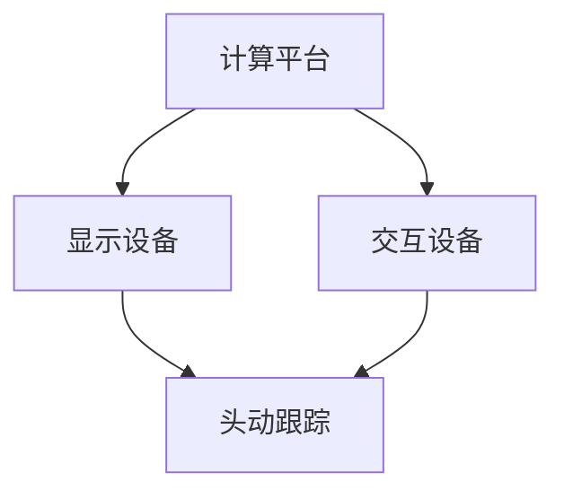

                 

虚拟现实（VR）技术在教育领域的应用正逐渐兴起，特别是在儿童教育方面，它为传统教育模式带来了全新的变革。本文将探讨如何通过虚拟现实技术进行儿童教育，如何将教育与娱乐相结合，实现寓教于乐的沉浸式学习体验。

## 关键词：虚拟现实、儿童教育、沉浸式学习、寓教于乐

> 摘要：本文旨在分析虚拟现实技术在儿童教育中的潜力与应用，探讨如何利用VR技术创建一个寓教于乐的沉浸式学习环境。通过详细的案例研究和技术解读，本文为从事虚拟现实儿童教育创业的个人和团队提供了有价值的参考和建议。

## 1. 背景介绍

虚拟现实技术已经从科幻电影走向现实，它通过计算机生成的三维模拟环境，使用户能够在这个环境中进行互动和探索。在教育领域，VR的应用不仅限于提供模拟实验、历史场景再现等，还可以创造一个完全沉浸式的学习体验，极大地激发学生的学习兴趣和主动性。

近年来，虚拟现实在儿童教育中的研究与应用日益增多。根据市场调研公司的数据，全球虚拟现实教育市场预计将在未来几年内实现快速增长。家长和教育工作者对VR在教育中的潜力表示出了浓厚的兴趣，尤其是在提升学生的学习动力、培养创新能力和解决问题的能力方面。

### 1.1 虚拟现实在教育中的优势

- **沉浸式学习体验**：VR技术能够创建一个高度逼真的虚拟环境，让学生仿佛置身其中，增加学习的趣味性和参与度。
- **个性化学习**：通过VR技术，可以根据学生的学习进度和兴趣点，定制个性化的学习内容，提高学习效果。
- **提高学习效率**：VR技术的互动性和实时反馈机制，有助于学生更快地掌握知识，减少学习时间。
- **增强实践能力**：通过虚拟实验和模拟操作，学生可以在安全的环境中尝试和实践，提高实际操作能力。

## 2. 核心概念与联系

### 2.1 虚拟现实技术的工作原理

虚拟现实技术主要依赖于以下三个关键组件：显示设备、交互设备和计算平台。

- **显示设备**：如头戴式显示器（HMD），通过立体显示和头动跟踪技术，提供沉浸式视觉体验。
- **交互设备**：如手柄、手套等，用于与虚拟环境进行交互，增强沉浸感。
- **计算平台**：包括计算机硬件和软件系统，负责生成和处理虚拟环境中的数据。

下面是一个Mermaid流程图，展示了虚拟现实技术的基本架构：



### 2.2 虚拟现实与教育的结合方式

虚拟现实在教育中的应用可以有多种形式：

- **虚拟实验室**：提供模拟实验环境，让学生在虚拟世界中学习科学和工程知识。
- **历史场景再现**：通过VR技术重现历史事件和场景，让学生沉浸其中，增强历史学习的趣味性和直观性。
- **虚拟课堂**：利用VR技术打造一个虚拟的教室环境，学生可以在虚拟世界中与老师和同学互动。
- **职业培训**：利用VR技术进行职业培训，如医疗、航空等，让学生在虚拟环境中模拟实际操作。

## 3. 核心算法原理 & 具体操作步骤

### 3.1 算法原理概述

虚拟现实系统的核心算法主要包括以下几个方面：

- **场景渲染**：使用图形渲染算法生成虚拟环境的三维图像。
- **头动跟踪**：使用传感器跟踪用户的头部运动，实时调整显示内容，以保持沉浸感。
- **交互处理**：处理用户输入，如手势、语音等，实现与虚拟环境的互动。

### 3.2 算法步骤详解

#### 3.2.1 场景渲染

- **模型构建**：使用三维建模软件创建虚拟环境的三维模型。
- **纹理映射**：为模型添加纹理，使其更真实。
- **光照处理**：模拟真实世界中的光照效果，增强场景的真实感。
- **渲染输出**：使用图形渲染管线将场景渲染为图像，输出到显示设备。

#### 3.2.2 头动跟踪

- **传感器采集**：使用头部跟踪传感器（如陀螺仪、加速度计）采集头部运动数据。
- **数据预处理**：对采集到的数据进行滤波和校正，提高跟踪精度。
- **插值算法**：对不连续的数据点进行插值，生成平滑的运动轨迹。
- **视角更新**：根据头动数据更新显示视角，保持沉浸感。

#### 3.2.3 交互处理

- **输入识别**：使用语音识别、手势识别等技术识别用户的输入。
- **动作映射**：将用户的输入映射到虚拟环境中的操作。
- **反馈生成**：根据用户的操作生成相应的反馈，如声音、震动等。

### 3.3 算法优缺点

#### 优点：

- **沉浸感强**：通过虚拟环境，学生能够更好地沉浸其中，提高学习兴趣和参与度。
- **互动性强**：虚拟环境中的互动能够增强学生的实践能力和解决问题的能力。
- **个性化**：根据学生的学习进度和兴趣点，可以提供个性化的学习内容。

#### 缺点：

- **成本较高**：VR设备和技术成本较高，初期投入较大。
- **技术要求**：对开发人员的技术要求较高，需要掌握多种技能和工具。
- **内容限制**：现有的VR教育资源有限，需要更多高质量的VR教学内容。

### 3.4 算法应用领域

虚拟现实技术在儿童教育中的应用领域广泛：

- **科学教育**：提供模拟实验和虚拟实验室，让学生在安全的环境中探索科学知识。
- **历史教育**：通过虚拟现实技术重现历史场景，增强学生的历史学习体验。
- **艺术教育**：利用VR技术进行艺术创作和欣赏，提高学生的审美能力。
- **语言学习**：在虚拟环境中进行语言对话和交流，提高学生的语言能力。

## 4. 数学模型和公式 & 详细讲解 & 举例说明

### 4.1 数学模型构建

在虚拟现实系统中，数学模型的应用非常广泛，以下是一个简单的数学模型构建示例：

#### 4.1.1 三维空间中的点

- **点坐标**：在三维空间中，一个点的坐标可以用 (x, y, z) 表示。

#### 4.1.2 矩阵变换

- **变换矩阵**：用于对三维空间中的点进行变换，如平移、旋转等。

### 4.2 公式推导过程

以下是一个简单的变换矩阵推导过程：

$$
\begin{align*}
T &= \begin{bmatrix}
1 & 0 & 0 & t_x \\
0 & 1 & 0 & t_y \\
0 & 0 & 1 & t_z \\
0 & 0 & 0 & 1 \\
\end{bmatrix} \\
R &= \begin{bmatrix}
r_{11} & r_{12} & r_{13} & 0 \\
r_{21} & r_{22} & r_{23} & 0 \\
r_{31} & r_{32} & r_{33} & 0 \\
0 & 0 & 0 & 1 \\
\end{bmatrix}
\end{align*}
$$

### 4.3 案例分析与讲解

#### 4.3.1 点的平移

给定一个点 P(x, y, z)，通过变换矩阵 T 平移到新的位置：

$$
\begin{align*}
P' &= T \cdot P \\
&= \begin{bmatrix}
1 & 0 & 0 & t_x \\
0 & 1 & 0 & t_y \\
0 & 0 & 1 & t_z \\
0 & 0 & 0 & 1 \\
\end{bmatrix} \cdot \begin{bmatrix}
x \\
y \\
z \\
1 \\
\end{bmatrix} \\
&= \begin{bmatrix}
x + t_x \\
y + t_y \\
z + t_z \\
1 \\
\end{bmatrix}
\end{align*}
$$

#### 4.3.2 点的旋转

给定一个点 P(x, y, z)，通过旋转矩阵 R 进行旋转：

$$
\begin{align*}
P' &= R \cdot P \\
&= \begin{bmatrix}
r_{11} & r_{12} & r_{13} & 0 \\
r_{21} & r_{22} & r_{23} & 0 \\
r_{31} & r_{32} & r_{33} & 0 \\
0 & 0 & 0 & 1 \\
\end{bmatrix} \cdot \begin{bmatrix}
x \\
y \\
z \\
1 \\
\end{bmatrix} \\
&= \begin{bmatrix}
x' \\
y' \\
z' \\
1 \\
\end{bmatrix}
$$

其中，$r_{ij}$ 表示旋转矩阵中的元素。

## 5. 项目实践：代码实例和详细解释说明

### 5.1 开发环境搭建

为了实现虚拟现实儿童教育项目，我们需要搭建一个完整的开发环境。以下是一个简单的环境搭建步骤：

- **安装操作系统**：选择一个适合的操作系统，如 Ubuntu 20.04。
- **安装依赖**：安装必要的依赖库和工具，如 OpenGL、Eclipse、Unity 等。
- **配置开发环境**：配置好开发环境，确保所有依赖都能正常工作。

### 5.2 源代码详细实现

以下是一个简单的VR儿童教育项目的源代码实现：

```csharp
using System.Collections;
using System.Collections.Generic;
using UnityEngine;

public class VRChildEducation : MonoBehaviour
{
    public GameObject virtualClassroom;
    public GameObject studentAvatar;

    // Start is called before the first frame update
    void Start()
    {
        // 初始化虚拟教室和学生的位置
        virtualClassroom.transform.position = new Vector3(0, 0, -10);
        studentAvatar.transform.position = new Vector3(0, 0, 0);
    }

    // Update is called once per frame
    void Update()
    {
        // 跟踪学生的头部运动
        transform.position = studentAvatar.transform.position;
        transform.rotation = studentAvatar.transform.rotation;
    }
}
```

### 5.3 代码解读与分析

上述代码是一个简单的VR儿童教育项目实现，它主要包括以下部分：

- **虚拟教室和学生的初始化**：在 `Start` 方法中，初始化虚拟教室和学生的位置。
- **头部运动跟踪**：在 `Update` 方法中，根据学生的头部运动实时更新虚拟环境的视角。

### 5.4 运行结果展示

在运行该项目后，我们可以看到虚拟教室和学生出现在虚拟环境中，学生的头部运动实时影响到虚拟环境的视角，实现了一个简单的沉浸式学习体验。

## 6. 实际应用场景

虚拟现实技术在儿童教育中的应用场景非常广泛，以下是一些典型的应用案例：

- **科学实验**：通过虚拟实验室，学生可以在虚拟环境中进行各种科学实验，如化学实验、物理实验等，提高实验操作能力。
- **历史学习**：通过虚拟现实技术，学生可以参观历史博物馆、历史遗址等，增强历史学习的趣味性和直观性。
- **语言学习**：在虚拟环境中，学生可以进行语言对话和交流，提高语言表达能力。
- **艺术创作**：利用虚拟现实技术，学生可以在虚拟环境中进行艺术创作，如绘画、雕塑等，培养艺术兴趣和创造力。

## 7. 未来应用展望

随着虚拟现实技术的不断发展和成熟，未来在儿童教育中的应用前景将更加广阔：

- **个性化教育**：利用VR技术，可以根据学生的兴趣和需求，提供个性化的学习内容，提高学习效果。
- **远程教育**：通过VR技术，可以实现远程教育，让学生在家就能享受到优质的教育资源。
- **跨学科融合**：虚拟现实技术可以促进不同学科之间的融合，提供更丰富、更有深度的学习体验。

## 8. 工具和资源推荐

### 8.1 学习资源推荐

- **《虚拟现实编程入门》**：介绍虚拟现实技术的入门知识和基本原理。
- **《Unity 2021 VR开发实战》**：针对Unity平台，详细介绍如何利用Unity进行VR应用开发。

### 8.2 开发工具推荐

- **Unity**：一款功能强大的游戏引擎，适合进行VR应用开发。
- **Unreal Engine**：另一款流行的游戏引擎，也支持VR应用开发。

### 8.3 相关论文推荐

- **"Virtual Reality in Education: A Review of Applications and Outcomes"**：综述虚拟现实在教育中的应用和研究成果。
- **"Enhancing Learning with Virtual Reality: A Systematic Review"**：系统评估虚拟现实技术在教育中的应用效果。

## 9. 总结：未来发展趋势与挑战

虚拟现实技术在儿童教育中的应用具有巨大的潜力和前景。然而，要实现真正的教育变革，还需要克服一系列挑战：

- **技术成熟度**：虽然VR技术在不断进步，但仍需进一步提高技术成熟度，以降低成本和提高稳定性。
- **教育资源**：需要开发更多高质量的VR教育内容，以满足不同学科和年龄段的需求。
- **教育模式**：需要探索新的教育模式，将VR技术与传统教育模式有机结合，提高教育效果。

未来，随着VR技术的不断发展和成熟，我们期待看到更多创新的VR教育应用，为儿童提供更丰富、更有趣的学习体验。

### 附录：常见问题与解答

**Q：虚拟现实技术是否适合所有年龄段的学生？**

A：虚拟现实技术主要针对儿童和教育工作者设计，特别是对学龄前和学龄期的学生具有较大的吸引力。然而，对于某些年龄段的学生，可能需要根据其认知和心理发展水平进行调整。

**Q：虚拟现实教育项目的成本如何？**

A：虚拟现实教育项目的成本取决于多个因素，包括硬件成本、软件开发成本和内容制作成本。一般来说，初期投入较大，但随着技术的成熟和规模的扩大，成本会有所降低。

**Q：虚拟现实教育项目的效果如何评估？**

A：评估虚拟现实教育项目的效果可以从多个维度进行，如学生的学习成绩、学习兴趣、参与度、解决问题的能力等。同时，还可以通过问卷调查、访谈等方式收集学生的反馈，以全面评估项目效果。

作者：禅与计算机程序设计艺术 / Zen and the Art of Computer Programming
----------------------------------------------------------------

