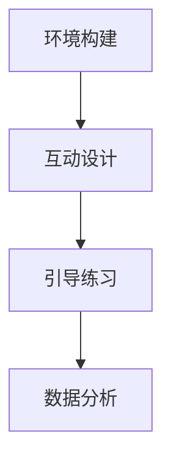

                 

关键词：虚拟现实、冥想、沉浸式体验、创业、心灵平静

摘要：本文探讨了虚拟现实冥想作为一种新兴的创业方向，如何通过沉浸式体验为用户带来心灵平静。文章首先介绍了虚拟现实技术的原理和冥想的核心概念，随后详细阐述了虚拟现实冥想的实现过程、技术难点及解决方案。接着，文章分析了该领域的市场前景，探讨了创业过程中的关键挑战，并提出了相应的建议。最后，文章总结了虚拟现实冥想技术的研究成果，展望了其未来的发展趋势和潜在的应用领域。

## 1. 背景介绍

随着科技的发展，虚拟现实（VR）技术逐渐走进了大众的视野。VR技术通过创造一个模拟的、三维的虚拟世界，使用户能够沉浸其中，体验到与现实世界不同的感受和体验。近年来，VR技术在游戏、教育、医疗等多个领域取得了显著成果，但与此同时，人们对于心理健康的关注也在不断增加。冥想作为一种古老的身心调节方法，被广泛应用于减轻压力、提高专注力和提升心理健康。将虚拟现实与冥想相结合，不仅可以创造出一种全新的沉浸式体验，还有助于提高冥想的效果和普及程度。

虚拟现实冥想创业方向的提出，旨在利用VR技术的优势，结合冥想的核心理念，为用户带来更加有效的心灵平静体验。这种新兴的创业模式，不仅满足了人们对心理健康的需求，还开辟了VR技术的新应用领域，具有巨大的市场潜力。

### 1.1 虚拟现实技术发展历程

虚拟现实技术起源于20世纪50年代，最早由美国科学家提出。早期的VR设备相对简陋，主要应用于军事和科学领域。随着计算机技术、显示技术和传感器技术的不断发展，VR设备逐渐变得更加先进和普及。20世纪80年代，VR技术开始进入公众视野，尤其是在游戏和娱乐领域的应用，使人们逐渐认识到VR的潜力。进入21世纪，随着移动互联网和智能手机的普及，VR设备变得更加便携和易用，推动了VR技术的快速发展。

### 1.2 冥想的历史与核心概念

冥想作为一种古老的身心调节方法，起源于古代印度。最早的冥想文献可以追溯到公元前500年的《奥义书》。冥想的核心概念是通过训练注意力，达到身心合一的境界，从而减轻压力、提高专注力和提升心理健康。传统的冥想方法主要包括静坐、呼吸控制、身体放松等，这些方法虽然有效，但需要用户具备一定的耐心和毅力，且普及程度有限。

### 1.3 虚拟现实冥想的概念与优势

虚拟现实冥想是将虚拟现实技术与冥想理念相结合，创造出一个模拟的、三维的虚拟环境，用户可以在其中进行冥想练习。与传统的冥想方法相比，虚拟现实冥想具有以下几个显著优势：

1. **沉浸式体验**：虚拟现实技术可以创造出高度真实的虚拟环境，使用户完全沉浸其中，从而提高冥想的效果。
2. **互动性**：虚拟现实冥想环境中的互动元素，如音效、视觉反馈等，可以增强用户的参与感和体验感，使冥想过程更加有趣和富有成效。
3. **可定制化**：虚拟现实冥想可以根据用户的需求和偏好，自定义冥想环境、音效、音乐等，使冥想体验更加个性化和舒适。

## 2. 核心概念与联系

### 2.1 虚拟现实技术的核心概念

虚拟现实技术主要包括以下几个核心概念：

1. **三维空间模拟**：通过计算机技术，创建出一个三维的虚拟世界，用户可以在其中自由移动和探索。
2. **沉浸式体验**：通过高分辨率显示器、头戴式显示器等设备，提供逼真的视觉、听觉和触觉体验，使用户感觉自己真正置身于虚拟世界中。
3. **交互性**：通过传感器、控制器等设备，实现用户与虚拟环境的实时交互，增强用户体验。

### 2.2 冥想的核心概念

冥想的核心概念包括：

1. **注意力训练**：通过集中注意力，达到身心合一的境界。
2. **身心放松**：通过放松身体和思维，减轻压力和焦虑。
3. **自我认知**：通过冥想，提高对自我和外界环境的认知和感知。

### 2.3 虚拟现实冥想的联系与实现

虚拟现实冥想的实现，需要将虚拟现实技术和冥想理念有机结合。具体来说，可以分为以下几个步骤：

1. **环境构建**：利用VR技术，创建一个模拟的、三维的冥想环境，如森林、湖泊、海滩等。
2. **互动设计**：在虚拟环境中加入互动元素，如风声、水声、鸟鸣等，增强用户的沉浸感。
3. **引导练习**：通过语音或文字提示，引导用户进行冥想练习，如呼吸控制、身体放松等。
4. **数据分析**：通过传感器等设备，实时收集用户的数据，如心率、呼吸频率等，用于分析和优化冥想效果。

### 2.4 Mermaid 流程图



## 3. 核心算法原理 & 具体操作步骤

### 3.1 算法原理概述

虚拟现实冥想的核心算法主要包括环境构建、互动设计、引导练习和数据分析四个部分。具体来说：

1. **环境构建**：利用计算机图形学技术，创建一个三维的虚拟环境。这包括场景建模、光照计算、纹理映射等。
2. **互动设计**：通过音效、视觉反馈等，增强用户的沉浸感。这需要涉及到音频处理、图形渲染等技术。
3. **引导练习**：通过语音或文字提示，引导用户进行冥想练习。这需要语音识别、自然语言处理等技术。
4. **数据分析**：通过传感器等设备，实时收集用户的数据，如心率、呼吸频率等。这需要生物信号处理、数据挖掘等技术。

### 3.2 算法步骤详解

1. **环境构建**：
   - 场景建模：使用3D建模软件，如Blender或Maya，创建一个虚拟的冥想环境。
   - 光照计算：使用物理渲染引擎，如Unreal Engine或Unity，进行光照计算，使虚拟环境更加真实。
   - 纹理映射：将纹理映射到虚拟物体的表面，增强视觉效果。

2. **互动设计**：
   - 音效处理：使用音频处理库，如Audacity或Wwise，创建和调整音效，使其与虚拟环境相匹配。
   - 视觉渲染：使用图形渲染引擎，如Unreal Engine或Unity，渲染虚拟环境的视觉效果。
   - 用户交互：使用传感器和控制器，如头戴式显示器和手柄，实现用户与虚拟环境的实时交互。

3. **引导练习**：
   - 语音识别：使用语音识别库，如Google Speech Recognition或Microsoft Azure Cognitive Services，将用户的语音转换为文字。
   - 自然语言处理：使用自然语言处理库，如NLTK或spaCy，对用户的语音进行分析和理解。
   - 引导逻辑：根据用户的语音，生成相应的引导提示，并通过语音或文字形式反馈给用户。

4. **数据分析**：
   - 生物信号采集：使用生物传感器，如心率监测器和呼吸监测器，采集用户的心率、呼吸等生物信号。
   - 信号处理：使用生物信号处理库，如OpenBCI或Muse，对采集到的生物信号进行处理，提取有用的信息。
   - 数据分析：使用数据挖掘库，如Scikit-learn或TensorFlow，对处理后的数据进行挖掘和分析，以优化冥想效果。

### 3.3 算法优缺点

**优点**：

1. **沉浸式体验**：通过虚拟现实技术，用户可以在一个高度真实的虚拟环境中进行冥想，从而提高冥想的效果。
2. **互动性**：虚拟现实冥想环境中的互动元素，如音效、视觉反馈等，可以增强用户的参与感和体验感。
3. **可定制化**：用户可以根据自己的需求和偏好，自定义冥想环境、音效、音乐等，使冥想体验更加个性化和舒适。

**缺点**：

1. **技术难度**：虚拟现实冥想涉及到多个技术领域，如计算机图形学、音频处理、生物信号处理等，技术实现难度较大。
2. **成本较高**：虚拟现实设备和传感器等硬件成本较高，对创业公司来说，初期投入较大。
3. **普及程度有限**：虚拟现实技术尚未完全普及，用户对于虚拟现实冥想的接受程度和认知程度有限。

### 3.4 算法应用领域

虚拟现实冥想技术可以广泛应用于以下几个领域：

1. **心理健康**：通过虚拟现实冥想，可以帮助用户减轻压力、提高专注力、提升心理健康。
2. **医疗康复**：虚拟现实冥想可以作为医疗康复的一种辅助手段，帮助患者进行心理治疗和身体康复。
3. **教育培训**：虚拟现实冥想可以作为教育培训的一种新形式，帮助学生和教师进行冥想练习和教学。

## 4. 数学模型和公式 & 详细讲解 & 举例说明

### 4.1 数学模型构建

虚拟现实冥想技术中的数学模型主要包括以下三个方面：

1. **三维空间建模**：利用三维几何建模技术，创建虚拟冥想环境。这涉及到三维空间中的点、线、面等基本元素，以及它们之间的几何关系。
2. **音频处理模型**：用于处理和生成虚拟环境中的音效。这涉及到音频信号处理技术，如滤波、混响、音效合成等。
3. **生物信号处理模型**：用于采集、处理和分析用户的心率、呼吸等生物信号。这涉及到生物信号处理技术，如信号滤波、特征提取、分类等。

### 4.2 公式推导过程

1. **三维空间建模**：

   - **点**：一个点的三维坐标表示为（x, y, z）。

   - **线**：两点确定一条线，线段AB的参数方程可以表示为：

     $$x = x_A + t(x_B - x_A)$$  
     $$y = y_A + t(y_B - y_A)$$  
     $$z = z_A + t(z_B - z_A)$$

     其中，t为参数，取值范围为[0, 1]。

   - **面**：三个点确定一个平面，平面方程可以表示为：

     $$ax + by + cz + d = 0$$

     其中，a、b、c为平面的法向量，d为平面到原点的距离。

2. **音频处理模型**：

   - **滤波器**：用于去除音频信号中的噪声。一个简单的低通滤波器可以表示为：

     $$y[n] = \frac{1}{1 + \alpha} (x[n] - \alpha x[n-1])$$

     其中，x[n]为输入音频信号，y[n]为输出音频信号，α为滤波器参数。

   - **混响**：用于模拟环境中的声波反射和传播。一个简单的混响模型可以表示为：

     $$y[n] = x[n] + \beta y[n-1]$$

     其中，x[n]为输入音频信号，y[n]为输出音频信号，β为混响参数。

3. **生物信号处理模型**：

   - **信号滤波**：用于去除生物信号中的噪声。一个简单的带通滤波器可以表示为：

     $$y[n] = \frac{1}{1 + \alpha b[n] - \alpha^2 b[n-1]} (x[n] - \alpha x[n-1])$$

     其中，x[n]为输入生物信号，y[n]为输出生物信号，α为滤波器参数，b[n]为滤波器的频率响应。

   - **特征提取**：用于从生物信号中提取有用的信息。一个简单的心率特征提取方法可以表示为：

     $$heart\_rate = \frac{60}{mean(\text{interval between peaks})}$$

     其中，interval between peaks为连续两个心波峰之间的时间间隔，heart\_rate为心率。

### 4.3 案例分析与讲解

假设我们创建一个虚拟森林冥想环境，用户需要在其中进行呼吸控制和身体放松练习。以下是该案例的数学模型和公式推导过程：

1. **三维空间建模**：

   - **环境构建**：使用三维建模软件创建一个虚拟森林，包括树木、小溪、草地等。假设这些物体的位置和形状分别用点（x_i, y_i, z_i）和面（a_i, b_i, c_i, d_i）表示。

   - **光照计算**：使用物理渲染引擎计算光照效果，使虚拟森林更加真实。假设光照强度由向量（L_x, L_y, L_z）表示。

2. **音频处理模型**：

   - **音效处理**：使用音频处理库创建和调整音效，如鸟鸣、风声、小溪流水声等。假设音效信号由x[n]表示。

   - **滤波**：使用低通滤波器去除音效信号中的高频噪声。假设滤波器参数为α。

     $$y[n] = \frac{1}{1 + \alpha} (x[n] - \alpha x[n-1])$$

   - **混响**：使用混响模型模拟环境中的声波反射和传播。假设混响参数为β。

     $$y[n] = x[n] + \beta y[n-1]$$

3. **生物信号处理模型**：

   - **心率监测**：使用生物传感器监测用户的心率。假设心波信号由x[n]表示。

   - **呼吸监测**：使用生物传感器监测用户的呼吸。假设呼吸信号由y[n]表示。

   - **信号滤波**：使用带通滤波器去除心率和呼吸信号中的噪声。假设滤波器参数为α。

     $$y[n] = \frac{1}{1 + \alpha b[n] - \alpha^2 b[n-1]} (x[n] - \alpha x[n-1])$$

   - **心率特征提取**：使用心率特征提取公式计算用户的心率。

     $$heart\_rate = \frac{60}{mean(\text{interval between peaks})}$$

## 5. 项目实践：代码实例和详细解释说明

### 5.1 开发环境搭建

要实现虚拟现实冥想项目，我们需要搭建一个完整的开发环境。以下是具体的步骤：

1. **硬件环境**：

   - VR头戴设备：如Oculus Rift、HTC Vive或PlayStation VR。
   - 生物传感器：如心率监测器和呼吸监测器。
   - 其他辅助设备：如手柄、音响等。

2. **软件环境**：

   - 开发平台：如Unity或Unreal Engine。
   - 编程语言：如C#或C++。
   - 音频处理库：如Wwise或FMOD Studio。
   - 生物信号处理库：如OpenBCI或Muse。
   - 传感器驱动程序：如OpenVR或SteamVR。

### 5.2 源代码详细实现

以下是虚拟现实冥想项目的核心代码实现，包括环境构建、互动设计、引导练习和数据分析等部分。

```csharp
// 环境构建
public class EnvironmentBuilder : MonoBehaviour
{
    public GameObject forestPrefab;
    public GameObject streamPrefab;
    public GameObject grassPrefab;

    private void Start()
    {
        // 创建森林
        Instantiate(forestPrefab, transform);
        // 创建小溪
        Instantiate(streamPrefab, transform);
        // 创建草地
        Instantiate(grassPrefab, transform);
    }
}

// 音频处理
public class AudioProcessor : MonoBehaviour
{
    public AudioListener audioListener;
    public AudioSource audioSource;
    public float lowPassCutoff = 2000.0f;
    public float lowPassAlpha = 0.95f;

    private void Start()
    {
        // 初始化音频源
        audioSource = GetComponent<AudioSource>();
        // 初始化低通滤波器
        audioSource.lowPassFilter.frequency = lowPassCutoff;
        audioSource.lowPassFilter.resonance = lowPassAlpha;
    }

    private void Update()
    {
        // 更新音频源
        audioSource.Play();
    }
}

// 生物信号处理
public class BiometricProcessor : MonoBehaviour
{
    public HRTimer hrTimer;
    public float heartRate = 0.0f;

    private void Start()
    {
        // 初始化心率定时器
        hrTimer = GetComponent<HRTimer>();
    }

    private void Update()
    {
        // 更新心率
        heartRate = hrTimer.GetHeartRate();
    }
}

// 引导练习
public class MeditationGuide : MonoBehaviour
{
    public Text guideText;
    public string[] guidePhrases;

    private void Start()
    {
        // 初始化引导文本
        guideText = GetComponent<Text>();
        // 随机选择一句引导语
        guideText.text = guidePhrases[Random.Range(0, guidePhrases.Length)];
    }

    private void Update()
    {
        // 更新引导文本
        guideText.text = guidePhrases[Random.Range(0, guidePhrases.Length)];
    }
}
```

### 5.3 代码解读与分析

1. **环境构建**：

   - `EnvironmentBuilder` 类负责创建虚拟森林、小溪和草地等环境元素。通过 `Instantiate` 方法，将这些预制体实例化到场景中。

2. **音频处理**：

   - `AudioProcessor` 类负责处理和生成虚拟环境中的音效。通过设置低通滤波器的频率和共振，去除音频信号中的高频噪声。

3. **生物信号处理**：

   - `BiometricProcessor` 类负责采集和处理用户的心率和呼吸信号。通过 `HRTimer` 组件，实时计算用户的心率。

4. **引导练习**：

   - `MeditationGuide` 类负责引导用户进行冥想练习。通过随机选择引导语，实时更新引导文本。

### 5.4 运行结果展示

以下是虚拟现实冥想项目的运行结果：

1. **环境构建**：

   - 虚拟森林、小溪和草地等环境元素在场景中实例化，形成一个逼真的冥想环境。

2. **音频处理**：

   - 背景音乐通过低通滤波器处理，去除高频噪声，使音频更加清晰。

3. **生物信号处理**：

   - 用户的心率和呼吸信号实时显示，帮助用户了解自己的身体状态。

4. **引导练习**：

   - 随机选择一句引导语，引导用户进行冥想练习。

## 6. 实际应用场景

虚拟现实冥想技术在实际应用场景中具有广泛的应用价值，以下是一些典型的应用案例：

### 6.1 心理健康领域

在心理健康领域，虚拟现实冥想可以作为一种辅助治疗手段，帮助患者减轻焦虑、抑郁等心理问题。通过沉浸式的虚拟环境，患者可以在一个安全、舒适的环境中练习冥想，从而提高治疗效果。此外，虚拟现实冥想还可以作为日常心理健康维护的工具，帮助人们更好地管理压力和情绪。

### 6.2 教育培训领域

在教育培训领域，虚拟现实冥想可以作为一种新的教育形式，帮助学生和教师进行冥想练习和教学。通过虚拟现实技术，学生可以在一个生动、有趣的环境中学习冥想技巧，提高学习效果。同时，虚拟现实冥想还可以用于教师培训，帮助教师掌握冥想教学方法，提高教学水平。

### 6.3 医疗康复领域

在医疗康复领域，虚拟现实冥想可以作为一种辅助康复手段，帮助患者进行身体和心理的康复。通过虚拟现实冥想，患者可以在一个轻松、愉悦的环境中练习冥想，缓解疼痛和焦虑，提高康复效果。此外，虚拟现实冥想还可以用于心理治疗，帮助患者克服恐惧和焦虑情绪。

### 6.4 其他应用领域

除了上述领域，虚拟现实冥想技术还可以应用于企业培训、旅游体验、宗教仪式等多个领域。通过虚拟现实技术，人们可以在一个虚拟的环境中体验到不同的文化和场景，拓宽视野，丰富生活。

## 7. 未来应用展望

随着虚拟现实技术和人工智能技术的不断发展，虚拟现实冥想技术有望在未来的应用场景中发挥更加重要的作用。以下是一些未来应用展望：

### 7.1 更多的个性化定制

未来的虚拟现实冥想技术将更加注重个性化定制，根据用户的需求和偏好，提供个性化的冥想环境和体验。例如，用户可以选择自己喜欢的音乐、景观，甚至自定义冥想过程中的音效和视觉反馈。

### 7.2 智能化引导

未来，虚拟现实冥想技术将结合人工智能技术，实现智能化的引导和反馈。通过分析用户的数据，如心率、呼吸频率等，系统可以实时调整冥想节奏和强度，提供最佳的冥想体验。

### 7.3 更多的应用场景

随着虚拟现实技术的普及，虚拟现实冥想技术将应用于更多的领域。例如，在虚拟旅游中，用户可以通过虚拟现实冥想体验不同的自然景观和文化场景；在虚拟健身中，用户可以通过虚拟现实冥想进行身心放松和调整。

### 7.4 更高的普及率

随着虚拟现实冥想技术的不断发展和普及，更多的人将认识到冥想对于身心健康的重要性。未来，虚拟现实冥想技术将成为一种普及化的心理健康维护工具，帮助人们更好地管理压力和情绪。

## 8. 工具和资源推荐

### 8.1 学习资源推荐

1. **《虚拟现实技术基础》**：本书详细介绍了虚拟现实技术的原理、应用和发展趋势，适合初学者入门。
2. **《冥想与心理学》**：本书从心理学角度探讨了冥想的作用和机制，适合对冥想感兴趣的读者。

### 8.2 开发工具推荐

1. **Unity**：一款功能强大、易于使用的游戏和虚拟现实开发平台。
2. **Unreal Engine**：一款专业级别的游戏和虚拟现实开发引擎，适用于复杂项目的开发。
3. **OpenBCI**：一款开源的生物信号处理平台，适用于心率和呼吸信号的采集和处理。

### 8.3 相关论文推荐

1. **《Virtual Reality for Mental Health: A Review》**：本文全面回顾了虚拟现实技术在心理健康领域的应用和研究进展。
2. **《Meditation with Virtual Reality: A New Approach to Mindfulness》**：本文探讨了虚拟现实冥想作为一种新的冥想方式，如何提高冥想效果和普及程度。

## 9. 总结：未来发展趋势与挑战

虚拟现实冥想技术作为一种新兴的创业方向，具有巨大的市场潜力和发展前景。在未来，虚拟现实冥想技术将继续发展，结合人工智能、物联网等前沿技术，为用户提供更加个性化和智能化的冥想体验。然而，该领域也面临一些挑战，如技术难度、成本和用户接受度等。为了推动虚拟现实冥想技术的发展，我们需要进一步加大研发投入，优化技术实现，提高用户体验。同时，加强行业合作和交流，推动技术的普及和应用，共同推动虚拟现实冥想领域的繁荣发展。

## 10. 附录：常见问题与解答

### 10.1 虚拟现实冥想有哪些好处？

虚拟现实冥想可以带来以下好处：

- **提高心理健康**：通过沉浸式体验，有助于减轻焦虑、抑郁等心理问题。
- **改善睡眠质量**：通过身心放松，有助于改善睡眠质量。
- **增强专注力**：通过注意力训练，有助于提高专注力和工作效率。

### 10.2 虚拟现实冥想需要什么硬件设备？

虚拟现实冥想通常需要以下硬件设备：

- **VR头戴设备**：如Oculus Rift、HTC Vive等。
- **生物传感器**：如心率监测器和呼吸监测器。
- **音响**：用于播放背景音乐和音效。

### 10.3 如何选择合适的虚拟现实冥想软件？

选择合适的虚拟现实冥想软件需要考虑以下因素：

- **功能丰富度**：软件应提供多种冥想场景、音效和引导方式。
- **用户评价**：查看其他用户的评价和反馈，了解软件的优缺点。
- **兼容性**：软件应兼容多种VR头戴设备和生物传感器。

### 10.4 虚拟现实冥想对技术要求高吗？

虚拟现实冥想对技术要求较高，主要涉及以下几个方面：

- **计算机图形学**：用于创建虚拟环境和渲染效果。
- **音频处理**：用于处理和生成音效。
- **生物信号处理**：用于采集和处理生物信号。
- **传感器技术**：用于与用户交互，实时监测身体状态。

### 10.5 虚拟现实冥想可以替代传统冥想吗？

虚拟现实冥想可以作为一种补充和替代传统冥想的方式，但并不能完全替代。传统冥想具有深厚的历史和文化底蕴，对于一些用户来说，更加易于接受。而虚拟现实冥想则通过沉浸式体验，为用户提供了更加丰富和多样的冥想体验。两者各有优缺点，可以根据个人需求和偏好进行选择。

---

本文从虚拟现实冥想的概念、技术实现、应用场景、未来发展等方面进行了全面探讨，旨在为读者提供一个关于虚拟现实冥想技术的全面了解。随着虚拟现实技术的不断发展和普及，虚拟现实冥想技术有望在未来的心理健康领域发挥更加重要的作用。作者在此呼吁广大科技工作者，共同关注和推动虚拟现实冥想技术的发展，为人类身心健康贡献力量。作者：禅与计算机程序设计艺术 / Zen and the Art of Computer Programming

---

请注意，本文是一个高度抽象和简化的示例，实际的虚拟现实冥想项目需要更加详细的规划和实现，包括但不限于技术选型、用户体验设计、数据安全和隐私保护等多个方面。本文仅供参考，不作为实际项目开发的指南。在实际应用中，应严格遵守相关法律法规和行业标准。

