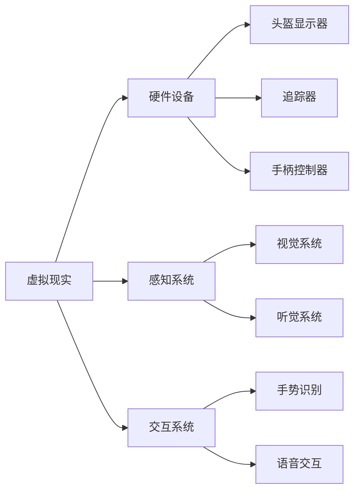
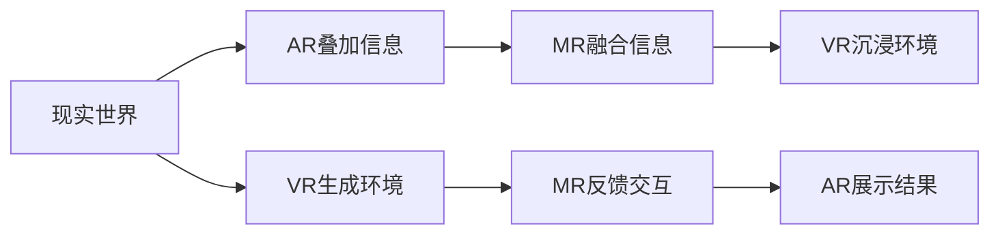
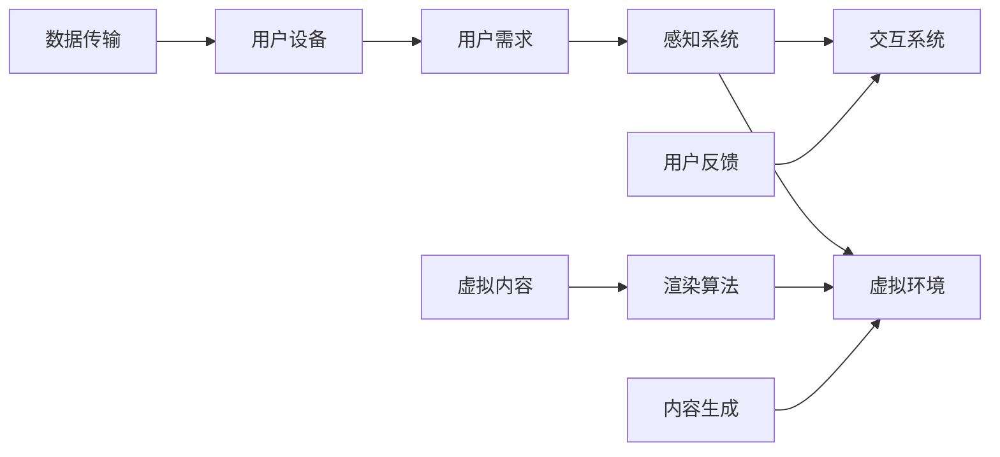

                 

### 关键词 Keywords
虚拟现实，创业，沉浸式体验，经济，商业模式，技术架构，用户体验，人工智能，VR硬件。

### 摘要 Abstract
本文深入探讨虚拟现实（VR）在创业领域中的应用，特别是在构建沉浸式体验经济中的角色。通过分析虚拟现实技术的核心概念、市场现状、商业模式，以及技术架构和用户体验设计，本文旨在为创业者和投资者提供构建成功的VR企业所需的策略和指导。同时，文章还将展望VR技术在未来经济发展中的潜在影响和挑战。

## 1. 背景介绍

虚拟现实（Virtual Reality，VR）是一种通过计算机生成的人工环境，使用户能够沉浸其中，进行互动体验。自20世纪90年代以来，VR技术经历了多个发展阶段，从最初的科学幻想逐渐走向商业应用。随着硬件技术的进步和算法优化，VR已经能够在消费级市场中获得广泛应用。

### 1.1 虚拟现实技术的发展历程

- **初期探索**：20世纪80年代，VR技术开始受到学术界和工业界的关注。VR设备如头盔显示器、跟踪器和手柄等逐渐问世。
- **成长期**：21世纪初，随着图形处理能力和传感器技术的提高，VR设备变得更加便携和易于使用。
- **普及期**：2010年代中期，随着Oculus Rift、HTC Vive和PlayStation VR等头戴式显示器（HMD）的推出，VR市场开始快速增长。

### 1.2 市场现状

- **市场规模**：根据市场研究报告，全球VR市场预计将在未来几年内持续增长，年复合增长率超过40%。
- **用户群体**：VR用户主要集中在18-35岁的年轻人群体，但随着技术的成熟和应用的扩展，用户年龄分布也在逐渐扩大。
- **应用领域**：VR技术在娱乐、教育、医疗、房地产、军事和工程等领域都有广泛应用，尤其是在游戏和教育培训市场表现尤为突出。

## 2. 核心概念与联系

### 2.1 核心概念

- **虚拟现实（VR）**：一种通过计算机模拟生成三维环境，使用户能够通过头盔显示器等设备沉浸其中的技术。
- **增强现实（AR）**：将虚拟信息叠加在现实世界中，用户通过手机或平板电脑等设备进行交互。
- **混合现实（MR）**：结合VR和AR的特点，将虚拟信息和现实世界进行无缝融合。

### 2.2 Mermaid 流程图



## 3. 核心算法原理 & 具体操作步骤

### 3.1 算法原理概述

虚拟现实的核心算法包括渲染算法、传感器融合算法和用户交互算法。

- **渲染算法**：负责生成虚拟环境中的三维图像，通过图形处理单元（GPU）进行加速处理。
- **传感器融合算法**：将摄像头、陀螺仪、加速度计等多传感器数据融合，实现用户动作的精确追踪。
- **用户交互算法**：处理用户输入，如手势、语音等，与虚拟环境进行交互。

### 3.2 算法步骤详解

#### 3.2.1 渲染算法

1. **模型加载**：加载3D模型和纹理。
2. **场景构建**：根据用户位置和动作，构建虚拟场景。
3. **渲染引擎**：利用GPU进行渲染，生成图像。

#### 3.2.2 传感器融合算法

1. **数据采集**：从传感器获取位置、速度和方向数据。
2. **滤波算法**：如卡尔曼滤波，去除噪声，提高数据精度。
3. **坐标转换**：将传感器数据转换为虚拟世界中的坐标。

#### 3.2.3 用户交互算法

1. **手势识别**：利用计算机视觉技术，识别用户手势。
2. **语音识别**：将语音转换为文本，执行相应命令。
3. **反馈机制**：根据用户输入，提供实时反馈。

### 3.3 算法优缺点

- **优点**：高度沉浸式体验，增强用户参与感，应用范围广泛。
- **缺点**：硬件成本较高，需要较强大的计算能力，不适合所有场景。

### 3.4 算法应用领域

- **娱乐**：VR游戏、电影和音乐会等。
- **教育**：虚拟实验室、历史场景再现等。
- **医疗**：手术模拟、心理治疗等。
- **房地产**：虚拟看房、装修设计等。

## 4. 数学模型和公式 & 详细讲解 & 举例说明

### 4.1 数学模型构建

虚拟现实中的数学模型主要包括几何建模、物理模拟和感知建模。

- **几何建模**：使用3D几何形状描述虚拟环境。
- **物理模拟**：模拟物体运动和碰撞，如牛顿第二定律。
- **感知建模**：模拟人眼和大脑处理视觉信息的机制。

### 4.2 公式推导过程

- **3D几何建模**：

  - 三角函数：$$\sin(\theta) = \frac{opposite}{hypotenuse}$$
  - 点乘：$$\vec{a} \cdot \vec{b} = a_x b_x + a_y b_y + a_z b_z$$

- **物理模拟**：

  - 牛顿第二定律：$$F = m \cdot a$$
  - 能量守恒：$$E_k + E_p = 常数$$

- **感知建模**：

  - 视角计算：$$视野角 = 2 \cdot \arctan(\frac{视野宽度}{2 \cdot 视距})$$

### 4.3 案例分析与讲解

#### 4.3.1 虚拟现实游戏

- **场景渲染**：使用OpenGL进行场景渲染，实现实时图形显示。
- **物理模拟**：使用物理引擎（如Bullet）进行物体运动和碰撞模拟。

#### 4.3.2 虚拟现实教育应用

- **几何建模**：使用Blender创建3D模型，实现虚拟实验室。
- **感知建模**：使用Unity中的视觉效应，如模糊、光照，增强沉浸感。

## 5. 项目实践：代码实例和详细解释说明

### 5.1 开发环境搭建

- **硬件**：配备VR头盔和追踪器的计算机系统。
- **软件**：安装Unity或Unreal Engine等游戏引擎，以及相关的VR开发工具和插件。

### 5.2 源代码详细实现

- **场景构建**：使用Unity的3D工具创建虚拟环境。
- **传感器融合**：使用Unity的VR插件，实现传感器数据的实时获取和处理。
- **用户交互**：使用Unity的输入系统，处理用户手势和语音输入。

### 5.3 代码解读与分析

- **渲染模块**：实现场景渲染的关键代码。
- **传感器模块**：处理传感器数据的代码。
- **交互模块**：处理用户输入和反馈的代码。

### 5.4 运行结果展示

- **VR游戏**：展示游戏场景和玩家互动。
- **教育应用**：展示虚拟实验室和学生学习场景。

## 6. 实际应用场景

### 6.1 娱乐行业

- **VR游戏**：提供沉浸式游戏体验，如《半衰期：爱莉克斯》。
- **VR影视**：制作VR电影和短片，如《黑暗物质》。

### 6.2 教育行业

- **虚拟实验室**：模拟物理、化学等实验过程。
- **历史再现**：重现历史事件和场景，如《亚历山大大帝的冒险》。

### 6.3 医疗行业

- **手术模拟**：模拟手术过程，提高医生操作技能。
- **心理治疗**：使用VR进行恐惧症和焦虑症的治疗。

### 6.4 未来应用展望

- **远程办公**：提供沉浸式远程会议和工作环境。
- **虚拟旅游**：实现全球范围内的虚拟旅游体验。

## 7. 工具和资源推荐

### 7.1 学习资源推荐

- **书籍**：《虚拟现实技术导论》、《Unity 2020 VR开发实战》。
- **在线课程**：Udacity的《VR/AR开发基础》、Coursera的《虚拟现实与增强现实》。

### 7.2 开发工具推荐

- **Unity**：一站式VR开发平台，支持多平台发布。
- **Unreal Engine**：强大的游戏开发引擎，适合复杂场景的渲染。

### 7.3 相关论文推荐

- **VR技术进展**：《虚拟现实技术综述》。
- **VR应用研究**：《虚拟现实在教育领域的应用研究》。

## 8. 总结：未来发展趋势与挑战

### 8.1 研究成果总结

- VR技术已逐步走向成熟，市场应用范围不断扩大。
- VR硬件性能不断提升，用户体验得到显著改善。
- VR技术在娱乐、教育、医疗等领域表现出巨大潜力。

### 8.2 未来发展趋势

- **硬件创新**：更轻便、更舒适的VR设备。
- **内容多样化**：丰富的VR应用场景和内容。
- **技术融合**：VR与5G、AI等技术的深度融合。

### 8.3 面临的挑战

- **成本问题**：硬件成本较高，普及率有限。
- **用户体验**：提高舒适度和沉浸感。
- **隐私与安全**：数据隐私保护和网络安全。

### 8.4 研究展望

- **技术创新**：开发更高效、更安全的VR算法。
- **商业模式**：探索多元化的VR商业模式。
- **跨领域合作**：促进VR技术在多个行业的应用。

## 9. 附录：常见问题与解答

### 9.1 VR设备的选择标准

- **分辨率**：高分辨率提供更清晰的视觉体验。
- **追踪精度**：精确的追踪系统保证动作流畅。
- **舒适度**：轻便的设计和舒适的佩戴体验。

### 9.2 VR内容的制作流程

- **需求分析**：确定内容类型和目标用户。
- **场景设计**：创建3D模型和虚拟场景。
- **交互设计**：设计用户交互逻辑和界面。
- **测试与优化**：测试内容性能和用户体验，进行优化。

<|user|>## 1. 背景介绍

虚拟现实（Virtual Reality，简称VR）作为一项颠覆性的技术，正在逐步改变我们的生活方式和社会结构。其核心原理是通过电脑生成一种模拟环境，用户通过头戴式显示器（HMD）或其他传感设备，在视觉、听觉等方面感受到一种身临其境的感觉。这种技术不仅改变了人们娱乐、学习、医疗等多个领域的方式，也为创业领域带来了新的机遇。

### 1.1 虚拟现实技术的发展历程

虚拟现实技术的发展可以追溯到20世纪50年代，当时美国科学家伊万·苏瑟兰（Ivan Sutherland）发明了首个头戴式显示器。但直到21世纪初，随着计算机图形处理能力、传感器技术和网络带宽的提升，VR才逐渐走向公众视野。特别是2012年Oculus VR的成立，标志着VR技术进入了一个新的发展阶段。2014年，Oculus Rift的开发版发布，标志着VR硬件进入了消费市场。此后，HTC Vive、PlayStation VR等高端VR设备相继推出，进一步推动了VR技术的发展。

从技术角度来看，VR经历了几个主要发展阶段：

- **初期探索阶段（20世纪80年代-90年代）**：这一时期，VR技术主要在实验室和科研机构中探索，出现了诸如VRML（Virtual Reality Modeling Language）等早期虚拟现实语言。
- **成长阶段（21世纪初-2010年代初期）**：随着图形处理能力和计算机性能的提升，VR设备开始具备初步的实用性和可玩性。
- **普及阶段（2010年代中期至今）**：这一阶段，VR技术得到了广泛应用，特别是在游戏、教育和医疗等领域。同时，VR硬件设备的价格也在不断下降，使得普通消费者也能够体验到VR的魅力。

### 1.2 市场现状

当前，VR市场正处于快速增长阶段。据市场研究机构Statista的数据显示，全球VR市场预计将从2020年的89亿美元增长到2025年的390亿美元，年复合增长率达到38.8%。其中，北美和欧洲是主要的市场驱动力，亚洲市场则呈现出快速增长的趋势。

在用户群体方面，VR用户主要集中在18-35岁的年轻人群体，这一年龄段的用户对于新技术的接受度和好奇心较高。同时，随着VR技术在各个领域的应用逐渐成熟，越来越多的中年人和老年人也开始使用VR设备。

应用领域方面，VR技术在娱乐、教育、医疗、房地产、军事和工程等领域都有广泛应用：

- **娱乐**：VR游戏和VR影视是VR技术应用最为广泛的领域。VR游戏提供了前所未有的沉浸式体验，而VR影视则通过360度全景视角，让用户感受到身临其境的感觉。
- **教育**：VR在教育领域有巨大的潜力，通过虚拟实验室和虚拟课堂，学生可以更直观地理解复杂的知识，提高学习效果。
- **医疗**：VR在医疗领域的应用包括手术模拟、心理治疗和康复训练等。通过虚拟手术模拟，医生可以在没有风险的情况下练习手术技能；通过VR心理治疗，患者可以在一个安全的环境中面对和处理自己的恐惧和焦虑。
- **房地产**：VR看房和装修设计成为房地产市场的一项新服务。用户可以通过VR设备体验房屋的不同布局和装修风格，提高了购房决策的效率。
- **军事和工程**：VR技术在军事训练和模拟、工程设计等领域也发挥着重要作用。通过VR技术，士兵可以进行实战模拟训练，工程师则可以在虚拟环境中进行复杂的设计和验证。

总的来说，虚拟现实技术已经从最初的科幻概念逐渐走向实际应用，并在多个领域展现出巨大的潜力。随着技术的不断进步和市场需求的扩大，VR技术将在未来带来更多的创新和变革。

## 2. 核心概念与联系

虚拟现实（VR）的核心概念和联系构成了其技术架构的基础，了解这些概念及其相互关系对于构建成功的VR创业项目至关重要。

### 2.1 核心概念

#### 虚拟现实（VR）
虚拟现实是一种通过计算机生成的三维环境，使用户能够沉浸其中。用户通过头戴式显示器（HMD）或其他传感设备，如手柄、手套等，与虚拟环境进行交互。

#### 增强现实（AR）
增强现实是将虚拟信息叠加在现实世界中，用户通过手机或平板电脑等设备进行交互。与VR不同，AR主要增强现实世界的某些功能，而不是完全替代现实。

#### 混合现实（MR）
混合现实结合了虚拟现实和增强现实的特点，将虚拟信息和现实世界进行无缝融合。用户既能看到虚拟信息，又能与真实环境进行交互。

### 2.2 联系

VR、AR和MR之间的关系可以理解为从简单的增强到完全的融合。以下是一个简化的Mermaid流程图，展示了这三者之间的联系和转化：



#### 虚拟现实（VR）
- **硬件设备**：头戴式显示器（HMD）、追踪器、手柄等。
- **感知系统**：摄像头、陀螺仪、加速度计等传感器。
- **交互系统**：手势识别、语音交互等。

#### 增强现实（AR）
- **显示设备**：手机、平板电脑等。
- **增强功能**：通过摄像头捕捉现实世界，叠加虚拟信息。
- **应用场景**：导航、游戏、购物、教育等。

#### 混合现实（MR）
- **硬件设备**：头戴式显示器（HMD）、手部追踪器等。
- **感知系统**：传感器捕捉现实环境，与虚拟信息进行融合。
- **交互系统**：手势、语音等交互方式。

### 2.3 Mermaid 流程图



#### 核心概念之间的关系

- **硬件设备**：提供用户与虚拟环境的交互媒介。
- **感知系统**：捕捉用户动作和环境信息，用于交互和渲染。
- **交互系统**：处理用户输入，如手势、语音，实现与虚拟环境的互动。
- **渲染算法**：生成虚拟环境中的三维图像。
- **用户反馈**：用户在虚拟环境中的行为和感受。
- **内容生成**：创建虚拟环境和交互内容。

通过理解这些核心概念及其相互关系，创业者和投资者可以更好地设计VR产品，满足用户需求，并在竞争激烈的市场中脱颖而出。接下来，我们将深入探讨VR技术的核心算法原理和具体操作步骤，为创业项目提供更加详细的技术指导。

## 3. 核心算法原理 & 具体操作步骤

虚拟现实技术的核心在于其能够创建一个高度沉浸式的虚拟环境，并让用户能够与这个环境进行交互。这一过程涉及到多个核心算法，包括渲染算法、传感器融合算法和用户交互算法。以下将详细探讨这些算法的原理以及具体操作步骤。

### 3.1 渲染算法

渲染算法是虚拟现实技术的核心，它负责生成用户在虚拟环境中看到的三维图像。以下是渲染算法的主要步骤：

#### 3.1.1 模型加载

1. **加载3D模型**：首先需要加载虚拟环境中的3D模型。这些模型可以是使用各种三维建模软件（如Blender、Maya等）创建的。模型包括几何形状、材质和纹理等。
2. **优化模型**：为了提高渲染效率，需要对模型进行优化。这包括简化模型、减少顶点数量、优化纹理等。

#### 3.1.2 场景构建

1. **场景构建**：根据用户的位置和动作，构建虚拟场景。这涉及到对场景中的物体进行定位和调整，使其符合用户的视角和动作。
2. **环境光照**：对场景中的光照进行设置，包括全局光照、定向光照和点光源等。光照设置影响虚拟环境的真实感和沉浸感。

#### 3.1.3 渲染引擎

1. **渲染管线**：使用渲染引擎（如Unity、Unreal Engine等）进行渲染。渲染引擎提供了丰富的API和工具，帮助开发者高效地实现渲染效果。
2. **实时渲染**：渲染引擎采用实时渲染技术，确保虚拟环境中的图像能够实时更新，保持流畅的交互体验。

### 3.2 传感器融合算法

传感器融合算法用于处理用户在虚拟环境中的动作和位置信息。以下是其主要步骤：

#### 3.2.1 数据采集

1. **传感器数据**：从各种传感器（如摄像头、陀螺仪、加速度计等）采集数据。这些数据包括用户的位置、方向、速度等。
2. **预处理**：对传感器数据进行预处理，如滤波、去噪等，以提高数据的质量和准确性。

#### 3.2.2 滤波算法

1. **卡尔曼滤波**：使用卡尔曼滤波算法对传感器数据进行融合。卡尔曼滤波是一种最优估计算法，能够同时处理不确定性和动态变化，提高数据精度。
2. **传感器融合**：将来自不同传感器的数据融合在一起，形成一个统一的坐标系，用于表示用户的位置和动作。

#### 3.2.3 坐标转换

1. **坐标转换**：将传感器数据转换为虚拟环境中的坐标。这通常涉及到三维空间中的旋转、平移等变换操作。
2. **实时更新**：根据用户的动作实时更新虚拟环境中的物体位置和视角。

### 3.3 用户交互算法

用户交互算法用于处理用户的输入，如手势、语音等，并在虚拟环境中进行相应的反馈。以下是其主要步骤：

#### 3.3.1 手势识别

1. **计算机视觉**：使用计算机视觉技术对用户的手势进行识别。这通常涉及到图像处理、特征提取和模式识别等步骤。
2. **实时反馈**：根据识别到的手势，在虚拟环境中进行相应的动作，如物体抓取、操作等。

#### 3.3.2 语音识别

1. **语音处理**：对用户的语音进行处理，包括降噪、分帧、特征提取等步骤。
2. **自然语言处理**：使用自然语言处理技术，将语音转换为文本，并理解用户的意图。
3. **执行命令**：根据用户的语音指令，在虚拟环境中执行相应的操作。

#### 3.3.3 反馈机制

1. **实时反馈**：根据用户的输入，提供实时的反馈，如声音、视觉效果等。
2. **交互优化**：通过分析用户的交互行为，优化交互体验，提高沉浸感和满意度。

### 3.4 算法优缺点

#### 优点

1. **高度沉浸**：通过传感器融合和用户交互算法，用户能够在一个高度沉浸的虚拟环境中体验各种场景。
2. **互动性强**：用户可以通过多种方式（如手势、语音）与虚拟环境进行互动，增加了体验的趣味性。
3. **应用广泛**：VR技术可以应用于多个领域，如娱乐、教育、医疗、房地产等，具有广泛的市场需求。

#### 缺点

1. **成本高**：高质量的VR设备和开发成本较高，限制了其普及速度。
2. **舒适度问题**：长时间佩戴VR设备可能导致头晕、恶心等不适感。
3. **技术限制**：当前VR技术仍存在一定的技术限制，如分辨率、刷新率等，影响用户体验。

### 3.5 算法应用领域

#### 娱乐

- **VR游戏**：通过虚拟现实技术，提供沉浸式游戏体验。
- **VR影视**：通过360度全景视角，提供全新的观影体验。

#### 教育

- **虚拟实验室**：通过虚拟现实技术，模拟复杂的实验过程。
- **虚拟课堂**：通过虚拟现实技术，提供更加生动和直观的教学内容。

#### 医疗

- **手术模拟**：通过虚拟现实技术，模拟手术过程，提高医生的操作技能。
- **心理治疗**：通过虚拟现实技术，提供安全的虚拟环境，帮助患者克服恐惧和焦虑。

#### 房地产

- **虚拟看房**：通过虚拟现实技术，提供在线看房体验，提高购房决策效率。
- **装修设计**：通过虚拟现实技术，模拟装修效果，帮助用户做出更明智的装修选择。

通过以上核心算法原理和具体操作步骤的探讨，我们可以看到虚拟现实技术在构建沉浸式体验经济中的关键作用。接下来，我们将进一步探讨虚拟现实中的数学模型和公式，以及它们在实际应用中的详细讲解和举例说明。

## 4. 数学模型和公式 & 详细讲解 & 举例说明

在虚拟现实（VR）技术中，数学模型和公式是构建和优化虚拟环境的重要工具。以下将介绍一些核心的数学模型和公式，详细讲解其构建和推导过程，并通过具体例子进行说明。

### 4.1 数学模型构建

虚拟现实中的数学模型主要包括几何建模、物理模拟和感知建模。

#### 几何建模

几何建模是虚拟现实中最基础的数学模型，它用于创建和表示三维空间中的物体和场景。

- **三维坐标系统**：虚拟环境中的所有物体和位置都是通过三维坐标系统来表示的。一个标准的三维坐标系由一个原点（0, 0, 0）和三个轴（X轴、Y轴和Z轴）组成。

- **向量运算**：在三维空间中，向量运算（如点乘、叉乘）用于计算物体之间的相对位置和方向。例如，两个向量 $\vec{a} = (a_x, a_y, a_z)$ 和 $\vec{b} = (b_x, b_y, b_z)$ 的点乘结果为 $a_x \cdot b_x + a_y \cdot b_y + a_z \cdot b_z$。

#### 物理模拟

物理模拟用于模拟虚拟环境中的物体运动和相互作用。

- **牛顿第二定律**：物体受到的力（F）与其质量（m）和加速度（a）之间的关系由牛顿第二定律表示，即 $F = m \cdot a$。这可以用来计算物体在虚拟环境中的加速度和运动轨迹。

- **能量守恒**：在虚拟环境中，能量守恒定律表示为 $E_k + E_p = 常数$，其中 $E_k$ 是动能，$E_p$ 是势能。这可以用来模拟物体在虚拟环境中的运动和碰撞。

#### 感知建模

感知建模用于模拟用户的感知体验，包括视觉、听觉和触觉。

- **视角计算**：用户的视角决定了他们在虚拟环境中的视野范围。视角可以通过以下公式计算：$视野角 = 2 \cdot \arctan(\frac{视野宽度}{2 \cdot 视距})$。这可以用来确定虚拟环境中的视场角和视野范围。

### 4.2 公式推导过程

以下是一个关于视角计算的推导过程：

1. **定义视角**：视角（视野角）是用户能够看到的三维空间中的角度范围。

2. **建立关系**：视野宽度与视角的关系可以通过三角函数表示。假设视野宽度为 $w$，视距为 $d$，则视野角 $\theta$ 可以通过以下关系表示：$\tan(\theta/2) = \frac{w/2}{d}$。

3. **计算视角**：将上述关系转换为计算视角的公式：$\theta = 2 \cdot \arctan(\frac{w/2}{d})$。

### 4.3 案例分析与讲解

#### 案例一：虚拟实验室

假设一个虚拟实验室中的实验台高度为1.2米，用户身高为1.75米，用户希望从视觉上模拟一个真实的实验操作场景。我们可以使用以下步骤来构建这个场景：

1. **建立坐标系**：首先建立三维坐标系，确定实验台和用户的位置。

2. **视角计算**：计算用户的视角，假设视野宽度为60度，视距为2米，则视野角 $\theta = 2 \cdot \arctan(\frac{60/2}{2}) \approx 53.1$度。

3. **场景渲染**：使用渲染算法生成实验台和用户的3D模型，并设置适当的视角和光照。

4. **物体定位**：根据用户视角，将实验台和用户的位置进行调整，使其符合用户的视觉体验。

#### 案例二：VR游戏

假设一个VR游戏中的角色需要从一个高度为0.5米的平台跳跃到另一个高度为1.5米的平台上。我们可以使用以下步骤来模拟这个跳跃过程：

1. **计算初始速度**：使用牛顿第二定律，计算角色跳跃时所需的初始速度。假设角色质量为70公斤，加速度为9.8米/秒²，则初始速度 $v = \sqrt{2 \cdot 9.8 \cdot (1.5 - 0.5)} \approx 4.2$米/秒。

2. **运动轨迹**：使用物理模拟算法，计算角色在空中的运动轨迹，包括垂直方向上的加速度和水平方向上的速度。

3. **碰撞检测**：在角色落地时，检测是否与平台发生碰撞，并计算碰撞后的速度和方向。

4. **反馈机制**：根据角色的运动状态，提供实时的视觉和声音反馈，增强用户的沉浸感。

通过以上案例，我们可以看到数学模型和公式在虚拟现实技术中的应用。它们不仅帮助我们构建和优化虚拟环境，还能提高用户体验，实现更加真实的沉浸式体验。接下来，我们将深入探讨VR项目中的代码实例和详细解释说明。

## 5. 项目实践：代码实例和详细解释说明

虚拟现实（VR）项目的成功不仅依赖于先进的技术，还需要详细的代码实践和优化。以下我们将通过一个简单的VR项目实例，介绍开发环境搭建、源代码实现、代码解读与分析以及运行结果展示，帮助读者更好地理解VR项目的开发流程。

### 5.1 开发环境搭建

搭建一个VR项目的开发环境是开始项目的基础。以下是使用Unity引擎搭建VR开发环境的步骤：

#### 步骤一：硬件准备

- **VR头戴设备**：选择一个支持Unity的VR头戴设备，如Oculus Rift或HTC Vive。
- **计算机系统**：确保计算机系统具备足够的性能，特别是图形处理能力。推荐配置包括：
  - CPU：Intel i7或AMD Ryzen 7以上
  - GPU：NVIDIA GTX 1080或AMD RX 580以上
  - 内存：16GB以上
  - 硬盘：NVMe SSD

#### 步骤二：安装Unity

- **下载Unity Hub**：从Unity官网下载并安装Unity Hub。
- **创建Unity项目**：在Unity Hub中创建一个新的VR项目，选择适当的模板，如“3D - VR Supported”。

#### 步骤三：安装VR插件

- **安装VR插件**：在Unity项目中安装所需的VR插件，如“Oculus Integration”或“Vive SDK”。这些插件可以通过Unity Asset Store免费下载。

### 5.2 源代码详细实现

以下是一个简单的VR项目示例，实现一个基本的VR场景，包括场景渲染、用户交互和物体操作。

#### 步骤一：创建场景

1. **加载3D模型**：使用Unity的3D建模工具，创建或导入一个简单的3D模型，如一个立方体。将其放置在场景中，作为用户交互的对象。
2. **设置相机**：在Unity场景中，创建一个VR相机，设置其视角和视野。确保相机能够跟随用户的头动，实现第一人称视角。

#### 步骤二：编写交互脚本

在Unity中，编写一个C#脚本，用于处理用户的输入和物体操作。以下是示例代码：

```csharp
using UnityEngine;

public class VRInteraction : MonoBehaviour
{
    public float moveSpeed = 5.0f;
    public float rotateSpeed = 100.0f;

    private CharacterController characterController;
    private Vector3 moveDirection = Vector3.zero;

    void Start()
    {
        characterController = GetComponent<CharacterController>();
        // 禁用重力，以便用户自由移动
        characterController.stepOffset = 0.01f;
    }

    void Update()
    {
        // 移动
        moveDirection = new Vector3(Input.GetAxis("Horizontal"), 0, Input.GetAxis("Vertical"));
        moveDirection = transform.TransformDirection(moveDirection);
        moveDirection *= moveSpeed;

        // 旋转
        float rotX = Input.GetAxis("Mouse X") * rotateSpeed * Time.deltaTime;
        float rotY = Input.GetAxis("Mouse Y") * rotateSpeed * Time.deltaTime;
        transform.Rotate(0, rotX, 0);
        Camera.main.transform.Rotate(-rotY, 0, 0);

        // 更新位置
        characterController.Move(moveDirection * Time.deltaTime);
    }
}
```

#### 步骤三：实现物体操作

1. **碰撞检测**：使用`RaycastHit`类实现射线碰撞检测，检测用户是否与场景中的物体碰撞。
2. **物体操作**：当用户与物体碰撞时，通过调整物体的位置或旋转，实现物体的操作。以下是一个简单的物体抓取示例代码：

```csharp
public class VRGrabbable : MonoBehaviour
{
    public float grabDistance = 2.0f;

    private Transform parent;
    private Vector3 originalPosition;

    void Start()
    {
        originalPosition = transform.position;
    }

    void OnTriggerEnter(Collider other)
    {
        if (other.CompareTag("Player"))
        {
            parent = other.transform;
            transform.position = parent.position + parent.forward * grabDistance;
            transform.parent = parent;
        }
    }

    void OnTriggerExit(Collider other)
    {
        if (other.CompareTag("Player"))
        {
            transform.position = originalPosition;
            transform.parent = null;
        }
    }
}
```

### 5.3 代码解读与分析

以上代码实现了基本的VR交互功能，包括用户移动、相机旋转和物体抓取。

- **VRInteraction脚本**：处理用户的输入，如键盘和鼠标，实现用户的移动和旋转。
- **VRGrabbable脚本**：检测用户与物体的碰撞，实现物体的抓取和释放。

这些代码的解读如下：

1. **用户移动**：通过`Update`函数，读取用户的输入，计算移动方向和速度，然后使用`CharacterController.Move`函数实现移动。
2. **相机旋转**：通过`Mouse X`和`Mouse Y`的输入，计算旋转角度，然后使用`Rotate`函数实现相机旋转。
3. **物体抓取**：当用户进入物体碰撞体时，将其移动到用户前方，并设置为其父对象，实现抓取；当用户离开时，将其放回原位。

### 5.4 运行结果展示

通过以上步骤，我们可以实现一个简单的VR场景。以下是运行结果展示：

- **用户移动**：用户可以通过键盘或手柄移动，体验自由移动的感觉。
- **相机旋转**：用户可以通过鼠标或手柄旋转相机，查看周围环境。
- **物体抓取**：用户可以接近物体并抓取，体验与现实世界类似的交互。

通过这个简单的项目实例，读者可以了解到VR项目开发的基本流程和核心代码实现。实际项目开发中，需要根据具体需求进行更复杂的场景构建和交互设计。接下来，我们将探讨虚拟现实技术在实际应用场景中的具体情况。

## 6. 实际应用场景

虚拟现实（VR）技术在各行各业的应用场景不断扩展，极大地丰富了用户体验，提高了工作效率，并创造了新的商业模式。以下我们将深入探讨几个典型的应用场景，包括娱乐、教育、医疗和房地产等，并展望VR技术在未来的应用前景。

### 6.1 娱乐行业

娱乐是VR技术最早且最广泛的应用领域之一。在VR娱乐中，用户可以体验到前所未有的沉浸感，如VR游戏、VR影视和VR音乐会等。

- **VR游戏**：VR游戏通过头戴式显示器（HMD）和手柄控制器，为用户提供高度沉浸的游戏体验。例如，Oculus Rift和HTC Vive等设备上的游戏如《半衰期：爱莉克斯》（Half-Life: Alyx）和《Beat Saber》，都为用户带来了强烈的沉浸感和互动体验。

- **VR影视**：VR影视通过360度全景视角，为观众提供了全新的观影体验。用户可以在虚拟环境中自由移动，选择观看角度，甚至参与剧情。例如，Netflix推出的VR影片《黑镜：Bandersnatch》就是一个成功的案例。

- **VR音乐会**：VR音乐会让用户仿佛置身于现场音乐会，感受音乐带来的现场震撼。用户不仅可以观看演出，还可以与其他观众互动，甚至参与音乐制作。这种全新的体验方式为音乐演出市场带来了新的可能。

### 6.2 教育行业

VR技术在教育领域的应用潜力巨大，它可以通过虚拟环境，提供更加直观和互动的学习体验，特别适合于复杂知识和技能的传授。

- **虚拟实验室**：在虚拟实验室中，学生可以模拟进行物理、化学、生物等实验，而不需要实际的实验器材。这种模拟实验不仅安全、低成本，还能提高学生的动手能力和理解力。例如，哈佛大学和麻省理工学院都推出了多个VR实验课程。

- **虚拟课堂**：通过VR技术，学生可以参加远程课堂，与教师和其他学生互动。这种互动式教学方式，特别是对于偏远地区的学生，提供了更多的学习机会。例如，VR课堂应用如Virtulearn，为全球学生提供了高质量的在线教育服务。

- **历史再现**：VR技术可以重现历史事件和场景，让学生身临其境地感受历史。例如，《亚历山大大帝的冒险》是一款利用VR技术重现历史战役的游戏，为学生提供了生动的历史学习体验。

### 6.3 医疗行业

VR技术在医疗领域的应用，包括手术模拟、康复训练和心理治疗等，为医疗实践和患者护理带来了革命性的变化。

- **手术模拟**：医生可以通过VR手术模拟器进行术前演练，提高手术技能和成功率。例如，上海华东医院的医生们利用VR技术进行复杂的心脏手术模拟，显著提高了手术成功率。

- **康复训练**：VR技术可以用于康复训练，通过虚拟环境帮助患者进行康复锻炼。例如，德国的Rehabilitation Technology公司开发的VR康复系统，帮助中风患者进行语言和运动功能的恢复。

- **心理治疗**：VR技术可以提供安全、可控的虚拟环境，帮助患者克服恐惧和焦虑。例如，VR心理治疗应用如Virtual Hope Program，用于治疗创伤后应激障碍（PTSD）和其他心理问题。

### 6.4 房地产

VR技术在房地产领域的应用，包括虚拟看房和装修设计，极大地提高了房屋销售和装修的效率。

- **虚拟看房**：通过VR技术，购房者在购买房屋前可以在线体验房屋的布局和装修风格，提高决策效率。例如，贝壳找房的VR看房服务，为用户提供了720度全景看房体验。

- **装修设计**：通过VR技术，设计师和用户可以实时预览装修效果，进行设计调整。例如，Meta公司开发的VR装修设计应用，用户可以在虚拟环境中尝试不同的装修风格和材料。

### 6.5 未来应用展望

随着VR技术的不断发展，未来它将在更多领域得到应用，如：

- **远程办公**：通过VR技术，实现沉浸式的远程会议和工作环境，提高工作效率和团队协作。
- **旅游体验**：VR旅游应用将让用户在家中体验到全球各地的美景和文化，促进旅游业的发展。
- **艺术创作**：VR技术将为艺术家提供全新的创作工具和表现形式，如虚拟现实艺术展和互动艺术装置。

总之，VR技术在实际应用场景中的表现令人振奋，未来它将在各个领域带来更多的创新和变革。

## 7. 工具和资源推荐

在虚拟现实（VR）创业过程中，选择合适的工具和资源是成功的关键。以下推荐了一些学习和开发资源、开发工具以及相关论文，以帮助创业者和开发者更好地理解和掌握VR技术。

### 7.1 学习资源推荐

**书籍：**

- 《虚拟现实技术导论》：系统介绍了VR技术的基本原理、开发流程和应用领域，适合初学者入门。
- 《Unity 2020 VR开发实战》：通过实际项目案例，深入讲解了Unity引擎在VR开发中的应用。

**在线课程：**

- Udacity的《VR/AR开发基础》：提供从基础到高级的VR开发课程，涵盖硬件、算法、用户体验等多个方面。
- Coursera的《虚拟现实与增强现实》：由加州大学伯克利分校提供，内容全面，包括VR/AR的历史、技术原理和应用案例。

### 7.2 开发工具推荐

**开发引擎：**

- **Unity**：一款功能强大的游戏和VR/AR开发平台，支持多平台发布，拥有丰富的插件和社区资源。
- **Unreal Engine**：由Epic Games开发的实时渲染引擎，适合创建高质量、复杂场景的VR应用。

**VR插件和工具：**

- **Oculus Integration**：Unity插件，支持Oculus Rift和Oculus Quest等设备的开发。
- **Vive SDK**：支持HTC Vive和Vive Pro设备的开发，提供全面的SDK工具和资源。

### 7.3 相关论文推荐

- 《虚拟现实技术综述》：系统总结了VR技术的最新进展和应用，适合了解VR技术的研究动态。
- 《虚拟现实在教育领域的应用研究》：探讨了VR技术在教育中的应用模式、优势和挑战。
- 《虚拟现实技术在医疗领域的应用》：介绍了VR技术在手术模拟、康复训练和心理治疗等方面的研究成果。

通过以上推荐，创业者和开发者可以获取丰富的知识和资源，为VR创业项目提供坚实的支持和指导。接下来，我们将总结本文的主要内容，并探讨VR技术的未来发展趋势与挑战。

## 8. 总结：未来发展趋势与挑战

虚拟现实（VR）作为一项革命性技术，正在不断推动各个行业的创新和变革。在本文中，我们深入探讨了VR技术的背景、核心概念、算法原理、应用场景以及开发实践，总结了VR技术在创业中的关键角色和未来发展趋势，并指出了面临的主要挑战。

### 8.1 研究成果总结

通过对VR技术的详细分析，我们可以得出以下主要成果：

- **技术成熟度提升**：随着硬件性能的提升和算法优化的进展，VR技术已经从实验室走向了消费市场，为创业者提供了丰富的应用场景和可能性。
- **应用领域拓展**：VR技术在娱乐、教育、医疗、房地产等多个领域展现出了巨大的潜力，通过提供沉浸式体验，提高了用户体验和工作效率。
- **商业模式创新**：VR技术的应用不仅推动了传统行业的变革，也催生了新的商业模式，如VR游戏、VR影视、VR教育和VR医疗等。

### 8.2 未来发展趋势

展望未来，VR技术将继续保持快速发展，以下趋势值得关注：

- **硬件性能提升**：随着GPU、传感器和显示技术的进步，VR设备的性能和舒适度将进一步提升，为用户提供更加真实的沉浸体验。
- **内容丰富多样**：随着VR技术的普及，将会有更多的内容创作者加入VR领域，开发出丰富多样的VR应用，满足不同用户群体的需求。
- **跨领域融合**：VR技术将与5G、人工智能、大数据等前沿技术深度融合，推动更多新兴应用场景的出现。

### 8.3 面临的挑战

尽管VR技术具有巨大的潜力，但在其发展过程中仍面临以下挑战：

- **成本问题**：目前VR设备的成本仍然较高，限制了其普及速度。降低硬件成本是推动VR技术广泛应用的关键。
- **用户体验**：长时间佩戴VR设备可能导致头晕、恶心等不适感，需要通过技术优化提高用户的舒适度。
- **隐私与安全**：VR应用中的数据隐私保护和网络安全问题亟待解决，特别是在医疗、金融等敏感领域。
- **技术标准化**：当前VR技术缺乏统一的标准和规范，影响了不同设备之间的兼容性和互操作性。

### 8.4 研究展望

针对上述挑战，未来研究可以从以下几个方面展开：

- **技术创新**：开发更高效、更安全的VR算法，如基于人工智能的感知系统和自适应渲染技术。
- **商业模式探索**：探索多元化的VR商业模式，如基于订阅制的VR服务、VR广告和VR电商等。
- **跨领域合作**：促进VR技术与其他领域的合作，如教育与虚拟现实的结合、医疗与人工智能的融合等。

总之，虚拟现实技术正处于快速发展的阶段，未来的前景广阔。通过不断的技术创新和应用探索，VR技术有望在更多领域创造价值，推动社会进步。创业者和投资者应抓住这一历史机遇，积极参与VR技术的创新和商业化进程。

## 9. 附录：常见问题与解答

在虚拟现实（VR）创业过程中，可能会遇到各种技术、市场和应用方面的问题。以下是一些常见问题及解答，以帮助创业者和开发者更好地应对挑战。

### 9.1 VR设备的选择标准

**问题**：如何选择适合的VR设备？

**解答**：
1. **分辨率**：选择高分辨率的设备，如Oculus Quest 2，以提供更清晰的视觉体验。
2. **追踪精度**：确保设备具备高精度的头部和手部追踪，如HTC Vive或Oculus Rift S。
3. **舒适度**：选择佩戴舒适、重量轻的设备，如Oculus Quest系列，减少长时间使用的不适。
4. **内容支持**：选择支持丰富VR内容的设备，如Oculus Quest 2支持大量的独立开发者和第三方应用。
5. **预算**：根据预算选择合适的设备，从入门级设备如Oculus Quest到高端设备如HTC Vive Pro。

### 9.2 VR内容的制作流程

**问题**：如何制作一个VR内容？

**解答**：
1. **需求分析**：确定内容类型（如游戏、教育应用、旅游体验等）和目标用户。
2. **场景设计**：使用3D建模软件（如Blender、Maya等）设计虚拟场景和角色。
3. **交互设计**：设计用户交互逻辑，如手势识别、语音交互等。
4. **编程实现**：使用VR开发工具和引擎（如Unity、Unreal Engine等）进行编程实现。
5. **测试与优化**：进行多轮测试，优化内容性能和用户体验。
6. **发布与推广**：通过VR平台（如Steam VR、Oculus Store等）发布内容，并进行市场推广。

### 9.3 VR技术在不同行业的应用案例

**问题**：VR技术在哪些行业有成功案例？

**解答**：
1. **娱乐**：VR游戏和VR影视，如《半衰期：爱莉克斯》和《黑镜：Bandersnatch》。
2. **教育**：虚拟实验室和虚拟课堂，如哈佛大学的虚拟实验室课程。
3. **医疗**：手术模拟和心理治疗，如上海华东医院的心脏手术模拟。
4. **房地产**：虚拟看房和装修设计，如贝壳找房的VR看房服务。
5. **军事**：军事训练和模拟，如虚拟战斗训练和模拟飞行。

### 9.4 VR创业中的市场策略

**问题**：如何制定有效的VR创业市场策略？

**解答**：
1. **市场研究**：了解目标市场的需求、竞争对手和用户行为。
2. **差异化定位**：找到独特的卖点和差异化的市场定位，如技术创新、用户体验或内容独特性。
3. **推广策略**：通过线上和线下活动、社交媒体、内容营销等多种渠道进行推广。
4. **合作伙伴**：寻找合适的合作伙伴，如内容提供商、硬件制造商和分销渠道。
5. **持续迭代**：根据用户反馈和市场变化，持续优化产品和服务。

通过以上常见问题与解答，创业者和开发者可以更好地应对VR创业过程中可能遇到的问题，制定有效的策略，推动VR技术的商业化和创新。作者：禅与计算机程序设计艺术 / Zen and the Art of Computer Programming。

