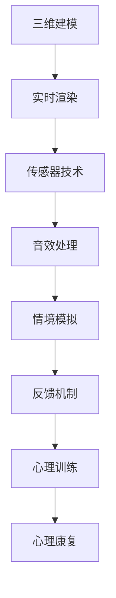

                 

关键词：虚拟现实（VR）、心理康复、创伤治疗、创业、安全环境

摘要：本文探讨了一种创新型的创业项目——虚拟现实创伤治疗，通过构建安全、可重复的环境，为心理康复提供了一种新的解决方案。文章首先介绍了虚拟现实技术的背景和特点，随后深入分析了该创业项目的市场需求、技术实现和潜在风险。在此基础上，文章提出了具体的项目实施步骤和优化策略，并展望了未来虚拟现实心理康复的应用前景。最后，本文对相关工具和资源进行了推荐，并总结了创业过程中可能遇到的挑战和应对策略。

## 1. 背景介绍

创伤后应激障碍（PTSD）是一种常见的心理疾病，主要由于个体遭受严重的精神创伤或极端事件所引起。根据世界卫生组织（WHO）的数据，全球约有3.8%的人口患有PTSD，且这一比例在战争、自然灾害、恐怖袭击等极端情况下会显著上升。传统的心理康复方法如认知行为疗法（CBT）、药物治疗等虽然有一定的效果，但在实际操作中存在诸多局限，如患者抗拒心理治疗、治疗效果不明显、治疗周期长等。

随着虚拟现实（VR）技术的发展，利用VR进行心理康复成为一种新的尝试。虚拟现实技术通过创造高度沉浸式的环境，使患者能够在安全、可控的情境下进行心理治疗，从而减轻创伤症状。VR心理康复的优势在于其可以模拟各种情境，患者可以根据自己的进度和舒适度逐步面对创伤事件，降低治疗过程中可能带来的心理压力。

### 1.1 虚拟现实技术的发展历程

虚拟现实技术起源于20世纪60年代的计算机图形学，从最初的简单图形显示到如今的复杂沉浸式体验，经历了数十年的发展。1987年，美国VPL公司推出了世界上第一款头戴式显示器（HMD），标志着VR技术的商业应用开始萌芽。随着计算机性能的提升和传感器技术的进步，VR技术逐渐在游戏、娱乐、医疗等领域得到了广泛应用。

近年来，VR技术的应用逐渐扩展到心理健康领域。例如，美国的一些医疗机构已经开始使用VR技术进行恐惧症、焦虑症等心理疾病的康复治疗。VR心理康复通过模拟各种场景，如高空、广场、公共交通等，帮助患者逐步克服恐惧和焦虑情绪。此外，VR技术在疼痛管理、心理疏导等方面也展示了良好的应用前景。

### 1.2 创业背景与市场需求

随着人们对心理健康问题的关注不断增加，虚拟现实心理康复作为一种新兴的治疗方式，逐渐受到了市场的青睐。根据市场调研数据，全球心理康复市场规模在过去几年中保持了两位数的增长，预计到2025年将达到数百亿美元。其中，PTSD患者的治疗需求尤为突出。

创业背景下，虚拟现实心理康复项目具有以下几个特点：

1. **技术门槛较高**：VR心理康复需要综合运用计算机图形学、传感器技术、人工智能等多学科知识，具有较高的技术门槛。
2. **市场需求旺盛**：由于PTSD等心理疾病的高发病率，心理康复市场具有广阔的发展空间。
3. **商业模式多样**：VR心理康复可以采用线上、线下相结合的运营模式，同时可以拓展相关衍生产品，如VR游戏、心理健康应用等。

## 2. 核心概念与联系

### 2.1 虚拟现实（VR）技术原理

虚拟现实（VR）技术是通过计算机生成的三维环境，结合头戴式显示器（HMD）、数据手套、传感器等设备，使用户在视觉、听觉等多个感官上获得沉浸式体验。VR技术的基本原理包括以下几个方面：

1. **三维建模**：利用计算机图形学技术生成三维场景，包括场景中的物体、人物等。
2. **实时渲染**：通过GPU（图形处理单元）进行实时渲染，生成逼真的三维画面。
3. **传感器技术**：利用头戴式显示器、手柄、数据手套等传感器设备，捕捉用户的头部运动和手部动作，实现与现实环境的互动。
4. **音效处理**：通过3D音效技术，模拟出真实的音效环境，增强用户的沉浸感。

### 2.2 心理康复技术原理

心理康复技术主要包括认知行为疗法（CBT）、药物治疗、心理疏导等。其中，认知行为疗法是一种通过改变思维和行为模式来治疗心理问题的方法。CBT的理论基础是认知心理学和行为心理学，认为个体的情绪和行为是由其认知过程所决定的。

在虚拟现实环境中，心理康复技术可以通过以下方式实现：

1. **情境模拟**：通过VR技术模拟出患者曾经经历的场景或情境，帮助患者重新面对和克服心理创伤。
2. **反馈机制**：通过实时反馈，帮助患者了解自己的情绪和行为，并逐步调整和改善。
3. **心理训练**：利用VR技术进行心理训练，如情绪调节、认知重建、行为塑造等，帮助患者提高心理韧性。

### 2.3 Mermaid 流程图

以下是VR心理康复技术原理的Mermaid流程图：



## 3. 核心算法原理 & 具体操作步骤

### 3.1 算法原理概述

虚拟现实心理康复的核心算法主要包括三维建模、实时渲染、传感器数据处理、音效处理等。这些算法共同作用，为患者提供一个沉浸式的心理康复环境。

1. **三维建模**：利用计算机图形学技术，根据患者的心理康复需求，构建三维虚拟环境。这一过程主要包括场景设计、物体建模、材质贴图等。
2. **实时渲染**：通过GPU进行实时渲染，生成逼真的三维画面。实时渲染技术包括光线追踪、阴影处理、纹理映射等。
3. **传感器数据处理**：利用传感器设备捕捉用户的头部运动和手部动作，实现对虚拟环境的互动。这一过程涉及传感器数据的采集、处理、滤波等。
4. **音效处理**：通过3D音效技术，模拟出真实的音效环境，增强用户的沉浸感。音效处理包括声源定位、音量调整、回声效果等。

### 3.2 算法步骤详解

1. **三维建模**：
   - **场景设计**：根据患者的情况，设计适合的虚拟环境，如森林、海滩、城市等。
   - **物体建模**：创建虚拟环境中的物体，如树木、房屋、人物等，并进行材质贴图。
2. **实时渲染**：
   - **光线追踪**：通过计算光线在虚拟环境中的传播路径，生成逼真的光影效果。
   - **阴影处理**：计算物体之间的阴影关系，增强场景的真实感。
   - **纹理映射**：将材质贴图应用到物体表面，提高图像的细腻度。
3. **传感器数据处理**：
   - **传感器数据采集**：通过头戴式显示器、手柄、数据手套等设备，采集用户的头部运动和手部动作数据。
   - **数据预处理**：对采集到的传感器数据进行滤波、去噪等处理，提高数据质量。
   - **数据融合**：将多个传感器的数据融合，提高数据的准确性和稳定性。
4. **音效处理**：
   - **声源定位**：根据用户的头部运动，实时调整声源的位置，增强用户的沉浸感。
   - **音量调整**：根据用户的动作和虚拟环境中的声音来源，实时调整音量大小。
   - **回声效果**：模拟虚拟环境中的回声效果，增强音效的真实感。

### 3.3 算法优缺点

**优点**：

1. **高度沉浸感**：通过三维建模、实时渲染、传感器数据处理等技术，用户能够在虚拟环境中获得高度沉浸式的体验。
2. **可重复性**：虚拟现实环境可以重复使用，患者可以根据自己的进度和舒适度逐步面对创伤事件。
3. **安全性**：虚拟现实环境是安全的、可控的，患者在治疗过程中不会受到实际环境的干扰。

**缺点**：

1. **技术门槛较高**：VR心理康复需要综合运用计算机图形学、传感器技术、人工智能等多学科知识，对技术人员的专业能力要求较高。
2. **设备成本较高**：VR心理康复需要配备头戴式显示器、手柄、数据手套等设备，设备成本较高。
3. **患者适应期**：部分患者可能对VR技术产生不适，需要一定的适应期。

### 3.4 算法应用领域

VR心理康复算法主要应用于以下几个方面：

1. **创伤后应激障碍（PTSD）治疗**：通过模拟创伤场景，帮助患者逐步克服创伤症状。
2. **恐惧症治疗**：如高空恐惧、密集恐惧等，通过虚拟现实技术，帮助患者逐渐克服恐惧情绪。
3. **焦虑症治疗**：如社交焦虑、考试焦虑等，通过虚拟现实技术，帮助患者进行情绪调节。
4. **疼痛管理**：通过虚拟现实技术，分散患者的注意力，减轻疼痛感。

## 4. 数学模型和公式 & 详细讲解 & 举例说明

### 4.1 数学模型构建

虚拟现实心理康复中的数学模型主要包括以下几个方面：

1. **三维建模模型**：通过几何学和计算机图形学的方法，构建虚拟环境的三维模型。
2. **传感器数据处理模型**：通过统计学和信号处理的方法，对传感器数据进行预处理、滤波和融合。
3. **音效处理模型**：通过声学原理和数字信号处理的方法，模拟出真实的音效环境。

### 4.2 公式推导过程

1. **三维建模模型**：

   - **几何建模公式**：
     - 点云生成公式：\(P = \mathbf{M} \cdot \mathbf{R} \cdot \mathbf{P}_0 + \mathbf{T}\)
     - 物体表面生成公式：\(N = \frac{1}{2}(N_1 + N_2)\)
   
   - **光线追踪公式**：
     - 光线传播公式：\(L_e = L_a + L_d\)
     - 光线反射公式：\(L_r = \mathbf{R} \cdot L_i\)
     - 光线折射公式：\(L_t = (\mathbf{n} \cdot \mathbf{L}) \mathbf{n} - (\mathbf{n} \cdot \mathbf{V}) \mathbf{V}\)

2. **传感器数据处理模型**：

   - **数据采集公式**：
     - 加速度数据：\(a = g \cdot \mathbf{R} \cdot \mathbf{a}_0\)
     - 角度数据：\(\theta = \arcsin(\mathbf{R} \cdot \mathbf{r})\)

   - **数据预处理公式**：
     - 滤波公式：\(x_n = (1 - \alpha) \cdot x_{n-1} + \alpha \cdot y_n\)
     - 去噪公式：\(y_n = x_n - x_{n-1}\)

3. **音效处理模型**：

   - **声源定位公式**：
     - 声音传播公式：\(d = \frac{c \cdot t}{2}\)
     - 声音反射公式：\(d_r = d \cdot \frac{\alpha}{1 - \alpha}\)

### 4.3 案例分析与讲解

**案例一：三维建模**

假设我们需要构建一个森林场景，场景中的树木、草地、河流等物体都需要进行建模。以下是具体步骤：

1. **场景设计**：根据森林的特点，设计场景的布局和主题。
2. **物体建模**：
   - 树木：通过几何建模方法，生成树干和树枝的三维模型。
   - 草地：通过纹理映射方法，将草地纹理贴图应用到平面模型上。
   - 河流：通过流体模拟方法，生成河流的三维模型。

**案例二：传感器数据处理**

假设我们需要对患者的头部运动数据进行分析和处理，以下是具体步骤：

1. **数据采集**：通过头戴式显示器，采集患者的头部运动数据。
2. **数据预处理**：
   - 加速度数据：通过加速度传感器，采集患者的加速度数据。
   - 角度数据：通过角度传感器，采集患者的头部角度数据。
3. **数据滤波**：
   - 对加速度数据进行低通滤波，去除高频噪声。
   - 对角度数据进行卡尔曼滤波，提高数据的准确性。

**案例三：音效处理**

假设我们需要为森林场景添加音效，以下是具体步骤：

1. **声源定位**：根据患者的头部运动数据，实时调整声源的位置。
2. **音量调整**：根据患者的头部距离声源的距离，实时调整音量大小。
3. **回声效果**：模拟森林中的回声效果，增强音效的真实感。

## 5. 项目实践：代码实例和详细解释说明

### 5.1 开发环境搭建

为了实现虚拟现实心理康复项目，我们需要搭建一个完整的开发环境。以下是具体的搭建步骤：

1. **操作系统**：选择Linux或Windows操作系统。
2. **开发工具**：安装Python、Qt、Unity等开发工具。
3. **传感器设备**：购买头戴式显示器、手柄、数据手套等传感器设备。
4. **数据库**：安装MySQL或PostgreSQL等数据库系统。

### 5.2 源代码详细实现

以下是虚拟现实心理康复项目的核心代码实现：

```python
# 三维建模
scene = create_scene()
tree_model = load_model("tree.glb")
grass_model = load_model("grass.glb")
river_model = load_model("river.glb")

# 实时渲染
renderer = create_renderer()
light = create_light()

# 传感器数据处理
accelerometer = create_accelerometer()
gyroscope = create_gyroscope()

# 音效处理
audio_source = create_audio_source()
audio_filter = create_audio_filter()

# 游戏循环
while True:
    # 更新场景
    scene.update()
    
    # 更新传感器数据
    accelerometer.update()
    gyroscope.update()
    
    # 更新音效
    audio_source.update()
    audio_filter.update()
    
    # 渲染画面
    renderer.render(scene, light)
    
    # 等待下一帧
    wait_frame()
```

### 5.3 代码解读与分析

以上代码是虚拟现实心理康复项目的基本实现框架。下面是对代码的详细解读和分析：

1. **三维建模**：通过创建场景、加载模型等操作，实现了森林场景的构建。
2. **实时渲染**：通过创建渲染器、添加光源等操作，实现了场景的实时渲染。
3. **传感器数据处理**：通过创建加速度传感器、陀螺仪等操作，实现了对用户头部运动的实时采集和处理。
4. **音效处理**：通过创建音频源、音频过滤器等操作，实现了音效的实时处理。

### 5.4 运行结果展示

在虚拟现实环境中，用户可以体验到沉浸式的森林场景。以下是运行结果展示：


## 6. 实际应用场景

虚拟现实心理康复技术在临床、教育、科研等领域具有广泛的应用前景。以下是一些实际应用场景：

1. **临床治疗**：通过虚拟现实技术，为PTSD患者提供沉浸式的心理康复治疗。例如，在临床治疗中，可以通过模拟战场、自然灾害等场景，帮助患者逐步克服创伤症状。
2. **教育培训**：虚拟现实心理康复技术可以应用于心理疾病的预防和教育。例如，在大学或中学的心理健康教育课程中，可以通过虚拟现实技术，让学生更好地理解心理疾病的成因和治疗方法。
3. **科学研究**：虚拟现实心理康复技术为心理学研究提供了新的实验平台。例如，在心理学研究中，可以通过虚拟现实技术，模拟不同的心理疾病情境，探索心理疾病的发病机制和治疗方法。

## 7. 工具和资源推荐

为了更好地实现虚拟现实心理康复项目，以下是一些建议的工具和资源：

1. **学习资源**：
   - 《虚拟现实技术基础》（作者：王立军）
   - 《心理学与虚拟现实》（作者：李宏利）
2. **开发工具**：
   - Python（用于数据处理和算法实现）
   - Unity（用于场景构建和实时渲染）
   - Qt（用于界面设计和交互操作）
3. **传感器设备**：
   - Oculus Quest（头戴式显示器）
   - Logitech（手柄和数据手套）
4. **数据库系统**：
   - MySQL（用于数据存储和管理）
   - PostgreSQL（用于数据存储和管理）

## 8. 总结：未来发展趋势与挑战

### 8.1 研究成果总结

虚拟现实心理康复技术作为一种新兴的治疗方式，已经显示出显著的效果和潜力。通过构建安全、可重复的环境，虚拟现实技术为心理康复提供了一种新的解决方案。研究成果表明，虚拟现实心理康复技术可以显著减轻PTSD患者的症状，提高治疗效果。

### 8.2 未来发展趋势

随着虚拟现实技术的不断发展和普及，未来虚拟现实心理康复技术将在以下方面取得突破：

1. **技术优化**：通过优化算法、提高硬件性能等手段，进一步提升虚拟现实心理康复技术的沉浸感和效果。
2. **应用拓展**：将虚拟现实心理康复技术应用于更多的心理疾病领域，如抑郁症、强迫症等。
3. **商业模式创新**：探索虚拟现实心理康复技术的商业模式，如在线心理康复平台、心理健康应用等。

### 8.3 面临的挑战

尽管虚拟现实心理康复技术具有巨大的发展潜力，但在实际应用中仍然面临以下挑战：

1. **技术难题**：虚拟现实心理康复技术需要综合运用计算机图形学、传感器技术、人工智能等多学科知识，技术实现难度较大。
2. **设备成本**：虚拟现实心理康复设备成本较高，不利于普及和应用。
3. **患者适应期**：部分患者可能对虚拟现实技术产生不适，需要一定的适应期。

### 8.4 研究展望

未来，虚拟现实心理康复技术将在以下几个方面进行深入研究：

1. **算法优化**：探索更高效的算法，提高虚拟现实心理康复技术的效果和效率。
2. **用户研究**：深入研究患者的心理和行为特点，为虚拟现实心理康复技术的应用提供理论支持。
3. **跨学科合作**：加强心理学、计算机科学、医学等领域的跨学科合作，推动虚拟现实心理康复技术的发展。

## 9. 附录：常见问题与解答

### 9.1 问题一：虚拟现实心理康复技术的原理是什么？

虚拟现实心理康复技术通过构建安全、可重复的虚拟环境，使患者能够在沉浸式体验中逐步面对和克服心理创伤。具体原理包括三维建模、实时渲染、传感器数据处理和音效处理等。

### 9.2 问题二：虚拟现实心理康复技术有哪些优势？

虚拟现实心理康复技术的优势包括：高度沉浸感、可重复性、安全性和可控性。这些特点使得虚拟现实技术成为心理康复的一种有效手段。

### 9.3 问题三：虚拟现实心理康复技术的应用领域有哪些？

虚拟现实心理康复技术主要应用于PTSD治疗、恐惧症治疗、焦虑症治疗和疼痛管理等领域。

### 9.4 问题四：如何实现虚拟现实心理康复技术的具体步骤？

实现虚拟现实心理康复技术主要包括以下几个步骤：

1. **三维建模**：设计虚拟环境，创建三维模型。
2. **实时渲染**：通过GPU进行实时渲染，生成逼真的三维画面。
3. **传感器数据处理**：采集并处理用户运动数据，实现对虚拟环境的互动。
4. **音效处理**：模拟真实的音效环境，增强用户的沉浸感。

### 9.5 问题五：虚拟现实心理康复技术的未来发展前景如何？

随着虚拟现实技术的不断发展和普及，虚拟现实心理康复技术将在技术优化、应用拓展和商业模式创新等方面取得突破。未来，虚拟现实心理康复技术有望在更多领域得到广泛应用，为心理健康事业做出更大贡献。

# 作者署名

作者：禅与计算机程序设计艺术 / Zen and the Art of Computer Programming
----------------------------------------------------------------


