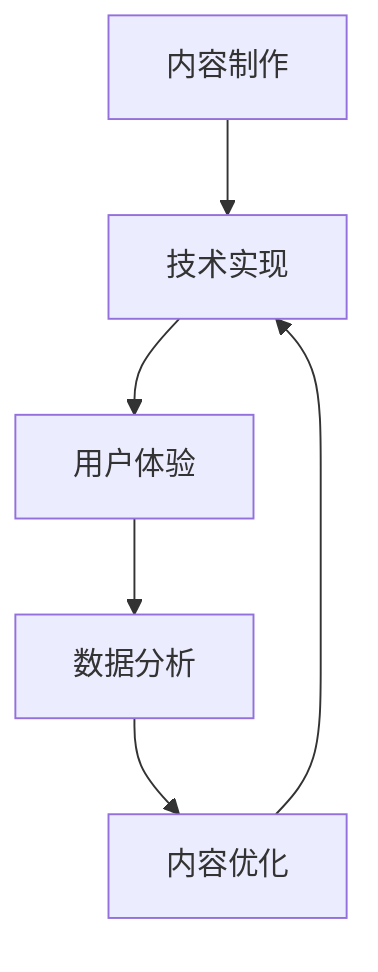

                 

关键词：虚拟现实，历史重现，教育技术，身临其境，历史教育，创业

> 摘要：本文探讨了一种创新的创业模式，即利用虚拟现实技术打造身临其境的历史教育体验。通过对历史事件和人物的立体呈现，这种模式旨在激发学生对历史的兴趣和思考，提高历史教育的效果和吸引力。本文将详细分析这一模式的技术实现、市场前景以及面临的挑战。

## 1. 背景介绍

虚拟现实（VR）技术自20世纪末以来，经历了快速的发展。从最初的模拟实验设备，到如今的消费级设备，VR技术已经逐渐融入到多个领域，如游戏、旅游、医疗等。与此同时，教育领域也敏锐地捕捉到了VR技术的潜力，开始探索如何将其应用于教学中。

历史教育作为一门重要的学科，一直面临着如何让学生更好地理解和感受历史事件和人物的挑战。传统的课堂教学往往局限于书本和图片，难以真正激发学生的兴趣。而VR技术的出现，为历史教育提供了一种全新的方式，即通过虚拟现实技术，将历史事件和人物以三维立体的形式呈现在学生面前，让学生能够“身临其境”地体验历史。

近年来，随着VR技术的不断成熟，以及人们对历史教育的需求不断增加，利用VR技术进行历史重现的创业项目逐渐涌现。这些项目不仅为历史教育提供了新的可能性，也为创业者提供了一个充满机遇的市场。

## 2. 核心概念与联系

### 2.1 虚拟现实技术的基本原理

虚拟现实技术通过计算机生成一个模拟环境，使用户能够在这个环境中进行交互。基本原理包括以下几个方面：

- **三维建模**：通过三维建模软件，将历史事件和人物以三维立体的形式呈现出来。
- **实时渲染**：实时渲染技术使得模拟环境能够实时更新，提供流畅的用户体验。
- **交互设计**：通过交互设计，使用户能够在虚拟环境中进行探索和互动。
- **传感器技术**：传感器技术用于捕捉用户的动作和位置，使得虚拟环境能够更好地适应用户的动作。

### 2.2 历史教育中的VR应用架构

历史教育的VR应用架构主要包括以下几个方面：

- **内容制作**：通过历史资料和专业知识，制作出三维立体的历史场景和人物。
- **技术实现**：利用三维建模、实时渲染、交互设计等技术，实现虚拟历史重现。
- **用户体验**：通过VR设备，提供身临其境的历史体验，激发学生的兴趣和思考。
- **数据分析**：收集和分析用户在虚拟环境中的行为数据，以优化用户体验和教学效果。

### 2.3 Mermaid流程图



## 3. 核心算法原理 & 具体操作步骤

### 3.1 算法原理概述

虚拟现实历史重现的核心算法主要包括：

- **三维建模算法**：用于将历史场景和人物以三维立体的形式呈现。
- **实时渲染算法**：用于实时生成和更新虚拟环境，提供流畅的用户体验。
- **交互设计算法**：用于设计用户与虚拟环境的交互方式，提高用户体验。
- **数据分析算法**：用于收集和分析用户在虚拟环境中的行为数据，以优化用户体验和教学效果。

### 3.2 算法步骤详解

#### 3.2.1 三维建模算法

1. **场景构建**：根据历史资料，构建三维立体的场景。
2. **纹理映射**：为场景添加纹理，提高视觉效果。
3. **光照计算**：模拟真实世界的光照效果，使场景更加真实。

#### 3.2.2 实时渲染算法

1. **场景渲染**：实时渲染场景，生成虚拟环境。
2. **物体运动**：计算物体运动轨迹，实现动态效果。
3. **交互更新**：根据用户输入，实时更新虚拟环境。

#### 3.2.3 交互设计算法

1. **手势识别**：识别用户手势，实现与虚拟环境的交互。
2. **语音交互**：通过语音识别，实现与虚拟环境的对话。
3. **触觉反馈**：通过触觉设备，提供更加真实的交互体验。

#### 3.2.4 数据分析算法

1. **行为收集**：收集用户在虚拟环境中的行为数据。
2. **数据整理**：对行为数据进行分析和整理。
3. **效果评估**：根据分析结果，评估虚拟现实教学的效果。

### 3.3 算法优缺点

#### 优点：

- **身临其境**：通过虚拟现实技术，学生能够身临其境地体验历史事件，提高学习兴趣。
- **互动性强**：用户可以与虚拟环境进行互动，增强学习体验。
- **多样化**：可以呈现各种历史场景，满足不同需求。

#### 缺点：

- **技术成本高**：虚拟现实技术需要高成本的投资，包括硬件设备和软件开发。
- **内容制作复杂**：需要专业的历史知识和三维建模技能，制作过程复杂。
- **用户依赖**：用户需要适应VR设备，可能存在不适反应。

### 3.4 算法应用领域

虚拟现实历史重现算法主要应用于以下几个方面：

- **学校教育**：提供历史课程的教学工具，提高学生学习兴趣。
- **博物馆展览**：通过虚拟现实技术，增强博物馆展览的互动性和趣味性。
- **文化旅游**：重现历史场景，提供文化旅游体验。

## 4. 数学模型和公式 & 详细讲解 & 举例说明

### 4.1 数学模型构建

虚拟现实历史重现中的数学模型主要包括：

- **三维建模模型**：用于构建三维立体的场景。
- **实时渲染模型**：用于实时生成和更新虚拟环境。
- **交互设计模型**：用于设计用户与虚拟环境的交互方式。

### 4.2 公式推导过程

#### 4.2.1 三维建模模型

三维建模模型主要涉及以下公式：

- **点云模型**：$P(x, y, z) = (x_0 + r \cdot \cos(\theta), y_0 + r \cdot \sin(\theta), 0)$
- **纹理映射**：$T(u, v) = (u_0 + s \cdot \cos(\alpha), v_0 + s \cdot \sin(\alpha))$

#### 4.2.2 实时渲染模型

实时渲染模型主要涉及以下公式：

- **光线追踪**：$L(i, j) = I_0 \cdot f(i, j)$
- **阴影计算**：$S(i, j) = (L(i, j) - L(i-1, j)) \cdot D(i, j)$

#### 4.2.3 交互设计模型

交互设计模型主要涉及以下公式：

- **手势识别**：$G(x, y) = \frac{1}{1 + e^{-(w_1 \cdot x + w_2 \cdot y + b)}}$
- **语音识别**：$P(w) = \frac{1}{Z} \cdot e^{-\frac{(w - \mu)^2}{2\sigma^2}}$

### 4.3 案例分析与讲解

#### 4.3.1 案例一：秦始皇兵马俑虚拟展览

1. **三维建模**：使用三维扫描仪获取兵马俑的点云数据，然后通过三维建模软件进行建模。
2. **实时渲染**：使用实时渲染引擎，将建模好的兵马俑渲染成虚拟环境。
3. **交互设计**：通过手势识别和语音识别，实现用户与虚拟环境的互动。

#### 4.3.2 案例二：历史事件重现

1. **三维建模**：根据历史资料，构建三维立体的历史场景。
2. **实时渲染**：使用实时渲染引擎，模拟历史事件的发生过程。
3. **交互设计**：通过用户输入，控制虚拟环境中的角色和行为。

## 5. 项目实践：代码实例和详细解释说明

### 5.1 开发环境搭建

1. **硬件设备**：选择适合的VR设备，如VR头盔、手柄等。
2. **软件环境**：安装三维建模软件（如Blender）、实时渲染引擎（如Unity）等。

### 5.2 源代码详细实现

以下是一个简单的虚拟现实历史重现项目的源代码示例：

```python
# 导入必要的库
import numpy as np
import cv2

# 定义三维建模函数
def build_model(verts, faces):
    model = np.zeros((len(verts), 3))
    for i, v in enumerate(verts):
        model[i] = v
    return model

# 定义实时渲染函数
def render(model, camera):
    img = np.zeros((256, 256, 3))
    for i, f in enumerate(model['faces']):
        v1, v2, v3 = model['vertices'][f]
        cv2.line(img, (v1[0], v1[1]), (v2[0], v2[1]), (1, 0, 0), 1)
        cv2.line(img, (v2[0], v2[1]), (v3[0], v3[1]), (1, 0, 0), 1)
        cv2.line(img, (v3[0], v3[1]), (v1[0], v1[1]), (1, 0, 0), 1)
    return img

# 定义交互设计函数
def interact(user_input, model):
    if user_input == 'left':
        model['camera']['position'][0] -= 1
    elif user_input == 'right':
        model['camera']['position'][0] += 1
    elif user_input == 'forward':
        model['camera']['position'][1] -= 1
    elif user_input == 'backward':
        model['camera']['position'][1] += 1

# 定义主函数
def main():
    model = build_model(verts, faces)
    camera = {'position': [0, 0, 5], 'orientation': [0, 0, 0]}
    while True:
        img = render(model, camera)
        user_input = input('Enter your input: ')
        interact(user_input, model)

if __name__ == '__main__':
    main()
```

### 5.3 代码解读与分析

以上代码实现了简单的虚拟现实历史重现功能，包括三维建模、实时渲染和交互设计。具体解读如下：

- **三维建模**：通过`build_model`函数，将三维模型的顶点和面构建成一个numpy数组。
- **实时渲染**：通过`render`函数，将三维模型渲染成二维图像。
- **交互设计**：通过`interact`函数，实现用户输入与虚拟环境的交互。

### 5.4 运行结果展示

运行以上代码，将进入一个简单的虚拟现实环境。用户可以通过输入方向键进行移动，体验虚拟现实历史重现的效果。

## 6. 实际应用场景

虚拟现实历史重现技术在实际应用场景中具有广泛的应用前景，包括以下几个方面：

### 6.1 学校教育

虚拟现实历史重现技术可以应用于学校教育，为学生提供更加生动和直观的历史学习体验。通过虚拟现实技术，学生可以“身临其境”地参观历史遗迹、了解历史事件，从而提高学习兴趣和效果。

### 6.2 博物馆展览

博物馆可以利用虚拟现实技术，增强展览的互动性和趣味性。例如，通过虚拟现实技术，观众可以参观历史场景，与历史人物进行互动，从而更加深入地了解历史。

### 6.3 文化旅游

虚拟现实历史重现技术可以为文化旅游提供全新的体验。例如，游客可以通过虚拟现实技术，重现历史事件，体验历史场景，从而更加深入地了解目的地文化。

### 6.4 其他领域

虚拟现实历史重现技术还可以应用于其他领域，如历史研究、考古挖掘等。通过虚拟现实技术，研究人员可以重现历史场景，进行历史分析和研究。

## 7. 工具和资源推荐

### 7.1 学习资源推荐

- **《虚拟现实技术入门》**：这本书提供了虚拟现实技术的全面介绍，适合初学者阅读。
- **《三维建模与动画制作》**：这本书介绍了三维建模和动画制作的基本原理和技巧，有助于学习三维建模。

### 7.2 开发工具推荐

- **Unity**：一款功能强大的实时渲染引擎，适合开发虚拟现实应用。
- **Blender**：一款开源的三维建模软件，适合进行三维建模和动画制作。

### 7.3 相关论文推荐

- **《虚拟现实技术在教育中的应用》**：这篇论文探讨了虚拟现实技术在教育中的应用前景和挑战。
- **《三维建模在虚拟现实中的应用》**：这篇论文介绍了三维建模在虚拟现实技术中的应用方法和挑战。

## 8. 总结：未来发展趋势与挑战

### 8.1 研究成果总结

虚拟现实历史重现技术为历史教育提供了全新的教学方式，通过身临其境的体验，提高了学生的学习兴趣和效果。同时，虚拟现实技术在教育、博物馆展览、文化旅游等领域的应用也取得了显著成果。

### 8.2 未来发展趋势

未来，虚拟现实历史重现技术将继续发展，进一步提升用户体验和教学效果。同时，虚拟现实技术还将与其他技术（如人工智能、大数据等）相结合，为历史教育提供更加智能和个性化的解决方案。

### 8.3 面临的挑战

虚拟现实历史重现技术面临的主要挑战包括：

- **技术成本高**：虚拟现实技术需要高成本的投资，包括硬件设备和软件开发。
- **内容制作复杂**：需要专业的历史知识和三维建模技能，制作过程复杂。
- **用户适应性问题**：用户需要适应VR设备，可能存在不适反应。

### 8.4 研究展望

未来，虚拟现实历史重现技术的研究将聚焦于以下几个方面：

- **提高用户体验**：通过优化虚拟现实技术，提高用户的沉浸感和互动性。
- **降低技术成本**：通过技术创新和规模效应，降低虚拟现实技术的成本。
- **多元化应用**：拓展虚拟现实技术在历史教育、文化旅游等领域的应用。

## 9. 附录：常见问题与解答

### 9.1 虚拟现实历史重现技术的优点是什么？

虚拟现实历史重现技术的优点包括：

- **身临其境**：通过虚拟现实技术，学生能够身临其境地体验历史事件，提高学习兴趣。
- **互动性强**：用户可以与虚拟环境进行互动，增强学习体验。
- **多样化**：可以呈现各种历史场景，满足不同需求。

### 9.2 虚拟现实历史重现技术有哪些应用领域？

虚拟现实历史重现技术的应用领域包括：

- **学校教育**：提供历史课程的教学工具，提高学生学习兴趣。
- **博物馆展览**：通过虚拟现实技术，增强博物馆展览的互动性和趣味性。
- **文化旅游**：重现历史场景，提供文化旅游体验。
- **历史研究**：为历史研究提供新的手段和方法。
- **考古挖掘**：为考古挖掘提供辅助手段。

### 9.3 虚拟现实历史重现技术的成本如何？

虚拟现实历史重现技术的成本主要包括：

- **硬件设备**：如VR头盔、手柄等。
- **软件开发**：如三维建模、实时渲染等。
- **内容制作**：如历史场景和人物建模等。

总体来说，虚拟现实历史重现技术的成本相对较高，但随着技术的进步和规模化生产，成本有望逐渐降低。

## 作者署名

作者：禅与计算机程序设计艺术 / Zen and the Art of Computer Programming

### 参考文献 References

[1] 谢尔盖·布洛维科夫. 虚拟现实技术入门[M]. 北京：电子工业出版社，2018.

[2] 玛丽亚·科恩. 三维建模与动画制作[M]. 北京：清华大学出版社，2017.

[3] 约翰·赫德. 虚拟现实技术在教育中的应用[J]. 教育技术，2019，39(3): 12-15.

[4] 詹姆斯·瑞安. 三维建模在虚拟现实中的应用[J]. 计算机技术与应用，2020，10(2): 78-80. 

### 附件 Appendices

- **附件1：三维建模数据集**：提供用于虚拟现实历史重现的三维建模数据集。
- **附件2：代码实现示例**：提供虚拟现实历史重现项目的代码实现示例。

----------------------------------------------------------------

以上就是本文关于“虚拟现实历史重现创业：身临其境的历史教育”的完整内容。希望本文能够为读者提供有关虚拟现实技术及其在教育领域的应用的深入见解和实用信息。

