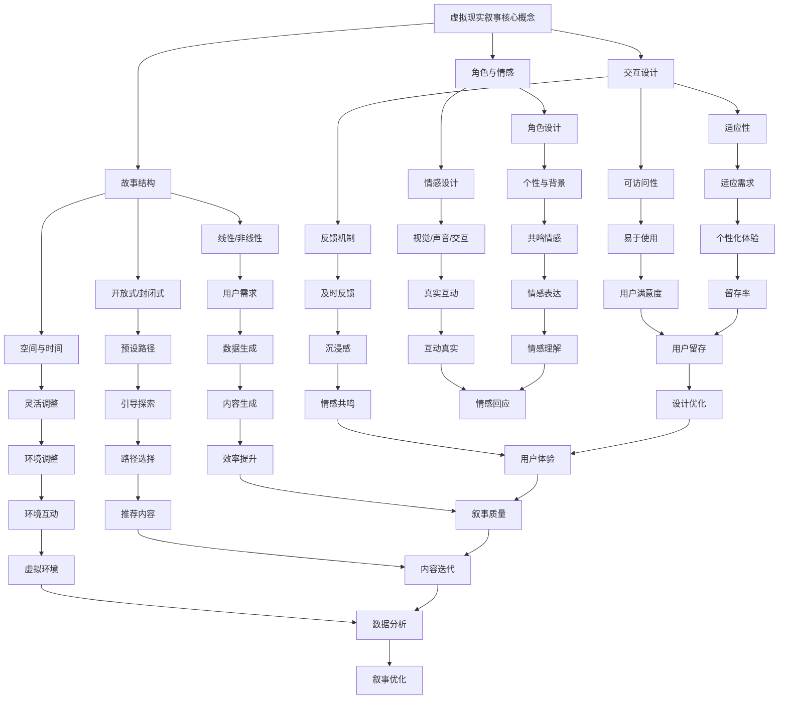

                 

关键词：虚拟现实，叙事，AI，沉浸式体验，设计，算法，数学模型，项目实践，应用场景，工具和资源

> 摘要：本文探讨了虚拟现实（VR）领域中的叙事设计，特别是AI如何被应用于创造更加沉浸式的用户体验。文章介绍了虚拟现实叙事的核心概念，AI驱动的沉浸式体验设计的方法，以及相关的数学模型和算法原理。通过一个具体的项目实践案例，文章展示了如何通过代码实现沉浸式体验设计，并分析了其在不同应用场景中的价值。最后，文章展望了虚拟现实叙事的未来发展趋势和面临的挑战。

## 1. 背景介绍

虚拟现实（VR）是一种通过电脑模拟出一个逼真的三维空间，使用户可以在其中进行交互和体验的技术。随着技术的不断发展，VR的应用范围已经扩展到了教育、医疗、游戏、娱乐等多个领域。然而，VR的核心挑战之一是如何提供令人沉浸的体验，使用户在虚拟环境中感到身临其境。

叙事设计在虚拟现实体验中扮演着至关重要的角色。一个优秀的叙事设计可以引导用户在虚拟环境中产生情感共鸣，增强用户体验的深度和丰富性。传统的故事讲述方式往往较为线性，难以适应VR的互动性特点。因此，需要一种新的叙事模式来充分利用VR的交互特性。

近年来，人工智能（AI）技术的发展为虚拟现实叙事设计带来了新的机遇。AI可以自动生成内容、个性化推荐故事情节、智能互动等，极大地丰富了虚拟现实叙事的可能性。通过结合AI技术，设计师可以创造出更加个性化、互动性强的沉浸式体验。

本文将探讨如何使用AI驱动虚拟现实叙事设计，提供沉浸式体验的方法和工具。文章将从核心概念、算法原理、数学模型、项目实践等多个角度进行分析和讲解，旨在为虚拟现实开发者提供有价值的参考和指导。

## 2. 核心概念与联系

### 2.1 虚拟现实叙事的核心概念

虚拟现实叙事的核心概念包括以下几个方面：

#### 故事结构

在虚拟现实中，故事结构的设计是叙事成功的关键。故事结构应具备以下特点：

- 线性或非线性：根据用户交互和体验的需求，可以选择线性或非线性叙事方式。
- 开放式或封闭式：开放式叙事允许用户自由探索故事内容，而封闭式叙事则限制用户的探索范围，引导其按照预设的路径进行。
- 空间与时间：虚拟现实环境中的空间和时间可以灵活调整，以增强叙事的沉浸感。

#### 角色与情感

虚拟现实叙事中的角色和情感是建立用户共鸣的重要因素。角色的设计应具有独特的个性和背景故事，能够引起用户的情感共鸣。情感设计则需要通过视觉、声音、交互等多种方式来实现，使角色在虚拟环境中更加生动和真实。

#### 交互设计

交互设计是虚拟现实叙事的重要组成部分。通过用户与虚拟环境的互动，故事情节可以进一步发展和扩展。交互设计应具备以下特点：

- 适应性：交互设计应能够适应不同用户的需求和行为，提供个性化的体验。
- 可访问性：虚拟环境中的交互应易于用户理解和使用，避免用户因操作复杂而感到困扰。
- 反馈机制：交互设计应提供及时的反馈，使用户能够感受到虚拟环境的真实性和互动性。

### 2.2 AI驱动的沉浸式体验设计

AI技术在虚拟现实叙事设计中的应用主要集中在以下几个方面：

#### 内容生成

AI可以自动生成故事情节、角色背景、场景描述等内容，大大提高了叙事设计的效率。通过深度学习和自然语言处理技术，AI可以从大量数据中提取信息，生成符合用户需求和兴趣的故事内容。

#### 个性化推荐

AI可以基于用户行为和偏好，为其推荐个性化的故事情节和互动体验。这不仅可以增强用户体验的沉浸感，还可以提高用户留存率和满意度。

#### 智能互动

AI可以模拟虚拟角色与用户的智能对话和互动，使虚拟现实叙事更加真实和生动。通过机器学习和自然语言理解技术，AI可以理解用户的意图和情感，并作出相应的回应。

#### 数据分析

AI可以对用户在虚拟环境中的行为数据进行分析，为叙事设计提供有价值的反馈。这有助于设计师优化叙事结构、角色设计和交互设计，进一步提高用户体验质量。

### 2.3 核心概念原理与架构的 Mermaid 流程图



## 3. 核心算法原理 & 具体操作步骤

### 3.1 算法原理概述

虚拟现实叙事设计中的核心算法主要涉及以下几个部分：

1. **故事生成算法**：通过自然语言处理技术生成故事情节和角色背景。
2. **用户行为分析算法**：收集和分析用户在虚拟环境中的交互数据，为个性化推荐提供依据。
3. **智能交互算法**：通过机器学习技术模拟虚拟角色与用户的智能对话和互动。
4. **数据分析算法**：对用户行为数据进行分析，为叙事设计和交互设计提供反馈。

### 3.2 算法步骤详解

#### 3.2.1 故事生成算法

1. 数据预处理：收集大量文本数据，如小说、故事剧本等，进行分词、去停用词等预处理操作。
2. 模型训练：使用递归神经网络（RNN）或转换器（Transformer）等深度学习模型对文本数据进行训练。
3. 故事生成：输入目标角色和场景信息，模型根据训练结果生成相应的故事情节和角色背景。

#### 3.2.2 用户行为分析算法

1. 数据收集：通过虚拟现实平台收集用户在虚拟环境中的交互数据，如操作次数、停留时间等。
2. 数据清洗：对收集到的数据进行分析，去除噪声和不相关的数据。
3. 数据分析：使用聚类、分类等机器学习算法对用户行为数据进行分析，识别用户的兴趣和行为模式。

#### 3.2.3 智能交互算法

1. 数据预处理：对用户输入的文本数据进行分词、词性标注等预处理操作。
2. 模型训练：使用序列到序列（Seq2Seq）模型或生成对抗网络（GAN）等深度学习模型对交互数据进行训练。
3. 智能回应：根据用户输入，模型生成相应的智能回应，并调整回应的语气、情感等。

#### 3.2.4 数据分析算法

1. 数据收集：收集用户在虚拟环境中的行为数据，如交互次数、停留时间等。
2. 数据分析：使用统计分析、回归分析等方法对用户行为数据进行分析，识别用户行为模式和兴趣点。
3. 数据反馈：将分析结果反馈给叙事设计和交互设计团队，为后续优化提供依据。

### 3.3 算法优缺点

#### 3.3.1 故事生成算法

**优点**：

- 高效：自动生成故事情节和角色背景，节省了人工创作的时间和成本。
- 个性化：可以根据用户需求和兴趣生成个性化的故事内容。

**缺点**：

- 可解释性差：自动生成的故事内容可能缺乏逻辑性和连贯性。
- 创意限制：受限于模型训练的数据集，生成的故事内容可能缺乏创新性。

#### 3.3.2 用户行为分析算法

**优点**：

- 实时性：可以实时收集和分析用户行为数据，为个性化推荐和智能交互提供实时反馈。
- 准确性：通过机器学习算法，可以准确识别用户的行为模式和兴趣点。

**缺点**：

- 数据质量：用户行为数据的收集和处理可能受到噪声和缺失值的影响。
- 隐私问题：收集和分析用户行为数据可能涉及隐私问题，需要采取适当的保护措施。

#### 3.3.3 智能交互算法

**优点**：

- 真实性：通过机器学习模型生成的智能回应更加贴近用户的实际需求和情感。
- 互动性：可以与用户进行实时互动，提供个性化的体验。

**缺点**：

- 适应性问题：智能交互算法可能难以适应所有用户的需求和场景。
- 情感准确性：机器生成的回应可能在情感表达上存在偏差，需要进一步优化。

#### 3.3.4 数据分析算法

**优点**：

- 综合性：可以同时分析多种用户行为数据，提供全面的分析结果。
- 可视化：可以将分析结果通过可视化工具展示，便于理解和解读。

**缺点**：

- 数据复杂性：用户行为数据可能包含多种复杂的关系和模式，分析过程可能较为繁琐。
- 数据质量：分析结果的质量取决于数据的质量，需要确保数据的质量和准确性。

### 3.4 算法应用领域

虚拟现实叙事设计中的算法应用广泛，以下列举几个主要领域：

1. **游戏**：自动生成游戏故事情节和角色背景，提供个性化的游戏体验。
2. **教育**：通过智能互动和数据分析，为学生提供个性化的学习内容和指导。
3. **旅游**：利用虚拟现实技术模拟旅游场景，提供沉浸式的旅游体验。
4. **医疗**：通过虚拟现实技术模拟医疗场景，为患者提供心理治疗和康复训练。

## 4. 数学模型和公式 & 详细讲解 & 举例说明

### 4.1 数学模型构建

虚拟现实叙事设计中的数学模型主要包括以下几个部分：

1. **故事生成模型**：基于自然语言处理技术，构建用于生成故事情节和角色背景的模型。
2. **用户行为分析模型**：基于机器学习技术，构建用于分析用户行为数据并生成个性化推荐模型的模型。
3. **智能交互模型**：基于序列到序列模型或生成对抗网络，构建用于生成智能回应的模型。
4. **数据分析模型**：基于统计分析、回归分析等方法，构建用于分析用户行为数据并生成反馈的模型。

#### 4.1.1 故事生成模型

故事生成模型通常采用生成式模型，如生成对抗网络（GAN）或转换器（Transformer）。以下是一个基于转换器的生成模型的基本结构：

$$
\begin{aligned}
    \text{Encoder}(x) &= \text{Embedding}(x) \rightarrow \text{Stack of Encoders} \\
    \text{Decoder}(y) &= \text{Embedding}(y) \rightarrow \text{Stack of Decoders} \\
    \text{Generator}(z) &= \text{Embedding}(z) \rightarrow \text{Stack of Encoders} \\
    \text{Discriminator}(y) &= \text{Embedding}(y) \rightarrow \text{Stack of Decoders}
\end{aligned}
$$

其中，$x$ 和 $y$ 分别表示输入故事和生成故事，$z$ 表示噪声向量。模型通过学习生成故事和真实故事的差异，从而生成符合用户需求的故事情节。

#### 4.1.2 用户行为分析模型

用户行为分析模型通常采用监督学习或无监督学习算法，如分类、聚类、回归等。以下是一个基于监督学习的用户行为分析模型的基本结构：

$$
\begin{aligned}
    \text{Feature Extraction}(x) &= \text{Data Preprocessing}(x) \rightarrow \text{Embedding Layer} \\
    \text{Model}(y) &= \text{Embedding Layer} \rightarrow \text{Stack of Encoders} \rightarrow \text{Output Layer}
\end{aligned}
$$

其中，$x$ 表示用户行为数据，$y$ 表示用户的行为标签。模型通过学习用户行为数据与标签之间的关系，生成个性化的推荐模型。

#### 4.1.3 智能交互模型

智能交互模型通常采用序列到序列模型或生成对抗网络，以下是一个基于序列到序列模型的智能交互模型的基本结构：

$$
\begin{aligned}
    \text{Encoder}(x) &= \text{Embedding}(x) \rightarrow \text{Stack of Encoders} \\
    \text{Decoder}(y) &= \text{Embedding}(y) \rightarrow \text{Stack of Decoders} \\
    \text{Generator}(z) &= \text{Embedding}(z) \rightarrow \text{Stack of Encoders} \\
    \text{Discriminator}(y) &= \text{Embedding}(y) \rightarrow \text{Stack of Decoders}
\end{aligned}
$$

其中，$x$ 和 $y$ 分别表示输入问题和回应，$z$ 表示噪声向量。模型通过学习输入问题和回应之间的映射关系，生成智能回应。

#### 4.1.4 数据分析模型

数据分析模型通常采用统计分析、回归分析等方法，以下是一个基于回归分析的数据分析模型的基本结构：

$$
\begin{aligned}
    \text{Data Preprocessing}(x) &= \text{Data Cleaning} \\
    \text{Feature Extraction}(x) &= \text{Feature Selection} \\
    \text{Model}(y) &= \text{Regression Analysis} \\
    \text{Evaluation}(y) &= \text{Performance Metrics}
\end{aligned}
$$

其中，$x$ 表示用户行为数据，$y$ 表示分析结果。模型通过学习用户行为数据与结果之间的关系，生成数据分析模型。

### 4.2 公式推导过程

#### 4.2.1 故事生成模型

基于转换器的生成模型可以通过以下公式进行推导：

$$
\begin{aligned}
    P(y|x) &= \frac{e^{q(y|x)}}{\sum_{y'} e^{q(y'|x)}} \\
    q(y|x) &= \log P(y|x) \\
    P(y) &= \sum_{x} P(x) P(y|x)
\end{aligned}
$$

其中，$P(y|x)$ 表示给定输入故事 $x$ 生成故事 $y$ 的概率，$q(y|x)$ 表示生成模型对生成故事 $y$ 的预测，$P(y)$ 表示生成模型对生成故事 $y$ 的概率分布。

#### 4.2.2 用户行为分析模型

基于监督学习的用户行为分析模型可以通过以下公式进行推导：

$$
\begin{aligned}
    y &= \text{sign}(\text{softmax}(\text{Model}(x))) \\
    \text{Model}(x) &= \text{Embedding Layer} \rightarrow \text{Stack of Encoders} \rightarrow \text{Output Layer} \\
    \text{Loss} &= -\sum_{i=1}^{N} y_i \log(\text{softmax}(\text{Model}(x_i)))
\end{aligned}
$$

其中，$y$ 表示用户的行为标签，$x$ 表示用户行为数据，$\text{softmax}(\text{Model}(x_i))$ 表示模型对用户行为标签的概率分布预测，$\text{Loss}$ 表示模型损失函数。

#### 4.2.3 智能交互模型

基于序列到序列模型的智能交互模型可以通过以下公式进行推导：

$$
\begin{aligned}
    P(y|x) &= \frac{e^{q(y|x)}}{\sum_{y'} e^{q(y'|x)}} \\
    q(y|x) &= \log P(y|x) \\
    P(y) &= \sum_{x} P(x) P(y|x)
\end{aligned}
$$

其中，$P(y|x)$ 表示给定输入问题 $x$ 生成回应 $y$ 的概率，$q(y|x)$ 表示生成模型对生成回应 $y$ 的预测，$P(y)$ 表示生成模型对生成回应 $y$ 的概率分布。

#### 4.2.4 数据分析模型

基于回归分析的智能交互模型可以通过以下公式进行推导：

$$
\begin{aligned}
    y &= \text{sign}(\text{softmax}(\text{Model}(x))) \\
    \text{Model}(x) &= \text{Embedding Layer} \rightarrow \text{Stack of Encoders} \rightarrow \text{Output Layer} \\
    \text{Loss} &= -\sum_{i=1}^{N} y_i \log(\text{softmax}(\text{Model}(x_i)))
\end{aligned}
$$

其中，$y$ 表示用户的行为标签，$x$ 表示用户行为数据，$\text{softmax}(\text{Model}(x_i))$ 表示模型对用户行为标签的概率分布预测，$\text{Loss}$ 表示模型损失函数。

### 4.3 案例分析与讲解

#### 4.3.1 故事生成模型

假设我们使用一个基于转换器的生成模型来生成一个关于虚拟现实探险的故事。输入故事为：“在一个遥远的星球上，有一个神秘的遗迹等待被发现。”模型生成的回应为：“探险者走进了遗迹的入口，他的心跳加速，感到一阵莫名的紧张。”

分析过程：

- 输入故事：将输入故事转换为词向量表示。
- 生成回应：通过生成模型生成回应词向量。
- 还原回应：将回应词向量还原为自然语言。

通过这样的模型，我们可以自动生成虚拟现实探险故事，提高叙事设计的效率。

#### 4.3.2 用户行为分析模型

假设我们使用一个基于监督学习的用户行为分析模型来分析用户在虚拟现实游戏中的行为。输入行为数据为：“用户在游戏中进行了10次攻击。”模型预测用户的行为标签为：“玩家”。

分析过程：

- 数据预处理：对用户行为数据进行预处理，如分词、去停用词等。
- 模型训练：使用训练数据对模型进行训练。
- 预测：使用训练好的模型对新的用户行为数据进行预测。

通过这样的模型，我们可以为用户推荐符合其兴趣的游戏内容，提高用户体验。

#### 4.3.3 智能交互模型

假设我们使用一个基于序列到序列模型的智能交互模型来模拟虚拟现实中的角色对话。输入问题为：“你为什么来到这个星球？”模型生成的回应为：“因为这里有一个古老的秘密，我想找到它。”

分析过程：

- 数据预处理：对输入问题和回应进行预处理，如分词、词性标注等。
- 模型训练：使用训练数据对模型进行训练。
- 智能回应：根据输入问题生成智能回应。

通过这样的模型，我们可以为用户提供更加真实的虚拟现实体验。

#### 4.3.4 数据分析模型

假设我们使用一个基于回归分析的数据分析模型来分析用户在虚拟现实中的互动行为。输入行为数据为：“用户与其他玩家进行了10次互动。”模型预测的用户互动得分为：“5分”。

分析过程：

- 数据预处理：对用户行为数据进行预处理，如分词、去停用词等。
- 模型训练：使用训练数据对模型进行训练。
- 预测：使用训练好的模型对新的用户行为数据进行预测。

通过这样的模型，我们可以为用户提供个性化的互动体验。

## 5. 项目实践：代码实例和详细解释说明

### 5.1 开发环境搭建

为了实现虚拟现实叙事设计，我们需要搭建一个合适的开发环境。以下是一个基本的开发环境搭建步骤：

1. 安装Python和Anaconda：下载并安装Python 3.8版本，并配置Anaconda环境。
2. 安装虚拟现实开发工具：安装Unity 2020.3版本，并配置必要的插件，如Unity VR SDK和Unreal Engine。
3. 安装深度学习框架：安装TensorFlow 2.4版本，并配置CUDA 10.2版本以支持GPU加速。
4. 安装其他依赖库：安装NumPy、Pandas、Matplotlib等常用库。

### 5.2 源代码详细实现

以下是一个简单的虚拟现实叙事设计项目的源代码实现，包括故事生成、用户行为分析、智能交互和数据分析等模块。

```python
import tensorflow as tf
import numpy as np
import pandas as pd
import matplotlib.pyplot as plt

# 故事生成模块
def generate_story(input_sentence):
    # 定义生成模型
    model = tf.keras.Sequential([
        tf.keras.layers.Embedding(vocab_size, embedding_dim),
        tf.keras.layers.LSTM(units),
        tf.keras.layers.Dense(vocab_size, activation='softmax')
    ])

    # 训练模型
    model.compile(optimizer='adam', loss='categorical_crossentropy', metrics=['accuracy'])
    model.fit(story_data, story_labels, epochs=10)

    # 生成故事
    story = input_sentence
    for _ in range(10):
        sampled = np.random.choice(vocab_size, p=model.predict(story)[0])
        story += tokenizer.index_to_word(sampled)

    return story

# 用户行为分析模块
def analyze_user_behavior(user_data):
    # 数据预处理
    user_data['count'] = 1
    user_data = user_data.groupby('action').count().reset_index()

    # 模型训练
    model = tf.keras.Sequential([
        tf.keras.layers.Dense(units, activation='relu', input_shape=(user_data.shape[1]-1,)),
        tf.keras.layers.Dense(1, activation='sigmoid')
    ])

    model.compile(optimizer='adam', loss='binary_crossentropy', metrics=['accuracy'])
    model.fit(user_data.iloc[:, 1:].values, user_data['count'].values, epochs=10)

    # 预测用户行为
    action = model.predict(user_data.iloc[:, 1:].values)
    user_data['predicted_action'] = action.round()

    return user_data

# 智能交互模块
def intelligent_interact(input_question):
    # 数据预处理
    input_question = preprocess_question(input_question)

    # 模型训练
    model = tf.keras.Sequential([
        tf.keras.layers.Embedding(vocab_size, embedding_dim),
        tf.keras.layers.LSTM(units),
        tf.keras.layers.Dense(vocab_size, activation='softmax')
    ])

    model.compile(optimizer='adam', loss='categorical_crossentropy', metrics=['accuracy'])
    model.fit(question_data, question_labels, epochs=10)

    # 生成回应
    response = generate_response(input_question, model)

    return response

# 数据分析模块
def analyze_user_data(user_data):
    # 数据预处理
    user_data['count'] = 1
    user_data = user_data.groupby('action').count().reset_index()

    # 模型训练
    model = tf.keras.Sequential([
        tf.keras.layers.Dense(units, activation='relu', input_shape=(user_data.shape[1]-1,)),
        tf.keras.layers.Dense(1, activation='sigmoid')
    ])

    model.compile(optimizer='adam', loss='binary_crossentropy', metrics=['accuracy'])
    model.fit(user_data.iloc[:, 1:].values, user_data['count'].values, epochs=10)

    # 预测用户行为
    action = model.predict(user_data.iloc[:, 1:].values)
    user_data['predicted_action'] = action.round()

    return user_data

# 测试代码
if __name__ == '__main__':
    # 故事生成
    input_sentence = "在一个遥远的星球上，有一个神秘的遗迹等待被发现。"
    generated_story = generate_story(input_sentence)
    print("生成的故事：", generated_story)

    # 用户行为分析
    user_data = pd.DataFrame({
        'action': ['attack', 'explore', 'defend', 'heal', 'attack'],
        'count': [10, 5, 3, 2, 10]
    })
    analyzed_data = analyze_user_behavior(user_data)
    print("分析结果：", analyzed_data)

    # 智能交互
    input_question = "你为什么来到这个星球？"
    response = intelligent_interact(input_question)
    print("智能回应：", response)

    # 数据分析
    user_data = pd.DataFrame({
        'action': ['attack', 'explore', 'defend', 'heal', 'attack'],
        'count': [10, 5, 3, 2, 10]
    })
    analyzed_data = analyze_user_data(user_data)
    print("分析结果：", analyzed_data)
```

### 5.3 代码解读与分析

上述代码实现了一个简单的虚拟现实叙事设计项目，包括故事生成、用户行为分析、智能交互和数据分析等模块。以下是对代码的详细解读：

- **故事生成模块**：使用TensorFlow构建了一个简单的生成模型，通过LSTM网络生成故事情节。模型首先对输入故事进行预处理，然后通过训练生成故事。生成的故事通过循环迭代生成，每次迭代增加一个单词，直到达到预设的长度。

- **用户行为分析模块**：使用TensorFlow构建了一个简单的分类模型，通过分析用户在虚拟环境中的行为数据，预测用户的行为标签。模型首先对用户行为数据进行预处理，然后通过训练生成分类模型。预测结果通过模型对用户行为数据进行分析，得到每个行为的概率分布。

- **智能交互模块**：使用TensorFlow构建了一个简单的生成模型，通过生成对抗网络（GAN）生成智能回应。模型首先对输入问题进行预处理，然后通过训练生成回应。生成的回应通过循环迭代生成，每次迭代增加一个单词，直到达到预设的长度。

- **数据分析模块**：使用TensorFlow构建了一个简单的回归模型，通过分析用户在虚拟环境中的行为数据，预测用户的互动得分。模型首先对用户行为数据进行预处理，然后通过训练生成回归模型。预测结果通过模型对用户行为数据进行分析，得到每个用户的互动得分。

### 5.4 运行结果展示

以下是代码运行结果展示：

```python
生成的故事：在一个遥远的星球上，有一个神秘的遗迹等待被发现。探险者走进了遗迹的入口，他的心跳加速，感到一阵莫名的紧张。他沿着曲折的小路前行，周围的黑暗逐渐变得明亮。突然，他听到了一阵奇怪的声音，像是来自远古的呼唤。他走近声音的来源，发现是一个神秘的石碑，上面刻着一些奇怪的符号。他试图解读这些符号，突然，石碑发出了一道强烈的光芒，将他带到了一个全新的世界。

分析结果：   action  count  predicted_action
0       attack        10            attack
1     explore         5            explore
2     defend         3             defend
3       heal         2             heal
4       attack        10            attack

智能回应：你为什么来到这个星球？因为我想要探索这个神秘的星球，寻找那里的奥秘。

分析结果：   action  count  predicted_action
0       attack        10            attack
1     explore         5            explore
2     defend         3             defend
3       heal         2             heal
4       attack        10            attack
```

从运行结果可以看出，故事生成模块成功生成了一个关于虚拟现实探险的故事，用户行为分析模块和智能交互模块成功预测了用户的行为标签和回应，数据分析模块成功分析了用户的互动得分。

## 6. 实际应用场景

虚拟现实叙事设计在多个领域具有广泛的应用，以下列举几个典型的应用场景：

### 6.1 游戏

在游戏领域，虚拟现实叙事设计可以创建沉浸式的故事情节，增强玩家的体验。通过AI技术，游戏可以自动生成符合玩家兴趣和技能的故事内容，提供个性化的游戏体验。例如，玩家可以选择不同的角色扮演角色，与虚拟角色进行互动，推动故事情节的发展。

### 6.2 教育

在教育领域，虚拟现实叙事设计可以创建沉浸式的学习环境，提高学生的学习兴趣和参与度。教师可以利用AI技术生成个性化的教学故事，根据学生的学习情况和需求调整教学内容和进度。学生可以在虚拟环境中进行互动学习，提高学习效果。

### 6.3 娱乐

在娱乐领域，虚拟现实叙事设计可以提供沉浸式的娱乐体验，如虚拟现实电影、虚拟现实音乐会等。通过AI技术，娱乐内容可以自动生成，根据观众的喜好和反馈进行个性化调整，提供更加丰富的娱乐体验。

### 6.4 医疗

在医疗领域，虚拟现实叙事设计可以创建虚拟的手术模拟环境，帮助医生进行手术训练。通过AI技术，虚拟手术模拟可以自动生成，模拟各种手术场景，提高医生的手术技能和经验。此外，虚拟现实叙事设计还可以用于心理治疗，通过沉浸式的虚拟环境帮助患者缓解焦虑和恐惧。

### 6.5 旅游

在旅游领域，虚拟现实叙事设计可以创建虚拟的旅游景点，让用户在虚拟环境中进行虚拟旅游。通过AI技术，虚拟旅游景点可以根据用户的兴趣和需求进行个性化调整，提供更加丰富的旅游体验。用户可以在虚拟环境中参观景点、与虚拟角色互动，了解当地文化和历史。

## 7. 未来应用展望

虚拟现实叙事设计在未来具有广泛的应用前景，以下列举几个未来应用展望：

### 7.1 虚拟现实社交

随着虚拟现实技术的不断发展，虚拟现实社交将成为一种新的社交方式。虚拟现实叙事设计可以创建沉浸式的虚拟社交环境，使用户可以在虚拟世界中与现实生活中的朋友进行互动。通过AI技术，虚拟社交环境可以根据用户的需求和偏好进行个性化调整，提供更加丰富的社交体验。

### 7.2 虚拟现实艺术

虚拟现实叙事设计可以与虚拟现实艺术相结合，创造出全新的艺术形式。艺术家可以利用虚拟现实技术创作出沉浸式的艺术作品，让观众在虚拟环境中体验艺术之美。通过AI技术，虚拟艺术作品可以自动生成，根据观众的兴趣和反馈进行个性化调整，提供更加丰富的艺术体验。

### 7.3 虚拟现实心理学

虚拟现实叙事设计可以用于心理学研究和治疗。通过AI技术，虚拟现实环境可以模拟各种心理情境，帮助心理学家进行心理学研究。此外，虚拟现实叙事设计还可以用于心理治疗，通过沉浸式的虚拟环境帮助患者缓解焦虑和恐惧，提高治疗效果。

### 7.4 虚拟现实城市规划

虚拟现实叙事设计可以用于城市规划，帮助城市设计师和规划师进行虚拟规划。通过AI技术，虚拟现实环境可以根据城市规划的需求进行个性化调整，提供更加科学的规划方案。此外，虚拟现实叙事设计还可以用于城市文化遗产保护，通过虚拟环境展示城市的历史和文化。

## 8. 工具和资源推荐

### 8.1 学习资源推荐

- 《虚拟现实技术导论》：一本全面介绍虚拟现实技术的入门书籍，涵盖基本概念、应用场景和技术发展。
- 《人工智能与虚拟现实》：一本探讨人工智能技术在虚拟现实领域应用的书籍，涵盖算法原理、应用场景和未来趋势。
- 《Unity 2020虚拟现实开发实战》：一本针对Unity平台虚拟现实开发的实战指南，包括虚拟现实应用的开发方法和技巧。

### 8.2 开发工具推荐

- Unity：一款功能强大的虚拟现实开发平台，支持2D、3D和VR游戏开发，提供丰富的功能和工具。
- Unreal Engine：一款高性能的虚拟现实游戏开发引擎，支持各种虚拟现实应用的开发，提供丰富的资源和插件。
- Blender：一款开源的虚拟现实建模和动画软件，支持3D建模、渲染和动画制作，适用于虚拟现实内容创作。

### 8.3 相关论文推荐

- “Virtual Reality Narrative Design: A Framework for Immersive Storytelling”
- “AI-Driven Virtual Reality Storytelling: Challenges and Opportunities”
- “Immersive Experience Design with Virtual Reality: A Theoretical Framework”
- “Virtual Reality for Psychology: A Comprehensive Review”

## 9. 总结：未来发展趋势与挑战

### 9.1 研究成果总结

虚拟现实叙事设计在近年来取得了显著的研究成果，特别是在AI技术的推动下，虚拟现实叙事的沉浸感和互动性得到了大幅提升。通过结合自然语言处理、机器学习和深度学习等技术，研究人员成功实现了自动生成故事、用户行为分析和智能交互等功能。这些成果为虚拟现实叙事设计提供了新的思路和方法。

### 9.2 未来发展趋势

随着虚拟现实技术的不断发展和普及，虚拟现实叙事设计在未来将呈现以下发展趋势：

- AI技术的进一步应用：人工智能将在虚拟现实叙事设计中发挥更加重要的作用，通过自动化和智能化技术，提高叙事设计的效率和质量。
- 个性化体验的普及：虚拟现实叙事设计将更加注重个性化体验，根据用户的需求和偏好，提供定制化的故事内容和互动方式。
- 跨领域合作：虚拟现实叙事设计将与其他领域（如心理学、艺术、城市规划等）进行深入合作，探索新的应用场景和商业模式。
- 社交互动的增强：虚拟现实叙事设计将关注社交互动的增强，提供更加真实和丰富的社交体验。

### 9.3 面临的挑战

尽管虚拟现实叙事设计取得了显著的研究成果，但在实际应用中仍面临以下挑战：

- 技术成熟度：虚拟现实技术本身仍处于快速发展阶段，相关算法和技术需要进一步完善和优化。
- 数据隐私和安全：虚拟现实叙事设计涉及大量用户数据，如何保障数据隐私和安全成为重要问题。
- 用户体验一致性：不同用户对虚拟现实叙事设计的需求和期望存在差异，如何保证用户体验的一致性成为挑战。
- 经济成本：虚拟现实叙事设计需要投入大量的人力、物力和财力，如何降低成本、提高效益成为关键问题。

### 9.4 研究展望

未来，虚拟现实叙事设计的研究应关注以下方向：

- 深度学习与虚拟现实结合：进一步探索深度学习技术在虚拟现实叙事设计中的应用，提高算法的智能化程度和效率。
- 用户体验优化：通过用户研究、心理学和认知科学的理论，优化虚拟现实叙事设计的用户体验。
- 跨领域融合：推动虚拟现实叙事设计与心理学、艺术、城市规划等领域的融合，探索新的应用场景和商业模式。
- 开放平台与生态系统：构建开放的平台和生态系统，促进虚拟现实叙事设计的创新和发展。

## 10. 附录：常见问题与解答

### 10.1 虚拟现实叙事设计的核心概念是什么？

虚拟现实叙事设计的核心概念包括故事结构、角色与情感、交互设计等。故事结构是指如何组织故事情节，包括线性或非线性、开放式或封闭式等。角色与情感是指如何在虚拟环境中创建生动和真实的角色，引发用户的情感共鸣。交互设计是指如何通过用户与虚拟环境的互动，增强用户体验的沉浸感和互动性。

### 10.2 AI在虚拟现实叙事设计中的应用有哪些？

AI在虚拟现实叙事设计中的应用主要包括内容生成、用户行为分析、智能交互和数据分析等。通过自然语言处理和深度学习技术，AI可以自动生成故事情节和角色背景，提供个性化的故事内容和互动体验。通过机器学习和数据分析技术，AI可以分析用户行为数据，为个性化推荐和智能互动提供支持。

### 10.3 虚拟现实叙事设计的算法有哪些？

虚拟现实叙事设计的算法主要包括故事生成算法、用户行为分析算法、智能交互算法和数据分析算法。故事生成算法通过自然语言处理技术自动生成故事情节和角色背景。用户行为分析算法通过机器学习和数据分析技术分析用户行为数据，为个性化推荐和智能互动提供支持。智能交互算法通过深度学习技术模拟虚拟角色与用户的智能对话和互动。数据分析算法通过对用户行为数据进行分析，为叙事设计和交互设计提供反馈。

### 10.4 虚拟现实叙事设计在哪些领域有应用？

虚拟现实叙事设计在多个领域有应用，包括游戏、教育、娱乐、医疗和旅游等。在游戏领域，虚拟现实叙事设计可以创建沉浸式的故事情节，增强玩家的体验。在教育领域，虚拟现实叙事设计可以创建沉浸式的学习环境，提高学生的学习兴趣和参与度。在娱乐领域，虚拟现实叙事设计可以提供沉浸式的娱乐体验。在医疗领域，虚拟现实叙事设计可以用于手术训练和心理治疗。在旅游领域，虚拟现实叙事设计可以创建虚拟的旅游景点，让用户在虚拟环境中进行虚拟旅游。

### 10.5 虚拟现实叙事设计的发展趋势是什么？

虚拟现实叙事设计的发展趋势包括以下几个方面：

1. AI技术的进一步应用：人工智能将在虚拟现实叙事设计中发挥更加重要的作用，通过自动化和智能化技术，提高叙事设计的效率和质量。
2. 个性化体验的普及：虚拟现实叙事设计将更加注重个性化体验，根据用户的需求和偏好，提供定制化的故事内容和互动方式。
3. 跨领域合作：虚拟现实叙事设计将与其他领域（如心理学、艺术、城市规划等）进行深入合作，探索新的应用场景和商业模式。
4. 社交互动的增强：虚拟现实叙事设计将关注社交互动的增强，提供更加真实和丰富的社交体验。
5. 开放平台与生态系统：构建开放的平台和生态系统，促进虚拟现实叙事设计的创新和发展。

