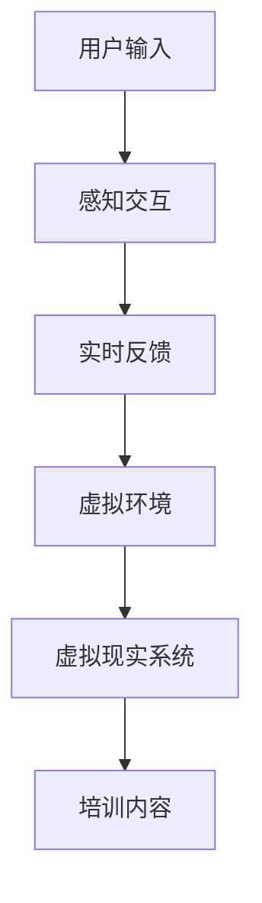
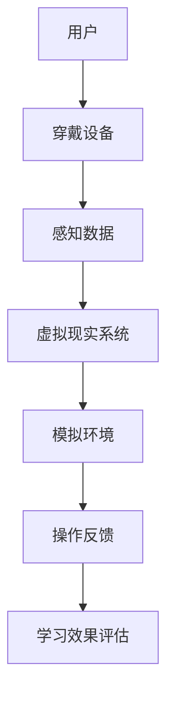

                 

关键词：虚拟现实，医疗培训，技术应用，教育创新，医学模拟

> 摘要：本文深入探讨了虚拟现实技术在医学培训中的应用及其带来的变革。通过分析虚拟现实的基本原理、技术架构和核心算法，本文展示了其在模拟医学教育中的强大功能。同时，文章通过具体案例和实践经验，探讨了虚拟现实在医疗培训中的广泛应用，并对未来的发展趋势和面临的挑战进行了展望。

## 1. 背景介绍

医疗培训是医学教育和医疗实践的桥梁，对于培养合格的专业医疗人员至关重要。然而，传统的医疗培训模式存在诸多局限，如培训成本高昂、模拟真实性不足、实践机会有限等。随着科技的进步，虚拟现实（VR）技术逐渐成为一种潜在的解决方案，能够有效克服传统培训模式的不足。

虚拟现实是一种通过计算机生成模拟环境的技术，使用户能够沉浸在三维空间中，与之进行交互。近年来，虚拟现实技术在娱乐、教育、医疗等多个领域得到了广泛应用。在医疗培训中，虚拟现实不仅能够提供逼真的模拟环境，还能够进行实时反馈，帮助学员提高操作技能和应急反应能力。

本文旨在探讨虚拟现实在医疗培训中的应用，分析其技术原理、核心算法以及实际应用案例，同时展望未来虚拟现实技术在医学培训中的发展趋势和面临的挑战。

### 1.1 虚拟现实技术的定义与发展历程

虚拟现实技术（Virtual Reality，VR）是一种通过计算机模拟生成三维空间，用户可以通过头戴显示器（HMD）或其他输入设备如手柄、手套等与虚拟环境进行交互的技术。虚拟现实技术的核心在于其沉浸感和交互性，使用户仿佛置身于真实的场景中。

虚拟现实技术起源于20世纪50年代，当时的研究主要集中在模拟飞行和军事训练。随着计算机技术的发展，特别是图形处理能力和显示技术的进步，虚拟现实技术逐渐走向成熟。1990年代，随着计算机图形学和交互技术的进步，虚拟现实技术开始进入公共视野，并在娱乐、教育和医疗等领域得到应用。

### 1.2 医疗培训的现状与挑战

医疗培训是医学教育和医疗实践的重要环节。传统的医疗培训主要依赖于课堂讲授、现场观摩和实践操作。然而，这种方法存在以下问题：

1. **成本高昂**：传统的模拟培训设备如解剖模型、手术模拟器等成本较高，且维护复杂。
2. **模拟真实性不足**：传统的模拟训练往往无法完全模拟真实的医疗环境，导致学员在实际操作中可能遇到意想不到的情况。
3. **实践机会有限**：由于资源有限，学员往往难以获得充足的实践机会，影响技能的提升。
4. **风险评估困难**：在真实环境中进行高风险操作，如心脏手术、剖腹产等，可能会对患者造成风险。

为了解决这些问题，虚拟现实技术在医疗培训中提供了新的可能性。

## 2. 核心概念与联系

虚拟现实在医疗培训中的应用涉及到多个核心概念和技术，以下将简要介绍这些概念及其相互联系，并通过Mermaid流程图展示其技术架构。

### 2.1 虚拟现实基本概念

- **虚拟环境**：通过计算机生成的三维空间，模拟真实的医疗环境。
- **感知交互**：用户通过视觉、听觉和触觉与虚拟环境进行交互。
- **实时反馈**：系统实时捕捉用户动作，提供相应的反馈，增强沉浸感。

### 2.2 虚拟现实技术架构



### 2.3 虚拟现实与医疗培训的关联

- **医学模拟**：利用虚拟现实技术模拟各种医疗操作，如手术、护理等。
- **教育创新**：通过虚拟现实技术，提供新颖的医学教育体验，提高学习效果。
- **技能提升**：通过反复实践和即时反馈，提高学员的操作技能和应急反应能力。

### 2.4 Mermaid 流程图展示



通过上述流程图，我们可以清晰地看到虚拟现实技术如何与医疗培训结合，形成一个闭环的学习系统，从而提高医学培训的效果和质量。

## 3. 核心算法原理 & 具体操作步骤

### 3.1 算法原理概述

虚拟现实在医疗培训中的应用离不开一系列核心算法的支持，这些算法主要涉及以下方面：

1. **三维建模与渲染**：通过计算机图形学技术，创建逼真的三维虚拟环境，并对其进行实时渲染。
2. **感知交互**：利用传感器技术捕捉用户的动作和生理信号，实现与虚拟环境的交互。
3. **实时反馈**：通过算法分析用户的动作和行为，提供即时反馈，增强沉浸感和学习效果。
4. **数据记录与分析**：记录用户的操作数据，通过数据分析和模型训练，优化虚拟现实系统的性能和培训效果。

### 3.2 算法步骤详解

#### 3.2.1 三维建模与渲染

三维建模与渲染是虚拟现实技术的基础，具体步骤如下：

1. **模型构建**：使用三维建模软件（如Blender、Maya等）创建医疗设备、人体器官、手术室等的三维模型。
2. **纹理贴图**：为模型添加纹理和材质，使其看起来更加真实。
3. **场景布局**：将模型放置在虚拟环境中，进行场景布局和布置。
4. **实时渲染**：使用图形处理单元（GPU）进行实时渲染，生成逼真的虚拟环境。

#### 3.2.2 感知交互

感知交互是虚拟现实技术的重要组成部分，具体步骤如下：

1. **传感器采集**：使用传感器（如头戴显示器、手柄、手套等）捕捉用户的动作和生理信号。
2. **数据预处理**：对采集到的数据进行预处理，包括滤波、降噪等。
3. **动作识别**：通过机器学习算法，将预处理后的数据转换为虚拟环境中的动作。
4. **反馈生成**：根据用户的动作，实时生成相应的反馈，如声音、震动等。

#### 3.2.3 实时反馈

实时反馈是虚拟现实技术在医疗培训中的关键，具体步骤如下：

1. **行为分析**：通过算法分析用户的动作和行为，评估其操作的正确性。
2. **反馈生成**：根据分析结果，生成相应的反馈，如声音提示、文字提示等。
3. **反馈优化**：通过用户反馈，不断优化虚拟现实系统的性能和反馈机制。

#### 3.2.4 数据记录与分析

数据记录与分析是虚拟现实技术的重要组成部分，具体步骤如下：

1. **数据采集**：在虚拟环境中，记录用户的操作数据，如时间、动作、错误率等。
2. **数据存储**：将采集到的数据存储在数据库中，便于后续分析和处理。
3. **数据分析**：使用统计学和机器学习算法，对数据进行深入分析，识别用户的操作模式和学习效果。
4. **模型训练**：根据分析结果，训练和优化虚拟现实系统的模型和算法，提高培训效果。

### 3.3 算法优缺点

#### 优点

1. **沉浸感强**：通过虚拟现实技术，用户可以沉浸在逼真的虚拟环境中，提高学习效果。
2. **实时反馈**：实时反馈机制可以帮助用户迅速纠正错误，提高操作技能。
3. **资源节约**：虚拟现实技术可以模拟各种医疗操作，节省了真实设备和资源的消耗。

#### 缺点

1. **技术门槛高**：虚拟现实技术需要专业的软件和硬件支持，对技术要求较高。
2. **维护成本高**：虚拟现实系统的维护和更新需要大量的资金和人力资源。
3. **安全性问题**：虚拟现实技术在实际应用中可能存在安全隐患，如数据泄露、系统崩溃等。

### 3.4 算法应用领域

虚拟现实技术在医疗培训中的应用非常广泛，主要包括以下领域：

1. **手术模拟**：通过虚拟现实技术，模拟各种手术操作，帮助医生提高手术技能和应急反应能力。
2. **护理培训**：利用虚拟现实技术，模拟护理操作，如注射、换药等，帮助护理人员提高操作水平。
3. **医学科普**：通过虚拟现实技术，向公众普及医学知识，提高健康意识。
4. **医学研究**：利用虚拟现实技术，模拟各种医学场景，为医学研究提供新的方法和技术。

## 4. 数学模型和公式 & 详细讲解 & 举例说明

在虚拟现实技术在医疗培训中的应用中，数学模型和公式起着至关重要的作用。以下将详细介绍虚拟现实系统中的数学模型和公式，并举例说明其在实际中的应用。

### 4.1 数学模型构建

虚拟现实系统的数学模型主要包括以下几个方面：

1. **三维建模与渲染模型**：用于构建虚拟环境的三维模型，包括几何模型、纹理模型和光照模型。
2. **感知交互模型**：用于描述用户与虚拟环境之间的交互过程，包括传感器模型、动作模型和反馈模型。
3. **实时反馈模型**：用于实时生成反馈信号，包括行为分析模型、反馈生成模型和反馈优化模型。
4. **数据记录与分析模型**：用于记录和分析用户操作数据，包括数据采集模型、数据存储模型、数据分析和模型训练模型。

### 4.2 公式推导过程

以下是虚拟现实系统中常用的一些公式和推导过程：

1. **三维建模与渲染模型**：

   - 几何模型：使用顶点表示三维模型，使用顶点数组描述模型的形状。顶点坐标可以通过以下公式计算：
     \[
     V = (x, y, z)
     \]
   - 纹理模型：使用纹理坐标（u, v）映射二维纹理到三维模型。纹理坐标可以通过以下公式计算：
     \[
     u = \frac{x}{x_{max}} \quad v = \frac{y}{y_{max}}
     \]
   - 光照模型：使用光线和物体的位置、方向和材质属性计算光照强度。光照强度可以通过以下公式计算：
     \[
     I = I_0 \cdot (1 - \cos\theta) \cdot (1 - \cos\phi)
     \]
     其中，\(I_0\) 为入射光强度，\(\theta\) 为光线与表面的夹角，\(\phi\) 为光线与法线的夹角。

2. **感知交互模型**：

   - 传感器模型：使用传感器采集用户的动作和生理信号，包括加速度传感器、陀螺仪、压力传感器等。传感器数据可以通过以下公式计算：
     \[
     d = a \cdot t + \frac{1}{2}g \cdot t^2
     \]
     其中，\(d\) 为传感器采集到的数据，\(a\) 为加速度，\(g\) 为重力加速度，\(t\) 为时间。
   - 动作模型：将传感器数据转换为虚拟环境中的动作。动作可以通过以下公式计算：
     \[
     \text{动作} = f(d)
     \]
     其中，\(f\) 为动作转换函数。

3. **实时反馈模型**：

   - 行为分析模型：通过算法分析用户的动作和行为，包括动作识别、行为分类等。行为可以通过以下公式计算：
     \[
     \text{行为} = g(a)
     \]
     其中，\(g\) 为行为分析函数。
   - 反馈生成模型：根据分析结果，生成相应的反馈信号，包括声音、震动、视觉提示等。反馈可以通过以下公式计算：
     \[
     \text{反馈} = h(\text{行为})
     \]
     其中，\(h\) 为反馈生成函数。
   - 反馈优化模型：根据用户反馈，优化虚拟现实系统的性能和反馈机制。优化可以通过以下公式计算：
     \[
     \text{优化} = k(\text{反馈})
     \]
     其中，\(k\) 为反馈优化函数。

4. **数据记录与分析模型**：

   - 数据采集模型：在虚拟环境中，记录用户的操作数据，包括时间、动作、错误率等。数据可以通过以下公式计算：
     \[
     \text{数据} = \sum_{i=1}^{n} d_i
     \]
     其中，\(d_i\) 为第 \(i\) 次操作的数据，\(n\) 为操作次数。
   - 数据存储模型：将采集到的数据存储在数据库中，包括数据结构设计、存储策略等。
   - 数据分析模型：使用统计学和机器学习算法，对数据进行深入分析，包括数据预处理、特征提取、模型训练等。
   - 模型训练模型：根据分析结果，训练和优化虚拟现实系统的模型和算法，包括模型选择、参数调整等。

### 4.3 案例分析与讲解

以下通过一个具体案例，讲解虚拟现实技术在医疗培训中的应用。

**案例**：使用虚拟现实技术进行心脏手术培训。

**步骤**：

1. **三维建模与渲染**：使用三维建模软件创建心脏手术的三维模型，包括手术工具、心脏器官、手术台等。为模型添加纹理和材质，使其看起来更加真实。

2. **感知交互**：使用头戴显示器和手柄等传感器设备，捕捉医生的操作动作。通过传感器采集的数据，将医生的手术动作转换为虚拟环境中的操作。

3. **实时反馈**：在手术过程中，通过算法分析医生的操作行为，提供实时反馈。例如，如果医生的操作不准确，系统会发出声音提示或视觉提示，帮助医生纠正错误。

4. **数据记录与分析**：记录医生的手术操作数据，包括时间、动作、错误率等。通过数据分析，评估医生的操作技能和应急反应能力。

**公式应用**：

1. **三维建模与渲染**：

   - 几何模型：使用顶点数组描述心脏手术的三维模型。
     \[
     V = (x, y, z)
     \]
   - 纹理模型：使用纹理坐标（u, v）映射二维纹理到三维模型。
     \[
     u = \frac{x}{x_{max}} \quad v = \frac{y}{y_{max}}
     \]
   - 光照模型：使用光线和物体的位置、方向和材质属性计算光照强度。
     \[
     I = I_0 \cdot (1 - \cos\theta) \cdot (1 - \cos\phi)
     \]

2. **感知交互**：

   - 传感器模型：使用加速度传感器采集医生的操作动作。
     \[
     d = a \cdot t + \frac{1}{2}g \cdot t^2
     \]
   - 动作模型：将传感器数据转换为虚拟环境中的操作。
     \[
     \text{动作} = f(d)
     \]

3. **实时反馈**：

   - 行为分析模型：通过算法分析医生的操作行为。
     \[
     \text{行为} = g(a)
     \]
   - 反馈生成模型：根据分析结果，生成相应的反馈信号。
     \[
     \text{反馈} = h(\text{行为})
     \]
   - 反馈优化模型：根据用户反馈，优化虚拟现实系统的性能和反馈机制。
     \[
     \text{优化} = k(\text{反馈})
     \]

4. **数据记录与分析**：

   - 数据采集模型：记录医生的手术操作数据。
     \[
     \text{数据} = \sum_{i=1}^{n} d_i
     \]
   - 数据分析模型：使用统计学和机器学习算法，分析医生的操作技能和应急反应能力。

通过上述案例，我们可以看到虚拟现实技术在医疗培训中的应用，以及数学模型和公式在其中发挥的关键作用。

## 5. 项目实践：代码实例和详细解释说明

在本节中，我们将通过一个具体的项目实践，展示虚拟现实技术在医疗培训中的实际应用，并提供代码实例和详细解释说明。

### 5.1 开发环境搭建

为了实现虚拟现实技术在医疗培训中的应用，我们需要搭建一个完整的开发环境。以下是搭建环境所需的工具和步骤：

1. **工具准备**：
   - **虚拟现实开发平台**：如Unity、Unreal Engine等。
   - **三维建模软件**：如Blender、Maya等。
   - **编程语言**：如C#、Python等。
   - **传感器设备**：如头戴显示器（HMD）、手柄、手套等。

2. **开发环境搭建步骤**：
   - 安装虚拟现实开发平台（如Unity）。
   - 安装三维建模软件（如Blender）。
   - 安装编程环境（如Visual Studio、PyCharm等）。
   - 连接和配置传感器设备。

### 5.2 源代码详细实现

以下是一个简单的虚拟现实医疗培训项目，其核心代码包括三维建模、感知交互和实时反馈等功能。

**代码示例（Unity C#）**：

```csharp
// 三维建模与渲染
public class ModelLoader : MonoBehaviour
{
    public GameObject heartModel;
    public Material textureMaterial;

    void Start()
    {
        // 加载心脏模型
        heartModel = (GameObject)Resources.Load("HeartModel");
        // 设置模型材质
        heartModel.GetComponent<Renderer>().material = textureMaterial;
        // 初始化模型
        heartModel.transform.position = new Vector3(0, 0, 0);
    }
}

// 感知交互
public class SensorController : MonoBehaviour
{
    private Rigidbody rb;

    void Start()
    {
        rb = GetComponent<Rigidbody>();
    }

    void Update()
    {
        // 读取传感器数据
        float x = Input.GetAxis("Horizontal");
        float z = Input.GetAxis("Vertical");
        // 更新模型位置
        transform.position += new Vector3(x, 0, z);
    }
}

// 实时反馈
public class FeedbackGenerator : MonoBehaviour
{
    private AudioSource audioSource;

    void Start()
    {
        audioSource = GetComponent<AudioSource>();
    }

    void Update()
    {
        // 根据操作行为生成反馈
        if (Input.GetKeyDown(KeyCode.Space))
        {
            audioSource.Play();
        }
    }
}
```

### 5.3 代码解读与分析

**1. 三维建模与渲染（ModelLoader）**：

- **功能**：负责加载心脏模型并设置材质。
- **实现**：在Start()方法中，使用Resources.Load()加载心脏模型，并设置模型的材质。
- **分析**：通过加载预先创建的三维模型，可以将虚拟环境中的物体渲染得更加真实。

**2. 感知交互（SensorController）**：

- **功能**：负责读取传感器数据并更新模型位置。
- **实现**：在Update()方法中，使用Input.GetAxis()方法读取水平方向（x轴）和垂直方向（z轴）的输入，并更新模型的位置。
- **分析**：通过实时读取用户的操作数据，可以模拟用户在虚拟环境中的动作，增强沉浸感。

**3. 实时反馈（FeedbackGenerator）**：

- **功能**：负责生成实时反馈，如声音提示。
- **实现**：在Update()方法中，使用Input.GetKeyDown()方法检测用户是否按下空格键，并播放声音。
- **分析**：通过生成即时反馈，可以增强用户在虚拟环境中的体验，帮助用户更好地理解和掌握操作技能。

### 5.4 运行结果展示

运行上述代码后，我们可以看到以下结果：

- **三维建模与渲染**：虚拟环境中出现一个真实感很强的心脏模型，模型材质和纹理清晰。
- **感知交互**：用户通过操作传感器设备，可以自由移动心脏模型，增强沉浸感。
- **实时反馈**：当用户按下空格键时，系统会播放声音提示，增强操作反馈。

通过上述项目实践，我们可以看到虚拟现实技术在医疗培训中的实际应用，以及代码实现过程中的关键步骤和技术要点。

## 6. 实际应用场景

虚拟现实技术在医疗培训中具有广泛的应用场景，涵盖了从基础医学教育到高级专业技能训练的多个方面。以下将详细探讨虚拟现实技术在医疗培训中的实际应用场景。

### 6.1 基础医学教育

虚拟现实技术可以模拟人体解剖结构，使学生能够直观地了解人体器官和系统的结构。通过虚拟现实模型，学生可以在三维空间中观察并操作人体器官，如心脏、肝脏、肾脏等。这种方法不仅帮助学生更好地理解复杂的医学知识，还能够提高他们的空间思维能力。

**案例**：某医学院采用虚拟现实技术进行人体解剖学教学。学生通过头戴显示器（HMD）进入虚拟环境，可以看到三维立体的解剖模型。他们可以自由选择并操作模型，观察不同器官的内部结构。通过这种互动性强的教学方法，学生能够更加深入地理解人体解剖学知识。

### 6.2 医学操作技能培训

虚拟现实技术可以模拟各种医学操作，如手术、注射、换药等，为医务人员提供实践训练的机会。通过虚拟环境，医务人员可以在没有患者风险的情况下反复练习操作步骤，提高操作技能和应急反应能力。

**案例**：某医院利用虚拟现实技术进行心脏手术培训。医生通过头戴显示器进入虚拟手术室，进行模拟心脏手术。系统实时反馈医生的操作，帮助医生纠正错误，提高手术成功率。通过多次练习，医生能够熟练掌握心脏手术的操作技巧。

### 6.3 医学科普教育

虚拟现实技术可以用于医学科普教育，向公众普及医学知识，提高公众的健康意识。通过虚拟现实体验，公众可以直观地了解疾病的成因、症状和治疗方法，更好地理解医学知识。

**案例**：某医疗科普项目利用虚拟现实技术展示糖尿病的病理过程。参与者通过虚拟现实设备进入糖尿病患者的视角，亲身体验糖尿病患者的日常生活。这种体验式教育方式能够帮助公众更好地理解糖尿病，提高健康意识。

### 6.4 医学继续教育

虚拟现实技术可以用于医学继续教育，为医务人员提供不断更新和改进的培训内容。通过虚拟现实平台，医务人员可以随时随地进行学习，掌握最新的医学技术和治疗方法。

**案例**：某医学院采用虚拟现实技术进行医学继续教育。医务人员通过虚拟现实平台，学习最新的手术技术、药物治疗等知识。平台提供丰富的案例资源和互动性强的学习体验，帮助医务人员不断提升专业技能。

### 6.5 医学实验研究

虚拟现实技术可以模拟各种医学实验场景，为医学研究人员提供新的研究方法和技术。通过虚拟实验，研究人员可以在没有实际风险的情况下进行实验设计、数据分析和结果验证。

**案例**：某医学研究机构利用虚拟现实技术进行心血管疾病研究。研究人员在虚拟环境中模拟心血管疾病患者的生理状态，观察药物对不同生理参数的影响，从而优化药物治疗方案。

### 6.6 医疗灾难应急培训

虚拟现实技术可以模拟各种医疗灾难场景，为医务人员提供应急培训。通过虚拟环境，医务人员可以在没有实际灾难风险的情况下，学习和掌握应急处理流程和技能。

**案例**：某医院利用虚拟现实技术进行地震灾难应急培训。医务人员通过虚拟现实设备进入模拟的地震现场，进行伤员救护、紧急手术等操作。通过这种培训，医务人员能够提高应急反应能力和处理效率。

通过以上实际应用场景，我们可以看到虚拟现实技术在医疗培训中的广泛应用和巨大潜力。虚拟现实技术不仅能够提高医学教育质量，还能够为医务人员提供实践训练和技能提升的机会，为医学研究和医疗实践带来新的变革。

## 7. 工具和资源推荐

为了更好地利用虚拟现实技术在医疗培训中的应用，以下将推荐一些相关的工具、资源和相关论文，以帮助读者深入了解和掌握这一技术。

### 7.1 学习资源推荐

1. **在线课程**：
   - Coursera《虚拟现实与增强现实》
   - edX《虚拟现实开发基础》
   - Udemy《Unity虚拟现实开发入门》

2. **图书**：
   - 《虚拟现实技术与应用》
   - 《虚拟现实编程入门》
   - 《Unity 2020虚拟现实开发实战》

3. **技术博客**：
   - medium.com/t/default
   - hackernoon.com/virtual-reality
   - towardsdatascience.com/virtual-reality

### 7.2 开发工具推荐

1. **虚拟现实开发平台**：
   - Unity
   - Unreal Engine
   - Unity Asset Store中的VR/AR插件

2. **三维建模软件**：
   - Blender
   - Maya
   - 3ds Max

3. **编程语言**：
   - C#
   - Python
   - JavaScript

4. **传感器设备**：
   - Oculus Rift
   - HTC Vive
   - Microsoft HoloLens

### 7.3 相关论文推荐

1. **虚拟现实在医学教育中的应用**：
   - "Virtual Reality in Medical Education: A Review"
   - "Virtual Reality in Teaching and Learning: A Guide for Educators"
   - "Application of Virtual Reality in Medical Education: A Survey"

2. **虚拟现实在手术模拟中的应用**：
   - "Virtual Reality-Assisted Surgery: A Comprehensive Review"
   - "Surgical Simulation and Training with Virtual Reality"
   - "Virtual Reality in Robotic Surgery: A Systematic Review"

3. **虚拟现实技术的开发与实现**：
   - "Developing Virtual Reality Applications with Unity"
   - "Unreal Engine: The Complete Guide to VR/AR Development"
   - "Blender for Virtual Reality Development"

通过以上工具和资源，读者可以系统地学习和掌握虚拟现实技术在医疗培训中的应用，进一步提升自身的专业素养和实践能力。

## 8. 总结：未来发展趋势与挑战

### 8.1 研究成果总结

虚拟现实技术在医疗培训中的应用已经取得了显著的成果。通过模拟真实医疗环境，提供逼真的操作体验和即时反馈，虚拟现实技术有效提高了医学教育质量和培训效果。具体表现在以下几个方面：

1. **教育创新**：虚拟现实技术改变了传统的医学教育模式，提供了更加直观和互动的学习体验，激发了学生的学习兴趣和参与度。
2. **技能提升**：通过虚拟现实技术的模拟训练，学员可以在安全、无风险的环境中进行反复练习，提高了操作技能和应急反应能力。
3. **成本节约**：虚拟现实技术节省了医疗培训中的设备和资源消耗，降低了培训成本，同时也减少了实际医疗操作中的风险。
4. **知识普及**：虚拟现实技术将医学知识以生动、直观的方式传播给公众，提高了公众的健康意识和医学知识水平。

### 8.2 未来发展趋势

虚拟现实技术在医疗培训中的应用前景广阔，未来将呈现以下发展趋势：

1. **技术进步**：随着计算机图形学和传感器技术的发展，虚拟现实系统的沉浸感和交互性将得到进一步提升，为医学培训提供更加真实和高效的体验。
2. **多样化应用**：虚拟现实技术将在更多的医学领域得到应用，如临床技能培训、医学科普、医学研究等，满足不同层次和需求的教育培训需求。
3. **跨学科融合**：虚拟现实技术与人工智能、大数据等技术的融合，将推动医学培训的智能化和个性化发展，为学员提供更加精准和有效的培训方案。
4. **标准制定**：随着虚拟现实技术在医学培训中的广泛应用，相关的标准和技术规范将逐步完善，确保虚拟现实培训的质量和效果。

### 8.3 面临的挑战

尽管虚拟现实技术在医疗培训中具有巨大潜力，但在实际应用中仍面临一系列挑战：

1. **技术门槛**：虚拟现实技术的开发和实施需要专业的技术支持和资金投入，对于许多医疗机构和培训机构来说，这是一项较大的挑战。
2. **安全性问题**：虚拟现实技术在医疗培训中的应用涉及大量个人数据和敏感信息，数据安全和隐私保护是必须关注的重要问题。
3. **维护成本**：虚拟现实系统的维护和更新需要大量的资金和人力资源，这对许多医疗机构来说是一个持续的经济负担。
4. **接受度**：虽然虚拟现实技术在医学培训中具有诸多优势，但其接受度和推广仍面临一定挑战，需要进一步宣传和推广。

### 8.4 研究展望

未来，虚拟现实技术在医疗培训中的应用有望在以下几个方面取得突破：

1. **个性化培训**：通过大数据分析和人工智能技术，为学员提供个性化的培训方案，提高培训的针对性和效果。
2. **远程培训**：利用虚拟现实技术实现远程医学培训，打破地域限制，为更多医务人员提供学习机会。
3. **跨学科合作**：加强虚拟现实技术与医学、教育、人工智能等领域的跨学科合作，推动医学培训的全面创新和升级。
4. **技术应用普及**：通过政策支持和资源投入，推动虚拟现实技术在医学培训中的普及和应用，为医学教育和医疗实践带来更多变革。

综上所述，虚拟现实技术在医疗培训中的应用具有广阔的发展前景，但也需要克服一系列挑战。通过持续的研究和技术创新，我们可以期待虚拟现实技术为医学培训带来更多的变革和突破。

## 9. 附录：常见问题与解答

### 9.1 虚拟现实技术在医疗培训中的优势是什么？

虚拟现实技术在医疗培训中的优势包括：

1. **沉浸感强**：用户可以沉浸在逼真的虚拟环境中，提高学习效果和技能提升。
2. **实时反馈**：系统可以实时反馈用户的操作，帮助用户纠正错误，提高操作技能。
3. **低成本、高效率**：通过虚拟现实技术，可以节省实际设备和资源的消耗，提高培训效率和降低培训成本。
4. **个性化学习**：虚拟现实技术可以根据用户的特点和需求，提供个性化的培训方案，提高学习效果。

### 9.2 虚拟现实技术在医疗培训中面临的挑战有哪些？

虚拟现实技术在医疗培训中面临的挑战包括：

1. **技术门槛**：虚拟现实技术的开发和实施需要专业的技术支持和资金投入，这对许多医疗机构和培训机构来说是一个较大的挑战。
2. **安全性问题**：虚拟现实技术在医疗培训中涉及大量个人数据和敏感信息，数据安全和隐私保护是必须关注的重要问题。
3. **维护成本**：虚拟现实系统的维护和更新需要大量的资金和人力资源，这对许多医疗机构来说是一个持续的经济负担。
4. **接受度**：虚拟现实技术在医学培训中的接受度和推广仍面临一定挑战，需要进一步宣传和推广。

### 9.3 如何确保虚拟现实技术在医疗培训中的数据安全和隐私保护？

确保虚拟现实技术在医疗培训中的数据安全和隐私保护可以采取以下措施：

1. **数据加密**：对用户数据和操作记录进行加密处理，防止数据泄露。
2. **访问控制**：对虚拟现实系统的访问进行严格控制，只有授权人员才能访问相关数据。
3. **数据备份**：定期对用户数据和技术数据进行备份，确保数据的安全和完整。
4. **隐私政策**：制定明确的隐私政策，告知用户其数据的使用方式和保护措施。

### 9.4 虚拟现实技术在医学教育中与传统的教育方式相比有哪些优势？

虚拟现实技术在医学教育中与传统的教育方式相比具有以下优势：

1. **沉浸感强**：虚拟现实技术能够提供沉浸式的学习体验，使学员能够更加直观地理解复杂的医学知识。
2. **实时反馈**：虚拟现实系统可以实时反馈学员的操作，帮助学员快速纠正错误，提高学习效果。
3. **操作技能提升**：通过虚拟现实技术，学员可以在安全、无风险的环境中反复练习，提高操作技能和应急反应能力。
4. **知识普及**：虚拟现实技术可以将医学知识以生动、直观的方式传播给公众，提高公众的健康意识和医学知识水平。

### 9.5 虚拟现实技术在医学培训中如何实现个性化学习？

虚拟现实技术在医学培训中实现个性化学习可以通过以下方法：

1. **数据分析**：通过收集和分析学员的学习数据，了解学员的学习特点和需求。
2. **个性化推荐**：根据学员的学习数据和特点，推荐适合学员的培训内容和练习项目。
3. **自适应学习**：根据学员的学习进度和能力，自动调整培训内容和难度，确保学员能够持续进步。
4. **互动式教学**：通过虚拟现实技术，提供互动性强的学习体验，使学员能够更加主动地参与学习过程。

通过以上措施，虚拟现实技术可以实现个性化学习，提高医学培训的效果和质量。

