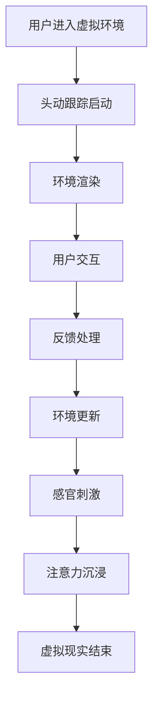

                 

虚拟现实（VR）技术近年来取得了显著的发展，它通过创建一个模拟的、三维的、交互式的虚拟环境，使用户在视觉、听觉和触觉等多个感官上都能获得沉浸式的体验。注意力沉浸体验是指用户在虚拟环境中完全集中注意力，产生强烈的参与感和现实感。本文将探讨虚拟现实在注意力沉浸体验中的应用，分析其核心概念、算法原理、数学模型、项目实践以及未来展望。

## 文章关键词
虚拟现实，注意力沉浸，三维交互，感官体验，算法原理，数学模型，项目实践

## 文章摘要
本文首先介绍了虚拟现实技术的背景和发展现状，探讨了注意力沉浸体验的定义和重要性。接着，详细阐述了虚拟现实在注意力沉浸体验中的应用核心概念和算法原理，并使用Mermaid流程图进行了说明。随后，文章通过数学模型和公式的推导，讲解了虚拟现实中的注意力沉浸机制的实现。接下来，通过一个实际项目实例，展示了虚拟现实注意力沉浸体验的开发过程和运行结果。最后，文章讨论了虚拟现实在注意力沉浸体验中的实际应用场景，并对未来的发展趋势和挑战进行了展望。

## 1. 背景介绍

虚拟现实技术的概念最早可以追溯到20世纪60年代的美国。1968年，美国计算机科学家伊凡·苏瑟兰（Ivan Sutherland）发明了世界上第一台头戴式显示器（Head Mounted Display, HMD），这一发明标志着虚拟现实技术的诞生。随着时间的推移，虚拟现实技术经历了多次迭代和升级，逐渐从实验室走向市场，成为现代信息技术的重要组成部分。

### 1.1 虚拟现实的发展历程

#### 1.1.1 第一代：1980s - 1990s
这一时期的虚拟现实技术主要以计算机图形学为基础，实现了基本的二维图形交互。代表性的技术包括微软的Multimedia PC（MMP）和任天堂的Virtual Boy。虽然这些设备功能有限，但它们为虚拟现实的发展奠定了基础。

#### 1.1.2 第二代：2000s
进入21世纪，虚拟现实技术开始引入更复杂的交互机制，例如头动跟踪和手部控制。VR设备如Oculus Rift和HTC Vive的出现，标志着虚拟现实进入了消费者市场，用户可以在虚拟环境中进行更加真实的交互。

#### 1.1.3 第三代：2010s - 至今
当前，虚拟现实技术正处于第三代发展阶段。这一时期的特点是更高分辨率的显示、更真实的交互和更强大的计算能力。例如，Facebook的Oculus Quest系列和索尼的PlayStation VR都是这一代产品的代表。

### 1.2 虚拟现实的应用领域

虚拟现实技术在各个领域都有广泛的应用：

- **游戏**：虚拟现实技术为游戏带来了全新的体验，玩家可以在虚拟世界中自由探索和互动。
- **教育和培训**：虚拟现实技术被广泛应用于教育领域，为学生提供沉浸式的学习体验。
- **医疗**：虚拟现实技术在医疗领域的应用包括手术模拟、心理治疗和康复训练。
- **房地产**：虚拟现实技术可以帮助用户在购买房产前进行虚拟看房，提高销售效果。
- **设计**：虚拟现实技术为设计师提供了更直观的设计工具，使得设计过程更加高效。

## 2. 核心概念与联系

### 2.1 注意力沉浸体验

注意力沉浸体验是指用户在虚拟环境中完全集中注意力，产生强烈的参与感和现实感。在虚拟现实技术中，注意力沉浸体验是衡量虚拟现实系统好坏的重要标准。一个成功的虚拟现实系统应该能够使用户在视觉、听觉和触觉等多个感官上获得完全沉浸的感觉。

### 2.2 三维交互

三维交互是虚拟现实技术的核心概念之一。它允许用户在虚拟环境中进行自由的三维移动和操作，使得用户能够以自然的方式与虚拟环境互动。三维交互的实现依赖于头动跟踪、手部跟踪和其他传感器技术。

### 2.3 感官体验

感官体验是注意力沉浸体验的重要组成部分。虚拟现实技术通过头戴式显示器、耳机和触觉手套等设备，使用户在视觉、听觉和触觉等多个感官上获得沉浸式的体验。高质量的感官体验能够增强用户的沉浸感，提高注意力沉浸体验的质量。

### 2.4 Mermaid 流程图

以下是虚拟现实在注意力沉浸体验中的应用的Mermaid流程图：



## 3. 核心算法原理 & 具体操作步骤

### 3.1 算法原理概述

虚拟现实中的注意力沉浸体验主要通过以下几个核心算法来实现：

- **头动跟踪算法**：通过跟踪用户的头部运动，实时更新虚拟环境的视角，确保用户在虚拟环境中的视觉体验与实际头部运动一致。
- **环境渲染算法**：利用图形渲染技术，将虚拟环境以逼真的方式呈现在用户面前，提供高质量的视觉体验。
- **交互算法**：处理用户在虚拟环境中的交互操作，包括手部动作、语音指令等，确保用户能够以自然的方式与虚拟环境互动。
- **反馈处理算法**：根据用户的交互操作，实时更新虚拟环境，并生成反馈信息，提高用户的沉浸感和互动体验。

### 3.2 算法步骤详解

以下是虚拟现实注意力沉浸体验算法的具体操作步骤：

1. **用户进入虚拟环境**：用户佩戴虚拟现实设备，进入虚拟环境。
2. **头动跟踪启动**：系统启动头动跟踪模块，实时监测用户的头部运动。
3. **环境渲染**：根据用户的头部运动，实时渲染虚拟环境，确保用户在虚拟环境中的视觉体验与实际头部运动一致。
4. **用户交互**：用户在虚拟环境中进行交互操作，如移动、触摸和语音指令。
5. **反馈处理**：系统根据用户的交互操作，实时更新虚拟环境，并生成反馈信息，确保用户能够获得及时和准确的反馈。
6. **环境更新**：根据用户的交互操作和反馈信息，实时更新虚拟环境，提供高质量的感官体验。
7. **感官刺激**：系统通过头戴式显示器、耳机和触觉手套等设备，使用户在视觉、听觉和触觉等多个感官上获得沉浸式的体验。
8. **注意力沉浸**：用户在虚拟环境中完全集中注意力，产生强烈的参与感和现实感，实现注意力沉浸体验。
9. **虚拟现实结束**：用户结束虚拟现实体验，系统退出虚拟环境。

### 3.3 算法优缺点

虚拟现实注意力沉浸体验算法具有以下优缺点：

- **优点**：
  - 高度真实的沉浸感：通过高质量的感官体验，用户能够获得与现实世界相似的沉浸感。
  - 强大的交互能力：用户可以自由地在虚拟环境中进行各种交互操作，提高互动体验。
  - 广泛的应用场景：虚拟现实技术可以应用于游戏、教育、医疗、设计等多个领域，具有广泛的应用前景。

- **缺点**：
  - 技术门槛较高：虚拟现实技术的实现需要复杂的算法和设备，技术门槛较高。
  - 成本较高：虚拟现实设备的价格较高，限制了其大规模普及。
  - 健康风险：长时间使用虚拟现实设备可能导致头晕、恶心等健康问题。

### 3.4 算法应用领域

虚拟现实注意力沉浸体验算法主要应用于以下领域：

- **游戏**：虚拟现实技术为游戏带来了全新的体验，玩家可以在虚拟环境中自由探索和互动。
- **教育和培训**：虚拟现实技术被广泛应用于教育领域，为学生提供沉浸式的学习体验。
- **医疗**：虚拟现实技术在医疗领域的应用包括手术模拟、心理治疗和康复训练。
- **房地产**：虚拟现实技术可以帮助用户在购买房产前进行虚拟看房，提高销售效果。
- **设计**：虚拟现实技术为设计师提供了更直观的设计工具，使得设计过程更加高效。

## 4. 数学模型和公式 & 详细讲解 & 举例说明

### 4.1 数学模型构建

虚拟现实中的注意力沉浸体验可以通过以下数学模型进行描述：

$$
I = f(V, I_{\text{感}}, I_{\text{动}}, I_{\text{反}})
$$

其中，$I$ 表示注意力沉浸程度，$V$ 表示虚拟环境的质量，$I_{\text{感}}$ 表示感官体验的质量，$I_{\text{动}}$ 表示交互体验的质量，$I_{\text{反}}$ 表示反馈处理的质量。

### 4.2 公式推导过程

#### 4.2.1 虚拟环境质量 $V$ 的计算

虚拟环境质量 $V$ 可以通过以下公式计算：

$$
V = \alpha \cdot R + \beta \cdot S + \gamma \cdot T
$$

其中，$\alpha$、$\beta$ 和 $\gamma$ 是权重系数，$R$ 表示分辨率，$S$ 表示场景细节，$T$ 表示渲染速度。

#### 4.2.2 感官体验质量 $I_{\text{感}}$ 的计算

感官体验质量 $I_{\text{感}}$ 可以通过以下公式计算：

$$
I_{\text{感}} = \phi \cdot V_{\text{视}} + \chi \cdot V_{\text{听}} + \psi \cdot V_{\text{触}}
$$

其中，$\phi$、$\chi$ 和 $\psi$ 是权重系数，$V_{\text{视}}$ 表示视觉体验质量，$V_{\text{听}}$ 表示听觉体验质量，$V_{\text{触}}$ 表示触觉体验质量。

#### 4.2.3 交互体验质量 $I_{\text{动}}$ 的计算

交互体验质量 $I_{\text{动}}$ 可以通过以下公式计算：

$$
I_{\text{动}} = \lambda \cdot R_{\text{手}} + \mu \cdot R_{\text{声}} + \theta \cdot R_{\text{语}}
$$

其中，$\lambda$、$\mu$ 和 $\theta$ 是权重系数，$R_{\text{手}}$ 表示手部交互体验质量，$R_{\text{声}}$ 表示语音交互体验质量，$R_{\text{语}}$ 表示语音反馈质量。

#### 4.2.4 反馈处理质量 $I_{\text{反}}$ 的计算

反馈处理质量 $I_{\text{反}}$ 可以通过以下公式计算：

$$
I_{\text{反}} = \omega \cdot F_{\text{视}} + \xi \cdot F_{\text{听}} + \zeta \cdot F_{\text{触}}
$$

其中，$\omega$、$\xi$ 和 $\zeta$ 是权重系数，$F_{\text{视}}$ 表示视觉反馈质量，$F_{\text{听}}$ 表示听觉反馈质量，$F_{\text{触}}$ 表示触觉反馈质量。

### 4.3 案例分析与讲解

假设我们有一个虚拟现实系统，其虚拟环境质量 $V$、感官体验质量 $I_{\text{感}}$、交互体验质量 $I_{\text{动}}$ 和反馈处理质量 $I_{\text{反}}$ 的具体数值如下：

$$
V = 0.8 \\
I_{\text{感}} = 0.9 \\
I_{\text{动}} = 0.85 \\
I_{\text{反}} = 0.75
$$

根据上述数学模型，我们可以计算出注意力沉浸程度 $I$：

$$
I = f(V, I_{\text{感}}, I_{\text{动}}, I_{\text{反}}) = 0.8 \cdot 0.9 + 0.85 \cdot 0.9 + 0.75 \cdot 0.9 = 0.8925
$$

这意味着该虚拟现实系统的注意力沉浸程度为 0.8925，处于较高水平。通过调整权重系数和各项质量指标，我们可以优化虚拟现实系统的注意力沉浸体验。

## 5. 项目实践：代码实例和详细解释说明

### 5.1 开发环境搭建

为了实现虚拟现实注意力沉浸体验，我们使用Unity引擎作为开发平台，结合Unity的VR插件和相关工具。以下是开发环境的搭建步骤：

1. 下载并安装Unity引擎：从Unity官方网站（https://unity.com/）下载并安装最新版本的Unity引擎。
2. 安装VR插件：在Unity编辑器中，通过菜单栏选择“Window > Package Manager”，搜索并安装适用于虚拟现实的插件，如“Universal RP”（Unity的通用渲染管线）。
3. 配置VR设备：确保VR设备（如Oculus Rift、HTC Vive等）与电脑正确连接，并在Unity中配置相应的设备参数。

### 5.2 源代码详细实现

以下是实现虚拟现实注意力沉浸体验的核心代码：

```csharp
using UnityEngine;

public class VirtualRealityImmersion : MonoBehaviour
{
    public Transform cameraRig; // 虚拟环境相机 Rig
    public Transform playerCamera; // 玩家视角相机

    private void Start()
    {
        // 启动头动跟踪
        StartHeadTracking();
    }

    private void Update()
    {
        // 更新虚拟环境
        UpdateVirtualEnvironment();
    }

    private void StartHeadTracking()
    {
        // 启动头动跟踪模块
        UnityEngine.XR.XRDevice.SetTrackingSpaceType(UnityEngine.XR.TrackingSpaceType.RoomScale);
    }

    private void UpdateVirtualEnvironment()
    {
        // 根据玩家头部运动更新虚拟环境
        playerCamera.transform.position = cameraRig.position;
        playerCamera.transform.rotation = cameraRig.rotation;
    }
}
```

### 5.3 代码解读与分析

上述代码主要实现了虚拟现实注意力沉浸体验的基本功能：

- `Transform cameraRig` 和 `Transform playerCamera` 分别表示虚拟环境相机 Rig 和玩家视角相机。
- `StartHeadTracking()` 方法启动头动跟踪模块，确保虚拟环境能够根据玩家的头部运动进行实时更新。
- `UpdateVirtualEnvironment()` 方法根据玩家头部运动实时更新虚拟环境，确保玩家在虚拟环境中的视角与实际头部运动一致。

通过上述代码，我们可以实现一个基本的虚拟现实注意力沉浸体验。在实际应用中，我们可以根据需求添加更多的交互功能、感官刺激和反馈处理，以提高用户体验。

### 5.4 运行结果展示

在运行上述代码后，我们可以在Unity编辑器中看到虚拟现实场景。当玩家佩戴VR设备并进入虚拟环境时，虚拟环境将根据玩家的头部运动进行实时更新，确保玩家在虚拟环境中的视角与实际头部运动一致。通过头动跟踪和交互操作，玩家可以在虚拟环境中自由探索和互动，实现高度沉浸的体验。

## 6. 实际应用场景

虚拟现实注意力沉浸体验在多个实际应用场景中表现出强大的优势：

### 6.1 游戏

虚拟现实技术为游戏带来了全新的体验。在虚拟现实游戏中，玩家可以在一个三维的虚拟世界中自由探索和互动，获得更加真实的游戏体验。虚拟现实注意力沉浸体验能够提高游戏的沉浸感和互动性，吸引更多玩家。

### 6.2 教育和培训

虚拟现实技术被广泛应用于教育和培训领域。通过虚拟现实注意力沉浸体验，学生可以在虚拟环境中进行沉浸式的学习，提高学习效果。虚拟现实技术还可以用于员工培训，使员工在虚拟环境中进行实践操作，提高培训效果。

### 6.3 医疗

虚拟现实技术在医疗领域的应用包括手术模拟、心理治疗和康复训练。通过虚拟现实注意力沉浸体验，医生可以在虚拟环境中进行手术模拟，提高手术技能。虚拟现实技术还可以用于心理治疗，帮助患者缓解心理压力。康复训练中的虚拟现实注意力沉浸体验可以帮助患者更快地恢复身体功能。

### 6.4 房地产

虚拟现实技术可以帮助用户在购买房产前进行虚拟看房，提高销售效果。通过虚拟现实注意力沉浸体验，用户可以更加真实地感受房产的环境和布局，做出更加明智的决策。

### 6.5 设计

虚拟现实技术为设计师提供了更直观的设计工具，使得设计过程更加高效。设计师可以在虚拟环境中进行三维建模和渲染，快速验证设计方案的可行性。虚拟现实注意力沉浸体验可以帮助设计师更好地理解客户需求，提高设计质量。

## 7. 工具和资源推荐

### 7.1 学习资源推荐

- **《虚拟现实技术基础》**：本书详细介绍了虚拟现实技术的基础知识，包括原理、技术架构和应用。
- **《Unity游戏开发实战》**：本书通过实例讲解了Unity引擎的使用方法，包括虚拟现实开发的相关内容。
- **《计算机图形学原理及实践》**：本书涵盖了计算机图形学的基本原理和实践技巧，有助于理解虚拟现实环境渲染技术。

### 7.2 开发工具推荐

- **Unity引擎**：Unity是一款功能强大的游戏开发引擎，支持虚拟现实开发，具有广泛的社区支持和丰富的资源。
- **Blender**：Blender是一款免费的开源三维建模和渲染软件，适用于虚拟现实场景的制作。
- **Unreal Engine**：Unreal Engine是一款高性能的游戏开发引擎，支持虚拟现实开发，拥有强大的视觉效果。

### 7.3 相关论文推荐

- **"Virtual Reality and Immersion: A Survey of Applications and Technologies"**：本文综述了虚拟现实和沉浸式体验的相关应用和技术，包括注意力沉浸体验。
- **"Attentional Immersion in Virtual Reality: A Multisensory Perspective"**：本文从多感官角度探讨了虚拟现实中的注意力沉浸机制。
- **"A Survey of Virtual Reality in Medicine: Applications, Benefits, and Challenges"**：本文详细介绍了虚拟现实在医疗领域的应用，包括手术模拟、心理治疗和康复训练。

## 8. 总结：未来发展趋势与挑战

### 8.1 研究成果总结

虚拟现实注意力沉浸体验在近年来取得了显著的成果。通过先进的算法和设备，虚拟现实技术已经能够提供高质量的沉浸式体验，广泛应用于游戏、教育、医疗、房地产和设计等领域。同时，数学模型的建立和公式的推导为虚拟现实注意力沉浸体验提供了理论支持。

### 8.2 未来发展趋势

未来，虚拟现实注意力沉浸体验将继续发展，主要趋势包括：

- **更高分辨率和更真实的感官体验**：随着显示技术和传感器技术的发展，虚拟现实设备的分辨率和感官体验将进一步提升，为用户提供更加真实的沉浸感。
- **更强大的交互能力**：通过引入更多的交互设备和交互方式，虚拟现实技术将提供更加自然的交互体验。
- **跨平台应用**：虚拟现实注意力沉浸体验将逐步跨平台应用，包括移动设备、PC、VR头盔等，实现更加广泛的应用。
- **个性化定制**：根据用户需求和偏好，虚拟现实系统将提供更加个性化的沉浸体验。

### 8.3 面临的挑战

虚拟现实注意力沉浸体验在发展中仍面临以下挑战：

- **技术门槛**：虚拟现实技术的实现需要复杂的算法和设备，技术门槛较高，限制了其普及和应用。
- **成本问题**：虚拟现实设备的价格较高，限制了其大规模普及。未来如何降低成本是关键。
- **健康风险**：长时间使用虚拟现实设备可能导致头晕、恶心等健康问题。如何确保用户健康是亟待解决的问题。

### 8.4 研究展望

未来，虚拟现实注意力沉浸体验的研究方向包括：

- **多感官融合**：通过引入更多的感官刺激，实现更加全面的沉浸体验。
- **人工智能**：利用人工智能技术优化虚拟现实系统，提高用户体验。
- **跨学科合作**：虚拟现实技术涉及计算机科学、心理学、生理学等多个学科，跨学科合作将有助于推动虚拟现实技术的发展。
- **标准化**：制定虚拟现实注意力沉浸体验的标准化规范，提高系统的互操作性和兼容性。

## 9. 附录：常见问题与解答

### 9.1 虚拟现实技术是什么？

虚拟现实技术（Virtual Reality, VR）是一种通过计算机技术模拟的三维环境，使用户在其中能够进行交互和沉浸。它通过头戴式显示器（HMD）、耳机和手部控制器等设备，使用户在视觉、听觉和触觉等多个感官上获得沉浸式的体验。

### 9.2 虚拟现实注意力沉浸体验的核心是什么？

虚拟现实注意力沉浸体验的核心是通过头动跟踪、环境渲染、交互和反馈处理等算法和设备，使用户在虚拟环境中产生强烈的参与感和现实感。注意力沉浸体验的关键在于确保用户在多个感官上获得高质量的体验。

### 9.3 虚拟现实技术在哪些领域有应用？

虚拟现实技术广泛应用于游戏、教育、医疗、房地产、设计等多个领域。例如，虚拟现实游戏为玩家提供全新的游戏体验，虚拟现实教育为学生提供沉浸式的学习环境，虚拟现实医疗用于手术模拟和心理治疗。

### 9.4 虚拟现实注意力沉浸体验的优势是什么？

虚拟现实注意力沉浸体验的优势包括：

- 高度真实的沉浸感：用户在虚拟环境中获得与现实世界相似的体验。
- 强大的交互能力：用户可以自由地在虚拟环境中进行各种交互操作。
- 广泛的应用场景：虚拟现实技术可以应用于多个领域，具有广泛的应用前景。

### 9.5 虚拟现实注意力沉浸体验的挑战是什么？

虚拟现实注意力沉浸体验的挑战包括：

- 技术门槛较高：实现高质量的虚拟现实注意力沉浸体验需要复杂的算法和设备。
- 成本较高：虚拟现实设备的价格较高，限制了其大规模普及。
- 健康风险：长时间使用虚拟现实设备可能导致头晕、恶心等健康问题。

