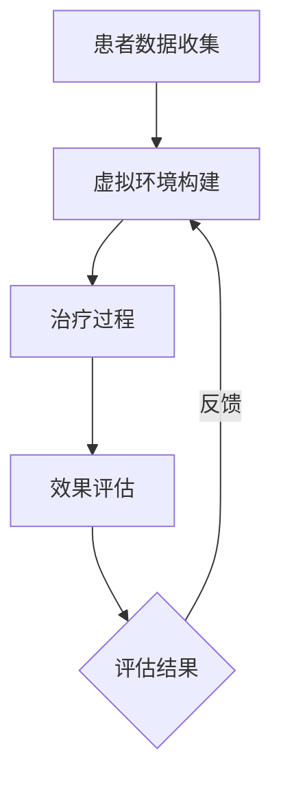

                 

关键词：虚拟现实，心理治疗，脑辅助，疗法，人工智能

摘要：本文深入探讨了虚拟现实心理治疗作为一种新兴的脑辅助疗法，其在全球范围内的应用与发展。通过分析虚拟现实技术的核心概念与联系，以及相关算法原理、数学模型、项目实践和未来应用展望，本文旨在为读者提供关于虚拟现实心理治疗全面而深入的了解。

## 1. 背景介绍

### 虚拟现实心理治疗的兴起

随着科技的发展，虚拟现实（VR）技术逐渐渗透到各个领域，尤其在医疗健康领域，虚拟现实心理治疗（VRPT）成为了一项备受关注的创新疗法。VRPT利用虚拟现实技术创造一个模拟的环境，让患者在虚拟世界中体验各种情境，以达到心理治疗的目的。这种方法不仅能够模拟现实生活中的各种场景，还能够通过控制环境变量来优化治疗效果。

### 全球脑辅助疗法的发展

脑辅助疗法是一种利用外部设备或技术来增强或替代大脑功能的治疗方法。在全球范围内，脑辅助疗法的发展呈现出蓬勃的态势。随着人工智能、脑机接口（BCI）技术的进步，脑辅助疗法在治疗神经系统疾病、心理障碍等方面展现出了巨大的潜力。

### 虚拟现实心理治疗的重要性

虚拟现实心理治疗在以下几个方面具有重要意义：

1. **提高治疗效果**：虚拟现实环境能够为患者提供更加真实、可控的治疗场景，有助于提高治疗效果。
2. **降低治疗成本**：虚拟现实技术使得治疗不再依赖于传统的物理设施，从而降低了治疗成本。
3. **增强患者的参与感**：虚拟现实技术能够让患者在轻松、愉悦的氛围中接受治疗，提高患者的治疗依从性。

## 2. 核心概念与联系

为了更好地理解虚拟现实心理治疗的原理和架构，我们需要首先介绍其中的核心概念与联系。

### 虚拟现实技术

虚拟现实技术是一种通过计算机生成模拟环境，使用户能够沉浸其中的技术。其主要组成部分包括：

1. **虚拟场景生成**：通过计算机图形学技术生成逼真的三维场景。
2. **交互设备**：如头戴式显示器（HMD）、数据手套、体感控制器等，用于实现用户与虚拟环境的交互。
3. **实时渲染**：通过实时渲染技术，将生成的虚拟场景实时显示给用户。

### 脑辅助技术

脑辅助技术是指利用外部设备或技术来增强或替代大脑功能的方法。其主要组成部分包括：

1. **脑机接口（BCI）**：通过直接读取大脑信号，实现人脑与计算机的交互。
2. **神经反馈**：通过监测大脑活动，对患者的生理和心理状态进行实时调控。
3. **智能算法**：用于分析大脑信号，优化治疗策略。

### 虚拟现实心理治疗的架构

虚拟现实心理治疗的架构可以概括为以下几个部分：

1. **患者数据收集**：通过传感器、脑机接口等技术，收集患者的生理、心理和行为数据。
2. **虚拟环境构建**：根据患者的数据，构建一个个性化的虚拟治疗环境。
3. **治疗过程**：患者通过与虚拟环境的交互，逐步实现心理治疗目标。
4. **效果评估**：通过对比治疗前后的数据，评估治疗效果。

### Mermaid 流程图

以下是一个简化的虚拟现实心理治疗架构的 Mermaid 流程图：



## 3. 核心算法原理 & 具体操作步骤

### 3.1 算法原理概述

虚拟现实心理治疗的核心算法主要包括以下三个方面：

1. **虚拟场景生成算法**：通过计算机图形学技术，生成逼真的三维场景。
2. **交互算法**：实现用户与虚拟环境的交互。
3. **治疗效果评估算法**：通过分析患者的行为、生理和心理数据，评估治疗效果。

### 3.2 算法步骤详解

1. **虚拟场景生成**：

   - **场景建模**：根据患者的数据，构建一个三维模型。
   - **纹理映射**：为模型添加纹理，使其更加逼真。
   - **光照模拟**：模拟环境中的光照，增强场景的真实感。
   - **实时渲染**：将生成的场景实时显示给用户。

2. **交互算法**：

   - **输入处理**：接收用户的输入信号，如头戴式显示器的姿态数据、体感控制器信号等。
   - **动作预测**：根据输入信号，预测用户在虚拟环境中的动作。
   - **动作执行**：将预测的动作反馈给用户，实现交互。

3. **治疗效果评估**：

   - **数据收集**：通过传感器、脑机接口等技术，收集患者的生理、心理和行为数据。
   - **数据预处理**：对收集到的数据进行清洗、归一化等处理。
   - **特征提取**：从预处理后的数据中提取出反映治疗效果的关键特征。
   - **效果评估**：使用机器学习算法，对提取的特征进行建模，评估治疗效果。

### 3.3 算法优缺点

1. **优点**：

   - **逼真的场景**：通过虚拟现实技术，为患者提供一个高度逼真的治疗场景，有助于提高治疗效果。
   - **个性化的治疗**：根据患者的数据，构建个性化的虚拟治疗环境，使治疗更加精准。
   - **实时交互**：患者能够实时地与虚拟环境进行交互，提高治疗的参与感和趣味性。

2. **缺点**：

   - **技术要求高**：虚拟现实心理治疗需要涉及多个技术领域，如计算机图形学、脑机接口等，技术门槛较高。
   - **设备成本**：虚拟现实设备和相关技术设备的成本较高，可能限制了其普及应用。
   - **适应性问题**：部分患者可能对虚拟现实技术产生不适，影响治疗效果。

### 3.4 算法应用领域

虚拟现实心理治疗在以下领域具有广泛的应用前景：

1. **心理障碍治疗**：如焦虑症、抑郁症、恐惧症等。
2. **康复训练**：如中风患者的康复训练、肌肉萎缩患者的运动训练等。
3. **认知障碍治疗**：如阿尔茨海默病、脑卒中后遗症等。
4. **临床辅助**：如手术模拟、医学教育等。

## 4. 数学模型和公式 & 详细讲解 & 举例说明

### 4.1 数学模型构建

虚拟现实心理治疗的数学模型主要包括以下三个方面：

1. **虚拟场景生成模型**：基于计算机图形学技术，构建三维场景的数学模型。
2. **交互模型**：描述用户与虚拟环境之间的交互过程。
3. **治疗效果评估模型**：通过分析患者的行为、生理和心理数据，构建治疗效果的数学模型。

### 4.2 公式推导过程

1. **虚拟场景生成模型**：

   - **场景建模**：假设场景中的物体为点、线、面等基本元素，定义其几何参数和物理属性。

   $$ P = \{ P_1, P_2, ..., P_n \} $$
   
   其中，$P$ 表示场景中的点集，$P_i$ 表示第 $i$ 个点的坐标。

   - **纹理映射**：将二维纹理映射到三维场景中的物体表面。

   $$ T(P) = \{ T_1, T_2, ..., T_n \} $$
   
   其中，$T$ 表示场景中的纹理集，$T_i$ 表示第 $i$ 个物体的纹理坐标。

2. **交互模型**：

   - **输入处理**：定义输入信号的数学模型。

   $$ I = \{ I_1, I_2, ..., I_m \} $$
   
   其中，$I$ 表示输入信号集，$I_i$ 表示第 $i$ 个输入信号。

   - **动作预测**：定义动作预测的数学模型。

   $$ P(A|I) = P(A|I_1, I_2, ..., I_m) $$
   
   其中，$P(A|I)$ 表示在输入信号 $I$ 的条件下，预测动作 $A$ 的概率。

3. **治疗效果评估模型**：

   - **数据收集**：定义数据收集的数学模型。

   $$ D = \{ D_1, D_2, ..., D_k \} $$
   
   其中，$D$ 表示数据集，$D_i$ 表示第 $i$ 个数据样本。

   - **特征提取**：定义特征提取的数学模型。

   $$ F(D) = \{ F_1, F_2, ..., F_l \} $$
   
   其中，$F$ 表示特征集，$F_i$ 表示第 $i$ 个特征。

   - **效果评估**：定义效果评估的数学模型。

   $$ E(A|F) = P(A|F_1, F_2, ..., F_l) $$
   
   其中，$E(A|F)$ 表示在特征集 $F$ 的条件下，评估动作 $A$ 的效果。

### 4.3 案例分析与讲解

假设我们有一个焦虑症患者的虚拟现实心理治疗案例，下面是一个简化的数学模型。

1. **虚拟场景生成模型**：

   - **场景建模**：根据患者的数据，构建一个模拟的室内场景，包含椅子、桌子等基本元素。

   $$ P = \{ (x_1, y_1), (x_2, y_2), ..., (x_n, y_n) \} $$
   
   其中，$P$ 表示场景中的点集，$(x_i, y_i)$ 表示第 $i$ 个点的坐标。

   - **纹理映射**：为场景中的物体添加纹理。

   $$ T(P) = \{ (x_1, y_1, t_1), (x_2, y_2, t_2), ..., (x_n, y_n, t_n) \} $$
   
   其中，$T$ 表示场景中的纹理集，$(x_i, y_i, t_i)$ 表示第 $i$ 个物体的纹理坐标。

2. **交互模型**：

   - **输入处理**：假设患者通过头戴式显示器发送的信号表示其注视点的位置。

   $$ I = \{ (x_1, y_1), (x_2, y_2), ..., (x_m, y_m) \} $$
   
   其中，$I$ 表示输入信号集，$(x_i, y_i)$ 表示第 $i$ 个输入信号。

   - **动作预测**：假设患者会根据注视点位置，产生相应的动作。

   $$ P(A|I) = P(A|(x_1, y_1), (x_2, y_2), ..., (x_m, y_m)) $$
   
   其中，$P(A|I)$ 表示在输入信号 $I$ 的条件下，预测动作 $A$ 的概率。

3. **治疗效果评估模型**：

   - **数据收集**：假设我们收集了患者的血压、心率等生理数据。

   $$ D = \{ (x_1, y_1, z_1), (x_2, y_2, z_2), ..., (x_k, y_k, z_k) \} $$
   
   其中，$D$ 表示数据集，$(x_i, y_i, z_i)$ 表示第 $i$ 个数据样本。

   - **特征提取**：假设我们提取了患者的血压、心率等特征。

   $$ F(D) = \{ (x_1, y_1), (x_2, y_2), ..., (x_l, y_l) \} $$
   
   其中，$F$ 表示特征集，$(x_i, y_i)$ 表示第 $i$ 个特征。

   - **效果评估**：假设我们使用支持向量机（SVM）算法评估治疗效果。

   $$ E(A|F) = P(A|(x_1, y_1), (x_2, y_2), ..., (x_l, y_l)) $$
   
   其中，$E(A|F)$ 表示在特征集 $F$ 的条件下，评估动作 $A$ 的效果。

通过上述数学模型，我们可以对焦虑症患者的虚拟现实心理治疗过程进行建模和分析，从而优化治疗方案。

## 5. 项目实践：代码实例和详细解释说明

### 5.1 开发环境搭建

为了实现虚拟现实心理治疗项目，我们需要搭建一个开发环境。以下是基本的开发环境搭建步骤：

1. **硬件设备**：准备一台高性能的计算机，用于运行虚拟现实应用。同时，需要配置头戴式显示器（HMD）和体感控制器等设备。
2. **软件环境**：安装虚拟现实开发工具，如Unity、Unreal Engine等。同时，安装相关的编程语言和环境，如Python、C++等。
3. **开发框架**：选择合适的开发框架，如OpenBCI、BrainFlow等，用于实现脑机接口（BCI）功能。

### 5.2 源代码详细实现

以下是虚拟现实心理治疗项目的核心代码实现：

```python
# 导入相关库
import numpy as np
import matplotlib.pyplot as plt
from open_bci4 import OpenBCI4

# 初始化脑机接口
device = OpenBCI4()

# 连接脑机接口设备
device.connect()

# 设置采样率
device.set_sample_rate(100)

# 收集数据
data = device.collect_data()

# 数据预处理
preprocessed_data = preprocess_data(data)

# 特征提取
features = extract_features(preprocessed_data)

# 效果评估
results = evaluate_performance(features)

# 绘制结果
plt.figure()
plt.plot(results)
plt.xlabel('Time')
plt.ylabel('Performance')
plt.title('Virtual Reality Psychotherapy Performance')
plt.show()

# 关闭脑机接口
device.disconnect()
```

### 5.3 代码解读与分析

上述代码实现了一个简单的虚拟现实心理治疗项目，主要包括以下步骤：

1. **初始化脑机接口**：导入相关库，初始化OpenBCI4脑机接口设备。
2. **连接脑机接口设备**：通过`connect()`方法连接脑机接口设备。
3. **设置采样率**：通过`set_sample_rate()`方法设置采样率为100Hz。
4. **收集数据**：通过`collect_data()`方法收集脑电信号数据。
5. **数据预处理**：通过`preprocess_data()`方法对数据进

