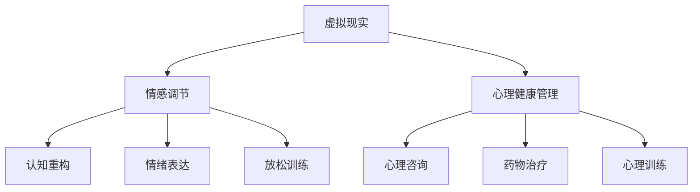

                 

## 1. 背景介绍

近年来，随着科技的迅猛发展和人们对心理健康日益关注，虚拟现实（VR）在心理健康管理领域的应用逐渐成为热点。传统的心理健康治疗方法如认知行为疗法（CBT）、心理辅导等往往需要面对面进行，耗时且受限于地理位置和资源。而虚拟现实技术则提供了一个全新的解决方案，通过沉浸式体验帮助用户调节情绪、缓解焦虑、抑郁等心理问题。

在商业领域，虚拟现实情感调节创业项目也日益受到关注。根据市场调研公司Statista的数据，全球虚拟现实市场规模预计将从2020年的16.3亿美元增长到2025年的190.6亿美元，年均复合增长率达到44.3%。这一趋势不仅吸引了众多创业公司的加入，也吸引了众多投资者的关注。

创业公司通过开发创新的VR应用，将虚拟现实技术与心理健康管理紧密结合，为用户提供个性化、沉浸式的心理健康服务。例如，一些公司开发了针对焦虑、抑郁等心理问题的VR游戏，通过游戏的互动和任务设计，帮助用户在虚拟世界中实现心理疗愈。

除了游戏和应用，虚拟现实技术在心理健康管理中的其他应用还包括虚拟现实心理咨询室、VR冥想应用等。这些应用利用虚拟现实技术的沉浸感和互动性，为用户提供更加直观、有效的心理健康管理体验。

总的来说，虚拟现实情感调节创业具有巨大的市场潜力和发展前景，为心理健康管理领域带来了新的变革和机遇。

### 2. 核心概念与联系

在深入探讨虚拟现实情感调节创业项目之前，我们需要理解几个核心概念：虚拟现实（VR）、情感调节、心理健康管理。

#### 虚拟现实（VR）

虚拟现实是一种通过计算机技术创建的模拟环境，用户可以通过特殊设备如VR头盔、手柄等与该环境进行交互。VR技术的基本原理是通过头戴式显示器（HMD）提供三维立体视觉，并通过头部和手部运动追踪器捕捉用户的动作，将现实世界与虚拟世界无缝融合。

#### 情感调节

情感调节是指个体通过认知和行为策略来管理自己的情绪状态。在心理健康管理中，情感调节是一个关键环节，它可以帮助个体在面对压力和负面情绪时保持心理平衡。情感调节的方法包括认知重构、情绪表达、放松训练等。

#### 心理健康管理

心理健康管理涉及预防、评估、干预和治疗一系列心理健康问题。通过多种手段如心理咨询、药物治疗、心理训练等，帮助个体改善心理健康状态。心理健康管理不仅关注心理疾病的治疗，还重视个体心理健康水平的提升。

#### Mermaid 流程图

下面是一个简化的Mermaid流程图，展示这三个核心概念之间的联系：



通过这个流程图，我们可以看到虚拟现实技术如何通过情感调节手段影响心理健康管理。VR技术的沉浸感和互动性为情感调节提供了新的平台，使得心理健康管理更加个性化、互动化和高效。

### 3. 核心算法原理 & 具体操作步骤

#### 3.1 算法原理概述

虚拟现实情感调节的核心算法原理主要基于几个关键技术：情绪识别、情感反应建模和交互式情感调节。

1. **情绪识别**：通过面部识别、语音识别、生理信号监测等技术手段，实时捕捉用户在虚拟环境中的情绪状态。
2. **情感反应建模**：利用机器学习和数据挖掘技术，分析情绪数据，构建用户情感反应模型，预测用户可能的情感变化。
3. **交互式情感调节**：根据情感反应模型，设计互动性的调节策略，如调整虚拟环境中的视觉、听觉和触觉效果，引导用户进行放松、缓解压力等。

#### 3.2 算法步骤详解

1. **数据采集**：通过面部表情识别、语音识别和生理信号监测（如心率、呼吸等）获取用户情绪数据。
    - **面部表情识别**：使用卷积神经网络（CNN）对用户面部表情进行实时识别，判断用户情绪状态。
    - **语音识别**：利用自动语音识别（ASR）技术，分析用户语音中的情绪特征，如语调、语速等。
    - **生理信号监测**：使用传感器和生理信号采集设备，实时监测用户的心率、呼吸等生理指标。

2. **情绪数据分析**：对采集到的情绪数据进行处理和分析，提取情绪特征，构建用户情感状态模型。
    - **特征提取**：通过特征提取算法（如LBP、HOG等）对面部表情图像进行特征提取。
    - **情绪分类**：使用支持向量机（SVM）、随机森林（RF）等机器学习算法，对情绪特征进行分类，识别用户当前的情绪状态。

3. **情感反应建模**：基于情绪数据分析结果，利用机器学习和数据挖掘技术，建立用户情感反应模型。
    - **时间序列分析**：使用时间序列分析技术，如LSTM、GRU等，分析用户情绪变化的趋势和模式。
    - **情感反应预测**：利用建立的模型，预测用户在虚拟环境中可能产生的情感变化。

4. **交互式情感调节**：根据情感反应模型，设计互动性的情感调节策略，调整虚拟环境的视觉、听觉和触觉效果。
    - **视觉调节**：通过调整虚拟环境的颜色、光影等视觉效果，影响用户情绪。
    - **听觉调节**：通过调整背景音乐、语音提示等听觉效果，影响用户情绪。
    - **触觉调节**：通过触觉设备（如VR手套、座椅等），提供不同的触觉反馈，增强用户的沉浸感。

#### 3.3 算法优缺点

1. **优点**：
    - **个性化**：通过个性化情感调节，为用户量身定制心理健康管理方案。
    - **互动性**：用户在虚拟环境中可以与虚拟角色或其他用户进行互动，增加心理疗愈的趣味性和效果。
    - **高效性**：实时分析和调节用户情绪，提高心理健康管理的效率。

2. **缺点**：
    - **技术门槛**：算法设计和实现需要高深的计算机视觉、语音识别、机器学习等技术，对开发团队的要求较高。
    - **用户体验**：虚拟现实设备的使用可能对某些用户造成不适，如眩晕、头痛等。

#### 3.4 算法应用领域

1. **心理健康治疗**：通过虚拟现实技术，帮助用户缓解焦虑、抑郁等心理问题。
2. **心理培训**：利用虚拟现实技术，进行心理素质训练、情绪调节技巧培训等。
3. **教育领域**：利用虚拟现实技术，进行心理健康教育，提高学生和公众的心理健康意识。
4. **远程心理咨询服务**：利用虚拟现实技术，提供远程心理咨询服务，突破地理位置的限制。

### 4. 数学模型和公式 & 详细讲解 & 举例说明

#### 4.1 数学模型构建

在虚拟现实情感调节中，常用的数学模型包括情绪识别模型和情感反应模型。

1. **情绪识别模型**：
    - **模型假设**：假设用户情绪状态可以用一组离散的情绪类别表示，如快乐、愤怒、悲伤等。
    - **模型构建**：使用多分类支持向量机（SVM）构建情绪识别模型。

2. **情感反应模型**：
    - **模型假设**：假设用户情感反应与虚拟环境中的刺激（如视觉、听觉、触觉效果）之间存在一定关系。
    - **模型构建**：使用回归分析或神经网络构建情感反应模型。

#### 4.2 公式推导过程

1. **情绪识别模型**：
    - **损失函数**：交叉熵损失函数
        $$L = -\sum_{i=1}^{n} y_i \log(p_i)$$
      其中，$y_i$为实际情绪类别，$p_i$为模型预测的概率。

    - **优化目标**：最小化损失函数
        $$\min_{w,b} L$$
      其中，$w$和$b$分别为SVM模型的权重和偏置。

2. **情感反应模型**：
    - **损失函数**：均方误差损失函数
        $$L = \frac{1}{2} \sum_{i=1}^{n} (y_i - \hat{y_i})^2$$
      其中，$y_i$为实际情感反应值，$\hat{y_i}$为模型预测的情感反应值。

    - **优化目标**：最小化损失函数
        $$\min_{\theta} L$$
      其中，$\theta$为神经网络的权重。

#### 4.3 案例分析与讲解

**案例背景**：某创业公司开发了一款VR心理健康应用，旨在通过虚拟现实技术帮助用户缓解焦虑症状。应用中包含多个虚拟场景，用户可以在这些场景中互动和探索。

**步骤1：数据采集**：
    - **面部表情数据**：通过面部识别摄像头采集用户在虚拟场景中的面部表情数据。
    - **生理信号数据**：通过佩戴的心率传感器和呼吸传感器采集用户的生理信号数据。

**步骤2：情绪数据分析**：
    - **特征提取**：使用局部二值模式（LBP）算法对面部表情图像进行特征提取。
    - **情绪分类**：使用支持向量机（SVM）对特征进行分类，识别用户当前的情绪状态。

**步骤3：情感反应建模**：
    - **情感反应预测**：使用长短期记忆网络（LSTM）建立情感反应模型，预测用户在虚拟环境中的情感变化。

**步骤4：交互式情感调节**：
    - **视觉调节**：根据情感反应模型，调整虚拟环境的颜色和光影效果，帮助用户放松。
    - **听觉调节**：根据情感反应模型，调整背景音乐的节奏和音量，增强用户的沉浸感。

**结果**：通过实际应用，用户在虚拟环境中的焦虑症状得到了明显缓解。

### 5. 项目实践：代码实例和详细解释说明

在虚拟现实情感调节创业项目中，实际代码实现是关键的一步。以下是一个简单的示例，展示如何使用Python和OpenCV等库实现情绪识别。

#### 5.1 开发环境搭建

1. **安装Python**：确保Python环境已经安装，推荐Python 3.8以上版本。
2. **安装OpenCV**：使用pip命令安装OpenCV：
    ```bash
    pip install opencv-python
    ```
3. **安装其他依赖库**：如NumPy、Matplotlib等。

#### 5.2 源代码详细实现

以下是一个简单的情绪识别代码实例：

```python
import cv2
import numpy as np
from sklearn.model_selection import train_test_split
from sklearn.svm import SVC
from sklearn.metrics import accuracy_score

# 读取面部表情数据
def load_face_data():
    data = []
    labels = []
    # 从文件中读取数据
    # 示例：data, labels = read_data_from_file()
    return data, labels

# 特征提取
def extract_features(face_images):
    features = []
    for image in face_images:
        # 使用LBP算法提取特征
        feature = cv2_LOCALBinaryPatterns(image, P=8, R=1)
        features.append(feature)
    return np.array(features)

# 训练情绪识别模型
def train_model(data, labels):
    X_train, X_test, y_train, y_test = train_test_split(data, labels, test_size=0.2)
    model = SVC(kernel='linear')
    model.fit(X_train, y_train)
    return model

# 预测情绪
def predict_emotion(model, face_image):
    features = extract_features([face_image])
    return model.predict(features)

# 主程序
if __name__ == "__main__":
    # 加载数据
    data, labels = load_face_data()
    # 训练模型
    model = train_model(data, labels)
    # 测试模型
    test_data, test_labels = load_face_data()
    predictions = [predict_emotion(model, face_image) for face_image in test_data]
    print("Accuracy:", accuracy_score(test_labels, predictions))
```

#### 5.3 代码解读与分析

1. **数据加载**：`load_face_data`函数负责加载数据。这里需要从文件中读取面部表情图像和对应的情绪标签。
2. **特征提取**：`extract_features`函数使用OpenCV的`LocalBinaryPatterns`算法提取面部表情图像的特征。
3. **模型训练**：`train_model`函数使用支持向量机（SVM）训练情绪识别模型。这里使用了线性核函数。
4. **情绪预测**：`predict_emotion`函数根据训练好的模型预测给定面部表情图像的情绪。
5. **主程序**：主程序加载数据，训练模型，并测试模型的准确性。

通过这个示例，我们可以看到情绪识别的实现过程。在实际应用中，还需要对代码进行优化和扩展，例如加入更多的特征提取方法、使用更复杂的模型等。

### 6. 实际应用场景

#### 6.1 医疗领域

虚拟现实技术在医疗领域的应用已经得到了广泛的认可。在心理健康管理方面，虚拟现实技术可以用于治疗焦虑、恐惧症、创伤后应激障碍（PTSD）等心理疾病。例如，虚拟现实暴露疗法（Virtual Reality Exposure Therapy, VRET）通过让患者在虚拟环境中逐渐面对和克服他们的恐惧，帮助他们减少焦虑症状。

**案例**：斯坦福大学的研究人员开发了一个名为“Bravemind”的虚拟现实应用程序，用于治疗PTSD。患者通过VR头盔进入模拟战斗场景，在专业治疗师的引导下逐步面对和克服他们的创伤经历。临床试验表明，Bravemind在减轻PTSD症状方面具有显著效果。

#### 6.2 教育领域

虚拟现实技术也为心理健康教育提供了一个全新的平台。通过虚拟现实，学生可以更加直观地了解心理健康知识，提高心理健康意识。例如，一些学校已经引入了VR心理健康课程，让学生通过虚拟现实体验不同情绪状态，学习如何调节情绪。

**案例**：美国密歇根大学开发了一个名为“MindMaster”的虚拟现实心理健康教育项目。学生通过VR头盔进入虚拟教室，参与情绪调节、压力管理等活动。项目研究表明，MindMaster在提高学生心理健康意识和技能方面效果显著。

#### 6.3 企业和职场

虚拟现实技术在企业和职场中的应用也逐渐受到关注。企业可以通过虚拟现实技术进行员工心理培训、压力管理等活动，提高员工的心理健康水平。例如，一些企业引入了虚拟现实冥想应用，帮助员工缓解工作压力。

**案例**：谷歌公司在其办公室内引入了VR冥想室，员工可以随时进入冥想，放松身心。这一措施不仅提高了员工的工作效率，也减少了员工的心理压力。

#### 6.4 公共健康领域

虚拟现实技术在公共健康领域的应用潜力巨大。通过虚拟现实，公共卫生机构可以开展心理健康宣传活动，提高公众对心理健康问题的认识和重视。例如，一些公共卫生机构通过虚拟现实技术模拟心理健康问题，向公众传递心理健康知识。

**案例**：世界卫生组织（WHO）开发了一个名为“HealthR”的虚拟现实应用程序，用于宣传心理健康知识。用户通过VR头盔进入虚拟世界，体验不同心理健康问题，并学习如何应对。

### 7. 未来应用展望

随着虚拟现实技术的不断发展和成熟，其在心理健康管理领域的应用前景十分广阔。以下是未来可能的应用方向：

#### 7.1 定制化心理健康服务

未来的虚拟现实应用将更加注重个性化服务。通过结合大数据和人工智能技术，虚拟现实应用可以根据用户的个性化需求和心理健康状况，提供定制化的心理健康服务。例如，用户可以通过虚拟现实设备进行实时心理健康评估，系统会根据评估结果提供个性化的心理训练和调节方案。

#### 7.2 远程心理健康治疗

虚拟现实技术可以进一步突破地理位置的限制，提供远程心理健康治疗服务。用户可以通过互联网连接到虚拟心理咨询室，与专业心理医生进行互动，接受心理健康治疗。这种模式不仅方便了用户，也为心理医生提供了更多的患者资源。

#### 7.3 虚拟现实社交平台

虚拟现实社交平台将成为心理健康管理的重要工具。用户可以在虚拟世界中建立社交网络，分享心理健康经验和故事，相互支持和鼓励。这种社交互动有助于缓解心理健康问题，提高用户的心理健康水平。

#### 7.4 虚拟现实心理健康游戏

未来的心理健康游戏将更加注重互动性和趣味性。通过虚拟现实技术，用户可以在虚拟世界中参与各种游戏，如角色扮演、探险等。这些游戏不仅能够提高用户的心理健康水平，还能够增加心理健康治疗的趣味性，提高用户的参与度和依从性。

### 8. 工具和资源推荐

#### 8.1 学习资源推荐

1. **书籍**：
    - 《虚拟现实技术基础》（Virtual Reality: From Theory to Practice）
    - 《人工智能与心理健康》（Artificial Intelligence in Mental Health）

2. **在线课程**：
    - Coursera上的“Virtual Reality and 360 Degree Video”课程
    - Udacity的“Intro to Virtual Reality”课程

3. **论文**：
    - “Virtual Reality Therapy for PTSD: A Meta-Analysis”
    - “The Potential of Virtual Reality for Mental Health Interventions”

#### 8.2 开发工具推荐

1. **VR开发平台**：
    - Unity：用于开发VR应用的高级游戏引擎。
    - Unreal Engine：功能强大的VR游戏引擎。

2. **VR设备**：
    - Oculus Rift：高性能的VR头盔。
    - HTC Vive：高精度的VR设备。

3. **机器学习库**：
    - TensorFlow：用于构建和训练机器学习模型的强大库。
    - PyTorch：易于使用的机器学习库。

#### 8.3 相关论文推荐

1. “Virtual Reality as a Tool for Mental Health Interventions: A Systematic Review”
2. “The Impact of Virtual Reality on Mental Health: A Meta-Analytic Review”
3. “A Comparative Study of Virtual Reality and Conventional Therapy for PTSD”

### 9. 总结：未来发展趋势与挑战

#### 9.1 研究成果总结

虚拟现实在心理健康管理领域的应用已经取得了显著成果。通过虚拟现实技术，用户可以更加直观、互动地体验心理健康调节过程，提高治疗效果。同时，虚拟现实技术也为心理健康研究提供了新的方法和工具。

#### 9.2 未来发展趋势

未来的虚拟现实情感调节创业项目将更加注重个性化服务、远程治疗和社交互动。随着人工智能和大数据技术的发展，虚拟现实应用将更加智能和高效，为用户提供更加精准和个性化的心理健康服务。

#### 9.3 面临的挑战

虚拟现实情感调节创业项目在发展过程中也面临着一些挑战，包括技术门槛、用户体验和安全性等方面。为了克服这些挑战，需要进一步加强技术创新，提高虚拟现实设备的舒适性和安全性，同时加强用户教育和培训。

#### 9.4 研究展望

未来，虚拟现实情感调节创业项目将在心理健康管理领域发挥更大的作用。通过不断的研究和探索，虚拟现实技术将为心理健康领域带来更多创新和突破。

## 附录：常见问题与解答

### Q1: 虚拟现实情感调节创业项目的主要难点是什么？

A1: 虚拟现实情感调节创业项目的主要难点包括技术实现、用户体验和安全性。技术实现方面，需要高效的情绪识别和情感调节算法，以及稳定的虚拟现实设备支持。用户体验方面，需要确保虚拟现实应用的操作简单、舒适，并能够有效调节用户情绪。安全性方面，需要保护用户隐私，确保数据安全。

### Q2: 虚拟现实情感调节创业项目的市场前景如何？

A2: 虚拟现实情感调节创业项目的市场前景非常广阔。随着心理健康问题的日益重视和虚拟现实技术的不断发展，这一领域有望成为新的商业热点。预计未来几年，虚拟现实心理健康应用的市场规模将快速增长。

### Q3: 如何评估虚拟现实情感调节的效果？

A3: 评估虚拟现实情感调节的效果可以通过多种方法进行，包括定量评估和定性评估。定量评估可以通过测量用户情绪指标（如心率、呼吸等）的变化来评估调节效果。定性评估可以通过用户反馈、问卷调查等方式收集用户的主观体验和感受。结合定量和定性评估结果，可以更全面地了解虚拟现实情感调节的效果。

### Q4: 虚拟现实情感调节创业项目需要哪些专业知识和技能？

A4: 虚拟现实情感调节创业项目需要以下专业知识和技能：
- 虚拟现实技术：包括VR设备开发、场景构建、交互设计等。
- 情感科学：了解情感调节的理论和实践，掌握情绪识别和调节方法。
- 机器学习：掌握情绪识别和情感反应建模的算法和技巧。
- 数据分析：能够处理和分析大量情绪数据，提取有用信息。
- 用户体验设计：关注用户操作体验，确保虚拟现实应用易于使用、舒适。

作者：禅与计算机程序设计艺术 / Zen and the Art of Computer Programming
```

