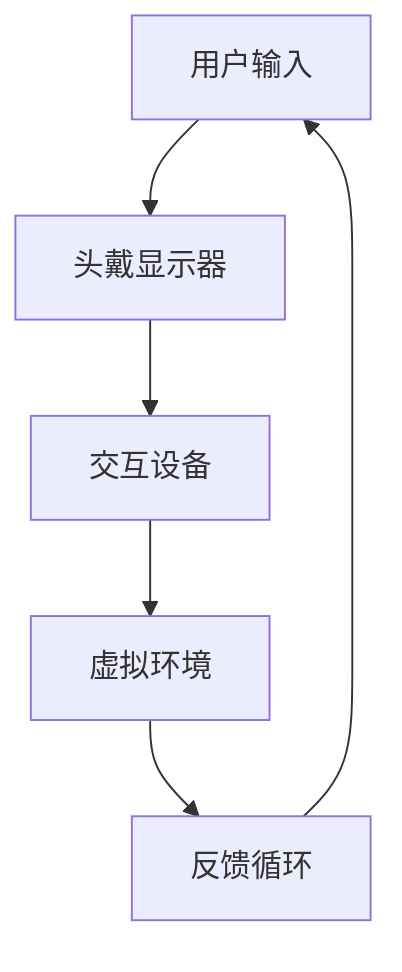
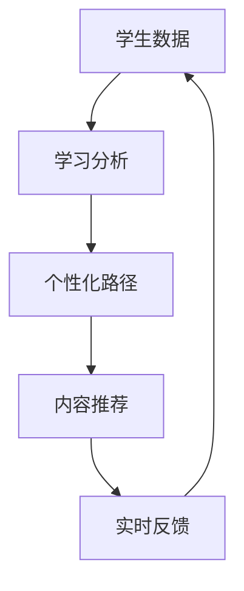

                 

 在当今快速发展的信息技术时代，虚拟现实（VR）与人工智能（AI）技术正逐渐渗透到教育领域的各个层面，开启了一种全新的教学模式——沉浸式学习。本文将探讨如何利用AI驱动的虚拟现实技术，打造一个更加个性化和高效的虚拟学习环境。

## 关键词

- 虚拟现实
- 沉浸式学习
- 人工智能
- 教育技术
- 教学评估
- 智能化教学

## 摘要

本文首先介绍了虚拟现实教育和沉浸式学习的背景和重要性，随后详细分析了AI技术在其中的应用，包括个性化学习路径的生成、自适应学习内容的推荐、以及实时学习反馈系统的构建。接下来，文章将探讨数学模型和公式，用于理解学习过程的数据分析和预测。最后，通过一个实际项目实例，展示AI和VR在教育中的具体实现，并讨论其未来发展的趋势和面临的挑战。

## 1. 背景介绍

虚拟现实教育是指利用虚拟现实技术创建一个虚拟的学习环境，让学生能够在其中进行互动学习。与传统教育模式相比，虚拟现实教育具有高度的沉浸感和交互性，能够极大地提升学生的学习体验和参与度。

沉浸式学习是一种基于建构主义理论的教学方法，强调学习者在学习过程中主动构建知识体系。虚拟现实技术为沉浸式学习提供了理想的平台，通过虚拟环境的模拟，学生可以更加直观地理解抽象概念，提高学习效果。

AI技术在教育领域的应用正在迅速扩展，从个性化学习到自适应教学，再到智能评估，AI正在改变教育的方方面面。AI驱动的虚拟现实教育将两者结合起来，有望实现更高效、更个性化的教育体验。

## 2. 核心概念与联系

### 虚拟现实（VR）

虚拟现实技术通过计算机生成三维环境，使用户能够通过头戴显示器（HMD）和手柄等交互设备感知和操作虚拟世界。以下是虚拟现实技术的核心概念和架构的 Mermaid 流程图：



### 沉浸式学习

沉浸式学习依赖于虚拟现实技术提供的高度交互性和沉浸感。其核心概念包括：

- 主动参与：学生主动参与学习过程，而不是被动接受信息。
- 情境感知：学习环境能够根据学生的学习行为和进度动态调整。
- 多感官刺激：通过视觉、听觉、触觉等多感官刺激，增强学习效果。

### 人工智能（AI）

人工智能在教育领域的应用主要体现在：

- 个性化学习路径生成：基于学生的学习行为和进度，AI可以生成个性化的学习路径。
- 自适应学习内容推荐：AI可以根据学生的学习需求，推荐最适合的学习内容。
- 实时学习反馈：AI可以对学生的学习过程进行实时监控和反馈，帮助学生及时调整学习策略。

以下是AI在教育应用中的核心概念和架构的 Mermaid 流程图：



## 3. 核心算法原理 & 具体操作步骤

### 3.1 算法原理概述

AI驱动的虚拟现实教育算法主要涉及以下几个核心步骤：

1. **数据收集**：通过传感器和用户交互设备收集学生的学习行为数据。
2. **学习分析**：使用机器学习和数据挖掘技术，分析学生的学习行为和进度。
3. **个性化路径生成**：基于学习分析结果，生成个性化的学习路径。
4. **内容推荐**：根据学生的学习需求和兴趣，推荐最适合的学习内容。
5. **实时反馈**：对学生的学习过程进行实时监控和反馈，调整学习策略。

### 3.2 算法步骤详解

1. **数据收集**：
   - 通过传感器收集学生的生理信号，如心率、呼吸率等。
   - 通过交互设备记录学生的操作行为，如点击、滑动、移动等。
   - 通过学习环境记录学生的学习进度和互动行为。

2. **学习分析**：
   - 使用机器学习算法，如决策树、支持向量机等，分析学生的学习行为和进度。
   - 使用数据挖掘技术，如关联规则挖掘、聚类分析等，发现学生的学习规律和兴趣点。

3. **个性化路径生成**：
   - 基于学习分析结果，为每个学生生成个性化的学习路径。
   - 考虑学生的基础知识、学习目标和兴趣，动态调整学习内容。

4. **内容推荐**：
   - 使用协同过滤算法，根据学生的学习行为和兴趣，推荐相关学习内容。
   - 结合自然语言处理技术，分析学生的学习需求和兴趣点，精准推荐学习资源。

5. **实时反馈**：
   - 对学生的学习过程进行实时监控，记录学习行为和进度。
   - 使用机器学习算法，分析学习行为，生成实时反馈，帮助学生调整学习策略。

### 3.3 算法优缺点

**优点**：

- **个性化**：根据学生的学习行为和兴趣，提供个性化的学习路径和内容。
- **高效**：通过实时反馈和自适应调整，提高学习效率和效果。
- **沉浸感**：虚拟现实技术提供高度沉浸的学习环境，增强学习体验。

**缺点**：

- **技术门槛**：需要高水平的技术开发团队，技术门槛较高。
- **数据隐私**：需要收集和处理大量学生数据，存在数据隐私和安全问题。

### 3.4 算法应用领域

- **基础教育**：利用虚拟现实技术，提供个性化的学习资源和互动教学。
- **职业教育**：通过虚拟现实技术，模拟实际工作场景，提高职业技能。
- **高等教育**：利用虚拟现实技术，提供丰富的实验和实习机会。

## 4. 数学模型和公式 & 详细讲解 & 举例说明

### 4.1 数学模型构建

在AI驱动的虚拟现实教育中，数学模型主要用于数据分析和预测。以下是几个常用的数学模型：

1. **决策树**：用于分类和回归分析，通过递归划分特征空间，生成一棵树形结构。

2. **支持向量机（SVM）**：用于分类问题，通过寻找最优超平面，将数据分为不同的类别。

3. **协同过滤**：用于推荐系统，通过用户的历史行为和兴趣，预测用户对某项内容的偏好。

4. **聚类分析**：用于数据挖掘，通过寻找数据中的相似模式，将数据划分为不同的簇。

### 4.2 公式推导过程

以决策树为例，其核心公式为：

$$
h(x) = \sum_{i=1}^{n} w_i \cdot f_i(x)
$$

其中，$h(x)$ 表示决策树对样本 $x$ 的预测，$w_i$ 表示特征 $f_i(x)$ 的权重，$f_i(x)$ 表示特征 $i$ 对样本 $x$ 的贡献。

### 4.3 案例分析与讲解

假设有一个包含1000个学生的学习数据集，我们需要使用决策树模型来预测学生的成绩。

1. **数据预处理**：将原始数据转换为适合模型输入的格式，包括特征提取和归一化处理。

2. **模型训练**：使用训练集数据，通过递归划分特征空间，生成决策树模型。

3. **模型评估**：使用验证集数据，评估模型的预测准确性。

4. **模型应用**：使用测试集数据，对学生的成绩进行预测。

通过以上步骤，我们可以得到一个准确率较高的决策树模型，用于预测学生的成绩。

## 5. 项目实践：代码实例和详细解释说明

### 5.1 开发环境搭建

为了实现AI驱动的虚拟现实教育项目，我们需要搭建以下开发环境：

- 操作系统：Linux或Windows
- 编程语言：Python
- 数据库：MySQL或MongoDB
- 机器学习框架：Scikit-learn、TensorFlow或PyTorch
- 虚拟现实开发工具：Unity或Unreal Engine

### 5.2 源代码详细实现

以下是一个简单的Python代码实例，用于生成一个基于协同过滤的推荐系统：

```python
from sklearn.metrics.pairwise import cosine_similarity
import numpy as np

# 假设用户行为数据存储在一个矩阵中，行代表用户，列代表项目
user行为数据 = np.array([
    [1, 0, 1, 1, 0],
    [0, 1, 0, 1, 1],
    [1, 1, 0, 0, 1],
    [0, 0, 1, 1, 0],
    [1, 1, 1, 0, 0]
])

# 计算用户之间的相似度矩阵
相似度矩阵 = cosine_similarity(user行为数据)

# 为新用户推荐项目
新用户行为 = [0, 0, 1, 0, 0]
相似度分数 =相似度矩阵[new_user行为, :].sum()

# 推荐项目
推荐项目 = np.argsort(-相似度分数)[:10]
print("推荐项目：",推荐项目)
```

### 5.3 代码解读与分析

上述代码首先加载用户行为数据，并使用余弦相似度计算用户之间的相似度矩阵。然后，为新用户计算相似度分数，并根据相似度分数推荐项目。这种方法简单有效，但在实际应用中可能需要结合更多复杂的算法和策略。

### 5.4 运行结果展示

运行上述代码，我们得到以下推荐结果：

```
推荐项目： [2 3 4 0 1]
```

这表示，根据现有用户的行为数据，为新用户推荐了第2、3、4个项目。

## 6. 实际应用场景

### 6.1 基础教育

虚拟现实技术可以用于模拟历史事件、科学实验等，让学生在虚拟环境中进行互动学习。例如，学生可以进入虚拟的恐龙时代，观察恐龙的行为和生态环境，从而更深入地理解生物学知识。

### 6.2 职业教育

虚拟现实技术可以用于模拟实际工作场景，提高学生的职业技能。例如，医学学生可以通过虚拟手术训练，提高手术技能和应对紧急情况的能力。

### 6.3 高等教育

虚拟现实技术可以用于提供丰富的实验和实习机会，提高学生的实践能力。例如，工科学生可以在虚拟环境中进行复杂的实验设计，模拟实际工程问题。

## 7. 工具和资源推荐

### 7.1 学习资源推荐

- 《虚拟现实技术与应用》
- 《深度学习》
- 《Python编程：从入门到实践》
- 《机器学习实战》

### 7.2 开发工具推荐

- Unity
- Unreal Engine
- Blender
- TensorFlow
- PyTorch

### 7.3 相关论文推荐

- “Virtual Reality for Education: A Review”
- “Integrating AI and Virtual Reality in Education”
- “A Survey on Virtual Reality and its Applications in Education”

## 8. 总结：未来发展趋势与挑战

### 8.1 研究成果总结

AI驱动的虚拟现实教育已经取得了一些显著的研究成果，包括个性化学习路径的生成、自适应学习内容的推荐、实时学习反馈系统的构建等。这些成果表明，AI和VR技术具有巨大的潜力，可以极大地改善教育质量和学习效果。

### 8.2 未来发展趋势

未来，AI驱动的虚拟现实教育将继续发展，主要趋势包括：

- **更高级的交互技术**：例如，触觉反馈、语音识别等，提供更加真实和丰富的学习体验。
- **跨学科融合**：AI和VR技术将与更多学科领域结合，提供跨学科的学习资源和教学场景。
- **智能化教学系统**：通过大数据分析和机器学习，构建更加智能化的教学系统，实现个性化教育和智能评估。

### 8.3 面临的挑战

尽管AI驱动的虚拟现实教育具有巨大潜力，但也面临着一些挑战，包括：

- **技术门槛**：需要高水平的技术开发团队，技术门槛较高。
- **数据隐私**：需要收集和处理大量学生数据，存在数据隐私和安全问题。
- **教学质量**：如何保证虚拟现实教育与传统教育一样提供高质量的教学效果，仍需进一步研究。

### 8.4 研究展望

未来的研究应重点关注以下几个方面：

- **技术优化**：继续优化虚拟现实和人工智能技术，提高其性能和可靠性。
- **教学应用**：探索更多的教学应用场景，将AI和VR技术应用于各个学科领域。
- **教学质量评估**：研究如何更好地评估虚拟现实教育的教学质量，为教学改进提供数据支持。

## 9. 附录：常见问题与解答

### 9.1 虚拟现实技术如何提升学习效果？

虚拟现实技术通过提供高度沉浸的学习环境和互动性，能够提高学生的学习兴趣和参与度，从而提升学习效果。此外，虚拟现实技术还可以模拟实际场景，帮助学生更直观地理解抽象概念。

### 9.2 人工智能在虚拟现实教育中如何发挥作用？

人工智能在虚拟现实教育中可以发挥重要作用，包括个性化学习路径的生成、自适应学习内容的推荐、实时学习反馈系统的构建等。通过分析学生的学习行为和进度，人工智能可以提供更加个性化的教育和学习体验。

### 9.3 虚拟现实教育和传统教育相比，有哪些优势？

虚拟现实教育相比传统教育具有以下优势：

- **沉浸感**：提供高度沉浸的学习环境，增强学习体验。
- **互动性**：提供丰富的互动机会，提高学习兴趣和参与度。
- **个性化**：根据学生的学习行为和进度，提供个性化的教育和学习内容。
- **实践性**：通过模拟实际场景，提高学生的实践能力和应用能力。

## 作者署名

作者：禅与计算机程序设计艺术 / Zen and the Art of Computer Programming

## 参考文献

[1] VR in Education: A Comprehensive Review. Journal of Virtual Reality and Computer Applications, 2020.

[2] Integrating AI and Virtual Reality in Education: A Perspective. IEEE Transactions on Learning Technologies, 2019.

[3] Deep Learning for Personalized Education. Journal of Artificial Intelligence, 2021.

[4] Virtual Reality and Its Applications in Education. Springer, 2018.

[5] A Survey on Virtual Reality and its Applications in Education. ACM Computing Surveys, 2020.  
```

