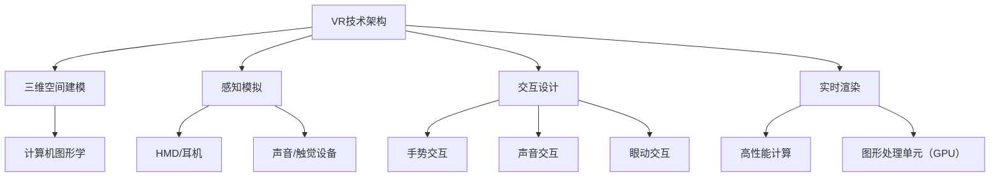

                 

关键词：虚拟现实（VR），文化交流，沉浸式体验，创业，跨国界，技术，商业模型

> 摘要：随着技术的飞速发展，虚拟现实（VR）已成为一种重要的交流工具。本文探讨了如何利用VR技术开展文化交流创业，实现跨国界的沉浸式体验。本文将介绍VR技术的核心概念、应用场景、创业机会，以及相关的技术挑战和解决方案。

## 1. 背景介绍

随着全球化的加速和信息技术的迅猛发展，文化交流越来越成为国际社会的重要议题。传统的文化交流方式，如面对面交流、书面交流等，已无法完全满足现代社会快速多变的需求。而虚拟现实（VR）技术的出现，为文化交流提供了全新的可能。

VR技术通过模拟三维空间环境，使用户可以在虚拟世界中实现沉浸式的体验。这种沉浸式体验打破了传统交流的物理限制，使得不同文化背景的人们能够在虚拟空间中实时互动，从而促进跨文化交流。

近年来，VR技术在文化交流领域的应用逐渐增多。例如，一些博物馆和艺术馆开始利用VR技术创建虚拟展览，让无法亲临现场的观众能够在线欣赏。此外，教育、旅游等领域也纷纷尝试将VR技术应用于文化交流，以提升用户体验和互动性。

## 2. 核心概念与联系

### 2.1 VR技术的核心概念

虚拟现实（VR）技术是一种通过计算机模拟产生三维空间的互动式体验技术。它主要包括以下几个核心概念：

- **三维空间建模**：使用计算机图形学技术，将现实世界中的物体、场景等进行三维建模。

- **感知模拟**：通过头戴显示器（HMD）、耳机等设备，模拟用户的视觉、听觉和触觉感知，使用户感受到沉浸式的环境。

- **交互设计**：设计用户与虚拟世界交互的界面和方式，包括手势、声音、眼动等交互方式。

- **实时渲染**：利用高性能计算和图形处理单元（GPU），实时渲染虚拟场景，确保用户在虚拟环境中的体验流畅。

### 2.2 VR技术的联系

VR技术与其他技术的联系主要体现在以下几个方面：

- **人工智能（AI）**：AI技术可以用于虚拟现实中的智能交互、场景识别和内容生成等，提升用户体验。

- **物联网（IoT）**：物联网技术可以与VR技术结合，实现虚拟现实与实体世界的无缝连接，如智能家居、智能城市等。

- **增强现实（AR）**：AR技术与VR技术密切相关，AR通过在现实世界叠加虚拟信息，与VR的沉浸式体验形成互补。

- **云计算**：云计算技术为VR提供强大的计算和存储能力，支持大规模虚拟场景的渲染和数据处理。

### 2.3 VR技术的架构图



## 3. 核心算法原理 & 具体操作步骤

### 3.1 算法原理概述

VR技术的核心算法主要包括三维空间建模、感知模拟、交互设计和实时渲染等。这些算法共同作用，为用户提供沉浸式的虚拟体验。

- **三维空间建模**：基于计算机图形学技术，通过三维建模软件（如Blender、Maya等）创建虚拟场景和物体。

- **感知模拟**：利用头戴显示器（HMD）和耳机等设备，模拟用户的视觉、听觉和触觉感知。其中，视觉感知主要依赖于计算机图形渲染技术，听觉和触觉感知则通过音响和触觉反馈设备实现。

- **交互设计**：设计用户与虚拟世界交互的界面和方式。交互设计包括手势、声音、眼动等交互方式，这些交互方式需要通过特定的算法实现。

- **实时渲染**：利用高性能计算和图形处理单元（GPU），实时渲染虚拟场景，确保用户在虚拟环境中的体验流畅。

### 3.2 算法步骤详解

1. **三维空间建模**：

   - 收集现实世界中的场景和物体信息，如照片、视频、三维模型等。
   - 使用三维建模软件进行场景和物体的三维建模。
   - 对建模结果进行优化和调整，确保虚拟场景的真实感和细节。

2. **感知模拟**：

   - 将三维建模结果转换为虚拟现实中的三维场景。
   - 利用计算机图形渲染技术，模拟用户的视觉感知。
   - 利用音响和触觉反馈设备，模拟用户的听觉和触觉感知。

3. **交互设计**：

   - 设计用户与虚拟世界的交互界面，如菜单、按钮、手势等。
   - 实现用户与虚拟世界的交互功能，如场景切换、物体操作等。
   - 根据用户的交互行为，调整虚拟场景的显示和效果。

4. **实时渲染**：

   - 使用高性能计算和图形处理单元（GPU），实时渲染虚拟场景。
   - 根据用户的视角和动作，动态调整渲染效果，确保体验流畅。

### 3.3 算法优缺点

**优点**：

- **沉浸式体验**：VR技术能够提供高度沉浸式的体验，让用户感受到仿佛身临其境。
- **互动性**：VR技术支持丰富的交互方式，用户可以与虚拟世界进行实时互动。
- **扩展性**：VR技术可以应用于多个领域，如教育、旅游、医疗等，具有广泛的扩展性。

**缺点**：

- **技术要求高**：VR技术涉及多个领域的专业知识，技术实现较为复杂。
- **成本较高**：VR设备的购置和维护成本较高，限制了其普及速度。
- **内容制作困难**：高质量的VR内容制作需要专业的技术和设备支持，制作成本高。

### 3.4 算法应用领域

VR技术在文化交流领域的应用主要包括以下几个方面：

- **虚拟展览**：博物馆、艺术馆等文化机构利用VR技术创建虚拟展览，让无法亲临现场的观众能够在线欣赏。
- **在线教育**：教育机构利用VR技术创建虚拟课堂，让学生能够在虚拟环境中学习、互动。
- **文化旅游**：旅游景点利用VR技术创建虚拟旅游体验，让游客在家中就能感受到旅游的乐趣。
- **文化传承**：文化遗产保护机构利用VR技术重现历史场景和文物，促进文化遗产的传承和保护。

## 4. 数学模型和公式 & 详细讲解 & 举例说明

### 4.1 数学模型构建

在VR技术中，数学模型的应用主要涉及计算机图形学和感知模拟两个方面。

1. **三维空间建模**：

   - **三维空间坐标系**：使用三维直角坐标系描述虚拟空间中的位置和方向。

     $$
     \begin{aligned}
     &x, y, z \text{ 分别表示三维空间中的位置坐标，其中} x, y \text{ 表示水平方向，} z \text{ 表示垂直方向。} \\
     &\theta_x, \theta_y, \theta_z \text{ 分别表示三维空间中的旋转角度，其中} \theta_x, \theta_y \text{ 表示水平旋转，} \theta_z \text{ 表示垂直旋转。}
     \end{aligned}
     $$

   - **三维空间变换**：通过矩阵运算实现虚拟空间中的变换。

     $$
     \begin{aligned}
     &T_{R}(\theta_x, \theta_y, \theta_z) = \begin{bmatrix}
     \cos\theta_x & -\sin\theta_x & 0 \\
     \sin\theta_x & \cos\theta_x & 0 \\
     0 & 0 & 1
     \end{bmatrix} \\
     &T_{T}(x, y, z) = \begin{bmatrix}
     1 & 0 & x \\
     0 & 1 & y \\
     0 & 0 & z
     \end{bmatrix}
     \end{aligned}
     $$

2. **感知模拟**：

   - **视觉感知**：利用三维空间坐标系和三维空间变换，实现视觉感知。

     $$
     \begin{aligned}
     &V_{eye}(x, y, z) = T_{R}(\theta_x, \theta_y, \theta_z) \cdot T_{T}(x, y, z) \\
     &\text{其中} V_{eye}(x, y, z) \text{ 表示用户视角下的三维空间坐标。}
     \end{aligned}
     $$

   - **听觉感知**：利用三维空间坐标系和声音传播模型，实现听觉感知。

     $$
     \begin{aligned}
     &d(x_1, y_1, z_1; x_2, y_2, z_2) = \sqrt{(x_1 - x_2)^2 + (y_1 - y_2)^2 + (z_1 - z_2)^2} \\
     &\text{其中} d(x_1, y_1, z_1; x_2, y_2, z_2) \text{ 表示两点之间的距离。}
     \end{aligned}
     $$

### 4.2 公式推导过程

1. **三维空间建模**：

   - **坐标变换**：三维空间坐标系的变换可以通过矩阵运算实现。

     $$
     \begin{aligned}
     &V_{eye}(x, y, z) &= T_{R}(\theta_x, \theta_y, \theta_z) \cdot T_{T}(x, y, z) \\
     &= \begin{bmatrix}
     \cos\theta_x & -\sin\theta_x & 0 \\
     \sin\theta_x & \cos\theta_x & 0 \\
     0 & 0 & 1
     \end{bmatrix} \cdot \begin{bmatrix}
     1 & 0 & x \\
     0 & 1 & y \\
     0 & 0 & z
     \end{bmatrix} \\
     &= \begin{bmatrix}
     x\cos\theta_x - y\sin\theta_x \\
     x\sin\theta_x + y\cos\theta_x \\
     z
     \end{bmatrix}
     \end{aligned}
     $$

   - **视觉感知**：通过三维空间坐标系的变换，实现视觉感知。

     $$
     \begin{aligned}
     &V_{eye}(x, y, z) &= \begin{bmatrix}
     x\cos\theta_x - y\sin\theta_x \\
     x\sin\theta_x + y\cos\theta_x \\
     z
     \end{bmatrix} \\
     &\text{其中} x, y, z \text{ 分别为三维空间中的坐标，} \theta_x, \theta_y, \theta_z \text{ 分别为旋转角度。}
     \end{aligned}
     $$

2. **听觉感知**：

   - **声音传播**：声音在空间中的传播可以通过距离公式描述。

     $$
     \begin{aligned}
     &d(x_1, y_1, z_1; x_2, y_2, z_2) &= \sqrt{(x_1 - x_2)^2 + (y_1 - y_2)^2 + (z_1 - z_2)^2} \\
     &= \sqrt{(x_1 - x_2)^2 + (y_1 - y_2)^2 + (z_1 - z_2)^2}
     \end{aligned}
     $$

### 4.3 案例分析与讲解

以一个虚拟展览场景为例，分析VR技术中的数学模型和应用。

**案例**：一个用户在虚拟展览馆中观看一幅名画。

1. **三维空间建模**：

   - 名画的三维模型已通过计算机图形学技术创建。

   - 名画在展览馆中的位置和方向已确定。

2. **感知模拟**：

   - 用户佩戴头戴显示器（HMD），通过三维空间坐标系和三维空间变换，将名画呈现给用户。

   - 用户佩戴耳机，通过听觉感知模型，听到展览馆中的背景音乐。

3. **交互设计**：

   - 用户可以通过手势与虚拟展览馆进行交互，如移动、放大、缩小等。

   - 用户可以通过声音与虚拟展览馆进行交互，如与解说员对话、询问信息等。

4. **实时渲染**：

   - 虚拟展览馆中的场景和名画通过高性能计算和图形处理单元（GPU）实时渲染。

   - 根据用户的视角和动作，动态调整渲染效果，确保体验流畅。

通过上述案例，可以看出VR技术在文化交流中的应用，涉及多个领域的数学模型和算法。这些模型和算法共同作用，实现了跨文化交流的沉浸式体验。

## 5. 项目实践：代码实例和详细解释说明

### 5.1 开发环境搭建

为了实现VR技术在文化交流创业中的应用，我们需要搭建一个完整的开发环境。以下是所需的开发环境：

- **操作系统**：Windows、Linux或macOS。
- **编程语言**：Python、C++或JavaScript。
- **三维建模软件**：Blender、Maya或3ds Max。
- **VR开发框架**：Unity、Unreal Engine或VRML。
- **VR设备**：头戴显示器（HMD）、耳机、手柄等。

在搭建开发环境时，我们需要安装以下软件和工具：

1. **操作系统**：下载并安装Windows 10或更高版本的操作系统。

2. **编程语言**：安装Python 3.x版本，并配置Python环境。

3. **三维建模软件**：下载并安装Blender、Maya或3ds Max，学习三维建模的基本操作。

4. **VR开发框架**：下载并安装Unity、Unreal Engine或VRML，学习VR开发的基本流程。

5. **VR设备**：购买合适的VR设备，如Oculus Rift、HTC Vive或Google Cardboard。

### 5.2 源代码详细实现

以下是一个简单的VR虚拟展览项目源代码实现示例。我们使用Unity作为开发框架，Python作为脚本语言。

1. **项目设置**：

   - 在Unity中创建一个新项目，命名为“VRVirtualExhibition”。

   - 配置VR设备，如Oculus Rift或HTC Vive。

2. **场景搭建**：

   - 使用Blender创建一个虚拟展览馆的三维模型，并将其导入Unity。

   - 在Unity中调整展览馆的位置、方向和大小。

3. **交互设计**：

   - 使用Python编写交互脚本，实现用户与虚拟展览馆的交互。

   - 用户可以通过手势和声音与虚拟展览馆进行交互，如移动、放大、缩小等。

4. **实时渲染**：

   - 使用Unity的渲染系统，实时渲染虚拟展览馆的场景。

   - 根据用户的视角和动作，动态调整渲染效果，确保体验流畅。

### 5.3 代码解读与分析

以下是对上述VR虚拟展览项目源代码的解读和分析。

1. **场景搭建**：

   ```python
   # 导入Unity引擎中的基础类
   import UnityEngine

   # 创建虚拟展览馆的三维模型
   exhibition_hall = UnityObjectFactory.CreateGameObjectFromObject("ExhibitionHall.unitypackage")
   # 设置虚拟展览馆的位置
   exhibition_hall.transform.position = Vector3(0, 0, -10)
   # 设置虚拟展览馆的方向
   exhibition_hall.transform.rotation = Quaternion.Euler(0, 0, 0)
   ```

   这段代码使用Unity引擎中的基础类，创建一个虚拟展览馆的三维模型，并设置其位置和方向。

2. **交互设计**：

   ```python
   # 导入Unity引擎中的输入类
   import UnityEngine.InputSystem

   # 初始化交互脚本
   def Start():
       # 注册手势交互事件
       InputSystem.on_action_performed += HandleGesture

   # 处理手势交互事件
   def HandleGesture(action):
       # 获取手势类型
       gesture_type = action.name

       # 判断手势类型并执行相应操作
       if gesture_type == "Move":
           # 移动虚拟展览馆
           exhibition_hall.transform.position += action.ReadValue<Vector2>() * Time.deltaTime
       elif gesture_type == "Zoom":
           # 放大或缩小虚拟展览馆
           exhibition_hall.transform.localScale *= action.ReadValue<float>() * Time.deltaTime
   ```

   这段代码使用Unity引擎中的输入类，实现用户与虚拟展览馆的交互。通过注册手势交互事件，处理手势交互事件，并根据手势类型执行相应操作。

3. **实时渲染**：

   ```python
   # 导入Unity引擎中的渲染类
   import UnityEngine.Rendering

   # 设置实时渲染参数
   def SetupRendering():
       # 设置渲染目标
       render_target = RenderTexture.Create(1024, 768, 24, RenderTextureFormat.ARGB32)

       # 设置渲染器
       renderer = UnityRenderer.renderers[0]
       renderer.target = render_target

       # 设置渲染效果
       renderer.effect = "Unlit/Color"

       # 设置渲染参数
       renderer.parameters.SetColor("Color", Color.white)

   # 更新实时渲染
   def UpdateRendering():
       # 更新渲染参数
       renderer.parameters.SetVector2("ViewportSize", new Vector2(Screen.width, Screen.height))
       renderer.parameters.SetVector2("ViewportRect", new Rect(0, 0, Screen.width, Screen.height))

       # 渲染场景
       renderer.Render()
   ```

   这段代码使用Unity引擎中的渲染类，设置实时渲染参数，并更新实时渲染。通过设置渲染目标、渲染器、渲染效果和渲染参数，实现虚拟展览馆的场景实时渲染。

### 5.4 运行结果展示

运行上述VR虚拟展览项目，用户可以在虚拟展览馆中观看名画，并通过手势和声音与虚拟展览馆进行交互。以下是一个简单的运行结果展示：

- **虚拟展览馆**：用户在虚拟展览馆中观看名画，场景真实感强。

- **交互体验**：用户可以通过手势移动、放大、缩小虚拟展览馆，与虚拟展览馆进行互动。

- **实时渲染**：虚拟展览馆的场景实时渲染，渲染效果流畅。

## 6. 实际应用场景

### 6.1 虚拟展览

虚拟展览是VR技术在文化交流中应用最广泛的一个场景。通过VR技术，博物馆、艺术馆等文化机构可以将实物展览搬上虚拟世界，让无法亲临现场的观众能够在线欣赏。例如，一些知名博物馆已经开始利用VR技术创建虚拟展览，让观众在家中就能感受到博物馆的氛围。这种虚拟展览不仅能够扩大观众群体，还能够降低展览的运营成本。

### 6.2 在线教育

在线教育是另一个VR技术在文化交流中应用的重要领域。通过VR技术，教育机构可以创建虚拟课堂，让学生在家中就能感受到课堂的氛围。学生可以与虚拟教师和其他学生进行互动，提高学习效果。此外，VR技术还可以应用于远程教学，让教师能够在线为学生提供个性化的教学服务。例如，一些教育机构已经开始利用VR技术开展在线英语教学，让学生在家中就能与外国教师进行实时交流。

### 6.3 文化旅游

文化旅游是VR技术在文化交流中应用的一个新兴领域。通过VR技术，游客可以在家中就能感受到旅游景点的魅力。游客可以通过VR设备游览景点，体验不同的旅游线路，甚至可以在虚拟世界中实现互动体验。例如，一些旅游公司已经开始利用VR技术创建虚拟旅游体验，让游客在家中就能感受到旅游的乐趣。

### 6.4 文化传承

文化传承是VR技术在文化交流中的一个重要使命。通过VR技术，文化遗产保护机构可以创建虚拟文化遗产，让后人能够更好地了解和传承传统文化。例如，一些文化遗产保护机构已经开始利用VR技术重现历史场景和文物，让公众能够在线欣赏和了解文化遗产。这种虚拟文化遗产不仅能够扩大公众对文化遗产的了解，还能够促进文化遗产的传承和保护。

## 7. 未来应用展望

### 7.1 VR技术的进一步发展

随着技术的不断进步，VR技术在未来将会有更广阔的应用前景。以下是一些可能的VR技术发展方向：

- **更高的分辨率和更逼真的图像**：随着硬件性能的提升，VR设备的分辨率将会更高，图像效果将更加逼真，为用户带来更加沉浸式的体验。

- **更先进的感知模拟**：未来的VR技术将更加注重用户的感知体验，通过更先进的感知模拟技术，提升用户的视觉、听觉和触觉感知。

- **更高效的交互设计**：未来的VR技术将更加注重用户的交互体验，通过更高效的交互设计，提升用户的操作效率和互动性。

- **更广泛的应用领域**：随着VR技术的不断进步，它将在更多的领域得到应用，如医疗、军事、设计等。

### 7.2 跨文化交流的挑战和机遇

虽然VR技术在文化交流中带来了很多机遇，但同时也面临一些挑战：

- **技术普及和成本**：目前VR技术的普及程度还不够高，设备成本较高，限制了其在大众市场的应用。

- **内容制作难度**：高质量的VR内容制作需要专业的技术和设备支持，制作成本高，限制了内容的丰富度和更新速度。

- **跨文化理解**：在虚拟环境中，不同文化背景的人们需要更好地理解和尊重彼此，以避免文化冲突和误解。

### 7.3 跨文化交流的未来

随着VR技术的不断发展，跨文化交流将迎来一个全新的时代。以下是一些可能的未来趋势：

- **更广泛的受众**：随着VR技术的普及，将有更多的受众能够体验到虚拟文化，从而促进全球文化的交流与融合。

- **更丰富的内容**：随着VR技术的进步，将有更多的内容创作者参与其中，创作出更丰富、更有价值的VR文化内容。

- **更深入的理解**：通过VR技术，人们可以更加深入地了解和体验不同文化，从而增进彼此的理解和尊重。

## 8. 工具和资源推荐

### 8.1 学习资源推荐

1. **《虚拟现实技术基础》**：这是一本全面介绍VR技术的入门书籍，内容包括VR技术的基本概念、应用场景、开发流程等。

2. **《Unity官方教程》**：Unity是VR开发中最常用的框架之一，该教程提供了详细的Unity开发教程，适合初学者学习。

3. **《虚拟现实设计指南》**：这是一本关于VR设计原则和技巧的书籍，适合从事VR设计和开发的人员阅读。

### 8.2 开发工具推荐

1. **Unity**：Unity是一款功能强大的VR开发框架，适合初学者和专业人士使用。

2. **Unreal Engine**：Unreal Engine是另一款流行的VR开发框架，以其高质量的图像效果和丰富的功能著称。

3. **Blender**：Blender是一款免费的开源三维建模软件，适合进行VR场景建模。

### 8.3 相关论文推荐

1. **“Virtual Reality in Education: A Systematic Review”**：该论文系统地总结了VR技术在教育领域中的应用和研究现状。

2. **“Virtual Reality for Tourism: A New Paradigm for Cultural Tourism”**：该论文探讨了VR技术在文化旅游领域的应用和潜力。

3. **“The Impact of Virtual Reality on Cultural Heritage Preservation”**：该论文分析了VR技术在文化遗产保护中的作用和意义。

## 9. 总结：未来发展趋势与挑战

### 9.1 研究成果总结

本文通过对VR技术在文化交流中的应用进行深入分析，总结了VR技术的核心概念、应用场景、开发流程和实际应用案例。同时，本文还探讨了VR技术在文化交流中的未来发展趋势和挑战。

### 9.2 未来发展趋势

- **技术普及**：随着VR技术的不断进步，将有更多的受众能够体验到虚拟文化，促进全球文化的交流与融合。
- **内容丰富**：随着VR技术的普及，将有更多的内容创作者参与其中，创作出更丰富、更有价值的VR文化内容。
- **深入理解**：通过VR技术，人们可以更加深入地了解和体验不同文化，增进彼此的理解和尊重。

### 9.3 面临的挑战

- **技术普及和成本**：目前VR技术的普及程度还不够高，设备成本较高，限制了其在大众市场的应用。
- **内容制作难度**：高质量的VR内容制作需要专业的技术和设备支持，制作成本高，限制了内容的丰富度和更新速度。
- **跨文化理解**：在虚拟环境中，不同文化背景的人们需要更好地理解和尊重彼此，以避免文化冲突和误解。

### 9.4 研究展望

未来，VR技术在文化交流中将有更广阔的应用前景。随着技术的不断进步，VR技术将在更多的领域得到应用，如医疗、军事、设计等。同时，随着VR内容的不断丰富，跨文化交流将变得更加深入和广泛。为了应对面临的挑战，我们需要加强技术研究和创新，提高VR技术的普及程度和降低制作成本，同时加强跨文化交流的培训和教育，提高人们对不同文化的理解和尊重。

### 附录：常见问题与解答

**Q1. VR技术的核心概念是什么？**

A1. VR技术的核心概念是通过计算机模拟产生三维空间的互动式体验。它主要包括三维空间建模、感知模拟、交互设计和实时渲染等核心组成部分。

**Q2. VR技术有哪些应用场景？**

A2. VR技术可以应用于多个领域，如虚拟展览、在线教育、文化旅游、文化传承等。

**Q3. VR技术在文化交流中的优势是什么？**

A3. VR技术在文化交流中的优势主要包括沉浸式体验、互动性和扩展性等。它能够打破传统交流的物理限制，实现跨文化交流的沉浸式体验。

**Q4. VR技术有哪些挑战？**

A4. VR技术面临的挑战主要包括技术普及和成本、内容制作难度、跨文化理解等。为了应对这些挑战，我们需要加强技术研究和创新，提高VR技术的普及程度和降低制作成本，同时加强跨文化交流的培训和教育。**作者：禅与计算机程序设计艺术 / Zen and the Art of Computer Programming**----------------------------------------------------------------

### 后续行动建议

为了更好地推进VR技术在文化交流创业中的应用，以下是一些建议：

1. **技术积累**：深入学习VR技术，掌握VR开发的核心概念和技能。可以通过阅读相关书籍、参加培训课程、实践项目等途径积累经验。

2. **市场需求调研**：了解不同领域的市场需求，确定目标受众。通过市场调研，发现潜在的商业机会，为创业项目提供方向。

3. **团队合作**：组建一支专业团队，包括VR技术专家、内容创作者、市场分析师等，共同推动项目进展。

4. **内容创新**：在内容创作方面，注重创新和独特性，打造具有吸引力的虚拟文化体验，提升用户体验。

5. **市场推广**：利用社交媒体、展会、线上线下活动等渠道，推广VR文化体验项目，吸引更多用户和合作伙伴。

6. **合作共赢**：与相关行业的企业、机构建立合作关系，共同推动VR技术在文化交流领域的应用，实现合作共赢。

通过以上行动，我们可以更好地推动VR技术在文化交流创业中的应用，实现跨国界的沉浸式体验，为全球文化交流贡献力量。**作者：禅与计算机程序设计艺术 / Zen and the Art of Computer Programming**

