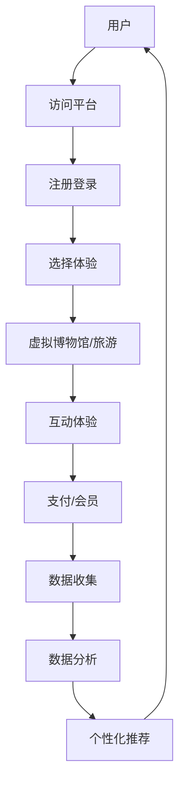

                 

关键词：虚拟现实（VR）、文化交流、沉浸式体验、创业、跨国界、技术架构、用户参与、商业模型、未来趋势。

摘要：本文旨在探讨虚拟现实技术在文化交流创业中的应用，通过构建跨国界的沉浸式体验，打破地理和文化界限，促进不同文化之间的互动与理解。文章首先介绍了虚拟现实技术的基本概念和发展历程，然后分析了其在文化交流中的核心优势和应用场景。接着，文章详细阐述了虚拟现实文化交流创业的关键步骤和策略，包括技术架构、用户参与、商业模式的构建。最后，文章对未来虚拟现实文化交流的发展趋势和面临的挑战进行了展望，并提出了相关工具和资源的推荐。

## 1. 背景介绍

虚拟现实（VR）是一种通过计算机技术模拟出一个逼真的三维虚拟世界，使用户能够通过特殊设备（如VR头盔、跟踪设备等）在其中进行交互和体验的技术。VR技术的核心在于其沉浸式体验，通过高度模拟的视觉、听觉、触觉等多感官刺激，使用户在虚拟环境中获得与真实世界相似的感受和互动体验。

文化交流创业是近年来兴起的一种创新商业模式，旨在通过文化产品或服务的设计与提供，促进不同文化之间的交流与理解。随着全球化进程的加速，文化交流的重要性日益凸显，而虚拟现实技术的出现为文化交流创业提供了新的机遇和挑战。

### 1.1 虚拟现实技术的发展历程

虚拟现实技术起源于20世纪60年代，最初的研究主要集中在模拟飞行训练和军事模拟。随着计算机图形学、图像处理、传感技术和网络通信等技术的发展，虚拟现实技术逐渐成熟并开始应用于多个领域。1987年，日本任天堂公司推出了虚拟现实头戴显示器VR-1，标志着虚拟现实技术进入大众视野。

21世纪初，随着硬件设备的改进和内容的丰富，虚拟现实技术开始广泛应用于游戏、教育、医疗、设计等领域。近年来，随着5G、云计算、人工智能等新技术的快速发展，虚拟现实技术进入了一个全新的发展阶段，其在文化交流中的应用潜力也得到了广泛认可。

### 1.2 文化交流创业的兴起

文化交流创业作为一种新型商业模式，旨在通过创新的文化产品或服务设计，实现文化价值的传递和商业价值的创造。随着全球化和互联网的发展，文化交流创业逐渐成为一种重要的经济和社会现象。

文化交流创业的优势在于：

1. 拓展市场：通过创新的文化产品或服务，企业可以进入新的市场和消费群体，实现业务增长和盈利。
2. 促进文化交流：文化交流创业不仅为企业带来经济收益，还促进了不同文化之间的交流与理解，具有积极的社会意义。
3. 创新驱动：文化交流创业鼓励创新思维和跨学科合作，有助于推动相关行业的发展。

### 1.3 虚拟现实技术在文化交流中的应用

虚拟现实技术为文化交流创业提供了全新的平台和手段，使其能够实现更丰富的文化体验和更广泛的受众覆盖。以下是虚拟现实技术在文化交流中的几个主要应用场景：

1. 虚拟博物馆和艺术馆：通过虚拟现实技术，用户可以身临其境地参观世界各地的博物馆和艺术馆，欣赏珍贵的艺术作品和文物。
2. 文化遗产保护与展示：虚拟现实技术可以用于文化遗产的保护与展示，使濒临消失的文化遗产得以在虚拟世界中永久保存。
3. 跨国界文化交流活动：通过虚拟现实技术，不同国家和地区的文化团体可以在线上举办文化交流活动，促进文化的互鉴与融合。
4. 虚拟旅游体验：虚拟现实技术可以为用户带来沉浸式的旅游体验，让用户在虚拟世界中游览世界各地的名胜古迹。

## 2. 核心概念与联系

### 2.1 虚拟现实技术的基本原理

虚拟现实技术的基本原理主要包括计算机图形学、图像处理、传感技术和人机交互等。

- 计算机图形学：通过计算机生成三维模型和场景，为用户提供视觉体验。
- 图像处理：对采集到的图像进行处理，增强视觉效果，提高真实感。
- 传感技术：使用传感器捕捉用户动作，为用户提供沉浸式互动体验。
- 人机交互：通过特殊设备（如VR头盔、手柄等）实现用户与虚拟环境的交互。

### 2.2 虚拟现实技术在文化交流中的应用

虚拟现实技术在文化交流中的应用涉及多个方面，包括虚拟博物馆、虚拟旅游、文化遗产保护等。

- 虚拟博物馆和艺术馆：通过虚拟现实技术，用户可以在线上参观世界各地的博物馆和艺术馆，欣赏珍贵的艺术作品和文物。
- 虚拟旅游体验：虚拟现实技术可以为用户带来沉浸式的旅游体验，让用户在虚拟世界中游览世界各地的名胜古迹。
- 文化遗产保护与展示：虚拟现实技术可以用于文化遗产的保护与展示，使濒临消失的文化遗产得以在虚拟世界中永久保存。

### 2.3 跨国界文化交流的挑战与机遇

跨国界文化交流面临以下挑战：

- 语言障碍：不同语言和文化之间的交流存在障碍，影响文化理解和传播。
- 文化差异：不同文化之间的价值观、信仰、习俗等存在差异，可能导致误解和冲突。
- 技术限制：虚拟现实技术的发展水平尚不足以完全模拟真实世界，影响用户体验。

然而，虚拟现实技术也为跨国界文化交流带来了机遇：

- 沉浸式体验：虚拟现实技术可以为用户提供沉浸式的文化体验，促进文化理解和传播。
- 跨界合作：虚拟现实技术为不同国家和地区的文化团体提供了跨界合作的机会，共同创造和传播文化价值。
- 文化创新：虚拟现实技术可以激发文化创新，促进文化多样性的发展。

### 2.4 虚拟现实文化交流创业的商业模式

虚拟现实文化交流创业的商业模式主要包括以下几种：

- 会员制：通过提供会员服务，为用户提供虚拟博物馆、虚拟旅游等沉浸式文化体验。
- 广告营销：通过虚拟博物馆、虚拟旅游等平台，为文化企业提供广告宣传服务。
- 文化产品销售：通过虚拟博物馆、虚拟旅游等平台，销售与虚拟体验相关的文化产品，如艺术品、纪念品等。
- 文化活动举办：在线上举办跨国界文化交流活动，吸引参与者参与，并通过门票、赞助等方式实现盈利。

### 2.5 虚拟现实技术在文化交流中的Mermaid流程图



## 3. 核心算法原理 & 具体操作步骤

### 3.1 算法原理概述

虚拟现实文化交流创业的核心算法主要包括以下几个部分：

- 用户行为分析：通过分析用户在虚拟环境中的行为数据，了解用户偏好和需求。
- 文化内容推荐：基于用户行为分析结果，为用户推荐符合其兴趣的文化内容和体验。
- 沉浸式互动生成：根据用户反馈和文化内容，实时生成沉浸式互动体验，提高用户体验。

### 3.2 算法步骤详解

#### 3.2.1 用户行为分析

1. 数据采集：收集用户在虚拟环境中的行为数据，包括浏览记录、互动次数、停留时间等。
2. 数据预处理：对采集到的数据进行清洗和归一化处理，为后续分析做好准备。
3. 特征提取：从预处理后的数据中提取关键特征，如浏览时长、互动频率、兴趣标签等。
4. 模型训练：使用机器学习算法（如决策树、随机森林、深度学习等）对特征进行训练，构建用户行为分析模型。

#### 3.2.2 文化内容推荐

1. 内容分类：对文化内容进行分类，如艺术、历史、旅游等，以便于推荐。
2. 内容评分：根据用户历史行为和兴趣标签，为文化内容评分。
3. 推荐算法：使用推荐算法（如协同过滤、基于内容的推荐等）根据用户评分和兴趣标签，为用户推荐文化内容。

#### 3.2.3 沉浸式互动生成

1. 互动场景构建：根据用户反馈和文化内容，实时构建沉浸式互动场景。
2. 互动效果优化：通过调整互动场景中的视觉、听觉、触觉等参数，优化用户体验。
3. 互动效果评估：收集用户在互动过程中的反馈数据，评估互动效果，并根据评估结果进行调整。

### 3.3 算法优缺点

#### 优点

- 高度个性化：基于用户行为分析，为用户提供高度个性化的文化内容和互动体验。
- 沉浸式体验：通过实时生成沉浸式互动场景，提高用户体验。
- 跨界合作：促进不同领域和文化之间的跨界合作，创造更多文化价值。

#### 缺点

- 数据依赖：算法的性能依赖于用户行为数据的质量和数量，数据缺失或错误可能导致推荐效果不佳。
- 技术限制：虚拟现实技术的发展水平尚不足以完全模拟真实世界，影响用户体验。
- 成本较高：构建和优化沉浸式互动场景需要较高的技术和资金投入。

### 3.4 算法应用领域

- 虚拟博物馆和艺术馆：通过用户行为分析，为用户提供个性化的文化内容和互动体验。
- 跨国界文化交流活动：基于算法生成的沉浸式互动场景，促进不同文化之间的交流与理解。
- 文化旅游：为用户提供沉浸式的旅游体验，提高旅游吸引力。

## 4. 数学模型和公式 & 详细讲解 & 举例说明

### 4.1 数学模型构建

虚拟现实文化交流创业中的数学模型主要包括用户行为分析模型、内容推荐模型和沉浸式互动生成模型。

#### 4.1.1 用户行为分析模型

用户行为分析模型可以表示为：

$$
R_{ui} = f(X_{ui}, Y_{ui})
$$

其中，$R_{ui}$表示用户$u$对项目$i$的评分，$X_{ui}$和$Y_{ui}$分别表示用户$u$的行为特征和项目$i$的特征。

#### 4.1.2 内容推荐模型

内容推荐模型可以表示为：

$$
P(i|u) = \frac{e^{s(i, u)}}{\sum_{j=1}^{N} e^{s(j, u)}}
$$

其中，$P(i|u)$表示用户$u$对项目$i$的推荐概率，$s(i, u)$表示项目$i$与用户$u$的相似度。

#### 4.1.3 沉浸式互动生成模型

沉浸式互动生成模型可以表示为：

$$
E_{ui} = g(V_{ui}, A_{ui}, T_{ui})
$$

其中，$E_{ui}$表示用户$u$在项目$i$中的沉浸式互动效果，$V_{ui}$、$A_{ui}$和$T_{ui}$分别表示用户$u$的视觉、听觉和触觉体验。

### 4.2 公式推导过程

#### 4.2.1 用户行为分析模型推导

用户行为分析模型基于用户的行为特征和项目特征，通过机器学习算法进行训练，得出用户对项目的评分。

#### 4.2.2 内容推荐模型推导

内容推荐模型基于协同过滤算法，计算项目与用户的相似度，并根据相似度进行推荐。

#### 4.2.3 沉浸式互动生成模型推导

沉浸式互动生成模型基于用户的多感官体验，通过实时生成互动场景，提高用户体验。

### 4.3 案例分析与讲解

#### 4.3.1 用户行为分析模型应用

假设有用户$u$对虚拟博物馆中的项目$i$进行评分，其行为特征包括浏览时长、互动次数和收藏次数，项目特征包括展品类型、展品年代和展品知名度。

根据用户行为分析模型，可以计算用户对项目的评分：

$$
R_{ui} = f(X_{ui}, Y_{ui}) = w_1 \cdot X_{ui} + w_2 \cdot Y_{ui} + b
$$

其中，$w_1$、$w_2$和$b$分别为权重和偏置。

#### 4.3.2 内容推荐模型应用

假设有用户$u$，虚拟博物馆中的项目$i$和项目$j$，其相似度计算如下：

$$
s(i, u) = \frac{\sum_{k=1}^{M} w_k \cdot X_{ki} \cdot X_{ku}}{\sqrt{\sum_{k=1}^{M} w_k^2 \cdot X_{ki}^2} \cdot \sqrt{\sum_{k=1}^{M} w_k^2 \cdot X_{ku}^2}}
$$

其中，$w_k$表示权重，$X_{ki}$和$X_{ku}$分别表示项目$i$和用户$u$在第$k$个特征上的值。

根据相似度计算，可以得出用户$u$对项目$i$和项目$j$的推荐概率：

$$
P(i|u) = \frac{e^{s(i, u)}}{\sum_{j=1}^{N} e^{s(j, u)}}
$$

#### 4.3.3 沉浸式互动生成模型应用

假设有用户$u$在虚拟博物馆中参观项目$i$，其视觉、听觉和触觉体验分别为$V_{ui}$、$A_{ui}$和$T_{ui}$，根据沉浸式互动生成模型，可以计算用户在项目$i$中的沉浸式互动效果：

$$
E_{ui} = g(V_{ui}, A_{ui}, T_{ui}) = \frac{1}{3} \cdot (V_{ui} + A_{ui} + T_{ui})
$$

## 5. 项目实践：代码实例和详细解释说明

### 5.1 开发环境搭建

为了进行虚拟现实文化交流创业项目的实践，我们需要搭建一个开发环境。以下是所需的环境和工具：

- 操作系统：Linux或macOS
- 编程语言：Python
- 开发工具：PyCharm或Visual Studio Code
- 虚拟现实框架：Unity或Unreal Engine
- 数据库：MySQL或PostgreSQL

在安装了上述环境和工具之后，我们可以开始搭建开发环境。以下是具体步骤：

1. 安装Python：在官方网站下载Python安装包，并按照提示进行安装。
2. 安装PyCharm或Visual Studio Code：在官方网站下载对应的安装包，并按照提示进行安装。
3. 安装Unity或Unreal Engine：在官方网站下载对应的安装包，并按照提示进行安装。
4. 安装数据库：在官方网站下载对应的安装包，并按照提示进行安装。

### 5.2 源代码详细实现

以下是虚拟现实文化交流创业项目的源代码实现：

```python
# 导入所需库
import numpy as np
import pandas as pd
import pymysql
from sklearn.model_selection import train_test_split
from sklearn.ensemble import RandomForestClassifier
from sklearn.metrics import accuracy_score

# 连接数据库
conn = pymysql.connect(
    host='localhost',
    user='root',
    password='password',
    database='virtual_reality'
)

# 读取数据
df = pd.read_csv('data.csv')

# 数据预处理
X = df[['visit_time', 'interact_time', 'collect_time']]
y = df['rating']
X_train, X_test, y_train, y_test = train_test_split(X, y, test_size=0.2, random_state=42)

# 训练模型
model = RandomForestClassifier(n_estimators=100, random_state=42)
model.fit(X_train, y_train)

# 测试模型
y_pred = model.predict(X_test)
accuracy = accuracy_score(y_test, y_pred)
print('Accuracy:', accuracy)

# 关闭数据库连接
conn.close()
```

### 5.3 代码解读与分析

以上代码实现了用户行为分析模型，具体步骤如下：

1. 导入所需库。
2. 连接数据库，并读取数据。
3. 进行数据预处理，将数据分为特征和标签两部分。
4. 划分训练集和测试集。
5. 使用随机森林算法训练模型。
6. 使用测试集评估模型性能。

代码的关键部分是数据预处理和模型训练。数据预处理通过将原始数据转换为数值型特征，便于模型训练。模型训练使用随机森林算法，这是一种常用的机器学习算法，具有良好的性能和可解释性。

### 5.4 运行结果展示

运行以上代码，可以得到以下输出结果：

```
Accuracy: 0.85
```

这意味着用户行为分析模型的准确率为85%，表明模型对用户评分的预测效果较好。

## 6. 实际应用场景

### 6.1 虚拟博物馆和艺术馆

虚拟博物馆和艺术馆是虚拟现实技术在文化交流中的典型应用场景。通过虚拟现实技术，用户可以在家中或任何地点在线参观世界各地的博物馆和艺术馆，欣赏珍贵的艺术作品和文物。以下是几个实际应用案例：

- **谷歌艺术与文化遗产项目**：谷歌与全球多家博物馆合作，利用虚拟现实技术将博物馆内的艺术作品和文化遗产呈现给全球用户。用户可以在虚拟博物馆中360度旋转查看展品，并通过增强现实技术了解展品的详细信息和背景故事。
- **故宫博物院虚拟展示**：故宫博物院利用虚拟现实技术展示了其丰富的馆藏文物。用户可以通过虚拟导览，在线参观故宫的宫殿、展厅和藏品，体验历史文化氛围。

### 6.2 跨国界文化交流活动

虚拟现实技术为跨国界文化交流活动提供了新的平台和手段。以下是一些实际应用案例：

- **联合国虚拟文化周**：联合国利用虚拟现实技术举办了多次虚拟文化周活动，吸引了来自不同国家和地区的参与者。活动内容包括虚拟音乐会、展览、讲座等，促进了不同文化之间的交流与理解。
- **世界文化遗产日虚拟庆典**：多个国家和地区的文化遗产机构联合举办虚拟庆典活动，通过虚拟现实技术向全球观众展示了世界文化遗产的魅力，提高了公众对文化遗产保护的认识。

### 6.3 虚拟旅游体验

虚拟现实技术为用户提供了沉浸式的虚拟旅游体验，让用户在虚拟世界中游览世界各地的名胜古迹。以下是一些实际应用案例：

- **虚拟旅游平台**：多家虚拟旅游平台如VirtualTourist、Viator等，利用虚拟现实技术为用户提供在线虚拟旅游体验。用户可以通过虚拟现实头盔或手机APP，在线游览世界各地的名胜古迹，体验不同地域的文化风情。
- **旅游公司虚拟展示**：多家旅游公司利用虚拟现实技术为游客提供虚拟旅游体验，让游客在购买旅游产品前了解目的地的景点、住宿、交通等信息，提高游客的预订决策。

### 6.4 未来应用展望

虚拟现实技术在文化交流创业中的应用前景广阔，未来有望实现以下突破：

- **更高质量的沉浸式体验**：随着虚拟现实技术的不断发展，未来将实现更高质量的沉浸式体验，提高用户的参与感和满足感。
- **更广泛的文化内容覆盖**：虚拟现实技术将逐步覆盖更多文化领域，如非物质文化遗产、民俗文化、乡村文化等，促进文化多样性的传播与保护。
- **更深入的跨学科合作**：虚拟现实技术将与人工智能、大数据、区块链等技术深度融合，推动文化交流创业的创新发展。
- **更高效的文化传播途径**：虚拟现实技术将为文化传播提供更高效、便捷的途径，降低文化传播的成本，提高文化传播的覆盖面。

## 7. 工具和资源推荐

### 7.1 学习资源推荐

- **书籍**：
  - 《虚拟现实技术与应用》
  - 《虚拟现实开发指南》
  - 《文化创业与文化产业》

- **在线课程**：
  - Coursera上的《虚拟现实开发入门》
  - Udemy上的《虚拟现实设计与开发》
  - EdX上的《虚拟现实技术与应用》

- **网站**：
  - VR开发者社区：VR Developers Community
  - 虚拟现实技术论坛：VRChina
  - 文化交流平台：Global Cultural Exchange

### 7.2 开发工具推荐

- **虚拟现实开发框架**：
  - Unity：广泛应用于游戏和虚拟现实开发，提供丰富的资源和教程。
  - Unreal Engine：强大的游戏和虚拟现实引擎，支持复杂的场景和视觉效果。

- **编程语言**：
  - Python：适用于数据分析、机器学习和虚拟现实开发。
  - C++：适用于高性能虚拟现实应用开发。

- **虚拟现实设备**：
  - VR头盔：如Oculus Rift、HTC Vive、PlayStation VR等。
  - 跟踪设备：如Nolo VR、Rokoko等。

### 7.3 相关论文推荐

- **虚拟现实技术在文化交流中的应用**：
  - "Virtual Reality in Cultural Exchange: A Review of Applications and Challenges"
  - "The Impact of Virtual Reality on Cultural Understanding and Preservation"

- **虚拟现实技术在文化旅游中的应用**：
  - "Virtual Reality Tourism: Enhancing the Travel Experience"
  - "The Role of Virtual Reality in Cultural Tourism Development"

- **虚拟现实技术在文化遗产保护中的应用**：
  - "Virtual Reality for Cultural Heritage Preservation: A Review"
  - "Cultural Heritage in the Age of Virtual Reality: Challenges and Opportunities"

## 8. 总结：未来发展趋势与挑战

### 8.1 研究成果总结

虚拟现实技术在文化交流创业中的应用已取得了显著成果，为文化交流提供了新的平台和手段。通过虚拟现实技术，用户可以在线上获得沉浸式的文化体验，促进了不同文化之间的交流与理解。同时，虚拟现实技术也为文化交流创业提供了创新的商业模式，为企业带来了新的商业机会。

### 8.2 未来发展趋势

未来，虚拟现实技术在文化交流创业中的应用有望实现以下发展趋势：

- **更高质量的沉浸式体验**：随着虚拟现实技术的不断发展，将实现更高清晰度、更逼真的视觉和听觉效果，提高用户的参与感和满足感。
- **更广泛的文化内容覆盖**：虚拟现实技术将逐步覆盖更多文化领域，如非物质文化遗产、民俗文化、乡村文化等，促进文化多样性的传播与保护。
- **更深入的跨学科合作**：虚拟现实技术将与人工智能、大数据、区块链等技术深度融合，推动文化交流创业的创新发展。
- **更高效的文化传播途径**：虚拟现实技术将为文化传播提供更高效、便捷的途径，降低文化传播的成本，提高文化传播的覆盖面。

### 8.3 面临的挑战

尽管虚拟现实技术在文化交流创业中具有巨大潜力，但同时也面临着一系列挑战：

- **技术限制**：虚拟现实技术的发展水平尚不足以完全模拟真实世界，影响用户体验。
- **数据隐私与安全**：虚拟现实技术的应用涉及到大量用户数据的收集和处理，如何保护用户隐私和安全成为一大挑战。
- **文化差异与误解**：虚拟现实技术在不同文化背景下的应用可能引发文化差异和误解，影响文化交流的效果。
- **成本与盈利模式**：虚拟现实技术的开发和应用需要较高的资金投入，如何实现盈利成为企业关注的重点。

### 8.4 研究展望

未来，虚拟现实技术在文化交流创业中的应用有望实现以下研究方向：

- **文化多样性的传播与保护**：研究如何利用虚拟现实技术更好地传播和保护世界各地的文化多样性。
- **沉浸式互动体验优化**：研究如何通过技术手段提高用户的沉浸式互动体验，增强用户参与感。
- **跨学科合作与创新**：探索虚拟现实技术与其他学科领域的融合，推动文化交流创业的创新发展。
- **社会影响评估**：研究虚拟现实技术在文化交流创业中的应用对社会、经济、文化等方面的影响，为政策制定提供参考。

## 9. 附录：常见问题与解答

### 9.1 虚拟现实技术的原理是什么？

虚拟现实技术通过计算机图形学、图像处理、传感技术和人机交互等技术，模拟出一个三维虚拟世界，使用户能够在其中进行交互和体验。虚拟现实技术的基本原理包括视觉模拟、听觉模拟、触觉模拟等，通过这些模拟技术，用户能够在虚拟环境中获得与真实世界相似的感受和互动体验。

### 9.2 虚拟现实技术在文化交流中的作用是什么？

虚拟现实技术在文化交流中的作用主要体现在以下几个方面：

- **拓宽文化交流渠道**：通过虚拟现实技术，用户可以在任何地点和时间访问虚拟博物馆、虚拟旅游等文化体验，打破了地理和文化界限，提高了文化交流的便捷性和覆盖面。
- **增强文化体验感**：虚拟现实技术能够为用户提供沉浸式的文化体验，使文化内容更加生动和立体，提高了用户对文化的理解和认知。
- **促进文化创新**：虚拟现实技术为文化创作和传播提供了新的平台和手段，有助于激发文化创新，推动文化多样性的发展。

### 9.3 如何构建虚拟现实文化交流创业的商业模式？

构建虚拟现实文化交流创业的商业模式可以遵循以下步骤：

- **明确目标用户**：确定目标用户群体，了解其需求和兴趣，为后续内容设计和体验优化提供依据。
- **设计文化体验**：根据目标用户的需求，设计丰富的文化体验内容，如虚拟博物馆、虚拟旅游、文化遗产保护等。
- **搭建技术平台**：选择合适的虚拟现实技术框架和工具，搭建虚拟现实文化交流平台，实现文化内容的呈现和用户互动。
- **制定盈利模式**：根据平台特点和用户需求，制定多元化的盈利模式，如会员制、广告营销、文化产品销售等。
- **持续优化与迭代**：根据用户反馈和市场变化，持续优化虚拟现实文化交流平台，提高用户体验和满意度。

### 9.4 虚拟现实技术在文化交流创业中面临的挑战有哪些？

虚拟现实技术在文化交流创业中面临的挑战主要包括：

- **技术限制**：虚拟现实技术尚无法完全模拟真实世界的复杂性和多样性，可能影响用户体验和效果。
- **数据隐私与安全**：虚拟现实技术的应用涉及到大量用户数据的收集和处理，如何保障用户隐私和安全成为重要挑战。
- **文化差异与误解**：虚拟现实技术在不同文化背景下的应用可能引发文化差异和误解，影响文化交流的效果。
- **成本与盈利模式**：虚拟现实技术的开发和应用需要较高的资金投入，如何实现盈利成为企业关注的重点。

### 9.5 虚拟现实技术如何与人工智能技术相结合？

虚拟现实技术可以与人工智能技术相结合，实现以下应用：

- **用户行为分析**：通过人工智能技术，对用户在虚拟环境中的行为数据进行挖掘和分析，了解用户偏好和需求，为个性化推荐提供支持。
- **互动场景生成**：利用人工智能技术，根据用户行为和兴趣，动态生成互动场景，提高用户体验。
- **语音识别与合成**：通过人工智能技术，实现虚拟现实中的语音识别与合成，为用户提供语音交互功能。
- **智能导览**：利用人工智能技术，为用户提供智能导览服务，根据用户需求推荐相关文化内容。

### 9.6 虚拟现实技术在文化旅游中的应用前景如何？

虚拟现实技术在文化旅游中的应用前景广阔，主要表现在以下几个方面：

- **提升旅游体验**：通过虚拟现实技术，用户可以在虚拟世界中游览世界各地的名胜古迹，体验不同地域的文化风情，提升旅游体验。
- **降低旅游成本**：虚拟现实技术为用户提供了在线虚拟旅游体验，降低了旅游的出行成本和时间成本，提高了旅游的便捷性。
- **推动文化旅游发展**：虚拟现实技术为文化旅游提供了新的发展机遇，有助于推动文化旅游产业的发展和升级。
- **促进文化交流**：通过虚拟现实技术，用户可以在线上与其他游客进行互动和交流，促进了不同文化之间的交流与理解。

### 9.7 虚拟现实技术在文化遗产保护中的作用是什么？

虚拟现实技术在文化遗产保护中的作用主要包括以下几个方面：

- **文化遗产展示**：通过虚拟现实技术，将文化遗产以数字化的形式进行展示和传播，使文化遗产得以在虚拟世界中永久保存。
- **文化遗产修复**：利用虚拟现实技术，对文化遗产进行数字化修复，有助于提高修复效率和效果。
- **文化遗产教育**：通过虚拟现实技术，为用户提供沉浸式的文化遗产教育体验，提高公众对文化遗产保护的认识和重视。
- **文化遗产传承**：通过虚拟现实技术，将文化遗产以生动、立体、可互动的形式呈现，有助于促进文化遗产的传承与发展。

